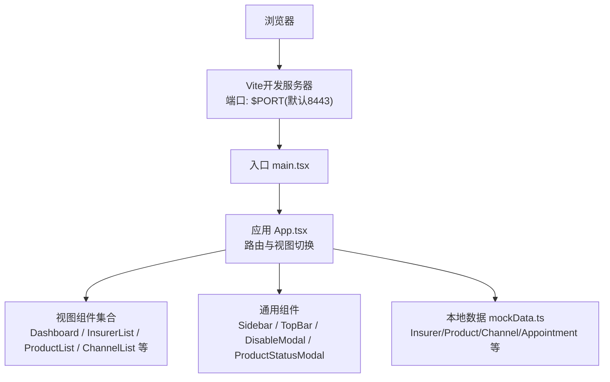
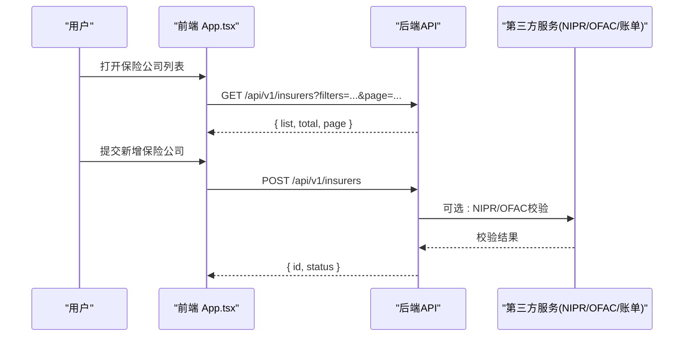
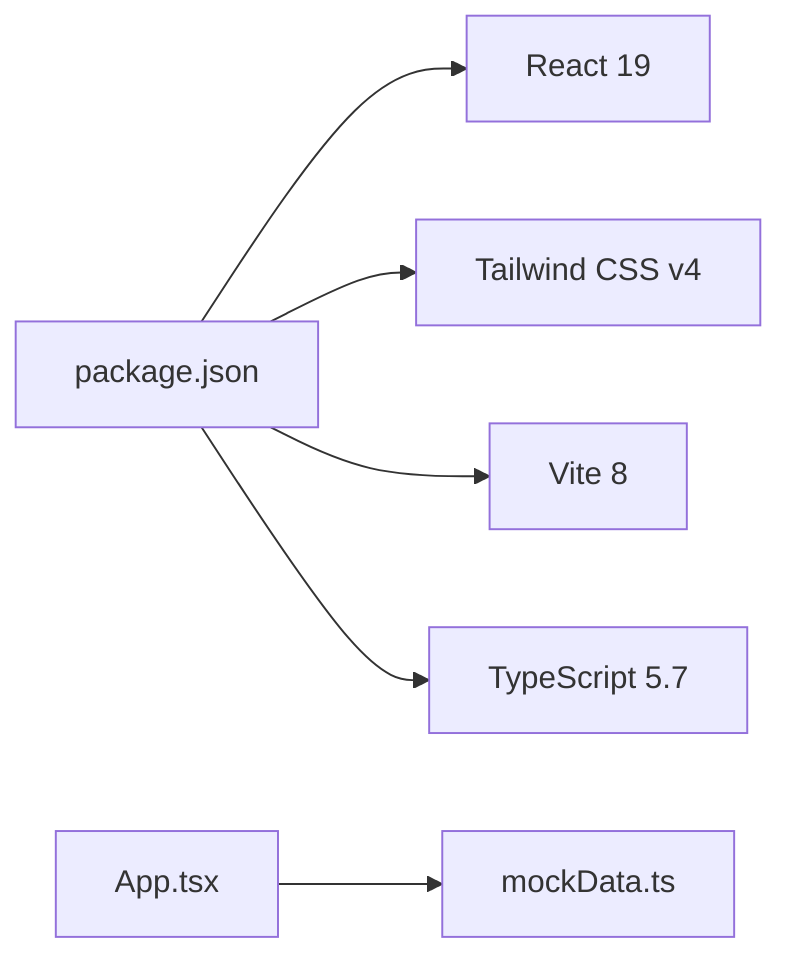

# API参考文档

<cite>
**本文引用的文件**
- [产品功能清单_V1.0.0.md](file://产品需求/产品功能清单_V1.0.0.md)
- [package.json](file://产品方案/UI-V1.0/package.json)
- [App.tsx](file://产品方案/UI-V1.0/src/App.tsx)
- [mockData.ts](file://产品方案/UI-V1.0/src/data/mockData.ts)
</cite>

## 目录
1. [简介](#简介)
2. [项目结构](#项目结构)
3. [核心组件](#核心组件)
4. [架构总览](#架构总览)
5. [详细组件分析](#详细组件分析)
6. [依赖分析](#依赖分析)
7. [性能考虑](#性能考虑)
8. [故障排查指南](#故障排查指南)
9. [结论](#结论)
10. [附录](#附录)

## 简介
本API参考文档面向OverInsurData平台（海外保险数字化平台）的V1.0版本，聚焦保险公司管理与渠道管理两大模块。文档基于现有前端工程与产品需求，梳理内部组件API、数据接口定义、第三方集成点（如NIPR、OFAC）、错误处理机制，并给出Mock API使用方法、数据格式规范与接口版本管理策略。读者可据此快速理解前后端交互契约、扩展新能力或对接第三方系统。

## 项目结构
当前仓库包含“产品需求”和“产品方案/UI-V1.0”两部分：
- 产品需求：以操作级功能清单形式定义业务边界与流程，是API契约的来源依据。
- 产品方案/UI-V1.0：基于React + Vite的前端原型，提供路由视图、侧边栏导航、顶部栏、以及用于演示的本地Mock数据。

图表来源
- [package.json:1-30](file://产品方案/UI-V1.0/package.json#L1-L30)
- [App.tsx:1-123](file://产品方案/UI-V1.0/src/App.tsx#L1-L123)

章节来源
- [package.json:1-30](file://产品方案/UI-V1.0/package.json#L1-L30)
- [App.tsx:1-123](file://产品方案/UI-V1.0/src/App.tsx#L1-L123)

## 核心组件
- 路由与应用容器：App.tsx负责视图切换、参数传递与模态框状态管理，是前端控制流的核心。
- 视图层：各业务视图（保险公司列表/详情/表单、产品列表/详情/表单、合作、财务、渠道层级、入驻、主数据等）通过App路由挂载。
- Mock数据层：mockData.ts提供保险公司、产品、渠道、Appointment等实体类型与示例数据，供前端页面渲染与交互使用。
- 配置与脚本：package.json定义了开发、构建、预览与格式化脚本，以及运行时与开发依赖。

章节来源
- [App.tsx:1-123](file://产品方案/UI-V1.0/src/App.tsx#L1-L123)
- [mockData.ts:1-444](file://产品方案/UI-V1.0/src/data/mockData.ts#L1-L444)
- [package.json:1-30](file://产品方案/UI-V1.0/package.json#L1-L30)

## 架构总览
从前端到后端（待实现）的调用关系如下：
- 前端通过视图组件发起请求（查询、创建、更新、删除、导入导出等）。
- 后端提供RESTful API，按业务域划分（保险公司、产品、渠道、Appointment、合规、财务结算等）。
- 第三方服务：NIPR牌照校验、OFAC制裁筛查、账单/保费对账（CSV/Excel/EDI/API）。

图表来源
- [App.tsx:1-123](file://产品方案/UI-V1.0/src/App.tsx#L1-L123)
- [mockData.ts:1-444](file://产品方案/UI-V1.0/src/data/mockData.ts#L1-L444)

## 详细组件分析

### 保险公司管理API
覆盖范围：新增、编辑、停用/启用、详情、列表查询、批量导入、批量导出、变更历史、重复检测。

- 公共接口约定
  - 基础路径：/api/v1/insurers
  - 认证：建议JWT/Bearer Token
  - 分页：page, pageSize
  - 排序：sortBy, sortOrder
  - 筛选：name, naicCode, type, status, region, lines, ratingRange
  - 返回统一结构：{ code, message, data }

- 接口清单（摘要）
  - 列表查询
    - GET /api/v1/insurers
    - 参数：见上；支持关键词、公司类型、状态、评级区间、大区、业务线、排序、分页
    - 返回：{ list: Insurer[], total: number, page: number, pageSize: number }
  - 新增
    - POST /api/v1/insurers
    - 入参：Insurer（含基本信息、监管信息、总部、财务评级、结算信息、附件ID等）
    - 返回：{ id, status }
  - 编辑
    - PUT /api/v1/insurers/:id
    - 入参：部分字段更新
    - 返回：{ id, updatedFields }
  - 停用/启用
    - PATCH /api/v1/insurers/:id/status
    - 入参：{ status: 'inactive'|'active', reason }
    - 返回：{ success }
  - 详情
    - GET /api/v1/insurers/:id
    - 返回：Insurer + 关联产品/渠道/业绩概览
  - 批量导入
    - POST /api/v1/insurers/import
    - 入参：multipart/form-data (Excel/CSV)，可选字段映射
    - 返回：{ taskId, previewUrl, errorReportUrl }
  - 批量导出
    - GET /api/v1/insurers/export
    - 参数：fields, format(xlsx|csv), includeRelations
    - 返回：文件流
  - 变更历史
    - GET /api/v1/insurers/:id/audit
    - 参数：fromDate, toDate, operator, field
    - 返回：{ changes[] }
  - 重复检测
    - POST /api/v1/insurers/duplicate-check
    - 入参：naicCode, name
    - 返回：{ groups[] }

- 数据模型（Insurer）
  - 关键字段：id, name, shortName, naicCode, type, status, amBestRating, spRating, headquarters, state, region, founded, website, totalPremium, policyCount, lossRatio, renewalRate, channelCount, productCount, settlementCycle, coopStatus, contractExpiry, lines, commissionIncome
  - 枚举：type∈{Admitted, Non-Admitted}；status∈{active, inactive, pending}；region∈{Northeast, Southeast, Midwest, West}；settlementCycle∈{Monthly, Quarterly}；coopStatus∈{active, negotiating, expiring, terminated}

- 使用示例（概念）
  - 列表查询：GET /api/v1/insurers?type=Admitted&status=active&page=1&pageSize=20
  - 新增：POST /api/v1/insurers，Body为Insurer对象
  - 停用：PATCH /api/v1/insurers/{id}/status，Body为{ status: "inactive", reason: "合规问题" }

章节来源
- [产品功能清单_V1.0.0.md:40-182](file://产品需求/产品功能清单_V1.0.0.md#L40-L182)
- [mockData.ts:1-347](file://产品方案/UI-V1.0/src/data/mockData.ts#L1-L347)

### 保险产品管理API
覆盖范围：新增、编辑、上下架、详情、列表查询、费率方案管理、可售州管理、核保规则配置、培训材料管理、业绩看板。

- 公共接口约定
  - 基础路径：/api/v1/products
  - 分页/排序/筛选：同保险公司模块
  - 版本化：versioned=true时返回版本对比

- 接口清单（摘要）
  - 列表查询：GET /api/v1/products
  - 新增：POST /api/v1/products
  - 编辑：PUT /api/v1/products/:id
  - 上下架：PATCH /api/v1/products/:id/status
  - 详情：GET /api/v1/products/:id
  - 费率方案：POST/PUT/DELETE /api/v1/products/:id/ratePlans
  - 可售州：PATCH /api/v1/products/:id/states
  - 核保规则：POST/PUT /api/v1/products/:id/rules
  - 培训材料：POST/PUT/DELETE /api/v1/products/:id/training
  - 业绩看板：GET /api/v1/products/:id/analytics

- 数据模型（Product）
  - 关键字段：id, insurerId, name, code, line, subLine, type, status, states, premium, policyCount, lossRatio, renewalRate, launchDate
  - 枚举：type∈{Individual, Group, Voluntary}；status∈{on-sale, off-sale, paused, pending}

- 使用示例（概念）
  - 上架：PATCH /api/v1/products/{id}/status，Body为{ status: "on-sale" }
  - 可售州：PATCH /api/v1/products/{id}/states，Body为{ states: ["CA","NY"] }

章节来源
- [产品功能清单_V1.0.0.md:184-369](file://产品需求/产品功能清单_V1.0.0.md#L184-L369)
- [mockData.ts:349-362](file://产品方案/UI-V1.0/src/data/mockData.ts#L349-L362)

### 渠道管理API
覆盖范围：渠道主数据、层级与组织架构、入驻与准入、产品授权与出单权限、佣金方案配置与管理、佣金计算与结算、绩效考核、培训与认证、渠道门户、数据分析。

- 公共接口约定
  - 基础路径：/api/v1/channels
  - 层级：parentId, level
  - 权限：productAuthorizations[]

- 接口清单（摘要）
  - 列表/详情：GET /api/v1/channels, GET /api/v1/channels/:id
  - 新增/编辑：POST/PUT /api/v1/channels
  - 层级树：GET /api/v1/channels/tree
  - 入驻：POST /api/v1/channels/onboarding
  - 授权：POST /api/v1/channels/:id/authorizations
  - 佣金方案：POST/PUT /api/v1/channels/:id/commissionSchemes
  - 结算：POST /api/v1/channels/:id/settlements
  - 绩效：GET /api/v1/channels/:id/performance
  - 培训认证：POST /api/v1/channels/:id/certifications
  - 门户：GET /api/v1/channels/:id/portal

- 数据模型（Channel）
  - 关键字段：id, name, type, status, tier, parentId, level, agentCount, totalPremium, policyCount, lossRatio, renewalRate, commissionRate, state, region, joinDate, npnCode, manager
  - 枚举：type∈{Independent Agency, Broker, MGA, Wholesale Broker, Direct}；status∈{active, inactive, onboarding, suspended}；tier∈{Platinum, Gold, Silver, Standard}

- 使用示例（概念）
  - 新增渠道：POST /api/v1/channels，Body为Channel对象
  - 授权产品：POST /api/v1/channels/{id}/authorizations，Body为{ productIds: [...] }

章节来源
- [产品功能清单_V1.0.0.md:372-700](file://产品需求/产品功能清单_V1.0.0.md#L372-L700)
- [mockData.ts:364-377](file://产品方案/UI-V1.0/src/data/mockData.ts#L364-L377)

### Appointment与合规API
覆盖范围：申请、状态跟踪、续期、终止、NIPR牌照校验、牌照到期提醒、出单合规拦截、合规报告生成、OFAC制裁筛查。

- 公共接口约定
  - 基础路径：/api/v1/appointments, /api/v1/compliance
  - 校验：NPN、牌照有效期、Appointment有效性、产品可售州、培训认证、出单限额

- 接口清单（摘要）
  - 申请：POST /api/v1/appointments
  - 状态跟踪：GET /api/v1/appointments/:id
  - 续期：POST /api/v1/appointments/:id/renew
  - 终止：POST /api/v1/appointments/:id/terminate
  - NIPR校验：POST /api/v1/compliance/nipr
  - 到期提醒：GET /api/v1/compliance/license-expiry
  - 合规拦截：POST /api/v1/compliance/quota-check
  - 合规报告：POST /api/v1/compliance/reports
  - OFAC筛查：POST /api/v1/compliance/ofac

- 使用示例（概念）
  - NIPR校验：POST /api/v1/compliance/nipr，Body为{ npn: "NPNxxxxxx" }
  - OFAC筛查：POST /api/v1/compliance/ofac，Body为{ entity: {...} }

章节来源
- [产品功能清单_V1.0.0.md:552-700](file://产品需求/产品功能清单_V1.0.0.md#L552-L700)

### 财务与结算API
覆盖范围：佣金账单导入、解析、对账、差异处理、结算周期配置、保费对账。

- 公共接口约定
  - 基础路径：/api/v1/finance
  - 文件格式：CSV/Excel/EDI/API拉取
  - 对账：逐笔比对、差异分类、调整单、追讨单

- 接口清单（摘要）
  - 账单导入：POST /api/v1/finance/bills/import
  - 账单解析：POST /api/v1/finance/bills/:id/parse
  - 对账：POST /api/v1/finance/reconciliations
  - 差异处理：PATCH /api/v1/finance/reconciliations/:id/disputes
  - 结算周期：POST/PUT /api/v1/finance/settlement-cycles
  - 保费对账：POST /api/v1/finance/premium-reconciliation

- 使用示例（概念）
  - 导入账单：POST /api/v1/finance/bills/import，multipart/form-data
  - 发起对账：POST /api/v1/finance/reconciliations，Body为{ insurerId, period }

章节来源
- [产品功能清单_V1.0.0.md:703-800](file://产品需求/产品功能清单_V1.0.0.md#L703-L800)

### 第三方集成API
- NIPR牌照校验
  - 目的：实时校验代理人牌照有效性和授权范围
  - 触发点：Appointment申请、出单前合规拦截
  - 输入：NPN、州、业务线
  - 输出：状态（有效/过期/吊销）、持牌州、持牌业务线
- OFAC制裁筛查
  - 目的：防止与受制裁实体/个人合作
  - 触发点：渠道入驻、代理人新增
  - 输入：主体名称、地址、注册信息等
  - 输出：未命中/疑似命中/确认命中
- 账单/保费对账
  - 目的：自动化对账与差异处理
  - 输入：CSV/Excel/EDI/API
  - 输出：匹配结果、差异明细、调整/追讨单

章节来源
- [产品功能清单_V1.0.0.md:619-700](file://产品需求/产品功能清单_V1.0.0.md#L619-L700)
- [产品功能清单_V1.0.0.md:703-800](file://产品需求/产品功能清单_V1.0.0.md#L703-L800)

### 错误处理机制
- 统一响应结构
  - { code: string, message: string, data?: any }
  - 常见code：SUCCESS, VALIDATION_ERROR, UNAUTHORIZED, FORBIDDEN, NOT_FOUND, CONFLICT, SERVER_ERROR
- 前端错误处理
  - 网络异常：重试策略（指数退避）、降级展示
  - 业务异常：根据code提示用户，记录日志
  - 文件导入：返回taskId，轮询任务状态，下载错误报告
- 审计与追踪
  - 关键操作记录操作人、时间、前后值
  - 合规拦截事件记录原因与建议

章节来源
- [产品功能清单_V1.0.0.md:155-182](file://产品需求/产品功能清单_V1.0.0.md#L155-L182)
- [产品功能清单_V1.0.0.md:650-700](file://产品需求/产品功能清单_V1.0.0.md#L650-L700)

### Mock API使用方法
- 数据来源：mockData.ts提供Insurer、Product、Channel、Appointment等实体与示例数据
- 使用方式：
  - 在视图中直接引用mock数据渲染列表与详情
  - 模拟CRUD：在本地维护内存副本，执行增删改查后刷新视图
  - 模拟异步：使用setTimeout/Promise模拟网络延迟
- 扩展建议：
  - 将mockData.ts中的类型抽取为共享类型定义
  - 逐步替换为真实API调用，保持接口一致

章节来源
- [mockData.ts:1-444](file://产品方案/UI-V1.0/src/data/mockData.ts#L1-L444)
- [App.tsx:1-123](file://产品方案/UI-V1.0/src/App.tsx#L1-L123)

### 数据格式规范
- 命名规范：snake_case用于JSON字段（如total_premium），枚举值使用小写下划线
- 数值精度：金额保留两位小数，百分比保留一位小数
- 日期时间：ISO 8601（UTC），如2026-01-01T00:00:00Z
- 分页：page≥1，pageSize≤100
- 文件上传：multipart/form-data，限制大小与类型（xlsx/csv/pdf/mp4）
- 国际化：键名使用英文，显示文本由前端i18n管理

章节来源
- [mockData.ts:1-444](file://产品方案/UI-V1.0/src/data/mockData.ts#L1-L444)

### 接口版本管理策略
- 版本前缀：/api/v1/*，后续大版本升级使用/api/v2/*
- 兼容性：向后兼容新增字段，废弃字段标记deprecated并保留至少一个版本
- 变更通知：发布说明、变更日志、灰度发布
- 客户端适配：前端通过环境变量或特性开关控制版本

章节来源
- [package.json:1-30](file://产品方案/UI-V1.0/package.json#L1-L30)

## 依赖分析
- 前端依赖：React 19、React DOM 19、Tailwind CSS v4、Vite 8、TypeScript 5.7
- 构建与脚本：dev/build/preview/format
- 运行时：无服务端依赖，纯前端应用

图表来源
- [package.json:1-30](file://产品方案/UI-V1.0/package.json#L1-L30)
- [App.tsx:1-123](file://产品方案/UI-V1.0/src/App.tsx#L1-L123)
- [mockData.ts:1-444](file://产品方案/UI-V1.0/src/data/mockData.ts#L1-L444)

章节来源
- [package.json:1-30](file://产品方案/UI-V1.0/package.json#L1-L30)

## 性能考虑
- 列表分页与懒加载：避免一次性加载大量数据
- 缓存策略：对静态数据（如地区、业务线）进行本地缓存
- 文件导入导出：后台任务+进度反馈，避免阻塞UI
- 图表渲染：按需加载图表库，减少首屏体积
- 网络优化：合并请求、去抖/节流、错误重试

[本节为通用指导，不直接分析具体文件]

## 故障排查指南
- 常见问题
  - 列表为空：检查筛选条件与分页参数
  - 导入失败：查看错误报告URL，修正字段映射
  - 合规拦截：查看拦截原因（牌照、Appointment、产品授权、可售州、培训认证、出单限额）
- 调试步骤
  - 前端：控制台日志、网络面板抓包
  - 后端：检查请求体、响应码、审计日志
  - 第三方：NIPR/OFAC返回码与消息
- 恢复措施
  - 修正数据后重试
  - 临时豁免需审批
  - 回滚版本或切换Mock

章节来源
- [产品功能清单_V1.0.0.md:650-700](file://产品需求/产品功能清单_V1.0.0.md#L650-L700)

## 结论
本API参考文档基于现有前端工程与产品需求，构建了保险公司与渠道管理的完整API契约框架，明确了数据模型、接口清单、第三方集成点与错误处理机制。建议后续逐步实现后端服务，保持与Mock一致的接口规范，确保平滑迁移与扩展。

[本节为总结，不直接分析具体文件]

## 附录
- 术语表
  - NAIC：美国国家保险生产者注册局编码
  - NPN：国家生产者编号
  - OFAC：美国财政部海外资产控制办公室
  - EDI：电子数据交换
- 参考文件
  - 产品功能清单：操作级功能定义
  - 前端工程：App.tsx、mockData.ts、package.json

[本节为补充信息，不直接分析具体文件]