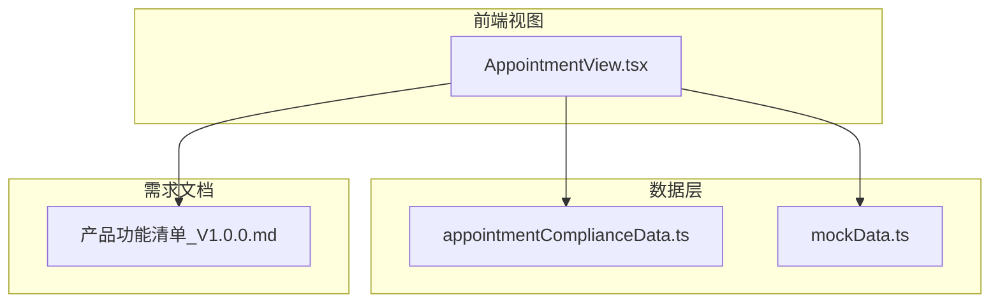
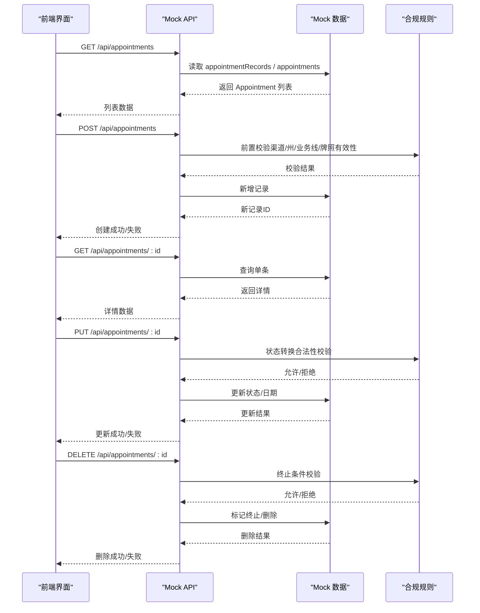
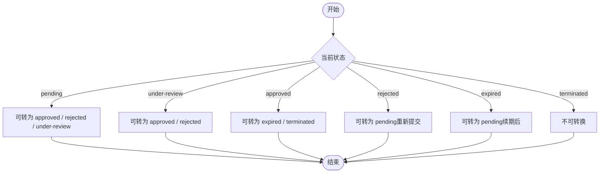
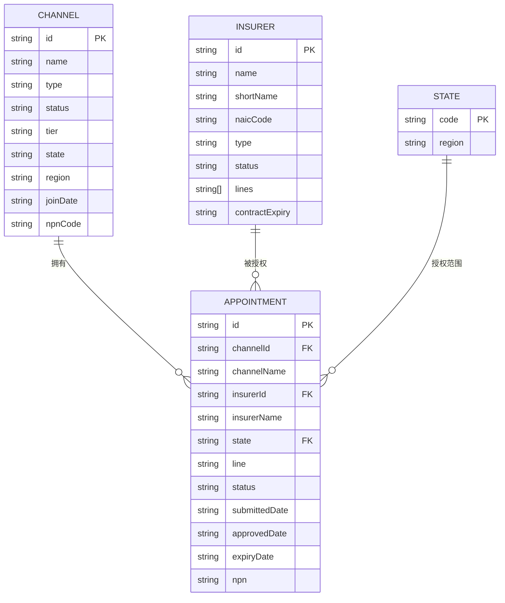
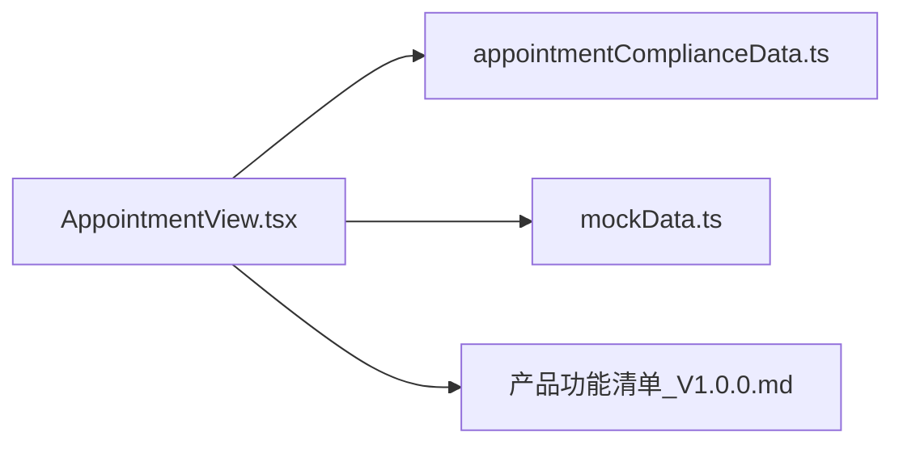

# Appointment API

<cite>
**本文引用的文件**
- [AppointmentView.tsx](file://产品方案/UI-V1.0/src/views/AppointmentView.tsx)
- [appointmentComplianceData.ts](file://产品方案/UI-V1.0/src/data/appointmentComplianceData.ts)
- [mockData.ts](file://产品方案/UI-V1.0/src/data/mockData.ts)
- [产品功能清单_V1.0.0.md](file://产品需求/产品功能清单_V1.0.0.md)
</cite>

## 目录
1. [简介](#简介)
2. [项目结构](#项目结构)
3. [核心组件](#核心组件)
4. [架构总览](#架构总览)
5. [详细组件分析](#详细组件分析)
6. [依赖关系分析](#依赖关系分析)
7. [性能考虑](#性能考虑)
8. [故障排查指南](#故障排查指南)
9. [结论](#结论)
10. [附录](#附录)

## 简介
本文件为 OverInsurData 平台的 Appointment 管理模块提供面向前端的 Mock API 文档，覆盖以下端点：
- GET /api/appointments（获取 Appointment 列表）
- POST /api/appointments（提交 Appointment 申请）
- GET /api/appointments/:id（获取 Appointment 详情）
- PUT /api/appointments/:id（更新 Appointment 状态）
- DELETE /api/appointments/:id（撤销/终止 Appointment）

同时定义 Appointment 数据模型字段、状态流转规则，以及与渠道、保险公司、州的关联关系管理要点。

## 项目结构
与 Appointment 相关的代码主要位于前端视图与数据层：
- 视图层：AppointmentView.tsx 实现“申请向导”、“列表与筛选”、“续期与终止”、“NIPR 牌照管理”、“合规拦截日志”等界面逻辑。
- 数据层：
  - appointmentComplianceData.ts 提供扩展的 AppointmentRecord、NIPR 牌照、合规拦截日志、OFAC 筛查、合规报告等数据结构与样例数据。
  - mockData.ts 提供基础 Appointment 类型与示例数据。
- 需求层：产品功能清单_V1.0.0.md 定义了 Appointment 申请、状态跟踪、续期、终止、NIPR 校验、合规拦截等能力边界。

图表来源
- [AppointmentView.tsx:1-120](file://产品方案/UI-V1.0/src/views/AppointmentView.tsx#L1-L120)
- [appointmentComplianceData.ts:1-40](file://产品方案/UI-V1.0/src/data/appointmentComplianceData.ts#L1-L40)
- [mockData.ts:71-84](file://产品方案/UI-V1.0/src/data/mockData.ts#L71-L84)
- [产品功能清单_V1.0.0.md:552-700](file://产品需求/产品功能清单_V1.0.0.md#L552-L700)

章节来源
- [AppointmentView.tsx:1-120](file://产品方案/UI-V1.0/src/views/AppointmentView.tsx#L1-L120)
- [appointmentComplianceData.ts:1-40](file://产品方案/UI-V1.0/src/data/appointmentComplianceData.ts#L1-L40)
- [mockData.ts:71-84](file://产品方案/UI-V1.0/src/data/mockData.ts#L71-L84)
- [产品功能清单_V1.0.0.md:552-700](file://产品需求/产品功能清单_V1.0.0.md#L552-L700)

## 核心组件
- 申请向导：四步式流程（选择渠道→选择保险公司→配置州与业务线→确认提交），支持紧急标记与 NIPR 自动提交提示。
- 列表与筛选：按状态、关键词搜索，展示渠道、保险公司、州/业务线、状态、日期、到期提醒等。
- 续期与终止：到期预警、批量续期、终止审批与影响范围预览。
- NIPR 牌照管理：验证、差异处理、CE 学时进度。
- 合规拦截：出单时基于 Appointment、牌照、OFAC、渠道状态等规则进行拦截或放行。

章节来源
- [AppointmentView.tsx:71-210](file://产品方案/UI-V1.0/src/views/AppointmentView.tsx#L71-L210)
- [AppointmentView.tsx:212-318](file://产品方案/UI-V1.0/src/views/AppointmentView.tsx#L212-L318)
- [AppointmentView.tsx:401-539](file://产品方案/UI-V1.0/src/views/AppointmentView.tsx#L401-L539)
- [appointmentComplianceData.ts:104-137](file://产品方案/UI-V1.0/src/data/appointmentComplianceData.ts#L104-L137)

## 架构总览
前端通过调用 Mock API 完成 Appointment 的增删改查与状态变更；数据来源于本地 Mock 数据，并受合规规则约束。

图表来源
- [AppointmentView.tsx:212-318](file://产品方案/UI-V1.0/src/views/AppointmentView.tsx#L212-L318)
- [appointmentComplianceData.ts:104-137](file://产品方案/UI-V1.0/src/data/appointmentComplianceData.ts#L104-L137)
- [mockData.ts:71-84](file://产品方案/UI-V1.0/src/data/mockData.ts#L71-L84)

## 详细组件分析

### 数据模型：Appointment
- 基础字段（来自 mockData.ts）
  - id: string（唯一标识）
  - channelId: string（渠道ID）
  - channelName: string（渠道名称）
  - insurerId: string（保险公司ID）
  - insurerName: string（保险公司名称）
  - state: string（州缩写）
  - line: string（业务线）
  - status: 'approved' | 'pending' | 'rejected' | 'expired' | 'terminated'
  - submittedDate: string（提交日期）
  - approvedDate?: string（批准日期，可选）
  - expiryDate: string（到期日）
  - npn: string（代理人NPN）
- 扩展字段（来自 appointmentComplianceData.ts）
  - channelNpn: string（渠道NPN）
  - insurerShort: string（保险公司简称）
  - terminatedDate?: string（终止日期）
  - terminationReason?: string（终止原因）
  - renewalStatus?: 'not-due' | 'due-soon' | 'in-progress' | 'renewed'（续期状态）
  - daysToExpiry: number（距到期天数）
  - submittedBy: string（提交人）
  - processingDays?: number（处理天数）
  - rejectionReason?: string（拒绝原因）
  - niprTransactionId?: string（NIPR 交易号）

字段约束与说明
- 必填：id、channelId、channelName、insurerId、insurerName、state、line、status、submittedDate、expiryDate、npn。
- 可选：approvedDate、terminatedDate、terminationReason、rejectionReason、niprTransactionId、processingDays。
- 状态枚举：approved、pending、rejected、expired、terminated；在追踪视图中还包含 under-review（审核中）。
- 日期格式：YYYY-MM-DD。
- 州：美国州缩写（如 CA、NY、TX）。
- 业务线：P&C、Auto、Life、Health、Commercial、Specialty、Professional、Surplus Lines 等。

章节来源
- [mockData.ts:71-84](file://产品方案/UI-V1.0/src/data/mockData.ts#L71-L84)
- [appointmentComplianceData.ts:3-25](file://产品方案/UI-V1.0/src/data/appointmentComplianceData.ts#L3-L25)

### 接口定义：GET /api/appointments
- 功能：获取 Appointment 列表，支持分页、排序、筛选。
- 请求参数（Query）
  - page: number（页码，默认1）
  - pageSize: number（每页条数，默认20）
  - status: string[]（状态过滤，如 pending、approved、under-review、expired、rejected、terminated）
  - search: string（关键词：渠道名、保险公司简称、州）
  - state: string（州过滤）
  - line: string（业务线过滤）
  - sortBy: string（排序字段：submittedDate、expiryDate、daysToExpiry）
  - sortOrder: 'asc' | 'desc'
- 响应体（Array<AppointmentRecord>）
  - 包含基础字段与扩展字段（见数据模型）
- 错误码
  - 400：参数非法（如 pageSize > 100）
  - 500：服务器内部错误

章节来源
- [AppointmentView.tsx:212-318](file://产品方案/UI-V1.0/src/views/AppointmentView.tsx#L212-L318)
- [appointmentComplianceData.ts:27-40](file://产品方案/UI-V1.0/src/data/appointmentComplianceData.ts#L27-L40)

### 接口定义：POST /api/appointments
- 功能：提交 Appointment 申请，系统将通过 NIPR 提交并进入审核流程。
- 请求体
  - channelId: string（必填）
  - insurerId: string（必填）
  - state: string（必填）
  - line: string（必填）
  - reason: string（选填，申请说明）
  - urgent: boolean（选填，是否紧急）
  - npn: string（必填）
- 响应体
  - { id, status: 'pending', submittedDate, niprTransactionId? }
- 前置校验
  - 渠道状态有效、州授权、业务线匹配、NPN 有效性（参考合规规则）
- 错误码
  - 400：校验失败（如州未授权、NPN无效）
  - 409：重复申请（同一渠道/保险公司/州/业务线已存在 pending）
  - 500：NIPR 提交失败

章节来源
- [AppointmentView.tsx:71-210](file://产品方案/UI-V1.0/src/views/AppointmentView.tsx#L71-L210)
- [appointmentComplianceData.ts:128-137](file://产品方案/UI-V1.0/src/data/appointmentComplianceData.ts#L128-L137)

### 接口定义：GET /api/appointments/:id
- 功能：获取 Appointment 详情。
- 路径参数
  - id: string
- 响应体
  - AppointmentRecord 完整对象
- 错误码
  - 404：不存在

章节来源
- [appointmentComplianceData.ts:27-40](file://产品方案/UI-V1.0/src/data/appointmentComplianceData.ts#L27-L40)

### 接口定义：PUT /api/appointments/:id
- 功能：更新 Appointment 状态（如从 pending → approved/rejected/under-review；approved → expired/terminated）。
- 路径参数
  - id: string
- 请求体
  - status: string（目标状态）
  - approvedDate?: string（批准日期，当状态为 approved 时必填）
  - rejectedDate?: string（拒绝日期，当状态为 rejected 时建议填写）
  - terminationReason?: string（终止原因，当状态为 terminated 时必填）
  - niprTransactionId?: string（NIPR 交易号，用于关联外部系统）
- 响应体
  - 更新后的 AppointmentRecord
- 状态转换规则
  - pending → approved / rejected / under-review
  - under-review → approved / rejected
  - approved → expired / terminated
  - rejected → pending（重新提交）
  - expired → pending（续期后重新生效）
  - terminated → 不可逆
- 错误码
  - 400：非法状态转换
  - 404：不存在
  - 500：更新失败

图表来源
- [appointmentComplianceData.ts:27-40](file://产品方案/UI-V1.0/src/data/appointmentComplianceData.ts#L27-L40)
- [AppointmentView.tsx:212-318](file://产品方案/UI-V1.0/src/views/AppointmentView.tsx#L212-L318)

章节来源
- [appointmentComplianceData.ts:27-40](file://产品方案/UI-V1.0/src/data/appointmentComplianceData.ts#L27-L40)
- [AppointmentView.tsx:212-318](file://产品方案/UI-V1.0/src/views/AppointmentView.tsx#L212-L318)

### 接口定义：DELETE /api/appointments/:id
- 功能：撤销/终止 Appointment（不可逆）。
- 路径参数
  - id: string
- 请求体（可选）
  - terminationReason: string（终止原因）
- 响应体
  - { success: true }
- 错误码
  - 400：不允许终止（如非 approved 状态）
  - 404：不存在
  - 500：终止失败

章节来源
- [AppointmentView.tsx:401-539](file://产品方案/UI-V1.0/src/views/AppointmentView.tsx#L401-L539)
- [appointmentComplianceData.ts:27-40](file://产品方案/UI-V1.0/src/data/appointmentComplianceData.ts#L27-L40)

### 状态流转与合规规则
- 状态集合：pending、under-review、approved、rejected、expired、terminated。
- 转换规则：
  - pending → approved / rejected / under-review
  - under-review → approved / rejected
  - approved → expired / terminated
  - rejected → pending（重新提交）
  - expired → pending（续期后）
  - terminated → 不可逆
- 合规规则（出单拦截）：
  - 必须持有有效的 Appointment（approved 且未过期）
  - 渠道牌照有效且在对应州授权
  - OFAC 筛查通过
  - 渠道状态非暂停/终止

章节来源
- [appointmentComplianceData.ts:104-137](file://产品方案/UI-V1.0/src/data/appointmentComplianceData.ts#L104-L137)
- [产品功能清单_V1.0.0.md:552-700](file://产品需求/产品功能清单_V1.0.0.md#L552-L700)

### 关联关系管理：渠道、保险公司、州
- 渠道（Channel）
  - 字段：id、name、type、status、tier、state、region、joinDate、npnCode 等
  - 作用：作为 Appointment 的申请主体，需具备有效牌照与授权范围
- 保险公司（Insurer）
  - 字段：id、name、shortName、naicCode、type、status、lines、contractExpiry 等
  - 作用：Appointment 的目标机构，决定可售州与业务线
- 州（State）
  - 字段：state（缩写）、region（大区）
  - 作用：限定 Appointment 的地理授权范围

图表来源
- [mockData.ts:50-84](file://产品方案/UI-V1.0/src/data/mockData.ts#L50-L84)
- [mockData.ts:364-388](file://产品方案/UI-V1.0/src/data/mockData.ts#L364-L388)

章节来源
- [mockData.ts:50-84](file://产品方案/UI-V1.0/src/data/mockData.ts#L50-L84)
- [mockData.ts:364-388](file://产品方案/UI-V1.0/src/data/mockData.ts#L364-L388)

## 依赖关系分析
- 视图层依赖数据层提供的 AppointmentRecord、NIPR 牌照、合规拦截日志等数据结构。
- 数据层依赖 mockData.ts 的基础类型与样例数据。
- 需求文档定义了功能边界与交互流程，指导前后端实现一致性。

图表来源
- [AppointmentView.tsx:1-120](file://产品方案/UI-V1.0/src/views/AppointmentView.tsx#L1-L120)
- [appointmentComplianceData.ts:1-40](file://产品方案/UI-V1.0/src/data/appointmentComplianceData.ts#L1-L40)
- [mockData.ts:71-84](file://产品方案/UI-V1.0/src/data/mockData.ts#L71-L84)
- [产品功能清单_V1.0.0.md:552-700](file://产品需求/产品功能清单_V1.0.0.md#L552-L700)

章节来源
- [AppointmentView.tsx:1-120](file://产品方案/UI-V1.0/src/views/AppointmentView.tsx#L1-L120)
- [appointmentComplianceData.ts:1-40](file://产品方案/UI-V1.0/src/data/appointmentComplianceData.ts#L1-L40)
- [mockData.ts:71-84](file://产品方案/UI-V1.0/src/data/mockData.ts#L71-L84)
- [产品功能清单_V1.0.0.md:552-700](file://产品需求/产品功能清单_V1.0.0.md#L552-L700)

## 性能考虑
- 列表分页与筛选：后端应支持分页、排序与多条件筛选，减少数据传输量。
- 缓存策略：对频繁访问的 Appointment 列表与详情可做短期缓存。
- 批量操作：续期与终止支持批量，减少网络往返。
- 合规校验：前置校验应在服务端执行，避免无效请求。

[本节为通用性能建议，不直接分析具体文件]

## 故障排查指南
- 常见错误
  - 400：参数非法（如 pageSize 超限、状态转换非法）
  - 404：Appointment 不存在
  - 409：重复申请（同一渠道/保险公司/州/业务线已存在 pending）
  - 500：NIPR 提交失败、数据库更新失败
- 排查步骤
  - 检查请求参数是否符合接口定义
  - 查看合规规则是否触发拦截（如 Appointment 无效、牌照过期、OFAC 命中）
  - 核对状态转换是否合法
  - 查看 NIPR 交易号与外部系统回调

章节来源
- [appointmentComplianceData.ts:104-137](file://产品方案/UI-V1.0/src/data/appointmentComplianceData.ts#L104-L137)
- [AppointmentView.tsx:212-318](file://产品方案/UI-V1.0/src/views/AppointmentView.tsx#L212-L318)

## 结论
本 API 文档基于现有前端视图与数据层实现，明确了 Appointment 管理的核心接口、数据模型、状态流转与合规规则。通过 Mock API 可实现完整的申请、查询、更新与终止流程，并与渠道、保险公司、州建立清晰的关联关系。后续可结合后端服务与 NIPR 集成，进一步完善真实数据流与审计日志。

[本节为总结性内容，不直接分析具体文件]

## 附录
- 术语表
  - Appointment：渠道在特定州对特定保险公司的销售授权
  - NPN：国家保险生产者登记处编号
  - NIPR：国家保险生产者登记处
  - OFAC：美国财政部海外资产控制办公室制裁名单
- 参考文件
  - 产品功能清单_V1.0.0.md 中的 Appointment 相关功能点

[本节为补充信息，不直接分析具体文件]