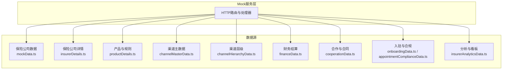
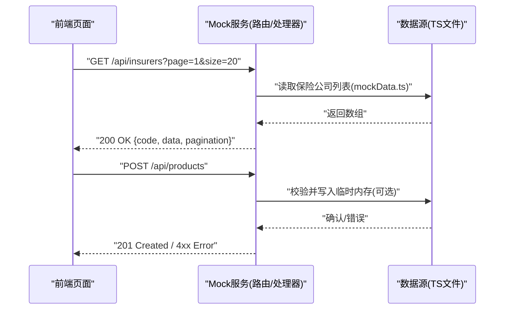
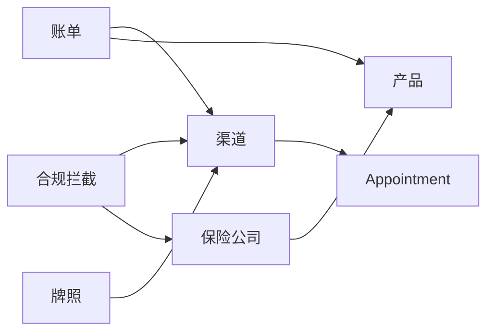

# Mock API端点

<cite>
**本文引用的文件**
- [mockData.ts](file://产品方案/UI-V1.0/src/data/mockData.ts)
- [insurerDetails.ts](file://产品方案/UI-V1.0/src/data/insurerDetails.ts)
- [productDetails.ts](file://产品方案/UI-V1.0/src/data/productDetails.ts)
- [channelMasterData.ts](file://产品方案/UI-V1.0/src/data/channelMasterData.ts)
- [financeData.ts](file://产品方案/UI-V1.0/src/data/financeData.ts)
- [channelHierarchyData.ts](file://产品方案/UI-V1.0/src/data/channelHierarchyData.ts)
- [cooperationData.ts](file://产品方案/UI-V1.0/src/data/cooperationData.ts)
- [onboardingData.ts](file://产品方案/UI-V1.0/src/data/onboardingData.ts)
- [appointmentComplianceData.ts](file://产品方案/UI-V1.0/src/data/appointmentComplianceData.ts)
- [insurerAnalyticsData.ts](file://产品方案/UI-V1.0/src/data/insurerAnalyticsData.ts)
</cite>

## 目录
1. [简介](#简介)
2. [项目结构](#项目结构)
3. [核心组件](#核心组件)
4. [架构总览](#架构总览)
5. [详细组件分析](#详细组件分析)
6. [依赖关系分析](#依赖关系分析)
7. [性能考虑](#性能考虑)
8. [故障排查指南](#故障排查指南)
9. [结论](#结论)
10. [附录](#附录)

## 简介
本文件为 OverInsurData 平台的“Mock API端点”文档，覆盖保险公司管理、产品管理、渠道管理、财务结算等模块的模拟后端接口。内容包含：
- HTTP方法与URL路径约定
- 请求参数（查询参数、分页、过滤）
- 响应体结构与示例（成功与错误）
- Mock数据生成规则、测试场景覆盖与性能建议
- 在开发环境中集成与使用这些Mock接口的指引

说明：本项目以TypeScript数据文件作为Mock数据源，前端通过统一的数据访问层或本地Mock服务暴露REST风格API，供前端开发与联调使用。

## 项目结构
- 数据定义集中在 src/data 下的多个TS文件中，按业务域划分：
  - 保险公司主数据与详情：mockData.ts、insurerDetails.ts
  - 产品与核保规则：productDetails.ts
  - 渠道主数据与层级：channelMasterData.ts、channelHierarchyData.ts
  - 财务结算与对账：financeData.ts
  - 合作管理与合同：cooperationData.ts
  - 入驻流程与合规：onboardingData.ts、appointmentComplianceData.ts
  - 分析与看板：insurerAnalyticsData.ts

图表来源
- [mockData.ts:1-444](file://产品方案/UI-V1.0/src/data/mockData.ts#L1-L444)
- [insurerDetails.ts:1-140](file://产品方案/UI-V1.0/src/data/insurerDetails.ts#L1-L140)
- [productDetails.ts:1-329](file://产品方案/UI-V1.0/src/data/productDetails.ts#L1-L329)
- [channelMasterData.ts:1-449](file://产品方案/UI-V1.0/src/data/channelMasterData.ts#L1-L449)
- [channelHierarchyData.ts:1-261](file://产品方案/UI-V1.0/src/data/channelHierarchyData.ts#L1-L261)
- [financeData.ts:1-273](file://产品方案/UI-V1.0/src/data/financeData.ts#L1-L273)
- [cooperationData.ts:1-422](file://产品方案/UI-V1.0/src/data/cooperationData.ts#L1-L422)
- [onboardingData.ts:1-528](file://产品方案/UI-V1.0/src/data/onboardingData.ts#L1-L528)
- [appointmentComplianceData.ts:1-200](file://产品方案/UI-V1.0/src/data/appointmentComplianceData.ts#L1-L200)
- [insurerAnalyticsData.ts:1-275](file://产品方案/UI-V1.0/src/data/insurerAnalyticsData.ts#L1-L275)

章节来源
- [mockData.ts:1-444](file://产品方案/UI-V1.0/src/data/mockData.ts#L1-L444)
- [insurerDetails.ts:1-140](file://产品方案/UI-V1.0/src/data/insurerDetails.ts#L1-L140)
- [productDetails.ts:1-329](file://产品方案/UI-V1.0/src/data/productDetails.ts#L1-L329)
- [channelMasterData.ts:1-449](file://产品方案/UI-V1.0/src/data/channelMasterData.ts#L1-L449)
- [channelHierarchyData.ts:1-261](file://产品方案/UI-V1.0/src/data/channelHierarchyData.ts#L1-L261)
- [financeData.ts:1-273](file://产品方案/UI-V1.0/src/data/financeData.ts#L1-L273)
- [cooperationData.ts:1-422](file://产品方案/UI-V1.0/src/data/cooperationData.ts#L1-L422)
- [onboardingData.ts:1-528](file://产品方案/UI-V1.0/src/data/onboardingData.ts#L1-L528)
- [appointmentComplianceData.ts:1-200](file://产品方案/UI-V1.0/src/data/appointmentComplianceData.ts#L1-L200)
- [insurerAnalyticsData.ts:1-275](file://产品方案/UI-V1.0/src/data/insurerAnalyticsData.ts#L1-L275)

## 核心组件
- 保险公司管理
  - 列表、详情、变更历史、联系人、文档、重复检测分组
- 产品管理
  - 产品清单、费率计划、州授权、核保规则、培训资料、产品表现
- 渠道管理
  - 渠道组织、代理人、资质文档、变更历史、导入结果、统计
  - 渠道层级树、关系、白标配置、团队绩效
- 财务结算
  - 佣金账单导入、解析行项、差异对账、结算周期、保费对账、模板、结算历史
- 合作管理
  - 合作关系、合同、结算参数、联系人、续期管理、产品接入
- 入驻与合规
  - 入驻申请、步骤流水线、NIPR验证、背景调查、E&O验证、电子合同、培训认证、账号设置
  - Appointment记录、牌照、合规拦截日志、规则、OFAC筛查、报告
- 分析与看板
  - 保险公司KPI、月度趋势、区域与州表现、渠道贡献、赔付率、续保率

章节来源
- [insurerDetails.ts:1-140](file://产品方案/UI-V1.0/src/data/insurerDetails.ts#L1-L140)
- [productDetails.ts:1-329](file://产品方案/UI-V1.0/src/data/productDetails.ts#L1-L329)
- [channelMasterData.ts:1-449](file://产品方案/UI-V1.0/src/data/channelMasterData.ts#L1-L449)
- [channelHierarchyData.ts:1-261](file://产品方案/UI-V1.0/src/data/channelHierarchyData.ts#L1-L261)
- [financeData.ts:1-273](file://产品方案/UI-V1.0/src/data/financeData.ts#L1-L273)
- [cooperationData.ts:1-422](file://产品方案/UI-V1.0/src/data/cooperationData.ts#L1-L422)
- [onboardingData.ts:1-528](file://产品方案/UI-V1.0/src/data/onboardingData.ts#L1-L528)
- [appointmentComplianceData.ts:1-200](file://产品方案/UI-V1.0/src/data/appointmentComplianceData.ts#L1-L200)
- [insurerAnalyticsData.ts:1-275](file://产品方案/UI-V1.0/src/data/insurerAnalyticsData.ts#L1-L275)

## 架构总览
下图展示从前端到Mock数据源的调用链路，以及各模块数据的职责边界。

图表来源
- [mockData.ts:86-347](file://产品方案/UI-V1.0/src/data/mockData.ts#L86-L347)
- [productDetails.ts:66-137](file://产品方案/UI-V1.0/src/data/productDetails.ts#L66-L137)

## 详细组件分析

### 保险公司管理模块
- 接口概览
  - GET /api/insurers
    - 查询参数：page, size, status, region, type, settlementCycle, coopStatus
    - 响应：{ code, message, data: Insurer[], pagination }
  - GET /api/insurers/:id
    - 响应：{ code, message, data: Insurer }
  - GET /api/insurers/:id/change-history
    - 响应：{ code, message, data: ChangeRecord[] }
  - GET /api/insurers/:id/documents
    - 响应：{ code, message, data: InsurerDocument[] }
  - GET /api/insurers/:id/contacts
    - 响应：{ code, message, data: InsurerContact[] }
  - GET /api/insurers/duplicates
    - 响应：{ code, message, data: DuplicateGroup[] }

- 数据模型要点
  - Insurer：包含基本信息、评级、业绩指标、结算周期与合作状态
  - ChangeRecord：字段变更审计，含操作人、角色、时间、原因、审批信息
  - InsurerDocument：协议/执照/报告等文档元数据及有效期
  - InsurerContact：对接人角色、联系方式、是否主要联系人
  - DuplicateGroup：相似度、匹配字段、重复记录集合

- 请求示例
  - GET /api/insurers?status=active&region=Northeast&page=1&size=10
  - 成功响应：{ code: 200, message: "ok", data: [...], pagination: { page, size, total } }
  - 错误响应：{ code: 400, message: "参数无效", errors: [...] }

- 错误码与处理
  - 400：参数校验失败（如分页越界、枚举值非法）
  - 404：资源不存在
  - 500：内部异常（数据加载失败）

- 生成规则与测试场景
  - 列表支持按状态、地区、类型、结算周期、合作状态过滤
  - 详情页聚合变更历史、文档、联系人
  - 重复检测用于发现名称相似、NAIC部分匹配、总部州一致等组合

章节来源
- [mockData.ts:1-347](file://产品方案/UI-V1.0/src/data/mockData.ts#L1-L347)
- [insurerDetails.ts:1-140](file://产品方案/UI-V1.0/src/data/insurerDetails.ts#L1-L140)

### 产品管理模块
- 接口概览
  - GET /api/products
    - 查询参数：insurerId, line, subLine, type, status, states
    - 响应：{ code, message, data: Product[] }
  - GET /api/products/:id/rate-plans
    - 响应：{ code, message, data: RatePlan[] }
  - GET /api/products/:id/states
    - 响应：{ code, message, data: ProductState[] }
  - GET /api/products/:id/underwriting-rules
    - 响应：{ code, message, data: UnderwritingRule[] }
  - GET /api/products/:id/training-materials
    - 响应：{ code, message, data: TrainingMaterial[] }
  - GET /api/products/:id/performance
    - 响应：{ code, message, data: ProductPerformanceData[] }

- 数据模型要点
  - Product：产品基础信息与指标
  - RatePlan：费率计划、等级、生效/失效日期、监管报备状态
  - ProductState：州授权启用状态、备案编号、渠道数
  - UnderwritingRule：核保规则类别、优先级、条件与动作
  - TrainingMaterial：培训资料类型、版本、下载量、适用渠道
  - ProductPerformanceData：月度保费、新单、续保、保单数、赔付率、理赔数

- 请求示例
  - GET /api/products?insurerId=1&line=Auto&type=Individual
  - 成功响应：{ code: 200, message: "ok", data: [...] }
  - 错误响应：{ code: 422, message: "状态值非法", errors: ["status must be one of on-sale|off-sale|paused|pending"] }

- 生成规则与测试场景
  - 州授权根据产品ID动态计算启用/待批/不可用
  - 产品表现数据按产品维度提供月度序列
  - 核保规则覆盖资格、定价、排除、转介四类场景

章节来源
- [mockData.ts:349-362](file://产品方案/UI-V1.0/src/data/mockData.ts#L349-L362)
- [productDetails.ts:1-329](file://产品方案/UI-V1.0/src/data/productDetails.ts#L1-L329)

### 渠道管理模块
- 接口概览
  - GET /api/channels/orgs
    - 查询参数：status, type, primaryState, tags
    - 响应：{ code, message, data: ChannelOrg[] }
  - GET /api/channels/agents
    - 查询参数：status, role, orgId, licenseStates
    - 响应：{ code, message, data: ChannelAgent[] }
  - GET /api/channels/orgs/:id/qual-docs
    - 响应：{ code, message, data: QualDoc[] }
  - GET /api/channels/hierarchy
    - 响应：{ code, message, data: ChannelNode[] }
  - GET /api/channels/hierarchy/relations
    - 响应：{ code, message, data: HierarchyRelation[] }
  - GET /api/channels/whitelabel
    - 响应：{ code, message, data: WhiteLabelConfig[] }
  - GET /api/channels/team-performance
    - 响应：{ code, message, data: TeamPerf[] }

- 数据模型要点
  - ChannelOrg：机构基本信息、许可州、业绩、代理人数、标签
  - ChannelAgent：代理人个人信息、执业州、角色、业绩
  - QualDoc：资质文档分类、有效期、审核状态、版本
  - ChannelNode/HierarchyRelation：多层级组织、多父节点、分成比例、关系变更历史
  - WhiteLabelConfig：品牌化能力开关、域名、特性集
  - TeamPerf：团队达成率、人均保费、Top代理人

- 请求示例
  - GET /api/channels/orgs?status=active&type=agency&primaryState=CA
  - 成功响应：{ code: 200, message: "ok", data: [...] }
  - 错误响应：{ code: 400, message: "type无效", errors: ["type must be agency|ga|branch|sub-agency"] }

- 生成规则与测试场景
  - 层级树支持多父节点与主次上级
  - 白标配置区分功能开关与品牌元素
  - 团队绩效汇总至大区/机构/分支/代理人

章节来源
- [channelMasterData.ts:1-449](file://产品方案/UI-V1.0/src/data/channelMasterData.ts#L1-L449)
- [channelHierarchyData.ts:1-261](file://产品方案/UI-V1.0/src/data/channelHierarchyData.ts#L1-L261)

### 财务结算模块
- 接口概览
  - GET /api/finance/bills
    - 查询参数：insurerId, period, status
    - 响应：{ code, message, data: CommissionBill[] }
  - GET /api/finance/bills/:id/lines
    - 响应：{ code, message, data: BillLineItem[] }
  - GET /api/finance/reconciliations
    - 查询参数：billId, diffType, status
    - 响应：{ code, message, data: ReconciliationDiff[] }
  - GET /api/finance/settlement-cycles
    - 响应：{ code, message, data: SettlementCycleConfig[] }
  - GET /api/finance/premium-rec
    - 查询参数：period, insurerId, status
    - 响应：{ code, message, data: PremiumRecRecord[] }
  - GET /api/finance/parse-templates
    - 响应：{ code, message, data: ParseTemplate[] }
  - GET /api/finance/settlement-history
    - 查询参数：insurerId, period
    - 响应：{ code, message, data: SettlementRecord[] }

- 数据模型要点
  - CommissionBill：账单导入元数据、解析/匹配/异常计数、已对账金额
  - BillLineItem：明细行匹配状态、差异金额与备注
  - ReconciliationDiff：差异类型、状态、处理人与备注
  - SettlementCycleConfig：结算频率、截止日、付款期限、支付方式、自动对账/结算
  - PremiumRecRecord：应收/实收差额、差异类型、到期日
  - ParseTemplate：不同格式列映射、头部行、成功率
  - SettlementRecord：结算流水、参考号、状态

- 请求示例
  - GET /api/finance/bills?insurerId=1&period=2026-08&status=reconciled
  - 成功响应：{ code: 200, message: "ok", data: [...] }
  - 错误响应：{ code: 404, message: "账单不存在" }

- 生成规则与测试场景
  - 账单状态机：待解析→已解析→已对账→存在差异→已结算→已归档
  - 差异处理涵盖费率差异、金额差异、缺失保单、重复行
  - 结算周期支持月结/季结/半年结/年结/自定义

章节来源
- [financeData.ts:1-273](file://产品方案/UI-V1.0/src/data/financeData.ts#L1-L273)

### 合作管理模块
- 接口概览
  - GET /api/cooperations
    - 查询参数：insurerId, status, type
    - 响应：{ code, message, data: CooperationRelationship[] }
  - GET /api/cooperations/contracts
    - 查询参数：insurerId, status, type
    - 响应：{ code, message, data: CoopContract[] }
  - GET /api/cooperations/settlement-configs
    - 查询参数：insurerId
    - 响应：{ code, message, data: SettlementConfig[] }
  - GET /api/cooperations/contacts
    - 查询参数：insurerId, role
    - 响应：{ code, message, data: CoopContact[] }
  - GET /api/cooperations/renewals
    - 查询参数：insurerId, priority
    - 响应：{ code, message, data: RenewalItem[] }
  - GET /api/cooperations/product-integrations
    - 查询参数：insurerId, status
    - 响应：{ code, message, data: ProductIntegration[] }

- 数据模型要点
  - CooperationRelationship：合作范围、地域、佣金级别、负责人
  - CoopContract：合同类型、版本、签署方、到期提醒、自动续约
  - SettlementConfig：结算周期、截单日、付款方式、对账联系人
  - CoopContact：角色、时区、首选沟通方式、升级联系人
  - RenewalItem：续期类型、剩余天数、优先级、最近动作
  - ProductIntegration：技术需求、目标州、测试完成状态

- 请求示例
  - GET /api/cooperations/contracts?insurerId=1&status=expiring
  - 成功响应：{ code: 200, message: "ok", data: [...] }
  - 错误响应：{ code: 400, message: "status无效" }

- 生成规则与测试场景
  - 合同到期预警基于renewalAlert天数
  - 续期管理跟踪谈判进度与风险等级
  - 产品接入追踪从请求到集成的全生命周期

章节来源
- [cooperationData.ts:1-422](file://产品方案/UI-V1.0/src/data/cooperationData.ts#L1-L422)

### 入驻与合规模块
- 接口概览
  - GET /api/onboarding/apps
    - 查询参数：status, applicantType, parentChannelId
    - 响应：{ code, message, data: OnboardingApp[] }
  - GET /api/onboarding/document-reviews
    - 查询参数：appId
    - 响应：{ code, message, data: DocumentReview[] }
  - GET /api/onboarding/nipr-verifications
    - 查询参数：appId, npn
    - 响应：{ code, message, data: NIPRVerification[] }
  - GET /api/onboarding/background-checks
    - 查询参数：appId
    - 响应：{ code, message, data: BackgroundCheck[] }
  - GET /api/onboarding/eo-insurances
    - 查询参数：appId
    - 响应：{ code, message, data: EOInsurance[] }
  - GET /api/onboarding/e-contracts
    - 查询参数：appId
    - 响应：{ code, message, data: EContract[] }
  - GET /api/onboarding/training-certs
    - 查询参数：appId
    - 响应：{ code, message, data: TrainingCert[] }
  - GET /api/onboarding/account-setups
    - 查询参数：appId
    - 响应：{ code, message, data: AccountSetup[] }
  - GET /api/compliance/appointments
    - 查询参数：channelId, insurerId, state, line, status
    - 响应：{ code, message, data: AppointmentRecord[] }
  - GET /api/compliance/licenses
    - 查询参数：channelId, state, status
    - 响应：{ code, message, data: NIPRLicense[] }
  - GET /api/compliance/interceptions
    - 查询参数：channelId, result
    - 响应：{ code, message, data: ComplianceInterception[] }
  - GET /api/compliance/rules
    - 响应：{ code, message, data: ComplianceRule[] }
  - GET /api/compliance/ofac-screenings
    - 查询参数：entityName
    - 响应：{ code, message, data: OFACScreening[] }
  - GET /api/compliance/reports
    - 查询参数：type, period
    - 响应：{ code, message, data: ComplianceReport[] }

- 数据模型要点
  - OnboardingApp：入驻阶段、当前步骤、补充材料截止日期
  - DocumentReview/NIPRVerification/BackgroundCheck/E&O/EContract/TrainingCert/AccountSetup：全流程关键节点数据
  - AppointmentRecord：Appointment状态、到期天数、处理时长、拒绝原因
  - NIPRLicense：牌照类型、有效期、CE学时、核验状态
  - ComplianceInterception：拦截结果、原因、人工复核与放行
  - ComplianceRule：规则类别、条件、动作、触发次数
  - OFACScreening：实体筛查结果、匹配分数、人工复核
  - ComplianceReport：报告类型、周期、生成状态、接收人

- 请求示例
  - GET /api/compliance/appointments?status=pending&state=NY
  - 成功响应：{ code: 200, message: "ok", data: [...] }
  - 错误响应：{ code: 400, message: "state代码无效" }

- 生成规则与测试场景
  - 入驻流水线包含申请、资料审核、NIPR验证、背景调查、E&O验证、合同签署、Appointment、账号开通、培训认证、最终审批
  - 合规拦截覆盖无Appointment、过期、牌照无效/到期、OFAC命中、暂停渠道、非授权州等
  - 报告支持Appointment状态、牌照合规、OFAC摘要、拦截日志、续期日历、监管申报

章节来源
- [onboardingData.ts:1-528](file://产品方案/UI-V1.0/src/data/onboardingData.ts#L1-L528)
- [appointmentComplianceData.ts:1-200](file://产品方案/UI-V1.0/src/data/appointmentComplianceData.ts#L1-L200)

### 分析与看板模块
- 接口概览
  - GET /api/analytics/insurer-kpis
    - 响应：{ code, message, data: InsurerKPI[] }
  - GET /api/analytics/premium-trend
    - 响应：{ code, message, data: monthly trend per insurer }
  - GET /api/analytics/state-performance
    - 响应：{ code, message, data: StatePerf[] }
  - GET /api/analytics/channel-performance
    - 响应：{ code, message, data: ChannelPerf[] }
  - GET /api/analytics/loss-ratio-trend
    - 响应：{ code, message, data: loss ratio time series }
  - GET /api/analytics/renewal-trend
    - 响应：{ code, message, data: renewal rate time series }

- 数据模型要点
  - InsurerKPI：保费、增长、佣金、活跃保单、新单、取消、赔付率、续保率、排名
  - StatePerf：州维度保费、保单数、赔付率、增长率、Top保险公司/产品、渠道数
  - ChannelPerf：渠道贡献、份额、增长、佣金、活跃度、赔付率、续保率
  - 时间序列：月度保费、赔付率、续保率趋势

- 请求示例
  - GET /api/analytics/state-performance?region=West
  - 成功响应：{ code: 200, message: "ok", data: [...] }
  - 错误响应：{ code: 400, message: "region无效" }

- 生成规则与测试场景
  - 指标一致性：KPI与时间序列数据相互印证
  - 区域与州维度聚合，便于横向对比
  - 渠道贡献与产品表现联动分析

章节来源
- [insurerAnalyticsData.ts:1-275](file://产品方案/UI-V1.0/src/data/insurerAnalyticsData.ts#L1-L275)

## 依赖关系分析
- 数据耦合
  - 保险公司与产品：Product.insurerId关联Insurer.id
  - 渠道与Appointment：Appointment.channelId关联Channel.id
  - 财务账单与渠道/产品：BillLineItem.channelId、policyNumber关联渠道与保单
  - 合规与渠道/保险公司：Interception与License/Appointment交叉校验
- 外部依赖
  - NIPR验证、OFAC筛查、背景调查供应商（Checkr/Sterling/HireRight）
- 循环依赖
  - 当前数据文件间无直接循环引用；通过ID进行逻辑关联

图表来源
- [mockData.ts:86-388](file://产品方案/UI-V1.0/src/data/mockData.ts#L86-L388)
- [financeData.ts:64-105](file://产品方案/UI-V1.0/src/data/financeData.ts#L64-L105)
- [appointmentComplianceData.ts:27-112](file://产品方案/UI-V1.0/src/data/appointmentComplianceData.ts#L27-L112)

## 性能考虑
- 分页与过滤
  - 所有列表接口默认支持page/size，避免一次性加载大量数据
  - 常用过滤字段（状态、地区、类型、周期）应建立索引或内存缓存
- 数据体积控制
  - 详情接口按需加载子资源（如变更历史、文档、联系人），减少首屏负载
- 计算开销
  - 复杂聚合（区域/州/渠道汇总）可预计算并缓存，降低实时计算压力
- 并发与稳定性
  - Mock服务应限制QPS，避免前端频繁刷新导致过载
  - 错误重试与超时策略需在前端实现

[本节为通用指导，不直接分析具体文件]

## 故障排查指南
- 常见错误
  - 400 参数无效：检查分页、枚举值、状态码是否符合定义
  - 404 资源不存在：核对ID是否存在于对应数据源
  - 422 校验失败：检查必填字段、格式（如日期、金额、州代码）
  - 500 服务器错误：检查数据源加载、函数执行异常
- 调试建议
  - 使用浏览器网络面板查看请求与响应
  - 打印请求参数与响应体，定位问题字段
  - 针对合规拦截与差异对账，结合规则与日志定位原因

章节来源
- [financeData.ts:265-273](file://产品方案/UI-V1.0/src/data/financeData.ts#L265-L273)
- [appointmentComplianceData.ts:128-137](file://产品方案/UI-V1.0/src/data/appointmentComplianceData.ts#L128-L137)

## 结论
本Mock API文档基于现有TypeScript数据文件，提供了完整的REST风格接口规范，覆盖保险公司、产品、渠道、财务、合作、入驻与合规、分析等模块。通过统一的请求/响应约定、丰富的查询与过滤能力、以及详尽的错误处理，可有效支撑前端开发与测试。建议在开发环境中搭建本地Mock服务，将上述接口暴露为HTTP端点，以便前后端并行开发与联调。

[本节为总结性内容，不直接分析具体文件]

## 附录

### 统一响应格式
- 成功响应
  - { code: 200, message: "ok", data: any, pagination?: { page, size, total } }
- 错误响应
  - { code: 4xx/5xx, message: "描述", errors?: [{ field, message }] }

### 分页与过滤约定
- 分页：page（起始页）、size（每页条数）
- 过滤：按模块定义的查询参数（如status、region、type、insurerId、states等）
- 排序：可选sortField、sortBy（asc/desc）

### 开发环境集成建议
- 启动本地Mock服务（如Express/Fastify/Vite插件）
- 将src/data下的TS文件作为数据源，按模块路由暴露接口
- 前端通过环境变量切换Mock与真实后端地址
- 使用Postman/Apifox进行接口测试与用例维护

[本节为通用指导，不直接分析具体文件]