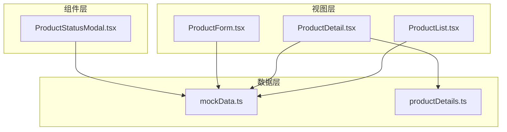
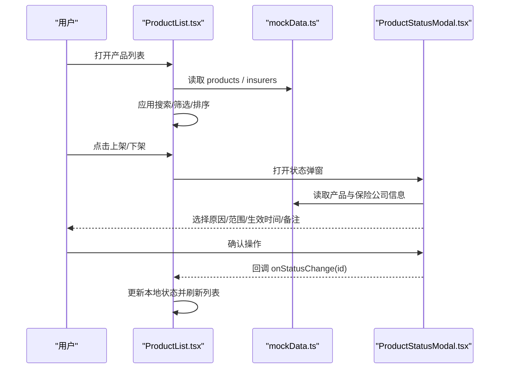
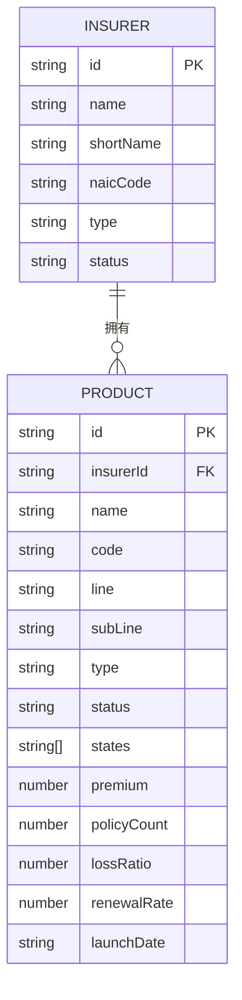
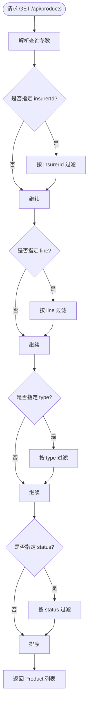
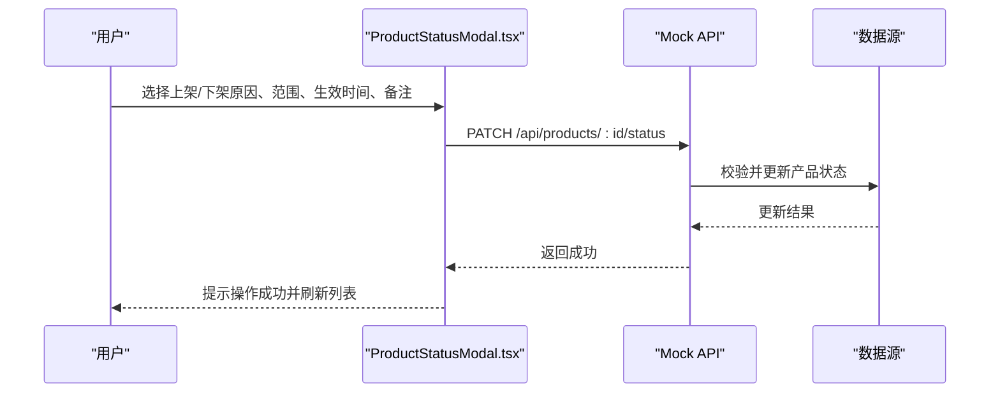
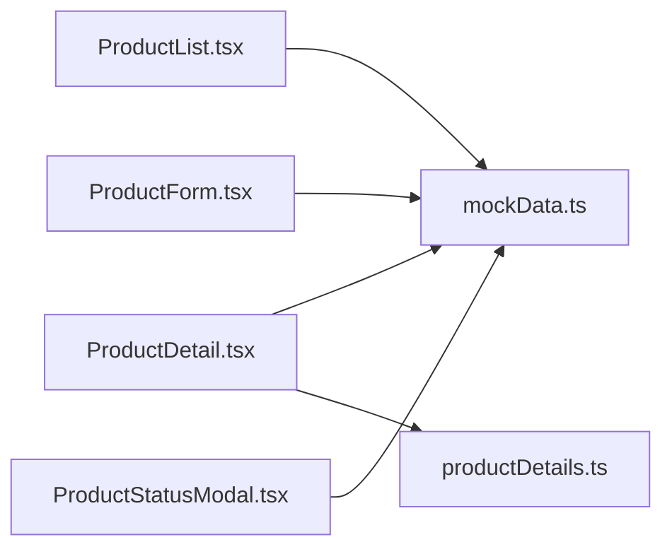

# 产品API

<cite>
**本文引用的文件**
- [mockData.ts](file://产品方案/UI-V1.0/src/data/mockData.ts)
- [productDetails.ts](file://产品方案/UI-V1.0/src/data/productDetails.ts)
- [ProductList.tsx](file://产品方案/UI-V1.0/src/views/ProductList.tsx)
- [ProductDetail.tsx](file://产品方案/UI-V1.0/src/views/ProductDetail.tsx)
- [ProductForm.tsx](file://产品方案/UI-V1.0/src/views/ProductForm.tsx)
- [ProductStatusModal.tsx](file://产品方案/UI-V1.0/src/components/ProductStatusModal.tsx)
</cite>

## 目录
1. [简介](#简介)
2. [项目结构](#项目结构)
3. [核心组件](#核心组件)
4. [架构总览](#架构总览)
5. [详细组件分析](#详细组件分析)
6. [依赖关系分析](#依赖关系分析)
7. [性能考虑](#性能考虑)
8. [故障排查指南](#故障排查指南)
9. [结论](#结论)
10. [附录](#附录)

## 简介
本文件为 OverInsurData 平台“产品管理”模块的 API 文档，聚焦保险产品相关的 Mock API 端点与数据模型。基于前端视图与数据定义，梳理以下能力：
- 产品列表查询、新增、详情、更新、删除
- 产品状态管理（上架、下架、暂停等）
- 产品查询过滤（按保险公司、产品线、产品类型、销售状态等）
- 产品与保险公司的关联关系与引用完整性约束

说明：当前仓库为前端原型与 Mock 数据实现，未包含后端服务代码。本文档以现有前端交互和数据模型为依据，抽象出标准 RESTful 接口规范，便于后续后端实现对接。

## 项目结构
- 数据层
  - mockData.ts：定义 Insurer、Product、Channel 等核心类型及示例数据
  - productDetails.ts：定义费率方案、可售州、核保规则、培训材料、业绩数据等扩展信息
- 视图层
  - ProductList.tsx：产品列表页，提供搜索、筛选、排序、批量操作、状态切换入口
  - ProductDetail.tsx：产品详情页，展示基本信息、费率方案、可售州、核保规则、培训材料、业绩看板
  - ProductForm.tsx：新增/编辑产品的多步表单，覆盖基本信息、费率配置、核保规则、可售州、合规文件
- 组件层
  - ProductStatusModal.tsx：产品上架/下架确认弹窗，支持原因、范围、生效时间、备注与审计确认

图表来源
- [mockData.ts:33-48](file://产品方案/UI-V1.0/src/data/mockData.ts#L33-L48)
- [productDetails.ts:1-64](file://产品方案/UI-V1.0/src/data/productDetails.ts#L1-L64)
- [ProductList.tsx:1-243](file://产品方案/UI-V1.0/src/views/ProductList.tsx#L1-L243)
- [ProductDetail.tsx:1-599](file://产品方案/UI-V1.0/src/views/ProductDetail.tsx#L1-L599)
- [ProductForm.tsx:1-502](file://产品方案/UI-V1.0/src/views/ProductForm.tsx#L1-L502)
- [ProductStatusModal.tsx:1-206](file://产品方案/UI-V1.0/src/components/ProductStatusModal.tsx#L1-L206)

章节来源
- [mockData.ts:33-48](file://产品方案/UI-V1.0/src/data/mockData.ts#L33-L48)
- [productDetails.ts:1-64](file://产品方案/UI-V1.0/src/data/productDetails.ts#L1-L64)
- [ProductList.tsx:20-116](file://产品方案/UI-V1.0/src/views/ProductList.tsx#L20-L116)
- [ProductDetail.tsx:72-183](file://产品方案/UI-V1.0/src/views/ProductDetail.tsx#L72-L183)
- [ProductForm.tsx:58-113](file://产品方案/UI-V1.0/src/views/ProductForm.tsx#L58-L113)
- [ProductStatusModal.tsx:29-44](file://产品方案/UI-V1.0/src/components/ProductStatusModal.tsx#L29-L44)

## 核心组件
- 产品数据模型（Product）
  - id：字符串，唯一标识
  - insurerId：字符串，关联保险公司ID
  - name：字符串，产品名称
  - code：字符串，产品代码
  - line：字符串，业务线
  - subLine：字符串，业务子线
  - type：枚举，Individual/Group/Voluntary
  - status：枚举，on-sale/off-sale/paused/pending
  - states：字符串数组，可售州集合或特殊值（如 ALL）
  - premium：数值，总保费
  - policyCount：数值，保单数
  - lossRatio：数值，赔付率
  - renewalRate：数值，续保率
  - launchDate：字符串，上架日期
- 保险公司数据模型（Insurer）
  - id、name、shortName、naicCode、type、status、amBestRating、spRating、headquarters、state、region、founded、website、totalPremium、policyCount、lossRatio、renewalRate、channelCount、productCount、settlementCycle、coopStatus、contractExpiry、lines、commissionIncome
- 扩展数据
  - 费率方案（RatePlan）、可售州（ProductState）、核保规则（UnderwritingRule）、培训材料（TrainingMaterial）、业绩数据（ProductPerformanceData）

章节来源
- [mockData.ts:6-48](file://产品方案/UI-V1.0/src/data/mockData.ts#L6-L48)
- [productDetails.ts:1-64](file://产品方案/UI-V1.0/src/data/productDetails.ts#L1-L64)

## 架构总览
从前端到数据层的调用关系如下：
- 列表页通过筛选条件对 products 进行本地过滤与排序
- 详情页聚合产品、保险公司、费率方案、可售州、核保规则、培训材料与业绩数据
- 表单页维护多步骤数据，提交后跳转回列表或详情
- 状态弹窗封装上架/下架流程，含影响范围、原因、范围、生效时间与审计确认

图表来源
- [ProductList.tsx:20-116](file://产品方案/UI-V1.0/src/views/ProductList.tsx#L20-L116)
- [ProductStatusModal.tsx:29-44](file://产品方案/UI-V1.0/src/components/ProductStatusModal.tsx#L29-L44)
- [mockData.ts:33-48](file://产品方案/UI-V1.0/src/data/mockData.ts#L33-L48)

## 详细组件分析

### 产品数据模型与字段约束
- id：string，必填，唯一
- insurerId：string，必填，外键指向 Insurer.id
- name：string，必填
- code：string，必填，建议遵循“承保方-业务线-序号”格式
- line：string，必填，枚举值参考 LINES（Auto/Home/Commercial/Cyber/Life/Travel/Professional/D&O/E&O/Marine/Specialty）
- subLine：string，必填，随 line 动态可选
- type：enum，Individual/Group/Voluntary
- status：enum，on-sale/off-sale/paused/pending
- states：string[]，可售州集合；若为 ["ALL"] 表示全国可售
- premium：number，总保费
- policyCount：number，保单数
- lossRatio：number，赔付率
- renewalRate：number，续保率
- launchDate：string，ISO 日期格式

章节来源
- [mockData.ts:33-48](file://产品方案/UI-V1.0/src/data/mockData.ts#L33-L48)
- [ProductForm.tsx:15-28](file://产品方案/UI-V1.0/src/views/ProductForm.tsx#L15-L28)

### 产品与保险公司关联关系
- 一对多：一个 Insurer 可拥有多个 Product（通过 insurerId 关联）
- 引用完整性：创建/更新产品时，insurerId 必须存在于 Insurer 列表中；删除 Insurer 前应检查是否存在被引用的 Product

图表来源
- [mockData.ts:6-48](file://产品方案/UI-V1.0/src/data/mockData.ts#L6-L48)

### 产品列表查询与过滤
- 查询参数（GET /api/products）
  - search：字符串，按产品名称或产品代码模糊匹配
  - insurerId：字符串，按保险公司筛选
  - line：字符串，按业务线筛选
  - type：字符串，按产品类型筛选（Individual/Group/Voluntary）
  - status：字符串，按销售状态筛选（on-sale/off-sale/paused/pending）
  - sortKey：字符串，支持 name/premium/lossRatio/renewalRate/policyCount
  - sortOrder：asc/desc
- 响应体：Product 数组

图表来源
- [ProductList.tsx:20-116](file://产品方案/UI-V1.0/src/views/ProductList.tsx#L20-L116)

章节来源
- [ProductList.tsx:20-116](file://产品方案/UI-V1.0/src/views/ProductList.tsx#L20-L116)

### 产品详情查询
- 查询参数（GET /api/products/:id）
  - id：字符串，产品ID
- 响应体：Product + 关联 Insurer + 扩展信息（费率方案、可售州、核保规则、培训材料、业绩数据）

章节来源
- [ProductDetail.tsx:72-183](file://产品方案/UI-V1.0/src/views/ProductDetail.tsx#L72-L183)
- [productDetails.ts:66-137](file://产品方案/UI-V1.0/src/data/productDetails.ts#L66-L137)
- [productDetails.ts:139-175](file://产品方案/UI-V1.0/src/data/productDetails.ts#L139-L175)
- [productDetails.ts:177-242](file://产品方案/UI-V1.0/src/data/productDetails.ts#L177-L242)
- [productDetails.ts:244-297](file://产品方案/UI-V1.0/src/data/productDetails.ts#L244-L297)
- [productDetails.ts:299-329](file://产品方案/UI-V1.0/src/data/productDetails.ts#L299-L329)

### 新增产品
- 请求（POST /api/products）
  - 请求体：Product 必填字段（id、insurerId、name、code、line、subLine、type、states、launchDate 等）
  - 校验：insurerId 存在性、line/subLine 组合有效性、states 非空
- 响应体：创建成功的 Product

章节来源
- [ProductForm.tsx:58-113](file://产品方案/UI-V1.0/src/views/ProductForm.tsx#L58-L113)
- [ProductForm.tsx:191-257](file://产品方案/UI-V1.0/src/views/ProductForm.tsx#L191-L257)

### 更新产品信息
- 请求（PUT /api/products/:id）
  - 路径参数：id
  - 请求体：需要更新的字段（name、code、line、subLine、type、status、states、premium、policyCount、lossRatio、renewalRate、launchDate 等）
  - 校验：同新增校验逻辑
- 响应体：更新后的 Product

章节来源
- [ProductForm.tsx:58-113](file://产品方案/UI-V1.0/src/views/ProductForm.tsx#L58-L113)

### 删除产品
- 请求（DELETE /api/products/:id）
  - 路径参数：id
  - 前置校验：无活跃保单或已停售方可删除（建议）
- 响应体：成功/失败消息

章节来源
- [ProductList.tsx:118-126](file://产品方案/UI-V1.0/src/views/ProductList.tsx#L118-L126)

### 产品状态管理接口
- 上架（PATCH /api/products/:id/status）
  - 请求体：reason、scope（all/selected）、effectDate（immediate/scheduled）、futureDate（当 scheduled 时必填）、note
  - 行为：将 status 设置为 on-sale，记录审计日志
- 下架（PATCH /api/products/:id/status）
  - 请求体：同上
  - 行为：将 status 设置为 off-sale 或 paused，停止新保报价，渠道授权暂停
- 暂停（PATCH /api/products/:id/status）
  - 请求体：reason、note、effectDate
  - 行为：将 status 设置为 paused

图表来源
- [ProductStatusModal.tsx:29-44](file://产品方案/UI-V1.0/src/components/ProductStatusModal.tsx#L29-L44)
- [ProductStatusModal.tsx:77-122](file://产品方案/UI-V1.0/src/components/ProductStatusModal.tsx#L77-L122)
- [ProductStatusModal.tsx:124-181](file://产品方案/UI-V1.0/src/components/ProductStatusModal.tsx#L124-L181)

章节来源
- [ProductStatusModal.tsx:29-44](file://产品方案/UI-V1.0/src/components/ProductStatusModal.tsx#L29-L44)
- [ProductStatusModal.tsx:77-122](file://产品方案/UI-V1.0/src/components/ProductStatusModal.tsx#L77-L122)
- [ProductStatusModal.tsx:124-181](file://产品方案/UI-V1.0/src/components/ProductStatusModal.tsx#L124-L181)

### 产品查询过滤条件汇总
- 按保险公司：insurerId
- 按业务线：line
- 按产品类型：type
- 按销售状态：status
- 按名称/代码：search
- 排序：sortKey、sortOrder

章节来源
- [ProductList.tsx:20-116](file://产品方案/UI-V1.0/src/views/ProductList.tsx#L20-L116)

## 依赖关系分析
- 视图与数据
  - ProductList.tsx 依赖 mockData.ts 的 products 与 insurers
  - ProductDetail.tsx 依赖 mockData.ts 与 productDetails.ts 的扩展数据
  - ProductForm.tsx 依赖 mockData.ts 的枚举与示例数据
  - ProductStatusModal.tsx 依赖 mockData.ts 的产品与保险公司信息
- 耦合与内聚
  - 数据层集中定义类型与示例数据，视图层仅消费，降低耦合
  - 状态弹窗独立封装上架/下架流程，提升内聚

图表来源
- [ProductList.tsx:1-243](file://产品方案/UI-V1.0/src/views/ProductList.tsx#L1-L243)
- [ProductDetail.tsx:1-599](file://产品方案/UI-V1.0/src/views/ProductDetail.tsx#L1-L599)
- [ProductForm.tsx:1-502](file://产品方案/UI-V1.0/src/views/ProductForm.tsx#L1-L502)
- [ProductStatusModal.tsx:1-206](file://产品方案/UI-V1.0/src/components/ProductStatusModal.tsx#L1-L206)
- [mockData.ts:1-444](file://产品方案/UI-V1.0/src/data/mockData.ts#L1-L444)
- [productDetails.ts:1-329](file://产品方案/UI-V1.0/src/data/productDetails.ts#L1-L329)

章节来源
- [ProductList.tsx:1-243](file://产品方案/UI-V1.0/src/views/ProductList.tsx#L1-L243)
- [ProductDetail.tsx:1-599](file://产品方案/UI-V1.0/src/views/ProductDetail.tsx#L1-L599)
- [ProductForm.tsx:1-502](file://产品方案/UI-V1.0/src/views/ProductForm.tsx#L1-L502)
- [ProductStatusModal.tsx:1-206](file://产品方案/UI-V1.0/src/components/ProductStatusModal.tsx#L1-L206)
- [mockData.ts:1-444](file://产品方案/UI-V1.0/src/data/mockData.ts#L1-L444)
- [productDetails.ts:1-329](file://产品方案/UI-V1.0/src/data/productDetails.ts#L1-L329)

## 性能考虑
- 列表页使用本地过滤与排序，适合中小规模数据；大数据量时应引入服务端分页与索引
- 详情页聚合多类数据，注意按需加载（如费率方案、可售州、核保规则、培训材料、业绩数据）
- 状态弹窗避免阻塞主线程，采用异步回调更新状态
- 建议在服务端实现缓存与幂等性，减少重复请求

## 故障排查指南
- 列表筛选无效
  - 检查 query 参数是否正确传递
  - 确认筛选字段与数据模型一致
- 状态切换不生效
  - 确认弹窗中 reason、effectDate、scope 是否完整
  - 检查 onStatusChange 回调是否被正确触发
- 详情数据缺失
  - 确认 productId 是否存在
  - 检查扩展数据（费率方案、可售州、核保规则、培训材料、业绩）是否按 productId 正确关联

章节来源
- [ProductList.tsx:20-116](file://产品方案/UI-V1.0/src/views/ProductList.tsx#L20-L116)
- [ProductStatusModal.tsx:29-44](file://产品方案/UI-V1.0/src/components/ProductStatusModal.tsx#L29-L44)
- [ProductDetail.tsx:72-183](file://产品方案/UI-V1.0/src/views/ProductDetail.tsx#L72-L183)

## 结论
本文基于前端原型与 Mock 数据，抽象出产品管理的标准 RESTful API 规范，涵盖 CRUD、状态管理与查询过滤，明确了数据模型与关联关系。后续后端实现应遵循本文档的接口契约，确保前后端一致性。

## 附录
- 常见错误码与建议
  - 400：请求参数校验失败（如必填字段缺失、insurerId 不存在）
  - 404：产品不存在
  - 409：状态变更冲突（如尝试删除有活跃保单的产品）
  - 500：服务器内部错误
- 审计日志
  - 所有状态变更需记录操作人、时间、原因、范围与生效时间