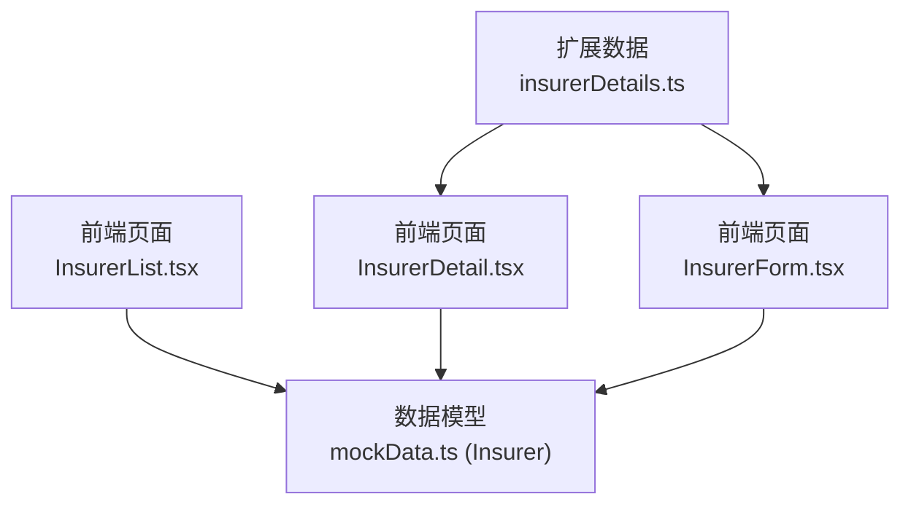
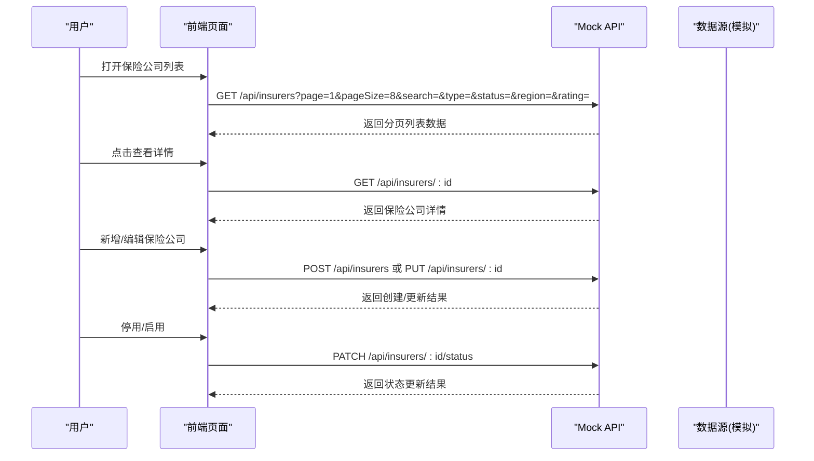
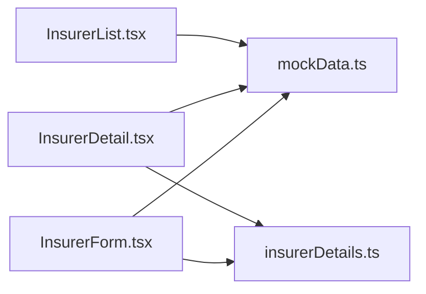

# 保险公司API

<cite>
**本文引用的文件**
- [mockData.ts](file://产品方案/UI-V1.0/src/data/mockData.ts)
- [insurerDetails.ts](file://产品方案/UI-V1.0/src/data/insurerDetails.ts)
- [InsurerList.tsx](file://产品方案/UI-V1.0/src/views/InsurerList.tsx)
- [InsurerDetail.tsx](file://产品方案/UI-V1.0/src/views/InsurerDetail.tsx)
- [InsurerForm.tsx](file://产品方案/UI-V1.0/src/views/InsurerForm.tsx)
- [产品功能清单_V1.0.0.md](file://产品需求/产品功能清单_V1.0.0.md)
</cite>

## 目录
1. [简介](#简介)
2. [项目结构](#项目结构)
3. [核心组件](#核心组件)
4. [架构总览](#架构总览)
5. [详细组件分析](#详细组件分析)
6. [依赖分析](#依赖分析)
7. [性能考虑](#性能考虑)
8. [故障排查指南](#故障排查指南)
9. [结论](#结论)
10. [附录：API规范与示例](#附录api规范与示例)

## 简介
本文件为 OverInsurData 平台的“保险公司管理模块”提供面向后端的 Mock API 文档，覆盖保险公司主数据的增删改查、列表查询（含分页、状态过滤、地区筛选等）、详情查看、编辑更新与停用/启用控制。文档基于前端视图与数据模型推导接口契约，便于前后端联调与实现对齐。

## 项目结构
- 数据模型与样例数据位于 UI 层的数据文件中，用于驱动列表、表单与详情页展示；后端可据此定义一致的 Insurer 数据模型与枚举约束。
- 列表页支持关键词搜索、公司类型、合作状态、大区、评级等多维筛选与排序、分页。
- 详情页展示基本信息、财务评级、关联产品、合作渠道、业绩概览、资质附件、变更历史等。
- 表单页提供新增/编辑的向导式步骤，包含基本信息、监管信息、财务评级、结算配置、资质文件上传。

图表来源
- [InsurerList.tsx:1-360](file://产品方案/UI-V1.0/src/views/InsurerList.tsx#L1-L360)
- [InsurerDetail.tsx:1-644](file://产品方案/UI-V1.0/src/views/InsurerDetail.tsx#L1-L644)
- [InsurerForm.tsx:1-517](file://产品方案/UI-V1.0/src/views/InsurerForm.tsx#L1-L517)
- [mockData.ts:1-444](file://产品方案/UI-V1.0/src/data/mockData.ts#L1-L444)
- [insurerDetails.ts:1-140](file://产品方案/UI-V1.0/src/data/insurerDetails.ts#L1-L140)

章节来源
- [InsurerList.tsx:1-360](file://产品方案/UI-V1.0/src/views/InsurerList.tsx#L1-L360)
- [InsurerDetail.tsx:1-644](file://产品方案/UI-V1.0/src/views/InsurerDetail.tsx#L1-L644)
- [InsurerForm.tsx:1-517](file://产品方案/UI-V1.0/src/views/InsurerForm.tsx#L1-L517)
- [mockData.ts:1-444](file://产品方案/UI-V1.0/src/data/mockData.ts#L1-L444)
- [insurerDetails.ts:1-140](file://产品方案/UI-V1.0/src/data/insurerDetails.ts#L1-L140)

## 核心组件
- 保险公司数据模型（Insurer）：包含 id、name、shortName、naicCode、type、status、amBestRating、spRating、headquarters、state、region、founded、website、totalPremium、policyCount、lossRatio、renewalRate、channelCount、productCount、settlementCycle、coopStatus、contractExpiry、lines、commissionIncome 等字段。
- 列表查询能力：支持按名称/简称/NAIC 编码模糊搜索，按公司类型（Admitted/Non-Admitted）、合作状态（active/pending/inactive）、大区（Northeast/Southeast/Midwest/West）、AM Best 评级筛选，支持多列排序与分页。
- 详情展示：基本信息、财务评级、关联产品、合作渠道、业绩概览、资质附件、变更历史。
- 新增/编辑流程：分步向导，必填校验（如 NAIC 编码 5 位数字），提交审核或保存修改。

章节来源
- [mockData.ts:6-31](file://产品方案/UI-V1.0/src/data/mockData.ts#L6-L31)
- [InsurerList.tsx:18-53](file://产品方案/UI-V1.0/src/views/InsurerList.tsx#L18-L53)
- [InsurerDetail.tsx:22-67](file://产品方案/UI-V1.0/src/views/InsurerDetail.tsx#L22-L67)
- [InsurerForm.tsx:16-109](file://产品方案/UI-V1.0/src/views/InsurerForm.tsx#L16-L109)

## 架构总览
下图展示了从前端到后端（Mock）的调用关系与数据流向，涵盖列表查询、详情获取、新增/编辑、停用/启用等关键路径。

图表来源
- [InsurerList.tsx:18-53](file://产品方案/UI-V1.0/src/views/InsurerList.tsx#L18-L53)
- [InsurerDetail.tsx:56-67](file://产品方案/UI-V1.0/src/views/InsurerDetail.tsx#L56-L67)
- [InsurerForm.tsx:59-109](file://产品方案/UI-V1.0/src/views/InsurerForm.tsx#L59-L109)

## 详细组件分析

### 数据模型：Insurer
- 标识与基础信息
  - id: string，唯一标识
  - name: string，公司全称
  - shortName: string，公司简称
  - naicCode: string，NAIC 编码（建议 5 位数字）
  - type: 'Admitted' | 'Non-Admitted'
  - status: 'active' | 'inactive' | 'pending'
  - founded: number，成立年份
  - website: string，官网地址
- 总部与区域
  - headquarters: string，总部地址
  - state: string，州缩写
  - region: 'Northeast' | 'Southeast' | 'Midwest' | 'West'
- 财务与评级
  - amBestRating: string，AM Best 评级
  - spRating: string，S&P 评级
  - totalPremium: number，总保费
  - policyCount: number，保单数
  - lossRatio: number，赔付率
  - renewalRate: number，续保率
  - commissionIncome: number，佣金收入
- 业务与结算
  - channelCount: number，合作渠道数
  - productCount: number，产品数量
  - settlementCycle: 'Monthly' | 'Quarterly'
  - coopStatus: 'active' | 'negotiating' | 'expiring' | 'terminated'
  - contractExpiry: string，合同到期日
  - lines: string[]，业务线数组

章节来源
- [mockData.ts:1-31](file://产品方案/UI-V1.0/src/data/mockData.ts#L1-L31)

### 列表查询：GET /api/insurers
- 功能：获取保险公司列表，支持分页、搜索、多维筛选与排序。
- 查询参数
  - page: number，页码（默认 1）
  - pageSize: number，每页条数（默认 8）
  - search: string，关键词（公司名称/简称/NAIC 编码）
  - type: 'Admitted' | 'Non-Admitted' | ''，公司类型
  - status: 'active' | 'inactive' | 'pending' | ''，合作状态
  - region: 'Northeast' | 'Southeast' | 'Midwest' | 'West' | ''，大区
  - rating: string，AM Best 评级（可选）
  - sortKey: 'name' | 'totalPremium' | 'lossRatio' | 'renewalRate' | 'channelCount'
  - sortDir: 'asc' | 'desc'
- 响应体
  - data: Insurer[]，当前页数据
  - total: number，总记录数
  - page: number，当前页
  - pageSize: number，每页条数
- 错误处理
  - 400：参数非法（如 pageSize 非正整数）
  - 500：服务器内部错误

章节来源
- [InsurerList.tsx:18-53](file://产品方案/UI-V1.0/src/views/InsurerList.tsx#L18-L53)
- [InsurerList.tsx:116-160](file://产品方案/UI-V1.0/src/views/InsurerList.tsx#L116-L160)
- [InsurerList.tsx:311-345](file://产品方案/UI-V1.0/src/views/InsurerList.tsx#L311-L345)

### 新增保险公司：POST /api/insurers
- 功能：创建新的保险公司档案，进入待审核或生效流程。
- 请求体关键字段
  - name, shortName, naicCode, type, state, region, settlementCycle, amBestRating, spRating, website, founded, lines, coopType, billingFormat, billCutoffDay, paymentDays, currency, premiumCollection
- 校验规则
  - naicCode：5 位数字
  - 必填项：name、shortName、naicCode、type、state、region、settlementCycle、billingFormat
- 响应体
  - data: Insurer，新建对象
  - message: string，操作结果提示
- 错误处理
  - 400：校验失败（如 NAIC 格式错误、必填缺失）
  - 409：重复（如 naicCode 已存在）
  - 500：服务器内部错误

章节来源
- [InsurerForm.tsx:64-109](file://产品方案/UI-V1.0/src/views/InsurerForm.tsx#L64-L109)
- [InsurerForm.tsx:202-262](file://产品方案/UI-V1.0/src/views/InsurerForm.tsx#L202-L262)
- [InsurerForm.tsx:264-313](file://产品方案/UI-V1.0/src/views/InsurerForm.tsx#L264-L313)
- [InsurerForm.tsx:315-422](file://产品方案/UI-V1.0/src/views/InsurerForm.tsx#L315-L422)

### 获取详情：GET /api/insurers/:id
- 功能：获取指定保险公司的完整档案及关联数据。
- 路径参数
  - id: string，保险公司 ID
- 响应体
  - data: Insurer + 关联数据（产品、渠道、联系人、附件、变更历史）
- 错误处理
  - 404：未找到该保险公司
  - 500：服务器内部错误

章节来源
- [InsurerDetail.tsx:56-67](file://产品方案/UI-V1.0/src/views/InsurerDetail.tsx#L56-L67)
- [InsurerDetail.tsx:189-293](file://产品方案/UI-V1.0/src/views/InsurerDetail.tsx#L189-L293)
- [insurerDetails.ts:1-140](file://产品方案/UI-V1.0/src/data/insurerDetails.ts#L1-L140)

### 更新信息：PUT /api/insurers/:id
- 功能：更新保险公司部分字段，系统自动记录变更历史。
- 路径参数
  - id: string
- 请求体：仅传入需更新的字段
- 响应体
  - data: Insurer，更新后的对象
  - message: string
- 错误处理
  - 400：校验失败
  - 404：未找到
  - 500：服务器内部错误

章节来源
- [InsurerForm.tsx:59-109](file://产品方案/UI-V1.0/src/views/InsurerForm.tsx#L59-L109)
- [InsurerDetail.tsx:71-89](file://产品方案/UI-V1.0/src/views/InsurerDetail.tsx#L71-L89)

### 删除保险公司：DELETE /api/insurers/:id
- 功能：删除指定保险公司（谨慎使用，通常建议停用）。
- 路径参数
  - id: string
- 响应体
  - message: string，删除成功提示
- 错误处理
  - 404：未找到
  - 409：存在关联数据不可删除（如有效保单、在途报价单）
  - 500：服务器内部错误

### 停用/启用：PATCH /api/insurers/:id/status
- 功能：切换保险公司状态（active/inactive），并记录原因。
- 路径参数
  - id: string
- 请求体
  - status: 'active' | 'inactive'
  - reason: string，停用/启用原因
- 响应体
  - data: { status: string }
  - message: string
- 错误处理
  - 400：状态值非法或缺少原因
  - 404：未找到
  - 500：服务器内部错误

章节来源
- [InsurerDetail.tsx:71-89](file://产品方案/UI-V1.0/src/views/InsurerDetail.tsx#L71-L89)
- [产品功能清单_V1.0.0.md:76-89](file://产品需求/产品功能清单_V1.0.0.md#L76-L89)

### 状态流转规则与业务逻辑
- 状态集合
  - active：合作中
  - pending：待审核
  - inactive：已停用
- 流转规则
  - 新增 → pending → 审批通过 → active
  - active ↔ inactive：由管理员根据业务需要切换，停用需填写原因
  - 合同即将到期时，合作状态标记为 expiring，提醒续约
- 影响范围
  - 停用时预览受影响渠道数、产品数、在途保单数
  - 停用后不再分配新业务，已有保单和佣金继续正常处理

章节来源
- [产品功能清单_V1.0.0.md:76-89](file://产品需求/产品功能清单_V1.0.0.md#L76-L89)
- [InsurerDetail.tsx:71-89](file://产品方案/UI-V1.0/src/views/InsurerDetail.tsx#L71-L89)

## 依赖分析
- 列表页依赖 mockData 中的 insurers 数据进行筛选、排序与分页。
- 详情页依赖 insurerDetails 中的变更历史、资质附件、对接人等扩展数据。
- 表单页依赖 US_STATES、AM_BEST_RATINGS、SP_RATINGS 等常量进行下拉选择与校验。

图表来源
- [InsurerList.tsx:1-360](file://产品方案/UI-V1.0/src/views/InsurerList.tsx#L1-L360)
- [InsurerDetail.tsx:1-644](file://产品方案/UI-V1.0/src/views/InsurerDetail.tsx#L1-L644)
- [InsurerForm.tsx:1-517](file://产品方案/UI-V1.0/src/views/InsurerForm.tsx#L1-L517)
- [mockData.ts:1-444](file://产品方案/UI-V1.0/src/data/mockData.ts#L1-L444)
- [insurerDetails.ts:1-140](file://产品方案/UI-V1.0/src/data/insurerDetails.ts#L1-L140)

章节来源
- [InsurerList.tsx:1-360](file://产品方案/UI-V1.0/src/views/InsurerList.tsx#L1-L360)
- [InsurerDetail.tsx:1-644](file://产品方案/UI-V1.0/src/views/InsurerDetail.tsx#L1-L644)
- [InsurerForm.tsx:1-517](file://产品方案/UI-V1.0/src/views/InsurerForm.tsx#L1-L517)
- [mockData.ts:1-444](file://产品方案/UI-V1.0/src/data/mockData.ts#L1-L444)
- [insurerDetails.ts:1-140](file://产品方案/UI-V1.0/src/data/insurerDetails.ts#L1-L140)

## 性能考虑
- 列表分页：默认 pageSize=8，支持调整至 20/50/100，减少首屏渲染压力。
- 筛选与排序：前端先做本地过滤与排序，后端应实现服务端分页与索引优化。
- 详情加载：按需加载标签页内容（如业绩、渠道、附件），避免一次性加载过多数据。
- 缓存策略：对常用筛选结果与详情数据进行短期缓存，提升交互体验。

## 故障排查指南
- 常见问题
  - NAIC 编码格式错误：确保为 5 位数字
  - 必填字段缺失：检查 name、shortName、naicCode、type、state、region、settlementCycle、billingFormat
  - 重复数据：naicCode 唯一性冲突
  - 停用影响：停用前预览影响范围，确认无在途业务风险
- 定位方法
  - 检查请求参数是否合法（page、pageSize、筛选条件）
  - 查看响应错误码与消息（400/404/409/500）
  - 核对数据模型字段与枚举值是否与前端一致

章节来源
- [InsurerForm.tsx:202-262](file://产品方案/UI-V1.0/src/views/InsurerForm.tsx#L202-L262)
- [InsurerList.tsx:18-53](file://产品方案/UI-V1.0/src/views/InsurerList.tsx#L18-L53)
- [产品功能清单_V1.0.0.md:76-89](file://产品需求/产品功能清单_V1.0.0.md#L76-L89)

## 结论
本文档基于现有前端视图与数据模型，梳理了保险公司管理模块的 Mock API 规范，包括列表查询、新增、详情、更新、删除与状态切换，明确了数据模型字段、筛选维度、分页与错误处理约定，以及状态流转规则。后端实现时应严格遵循上述契约，以确保前后端一致性与可维护性。

## 附录：API规范与示例

### 通用响应结构
- 成功
  - code: 200
  - data: 业务数据
  - message: 成功提示
- 失败
  - code: 4xx/5xx
  - message: 错误描述

### 列表查询示例
- 请求
  - GET /api/insurers?page=1&pageSize=8&search=travelers&type=Admitted&status=active&region=Northeast&rating=A
- 响应
  - data: Insurer[]
  - total: 10
  - page: 1
  - pageSize: 8

### 新增示例
- 请求
  - POST /api/insurers
  - body: { name, shortName, naicCode, type, state, region, settlementCycle, billingFormat, ... }
- 响应
  - data: Insurer
  - message: "创建成功"

### 详情示例
- 请求
  - GET /api/insurers/:id
- 响应
  - data: Insurer + 关联数据

### 更新示例
- 请求
  - PUT /api/insurers/:id
  - body: { 部分字段 }
- 响应
  - data: Insurer
  - message: "更新成功"

### 停用/启用示例
- 请求
  - PATCH /api/insurers/:id/status
  - body: { status: 'inactive'|'active', reason: string }
- 响应
  - data: { status: string }
  - message: "状态已更新"

### 错误处理示例
- 400：参数校验失败（如 naicCode 非 5 位数字）
- 404：资源不存在
- 409：重复或冲突（如 naicCode 已存在）
- 500：服务器内部错误

章节来源
- [InsurerList.tsx:18-53](file://产品方案/UI-V1.0/src/views/InsurerList.tsx#L18-L53)
- [InsurerForm.tsx:202-262](file://产品方案/UI-V1.0/src/views/InsurerForm.tsx#L202-L262)
- [InsurerDetail.tsx:71-89](file://产品方案/UI-V1.0/src/views/InsurerDetail.tsx#L71-L89)
- [mockData.ts:1-31](file://产品方案/UI-V1.0/src/data/mockData.ts#L1-L31)