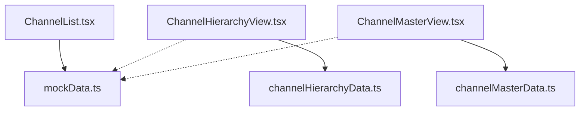
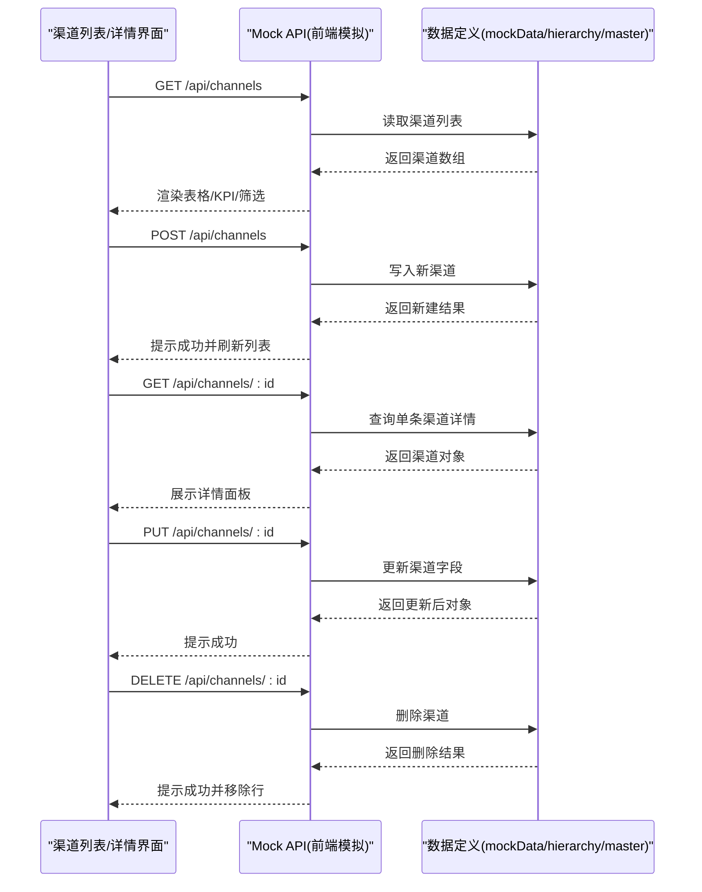
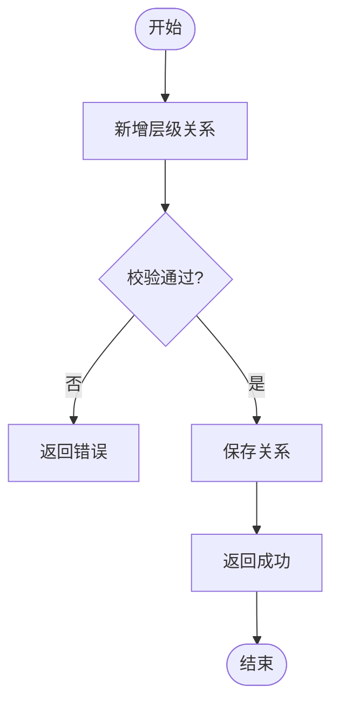
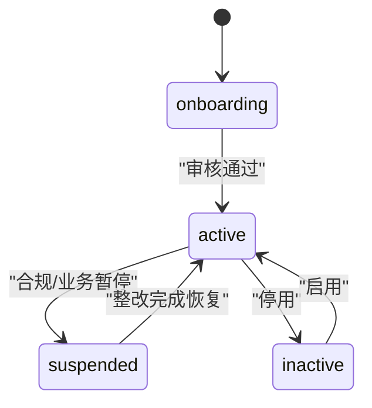
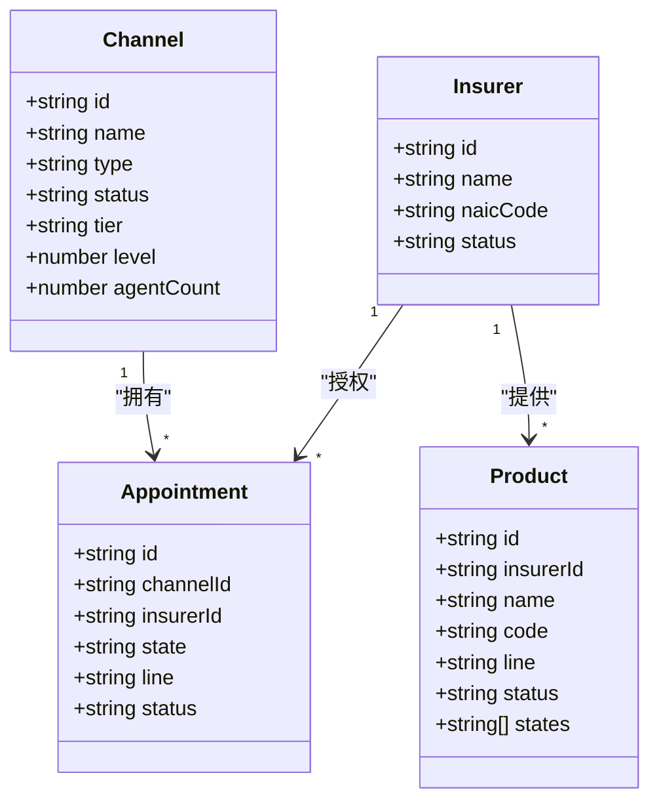
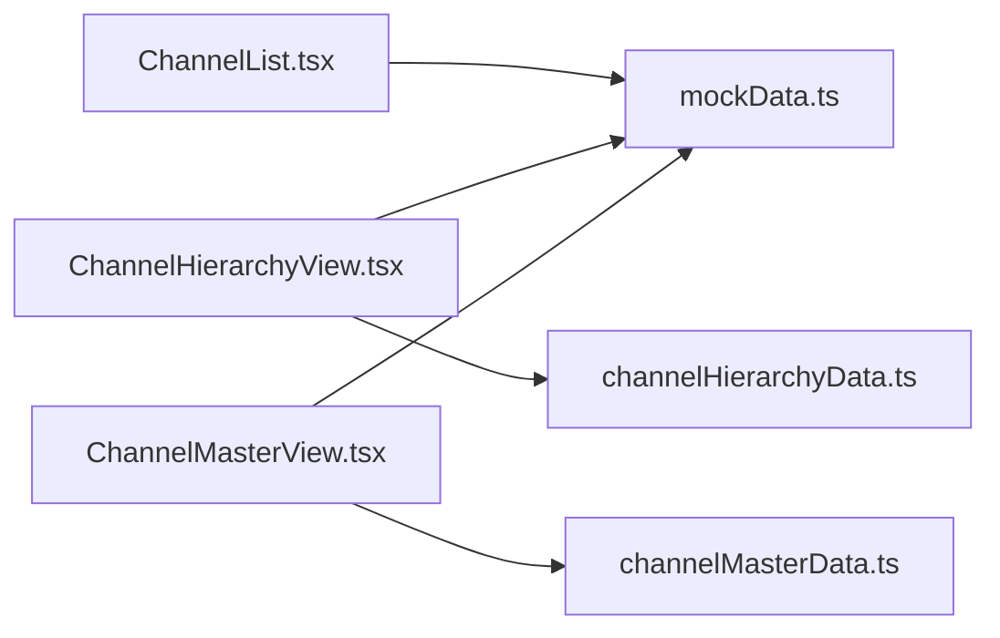

# 渠道API

<cite>
**本文引用的文件**
- [mockData.ts](file://产品方案/UI-V1.0/src/data/mockData.ts)
- [channelMasterData.ts](file://产品方案/UI-V1.0/src/data/channelMasterData.ts)
- [channelHierarchyData.ts](file://产品方案/UI-V1.0/src/data/channelHierarchyData.ts)
- [ChannelList.tsx](file://产品方案/UI-V1.0/src/views/ChannelList.tsx)
- [ChannelHierarchyView.tsx](file://产品方案/UI-V1.0/src/views/ChannelHierarchyView.tsx)
- [ChannelMasterView.tsx](file://产品方案/UI-V1.0/src/views/ChannelMasterView.tsx)
</cite>

## 目录
1. [简介](#简介)
2. [项目结构](#项目结构)
3. [核心组件](#核心组件)
4. [架构总览](#架构总览)
5. [详细组件分析](#详细组件分析)
6. [依赖关系分析](#依赖关系分析)
7. [性能考虑](#性能考虑)
8. [故障排查指南](#故障排查指南)
9. [结论](#结论)
10. [附录：API定义与数据模型](#附录api定义与数据模型)

## 简介
本文件为OverInsurData平台“渠道管理模块”的API文档，聚焦于渠道相关的Mock API端点、数据模型、层级管理与入驻流程状态变更，以及渠道与保险公司、产品的关联关系。文档基于前端视图与数据定义进行归纳，便于前后端对接与测试验证。

## 项目结构
- 数据层
  - mockData.ts：渠道、保险公司、产品等基础数据与类型定义
  - channelMasterData.ts：渠道机构、代理人、资质文件、变更记录等主数据
  - channelHierarchyData.ts：渠道层级节点、关系、白标配置、团队绩效等
- 视图层
  - ChannelList.tsx：渠道列表、筛选、展开子级、KPI展示
  - ChannelHierarchyView.tsx：组织架构树、层级关系管理（新增/调整/终止）、多上级配置、品牌配置、变更历史
  - ChannelMasterView.tsx：渠道机构主数据管理（增删改查、状态变更、文件上传、导入）

图表来源
- [ChannelList.tsx:1-285](file://产品方案/UI-V1.0/src/views/ChannelList.tsx#L1-L285)
- [ChannelHierarchyView.tsx:1-800](file://产品方案/UI-V1.0/src/views/ChannelHierarchyView.tsx#L1-L800)
- [ChannelMasterView.tsx:1-800](file://产品方案/UI-V1.0/src/views/ChannelMasterView.tsx#L1-L800)
- [mockData.ts:50-69](file://产品方案/UI-V1.0/src/data/mockData.ts#L50-L69)
- [channelHierarchyData.ts:7-32](file://产品方案/UI-V1.0/src/data/channelHierarchyData.ts#L7-L32)
- [channelMasterData.ts:11-42](file://产品方案/UI-V1.0/src/data/channelMasterData.ts#L11-L42)

章节来源
- [ChannelList.tsx:1-285](file://产品方案/UI-V1.0/src/views/ChannelList.tsx#L1-L285)
- [ChannelHierarchyView.tsx:1-800](file://产品方案/UI-V1.0/src/views/ChannelHierarchyView.tsx#L1-L800)
- [ChannelMasterView.tsx:1-800](file://产品方案/UI-V1.0/src/views/ChannelMasterView.tsx#L1-L800)
- [mockData.ts:50-69](file://产品方案/UI-V1.0/src/data/mockData.ts#L50-L69)
- [channelHierarchyData.ts:7-32](file://产品方案/UI-V1.0/src/data/channelHierarchyData.ts#L7-L32)
- [channelMasterData.ts:11-42](file://产品方案/UI-V1.0/src/data/channelMasterData.ts#L11-L42)

## 核心组件
- 渠道列表与筛选：支持按名称/NPN、类型、状态、等级、大区筛选，支持树形展开子渠道
- 渠道层级管理：支持新增/调整/终止层级关系，支持多上级与收入分配比例配置
- 渠道主数据管理：支持机构信息编辑、状态变更、文件上传、批量导入
- 白标与品牌配置：支持门户域名、邮件域名、功能开关、品牌色等
- 变更历史：记录状态变更、关系变更、文件上传等操作轨迹

章节来源
- [ChannelList.tsx:40-144](file://产品方案/UI-V1.0/src/views/ChannelList.tsx#L40-L144)
- [ChannelHierarchyView.tsx:289-529](file://产品方案/UI-V1.0/src/views/ChannelHierarchyView.tsx#L289-L529)
- [ChannelMasterView.tsx:694-800](file://产品方案/UI-V1.0/src/views/ChannelMasterView.tsx#L694-L800)

## 架构总览
渠道模块以“数据定义 + 视图交互”的方式组织，Mock API通过前端视图触发并调用对应数据源，形成如下调用链：

图表来源
- [ChannelList.tsx:40-144](file://产品方案/UI-V1.0/src/views/ChannelList.tsx#L40-L144)
- [ChannelHierarchyView.tsx:289-529](file://产品方案/UI-V1.0/src/views/ChannelHierarchyView.tsx#L289-L529)
- [ChannelMasterView.tsx:694-800](file://产品方案/UI-V1.0/src/views/ChannelMasterView.tsx#L694-L800)
- [mockData.ts:50-69](file://产品方案/UI-V1.0/src/data/mockData.ts#L50-L69)

## 详细组件分析

### 渠道CRUD接口
- GET /api/channels
  - 功能：获取渠道列表，支持筛选与分页（前端已实现筛选）
  - 请求参数：name/npnCode/type/status/tier/region（可选）
  - 响应：渠道数组，包含id、name、type、status、tier、parentId、level、agentCount等
- POST /api/channels
  - 功能：新增渠道
  - 请求体：参考Channel数据模型必填字段
  - 响应：新建渠道对象
- GET /api/channels/:id
  - 功能：获取渠道详情
  - 路径参数：id
  - 响应：渠道对象及关联信息（如子渠道、业绩指标）
- PUT /api/channels/:id
  - 功能：更新渠道信息
  - 路径参数：id；请求体：需更新的字段
  - 响应：更新后的渠道对象
- DELETE /api/channels/:id
  - 功能：删除渠道
  - 路径参数：id
  - 响应：删除结果

章节来源
- [ChannelList.tsx:40-144](file://产品方案/UI-V1.0/src/views/ChannelList.tsx#L40-L144)
- [mockData.ts:50-69](file://产品方案/UI-V1.0/src/data/mockData.ts#L50-L69)

### 渠道数据模型（Channel）
- id：字符串，唯一标识
- name：字符串，渠道名称
- type：枚举，独立代理/经纪商/MGA/批发经纪/直销
- status：枚举，活跃/停用/入驻中/已暂停
- tier：枚举，铂金/金级/银级/标准
- parentId：字符串，父渠道ID（可选）
- level：数字，层级深度（1为顶级）
- agentCount：数字，代理人数
- totalPremium：数字，累计保费
- policyCount：数字，保单数
- lossRatio：数字，赔付率
- renewalRate：数字，续保率
- commissionRate：数字，佣金率
- state：字符串，主营州
- region：枚举，大区
- joinDate：字符串，入驻日期
- npnCode：字符串，NPN编号
- manager：字符串，负责人

章节来源
- [mockData.ts:50-69](file://产品方案/UI-V1.0/src/data/mockData.ts#L50-L69)

### 渠道层级管理接口
- 新增层级关系
  - 功能：建立父子或上下级关系，支持多上级与收入分配比例
  - 输入：子节点、父节点、是否主上级、收入分配比例
  - 输出：关系创建结果
- 调整层级关系
  - 功能：变更节点的上级或调整收入分配比例
  - 输入：节点、当前上级、新上级、生效日期、原因
  - 输出：调整申请提交结果
- 终止层级关系
  - 功能：终止现有关系，影响收入分配与产品授权
  - 输入：关系ID、生效日期、终止原因
  - 输出：终止结果

图表来源
- [ChannelHierarchyView.tsx:289-529](file://产品方案/UI-V1.0/src/views/ChannelHierarchyView.tsx#L289-L529)
- [channelHierarchyData.ts:78-151](file://产品方案/UI-V1.0/src/data/channelHierarchyData.ts#L78-L151)

章节来源
- [ChannelHierarchyView.tsx:289-529](file://产品方案/UI-V1.0/src/views/ChannelHierarchyView.tsx#L289-L529)
- [channelHierarchyData.ts:78-151](file://产品方案/UI-V1.0/src/data/channelHierarchyData.ts#L78-L151)

### 渠道入驻流程与状态变更
- 状态集合：onboarding（入驻中）、active（活跃）、suspended（已暂停）、inactive（停用）
- 状态转换规则
  - onboarding → active：完成入驻审核
  - active → suspended：合规或业务原因暂停
  - suspended → active：整改完成后恢复
  - inactive ↔ active：启用/停用切换
- 操作入口
  - 渠道列表/详情中的“状态变更”按钮
  - 状态变更弹窗选择目标状态与原因，提交后记录变更历史

图表来源
- [ChannelList.tsx:17-29](file://产品方案/UI-V1.0/src/views/ChannelList.tsx#L17-L29)
- [ChannelMasterView.tsx:637-688](file://产品方案/UI-V1.0/src/views/ChannelMasterView.tsx#L637-L688)

章节来源
- [ChannelList.tsx:17-29](file://产品方案/UI-V1.0/src/views/ChannelList.tsx#L17-L29)
- [ChannelMasterView.tsx:637-688](file://产品方案/UI-V1.0/src/views/ChannelMasterView.tsx#L637-L688)

### 渠道与保险公司、产品的关联关系
- 渠道与保险公司的合作通过Appointment（授权/委托）管理
  - 字段：渠道ID、渠道名称、保险公司ID、州、险种、状态、提交/批准/过期时间、NPN
- 渠道与产品的关联通过渠道可销售的产品范围与授权状态体现
  - 产品字段：保险公司ID、产品名称、代码、险种、状态、可售州、保费、保单数、赔付率、续保率、上线日期

图表来源
- [mockData.ts:6-48](file://产品方案/UI-V1.0/src/data/mockData.ts#L6-L48)
- [mockData.ts:379-388](file://产品方案/UI-V1.0/src/data/mockData.ts#L379-L388)

章节来源
- [mockData.ts:6-48](file://产品方案/UI-V1.0/src/data/mockData.ts#L6-L48)
- [mockData.ts:379-388](file://产品方案/UI-V1.0/src/data/mockData.ts#L379-L388)

### 渠道主数据与层级节点模型
- 渠道机构（ChannelOrg）
  - 关键字段：id、name、shortName、type、status、npn、taxId、licenseStates、primaryState、address、city、state、zip、phone、email、website、managerId、managerName、parentOrgId、parentOrgName、contractId、joinDate、lastReviewDate、ytdPremium、ytdCommission、lossRatio、renewalRate、agentCount、tags、notes
- 渠道层级节点（ChannelNode）
  - 关键字段：id、name、shortName、type、status、parentIds、primaryParentId、depth、npn、licenseStates、primaryState、joinDate、contractId、managerId、managerName、teamSize、ytdPremium、ytdCommission、lossRatio、renewalRate、whiteLabelId、overrideRate、email、phone

章节来源
- [channelMasterData.ts:11-42](file://产品方案/UI-V1.0/src/data/channelMasterData.ts#L11-L42)
- [channelHierarchyData.ts:7-32](file://产品方案/UI-V1.0/src/data/channelHierarchyData.ts#L7-L32)

## 依赖关系分析
- ChannelList.tsx依赖mockData.ts中的渠道数据与格式化函数
- ChannelHierarchyView.tsx依赖channelHierarchyData.ts中的节点、关系、白标配置与工具函数
- ChannelMasterView.tsx依赖channelMasterData.ts中的机构、代理人、文件、变更记录与统计
- 三者共同构成渠道管理的完整能力闭环：列表浏览、层级管理、主数据维护

图表来源
- [ChannelList.tsx:1-285](file://产品方案/UI-V1.0/src/views/ChannelList.tsx#L1-L285)
- [ChannelHierarchyView.tsx:1-800](file://产品方案/UI-V1.0/src/views/ChannelHierarchyView.tsx#L1-L800)
- [ChannelMasterView.tsx:1-800](file://产品方案/UI-V1.0/src/views/ChannelMasterView.tsx#L1-L800)
- [mockData.ts:50-69](file://产品方案/UI-V1.0/src/data/mockData.ts#L50-L69)
- [channelHierarchyData.ts:7-32](file://产品方案/UI-V1.0/src/data/channelHierarchyData.ts#L7-L32)
- [channelMasterData.ts:11-42](file://产品方案/UI-V1.0/src/data/channelMasterData.ts#L11-L42)

章节来源
- [ChannelList.tsx:1-285](file://产品方案/UI-V1.0/src/views/ChannelList.tsx#L1-L285)
- [ChannelHierarchyView.tsx:1-800](file://产品方案/UI-V1.0/src/views/ChannelHierarchyView.tsx#L1-L800)
- [ChannelMasterView.tsx:1-800](file://产品方案/UI-V1.0/src/views/ChannelMasterView.tsx#L1-L800)
- [mockData.ts:50-69](file://产品方案/UI-V1.0/src/data/mockData.ts#L50-L69)
- [channelHierarchyData.ts:7-32](file://产品方案/UI-V1.0/src/data/channelHierarchyData.ts#L7-L32)
- [channelMasterData.ts:11-42](file://产品方案/UI-V1.0/src/data/channelMasterData.ts#L11-L42)

## 性能考虑
- 列表筛选与排序在前端进行，建议后端接口支持服务端过滤与分页以减少数据量
- 层级树渲染使用递归组件，节点较多时应考虑虚拟滚动或懒加载
- 状态变更与关系调整应加入幂等性与审计日志，避免重复提交
- 白标配置与品牌设置属于低频操作，缓存策略可降低重复请求

[本节为通用指导，不直接分析具体文件]

## 故障排查指南
- 渠道状态异常
  - 检查状态变更弹窗是否正确选择目标状态与原因
  - 查看变更历史确认操作记录
- 层级关系问题
  - 确认父子节点类型与层级深度是否符合约束
  - 多上级时收入分配比例之和应为100%
- 文件与资质问题
  - 检查资质文件状态（有效/即将到期/过期/缺失/待审核）
  - 根据提示及时续期或补充上传

章节来源
- [ChannelMasterView.tsx:637-688](file://产品方案/UI-V1.0/src/views/ChannelMasterView.tsx#L637-L688)
- [channelHierarchyData.ts:78-151](file://产品方案/UI-V1.0/src/data/channelHierarchyData.ts#L78-L151)
- [channelMasterData.ts:332-377](file://产品方案/UI-V1.0/src/data/channelMasterData.ts#L332-L377)

## 结论
本API文档基于前端视图与数据定义，梳理了渠道管理的核心接口、数据模型、层级管理与入驻流程状态变更，以及与保险公司、产品的关联关系。建议在后续实现中完善服务端校验、权限控制与审计日志，确保数据一致性与可追溯性。

[本节为总结，不直接分析具体文件]

## 附录：API定义与数据模型

### API端点清单
- GET /api/channels
  - 描述：获取渠道列表
  - 请求参数：name/npnCode/type/status/tier/region（可选）
  - 响应：渠道数组
- POST /api/channels
  - 描述：新增渠道
  - 请求体：Channel模型字段
  - 响应：新建渠道对象
- GET /api/channels/:id
  - 描述：获取渠道详情
  - 路径参数：id
  - 响应：渠道对象
- PUT /api/channels/:id
  - 描述：更新渠道信息
  - 路径参数：id；请求体：需更新字段
  - 响应：更新后渠道对象
- DELETE /api/channels/:id
  - 描述：删除渠道
  - 路径参数：id
  - 响应：删除结果

章节来源
- [ChannelList.tsx:40-144](file://产品方案/UI-V1.0/src/views/ChannelList.tsx#L40-L144)
- [mockData.ts:50-69](file://产品方案/UI-V1.0/src/data/mockData.ts#L50-L69)

### 数据模型要点
- Channel（渠道）
  - 关键字段：id、name、type、status、tier、parentId、level、agentCount、totalPremium、policyCount、lossRatio、renewalRate、commissionRate、state、region、joinDate、npnCode、manager
- ChannelOrg（渠道机构）
  - 关键字段：id、name、shortName、type、status、npn、taxId、licenseStates、primaryState、contact、parentOrgId、contractId、joinDate、ytdPremium、ytdCommission、lossRatio、renewalRate、agentCount、tags、notes
- ChannelNode（层级节点）
  - 关键字段：id、name、shortName、type、status、parentIds、primaryParentId、depth、npn、licenseStates、primaryState、joinDate、contractId、managerId、managerName、teamSize、ytdPremium、ytdCommission、lossRatio、renewalRate、whiteLabelId、overrideRate、email、phone

章节来源
- [mockData.ts:50-69](file://产品方案/UI-V1.0/src/data/mockData.ts#L50-L69)
- [channelMasterData.ts:11-42](file://产品方案/UI-V1.0/src/data/channelMasterData.ts#L11-L42)
- [channelHierarchyData.ts:7-32](file://产品方案/UI-V1.0/src/data/channelHierarchyData.ts#L7-L32)