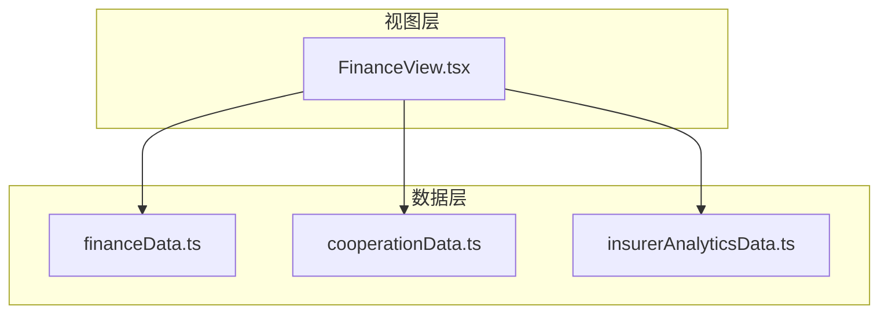
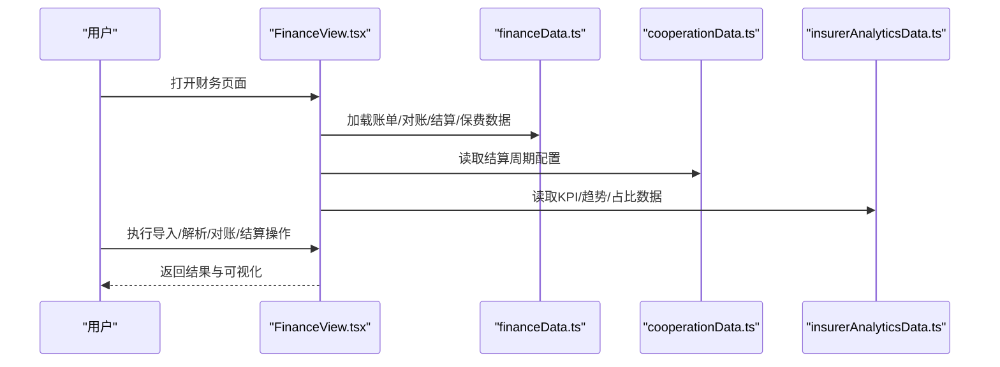
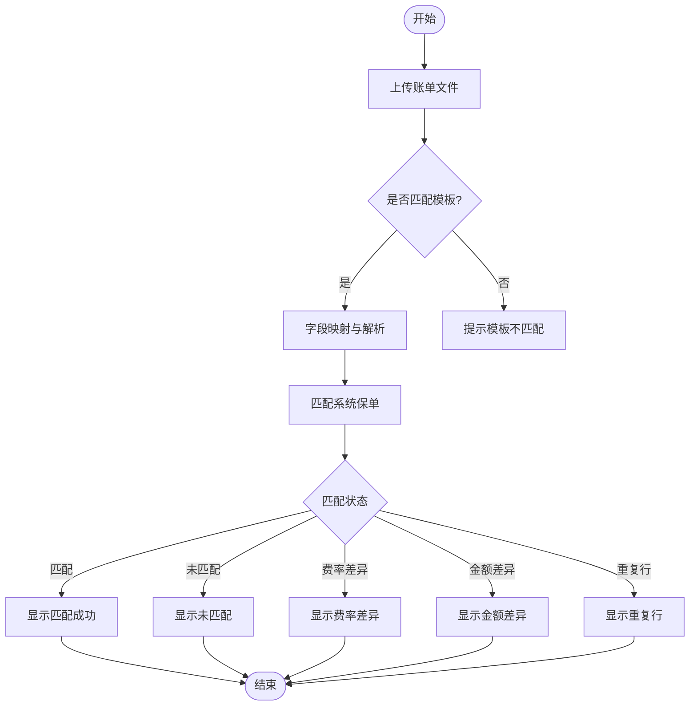
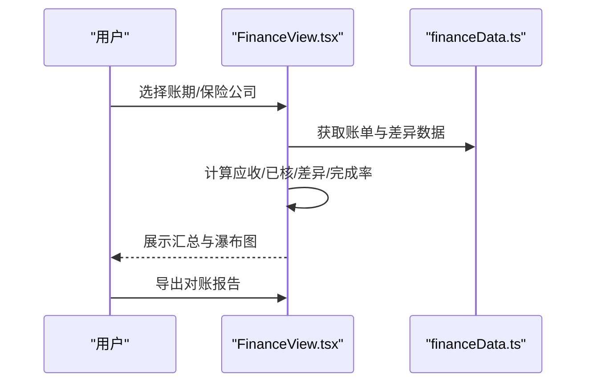
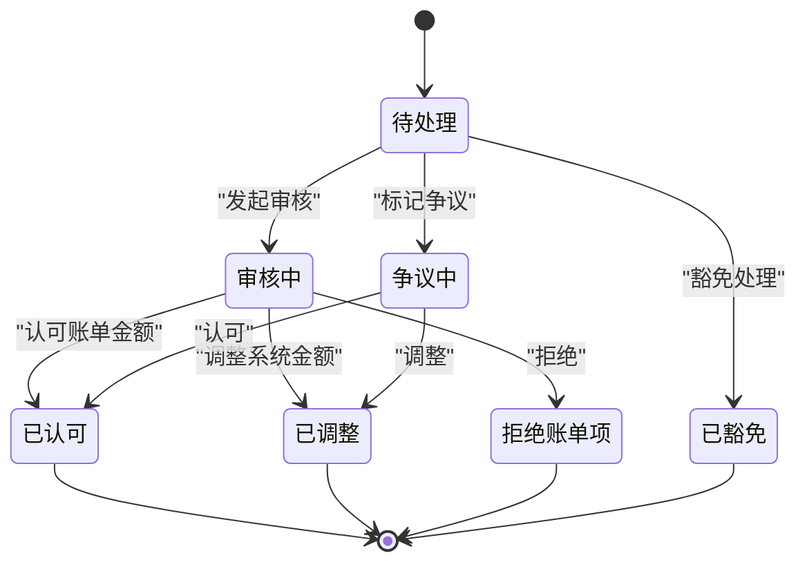
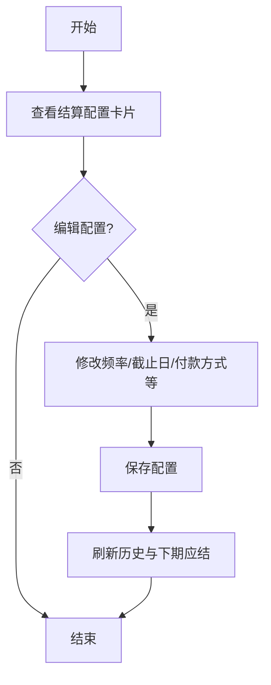
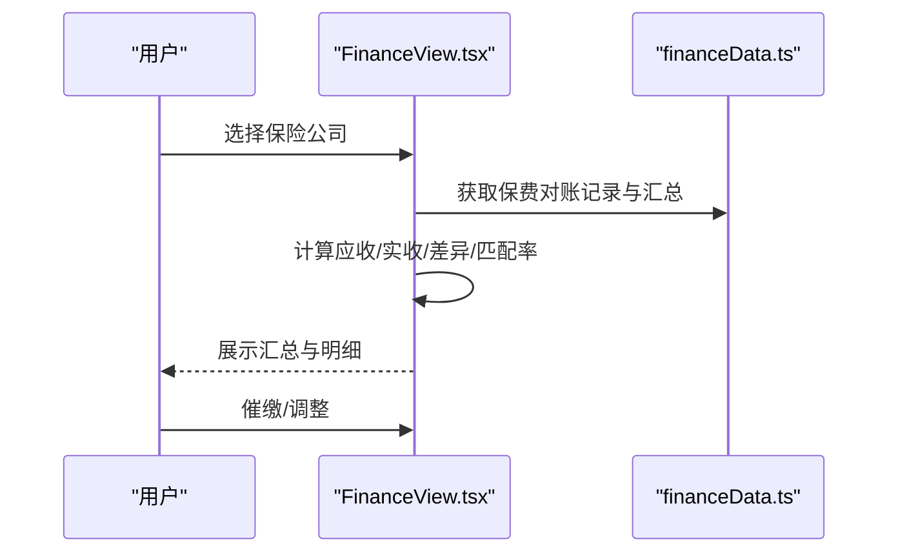
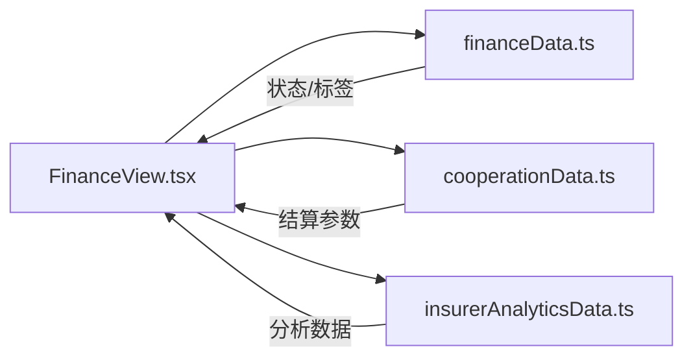

# 财务API

<cite>
**本文引用的文件**
- [financeData.ts](file://产品方案/UI-V1.0/src/data/financeData.ts)
- [FinanceView.tsx](file://产品方案/UI-V1.0/src/views/FinanceView.tsx)
- [cooperationData.ts](file://产品方案/UI-V1.0/src/data/cooperationData.ts)
- [insurerAnalyticsData.ts](file://产品方案/UI-V1.0/src/data/insurerAnalyticsData.ts)
</cite>

## 目录
1. [简介](#简介)
2. [项目结构](#项目结构)
3. [核心组件](#核心组件)
4. [架构总览](#架构总览)
5. [详细组件分析](#详细组件分析)
6. [依赖关系分析](#依赖关系分析)
7. [性能考量](#性能考量)
8. [故障排查指南](#故障排查指南)
9. [结论](#结论)
10. [附录](#附录)

## 简介
本文件为OverInsurData平台财务管理模块的API文档，聚焦于与财务结算相关的Mock API端点、数据模型与计算逻辑。内容覆盖：
- 佣金账单导入、解析、对账、差异处理、结算周期配置与保费对账
- 关键指标定义与计算逻辑（佣金收入、保费、赔付率、续保率等）
- 财务报表生成接口（按时间周期、保险公司、渠道等多维度统计）
- 结算周期配置接口（支持Monthly与Quarterly两种模式）
- 趋势分析与市场占比统计接口
- 货币格式化和百分比格式化工具函数使用说明

说明：以下“接口”以Mock数据与前端视图交互形式呈现，用于演示与联调。实际后端实现可基于相同数据结构与流程进行扩展。

## 项目结构
财务模块由数据层与视图层组成：
- 数据层：集中定义财务相关的数据模型、枚举、常量与示例数据
- 视图层：提供多Tab页面，串联账单导入、解析、对账、差异处理、结算配置与保费对账流程

图表来源
- [financeData.ts:1-273](file://产品方案/UI-V1.0/src/data/financeData.ts#L1-L273)
- [cooperationData.ts:185-252](file://产品方案/UI-V1.0/src/data/cooperationData.ts#L185-L252)
- [insurerAnalyticsData.ts:1-275](file://产品方案/UI-V1.0/src/data/insurerAnalyticsData.ts#L1-L275)
- [FinanceView.tsx:877-951](file://产品方案/UI-V1.0/src/views/FinanceView.tsx#L877-L951)

章节来源
- [FinanceView.tsx:877-951](file://产品方案/UI-V1.0/src/views/FinanceView.tsx#L877-L951)
- [financeData.ts:1-273](file://产品方案/UI-V1.0/src/data/financeData.ts#L1-L273)

## 核心组件
- 佣金账单导入与解析：支持CSV/Excel/PDF/EDI上传与模板解析，输出匹配结果与差异明细
- 佣金对账：按账期与保险公司汇总应收、已核、差异金额与完成率
- 差异处理：差异项状态流转（待处理/审核中/争议/认可/调整/豁免）
- 结算周期配置：按月或季结算，支持截止日、付款宽限期、支付方式、最低结算额、自动对账/结算开关
- 保费对账：对比应收与实收，识别缺失、多缴、费率错误、退保/批单调整等异常
- 报表与分析：多维度统计（时间、保险公司、渠道），趋势与占比分析

章节来源
- [financeData.ts:1-273](file://产品方案/UI-V1.0/src/data/financeData.ts#L1-L273)
- [FinanceView.tsx:43-875](file://产品方案/UI-V1.0/src/views/FinanceView.tsx#L43-L875)

## 架构总览
财务模块通过FinanceView聚合多个功能Tab，各Tab读取financeData中的模型与数据，结合cooperationData中的结算参数与insurerAnalyticsData中的分析数据进行展示与交互。

图表来源
- [FinanceView.tsx:877-951](file://产品方案/UI-V1.0/src/views/FinanceView.tsx#L877-L951)
- [financeData.ts:1-273](file://产品方案/UI-V1.0/src/data/financeData.ts#L1-L273)
- [cooperationData.ts:185-252](file://产品方案/UI-V1.0/src/data/cooperationData.ts#L185-L252)
- [insurerAnalyticsData.ts:1-275](file://产品方案/UI-V1.0/src/data/insurerAnalyticsData.ts#L1-L275)

## 详细组件分析

### 佣金账单导入与解析
- 能力
  - 支持拖拽/选择上传CSV、Excel、PDF、EDI
  - 根据模板映射字段（保单号、保费、佣金、日期、渠道等）
  - 输出匹配成功、未匹配、费率差异、金额差异、重复行等状态
- 关键数据模型
  - 账单导入状态与账单对象：BillImportStatus、CommissionBill
  - 解析行项目：MatchStatus、BillLineItem
  - 解析模板：ParseTemplate
- 交互流程
  - 上传文件 -> 预检 -> 解析 -> 显示匹配结果与差异

图表来源
- [financeData.ts:1-73](file://产品方案/UI-V1.0/src/data/financeData.ts#L1-L73)
- [FinanceView.tsx:182-332](file://产品方案/UI-V1.0/src/views/FinanceView.tsx#L182-L332)

章节来源
- [financeData.ts:1-73](file://产品方案/UI-V1.0/src/data/financeData.ts#L1-L73)
- [FinanceView.tsx:43-180](file://产品方案/UI-V1.0/src/views/FinanceView.tsx#L43-L180)
- [FinanceView.tsx:182-332](file://产品方案/UI-V1.0/src/views/FinanceView.tsx#L182-L332)

### 佣金对账
- 能力
  - 按账期与保险公司筛选
  - 汇总账单应收佣金、系统核实佣金、差异金额、对账完成率
  - 提供瀑布图展示匹配确认金额与差异未结金额
- 关键数据模型
  - ReconciliationDiff：差异记录（类型、金额、状态、处理人、备注等）
  - BILL_STATUS_STYLE/DIFF_TYPE_LABEL：状态与类型标签映射
- 交互流程
  - 选择账期/保险公司 -> 批量对账 -> 查看差异列表 -> 导出报告

图表来源
- [financeData.ts:74-105](file://产品方案/UI-V1.0/src/data/financeData.ts#L74-L105)
- [FinanceView.tsx:334-452](file://产品方案/UI-V1.0/src/views/FinanceView.tsx#L334-L452)

章节来源
- [financeData.ts:74-105](file://产品方案/UI-V1.0/src/data/financeData.ts#L74-L105)
- [FinanceView.tsx:334-452](file://产品方案/UI-V1.0/src/views/FinanceView.tsx#L334-L452)

### 差异处理
- 能力
  - 差异状态机：open -> under-review/disputed/waived -> accepted/adjusted/rejected
  - 支持添加处理备注、标记争议、豁免处理、调整系统金额
- 关键数据模型
  - DiffType、DiffStatus、ReconciliationDiff
  - DIFF_STATUS_STYLE：不同状态的样式与标签
- 交互流程
  - 筛选状态 -> 展开详情 -> 执行动作 -> 更新状态

图表来源
- [financeData.ts:74-105](file://产品方案/UI-V1.0/src/data/financeData.ts#L74-L105)
- [FinanceView.tsx:454-578](file://产品方案/UI-V1.0/src/views/FinanceView.tsx#L454-L578)

章节来源
- [financeData.ts:74-105](file://产品方案/UI-V1.0/src/data/financeData.ts#L74-L105)
- [FinanceView.tsx:454-578](file://产品方案/UI-V1.0/src/views/FinanceView.tsx#L454-L578)

### 结算周期配置
- 能力
  - 配置结算频率（月度/季度）、截止日、付款宽限期、支付方式、最低结算额、提前通知天数
  - 支持自动对账与自动结算开关
  - 展示下次结算日期与应结金额、本年累计已结算
- 关键数据模型
  - SettlementCycleConfig：结算周期配置
  - FREQ_LABEL/METHOD_LABEL：频率与方式标签映射
  - settlementConfigs（合作侧）：结算参数（Monthly/Quarterly等）
- 交互流程
  - 查看卡片 -> 编辑配置 -> 保存 -> 刷新历史

图表来源
- [financeData.ts:107-142](file://产品方案/UI-V1.0/src/data/financeData.ts#L107-L142)
- [cooperationData.ts:185-252](file://产品方案/UI-V1.0/src/data/cooperationData.ts#L185-L252)
- [FinanceView.tsx:580-734](file://产品方案/UI-V1.0/src/views/FinanceView.tsx#L580-L734)

章节来源
- [financeData.ts:107-142](file://产品方案/UI-V1.0/src/data/financeData.ts#L107-L142)
- [cooperationData.ts:185-252](file://产品方案/UI-V1.0/src/data/cooperationData.ts#L185-L252)
- [FinanceView.tsx:580-734](file://产品方案/UI-V1.0/src/views/FinanceView.tsx#L580-L734)

### 保费对账
- 能力
  - 对比应收保费与实收保费，识别缺失、多缴、费率错误、退保/批单调整
  - 按保险公司汇总匹配率、异常条数
  - 支持催缴与调整操作
- 关键数据模型
  - PremiumRecRecord、PremiumSummary
  - 状态样式与差异类型标签
- 交互流程
  - 选择保险公司 -> 查看汇总 -> 查看明细 -> 执行催缴/调整

图表来源
- [financeData.ts:144-196](file://产品方案/UI-V1.0/src/data/financeData.ts#L144-L196)
- [FinanceView.tsx:736-875](file://产品方案/UI-V1.0/src/views/FinanceView.tsx#L736-L875)

章节来源
- [financeData.ts:144-196](file://产品方案/UI-V1.0/src/data/financeData.ts#L144-L196)
- [FinanceView.tsx:736-875](file://产品方案/UI-V1.0/src/views/FinanceView.tsx#L736-L875)

### 财务报表生成接口（多维统计）
- 维度
  - 时间周期：月/季/年（支持2025-09至2026-08的月度序列）
  - 保险公司：按 insurerShort 分组
  - 渠道：按 channelShort 分组
- 主要指标
  - 保费总额、佣金收入、活跃保单数、新增/取消保单数
  - 赔付率（lossRatio）、续保率（renewalRate）
  - 区域与州级表现、产品线表现
- 数据来源
  - insurerAnalyticsData.ts：KPI、趋势、区域、渠道、赔付率、续保率等
- 使用建议
  - 通过筛选器组合维度，调用对应数据集进行聚合与渲染
  - 支持导出为XLSX/CSV（参考批量导出组件）

章节来源
- [insurerAnalyticsData.ts:1-275](file://产品方案/UI-V1.0/src/data/insurerAnalyticsData.ts#L1-L275)

### 结算周期配置接口（Monthly/Quarterly）
- 支持模式
  - Monthly：月度结算
  - Quarterly：季度结算
- 关键字段
  - cycle、billCutoffDay、paymentTermDays、paymentMethod、currency、premiumCollection、billingFormat、apiEnabled、reconciliationContact
- 数据来源
  - cooperationData.ts 中的 settlementConfigs

章节来源
- [cooperationData.ts:185-252](file://产品方案/UI-V1.0/src/data/cooperationData.ts#L185-L252)

### 趋势分析与市场占比统计接口
- 趋势分析
  - 月度保费趋势（按保险公司）
  - 月度赔付率趋势（按保险公司）
  - 月度续保率趋势（按保险公司）
  - 区域月度趋势
- 市场占比
  - 渠道保费占比（premiumShare）
  - 区域保费合计与平均赔付率
- 数据来源
  - insurerAnalyticsData.ts

章节来源
- [insurerAnalyticsData.ts:37-155](file://产品方案/UI-V1.0/src/data/insurerAnalyticsData.ts#L37-L155)
- [insurerAnalyticsData.ts:157-194](file://产品方案/UI-V1.0/src/data/insurerAnalyticsData.ts#L157-L194)
- [insurerAnalyticsData.ts:196-248](file://产品方案/UI-V1.0/src/data/insurerAnalyticsData.ts#L196-L248)

### 货币格式化和百分比格式化工具函数
- 货币格式化
  - 使用本地化数字格式化并前缀美元符号
  - 路径参考：FinanceView.tsx 中的 fmt 函数
- 百分比格式化
  - 将比率乘以100并保留一位小数，附加百分号
  - 在多处用于匹配率、增长率、赔付率、续保率的展示

章节来源
- [FinanceView.tsx:39-41](file://产品方案/UI-V1.0/src/views/FinanceView.tsx#L39-L41)

## 依赖关系分析
- FinanceView.tsx 依赖 financeData.ts 的核心数据模型与示例数据
- FinanceView.tsx 依赖 cooperationData.ts 的结算参数（Monthly/Quarterly）
- FinanceView.tsx 依赖 insurerAnalyticsData.ts 的分析数据（KPI、趋势、占比）
- 数据模型间通过统一的状态与标签映射保持一致性

图表来源
- [FinanceView.tsx:877-951](file://产品方案/UI-V1.0/src/views/FinanceView.tsx#L877-L951)
- [financeData.ts:1-273](file://产品方案/UI-V1.0/src/data/financeData.ts#L1-L273)
- [cooperationData.ts:185-252](file://产品方案/UI-V1.0/src/data/cooperationData.ts#L185-L252)
- [insurerAnalyticsData.ts:1-275](file://产品方案/UI-V1.0/src/data/insurerAnalyticsData.ts#L1-L275)

章节来源
- [FinanceView.tsx:877-951](file://产品方案/UI-V1.0/src/views/FinanceView.tsx#L877-L951)

## 性能考量
- 大数据量表格渲染：建议使用分页与虚拟滚动，避免一次性渲染过多DOM节点
- 解析与对账计算：在前端进行轻量聚合，复杂计算可迁移至后端服务
- 缓存策略：对趋势与占比数据采用缓存，减少重复请求
- 导出性能：大批量导出时采用流式生成与后台任务

[本节为通用指导，无需特定文件引用]

## 故障排查指南
- 账单解析失败
  - 检查模板字段映射是否正确
  - 确认文件格式与编码
  - 查看解析成功率与最近使用时间
- 对账差异较多
  - 筛选差异类型（费率差异/金额差异/缺失保单/重复行）
  - 检查系统录入与账单来源的一致性
  - 使用差异状态机推进处理（审核/争议/认可/调整/豁免）
- 结算延迟
  - 核对结算周期配置（截止日、付款宽限期）
  - 检查自动对账/结算开关
  - 查看下次结算日期与应结金额

章节来源
- [financeData.ts:198-223](file://产品方案/UI-V1.0/src/data/financeData.ts#L198-L223)
- [financeData.ts:74-105](file://产品方案/UI-V1.0/src/data/financeData.ts#L74-L105)
- [FinanceView.tsx:454-578](file://产品方案/UI-V1.0/src/views/FinanceView.tsx#L454-L578)
- [FinanceView.tsx:580-734](file://产品方案/UI-V1.0/src/views/FinanceView.tsx#L580-L734)

## 结论
本财务API文档基于现有Mock数据与前端视图，完整覆盖了佣金账单导入、解析、对账、差异处理、结算周期配置与保费对账的全流程，并提供多维度财务报表生成、趋势分析与市场占比统计能力。通过统一的数据模型与状态映射，确保前后端一致性与可扩展性。后续可将核心计算与持久化逻辑迁移至后端服务，进一步提升性能与可靠性。

[本节为总结，无需特定文件引用]

## 附录
- 关键数据模型速览
  - 账单导入：BillImportStatus、CommissionBill
  - 解析行项目：MatchStatus、BillLineItem
  - 对账差异：DiffType、DiffStatus、ReconciliationDiff
  - 结算周期：SettlementCycleConfig、FREQ_LABEL、METHOD_LABEL
  - 保费对账：PremiumRecRecord、PremiumSummary
  - 分析数据：InsurerKPI、ProductPerf、StatePerf、ChannelPerf、LossAlert、RenewalCohort

章节来源
- [financeData.ts:1-273](file://产品方案/UI-V1.0/src/data/financeData.ts#L1-L273)
- [insurerAnalyticsData.ts:1-275](file://产品方案/UI-V1.0/src/data/insurerAnalyticsData.ts#L1-L275)