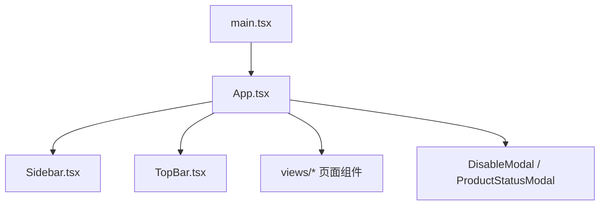
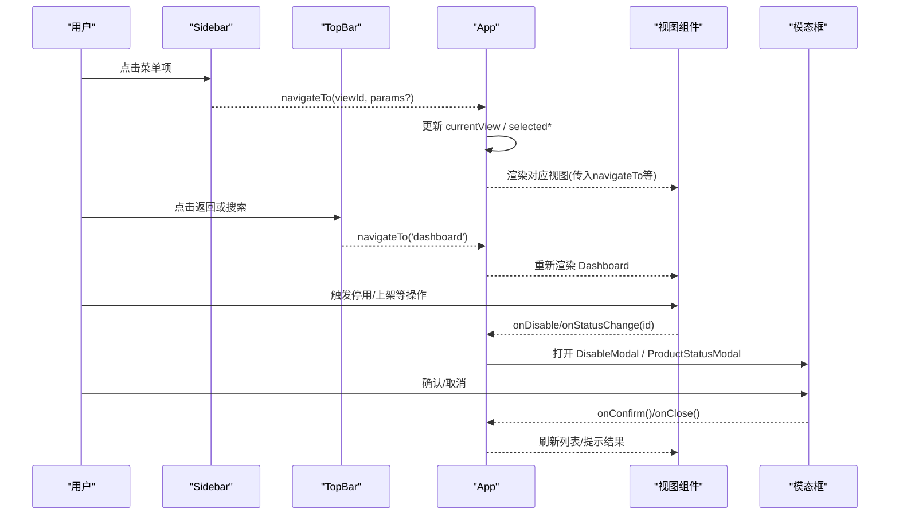
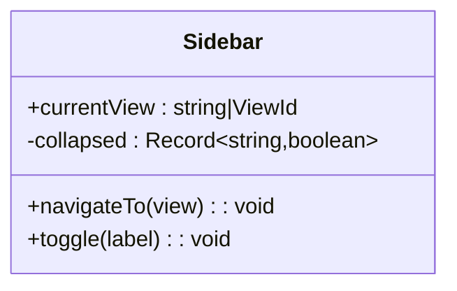
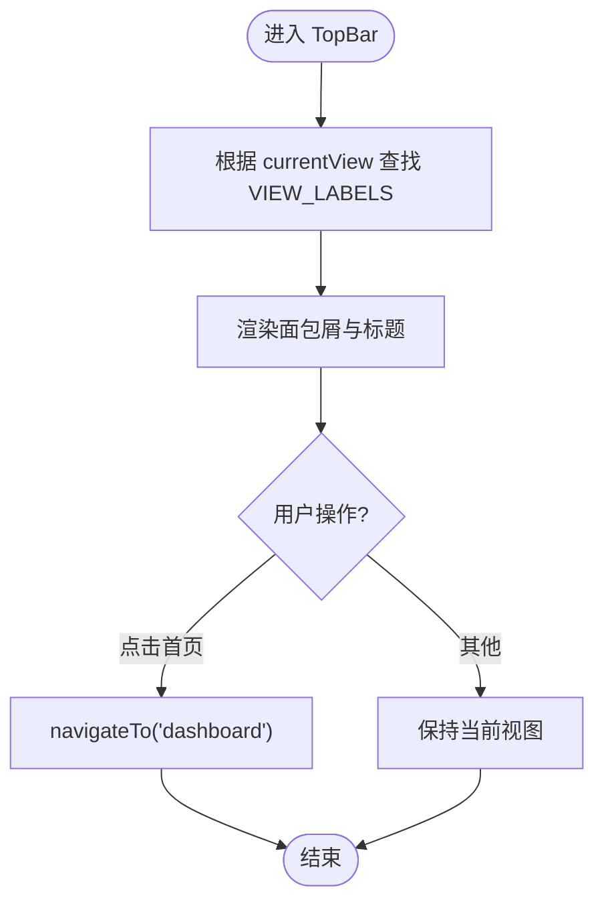
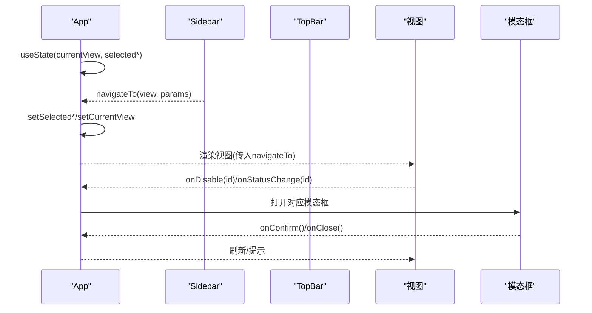
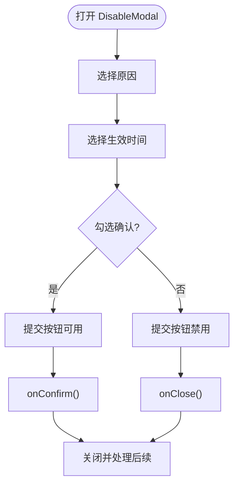
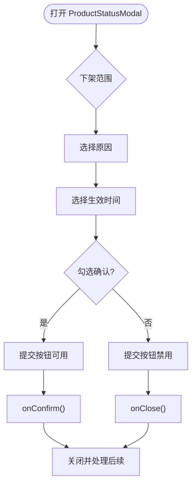
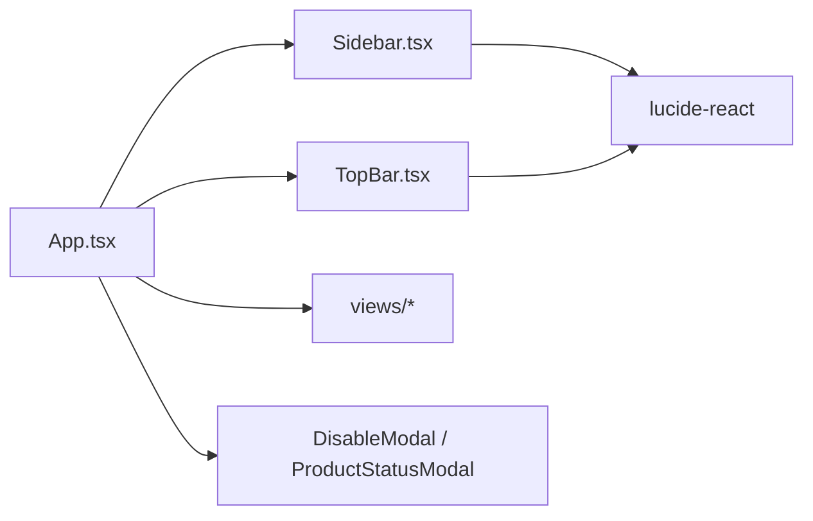

# 内部组件API

<cite>
**本文引用的文件**
- [App.tsx](file://产品方案/UI-V1.0/src/App.tsx)
- [Sidebar.tsx](file://产品方案/UI-V1.0/src/components/Sidebar.tsx)
- [TopBar.tsx](file://产品方案/UI-V1.0/src/components/TopBar.tsx)
- [DisableModal.tsx](file://产品方案/UI-V1.0/src/components/DisableModal.tsx)
- [ProductStatusModal.tsx](file://产品方案/UI-V1.0/src/components/ProductStatusModal.tsx)
- [main.tsx](file://产品方案/UI-V1.0/src/main.tsx)
- [package.json](file://产品方案/UI-V1.0/package.json)
</cite>

## 目录
1. [简介](#简介)
2. [项目结构](#项目结构)
3. [核心组件](#核心组件)
4. [架构总览](#架构总览)
5. [详细组件分析](#详细组件分析)
6. [依赖关系分析](#依赖关系分析)
7. [性能与可维护性建议](#性能与可维护性建议)
8. [故障排查指南](#故障排查指南)
9. [结论](#结论)
10. [附录：使用示例与最佳实践](#附录使用示例与最佳实践)

## 简介
本文件为 OverInsurData 平台内部组件 API 文档，聚焦于 React 组件的接口定义、Props 属性、事件处理与状态管理方法。重点覆盖以下组件：
- Sidebar 导航组件
- TopBar 顶部栏组件
- App 主应用组件
同时说明组件间通信机制、状态传递模式与事件处理流程，并提供参数校验、错误处理与最佳实践建议。

## 项目结构
该 UI 工程基于 React + TypeScript + Vite，采用功能视图与通用布局组件分离的组织方式：
- 入口渲染：main.tsx 挂载 App
- 应用容器：App.tsx 负责路由式视图切换、全局状态（当前视图、选中实体ID、模态框控制）
- 布局组件：Sidebar.tsx、TopBar.tsx 提供导航与面包屑展示
- 业务视图：views/* 下各页面组件由 App 根据 currentView 动态渲染
- 通用弹窗：DisableModal.tsx、ProductStatusModal.tsx 用于关键操作确认

图表来源
- [main.tsx:1-11](file://产品方案/UI-V1.0/src/main.tsx#L1-L11)
- [App.tsx:1-123](file://产品方案/UI-V1.0/src/App.tsx#L1-L123)

章节来源
- [main.tsx:1-11](file://产品方案/UI-V1.0/src/main.tsx#L1-L11)
- [App.tsx:1-123](file://产品方案/UI-V1.0/src/App.tsx#L1-L123)

## 核心组件
本节概述三个核心组件的职责与对外 API：
- Sidebar：导航分组与高亮，触发 navigateTo(viewId)
- TopBar：面包屑与标题展示，支持返回总览与搜索等动作
- App：集中管理 currentView、选中实体 ID、模态框开关，并向下分发 navigateTo 回调

章节来源
- [Sidebar.tsx:72-75](file://产品方案/UI-V1.0/src/components/Sidebar.tsx#L72-L75)
- [TopBar.tsx:32-35](file://产品方案/UI-V1.0/src/components/TopBar.tsx#L32-L35)
- [App.tsx:25-37](file://产品方案/UI-V1.0/src/App.tsx#L25-L37)

## 架构总览
整体采用“状态在父组件（App），子组件通过回调驱动”的单向数据流模式：
- App 持有 currentView、selectedInsurerId、selectedProductId、disableModalId、productStatusModalId
- Sidebar/TopBar 仅接收 currentView 与 navigateTo，不直接修改状态
- 视图组件通过 receive 的 navigateTo 进行页面跳转
- 模态框由 App 控制显示与关闭，并通过 onConfirm/onClose 回调完成后续逻辑

图表来源
- [App.tsx:25-82](file://产品方案/UI-V1.0/src/App.tsx#L25-L82)
- [Sidebar.tsx:72-75](file://产品方案/UI-V1.0/src/components/Sidebar.tsx#L72-L75)
- [TopBar.tsx:32-35](file://产品方案/UI-V1.0/src/components/TopBar.tsx#L32-L35)
- [DisableModal.tsx:5-9](file://产品方案/UI-V1.0/src/components/DisableModal.tsx#L5-L9)
- [ProductStatusModal.tsx:5-9](file://产品方案/UI-V1.0/src/components/ProductStatusModal.tsx#L5-L9)

## 详细组件分析

### Sidebar 导航组件
- 职责：展示分组导航、高亮当前视图、折叠展开分组、底部用户信息区
- 对外类型：导出 ViewId 联合类型，供外部约束视图标识
- Props
  - currentView: string | ViewId — 当前激活视图
  - navigateTo: (view: ViewId) => void — 导航回调
- 内部状态
  - collapsed: Record<string, boolean> — 分组折叠状态
- 事件处理
  - 点击菜单项调用 navigateTo(item.id)
  - 点击分组标题切换折叠
- 注意事项
  - 导航项包含“Appointment & 合规”带红点标记，属于静态展示
  - 当前视图匹配用于高亮样式

图表来源
- [Sidebar.tsx:9-35](file://产品方案/UI-V1.0/src/components/Sidebar.tsx#L9-L35)
- [Sidebar.tsx:72-82](file://产品方案/UI-V1.0/src/components/Sidebar.tsx#L72-L82)
- [Sidebar.tsx:133-168](file://产品方案/UI-V1.0/src/components/Sidebar.tsx#L133-L168)

章节来源
- [Sidebar.tsx:9-35](file://产品方案/UI-V1.0/src/components/Sidebar.tsx#L9-L35)
- [Sidebar.tsx:72-82](file://产品方案/UI-V1.0/src/components/Sidebar.tsx#L72-L82)
- [Sidebar.tsx:133-168](file://产品方案/UI-V1.0/src/components/Sidebar.tsx#L133-L168)

### TopBar 顶部栏组件
- 职责：展示面包屑与页面标题、提供返回总览按钮、搜索输入、通知和帮助入口、头像
- Props
  - currentView: string — 当前视图标识
  - navigateTo: (view: ViewId) => void — 导航回调
- 行为
  - 根据 currentView 查找 VIEW_LABELS 映射，生成面包屑与标题
  - 点击“InsureOS”回到 dashboard
  - 搜索框为占位交互，未绑定事件
- 注意
  - 右上角通知图标带有红色小圆点，表示未读消息（静态）

图表来源
- [TopBar.tsx:4-30](file://产品方案/UI-V1.0/src/components/TopBar.tsx#L4-L30)
- [TopBar.tsx:32-35](file://产品方案/UI-V1.0/src/components/TopBar.tsx#L32-L35)
- [TopBar.tsx:52-71](file://产品方案/UI-V1.0/src/components/TopBar.tsx#L52-L71)

章节来源
- [TopBar.tsx:4-30](file://产品方案/UI-V1.0/src/components/TopBar.tsx#L4-L30)
- [TopBar.tsx:32-35](file://产品方案/UI-V1.0/src/components/TopBar.tsx#L32-L35)
- [TopBar.tsx:52-71](file://产品方案/UI-V1.0/src/components/TopBar.tsx#L52-L71)

### App 主应用组件
- 职责：集中管理应用级状态、路由式视图切换、模态框控制、滚动复位
- 状态
  - currentView: ViewId
  - selectedInsurerId: string
  - selectedProductId: string
  - disableModalId: string | null
  - productStatusModalId: string | null
- 方法
  - navigateTo(view, params?): void — 设置选中ID并切换视图，滚动到顶部
  - renderView(): JSX — 根据 currentView 渲染对应视图
- 事件
  - 向各视图组件注入 navigateTo
  - 收集 onDisable/onStatusChange 以打开对应模态框
  - 模态框确认后关闭并执行后续逻辑（如刷新列表）

图表来源
- [App.tsx:25-82](file://产品方案/UI-V1.0/src/App.tsx#L25-L82)
- [App.tsx:103-119](file://产品方案/UI-V1.0/src/App.tsx#L103-L119)

章节来源
- [App.tsx:25-82](file://产品方案/UI-V1.0/src/App.tsx#L25-L82)
- [App.tsx:103-119](file://产品方案/UI-V1.0/src/App.tsx#L103-L119)

### DisableModal 停用/启用保险公司弹窗
- 职责：选择停用/启用原因、备注、生效时间、影响范围预览、二次确认
- Props
  - insurerId: string
  - onClose: () => void
  - onConfirm: () => void
- 内部状态
  - reason/note/effectDate/futureDate/confirmed
- 校验与可用性
  - canConfirm = reason && (effectDate === 'immediate' || futureDate) && confirmed
  - 禁用状态下按钮不可点击，直到满足条件
- 影响范围
  - 停用场景展示关联产品数、渠道数、有效保单、在途报价、待结佣金等指标

图表来源
- [DisableModal.tsx:5-9](file://产品方案/UI-V1.0/src/components/DisableModal.tsx#L5-L9)
- [DisableModal.tsx:29-49](file://产品方案/UI-V1.0/src/components/DisableModal.tsx#L29-L49)
- [DisableModal.tsx:195-230](file://产品方案/UI-V1.0/src/components/DisableModal.tsx#L195-L230)

章节来源
- [DisableModal.tsx:5-9](file://产品方案/UI-V1.0/src/components/DisableModal.tsx#L5-L9)
- [DisableModal.tsx:29-49](file://产品方案/UI-V1.0/src/components/DisableModal.tsx#L29-L49)
- [DisableModal.tsx:195-230](file://产品方案/UI-V1.0/src/components/DisableModal.tsx#L195-L230)

### ProductStatusModal 产品上架/下架弹窗
- 职责：选择上架/下架原因、范围（全部/指定州）、备注、生效时间、二次确认
- Props
  - productId: string
  - onClose: () => void
  - onConfirm: () => void
- 内部状态
  - reason/scope/note/effectDate/futureDate/confirmed
- 校验与可用性
  - canConfirm = reason && (effectDate === 'immediate' || futureDate) && confirmed
- 影响范围
  - 下架场景展示在售保单、可售州、相关渠道、预计影响保费等指标

图表来源
- [ProductStatusModal.tsx:5-9](file://产品方案/UI-V1.0/src/components/ProductStatusModal.tsx#L5-L9)
- [ProductStatusModal.tsx:29-43](file://产品方案/UI-V1.0/src/components/ProductStatusModal.tsx#L29-L43)
- [ProductStatusModal.tsx:173-200](file://产品方案/UI-V1.0/src/components/ProductStatusModal.tsx#L173-L200)

章节来源
- [ProductStatusModal.tsx:5-9](file://产品方案/UI-V1.0/src/components/ProductStatusModal.tsx#L5-L9)
- [ProductStatusModal.tsx:29-43](file://产品方案/UI-V1.0/src/components/ProductStatusModal.tsx#L29-L43)
- [ProductStatusModal.tsx:173-200](file://产品方案/UI-V1.0/src/components/ProductStatusModal.tsx#L173-L200)

## 依赖关系分析
- 组件耦合
  - App 与 Sidebar/TopBar：松耦合，通过 props 与回调通信
  - 视图与 App：通过 navigateTo 解耦具体路由实现
  - 模态框与 App：通过 onConfirm/onClose 解耦业务逻辑
- 外部依赖
  - lucide-react：图标库
  - recharts：图表库（未在本文分析的组件中使用）
  - tailwindcss/vite/react：构建与样式工具链

图表来源
- [package.json:12-16](file://产品方案/UI-V1.0/package.json#L12-L16)
- [App.tsx:1-23](file://产品方案/UI-V1.0/src/App.tsx#L1-L23)

章节来源
- [package.json:12-16](file://产品方案/UI-V1.0/package.json#L12-L16)
- [App.tsx:1-23](file://产品方案/UI-V1.0/src/App.tsx#L1-L23)

## 性能与可维护性建议
- 避免不必要的重渲染
  - 将 navigateTo 用 useCallback 包裹，减少子组件重复创建回调导致的重渲染
  - 对 large list 的导航项可使用 memo 优化
- 状态提升与拆分
  - 可将 currentView 与 selected* 拆分为独立 hook，便于测试与复用
- 类型安全
  - 统一使用 ViewId 类型约束所有导航调用，避免字符串硬编码
- 可访问性
  - 为按钮和输入添加 aria-label，键盘可达性与屏幕阅读器友好
- 可扩展性
  - 将 VIEW_LABELS 抽取为配置表，新增视图时只需扩展映射

[本节为通用建议，不直接分析具体文件]

## 故障排查指南
- 导航无效
  - 检查 navigateTo 是否被正确传入 Sidebar/TopBar
  - 确认 currentView 值与视图 switch/case 分支一致
- 模态框无法提交
  - 检查是否选择了原因、生效时间，并勾选确认
  - 查看 canConfirm 计算逻辑是否满足
- 面包屑异常
  - 检查 VIEW_LABELS 中是否存在对应 currentView 的键
- 滚动位置问题
  - 确保 navigateTo 中调用了滚动复位逻辑

章节来源
- [App.tsx:32-37](file://产品方案/UI-V1.0/src/App.tsx#L32-L37)
- [DisableModal.tsx:49-49](file://产品方案/UI-V1.0/src/components/DisableModal.tsx#L49-L49)
- [ProductStatusModal.tsx:43-43](file://产品方案/UI-V1.0/src/components/ProductStatusModal.tsx#L43-L43)
- [TopBar.tsx:4-30](file://产品方案/UI-V1.0/src/components/TopBar.tsx#L4-L30)

## 结论
本项目的内部组件 API 采用清晰的单向数据流与回调驱动模式，App 作为状态中心协调 Sidebar、TopBar、视图与模态框。通过统一的 ViewId 类型与集中式 navigateTo，实现了低耦合、易扩展的导航与状态管理。建议在后续迭代中引入更细粒度的状态管理与类型化路由，进一步提升可维护性与可测试性。

[本节为总结性内容，不直接分析具体文件]

## 附录：使用示例与最佳实践
以下为常见用法指引（以路径引用代替代码片段）：
- 在 Sidebar 中导航到某视图
  - 参考：[Sidebar.tsx:151-156](file://产品方案/UI-V1.0/src/components/Sidebar.tsx#L151-L156)
- 在 TopBar 中返回总览
  - 参考：[TopBar.tsx:52-57](file://产品方案/UI-V1.0/src/components/TopBar.tsx#L52-L57)
- 在 App 中定义 navigateTo 并传递给子组件
  - 参考：[App.tsx:32-37](file://产品方案/UI-V1.0/src/App.tsx#L32-L37)
- 打开停用保险公司弹窗
  - 参考：[App.tsx:44-46](file://产品方案/UI-V1.0/src/App.tsx#L44-L46)
- 打开产品上架/下架弹窗
  - 参考：[App.tsx:56-58](file://产品方案/UI-V1.0/src/App.tsx#L56-L58)
- 模态框确认与关闭
  - 参考：[DisableModal.tsx:214-230](file://产品方案/UI-V1.0/src/components/DisableModal.tsx#L214-L230)
  - 参考：[ProductStatusModal.tsx:187-200](file://产品方案/UI-V1.0/src/components/ProductStatusModal.tsx#L187-L200)

最佳实践
- 始终使用 ViewId 类型进行导航，避免字符串拼写错误
- 在父组件集中管理副作用（如滚动、提示），子组件只负责触发回调
- 对复杂表单（如模态框）进行本地状态校验后再提交
- 为新增视图同步更新 VIEW_LABELS 与 Sidebar 导航项，保持一致性

章节来源
- [Sidebar.tsx:151-156](file://产品方案/UI-V1.0/src/components/Sidebar.tsx#L151-L156)
- [TopBar.tsx:52-57](file://产品方案/UI-V1.0/src/components/TopBar.tsx#L52-L57)
- [App.tsx:32-37](file://产品方案/UI-V1.0/src/App.tsx#L32-L37)
- [App.tsx:44-46](file://产品方案/UI-V1.0/src/App.tsx#L44-L46)
- [App.tsx:56-58](file://产品方案/UI-V1.0/src/App.tsx#L56-L58)
- [DisableModal.tsx:214-230](file://产品方案/UI-V1.0/src/components/DisableModal.tsx#L214-L230)
- [ProductStatusModal.tsx:187-200](file://产品方案/UI-V1.0/src/components/ProductStatusModal.tsx#L187-L200)