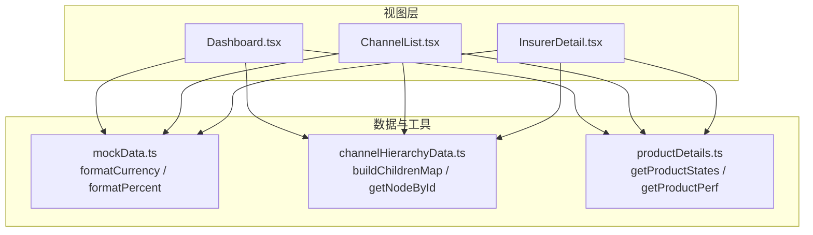
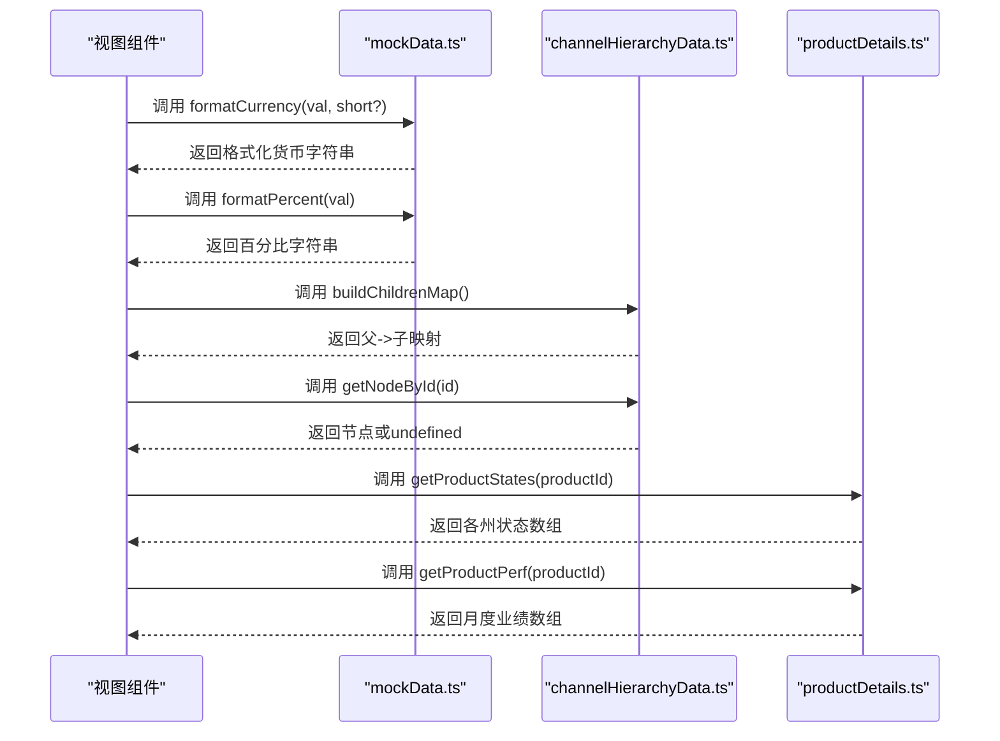
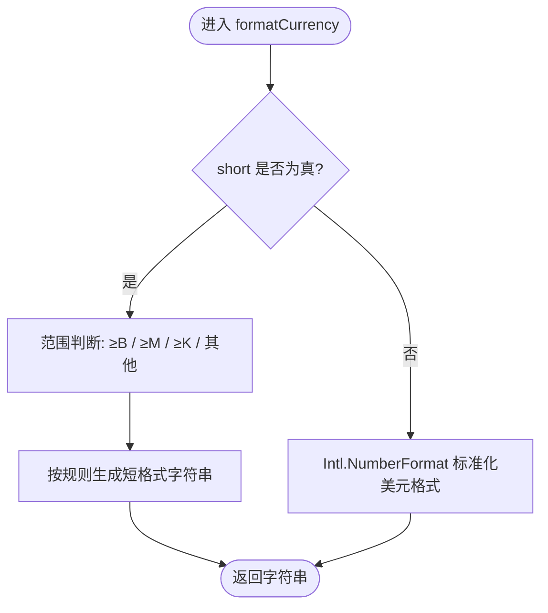
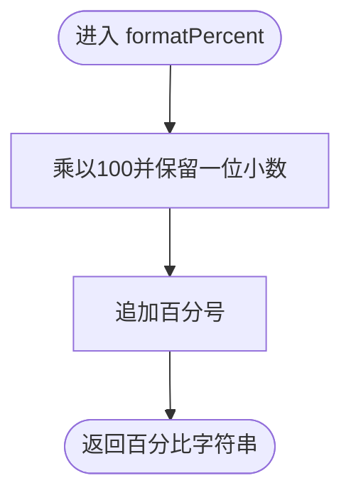
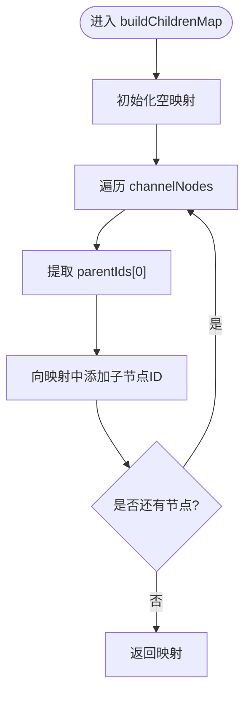
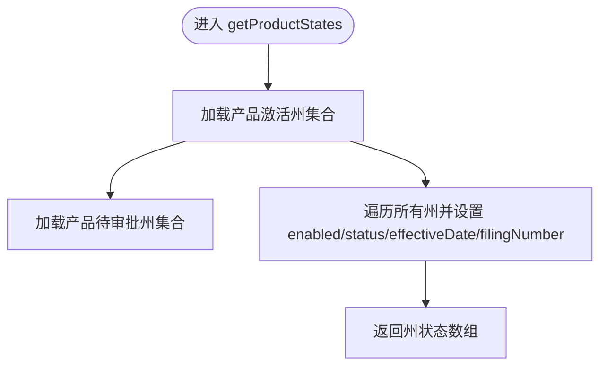
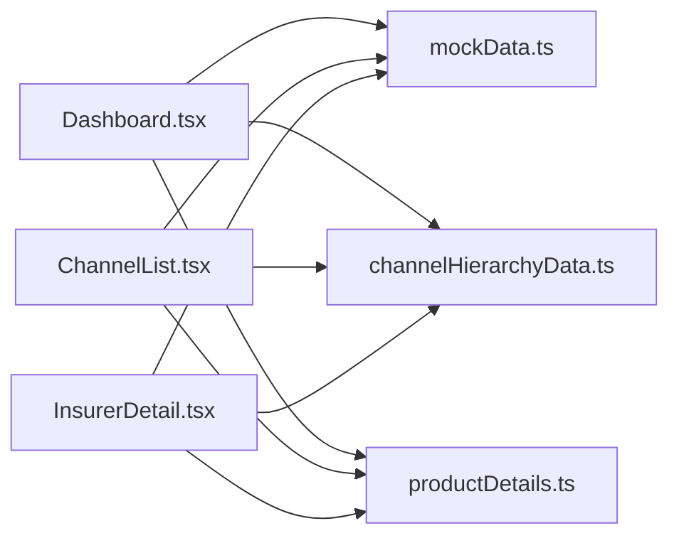

# 工具函数API

<cite>
**本文引用的文件**
- [mockData.ts](file://产品方案/UI-V1.0/src/data/mockData.ts)
- [channelHierarchyData.ts](file://产品方案/UI-V1.0/src/data/channelHierarchyData.ts)
- [productDetails.ts](file://产品方案/UI-V1.0/src/data/productDetails.ts)
- [Dashboard.tsx](file://产品方案/UI-V1.0/src/views/Dashboard.tsx)
- [ChannelList.tsx](file://产品方案/UI-V1.0/src/views/ChannelList.tsx)
- [InsurerDetail.tsx](file://产品方案/UI-V1.0/src/views/InsurerDetail.tsx)
</cite>

## 目录
1. [简介](#简介)
2. [项目结构](#项目结构)
3. [核心组件](#核心组件)
4. [架构总览](#架构总览)
5. [详细组件分析](#详细组件分析)
6. [依赖关系分析](#依赖关系分析)
7. [性能考虑](#性能考虑)
8. [故障排查指南](#故障排查指南)
9. [结论](#结论)
10. [附录](#附录)

## 简介
本参考文档面向 OverInsurData 平台的工具函数，聚焦数据展示与数据处理相关的辅助函数，包括货币格式化、百分比格式化、渠道层级构建与查询、产品状态与业绩获取等。文档提供每个函数的接口定义、参数说明、返回值格式、边界条件处理、异常处理建议以及性能优化建议，并给出在组件中的调用示例与最佳实践（错误处理与日志记录）。

## 项目结构
工具函数主要分布在以下模块：
- 数据与工具：src/data/mockData.ts（货币与百分比格式化）
- 渠道层级工具：src/data/channelHierarchyData.ts（构建子节点映射、按ID查找节点）
- 产品详情工具：src/data/productDetails.ts（获取产品可销售州列表、产品业绩数据）
- 视图层使用：src/views/Dashboard.tsx、ChannelList.tsx、InsurerDetail.tsx（消费上述工具函数进行展示）

图表来源
- [mockData.ts:431-443](file://产品方案/UI-V1.0/src/data/mockData.ts#L431-L443)
- [channelHierarchyData.ts:247-260](file://产品方案/UI-V1.0/src/data/channelHierarchyData.ts#L247-L260)
- [productDetails.ts:162-175](file://产品方案/UI-V1.0/src/data/productDetails.ts#L162-L175)
- [productDetails.ts:326-328](file://产品方案/UI-V1.0/src/data/productDetails.ts#L326-L328)
- [Dashboard.tsx:6-6](file://产品方案/UI-V1.0/src/views/Dashboard.tsx#L6-L6)
- [ChannelList.tsx:3-3](file://产品方案/UI-V1.0/src/views/ChannelList.tsx#L3-L3)
- [InsurerDetail.tsx:12-12](file://产品方案/UI-V1.0/src/views/InsurerDetail.tsx#L12-L12)

章节来源
- [mockData.ts:431-443](file://产品方案/UI-V1.0/src/data/mockData.ts#L431-L443)
- [channelHierarchyData.ts:247-260](file://产品方案/UI-V1.0/src/data/channelHierarchyData.ts#L247-L260)
- [productDetails.ts:162-175](file://产品方案/UI-V1.0/src/data/productDetails.ts#L162-L175)
- [productDetails.ts:326-328](file://产品方案/UI-V1.0/src/data/productDetails.ts#L326-L328)
- [Dashboard.tsx:6-6](file://产品方案/UI-V1.0/src/views/Dashboard.tsx#L6-L6)
- [ChannelList.tsx:3-3](file://产品方案/UI-V1.0/src/views/ChannelList.tsx#L3-L3)
- [InsurerDetail.tsx:12-12](file://产品方案/UI-V1.0/src/views/InsurerDetail.tsx#L12-L12)

## 核心组件
本节对关键工具函数进行逐一说明，包含接口、参数、返回值、边界条件、异常处理与性能建议。

### 货币格式化：formatCurrency
- 功能：将数值格式化为美元货币字符串；支持“短格式”显示（K/M/B）。
- 参数：
  - val: number — 金额数值
  - short?: boolean — 是否启用短格式（默认 false）
- 返回：string — 格式化后的货币字符串
- 行为与边界：
  - 当 short 为 true 时：
    - ≥ 十亿：以 B 结尾，保留一位小数
    - ≥ 百万：以 M 结尾，取整
    - ≥ 千：以 K 结尾，取整
    - 其他：直接显示整数美元
  - 当 short 为 false 时：使用 Intl.NumberFormat 输出标准美元格式，无小数位
- 异常与健壮性：
  - 输入非数字或 NaN：建议调用方在渲染前做类型校验，避免产生无效字符串
  - 负数：当前实现未显式处理负号，若业务需要请扩展
- 性能：
  - 短格式分支为常数时间比较与计算
  - 标准格式调用 Intl API，适合少量调用；高频场景可缓存结果或使用本地化实例复用
- 使用示例路径：
  - [Dashboard.tsx:22-22](file://产品方案/UI-V1.0/src/views/Dashboard.tsx#L22-L22)
  - [Dashboard.tsx:49-49](file://产品方案/UI-V1.0/src/views/Dashboard.tsx#L49-L49)
  - [ChannelList.tsx:90-90](file://产品方案/UI-V1.0/src/views/ChannelList.tsx#L90-L90)
  - [InsurerDetail.tsx:138-138](file://产品方案/UI-V1.0/src/views/InsurerDetail.tsx#L138-L138)

章节来源
- [mockData.ts:431-439](file://产品方案/UI-V1.0/src/data/mockData.ts#L431-L439)
- [Dashboard.tsx:22-22](file://产品方案/UI-V1.0/src/views/Dashboard.tsx#L22-L22)
- [Dashboard.tsx:49-49](file://产品方案/UI-V1.0/src/views/Dashboard.tsx#L49-L49)
- [ChannelList.tsx:90-90](file://产品方案/UI-V1.0/src/views/ChannelList.tsx#L90-L90)
- [InsurerDetail.tsx:138-138](file://产品方案/UI-V1.0/src/views/InsurerDetail.tsx#L138-L138)

### 百分比格式化：formatPercent
- 功能：将比率（0~1）格式化为带百分号的字符串，保留一位小数。
- 参数：
  - val: number — 比率值（如 0.851）
- 返回：string — 百分比字符串（如 “85.1%”）
- 行为与边界：
  - 负数：会输出负百分比
  - 大于1的值：会输出超过100%的百分比
  - 非数字或 NaN：建议调用方校验后再传入
- 异常与健壮性：
  - 建议在调用处增加类型守卫，确保输入为有限数值
- 性能：
  - 纯数学运算与字符串拼接，开销极低
- 使用示例路径：
  - [Dashboard.tsx:95-95](file://产品方案/UI-V1.0/src/views/Dashboard.tsx#L95-L95)
  - [ChannelList.tsx:93-93](file://产品方案/UI-V1.0/src/views/ChannelList.tsx#L93-L93)
  - [InsurerDetail.tsx:140-140](file://产品方案/UI-V1.0/src/views/InsurerDetail.tsx#L140-L140)

章节来源
- [mockData.ts:441-443](file://产品方案/UI-V1.0/src/data/mockData.ts#L441-L443)
- [Dashboard.tsx:95-95](file://产品方案/UI-V1.0/src/views/Dashboard.tsx#L95-L95)
- [ChannelList.tsx:93-93](file://产品方案/UI-V1.0/src/views/ChannelList.tsx#L93-L93)
- [InsurerDetail.tsx:140-140](file://产品方案/UI-V1.0/src/views/InsurerDetail.tsx#L140-L140)

### 渠道层级：buildChildrenMap
- 功能：根据渠道节点数据构建父节点到子节点 ID 列表的映射，便于树形渲染。
- 参数：无
- 返回：Record<string, string[]> — 键为父节点 ID，值为子节点 ID 数组
- 行为与边界：
  - 仅基于 channelNodes 中节点的 parentIds[0] 建立父子关系
  - 若某节点无父级，则不会出现在映射的键中
- 异常与健壮性：
  - 空数据：返回空映射
  - 重复 ID：以最后一次出现为准（取决于遍历顺序）
- 性能：
  - 单次线性扫描 O(n)，n 为节点数量
- 使用示例路径：
  - [channelHierarchyData.ts:247-256](file://产品方案/UI-V1.0/src/data/channelHierarchyData.ts#L247-L256)

章节来源
- [channelHierarchyData.ts:247-256](file://产品方案/UI-V1.0/src/data/channelHierarchyData.ts#L247-L256)

### 渠道层级：getNodeById
- 功能：根据节点 ID 查找对应的渠道节点。
- 参数：
  - id: string — 节点唯一标识
- 返回：ChannelNode | undefined — 找到则返回节点，否则返回 undefined
- 行为与边界：
  - 未找到：返回 undefined
- 异常与健壮性：
  - 空字符串或非法 ID：返回 undefined
- 性能：
  - 线性查找 O(n)
- 使用示例路径：
  - [channelHierarchyData.ts:258-260](file://产品方案/UI-V1.0/src/data/channelHierarchyData.ts#L258-L260)

章节来源
- [channelHierarchyData.ts:258-260](file://产品方案/UI-V1.0/src/data/channelHierarchyData.ts#L258-L260)

### 产品状态：getProductStates
- 功能：根据产品 ID 生成各州的可用性与状态信息，用于产品上架配置界面。
- 参数：
  - productId: string — 产品标识（如 p1、p7、p8）
- 返回：ProductState[] — 每个州的状态对象，包含启用标志、状态、生效日期、备案编号等
- 行为与边界：
  - 不同产品有各自的激活州集合；未知产品回退到默认激活州集合
  - 部分产品存在“待审批”州集合（如 p1 的部分州）
- 异常与健壮性：
  - 未知 productId：仍会返回所有州，但仅默认激活州为 active
- 性能：
  - 基于预定义集合与 Map/Set 判断，整体复杂度接近 O(m)，m 为州数量
- 使用示例路径：
  - [productDetails.ts:162-175](file://产品方案/UI-V1.0/src/data/productDetails.ts#L162-L175)

章节来源
- [productDetails.ts:162-175](file://产品方案/UI-V1.0/src/data/productDetails.ts#L162-L175)

### 产品业绩：getProductPerf
- 功能：根据产品 ID 获取其月度业绩数据；若不存在则回退到默认产品业绩。
- 参数：
  - productId: string — 产品标识
- 返回：ProductPerformanceData[] — 月度业绩数组
- 行为与边界：
  - 找不到指定产品时，返回默认产品（p1）的业绩数据
- 异常与健壮性：
  - 空字符串或非法 ID：返回默认产品业绩
- 性能：
  - 对象查找 O(1)，返回引用，无额外拷贝
- 使用示例路径：
  - [productDetails.ts:326-328](file://产品方案/UI-V1.0/src/data/productDetails.ts#L326-L328)

章节来源
- [productDetails.ts:326-328](file://产品方案/UI-V1.0/src/data/productDetails.ts#L326-L328)

## 架构总览
下图展示了工具函数在视图层的调用关系与数据流向。

图表来源
- [mockData.ts:431-443](file://产品方案/UI-V1.0/src/data/mockData.ts#L431-L443)
- [channelHierarchyData.ts:247-260](file://产品方案/UI-V1.0/src/data/channelHierarchyData.ts#L247-L260)
- [productDetails.ts:162-175](file://产品方案/UI-V1.0/src/data/productDetails.ts#L162-L175)
- [productDetails.ts:326-328](file://产品方案/UI-V1.0/src/data/productDetails.ts#L326-L328)

## 详细组件分析

### 货币格式化流程

图表来源
- [mockData.ts:431-439](file://产品方案/UI-V1.0/src/data/mockData.ts#L431-L439)

章节来源
- [mockData.ts:431-439](file://产品方案/UI-V1.0/src/data/mockData.ts#L431-L439)

### 百分比格式化流程

图表来源
- [mockData.ts:441-443](file://产品方案/UI-V1.0/src/data/mockData.ts#L441-L443)

章节来源
- [mockData.ts:441-443](file://产品方案/UI-V1.0/src/data/mockData.ts#L441-L443)

### 渠道层级构建流程

图表来源
- [channelHierarchyData.ts:247-256](file://产品方案/UI-V1.0/src/data/channelHierarchyData.ts#L247-L256)

章节来源
- [channelHierarchyData.ts:247-256](file://产品方案/UI-V1.0/src/data/channelHierarchyData.ts#L247-L256)

### 产品状态生成流程

图表来源
- [productDetails.ts:162-175](file://产品方案/UI-V1.0/src/data/productDetails.ts#L162-L175)

章节来源
- [productDetails.ts:162-175](file://产品方案/UI-V1.0/src/data/productDetails.ts#L162-L175)

## 依赖关系分析
- 视图层对工具函数的依赖：
  - Dashboard.tsx、ChannelList.tsx、InsurerDetail.tsx 均从 mockData.ts 导入 formatCurrency 与 formatPercent
  - 渠道层级相关视图可从 channelHierarchyData.ts 导入 buildChildrenMap 与 getNodeById
  - 产品配置与报表相关视图可从 productDetails.ts 导入 getProductStates 与 getProductPerf

图表来源
- [Dashboard.tsx:6-6](file://产品方案/UI-V1.0/src/views/Dashboard.tsx#L6-L6)
- [ChannelList.tsx:3-3](file://产品方案/UI-V1.0/src/views/ChannelList.tsx#L3-L3)
- [InsurerDetail.tsx:12-12](file://产品方案/UI-V1.0/src/views/InsurerDetail.tsx#L12-L12)
- [mockData.ts:431-443](file://产品方案/UI-V1.0/src/data/mockData.ts#L431-L443)
- [channelHierarchyData.ts:247-260](file://产品方案/UI-V1.0/src/data/channelHierarchyData.ts#L247-L260)
- [productDetails.ts:162-175](file://产品方案/UI-V1.0/src/data/productDetails.ts#L162-L175)
- [productDetails.ts:326-328](file://产品方案/UI-V1.0/src/data/productDetails.ts#L326-L328)

章节来源
- [Dashboard.tsx:6-6](file://产品方案/UI-V1.0/src/views/Dashboard.tsx#L6-L6)
- [ChannelList.tsx:3-3](file://产品方案/UI-V1.0/src/views/ChannelList.tsx#L3-L3)
- [InsurerDetail.tsx:12-12](file://产品方案/UI-V1.0/src/views/InsurerDetail.tsx#L12-L12)
- [mockData.ts:431-443](file://产品方案/UI-V1.0/src/data/mockData.ts#L431-L443)
- [channelHierarchyData.ts:247-260](file://产品方案/UI-V1.0/src/data/channelHierarchyData.ts#L247-L260)
- [productDetails.ts:162-175](file://产品方案/UI-V1.0/src/data/productDetails.ts#L162-L175)
- [productDetails.ts:326-328](file://产品方案/UI-V1.0/src/data/productDetails.ts#L326-L328)

## 性能考虑
- formatCurrency：
  - 短格式分支为常数时间操作，适合高频渲染
  - 标准格式调用 Intl API，建议在大数据量表格中考虑结果缓存或批量格式化
- formatPercent：
  - 极轻量，无需特殊优化
- buildChildrenMap：
  - 一次性构建映射后供多次读取，避免重复遍历
- getNodeById：
  - 若频繁查找，可维护一个 ID→节点 的索引表以提升为 O(1)
- getProductStates：
  - 每次调用都会遍历州列表，建议在组件内缓存结果或使用 useMemo
- getProductPerf：
  - 对象查找为 O(1)，注意返回的是引用，避免误修改原始数据

## 故障排查指南
- 常见问题与定位：
  - 货币显示异常：检查传入值是否为有效数字；确认是否需要短格式
  - 百分比显示异常：确认输入为比率而非百分数；检查负数与超100%是否符合预期
  - 渠道树为空：确认 channelNodes 数据是否存在；检查 parentIds 是否正确
  - 产品状态全不可用：确认 productId 是否在已知集合中；必要时添加默认策略
  - 产品业绩为空：确认 productId 是否存在；当前实现会回退到默认产品业绩
- 建议的错误处理与日志：
  - 在调用处增加类型校验（如 typeof === 'number'），失败时记录警告日志并返回占位符
  - 对可能为空的返回值（如 getNodeById）进行判空处理，并提供降级展示
  - 对大量数据渲染场景，结合 React.memo/useMemo 减少重复计算

章节来源
- [channelHierarchyData.ts:258-260](file://产品方案/UI-V1.0/src/data/channelHierarchyData.ts#L258-L260)
- [productDetails.ts:162-175](file://产品方案/UI-V1.0/src/data/productDetails.ts#L162-L175)
- [productDetails.ts:326-328](file://产品方案/UI-V1.0/src/data/productDetails.ts#L326-L328)

## 结论
OverInsurData 平台的工具函数覆盖了货币与百分比格式化、渠道层级构建与查询、产品状态与业绩获取等常用能力。这些函数简洁高效，适合在视图层广泛复用。建议在调用侧加强参数校验与缓存策略，以获得更稳定的渲染表现与更好的性能。

## 附录
- 组件调用示例路径（不展示代码内容）：
  - 货币与百分比在仪表盘与渠道列表的使用：
    - [Dashboard.tsx:22-22](file://产品方案/UI-V1.0/src/views/Dashboard.tsx#L22-L22)
    - [Dashboard.tsx:49-49](file://产品方案/UI-V1.0/src/views/Dashboard.tsx#L49-L49)
    - [Dashboard.tsx:95-95](file://产品方案/UI-V1.0/src/views/Dashboard.tsx#L95-L95)
    - [ChannelList.tsx:90-90](file://产品方案/UI-V1.0/src/views/ChannelList.tsx#L90-L90)
    - [ChannelList.tsx:93-93](file://产品方案/UI-V1.0/src/views/ChannelList.tsx#L93-L93)
    - [InsurerDetail.tsx:138-138](file://产品方案/UI-V1.0/src/views/InsurerDetail.tsx#L138-L138)
    - [InsurerDetail.tsx:140-140](file://产品方案/UI-V1.0/src/views/InsurerDetail.tsx#L140-L140)
  - 渠道层级工具的使用：
    - [channelHierarchyData.ts:247-256](file://产品方案/UI-V1.0/src/data/channelHierarchyData.ts#L247-L256)
    - [channelHierarchyData.ts:258-260](file://产品方案/UI-V1.0/src/data/channelHierarchyData.ts#L258-L260)
  - 产品状态与业绩工具的使用：
    - [productDetails.ts:162-175](file://产品方案/UI-V1.0/src/data/productDetails.ts#L162-L175)
    - [productDetails.ts:326-328](file://产品方案/UI-V1.0/src/data/productDetails.ts#L326-L328)