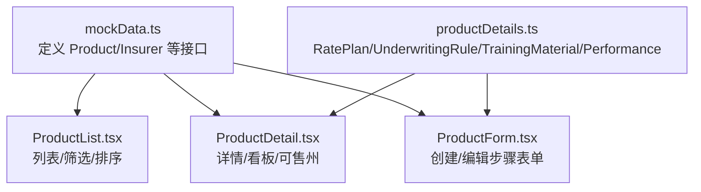
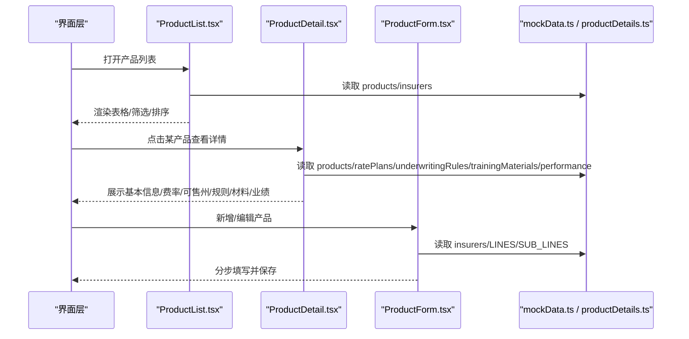
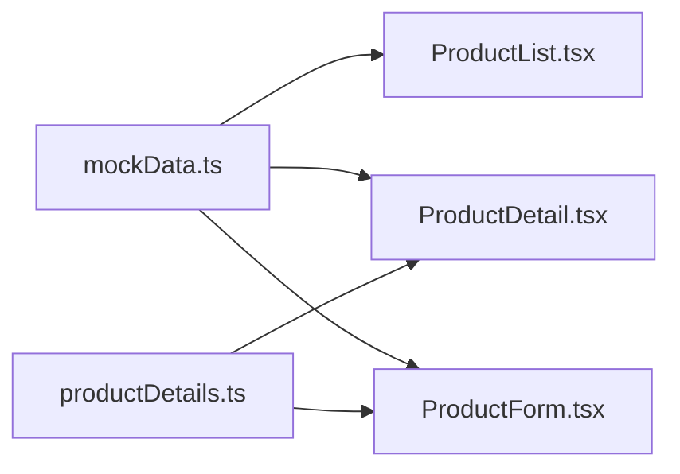

# 产品数据模型

<cite>
**本文引用的文件**
- [mockData.ts](file://产品方案/UI-V1.0/src/data/mockData.ts)
- [productDetails.ts](file://产品方案/UI-V1.0/src/data/productDetails.ts)
- [ProductForm.tsx](file://产品方案/UI-V1.0/src/views/ProductForm.tsx)
- [ProductDetail.tsx](file://产品方案/UI-V1.0/src/views/ProductDetail.tsx)
- [ProductList.tsx](file://产品方案/UI-V1.0/src/views/ProductList.tsx)
</cite>

## 目录
1. [简介](#简介)
2. [项目结构](#项目结构)
3. [核心组件](#核心组件)
4. [架构总览](#架构总览)
5. [详细组件分析](#详细组件分析)
6. [依赖关系分析](#依赖关系分析)
7. [性能考量](#性能考量)
8. [故障排查指南](#故障排查指南)
9. [结论](#结论)
10. [附录](#附录)

## 简介
本文件为 OverInsurData 平台“产品数据模型”的 API 参考文档，聚焦于 Product 接口的字段定义、业务分类、状态流转与财务指标，并提供不同保险产品线（Auto、Home、Commercial、Cyber 等）的数据示例说明。同时解释 states 数组的州级销售许可管理以及 launchDate 的时间格式要求。

## 项目结构
- 数据模型与样例数据：
  - 产品主数据与枚举类型定义位于 mockData.ts
  - 费率方案、核保规则、培训材料、月度业绩等扩展数据位于 productDetails.ts
- 前端视图：
  - 产品列表、详情、表单分别由 ProductList.tsx、ProductDetail.tsx、ProductForm.tsx 实现，用于展示和编辑产品数据。

图表来源
- [mockData.ts:33-48](file://产品方案/UI-V1.0/src/data/mockData.ts#L33-L48)
- [productDetails.ts:1-64](file://产品方案/UI-V1.0/src/data/productDetails.ts#L1-L64)
- [ProductList.tsx:20-73](file://产品方案/UI-V1.0/src/views/ProductList.tsx#L20-L73)
- [ProductDetail.tsx:72-105](file://产品方案/UI-V1.0/src/views/ProductDetail.tsx#L72-L105)
- [ProductForm.tsx:58-113](file://产品方案/UI-V1.0/src/views/ProductForm.tsx#L58-L113)

章节来源
- [mockData.ts:33-48](file://产品方案/UI-V1.0/src/data/mockData.ts#L33-L48)
- [productDetails.ts:1-64](file://产品方案/UI-V1.0/src/data/productDetails.ts#L1-L64)
- [ProductList.tsx:20-73](file://产品方案/UI-V1.0/src/views/ProductList.tsx#L20-L73)
- [ProductDetail.tsx:72-105](file://产品方案/UI-V1.0/src/views/ProductDetail.tsx#L72-L105)
- [ProductForm.tsx:58-113](file://产品方案/UI-V1.0/src/views/ProductForm.tsx#L58-L113)

## 核心组件
- Product 接口（核心实体）
  - 标识与归属：id、insurerId
  - 基本信息：name、code、line、subLine、type
  - 销售与合规：status、states、launchDate
  - 财务指标：premium、policyCount、lossRatio、renewalRate
- 相关扩展模型
  - RatePlan：费率方案（基础费率、保费区间、有效期、备案状态、评分因子）
  - UnderwritingRule：核保规则（资格/费率/除外/转介，动作与阈值）
  - TrainingMaterial：培训材料（类型、版本、有效期、受众）
  - ProductPerformanceData：月度业绩（保费、新保、续保、保单数、赔付率、理赔数）

章节来源
- [mockData.ts:33-48](file://产品方案/UI-V1.0/src/data/mockData.ts#L33-L48)
- [productDetails.ts:1-64](file://产品方案/UI-V1.0/src/data/productDetails.ts#L1-L64)

## 架构总览
下图展示了产品数据在系统中的主要交互：列表页筛选/排序、详情页聚合展示（含可售州、费率方案、核保规则、培训材料、业绩看板）、表单页创建/编辑。

图表来源
- [ProductList.tsx:20-73](file://产品方案/UI-V1.0/src/views/ProductList.tsx#L20-L73)
- [ProductDetail.tsx:72-105](file://产品方案/UI-V1.0/src/views/ProductDetail.tsx#L72-L105)
- [ProductForm.tsx:58-113](file://产品方案/UI-V1.0/src/views/ProductForm.tsx#L58-L113)
- [mockData.ts:33-48](file://产品方案/UI-V1.0/src/data/mockData.ts#L33-L48)
- [productDetails.ts:1-64](file://产品方案/UI-V1.0/src/data/productDetails.ts#L1-L64)

## 详细组件分析

### Product 接口字段定义与语义
- id: string — 产品唯一标识
- insurerId: string — 所属保险公司标识
- name: string — 产品全称
- code: string — 产品代码（建议遵循“承保方-业务线-序号”规范）
- line: string — 业务线（如 Auto、Home、Commercial、Cyber、Life、Travel、Professional、D&O、E&O、Marine、Specialty）
- subLine: string — 业务子线（随 line 变化，例如 Personal Auto、High-Value Home、Enterprise Cyber 等）
- type: 'Individual' | 'Group' | 'Voluntary' — 产品类型（个人险/团体险/自愿福利险）
- status: 'on-sale' | 'off-sale' | 'paused' | 'pending' — 产品状态
- states: string[] — 可售州列表；支持具体州代码或特殊值 ALL（表示全国可售）
- premium: number — 总保费（累计金额）
- policyCount: number — 保单数量
- lossRatio: number — 赔付率（比值，如 0.612）
- renewalRate: number — 续保率（比值，如 0.871）
- launchDate: string — 上架日期（采用 ISO 日期字符串格式，如 YYYY-MM-DD）

章节来源
- [mockData.ts:33-48](file://产品方案/UI-V1.0/src/data/mockData.ts#L33-L48)
- [ProductList.tsx:165-232](file://产品方案/UI-V1.0/src/views/ProductList.tsx#L165-L232)
- [ProductDetail.tsx:166-182](file://产品方案/UI-V1.0/src/views/ProductDetail.tsx#L166-L182)

### 产品状态 status 的业务含义与转换规则
- on-sale（在售）：产品当前可被渠道报价出单
- off-sale（停售）：产品已下架，不可出单
- paused（暂停）：临时停止销售（可能因合规/风控/系统维护）
- pending（待审核）：新产品或变更处于审批流程中

常见转换规则（基于界面操作与状态映射）：
- 从 pending → on-sale：审批通过后上架
- 从 on-sale → off-sale：下架
- 从 on-sale → paused：暂停销售
- 从 paused → on-sale：恢复销售
- 从 off-sale → pending：重新提交上架申请
- 从 paused → pending：调整配置后重新审批

章节来源
- [ProductDetail.tsx:92-98](file://产品方案/UI-V1.0/src/views/ProductDetail.tsx#L92-L98)
- [ProductList.tsx:64-69](file://产品方案/UI-V1.0/src/views/ProductList.tsx#L64-L69)

### 财务指标字段说明
- premium（总保费）：产品累计保费规模，常用于衡量业务体量
- policyCount（保单数）：有效保单数量，反映覆盖客户规模
- lossRatio（赔付率）：理赔支出与保费收入的比例，用于评估风险与定价合理性
- renewalRate（续保率）：老客户续保比例，体现产品粘性与服务质量

章节来源
- [mockData.ts:33-48](file://产品方案/UI-V1.0/src/data/mockData.ts#L33-L48)
- [ProductList.tsx:147-206](file://产品方案/UI-V1.0/src/views/ProductList.tsx#L147-L206)
- [ProductDetail.tsx:166-182](file://产品方案/UI-V1.0/src/views/ProductDetail.tsx#L166-L182)

### 业务分类字段（line、subLine、type）
- line：业务线，决定产品大类与定价策略、核保规则、监管要求
- subLine：业务子线，细化到具体保障场景（如 Personal Auto、High-Value Home、Enterprise Cyber）
- type：产品类型，区分个人/团体/自愿福利，影响销售渠道与合规

章节来源
- [ProductForm.tsx:15-28](file://产品方案/UI-V1.0/src/views/ProductForm.tsx#L15-L28)
- [ProductDetail.tsx:136-145](file://产品方案/UI-V1.0/src/views/ProductDetail.tsx#L136-L145)

### 可售州 states 与 launchDate 时间格式
- states：
  - 使用美国州缩写代码（如 CA、NY、TX），或特殊值 ALL 表示全国可售
  - 可售州状态分为 active（生效）、pending（待审批）、not-available（未开通）
  - 可通过搜索与批量选择进行配置
- launchDate：
  - 采用 ISO 日期字符串格式（YYYY-MM-DD），用于记录产品上架日期
  - 详情页会计算上线时长（月）以辅助运营分析

章节来源
- [ProductForm.tsx:88-108](file://产品方案/UI-V1.0/src/views/ProductForm.tsx#L88-L108)
- [ProductDetail.tsx:334-391](file://产品方案/UI-V1.0/src/views/ProductDetail.tsx#L334-L391)
- [ProductList.tsx:187-207](file://产品方案/UI-V1.0/src/views/ProductList.tsx#L187-L207)

### 不同产品线的数据结构差异（示例）
- Auto（车险）
  - 典型子线：Personal Auto、Commercial Auto、Fleet Auto
  - 关注点：驾驶记录、车型系数、信用评分、地区系数、用途系数
  - 示例产品：p1（Travelers Auto Insurance）
- Home（家财险）
  - 典型子线：Homeowners、High-Value Home、Renters、Condo
  - 关注点：房产重置成本、安保设施、自然风险、历史赔付
  - 示例产品：p2（Travelers Homeowners Plus）、p7（Chubb Masterpiece Homeowners）
- Commercial（商业险）
  - 典型子线：Commercial Property、BOP、General Liability、Workers Comp
  - 关注点：企业规模、行业风险、安全态势、供应链风险
  - 示例产品：p3（Travelers Commercial Property）、p12（Hartford Business Owner Policy）
- Cyber（网络安全险）
  - 典型子线：SME Cyber、Enterprise Cyber、Technology E&O
  - 关注点：年收入规模、员工数量、安全态势评分、第三方供应链
  - 示例产品：p8（Chubb Cyber Enterprise Risk）

章节来源
- [mockData.ts:349-362](file://产品方案/UI-V1.0/src/data/mockData.ts#L349-L362)
- [productDetails.ts:66-137](file://产品方案/UI-V1.0/src/data/productDetails.ts#L66-L137)
- [ProductForm.tsx:15-28](file://产品方案/UI-V1.0/src/views/ProductForm.tsx#L15-L28)

### 费率方案 RatePlan（关联产品）
- 关键字段：id、productId、name、tier、baseRate、minPremium、maxPremium、effectiveDate、expiryDate、status、ratingFactors、filingStatus
- 作用：定义产品的费率结构与定价区间，支持多版本与备案状态管理

章节来源
- [productDetails.ts:1-14](file://产品方案/UI-V1.0/src/data/productDetails.ts#L1-L14)
- [productDetails.ts:66-137](file://产品方案/UI-V1.0/src/data/productDetails.ts#L66-L137)
- [ProductDetail.tsx:264-332](file://产品方案/UI-V1.0/src/views/ProductDetail.tsx#L264-L332)

### 核保规则 UnderwritingRule（关联产品）
- 关键字段：id、productId、name、category、priority、condition、conditionDetail、action、actionValue、status、lastModified、modifiedBy
- 作用：自动化决策逻辑（资格、费率、除外、转介），支持测试与停用

章节来源
- [productDetails.ts:26-39](file://产品方案/UI-V1.0/src/data/productDetails.ts#L26-L39)
- [productDetails.ts:177-242](file://产品方案/UI-V1.0/src/data/productDetails.ts#L177-L242)
- [ProductDetail.tsx:394-445](file://产品方案/UI-V1.0/src/views/ProductDetail.tsx#L394-L445)

### 培训材料 TrainingMaterial（关联产品）
- 关键字段：id、productId、title、type、fileName、fileSize、uploadDate、uploadedBy、version、downloads、requiredFor、expiryDate
- 作用：渠道与销售培训资料管理，支持版本控制与到期提醒

章节来源
- [productDetails.ts:41-54](file://产品方案/UI-V1.0/src/data/productDetails.ts#L41-L54)
- [productDetails.ts:244-297](file://产品方案/UI-V1.0/src/data/productDetails.ts#L244-L297)
- [ProductDetail.tsx:447-507](file://产品方案/UI-V1.0/src/views/ProductDetail.tsx#L447-L507)

### 月度业绩 ProductPerformanceData（关联产品）
- 关键字段：month、premium、newBiz、renewal、policies、lossRatio、claimsCount
- 作用：跟踪产品月度保费、新保/续保贡献、保单规模、赔付率与理赔量

章节来源
- [productDetails.ts:56-64](file://产品方案/UI-V1.0/src/data/productDetails.ts#L56-L64)
- [productDetails.ts:299-328](file://产品方案/UI-V1.0/src/data/productDetails.ts#L299-L328)
- [ProductDetail.tsx:509-594](file://产品方案/UI-V1.0/src/views/ProductDetail.tsx#L509-L594)

## 依赖关系分析
- 数据源依赖：
  - ProductList.tsx、ProductDetail.tsx、ProductForm.tsx 均依赖 mockData.ts 中的 products、insurers 等数据
  - ProductDetail.tsx 还依赖 productDetails.ts 中的 ratePlans、underwritingRules、trainingMaterials、productPerformance
- 视图间依赖：
  - 列表页提供筛选与排序，跳转到详情页
  - 详情页聚合多维度信息（费率、规则、材料、业绩）
  - 表单页提供创建/编辑能力，依赖 insurers 与 LINES/SUB_LINES

图表来源
- [mockData.ts:33-48](file://产品方案/UI-V1.0/src/data/mockData.ts#L33-L48)
- [productDetails.ts:1-64](file://产品方案/UI-V1.0/src/data/productDetails.ts#L1-L64)
- [ProductList.tsx:20-73](file://产品方案/UI-V1.0/src/views/ProductList.tsx#L20-L73)
- [ProductDetail.tsx:72-105](file://产品方案/UI-V1.0/src/views/ProductDetail.tsx#L72-L105)
- [ProductForm.tsx:58-113](file://产品方案/UI-V1.0/src/views/ProductForm.tsx#L58-L113)

章节来源
- [mockData.ts:33-48](file://产品方案/UI-V1.0/src/data/mockData.ts#L33-L48)
- [productDetails.ts:1-64](file://产品方案/UI-V1.0/src/data/productDetails.ts#L1-L64)
- [ProductList.tsx:20-73](file://产品方案/UI-V1.0/src/views/ProductList.tsx#L20-L73)
- [ProductDetail.tsx:72-105](file://产品方案/UI-V1.0/src/views/ProductDetail.tsx#L72-L105)
- [ProductForm.tsx:58-113](file://产品方案/UI-V1.0/src/views/ProductForm.tsx#L58-L113)

## 性能考量
- 列表页筛选与排序：
  - 使用 useMemo 缓存过滤与排序结果，避免重复计算
- 详情页数据聚合：
  - 按 productId 过滤费率方案、核保规则、培训材料与业绩数据，减少不必要渲染
- 可售州展示：
  - 支持搜索与分页式网格布局，提升大列表可读性

章节来源
- [ProductList.tsx:29-47](file://产品方案/UI-V1.0/src/views/ProductList.tsx#L29-L47)
- [ProductDetail.tsx:77-83](file://产品方案/UI-V1.0/src/views/ProductDetail.tsx#L77-L83)
- [ProductDetail.tsx:334-391](file://产品方案/UI-V1.0/src/views/ProductDetail.tsx#L334-L391)

## 故障排查指南
- 状态显示异常：
  - 检查 status 映射是否正确（on-sale/off-sale/paused/pending）
  - 确认列表与详情页的状态标签一致
- 可售州状态不一致：
  - 核对 getProductStates 返回的 active/pending/not-available 状态
  - 确认 selectedStates 与 states 字段同步
- 财务指标格式化错误：
  - 使用 formatCurrency/formatPercent 统一输出格式
  - 确保数值类型为 number，避免 NaN/undefined

章节来源
- [ProductDetail.tsx:92-98](file://产品方案/UI-V1.0/src/views/ProductDetail.tsx#L92-L98)
- [ProductList.tsx:64-69](file://产品方案/UI-V1.0/src/views/ProductList.tsx#L64-L69)
- [productDetails.ts:162-175](file://产品方案/UI-V1.0/src/data/productDetails.ts#L162-L175)
- [mockData.ts:431-443](file://产品方案/UI-V1.0/src/data/mockData.ts#L431-L443)

## 结论
本文档系统化梳理了 OverInsurData 平台的产品数据模型，涵盖 Product 接口的字段定义、业务分类、状态流转与财务指标，并结合不同保险产品线提供了结构化示例。通过可视化图表与源码引用，帮助开发者与业务人员准确理解产品数据的结构与使用方式。

## 附录
- 产品数据示例（不同产品线）
  - Auto：p1（Travelers Auto Insurance）— 个人车险，多州可售，关注驾驶记录与车型系数
  - Home：p2（Travelers Homeowners Plus）、p7（Chubb Masterpiece Homeowners）— 家财与高价值房产，关注重置成本与自然风险
  - Commercial：p3（Travelers Commercial Property）、p12（Hartford Business Owner Policy）— 商业财产与企业责任，关注企业规模与行业风险
  - Cyber：p8（Chubb Cyber Enterprise Risk）— 企业网络安全险，关注安全态势与供应链风险

章节来源
- [mockData.ts:349-362](file://产品方案/UI-V1.0/src/data/mockData.ts#L349-L362)
- [productDetails.ts:66-137](file://产品方案/UI-V1.0/src/data/productDetails.ts#L66-L137)