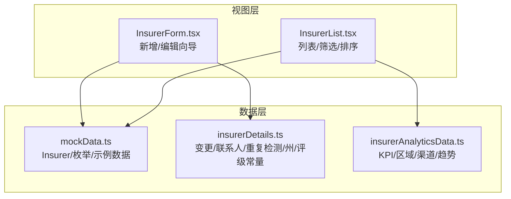
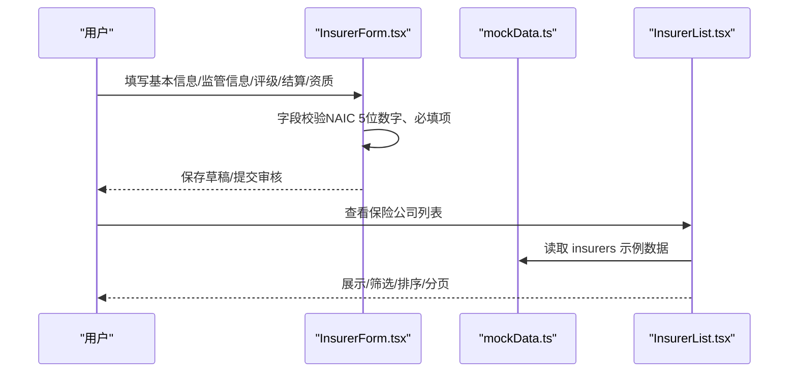
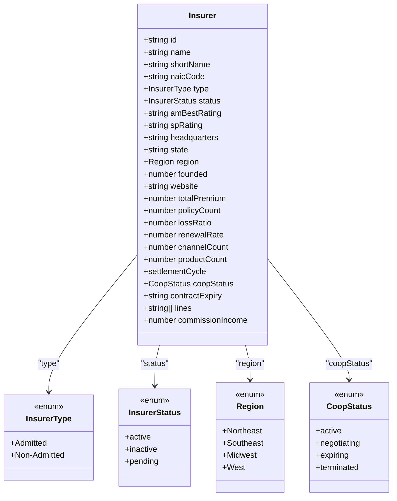
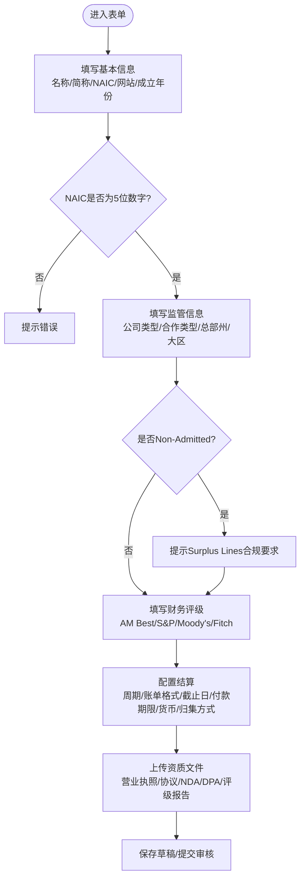
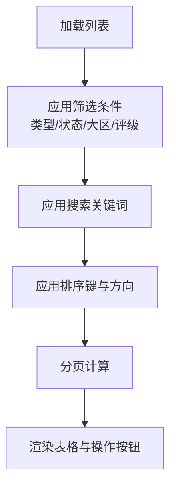
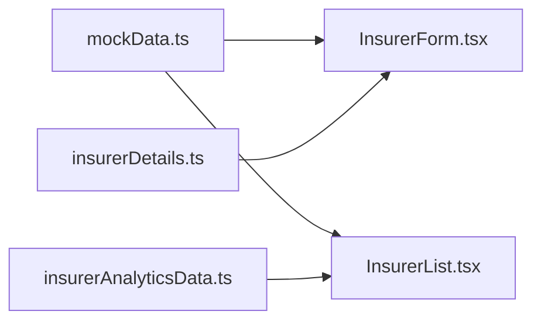

# 保险公司数据模型

<cite>
**本文引用的文件**
- [mockData.ts](file://产品方案/UI-V1.0/src/data/mockData.ts)
- [insurerDetails.ts](file://产品方案/UI-V1.0/src/data/insurerDetails.ts)
- [insurerAnalyticsData.ts](file://产品方案/UI-V1.0/src/data/insurerAnalyticsData.ts)
- [InsurerForm.tsx](file://产品方案/UI-V1.0/src/views/InsurerForm.tsx)
- [InsurerList.tsx](file://产品方案/UI-V1.0/src/views/InsurerList.tsx)
</cite>

## 目录
1. [简介](#简介)
2. [项目结构](#项目结构)
3. [核心组件](#核心组件)
4. [架构总览](#架构总览)
5. [详细组件分析](#详细组件分析)
6. [依赖关系分析](#依赖关系分析)
7. [性能考量](#性能考量)
8. [故障排查指南](#故障排查指南)
9. [结论](#结论)
10. [附录](#附录)

## 简介
本参考文档面向OverInsurData平台的“保险公司数据模型”，聚焦于Insurer接口及其相关类型定义，系统性说明字段含义、类型约束、取值范围与业务规则，并提供示例数据与类型安全开发实践建议。内容覆盖：
- Insurer核心属性：id、name、shortName、naicCode等
- 枚举与联合类型：InsurerType（Admitted/Non-Admitted）、InsurerStatus（active/inactive/pending）、Region（Northeast/Southeast/Midwest/West）
- 财务指标：totalPremium、policyCount、lossRatio、renewalRate等
- 区域分类与州列表、评级体系（AM Best、S&P等）
- 表单校验与前端使用方式（步骤化录入、必填项、可选属性最佳实践）

## 项目结构
本项目采用按功能域组织的前端代码结构，数据与视图分离：
- 数据层：mockData.ts 定义核心类型与示例数据；insurerDetails.ts 提供变更历史、联系人、重复检测等扩展实体；insurerAnalyticsData.ts 提供KPI、区域、渠道等分析数据
- 视图层：InsurerForm.tsx 实现保险公司新增/编辑的向导式表单；InsurerList.tsx 实现列表展示、筛选、排序与批量操作

图表来源
- [mockData.ts:6-31](file://产品方案/UI-V1.0/src/data/mockData.ts#L6-L31)
- [insurerDetails.ts:130-140](file://产品方案/UI-V1.0/src/data/insurerDetails.ts#L130-L140)
- [insurerAnalyticsData.ts:100-119](file://产品方案/UI-V1.0/src/data/insurerAnalyticsData.ts#L100-L119)
- [InsurerForm.tsx:65-91](file://产品方案/UI-V1.0/src/views/InsurerForm.tsx#L65-L91)
- [InsurerList.tsx:31-41](file://产品方案/UI-V1.0/src/views/InsurerList.tsx#L31-L41)

章节来源
- [mockData.ts:6-31](file://产品方案/UI-V1.0/src/data/mockData.ts#L6-L31)
- [insurerDetails.ts:130-140](file://产品方案/UI-V1.0/src/data/insurerDetails.ts#L130-L140)
- [insurerAnalyticsData.ts:100-119](file://产品方案/UI-V1.0/src/data/insurerAnalyticsData.ts#L100-L119)
- [InsurerForm.tsx:65-91](file://产品方案/UI-V1.0/src/views/InsurerForm.tsx#L65-L91)
- [InsurerList.tsx:31-41](file://产品方案/UI-V1.0/src/views/InsurerList.tsx#L31-L41)

## 核心组件
本节对Insurer接口及关键枚举进行逐字段说明，包括类型、业务含义、取值范围与约束。

- 标识与名称
  - id: string，唯一标识
  - name: string，公司全称（英文官方全称）
  - shortName: string，公司简称，用于列表与图表显示
  - naicCode: string，NAIC编码，需为5位数字（前端校验）

- 监管与合作
  - type: InsurerType，'Admitted'（已获批准入）或 'Non-Admitted'（未获批准入）。Non-Admitted需额外确认各州Surplus Lines合规要求
  - status: InsurerStatus，'active'（合作中）、'inactive'（已停用）、'pending'（待审核）
  - coopStatus: CoopStatus，'active'（正常）、'negotiating'（洽谈中）、'expiring'（即将到期）、'terminated'（已终止）
  - contractExpiry: string，合同到期日（YYYY-MM-DD）

- 总部与区域
  - headquarters: string，总部地址
  - state: string，总部所在州（美国州缩写），从US_STATES中选择
  - region: Region，'Northeast' | 'Southeast' | 'Midwest' | 'West'

- 基础信息
  - founded: number，成立年份
  - website: string，官方网站
  - lines: string[]，主营业务线集合（如Auto/Home/Life/Commercial/P&C/Cyber/Specialty/D&O/E&O/E&S/Marine/Workers Comp）

- 财务与绩效指标
  - totalPremium: number，总保费（美元）
  - policyCount: number，保单数量
  - lossRatio: number，赔付率（0~1之间的小数）
  - renewalRate: number，续保率（0~1之间的小数）
  - channelCount: number，活跃渠道数
  - productCount: number，产品数量
  - commissionIncome: number，佣金收入（美元）

- 结算配置
  - settlementCycle: 'Monthly' | 'Quarterly'，月度或季度结算

- 财务评级
  - amBestRating: string，AM Best评级（来自AM_BEST_RATINGS）
  - spRating: string，S&P评级（来自SP_RATINGS）

章节来源
- [mockData.ts:1-31](file://产品方案/UI-V1.0/src/data/mockData.ts#L1-L31)
- [insurerDetails.ts:130-140](file://产品方案/UI-V1.0/src/data/insurerDetails.ts#L130-L140)
- [InsurerForm.tsx:24-26](file://产品方案/UI-V1.0/src/views/InsurerForm.tsx#L24-L26)
- [InsurerList.tsx:79-90](file://产品方案/UI-V1.0/src/views/InsurerList.tsx#L79-L90)

## 架构总览
下图展示了Insurer数据在系统中的流转与使用：
- 数据源：mockData.ts 提供Insurer类型与示例数据
- 表单：InsurerForm.tsx 通过步骤化界面收集并校验字段，结合insurerDetails.ts中的US_STATES与评级常量
- 列表：InsurerList.tsx 基于Insurer数据进行筛选、排序、分页与导出

图表来源
- [InsurerForm.tsx:65-91](file://产品方案/UI-V1.0/src/views/InsurerForm.tsx#L65-L91)
- [InsurerList.tsx:31-41](file://产品方案/UI-V1.0/src/views/InsurerList.tsx#L31-L41)
- [mockData.ts:86-347](file://产品方案/UI-V1.0/src/data/mockData.ts#L86-L347)

## 详细组件分析

### Insurer接口与枚举详解
- InsurerType
  - Admitted：已获批准入，可在各州常规销售
  - Non-Admitted：未获批准入，需满足Surplus Lines合规要求
- InsurerStatus
  - active：合作中
  - inactive：已停用
  - pending：待审核
- Region
  - Northeast、Southeast、Midwest、West
- 州列表与区域映射
  - US_STATES：包含所有美国州缩写
  - REGION_STATES：将州映射到五大区域

图表来源
- [mockData.ts:1-31](file://产品方案/UI-V1.0/src/data/mockData.ts#L1-L31)

章节来源
- [mockData.ts:1-31](file://产品方案/UI-V1.0/src/data/mockData.ts#L1-L31)

### 表单校验与业务规则
- NAIC编码校验：必须为5位数字，否则提示错误
- 必填项：公司名称、简称、NAIC编码、公司类型、总部州、大区、结算周期、账单格式
- Non-Admitted提示：当选择Non-Admitted时，提示需额外确认各州Surplus Lines合规要求
- 业务线多选：支持多选项勾选
- 结算配置：支持月度/季度结算、多种账单格式、货币选择、保费归集方式

图表来源
- [InsurerForm.tsx:202-313](file://产品方案/UI-V1.0/src/views/InsurerForm.tsx#L202-L313)
- [InsurerForm.tsx:315-422](file://产品方案/UI-V1.0/src/views/InsurerForm.tsx#L315-L422)
- [InsurerForm.tsx:424-490](file://产品方案/UI-V1.0/src/views/InsurerForm.tsx#L424-L490)

章节来源
- [InsurerForm.tsx:202-313](file://产品方案/UI-V1.0/src/views/InsurerForm.tsx#L202-L313)
- [InsurerForm.tsx:315-422](file://产品方案/UI-V1.0/src/views/InsurerForm.tsx#L315-L422)
- [InsurerForm.tsx:424-490](file://产品方案/UI-V1.0/src/views/InsurerForm.tsx#L424-L490)

### 列表筛选与排序
- 搜索：支持按公司名称、简称、NAIC编码模糊匹配
- 筛选：公司类型（Admitted/Non-Admitted）、合作状态（active/negotiating/expiring/terminated）、大区、AM Best评级
- 排序：按名称、总保费、赔付率、续保率、渠道数排序，支持升序/降序
- 分页：默认每页8条，可切换每页条数

图表来源
- [InsurerList.tsx:31-58](file://产品方案/UI-V1.0/src/views/InsurerList.tsx#L31-L58)
- [InsurerList.tsx:116-160](file://产品方案/UI-V1.0/src/views/InsurerList.tsx#L116-L160)
- [InsurerList.tsx:173-345](file://产品方案/UI-V1.0/src/views/InsurerList.tsx#L173-L345)

章节来源
- [InsurerList.tsx:31-58](file://产品方案/UI-V1.0/src/views/InsurerList.tsx#L31-L58)
- [InsurerList.tsx:116-160](file://产品方案/UI-V1.0/src/views/InsurerList.tsx#L116-L160)
- [InsurerList.tsx:173-345](file://产品方案/UI-V1.0/src/views/InsurerList.tsx#L173-L345)

### 示例数据与类型安全实践
- 示例数据：insurers数组提供了多家保险公司的完整记录，涵盖不同地区、类型、评级与财务指标
- 类型安全：
  - 使用联合类型限定字段取值（如InsurerType、InsurerStatus、Region、CoopStatus）
  - 使用字符串字面量联合限定结算周期（Monthly/Quarterly）
  - 使用数组类型表示业务线（lines: string[]）
- 可选属性最佳实践：
  - 对于非必填字段（如website、contractExpiry），在前端表单中允许为空，但在后端或存储时应明确默认值或空值处理策略
  - 在列表展示中对缺失字段提供降级显示（如空字符串或占位符）

章节来源
- [mockData.ts:86-347](file://产品方案/UI-V1.0/src/data/mockData.ts#L86-L347)

## 依赖关系分析
- mockData.ts 作为核心数据源，被InsurerForm.tsx与InsurerList.tsx引用
- insurerDetails.ts 提供US_STATES与评级常量，供InsurerForm.tsx使用
- insurerAnalyticsData.ts 提供区域与KPI数据，供InsurerList.tsx与分析视图使用

图表来源
- [InsurerForm.tsx:6-8](file://产品方案/UI-V1.0/src/views/InsurerForm.tsx#L6-L8)
- [InsurerList.tsx:6-8](file://产品方案/UI-V1.0/src/views/InsurerList.tsx#L6-L8)
- [insurerDetails.ts:130-140](file://产品方案/UI-V1.0/src/data/insurerDetails.ts#L130-L140)
- [insurerAnalyticsData.ts:100-119](file://产品方案/UI-V1.0/src/data/insurerAnalyticsData.ts#L100-L119)

章节来源
- [InsurerForm.tsx:6-8](file://产品方案/UI-V1.0/src/views/InsurerForm.tsx#L6-L8)
- [InsurerList.tsx:6-8](file://产品方案/UI-V1.0/src/views/InsurerList.tsx#L6-L8)
- [insurerDetails.ts:130-140](file://产品方案/UI-V1.0/src/data/insurerDetails.ts#L130-L140)
- [insurerAnalyticsData.ts:100-119](file://产品方案/UI-V1.0/src/data/insurerAnalyticsData.ts#L100-L119)

## 性能考量
- 列表筛选与排序在客户端执行，数据量较大时可考虑分页与虚拟滚动
- 搜索建议使用防抖以减少频繁过滤
- 大数值格式化（formatCurrency/formatPercent）应复用工具函数，避免重复计算
- 图表与KPI数据可按需加载，减少首屏渲染压力

[本节为通用指导，不直接分析具体文件]

## 故障排查指南
- NAIC编码校验失败：检查输入是否为5位数字，确保正则表达式正确匹配
- Non-Admitted合规提示未出现：确认公司类型选择逻辑与条件渲染是否正确
- 列表筛选无效：检查筛选条件绑定与过滤函数逻辑
- 排序异常：确认排序键类型一致（数字/字符串）与比较函数实现

章节来源
- [InsurerForm.tsx:215-224](file://产品方案/UI-V1.0/src/views/InsurerForm.tsx#L215-L224)
- [InsurerForm.tsx:283-288](file://产品方案/UI-V1.0/src/views/InsurerForm.tsx#L283-L288)
- [InsurerList.tsx:31-58](file://产品方案/UI-V1.0/src/views/InsurerList.tsx#L31-L58)

## 结论
本参考文档系统梳理了OverInsurData平台中保险公司数据模型的核心类型与字段，明确了枚举取值、业务规则与前端校验逻辑。通过示例数据与类型安全实践，开发者可高效构建类型安全的保险公司管理功能。建议在后续迭代中完善后端API契约与数据一致性校验，进一步提升系统的健壮性与可维护性。

[本节为总结性内容，不直接分析具体文件]

## 附录
- 区域与州映射：REGION_STATES定义了五大区域对应的州列表
- 评级常量：AM_BEST_RATINGS与SP_RATINGS提供了标准评级取值
- 财务指标示例：insurerKPIs与statePerformance提供了KPI与区域绩效示例

章节来源
- [insurerAnalyticsData.ts:100-119](file://产品方案/UI-V1.0/src/data/insurerAnalyticsData.ts#L100-L119)
- [insurerDetails.ts:130-140](file://产品方案/UI-V1.0/src/data/insurerDetails.ts#L130-L140)
- [insurerAnalyticsData.ts:8-35](file://产品方案/UI-V1.0/src/data/insurerAnalyticsData.ts#L8-L35)