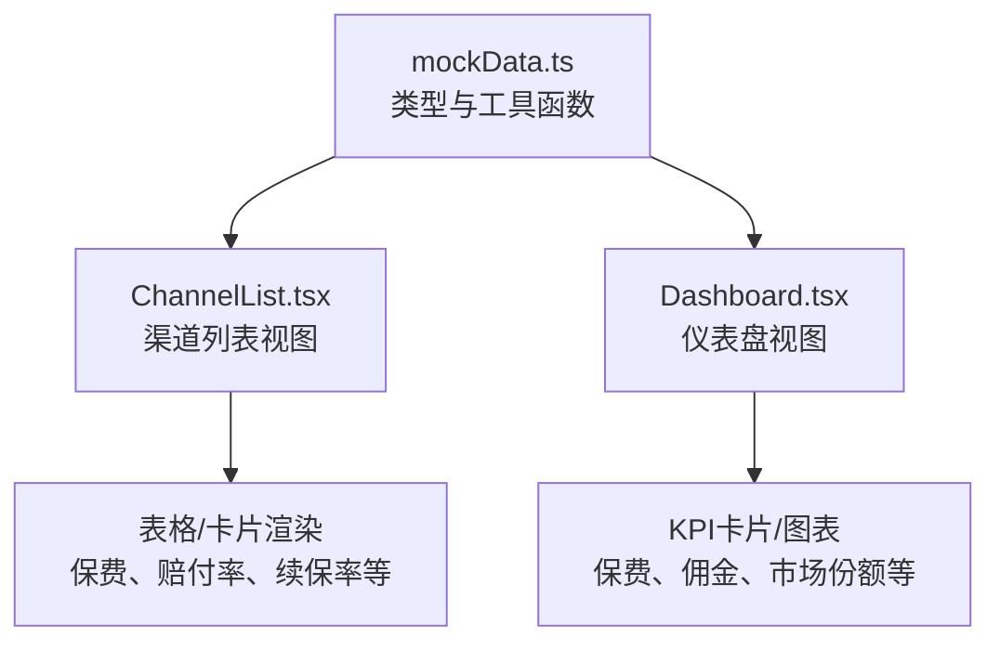
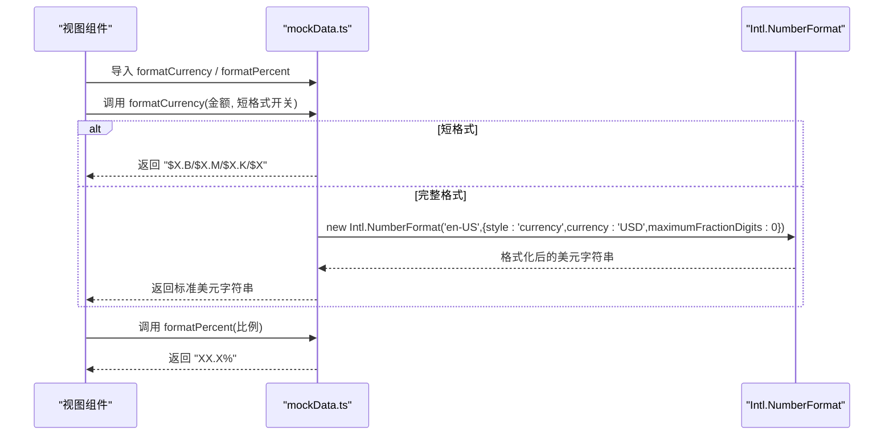
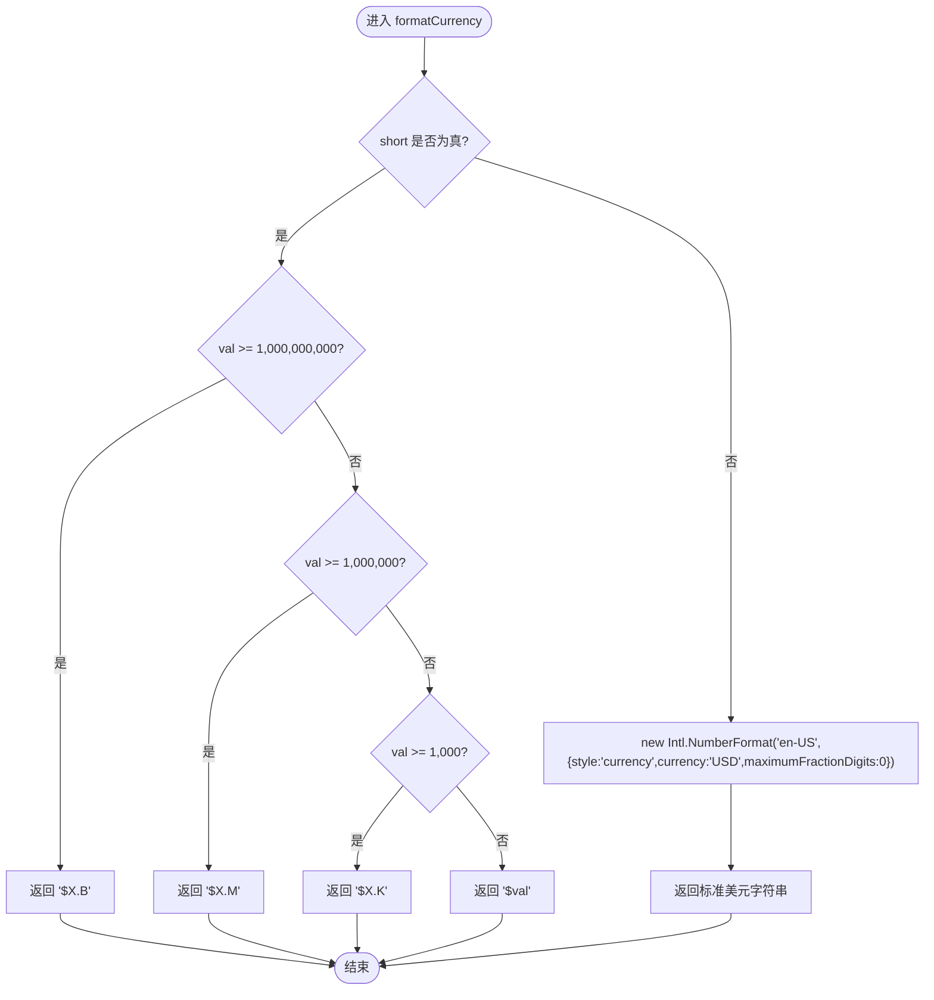
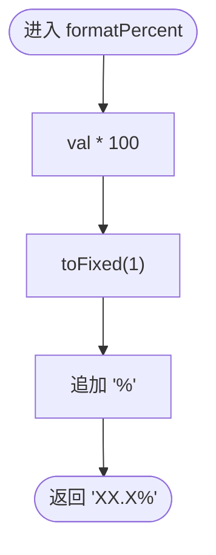
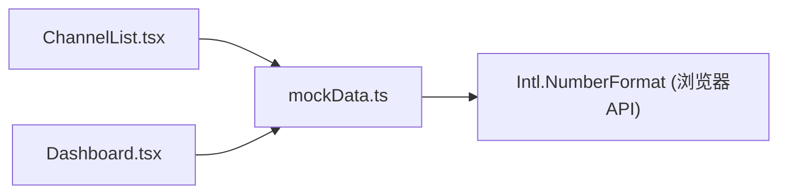

# 工具类型和辅助函数

<cite>
**本文引用的文件**
- [mockData.ts](file://产品方案/UI-V1.0/src/data/mockData.ts)
- [ChannelList.tsx](file://产品方案/UI-V1.0/src/views/ChannelList.tsx)
- [Dashboard.tsx](file://产品方案/UI-V1.0/src/views/Dashboard.tsx)
</cite>

## 目录
1. [简介](#简介)
2. [项目结构](#项目结构)
3. [核心组件](#核心组件)
4. [架构总览](#架构总览)
5. [详细组件分析](#详细组件分析)
6. [依赖关系分析](#依赖关系分析)
7. [性能考量](#性能考量)
8. [故障排查指南](#故障排查指南)
9. [结论](#结论)
10. [附录：使用示例与最佳实践](#附录使用示例与最佳实践)

## 简介
本章节面向OverInsurData平台的“工具类型和辅助函数”，聚焦以下目标：
- 完整记录枚举类型定义及其业务含义和使用场景，包括 InsurerStatus、InsurerType、CoopStatus、Region。
- 详细说明 formatCurrency 的货币格式化能力（短格式 B/M/K 与完整格式），以及 Intl.NumberFormat 的配置选项。
- 解释 formatPercent 的百分比格式化逻辑，包括小数位控制和小数点处理。
- 提供在组件中的正确使用示例，展示如何调用这些工具函数进行数据格式化。
- 说明类型安全的设计模式，包括联合类型的使用与类型推断的最佳实践。

## 项目结构
与本文相关的代码主要位于 UI 方案目录中：
- 数据类型与工具函数集中在 mockData.ts，集中管理平台的核心类型、数据结构与通用格式化函数。
- 视图层组件通过导入这些类型与函数，完成数据的展示与格式化，如 ChannelList.tsx、Dashboard.tsx。

图示来源
- [mockData.ts:1-5](file://产品方案/UI-V1.0/src/data/mockData.ts#L1-L5)
- [ChannelList.tsx:1-10](file://产品方案/UI-V1.0/src/views/ChannelList.tsx#L1-L10)
- [Dashboard.tsx:1-10](file://产品方案/UI-V1.0/src/views/Dashboard.tsx#L1-L10)

章节来源
- [mockData.ts:1-5](file://产品方案/UI-V1.0/src/data/mockData.ts#L1-L5)
- [ChannelList.tsx:1-10](file://产品方案/UI-V1.0/src/views/ChannelList.tsx#L1-L10)
- [Dashboard.tsx:1-10](file://产品方案/UI-V1.0/src/views/Dashboard.tsx#L1-L10)

## 核心组件
本节对关键类型与工具函数进行系统化梳理。

- 状态与领域枚举
  - InsurerStatus：保险公司状态，用于标识保险公司的当前运营状态。
    - 取值：active、inactive、pending
    - 业务含义：
      - active：正常运营，可参与交易与结算。
      - inactive：已停用，不参与新业务。
      - pending：待审核或入驻中，尚未完全生效。
  - InsurerType：保险公司类型，区分监管合规属性。
    - 取值：Admitted、Non-Admitted
    - 业务含义：
      - Admitted：受州监管机构认可，可在该州开展业务。
      - Non-Admitted：非认可机构，通常用于特殊风险或再保险安排。
  - CoopStatus：合作状态，描述与渠道或保险公司的合作关系阶段。
    - 取值：active、negotiating、expiring、terminated
    - 业务含义：
      - active：合作进行中。
      - negotiating：谈判中。
      - expiring：即将到期，需关注续约。
      - terminated：已终止。
  - Region：区域划分，用于按地理维度统计与分析。
    - 取值：Northeast、Southeast、Midwest、West
    - 业务含义：美国四大区域，便于区域维度的保费、渠道、产品等指标聚合。

- 工具函数
  - formatCurrency(val, short = false)
    - 功能：将数值格式化为美元字符串。
    - 参数：
      - val：数值型金额。
      - short：布尔值，是否启用短格式显示。
    - 行为：
      - 当 short 为 true 时：
        - 大于等于十亿：以 B 为单位保留一位小数。
        - 大于等于百万：以 M 为单位取整。
        - 大于等于千：以 K 为单位取整。
        - 小于千：直接显示美元符号与数值。
      - 当 short 为 false 时：
        - 使用 Intl.NumberFormat('en-US', { style: 'currency', currency: 'USD', maximumFractionDigits: 0 }) 输出标准美元格式，不显示小数。
    - 适用场景：KPI卡片、表格列、图表提示框等需要紧凑或标准货币展示的界面。
  - formatPercent(val)
    - 功能：将比例值格式化为百分比字符串。
    - 参数：
      - val：比例值（例如 0.851）。
    - 行为：
      - 乘以100并保留一位小数，附加百分号。
    - 适用场景：赔付率、续保率、市场份额等比率指标的展示。

章节来源
- [mockData.ts:1-5](file://产品方案/UI-V1.0/src/data/mockData.ts#L1-L5)
- [mockData.ts:431-443](file://产品方案/UI-V1.0/src/data/mockData.ts#L431-L443)

## 架构总览
工具类型与辅助函数作为“数据层”的基础设施，被多个视图组件复用，形成稳定的“类型+格式化”契约。

图示来源
- [mockData.ts:431-443](file://产品方案/UI-V1.0/src/data/mockData.ts#L431-L443)
- [ChannelList.tsx:1-10](file://产品方案/UI-V1.0/src/views/ChannelList.tsx#L1-L10)
- [Dashboard.tsx:1-10](file://产品方案/UI-V1.0/src/views/Dashboard.tsx#L1-L10)

## 详细组件分析

### 类型与枚举的业务语义
- InsurerStatus
  - 使用场景：筛选保险公司列表、统计活跃与非活跃数量、控制业务流程（如仅对 active 开放下单）。
  - 类型安全：通过联合类型限制状态值，避免非法状态传入。
- InsurerType
  - 使用场景：区分监管属性，影响合规校验、报价策略、销售渠道准入。
  - 类型安全：限定为 Admitted 或 Non-Admitted，防止误用。
- CoopStatus
  - 使用场景：合同生命周期管理，提醒续约（expiring）、暂停合作（terminated）等。
  - 类型安全：严格的状态集合，便于条件分支与UI标签映射。
- Region
  - 使用场景：区域维度报表、渠道分布、市场策略制定。
  - 类型安全：固定四个区域，确保过滤与分组的一致性。

章节来源
- [mockData.ts:1-5](file://产品方案/UI-V1.0/src/data/mockData.ts#L1-L5)

### formatCurrency 的实现与配置
- 短格式逻辑
  - 阈值判断：十亿(B)、百万(M)、千(K)，分别对应不同精度与单位后缀。
  - 返回值：带美元符号的紧凑字符串，适合空间有限的展示位置。
- 完整格式逻辑
  - 使用 Intl.NumberFormat 指定 en-US 地区、USD 币种、最大小数位数为0。
  - 返回值：符合本地化规范的美元字符串，适合正式报表与财务展示。
- 性能特性
  - 短格式：纯数学运算与字符串拼接，时间复杂度 O(1)。
  - 完整格式：每次调用创建 Intl.NumberFormat 实例，存在轻微开销；若高频调用可考虑缓存实例。

图示来源
- [mockData.ts:431-439](file://产品方案/UI-V1.0/src/data/mockData.ts#L431-L439)

章节来源
- [mockData.ts:431-439](file://产品方案/UI-V1.0/src/data/mockData.ts#L431-L439)

### formatPercent 的实现与精度控制
- 实现逻辑
  - 将输入比例乘以100，并使用 toFixed(1) 保留一位小数，追加百分号。
  - 适用于赔付率、续保率、市场份额等比率指标。
- 精度与小数点
  - 固定一位小数，保证视觉一致性与可读性。
  - 对于接近边界值（如 0.9995）的情况，toFixed 会四舍五入到一位小数。
- 性能特性
  - 简单算术与字符串操作，时间复杂度 O(1)。

图示来源
- [mockData.ts:441-443](file://产品方案/UI-V1.0/src/data/mockData.ts#L441-L443)

章节来源
- [mockData.ts:441-443](file://产品方案/UI-V1.0/src/data/mockData.ts#L441-L443)

### 在组件中的使用示例
- 渠道列表（ChannelList.tsx）
  - 导入工具函数：从 mockData.ts 导入 formatCurrency 与 formatPercent。
  - 使用场景：
    - KPI卡片：展示渠道总保费（短格式）与平均续保率（百分比）。
    - 表格列：展示各渠道的保费、赔付率、续保率。
  - 典型用法路径：
    - 导入与使用：[ChannelList.tsx:1-10](file://产品方案/UI-V1.0/src/views/ChannelList.tsx#L1-L10)
    - KPI卡片格式化：[ChannelList.tsx:88-94](file://产品方案/UI-V1.0/src/views/ChannelList.tsx#L88-L94)
    - 表格列格式化：[ChannelList.tsx:196-213](file://产品方案/UI-V1.0/src/views/ChannelList.tsx#L196-L213)
- 仪表盘（Dashboard.tsx）
  - 导入工具函数：从 mockData.ts 导入 formatCurrency 与 formatPercent。
  - 使用场景：
    - KPI卡片：本年总保费、佣金收入（短格式）。
    - 图表提示框：市场份额对应的保费（短格式）。
  - 典型用法路径：
    - 导入与使用：[Dashboard.tsx:1-10](file://产品方案/UI-V1.0/src/views/Dashboard.tsx#L1-L10)
    - KPI卡片格式化：[Dashboard.tsx:19-56](file://产品方案/UI-V1.0/src/views/Dashboard.tsx#L19-L56)
    - 图表提示框格式化：[Dashboard.tsx:73-100](file://产品方案/UI-V1.0/src/views/Dashboard.tsx#L73-L100)

章节来源
- [ChannelList.tsx:1-10](file://产品方案/UI-V1.0/src/views/ChannelList.tsx#L1-L10)
- [ChannelList.tsx:88-94](file://产品方案/UI-V1.0/src/views/ChannelList.tsx#L88-L94)
- [ChannelList.tsx:196-213](file://产品方案/UI-V1.0/src/views/ChannelList.tsx#L196-L213)
- [Dashboard.tsx:1-10](file://产品方案/UI-V1.0/src/views/Dashboard.tsx#L1-L10)
- [Dashboard.tsx:19-56](file://产品方案/UI-V1.0/src/views/Dashboard.tsx#L19-L56)
- [Dashboard.tsx:73-100](file://产品方案/UI-V1.0/src/views/Dashboard.tsx#L73-L100)

## 依赖关系分析
- 模块耦合
  - 视图组件强依赖 mockData.ts 提供的类型与工具函数，形成稳定的接口契约。
  - 工具函数内部依赖 Intl.NumberFormat，属于浏览器原生API，无外部包依赖。
- 潜在循环依赖
  - 当前结构为单向依赖：视图 -> 工具函数，不存在循环引用。
- 扩展点
  - 如需新增区域或状态，应在 mockData.ts 中统一扩展联合类型，并在视图层同步更新过滤与展示逻辑。

图示来源
- [ChannelList.tsx:1-10](file://产品方案/UI-V1.0/src/views/ChannelList.tsx#L1-L10)
- [Dashboard.tsx:1-10](file://产品方案/UI-V1.0/src/views/Dashboard.tsx#L1-L10)
- [mockData.ts:431-439](file://产品方案/UI-V1.0/src/data/mockData.ts#L431-L439)

章节来源
- [ChannelList.tsx:1-10](file://产品方案/UI-V1.0/src/views/ChannelList.tsx#L1-L10)
- [Dashboard.tsx:1-10](file://产品方案/UI-V1.0/src/views/Dashboard.tsx#L1-L10)
- [mockData.ts:431-439](file://产品方案/UI-V1.0/src/data/mockData.ts#L431-L439)

## 性能考量
- formatCurrency
  - 短格式：O(1) 计算，适合高频渲染。
  - 完整格式：每次调用创建 Intl.NumberFormat 实例，若在同一视图中大量调用，建议缓存实例以减少开销。
- formatPercent
  - O(1) 计算，性能开销极低。
- 类型检查
  - 使用 TypeScript 联合类型在编译期捕获非法状态值，减少运行时错误。

[本节为通用性能指导，不直接分析具体文件]

## 故障排查指南
- 货币格式异常
  - 现象：显示为 NaN 或空字符串。
  - 排查：
    - 确认传入值为有效数字。
    - 检查 short 参数是否正确传递。
    - 若使用完整格式，确认运行环境支持 Intl.NumberFormat。
- 百分比格式异常
  - 现象：显示为 0% 或超过预期范围。
  - 排查：
    - 确认输入为比例值（0~1之间），而非百分比数值。
    - 检查 toFixed(1) 的舍入行为是否符合预期。
- 类型错误
  - 现象：编译时报错，无法赋值给状态字段。
  - 排查：
    - 确认使用的状态值属于联合类型允许的范围。
    - 检查是否存在拼写错误或大小写不一致。

章节来源
- [mockData.ts:431-443](file://产品方案/UI-V1.0/src/data/mockData.ts#L431-L443)

## 结论
- 通过统一的类型定义与工具函数，OverInsurData平台实现了类型安全与一致的展示规范。
- formatCurrency 与 formatPercent 覆盖了常见的货币与百分比展示需求，兼顾紧凑与标准格式。
- 视图组件通过导入这些工具函数，简化了数据格式化逻辑，提升了可维护性与可读性。

[本节为总结性内容，不直接分析具体文件]

## 附录：使用示例与最佳实践
- 在组件中使用 formatCurrency
  - 步骤：
    - 从 mockData.ts 导入 formatCurrency。
    - 在KPI卡片或表格列中调用，根据场景选择 short 参数。
  - 参考路径：
    - 导入与使用：[ChannelList.tsx:1-10](file://产品方案/UI-V1.0/src/views/ChannelList.tsx#L1-L10)
    - KPI卡片：[ChannelList.tsx:88-94](file://产品方案/UI-V1.0/src/views/ChannelList.tsx#L88-L94)
    - 仪表盘KPI：[Dashboard.tsx:19-56](file://产品方案/UI-V1.0/src/views/Dashboard.tsx#L19-L56)
- 在组件中使用 formatPercent
  - 步骤：
    - 从 mockData.ts 导入 formatPercent。
    - 对比例值（如 lossRatio、renewalRate）调用，得到百分比字符串。
  - 参考路径：
    - 渠道列表表格：[ChannelList.tsx:196-213](file://产品方案/UI-V1.0/src/views/ChannelList.tsx#L196-L213)
    - 仪表盘图表提示框：[Dashboard.tsx:73-100](file://产品方案/UI-V1.0/src/views/Dashboard.tsx#L73-L100)
- 类型安全最佳实践
  - 使用联合类型限制状态值，避免非法状态。
  - 在表单与筛选器中，使用枚举值作为选项，确保用户输入合法。
  - 对工具函数的参数进行类型约束，减少运行时错误。

章节来源
- [ChannelList.tsx:1-10](file://产品方案/UI-V1.0/src/views/ChannelList.tsx#L1-L10)
- [ChannelList.tsx:88-94](file://产品方案/UI-V1.0/src/views/ChannelList.tsx#L88-L94)
- [ChannelList.tsx:196-213](file://产品方案/UI-V1.0/src/views/ChannelList.tsx#L196-L213)
- [Dashboard.tsx:1-10](file://产品方案/UI-V1.0/src/views/Dashboard.tsx#L1-L10)
- [Dashboard.tsx:19-56](file://产品方案/UI-V1.0/src/views/Dashboard.tsx#L19-L56)
- [Dashboard.tsx:73-100](file://产品方案/UI-V1.0/src/views/Dashboard.tsx#L73-L100)
- [mockData.ts:1-5](file://产品方案/UI-V1.0/src/data/mockData.ts#L1-L5)
- [mockData.ts:431-443](file://产品方案/UI-V1.0/src/data/mockData.ts#L431-L443)