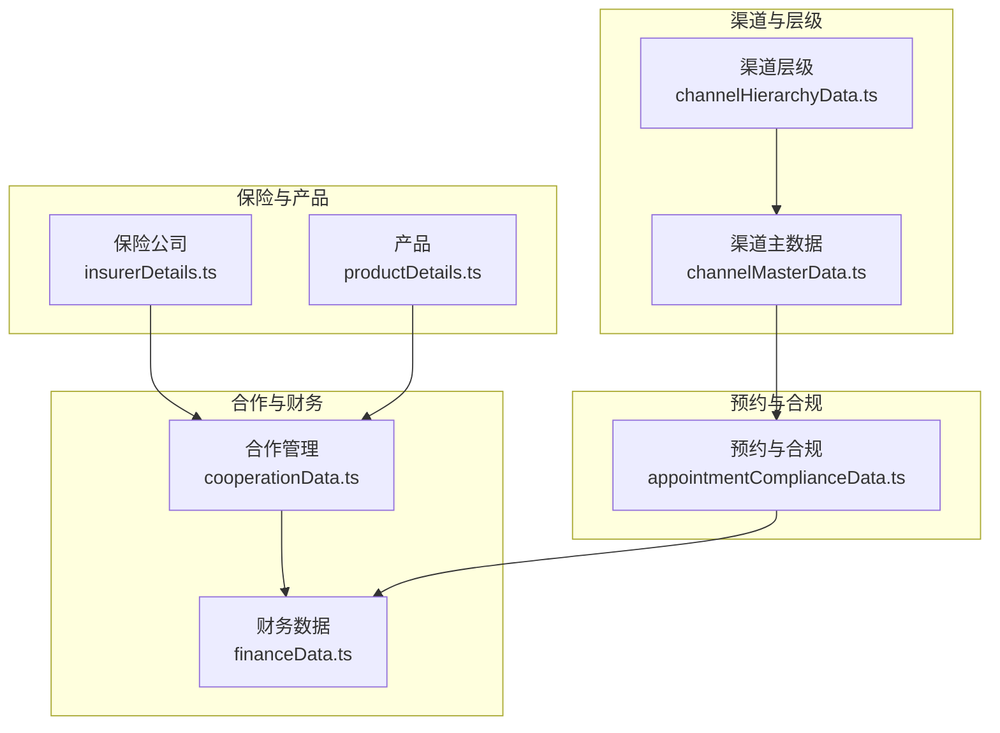
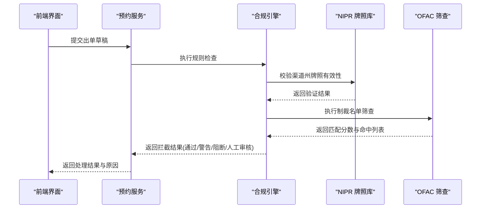
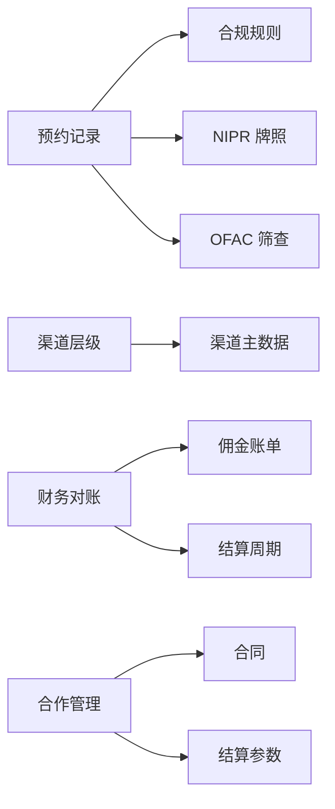

# 数据模型定义

<cite>
**本文引用的文件**
- [insurerDetails.ts](file://产品方案/UI-V1.0/src/data/insurerDetails.ts)
- [productDetails.ts](file://产品方案/UI-V1.0/src/data/productDetails.ts)
- [channelMasterData.ts](file://产品方案/UI-V1.0/src/data/channelMasterData.ts)
- [appointmentComplianceData.ts](file://产品方案/UI-V1.0/src/data/appointmentComplianceData.ts)
- [cooperationData.ts](file://产品方案/UI-V1.0/src/data/cooperationData.ts)
- [financeData.ts](file://产品方案/UI-V1.0/src/data/financeData.ts)
- [channelHierarchyData.ts](file://产品方案/UI-V1.0/src/data/channelHierarchyData.ts)
</cite>

## 目录
1. [简介](#简介)
2. [项目结构](#项目结构)
3. [核心组件](#核心组件)
4. [架构总览](#架构总览)
5. [详细组件分析](#详细组件分析)
6. [依赖关系分析](#依赖关系分析)
7. [性能考量](#性能考量)
8. [故障排查指南](#故障排查指南)
9. [结论](#结论)
10. [附录](#附录)

## 简介
本文件为 OverInsurData 平台的数据模型 API 参考文档，聚焦于 TypeScript 接口定义与业务语义说明。覆盖保险公司、产品、渠道、预约等核心实体，以及合规拦截、财务对账、合作管理、渠道层级等关键域。文档提供字段类型、约束条件、取值范围、实体关系映射、数据验证规则与字段依赖关系，并给出版本管理与向后兼容策略，以及基于泛型、联合类型和可选属性的类型安全开发最佳实践。

## 项目结构
数据模型以模块化的 TypeScript 文件组织，按业务域划分：
- 保险公司相关：变更历史、文档、联系人、重复记录、评级常量
- 产品相关：费率计划、州生效状态、核保规则、培训材料、绩效数据
- 渠道主数据：机构、代理人、资质文档、变更历史、导入结果
- 渠道层级：节点、关系、待审批变更、白标配置、团队绩效
- 合作管理：合作关系、合同、结算参数、联系人、续期项、产品接入
- 财务数据：佣金账单、行项目、差异对账、结算周期、保费对账、解析模板、结算历史
- 预约与合规：预约记录、NIPR 牌照、合规拦截、合规规则、OFAC 筛查、合规报告

图表来源
- [insurerDetails.ts:1-140](file://产品方案/UI-V1.0/src/data/insurerDetails.ts#L1-L140)
- [productDetails.ts:1-329](file://产品方案/UI-V1.0/src/data/productDetails.ts#L1-L329)
- [channelMasterData.ts:1-449](file://产品方案/UI-V1.0/src/data/channelMasterData.ts#L1-L449)
- [channelHierarchyData.ts:1-261](file://产品方案/UI-V1.0/src/data/channelHierarchyData.ts#L1-L261)
- [cooperationData.ts:1-422](file://产品方案/UI-V1.0/src/data/cooperationData.ts#L1-L422)
- [financeData.ts:1-273](file://产品方案/UI-V1.0/src/data/financeData.ts#L1-L273)
- [appointmentComplianceData.ts:1-200](file://产品方案/UI-V1.0/src/data/appointmentComplianceData.ts#L1-L200)

章节来源
- [insurerDetails.ts:1-140](file://产品方案/UI-V1.0/src/data/insurerDetails.ts#L1-L140)
- [productDetails.ts:1-329](file://产品方案/UI-V1.0/src/data/productDetails.ts#L1-L329)
- [channelMasterData.ts:1-449](file://产品方案/UI-V1.0/src/data/channelMasterData.ts#L1-L449)
- [channelHierarchyData.ts:1-261](file://产品方案/UI-V1.0/src/data/channelHierarchyData.ts#L1-L261)
- [cooperationData.ts:1-422](file://产品方案/UI-V1.0/src/data/cooperationData.ts#L1-L422)
- [financeData.ts:1-273](file://产品方案/UI-V1.0/src/data/financeData.ts#L1-L273)
- [appointmentComplianceData.ts:1-200](file://产品方案/UI-V1.0/src/data/appointmentComplianceData.ts#L1-L200)

## 核心组件
本节概述各域的核心接口及其职责边界，便于快速定位与理解。

- 保险公司（Insurer）
  - 变更历史：ChangeRecord
  - 文档：InsurerDocument
  - 联系人：InsurerContact
  - 重复记录：DuplicateGroup / DuplicateRecord
  - 枚举常量：AM_BEST_RATINGS、SP_RATINGS、US_STATES

- 产品（Product）
  - 费率计划：RatePlan
  - 州生效状态：ProductState
  - 核保规则：UnderwritingRule
  - 培训材料：TrainingMaterial
  - 绩效数据：ProductPerformanceData

- 渠道（Channel）
  - 机构：ChannelOrg
  - 代理人：ChannelAgent
  - 资质文档：QualDoc
  - 变更历史：ChangeRecord（渠道域）
  - 导入结果：ImportResult

- 渠道层级（Hierarchy）
  - 节点：ChannelNode
  - 关系：HierarchyRelation / RelationChange
  - 待审批变更：PendingChange
  - 白标配置：WhiteLabelConfig
  - 团队绩效：TeamPerf

- 合作（Cooperation）
  - 合作关系：CooperationRelationship
  - 合同：CoopContract
  - 结算参数：SettlementConfig
  - 联系人：CoopContact
  - 续期项：RenewalItem
  - 产品接入：ProductIntegration

- 财务（Finance）
  - 佣金账单：CommissionBill
  - 行项目：BillLineItem
  - 差异对账：ReconciliationDiff
  - 结算周期：SettlementCycleConfig
  - 保费对账：PremiumRecRecord / PremiumSummary
  - 解析模板：ParseTemplate
  - 结算历史：SettlementRecord

- 预约与合规（Appointment & Compliance）
  - 预约记录：AppointmentRecord
  - NIPR 牌照：NIPRLicense
  - 合规拦截：ComplianceInterception
  - 合规规则：ComplianceRule
  - OFAC 筛查：OFACScreening
  - 合规报告：ComplianceReport

章节来源
- [insurerDetails.ts:1-140](file://产品方案/UI-V1.0/src/data/insurerDetails.ts#L1-L140)
- [productDetails.ts:1-329](file://产品方案/UI-V1.0/src/data/productDetails.ts#L1-L329)
- [channelMasterData.ts:1-449](file://产品方案/UI-V1.0/src/data/channelMasterData.ts#L1-L449)
- [channelHierarchyData.ts:1-261](file://产品方案/UI-V1.0/src/data/channelHierarchyData.ts#L1-L261)
- [cooperationData.ts:1-422](file://产品方案/UI-V1.0/src/data/cooperationData.ts#L1-L422)
- [financeData.ts:1-273](file://产品方案/UI-V1.0/src/data/financeData.ts#L1-L273)
- [appointmentComplianceData.ts:1-200](file://产品方案/UI-V1.0/src/data/appointmentComplianceData.ts#L1-L200)

## 架构总览
数据模型围绕“主体—关系—事件”的建模思想组织：
- 主体：保险公司、产品、渠道（机构/代理人）、合作伙伴
- 关系：渠道层级关系、合作合同、产品接入、结算周期
- 事件：预约申请与状态流转、合规拦截、财务对账差异、变更历史

```mermaid
classDiagram
class InsurerDocument { +id +insurerId +name +type +size +uploadedAt +uploadedBy +status +expiry? +url? }
class InsurerContact { +id +insurerId +role +name +title +department +email +phone +isPrimary +status }
class ChangeRecord_Insurer { +id +insurerId +field +section +oldValue +newValue +operator +operatorRole +timestamp +approvedBy? +approvedAt? +status }
class RatePlan { +id +productId +name +tier +baseRate +minPremium +maxPremium +effectiveDate +expiryDate +status +ratingFactors[] +filingStatus }
class UnderwritingRule { +id +productId +name +category +priority +condition +conditionDetail +action +actionValue? +status +lastModified +modifiedBy }
class TrainingMaterial { +id +productId +title +type +fileName +fileSize +uploadDate +uploadedBy +version +downloads +requiredFor[] +expiryDate? }
class ChannelOrg { +id +name +shortName +type +status +npn +taxId +licenseStates[] +primaryState +address +city +state +zip +phone +email +website? +managerId? +managerName? +parentOrgId? +parentOrgName? +contractId? +joinDate +lastReviewDate +ytdPremium +ytdCommission +lossRatio +renewalRate +agentCount +tags +notes? }
class ChannelAgent { +id +firstName +lastName +displayName +email +phone +npn +licenseStates[] +primaryState +orgId +orgName +status +role +joinDate +lastActiveDate +ytdPremium +ytdCommission +lossRatio +renewalRate +policyCount +clientCount +notes? +address? +city? +state? +zip? }
class QualDoc { +id +ownerId +ownerType +ownerName +category +name +fileSize +uploadedDate +uploadedBy +expiryDate? +status +reviewNote? +version }
class AppointmentRecord { +id +channelId +channelName +channelNpn +insurerId +insurerName +insurerShort +state +line +status +submittedDate +approvedDate? +expiryDate +terminatedDate? +terminationReason? +renewalStatus? +daysToExpiry +submittedBy +processingDays? +rejectionReason? +niprTransactionId? }
class NIPRLicense { +id +channelId +channelName +npnNumber +licenseNumber +state +licenseType +lines[] +status +issueDate +expiryDate +daysToExpiry +lastVerified +verificationStatus +residencyState +ceCompleted? +ceHoursRequired? +ceHoursCompleted? }
class ComplianceInterception { +id +timestamp +channelId +channelName +insurerId +insurerShort +state +line +policyDraftId +customerName +premiumAmount +result +reasons[] +reasonDescriptions[] +reviewedBy? +overrideApproved? +overrideNote? }
class ComplianceRule { +id +name +category +condition +action +enabled +priority +triggeredCount +lastTriggered? }
class OFACScreening { +id +timestamp +entityName +entityType +screenedBy +result +matchScore? +matchedEntry? +matchedList? +policyId? +reviewedBy? +reviewNote? +overrideApproved? }
class ComplianceReport { +id +name +type +period +generatedDate +generatedBy +status +fileSize? +recordCount? +format +recipients? }
InsurerDocument --> ChangeRecord_Insurer : "关联变更"
InsurerContact --> ChangeRecord_Insurer : "关联变更"
RatePlan --> UnderwritingRule : "产品维度"
ChannelOrg --> QualDoc : "拥有"
ChannelAgent --> QualDoc : "拥有"
AppointmentRecord --> NIPRLicense : "渠道牌照校验"
AppointmentRecord --> ComplianceInterception : "触发拦截"
ComplianceInterception --> ComplianceRule : "规则驱动"
OFACScreening --> ComplianceInterception : "影响结果"
```

图表来源
- [insurerDetails.ts:1-140](file://产品方案/UI-V1.0/src/data/insurerDetails.ts#L1-L140)
- [productDetails.ts:1-329](file://产品方案/UI-V1.0/src/data/productDetails.ts#L1-L329)
- [channelMasterData.ts:1-449](file://产品方案/UI-V1.0/src/data/channelMasterData.ts#L1-L449)
- [appointmentComplianceData.ts:1-200](file://产品方案/UI-V1.0/src/data/appointmentComplianceData.ts#L1-L200)

## 详细组件分析

### 保险公司（Insurer）数据模型
- 变更历史 ChangeRecord
  - 关键字段：id、insurerId、field、section、oldValue/newValue、operator/operatorRole、timestamp、approvedBy/approvedAt、status
  - 业务含义：记录保险公司信息变更的审计轨迹，支持审批流与自动变更
  - 约束与取值：status 为 approved/pending/auto；时间戳用于排序与回溯
  - 依赖关系：与 InsurerDocument、InsurerContact 的变更联动

- 文档 InsurerDocument
  - 关键字段：id、insurerId、name、type、size、uploadedAt/By、status、expiry/url
  - 业务含义：管理合作协议、执照、评级报告等附件及有效期
  - 约束与取值：status 为 valid/expiring/expired；expiry 用于到期预警

- 联系人 InsurerContact
  - 关键字段：id、insurerId、role/title/department、email/phone、isPrimary、status
  - 业务含义：维护对接人矩阵，支持多角色与主次标记
  - 约束与取值：status 为 active/inactive；isPrimary 标识关键联系人

- 重复记录 DuplicateGroup/DuplicateRecord
  - 关键字段：similarity、matchFields、records[]；记录公司名、简称、NAIC、总部、状态等
  - 业务含义：识别潜在重复数据，辅助合并与去重

- 枚举与常量
  - AM_BEST_RATINGS、SP_RATINGS、US_STATES：统一取值范围，避免硬编码

章节来源
- [insurerDetails.ts:1-140](file://产品方案/UI-V1.0/src/data/insurerDetails.ts#L1-L140)

### 产品（Product）数据模型
- 费率计划 RatePlan
  - 关键字段：id、productId、name、tier、baseRate/min/maxPremium、effective/expiryDate、status、ratingFactors[]、filingStatus
  - 业务含义：定义不同等级费率、生效区间与监管报备状态
  - 约束与取值：tier 为 Standard/Enhanced/Premium/Basic；status 为 active/draft/expired/pending；ratingFactors 权重合计建议为 1

- 州生效状态 ProductState
  - 关键字段：code/name、enabled、effectiveDate/filingNumber、status、channelCount
  - 业务含义：表示产品在州的启用与报备情况

- 核保规则 UnderwritingRule
  - 关键字段：id、productId、name、category、priority、condition/conditionDetail、action/actionValue、status、lastModified/modifiedBy
  - 业务含义：定义准入、定价、排除、转介等规则，支持优先级与动作值

- 培训材料 TrainingMaterial
  - 关键字段：id、productId、title/type、fileName/fileSize、uploadDate/By、version/downloads、requiredFor[]、expiryDate?
  - 业务含义：产品知识、手册、合规资料与版本管理

- 绩效数据 ProductPerformanceData
  - 关键字段：month、premium/newBiz/renewal、policies、lossRatio、claimsCount
  - 业务含义：月度经营指标，用于趋势分析与看板展示

章节来源
- [productDetails.ts:1-329](file://产品方案/UI-V1.0/src/data/productDetails.ts#L1-L329)

### 渠道（Channel）主数据模型
- 机构 ChannelOrg
  - 关键字段：id/name/shortName、type/status、npn/taxId、licenseStates/primaryState、地址电话邮箱、managerId/Name、parentOrgId/Name、contractId、joinDate/lastReviewDate、ytdPremium/ytdCommission、lossRatio/renewalRate、agentCount、tags/notes
  - 业务含义：渠道机构主数据，包含资质、业绩、归属与管理信息
  - 约束与取值：type 为 agency/ga/branch/sub-agency；status 为 active/inactive/suspended/pending

- 代理人 ChannelAgent
  - 关键字段：id、姓名/显示名、联系方式、npn、licenseStates/primaryState、orgId/orgName、status、role、joinDate/lastActiveDate、业绩指标、客户数、地址
  - 业务含义：一线销售与管理人员档案与绩效

- 资质文档 QualDoc
  - 关键字段：id、ownerId/ownerType/ownerName、category、name/fileSize、uploadedDate/By、expiryDate?、status、reviewNote?、version
  - 业务含义：执照、E&O、W-9、合同、背景调查、培训证书等，支持版本与审核

- 变更历史 ChangeRecord（渠道域）
  - 关键字段：id、entityId/entityType/entityName、changeType、field/oldValue/newValue、operator/operatorRole、timestamp、ipAddress/note
  - 业务含义：全量审计追踪，支持操作溯源

- 导入结果 ImportResult
  - 关键字段：total/success/failed/skipped、errors[]
  - 业务含义：批量导入质量与错误明细

章节来源
- [channelMasterData.ts:1-449](file://产品方案/UI-V1.0/src/data/channelMasterData.ts#L1-L449)

### 渠道层级（Hierarchy）模型
- 节点 ChannelNode
  - 关键字段：id/name/shortName、type/status、parentIds/primaryParentId、depth、npn/licenseStates/primaryState、joinDate/contractId、managerId/Name、teamSize、ytdPremium/ytdCommission、lossRatio/renewalRate、whiteLabelId/overrideRate/email/phone
  - 业务含义：平台-大区-机构-分支-代理的多级树形结构，支持多父节点与分成比例

- 关系 HierarchyRelation / RelationChange
  - 关键字段：child/parent、isPrimary、revenueShare、status、startDate/endDate、terminationReason、approvedBy、changeHistory[]
  - 业务含义：记录层级关系与调整历史

- 待审批变更 PendingChange
  - 关键字段：changeType、node/nodeName、from/to parent、newRevenueShare、requestedBy/requestDate、status/effectiveDate/reason
  - 业务含义：变更前置审批流程

- 白标配置 WhiteLabelConfig
  - 关键字段：channelId/name、brand/logo/colors、domain/emailDomain、portal/mobileApp/customDoc/reporting/api enabled、status/features
  - 业务含义：渠道品牌化与功能开关

- 团队绩效 TeamPerf
  - 关键字段：nodeId/name/type/depth、memberCount、ytdPremium/target/achievementRate、commission、new/renewed policies、renewalRate、lossRatio、activePolicies、avgPremiumPerMember、topAgent/topAgentPremium/rank
  - 业务含义：组织维度的业绩与排名

章节来源
- [channelHierarchyData.ts:1-261](file://产品方案/UI-V1.0/src/data/channelHierarchyData.ts#L1-L261)

### 合作（Cooperation）模型
- 合作关系 CooperationRelationship
  - 关键字段：id、insurerId/name/short、type/status、startDate/end、scope/territoryStates、commissionTier、accountManager、approvedBy/At、submittedDate、notes
  - 业务含义：与保险公司的合作框架、范围与区域

- 合同 CoopContract
  - 关键字段：id、cooperationId/insurerId/short、title/type/version/status、effective/expiryDate、signedDate/signatories、fileSize/uploadedBy/At、renewalAlert/autoRenew/tags
  - 业务含义：协议生命周期与到期提醒

- 结算参数 SettlementConfig
  - 关键字段：id、insurerId/short、cycle/billCutoffDay/paymentTermDays/paymentMethod/currency、premiumCollection/billingFormat、apiEnabled、reconciliationContact/bankAccount/routingNote、lastUpdated/updatedBy/status/notes
  - 业务含义：对账与付款规则

- 联系人 CoopContact
  - 关键字段：id、insurerId/short、role/name/title/department、email/phone/mobile/timezone、preferredContact、isPrimary/isEscalation、status/notes
  - 业务含义：跨部门对接矩阵

- 续期项 RenewalItem
  - 关键字段：id、insurerId/short、type/title/expiryDate/autoRenew/status/daysLeft、accountManager/renewalContact、lastAction/Date、priority/notes
  - 业务含义：合同与合作续约跟踪

- 产品接入 ProductIntegration
  - 关键字段：id、insurerId/short、productName/code/line、request/approved/integratedDate、status/requestedBy/priority、estimatedPremium/targetStates、technicalReqs、notes/apiDoc/testCompleted
  - 业务含义：产品技术对接进度与能力清单

章节来源
- [cooperationData.ts:1-422](file://产品方案/UI-V1.0/src/data/cooperationData.ts#L1-L422)

### 财务（Finance）模型
- 佣金账单 CommissionBill
  - 关键字段：id、fileName、insurerId/name/short、period/importDate/importedBy、fileSize/format、status、totalPolicies/premium/commission、parsed/matched/exceptionCount、reconciled/differenceAmount、settledDate
  - 业务含义：来自保险公司的账单导入与处理状态

- 行项目 BillLineItem
  - 关键字段：id、billId、lineNumber、policyNumber/insuredName、channelId/name/state/line、effectiveDate、premium/commissionRate/commissionAmount、ourPolicyNumber/ourCommissionRate/ourCommissionAmount、matchStatus/diffAmount/diffNote
  - 业务含义：逐条匹配与差异标注

- 差异对账 ReconciliationDiff
  - 关键字段：id、billId/billName/insurerShort、policyNumber/insuredName、diffType、billAmount/ourAmount/diffAmount、status/assignedTo/note、createdDate/resolvedDate
  - 业务含义：差异分类与处理闭环

- 结算周期 SettlementCycleConfig
  - 关键字段：id、insurerId/name/short、frequency/cutoffDay/paymentDueDays/method/currency、minSettleAmount、autoReconcile/autoSettle、notifyDaysBefore、bankAccount/routingNumber/contactEmail、lastSettledDate/nextDueDate/nextDueAmount/ytdSettled
  - 业务含义：周期性结算与自动化策略

- 保费对账 PremiumRecRecord / PremiumSummary
  - 关键字段：period、insurerId/short、policyNumber/insuredName/channelName/state、expected/remitted/diffAmount、diffType/status/note/dueDate；汇总 matchRate/exceptionCount
  - 业务含义：应收实收核对与异常统计

- 解析模板 ParseTemplate
  - 关键字段：id、insurerId/short、templateName/fileFormat、列映射、headerRow、lastUsed/usageCount/successRate
  - 业务含义：多格式账单解析适配

- 结算历史 SettlementRecord
  - 关键字段：id、insurerId/short、period/settledDate/amount/method/referenceNumber/status/confirmedBy
  - 业务含义：支付流水与确认

章节来源
- [financeData.ts:1-273](file://产品方案/UI-V1.0/src/data/financeData.ts#L1-L273)

### 预约与合规（Appointment & Compliance）模型
- 预约记录 AppointmentRecord
  - 关键字段：id、channelId/name/npn、insurerId/name/short、state/line、status、submittedDate/approvedDate/expiryDate/terminatedDate/terminationReason、renewalStatus、daysToExpiry、submittedBy/processingDays/rejectionReason/niprTransactionId
  - 业务含义：渠道在特定州与险种的出单授权状态与生命周期

- NIPR 牌照 NIPRLicense
  - 关键字段：id、channelId/name、npnNumber/licenseNumber、state、licenseType/lines、status、issueDate/expiryDate/daysToExpiry、lastVerified/verificationStatus、residencyState、ceCompleted/ceHoursRequired/ceHoursCompleted
  - 业务含义：渠道在各州的执业许可与继续教育要求

- 合规拦截 ComplianceInterception
  - 关键字段：id、timestamp、channelId/name、insurerId/short、state/line、policyDraftId/customerName/premiumAmount、result、reasons/reasonDescriptions、reviewedBy/overrideApproved/overrideNote
  - 业务含义：出单前合规检查拦截日志

- 合规规则 ComplianceRule
  - 关键字段：id、name、category、condition、action、enabled、priority、triggeredCount、lastTriggered
  - 业务含义：可配置的拦截规则集

- OFAC 筛查 OFACScreening
  - 关键字段：id、timestamp、entityName/entityType、screenedBy、result、matchScore/matchedEntry/matchedList、policyId、reviewedBy/reviewNote/overrideApproved
  - 业务含义：制裁名单筛查与人工复核

- 合规报告 ComplianceReport
  - 关键字段：id、name、type、period、generatedDate/generatedBy、status、fileSize/recordCount/format/recipients
  - 业务含义：定期生成的合规报表

图表来源
- [appointmentComplianceData.ts:1-200](file://产品方案/UI-V1.0/src/data/appointmentComplianceData.ts#L1-L200)

章节来源
- [appointmentComplianceData.ts:1-200](file://产品方案/UI-V1.0/src/data/appointmentComplianceData.ts#L1-L200)

## 依赖关系分析
- 实体间引用
  - 预约记录通过 channelId/insurerId/state/line 与渠道、保险公司、州、业务线建立关联
  - 合规拦截由预约与渠道/保险公司上下文触发，受合规规则驱动
  - 财务对账通过 billId/policyNumber 与保单、渠道、保险公司关联
  - 渠道层级通过 parentIds/primaryParentId 形成树状结构，支持多父节点与分成比例

- 耦合与内聚
  - 各域数据模型高内聚，通过 id 与外键式字段进行弱耦合
  - 合规规则集中管理，降低业务逻辑分散度
  - 财务对账将差异类型与状态标准化，提升一致性

- 外部依赖
  - NIPR 牌照验证、OFAC 制裁名单为外部系统输入
  - 结算周期与银行账号信息涉及支付系统

图表来源
- [appointmentComplianceData.ts:1-200](file://产品方案/UI-V1.0/src/data/appointmentComplianceData.ts#L1-L200)
- [channelMasterData.ts:1-449](file://产品方案/UI-V1.0/src/data/channelMasterData.ts#L1-L449)
- [channelHierarchyData.ts:1-261](file://产品方案/UI-V1.0/src/data/channelHierarchyData.ts#L1-L261)
- [financeData.ts:1-273](file://产品方案/UI-V1.0/src/data/financeData.ts#L1-L273)
- [cooperationData.ts:1-422](file://产品方案/UI-V1.0/src/data/cooperationData.ts#L1-L422)

章节来源
- [appointmentComplianceData.ts:1-200](file://产品方案/UI-V1.0/src/data/appointmentComplianceData.ts#L1-L200)
- [channelMasterData.ts:1-449](file://产品方案/UI-V1.0/src/data/channelMasterData.ts#L1-L449)
- [channelHierarchyData.ts:1-261](file://产品方案/UI-V1.0/src/data/channelHierarchyData.ts#L1-L261)
- [financeData.ts:1-273](file://产品方案/UI-V1.0/src/data/financeData.ts#L1-L273)
- [cooperationData.ts:1-422](file://产品方案/UI-V1.0/src/data/cooperationData.ts#L1-L422)

## 性能考量
- 索引与查询
  - 高频查询字段如 channelId、insurerId、state、line、status 应建立索引以提升检索效率
  - 层级树构建可使用父子映射缓存，减少重复遍历

- 计算与聚合
  - 团队绩效与产品绩效建议在后台定时任务中预计算，避免实时聚合开销
  - 合规拦截规则应按优先级与类别分层执行，短路常见拦截路径

- 存储与传输
  - 大文件（PDF/Excel/EDI）采用对象存储，数据库仅保留元数据与访问路径
  - 分页与懒加载用于大型列表（如渠道节点、账单行项目）

[本节为通用性能建议，不直接分析具体文件]

## 故障排查指南
- 预约与合规
  - 常见问题：渠道牌照过期、Appointment 过期或终止、OFAC 命中
  - 排查步骤：查看 ComplianceInterception.reasons/reasonDescriptions；核对 NIPRLicense.status 与 daysToExpiry；检查 ComplianceRule.enabled 与 priority

- 财务对账
  - 常见问题：费率差异、金额差异、缺失保单、重复行
  - 排查步骤：根据 ReconciliationDiff.diffType 与 status 定位；核对 BillLineItem.matchStatus 与 diffNote；使用 ParseTemplate 校验列映射

- 渠道主数据
  - 常见问题：导入失败、NPN 格式错误、主营州代码无效
  - 排查步骤：查看 ImportResult.errors；校验 ChannelOrg/ChannelAgent 必填字段与枚举取值

章节来源
- [appointmentComplianceData.ts:1-200](file://产品方案/UI-V1.0/src/data/appointmentComplianceData.ts#L1-L200)
- [financeData.ts:1-273](file://产品方案/UI-V1.0/src/data/financeData.ts#L1-L273)
- [channelMasterData.ts:1-449](file://产品方案/UI-V1.0/src/data/channelMasterData.ts#L1-L449)

## 结论
OverInsurData 的数据模型以清晰的领域边界与强类型约束为基础，覆盖保险公司、产品、渠道、合作、财务与合规等核心业务域。通过统一的枚举、状态机与审计记录，确保数据一致性与可追溯性。结合层级关系与规则引擎，支撑复杂的渠道管理与合规拦截场景。建议在生产环境中引入版本化与兼容性策略，持续优化性能与可维护性。

[本节为总结性内容，不直接分析具体文件]

## 附录

### 字段类型与取值范围速查
- 保险公司
  - 评级：AM_BEST_RATINGS、SP_RATINGS
  - 文档状态：valid/expiring/expired
  - 联系人状态：active/inactive
- 产品
  - 费率等级：Standard/Enhanced/Premium/Basic
  - 费率计划状态：active/draft/expired/pending
  - 核保规则类别：eligibility/rating/exclusion/referral
  - 核保动作：approve/decline/refer/surcharge/discount
- 渠道
  - 机构类型：agency/ga/branch/sub-agency
  - 机构状态：active/inactive/suspended/pending
  - 代理人状态：active/inactive/suspended/pending/terminated
  - 资质文档类别：license/eo/w9/contract/bg/training/corp/other
  - 文档状态：valid/expired/expiring-soon/missing/pending-review
- 渠道层级
  - 节点类型：platform/region/agency/branch/agent/sub-agent
  - 节点状态：active/inactive/suspended/pending
  - 关系状态：active/pending/terminated/adjusting
- 合作
  - 合作类型：Full-Service/Specialty/Preferred/Surplus Lines
  - 合同类型：Master Agreement/Commission Schedule/Data Sharing/Amendment/Addendum/NDA
  - 合同状态：draft/negotiating/pending-sign/active/expiring/expired/terminated
  - 结算周期：Monthly/Quarterly/Semi-Annual
  - 支付方式：ACH/Wire/Check/EFT
  - 产品接入状态：available/requested/in-review/approved/integrated/rejected/suspended
- 财务
  - 账单状态：pending-parse/parsed/reconciled/exception/settled/archived
  - 匹配状态：matched/unmatched/amount-diff/rate-diff/duplicate
  - 差异类型：rate-mismatch/amount-mismatch/missing-policy/duplicate/missing-in-bill
  - 差异状态：open/under-review/accepted/disputed/adjusted/waived
  - 结算频率：monthly/quarterly/semi-annual/annual/custom
  - 结算方式：wire-transfer/ach/check/offset
  - 保费差异类型：missing-remittance/over-remittance/rate-error/cancellation-adj/endorsement-adj
  - 保费对账状态：matched/exception/adjusted/pending
- 预约与合规
  - 预约状态：approved/pending/rejected/expired/terminated/under-review
  - 续期状态：not-due/due-soon/in-progress/renewed
  - 牌照状态：active/inactive/expired/suspended/pending/cancelled
  - 验证状态：verified/mismatch/not-found/pending
  - 拦截结果：blocked/warned/manual-review/passed
  - 拦截原因：no-appointment/expired-appointment/invalid-license/expired-license/ofac-match/suspended-channel/state-not-authorized
  - 合规规则类别：appointment/license/ofac/channel/product
  - 合规动作：block/warn/require-review
  - OFAC 结果：clear/watchlist/blocked/pending

章节来源
- [insurerDetails.ts:1-140](file://产品方案/UI-V1.0/src/data/insurerDetails.ts#L1-L140)
- [productDetails.ts:1-329](file://产品方案/UI-V1.0/src/data/productDetails.ts#L1-L329)
- [channelMasterData.ts:1-449](file://产品方案/UI-V1.0/src/data/channelMasterData.ts#L1-L449)
- [channelHierarchyData.ts:1-261](file://产品方案/UI-V1.0/src/data/channelHierarchyData.ts#L1-L261)
- [cooperationData.ts:1-422](file://产品方案/UI-V1.0/src/data/cooperationData.ts#L1-L422)
- [financeData.ts:1-273](file://产品方案/UI-V1.0/src/data/financeData.ts#L1-L273)
- [appointmentComplianceData.ts:1-200](file://产品方案/UI-V1.0/src/data/appointmentComplianceData.ts#L1-L200)

### 实体关系映射（ER 图）

```mermaid
erDiagram
INSURER_DOCUMENT ||--o{ CHANGE_RECORD_INSURER : "变更关联"
INSURER_CONTACT ||--o{ CHANGE_RECORD_INSURER : "变更关联"
PRODUCT_RATE_PLAN ||--o{ UNDERWRITING_RULE : "产品维度"
PRODUCT_STATE ||--o{ PRODUCT_RATE_PLAN : "州生效"
CHANNEL_ORG ||--o{ QUAL_DOC : "拥有"
CHANNEL_AGENT ||--o{ QUAL_DOC : "拥有"
CHANNEL_ORG ||--o{ CHANNEL_NODE : "层级节点"
CHANNEL_AGENT ||--o{ CHANNEL_NODE : "层级节点"
APPOINTMENT_RECORD ||--o{ COMPLIANCE_INTERCEPTION : "触发拦截"
NIPR_LICENSE ||--o{ APPOINTMENT_RECORD : "渠道牌照"
COMPLIANCE_RULE ||--o{ COMPLIANCE_INTERCEPTION : "规则驱动"
OFAC_SCREENING ||--o{ COMPLIANCE_INTERCEPTION : "影响结果"
COOPERATION_RELATIONSHIP ||--o{ COOP_CONTRACT : "合同"
COOPERATION_RELATIONSHIP ||--o{ SETTLEMENT_CONFIG : "结算参数"
COOPERATION_RELATIONSHIP ||--o{ COOP_CONTACT : "联系人"
COOPERATION_RELATIONSHIP ||--o{ RENEWAL_ITEM : "续期项"
COOPERATION_RELATIONSHIP ||--o{ PRODUCT_INTEGRATION : "产品接入"
COMMISSION_BILL ||--o{ BILL_LINE_ITEM : "行项目"
RECONCILIATION_DIFF ||--o{ COMMISSION_BILL : "差异关联"
SETTLEMENT_CYCLE_CONFIG ||--o{ COMMISSION_BILL : "结算周期"
PREMIUM_REC_RECORD ||--o{ COMMISSION_BILL : "保费对账"
PARSE_TEMPLATE ||--o{ COMMISSION_BILL : "解析模板"
SETTLEMENT_RECORD ||--o{ COMMISSION_BILL : "结算历史"
```

图表来源
- [insurerDetails.ts:1-140](file://产品方案/UI-V1.0/src/data/insurerDetails.ts#L1-L140)
- [productDetails.ts:1-329](file://产品方案/UI-V1.0/src/data/productDetails.ts#L1-L329)
- [channelMasterData.ts:1-449](file://产品方案/UI-V1.0/src/data/channelMasterData.ts#L1-L449)
- [channelHierarchyData.ts:1-261](file://产品方案/UI-V1.0/src/data/channelHierarchyData.ts#L1-L261)
- [cooperationData.ts:1-422](file://产品方案/UI-V1.0/src/data/cooperationData.ts#L1-L422)
- [financeData.ts:1-273](file://产品方案/UI-V1.0/src/data/financeData.ts#L1-L273)
- [appointmentComplianceData.ts:1-200](file://产品方案/UI-V1.0/src/data/appointmentComplianceData.ts#L1-L200)

### 版本管理与向后兼容策略
- 版本化原则
  - 新增字段优先使用可选属性，避免破坏现有消费者
  - 枚举扩展时保留旧值，增加新值并标注弃用计划
  - 接口变更遵循语义化版本控制，重大变更发布 v2.x

- 兼容性保证
  - 向后兼容：允许客户端忽略未知字段
  - 向前兼容：服务端对旧格式数据进行默认值填充与转换
  - 废弃字段：通过注释与迁移脚本逐步移除

- 数据迁移
  - 使用幂等迁移脚本，支持回滚
  - 迁移前后进行数据校验与比对，确保一致性

[本节为通用策略，不直接分析具体文件]

### 类型安全开发最佳实践
- 泛型使用
  - 对可复用数据结构（如分页、响应体）使用泛型，提高类型推断能力
  - 示例：ApiResponse<T>、Page<T>

- 联合类型
  - 使用联合类型表达互斥状态（如状态机），避免非法组合
  - 示例：status: 'active' | 'inactive' | 'suspended'

- 可选属性
  - 对非必填字段使用可选属性，提升灵活性
  - 示例：expiryDate?: string

- 字面量类型
  - 使用字面量类型限制取值范围，增强可读性与安全性
  - 示例：tier: 'Standard' | 'Enhanced' | 'Premium' | 'Basic'

- 类型守卫
  - 在运行时进行类型守卫，确保数据完整性
  - 示例：isRatePlan(obj): obj is RatePlan

[本节为通用实践，不直接分析具体文件]