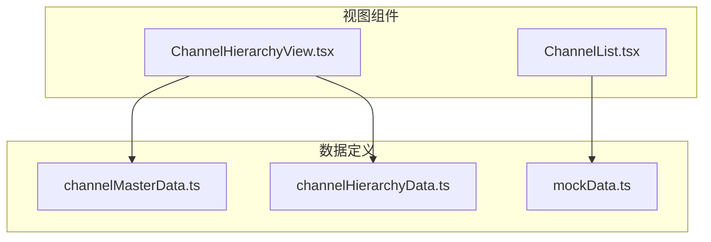
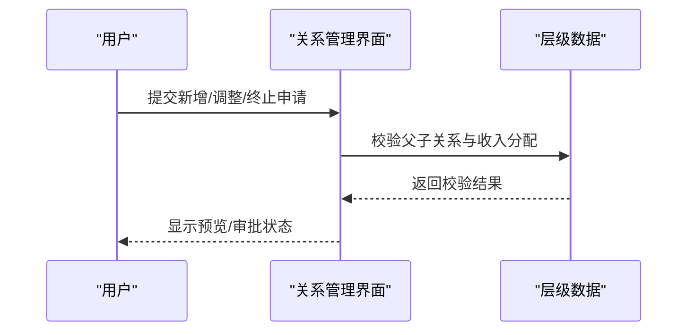
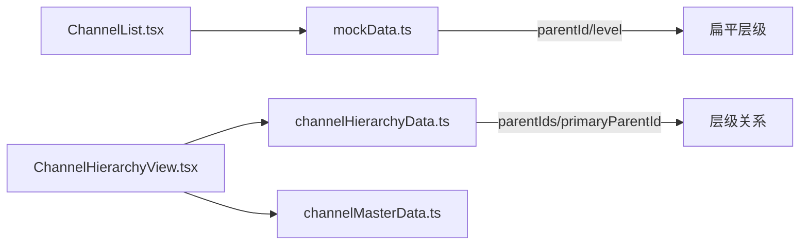

# 渠道数据模型

<cite>
**本文引用的文件**
- [channelHierarchyData.ts](file://产品方案/UI-V1.0/src/data/channelHierarchyData.ts)
- [channelMasterData.ts](file://产品方案/UI-V1.0/src/data/channelMasterData.ts)
- [ChannelList.tsx](file://产品方案/UI-V1.0/src/views/ChannelList.tsx)
- [mockData.ts](file://产品方案/UI-V1.0/src/data/mockData.ts)
- [ChannelHierarchyView.tsx](file://产品方案/UI-V1.0/src/views/ChannelHierarchyView.tsx)
</cite>

## 目录
1. [简介](#简介)
2. [项目结构](#项目结构)
3. [核心组件](#核心组件)
4. [架构总览](#架构总览)
5. [详细组件分析](#详细组件分析)
6. [依赖关系分析](#依赖关系分析)
7. [性能考量](#性能考量)
8. [故障排查指南](#故障排查指南)
9. [结论](#结论)
10. [附录](#附录)

## 简介
本参考文档面向OverInsurData平台的“渠道数据模型”，聚焦于渠道主数据、层级与组织、以及渠道绩效指标的定义与用途。文档基于前端数据定义与视图实现，梳理了：
- Channel接口字段（id、name、type、tier等）及业务含义
- 渠道类型分类（Independent Agency、Broker、MGA、Wholesale Broker、Direct）的业务场景
- 渠道层级管理（parentId、level）与父子关系建立方式
- 渠道绩效指标（agentCount、totalPremium、policyCount、lossRatio、renewalRate、commissionRate）的计算口径与用途
- 完整渠道数据示例，覆盖不同层级与类型的渠道数据结构

## 项目结构
与渠道数据模型直接相关的代码位于UI层的数据定义与视图组件中：
- 数据定义：
  - 渠道主数据与代理/机构维度：channelMasterData.ts
  - 渠道层级与组织树：channelHierarchyData.ts
  - 通用渠道模型与样例：mockData.ts
- 视图展示：
  - 渠道列表与筛选：ChannelList.tsx
  - 组织架构树与关系管理：ChannelHierarchyView.tsx

图表来源
- [channelMasterData.ts:11-42](file://产品方案/UI-V1.0/src/data/channelMasterData.ts#L11-L42)
- [channelHierarchyData.ts:7-32](file://产品方案/UI-V1.0/src/data/channelHierarchyData.ts#L7-L32)
- [mockData.ts:50-69](file://产品方案/UI-V1.0/src/data/mockData.ts#L50-L69)
- [ChannelList.tsx:1-48](file://产品方案/UI-V1.0/src/views/ChannelList.tsx#L1-L48)
- [ChannelHierarchyView.tsx:14-19](file://产品方案/UI-V1.0/src/views/ChannelHierarchyView.tsx#L14-L19)

章节来源
- [channelMasterData.ts:11-42](file://产品方案/UI-V1.0/src/data/channelMasterData.ts#L11-L42)
- [channelHierarchyData.ts:7-32](file://产品方案/UI-V1.0/src/data/channelHierarchyData.ts#L7-L32)
- [mockData.ts:50-69](file://产品方案/UI-V1.0/src/data/mockData.ts#L50-L69)
- [ChannelList.tsx:1-48](file://产品方案/UI-V1.0/src/views/ChannelList.tsx#L1-L48)
- [ChannelHierarchyView.tsx:14-19](file://产品方案/UI-V1.0/src/views/ChannelHierarchyView.tsx#L14-L19)

## 核心组件
- 渠道主数据（ChannelOrg）：用于维护渠道组织的基本信息、合规资质、业绩与状态。关键字段包括：id、name、shortName、type、status、npn、taxId、licenseStates、primaryState、地址信息、合同编号、加入日期、YTD保费/佣金、赔付率、续保率、代理人数量、标签与备注。
- 渠道层级节点（ChannelNode）：用于构建平台-大区-机构-分支-代理的多级组织树，支持多上级、主次上级、收入分配比例、白标配置、团队规模与业绩指标。关键字段包括：id、name、shortName、type、status、parentIds、primaryParentId、depth、npn、licenseStates、primaryState、joinDate、contractId、managerId/managerName、teamSize、ytdPremium/ytdCommission、lossRatio、renewalRate、whiteLabelId、overrideRate、email/phone。
- 渠道通用模型（Channel）：用于列表展示与筛选的扁平化渠道记录，包含id、name、type、status、tier、parentId、level、agentCount、totalPremium、policyCount、lossRatio、renewalRate、commissionRate、state、region、joinDate、npnCode、manager。

章节来源
- [channelMasterData.ts:11-42](file://产品方案/UI-V1.0/src/data/channelMasterData.ts#L11-L42)
- [channelHierarchyData.ts:7-32](file://产品方案/UI-V1.0/src/data/channelHierarchyData.ts#L7-L32)
- [mockData.ts:50-69](file://产品方案/UI-V1.0/src/data/mockData.ts#L50-L69)

## 架构总览
渠道数据在系统中以“主数据+层级树”双视角呈现：
- 主数据视角：以ChannelOrg为核心，承载合规、财务、联系人、资质与静态属性。
- 层级树视角：以ChannelNode为核心，承载多级组织关系、多上级与收入分配、白标能力与团队绩效。
- 列表视角：以Channel为扁平化展示，便于快速检索、筛选与统计。

```mermaid
classDiagram
class ChannelOrg {
+string id
+string name
+string shortName
+string type
+string status
+string npn
+string taxId
+string[] licenseStates
+string primaryState
+string address
+string city
+string state
+string zip
+string phone
+string email
+string website
+string managerId
+string managerName
+string parentOrgId
+string parentOrgName
+string contractId
+string joinDate
+string lastReviewDate
+number ytdPremium
+number ytdCommission
+number lossRatio
+number renewalRate
+number agentCount
+string[] tags
+string notes
}
class ChannelNode {
+string id
+string name
+string shortName
+string type
+string status
+string[] parentIds
+string primaryParentId
+number depth
+string npn
+string[] licenseStates
+string primaryState
+string joinDate
+string contractId
+string managerId
+string managerName
+number teamSize
+number ytdPremium
+number ytdCommission
+number lossRatio
+number renewalRate
+string whiteLabelId
+number overrideRate
+string email
+string phone
}
class Channel {
+string id
+string name
+string type
+string status
+string tier
+string parentId
+number level
+number agentCount
+number totalPremium
+number policyCount
+number lossRatio
+number renewalRate
+number commissionRate
+string state
+string region
+string joinDate
+string npnCode
+string manager
}
ChannelNode --> ChannelOrg : "可关联(通过ID映射)"
Channel --> ChannelNode : "扁平化展示"
```

图表来源
- [channelMasterData.ts:11-42](file://产品方案/UI-V1.0/src/data/channelMasterData.ts#L11-L42)
- [channelHierarchyData.ts:7-32](file://产品方案/UI-V1.0/src/data/channelHierarchyData.ts#L7-L32)
- [mockData.ts:50-69](file://产品方案/UI-V1.0/src/data/mockData.ts#L50-L69)

## 详细组件分析

### 渠道接口与字段定义（Channel）
- 基础信息
  - id：渠道唯一标识
  - name：渠道名称
  - type：渠道类型（见下节）
  - status：渠道状态（活跃/入驻中/暂停/停用）
  - tier：渠道等级（铂金/金级/银级/标准）
  - parentId：父渠道ID（用于构建层级）
  - level：层级深度（如1为一级渠道，2为二级分支）
  - state/region：所在州与大区
  - joinDate：加入日期
  - npnCode：NPN编码
  - manager：负责人
- 业务指标
  - agentCount：渠道内代理人数量
  - totalPremium：渠道累计保费
  - policyCount：保单数量
  - lossRatio：赔付率
  - renewalRate：续保率
  - commissionRate：佣金率

章节来源
- [mockData.ts:50-69](file://产品方案/UI-V1.0/src/data/mockData.ts#L50-L69)
- [ChannelList.tsx:10-37](file://产品方案/UI-V1.0/src/views/ChannelList.tsx#L10-L37)

### 渠道类型（type）与业务场景
- Independent Agency（独立代理）：自有牌照与团队，直接对接客户出单，适合区域深耕型机构。
- Broker（经纪商）：聚合多家保险公司资源，为客户匹配最优方案，强调跨公司整合能力。
- MGA（管理型总代理）：具备核保与定价授权，能承担部分承保责任，适合专业化垂直领域。
- Wholesale Broker（批发经纪）：主要服务其他经纪或代理，提供批量分销与批单能力。
- Direct（直销）：平台直拓客户，减少中间环节，强调品牌与转化效率。

章节来源
- [ChannelList.tsx:31-37](file://产品方案/UI-V1.0/src/views/ChannelList.tsx#L31-L37)
- [mockData.ts:50-69](file://产品方案/UI-V1.0/src/data/mockData.ts#L50-L69)

### 渠道等级体系（tier）与业务含义
- Platinum（铂金）：高保费规模、低赔付率、高续保率，享有优先资源与更高佣金率。
- Gold（金级）：稳健增长，关键指标接近或达到基准线，享受较高资源倾斜。
- Silver（银级）：成长期渠道，需关注赔付率与续保率改善，逐步提升资源。
- Standard（标准）：新入或待观察渠道，按标准政策执行，逐步评估升级。

章节来源
- [ChannelList.tsx:10-15](file://产品方案/UI-V1.0/src/views/ChannelList.tsx#L10-L15)
- [mockData.ts:50-69](file://产品方案/UI-V1.0/src/data/mockData.ts#L50-L69)

### 渠道层级管理（parentId与level）
- parentId：指向父渠道ID，用于构建上下级关系；无parentId表示顶级渠道。
- level：层级深度，1为一级渠道，2为二级分支，依此类推。
- 父子关系建立方式：
  - 在Channel对象中设置parentId与level，形成树形结构。
  - 在ChannelNode中通过parentIds与primaryParentId表达多上级与主次关系，配合revenueShare进行收入分配。

章节来源
- [mockData.ts:50-69](file://产品方案/UI-V1.0/src/data/mockData.ts#L50-L69)
- [channelHierarchyData.ts:7-32](file://产品方案/UI-V1.0/src/data/channelHierarchyData.ts#L7-L32)
- [ChannelHierarchyView.tsx:99-113](file://产品方案/UI-V1.0/src/views/ChannelHierarchyView.tsx#L99-L113)

### 渠道绩效指标（计算方式与用途）
- agentCount：渠道内有效代理人数量，用于衡量渠道产能与团队规模。
- totalPremium：渠道累计保费，反映渠道贡献度与资源分配依据。
- policyCount：保单数量，体现渠道活跃度与覆盖面。
- lossRatio：赔付率=理赔金额/保费，用于风险管控与佣金调整。
- renewalRate：续保率=续保保单数/到期保单数，衡量客户粘性与服务质量。
- commissionRate：佣金率=佣金/保费，影响渠道收益与激励策略。

说明：上述指标在列表与详情中直接展示，用于筛选、排序与看板统计。具体计算逻辑由后台系统汇总，前端负责展示与交互。

章节来源
- [mockData.ts:50-69](file://产品方案/UI-V1.0/src/data/mockData.ts#L50-L69)
- [ChannelList.tsx:87-101](file://产品方案/UI-V1.0/src/views/ChannelList.tsx#L87-L101)
- [ChannelHierarchyView.tsx:210-224](file://产品方案/UI-V1.0/src/views/ChannelHierarchyView.tsx#L210-L224)

### 渠道数据示例（不同层级与类型）
- 一级渠道（Platinum/Gold/Silver/Standard）：
  - 示例：Pacific Coast Insurance Group（Independent Agency，Platinum）、Lone Star Brokerage（Broker，Platinum）、Great Lakes Insurance Partners（MGA，Gold）等。
- 二级分支（level=2，parentId指向一级渠道）：
  - 示例：PCG - Bay Area Division（parentId=c1）、Lone Star - Houston Branch（parentId=c2）。
- 层级树中的多上级节点：
  - 示例：Ryan Chen同时归属LA与SF分支，主次上级与收入分配比例明确。

章节来源
- [mockData.ts:364-377](file://产品方案/UI-V1.0/src/data/mockData.ts#L364-L377)
- [channelHierarchyData.ts:34-76](file://产品方案/UI-V1.0/src/data/channelHierarchyData.ts#L34-L76)

### 层级关系管理与多上级配置
- 新增/调整/终止层级关系：
  - 新增：选择子节点与父节点，设置收入分配比例与是否为主上级。
  - 调整：选择当前上级与新上级，填写生效日期与原因。
  - 终止：选择关系并确认生效日期与原因。
- 多上级配置：
  - 支持一个节点拥有多个上级，各上级收入分配之和需等于100%。
  - 主上级决定合规归属、产品授权与佣金合同版本；次上级仅享有收入分配权。

图表来源
- [ChannelHierarchyView.tsx:287-529](file://产品方案/UI-V1.0/src/views/ChannelHierarchyView.tsx#L287-L529)
- [channelHierarchyData.ts:78-122](file://产品方案/UI-V1.0/src/data/channelHierarchyData.ts#L78-L122)

章节来源
- [ChannelHierarchyView.tsx:287-529](file://产品方案/UI-V1.0/src/views/ChannelHierarchyView.tsx#L287-L529)
- [channelHierarchyData.ts:78-122](file://产品方案/UI-V1.0/src/data/channelHierarchyData.ts#L78-L122)

### 白标与功能配置（White-label）
- 白标配置项包括品牌名称、域名、邮箱域名、主辅色、门户/移动APP开关、文档模板、报告品牌化、API接入等。
- 适用于代理机构的定制化门户与品牌输出，增强渠道体验与品牌一致性。

章节来源
- [channelHierarchyData.ts:155-189](file://产品方案/UI-V1.0/src/data/channelHierarchyData.ts#L155-L189)
- [ChannelHierarchyView.tsx:645-797](file://产品方案/UI-V1.0/src/views/ChannelHierarchyView.tsx#L645-L797)

## 依赖关系分析
- 视图对数据的依赖：
  - ChannelList.tsx依赖mockData.ts中的channels数组，用于列表渲染与筛选。
  - ChannelHierarchyView.tsx依赖channelHierarchyData.ts中的channelNodes、hierarchyRelations、pendingChanges、whiteLabelConfigs等，用于树形展示与关系管理。
- 数据间关系：
  - ChannelNode通过parentIds与primaryParentId表达层级与主次关系。
  - Channel通过parentId与level表达扁平化的父子关系。
  - ChannelOrg作为主数据，与ChannelNode存在概念上的对应（可通过ID映射关联）。

图表来源
- [ChannelList.tsx:1-48](file://产品方案/UI-V1.0/src/views/ChannelList.tsx#L1-L48)
- [ChannelHierarchyView.tsx:14-19](file://产品方案/UI-V1.0/src/views/ChannelHierarchyView.tsx#L14-L19)
- [channelHierarchyData.ts:7-32](file://产品方案/UI-V1.0/src/data/channelHierarchyData.ts#L7-L32)
- [mockData.ts:50-69](file://产品方案/UI-V1.0/src/data/mockData.ts#L50-L69)

章节来源
- [ChannelList.tsx:1-48](file://产品方案/UI-V1.0/src/views/ChannelList.tsx#L1-L48)
- [ChannelHierarchyView.tsx:14-19](file://产品方案/UI-V1.0/src/views/ChannelHierarchyView.tsx#L14-L19)
- [channelHierarchyData.ts:7-32](file://产品方案/UI-V1.0/src/data/channelHierarchyData.ts#L7-L32)
- [mockData.ts:50-69](file://产品方案/UI-V1.0/src/data/mockData.ts#L50-L69)

## 性能考量
- 列表渲染：ChannelList使用本地过滤与展开/收起，避免频繁重绘；大数据量时可考虑分页与虚拟滚动。
- 树形结构：ChannelHierarchyView通过childrenMap缓存子节点映射，降低重复查找开销。
- 指标计算：前端仅做展示与简单聚合，复杂计算应下沉至后端，确保一致性与可扩展性。

[本节为通用指导，不直接分析具体文件]

## 故障排查指南
- 层级关系异常：
  - 检查parentIds与primaryParentId是否一致，父子ID是否存在。
  - 多上级时确认revenueShare总和是否为100%。
- 状态与权限：
  - 渠道状态为suspended或inactive时，可能无法出单或查看敏感数据。
  - 白标配置未启用时，门户/移动APP等功能不可用。
- 导入与校验：
  - 导入错误会返回行号与字段提示，需根据错误信息修正后重试。

章节来源
- [channelHierarchyData.ts:105-151](file://产品方案/UI-V1.0/src/data/channelHierarchyData.ts#L105-L151)
- [channelMasterData.ts:421-435](file://产品方案/UI-V1.0/src/data/channelMasterData.ts#L421-L435)
- [ChannelHierarchyView.tsx:457-529](file://产品方案/UI-V1.0/src/views/ChannelHierarchyView.tsx#L457-L529)

## 结论
本参考文档基于现有前端数据与视图，系统化梳理了OverInsurData平台的渠道数据模型，涵盖字段定义、类型与等级、层级关系、绩效指标与示例数据。建议在后续迭代中：
- 将指标计算与规则引擎下沉至后端，保证一致性与扩展性。
- 完善渠道类型与等级的自动化评估规则，减少人工干预。
- 强化层级变更的审计与审批流，确保合规与可追溯。

[本节为总结，不直接分析具体文件]

## 附录
- 渠道主数据字段速查：
  - 基本信息：id、name、shortName、type、status、npn、taxId、licenseStates、primaryState、地址、联系方式、网站、管理员、合同编号、加入日期、最近审核日期。
  - 业务指标：ytdPremium、ytdCommission、lossRatio、renewalRate、agentCount、tags、notes。
- 渠道层级节点字段速查：
  - 基本信息：id、name、shortName、type、status、parentIds、primaryParentId、depth、npn、licenseStates、primaryState、joinDate、contractId、managerId/managerName、teamSize。
  - 业务指标：ytdPremium、ytdCommission、lossRatio、renewalRate、whiteLabelId、overrideRate、email/phone。
- 渠道通用模型字段速查：
  - 基本信息：id、name、type、status、tier、parentId、level、state、region、joinDate、npnCode、manager。
  - 业务指标：agentCount、totalPremium、policyCount、lossRatio、renewalRate、commissionRate。

章节来源
- [channelMasterData.ts:11-42](file://产品方案/UI-V1.0/src/data/channelMasterData.ts#L11-L42)
- [channelHierarchyData.ts:7-32](file://产品方案/UI-V1.0/src/data/channelHierarchyData.ts#L7-L32)
- [mockData.ts:50-69](file://产品方案/UI-V1.0/src/data/mockData.ts#L50-L69)