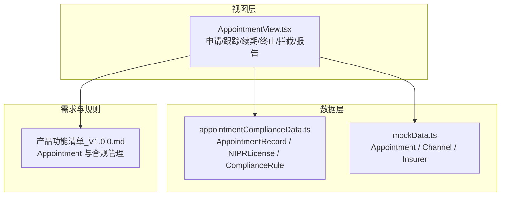
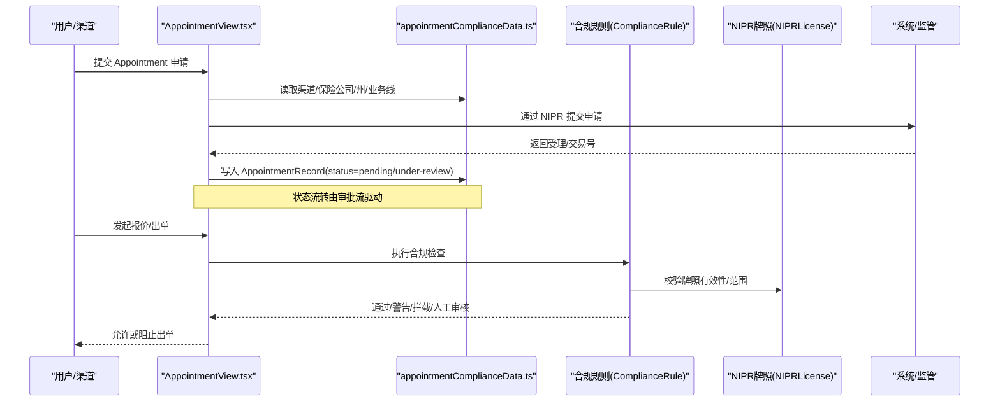
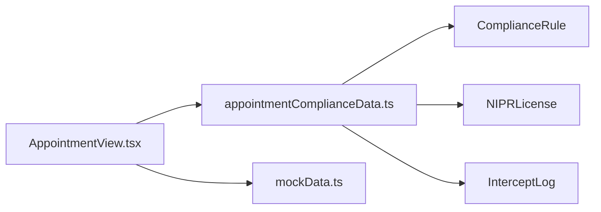

# 预约数据模型

<cite>
**本文引用的文件**
- [appointmentComplianceData.ts](file://产品方案/UI-V1.0/src/data/appointmentComplianceData.ts)
- [mockData.ts](file://产品方案/UI-V1.0/src/data/mockData.ts)
- [AppointmentView.tsx](file://产品方案/UI-V1.0/src/views/AppointmentView.tsx)
- [产品功能清单_V1.0.0.md](file://产品需求/产品功能清单_V1.0.0.md)
</cite>

## 目录
1. [简介](#简介)
2. [项目结构](#项目结构)
3. [核心组件](#核心组件)
4. [架构总览](#架构总览)
5. [详细组件分析](#详细组件分析)
6. [依赖关系分析](#依赖关系分析)
7. [性能与合规考量](#性能与合规考量)
8. [故障排查指南](#故障排查指南)
9. [结论](#结论)
10. [附录：字段定义与示例](#附录字段定义与示例)

## 简介
本参考文档聚焦 OverInsurData 平台的“预约（Appointment）”数据模型，面向 API 设计与实现提供权威说明。内容涵盖 Appointment 接口的字段定义、状态生命周期、时间字段规范、州级销售许可与业务线限制、NPN 牌照校验规则、多对多关系映射、以及合规性检查的数据验证规则。文档同时给出不同状态下的完整预约记录示例，帮助开发者快速对齐前后端契约与合规策略。

## 项目结构
与预约数据模型直接相关的代码位于前端产品方案模块中：
- 数据模型与样例数据：appointmentComplianceData.ts、mockData.ts
- 预约管理界面与交互流程：AppointmentView.tsx
- 产品需求与合规规则：产品功能清单_V1.0.0.md



图表来源
- [appointmentComplianceData.ts:3-40](file://产品方案/UI-V1.0/src/data/appointmentComplianceData.ts#L3-L40)
- [mockData.ts:71-84](file://产品方案/UI-V1.0/src/data/mockData.ts#L71-L84)
- [AppointmentView.tsx:212-318](file://产品方案/UI-V1.0/src/views/AppointmentView.tsx#L212-L318)
- [产品功能清单_V1.0.0.md:552-700](file://产品需求/产品功能清单_V1.0.0.md#L552-L700)

章节来源
- [appointmentComplianceData.ts:3-40](file://产品方案/UI-V1.0/src/data/appointmentComplianceData.ts#L3-L40)
- [mockData.ts:71-84](file://产品方案/UI-V1.0/src/data/mockData.ts#L71-L84)
- [AppointmentView.tsx:212-318](file://产品方案/UI-V1.0/src/views/AppointmentView.tsx#L212-L318)
- [产品功能清单_V1.0.0.md:552-700](file://产品需求/产品功能清单_V1.0.0.md#L552-L700)

## 核心组件
- AppointmentRecord（扩展版，用于合规与运营）：包含渠道、保险公司、州、业务线、状态、时间、处理天数、续期状态、NIPR 交易号等。
- Appointment（基础版，用于列表与展示）：包含渠道、保险公司、州、业务线、状态、时间、NPN 等。
- NIPRLicense：渠道在各州的牌照信息，含状态、有效期、CE 学时等。
- ComplianceRule：出单合规拦截规则（Appointment、牌照、OFAC、渠道、产品）。
- InterceptLog：出单合规拦截日志。
- OFACScreening：制裁名单筛查结果。
- ComplianceReport：合规报告元数据。

章节来源
- [appointmentComplianceData.ts:3-40](file://产品方案/UI-V1.0/src/data/appointmentComplianceData.ts#L3-L40)
- [appointmentComplianceData.ts:44-77](file://产品方案/UI-V1.0/src/data/appointmentComplianceData.ts#L44-L77)
- [appointmentComplianceData.ts:81-112](file://产品方案/UI-V1.0/src/data/appointmentComplianceData.ts#L81-L112)
- [appointmentComplianceData.ts:116-137](file://产品方案/UI-V1.0/src/data/appointmentComplianceData.ts#L116-L137)
- [appointmentComplianceData.ts:141-168](file://产品方案/UI-V1.0/src/data/appointmentComplianceData.ts#L141-L168)
- [appointmentComplianceData.ts:172-193](file://产品方案/UI-V1.0/src/data/appointmentComplianceData.ts#L172-L193)
- [mockData.ts:71-84](file://产品方案/UI-V1.0/src/data/mockData.ts#L71-L84)

## 架构总览
预约数据在系统中承担“渠道—保险公司—州—业务线”的授权凭证作用，贯穿申请、审批、续期、终止与出单合规拦截全流程。



图表来源
- [AppointmentView.tsx:212-318](file://产品方案/UI-V1.0/src/views/AppointmentView.tsx#L212-L318)
- [appointmentComplianceData.ts:116-137](file://产品方案/UI-V1.0/src/data/appointmentComplianceData.ts#L116-L137)
- [appointmentComplianceData.ts:44-77](file://产品方案/UI-V1.0/src/data/appointmentComplianceData.ts#L44-L77)

## 详细组件分析

### Appointment 接口字段定义
- 标识与关联
  - id：预约唯一标识（字符串）
  - channelId：渠道 ID（字符串）
  - channelName：渠道名称（字符串）
  - insurerId：保险公司 ID（字符串）
  - insurerName：保险公司名称（字符串）
  - state：州（两字母缩写，如 CA、NY）
  - line：业务线（如 P&C、Auto、Life、Health、Commercial、Specialty、Professional、Surplus Lines）
- 状态
  - status：'approved' | 'pending' | 'rejected' | 'expired' | 'terminated' | 'under-review'
- 时间字段
  - submittedDate：提交日期（YYYY-MM-DD）
  - approvedDate：批准日期（可选，YYYY-MM-DD）
  - expiryDate：到期日（YYYY-MM-DD）
  - terminatedDate：终止日期（可选，YYYY-MM-DD）
- 其他字段
  - channelNpn：渠道 NPN（字符串）
  - daysToExpiry：距到期天数（数字，可为负数表示已过期）
  - renewalStatus：续期状态（'not-due' | 'due-soon' | 'in-progress' | 'renewed'）
  - processingDays：处理耗时（工作日，数字）
  - rejectionReason：拒绝原因（字符串）
  - terminationReason：终止原因（字符串）
  - niprTransactionId：NIPR 交易号（字符串）
  - submittedBy：提交人（字符串）

章节来源
- [appointmentComplianceData.ts:3-25](file://产品方案/UI-V1.0/src/data/appointmentComplianceData.ts#L3-L25)
- [mockData.ts:71-84](file://产品方案/UI-V1.0/src/data/mockData.ts#L71-L84)

### 预约状态生命周期与转换条件
- 状态集合：'approved'、'pending'、'rejected'、'expired'、'terminated'、'under-review'
- 业务含义
  - pending：已提交，等待监管机构/保险公司受理
  - under-review：进入人工审核阶段（保险公司内部合规审查）
  - approved：已获批，可在对应州/业务线出单
  - rejected：被拒绝，需修正后重新申请
  - expired：已过期，不可继续出单，需续期
  - terminated：已终止，不可恢复，通常因合作终止或监管要求
- 典型转换
  - 提交 → pending → under-review → approved
  - 提交 → pending → rejected（可重新申请）
  - approved → expired（到期未续期）
  - approved → terminated（主动/被动终止）
  - expired → renewed（续期成功后回到 approved）
- 触发点
  - 提交：创建 AppointmentRecord，status=pending
  - 受理/审核：status=under-review
  - 批准：status=approved，填写 approvedDate
  - 拒绝：status=rejected，记录 rejectionReason
  - 到期：当 expiryDate < today，status=expired
  - 终止：status=terminated，记录 terminatedDate 与 terminationReason

章节来源
- [appointmentComplianceData.ts:13-25](file://产品方案/UI-V1.0/src/data/appointmentComplianceData.ts#L13-L25)
- [appointmentComplianceData.ts:27-40](file://产品方案/UI-V1.0/src/data/appointmentComplianceData.ts#L27-L40)
- [产品功能清单_V1.0.0.md:552-618](file://产品需求/产品功能清单_V1.0.0.md#L552-L618)

### 时间字段格式与业务逻辑
- 格式：所有日期字段采用 YYYY-MM-DD
- 语义
  - submittedDate：首次提交日期
  - approvedDate：批准日期（仅 approved 时存在）
  - expiryDate：到期日；若为空则视为无到期约束（但合规规则会强制检查）
  - terminatedDate：终止日期（仅 terminated 时存在）
- 计算
  - daysToExpiry = expiryDate - today（天），负值表示已过期
  - processingDays：从提交到批准的耗时（工作日）
- 业务规则
  - 出单前必须满足：status=approved 且 expiryDate >= today
  - 到期提醒：daysToExpiry <= 30/60/90 触发提醒
  - 续期：approved 状态下可发起续期，成功后更新 expiryDate 并维持 approved

章节来源
- [appointmentComplianceData.ts:14-20](file://产品方案/UI-V1.0/src/data/appointmentComplianceData.ts#L14-L20)
- [appointmentComplianceData.ts:27-40](file://产品方案/UI-V1.0/src/data/appointmentComplianceData.ts#L27-L40)
- [AppointmentView.tsx:234-246](file://产品方案/UI-V1.0/src/views/AppointmentView.tsx#L234-L246)

### 州级销售许可与业务线限制
- state：限定销售渠道所在州；出单时必须匹配该州
- line：限定业务线；出单时必须匹配该业务线
- 组合约束：同一渠道在同一州只能针对特定业务线持有有效 Appointment
- 配置入口：申请时选择 state 与 line，系统据此生成 AppointmentRecord
- 合规校验：出单时校验渠道在该州/业务线的 Appointment 是否有效

章节来源
- [appointmentComplianceData.ts:11-12](file://产品方案/UI-V1.0/src/data/appointmentComplianceData.ts#L11-L12)
- [AppointmentView.tsx:139-166](file://产品方案/UI-V1.0/src/views/AppointmentView.tsx#L139-L166)
- [appointmentComplianceData.ts:128-137](file://产品方案/UI-V1.0/src/data/appointmentComplianceData.ts#L128-L137)

### NPN 牌照号码验证规则
- NPN：国家保险生产者登记处（NIPR）编号，用于识别持牌代理人/机构
- 校验维度
  - 有效性：status ∈ {active, pending}
  - 有效期：expiryDate >= today
  - 业务范围：lines 包含目标 line
  - 州授权：state 与出单州一致或在允许范围内
  - CE 学时：ceHoursCompleted >= ceHoursRequired（按州要求）
- 异常处理
  - 无效/过期/暂停：拦截出单
  - 数据差异（verificationStatus=mismatch）：提示并需核实更新
- 批量验证：支持批量 NIPR 验证与定时自动校验

章节来源
- [appointmentComplianceData.ts:44-77](file://产品方案/UI-V1.0/src/data/appointmentComplianceData.ts#L44-L77)
- [appointmentComplianceData.ts:128-137](file://产品方案/UI-V1.0/src/data/appointmentComplianceData.ts#L128-L137)
- [AppointmentView.tsx:543-677](file://产品方案/UI-V1.0/src/views/AppointmentView.tsx#L543-L677)

### 预约与渠道、保险公司的多对多关系映射
- 渠道 ↔ 保险公司：一个渠道可与多家保险公司建立 Appointment；一家保险公司也可与多个渠道建立 Appointment
- 州与业务线：每个 Appointment 限定一个州与一个业务线，形成“渠道—保险公司—州—业务线”四维键
- 数据体现
  - channelId/channelName/channelNpn：渠道维度
  - insurerId/insurerName/insurerShort：保险公司维度
  - state/line：州与业务线维度
  - 多条记录可代表同一渠道与同一保险公司在不同州/业务线的授权

章节来源
- [appointmentComplianceData.ts:3-25](file://产品方案/UI-V1.0/src/data/appointmentComplianceData.ts#L3-L25)
- [mockData.ts:379-388](file://产品方案/UI-V1.0/src/data/mockData.ts#L379-L388)

### 合规性检查的数据验证规则
- 规则类别
  - appointment：出单时必须具备有效的 Appointment（status=approved 且未过期）
  - license：渠道对应州牌照必须有效（active/pending 且未过期）
  - ofac：客户实体命中 OFAC 制裁名单将拦截或转人工审核
  - channel：渠道状态为 suspended 时拦截
  - product：Non-Admitted 产品必须在产品可售州内
- 动作类型
  - block：直接拦截
  - warn：发出警告但仍允许
  - require-review：转人工审核
- 执行时机：报价/出单前进行拦截检查，记录拦截日志与原因描述

章节来源
- [appointmentComplianceData.ts:116-137](file://产品方案/UI-V1.0/src/data/appointmentComplianceData.ts#L116-L137)
- [appointmentComplianceData.ts:81-112](file://产品方案/UI-V1.0/src/data/appointmentComplianceData.ts#L81-L112)
- [产品功能清单_V1.0.0.md:650-700](file://产品需求/产品功能清单_V1.0.0.md#L650-L700)

## 依赖关系分析
- 视图层依赖数据层：AppointmentView.tsx 消费 appointmentComplianceData.ts 中的 AppointmentRecord、NIPRLicense、ComplianceRule、InterceptLog 等
- 数据层依赖主数据：mockData.ts 提供 Channel、Insurer、Appointment 的基础结构与样例
- 合规规则驱动拦截：ComplianceRule 决定出单拦截行为，InterceptLog 记录结果
- 牌照数据支撑校验：NIPRLicense 提供渠道牌照状态与范围



图表来源
- [AppointmentView.tsx:10-19](file://产品方案/UI-V1.0/src/views/AppointmentView.tsx#L10-L19)
- [appointmentComplianceData.ts:3-40](file://产品方案/UI-V1.0/src/data/appointmentComplianceData.ts#L3-L40)
- [appointmentComplianceData.ts:116-137](file://产品方案/UI-V1.0/src/data/appointmentComplianceData.ts#L116-L137)
- [mockData.ts:71-84](file://产品方案/UI-V1.0/src/data/mockData.ts#L71-L84)

章节来源
- [AppointmentView.tsx:10-19](file://产品方案/UI-V1.0/src/views/AppointmentView.tsx#L10-L19)
- [appointmentComplianceData.ts:3-40](file://产品方案/UI-V1.0/src/data/appointmentComplianceData.ts#L3-L40)
- [appointmentComplianceData.ts:116-137](file://产品方案/UI-V1.0/src/data/appointmentComplianceData.ts#L116-L137)
- [mockData.ts:71-84](file://产品方案/UI-V1.0/src/data/mockData.ts#L71-L84)

## 性能与合规考量
- 性能
  - 列表过滤与统计：基于内存数组过滤，适合中小规模数据；大数据量建议分页与后端聚合
  - 合规检查：建议在出单路径做轻量校验，避免阻塞主流程；复杂规则异步化
- 合规
  - 严格遵循“Appointment 必须有效”“牌照有效性检查”“OFAC 筛查”等规则
  - 拦截日志与报告：保留审计轨迹，支持导出与监管申报

[本节为通用指导，不直接分析具体文件]

## 故障排查指南
- 常见拦截原因
  - no-appointment：缺少有效 Appointment
  - expired-appointment：Appointment 已过期
  - invalid-license/expired-license：牌照无效或过期
  - ofac-match：命中 OFAC 制裁名单
  - suspended-channel：渠道被暂停
  - state-not-authorized：非授权州
- 处理建议
  - 查看拦截日志（InterceptLog）获取 reasonDescriptions
  - 根据规则（ComplianceRule）调整状态或补齐资料
  - 对疑似 OFAC 命中进行人工复核并记录 overrideNote

章节来源
- [appointmentComplianceData.ts:81-112](file://产品方案/UI-V1.0/src/data/appointmentComplianceData.ts#L81-L112)
- [appointmentComplianceData.ts:116-137](file://产品方案/UI-V1.0/src/data/appointmentComplianceData.ts#L116-L137)

## 结论
本参考文档明确了 OverInsurData 平台预约数据模型的字段、状态生命周期、时间规范、州与业务线限制、NPN 牌照校验与合规拦截规则，并通过流程图与依赖图展示了数据流向与交互边界。开发团队可据此统一前后端契约，确保出单合规与可审计性。

[本节为总结，不直接分析具体文件]

## 附录：字段定义与示例

### 字段定义表（AppointmentRecord）
- id：string
- channelId：string
- channelName：string
- channelNpn：string
- insurerId：string
- insurerName：string
- insurerShort：string
- state：string（两字母州码）
- line：string（P&C/Auto/Life/Health/Commercial/Specialty/Professional/Surplus Lines）
- status：'approved'|'pending'|'rejected'|'expired'|'terminated'|'under-review'
- submittedDate：string（YYYY-MM-DD）
- approvedDate：string?（YYYY-MM-DD）
- expiryDate：string（YYYY-MM-DD）
- terminatedDate：string?（YYYY-MM-DD）
- terminationReason：string?
- renewalStatus：'not-due'|'due-soon'|'in-progress'|'renewed'
- daysToExpiry：number
- submittedBy：string
- processingDays：number?
- rejectionReason：string?
- niprTransactionId：string?

章节来源
- [appointmentComplianceData.ts:3-25](file://产品方案/UI-V1.0/src/data/appointmentComplianceData.ts#L3-L25)

### 不同状态下的预约记录示例（来自样例数据）
- 已批准（approved）
  - 示例：ap1、ap2、ap3、ap7、ap9、ap11
- 待审核（pending）
  - 示例：ap4、ap8
- 审核中（under-review）
  - 示例：ap5
- 已过期（expired）
  - 示例：ap6
- 已拒绝（rejected）
  - 示例：ap10
- 已终止（terminated）
  - 示例：ap12

章节来源
- [appointmentComplianceData.ts:27-40](file://产品方案/UI-V1.0/src/data/appointmentComplianceData.ts#L27-L40)

### 状态机示意
```mermaid
stateDiagram-v2
[*] --> pending : "提交申请"
pending --> under-review : "进入人工审核"
under-review --> approved : "批准"
under-review --> rejected : "拒绝"
pending --> rejected : "拒绝"
approved --> expired : "到期未续期"
approved --> terminated : "终止"
expired --> approved : "续期成功"
```

图表来源
- [appointmentComplianceData.ts:13-25](file://产品方案/UI-V1.0/src/data/appointmentComplianceData.ts#L13-L25)
- [appointmentComplianceData.ts:27-40](file://产品方案/UI-V1.0/src/data/appointmentComplianceData.ts#L27-L40)