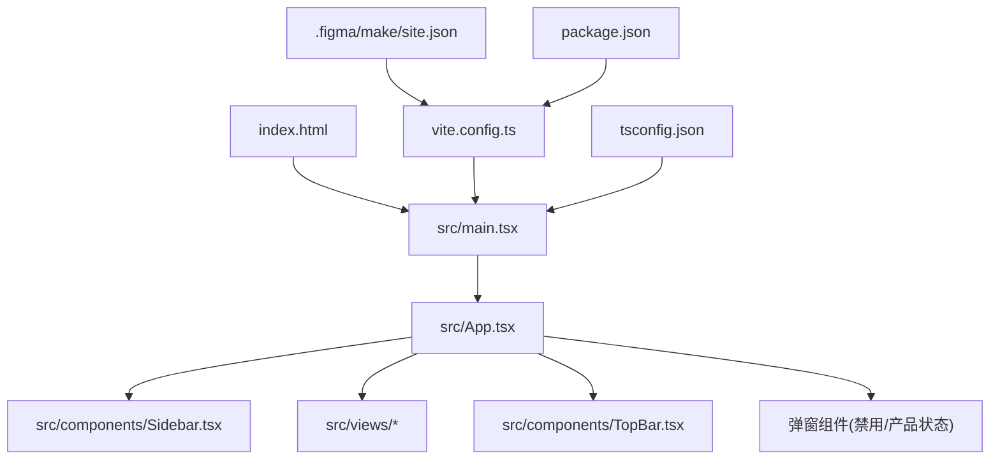
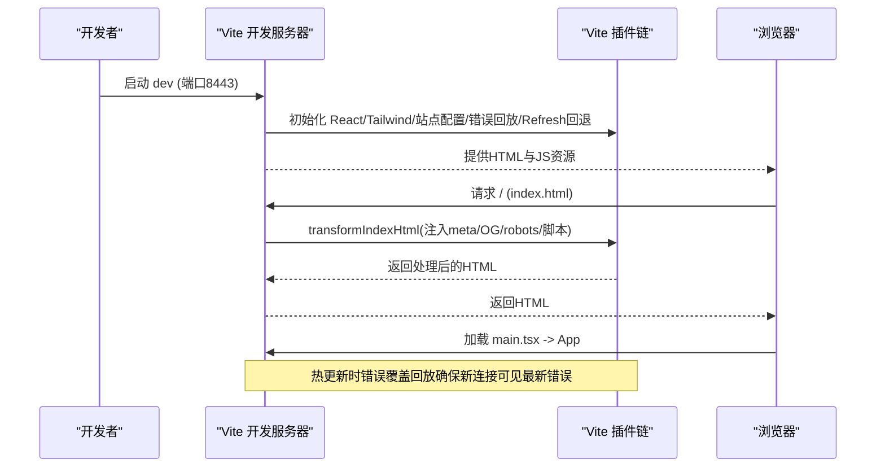
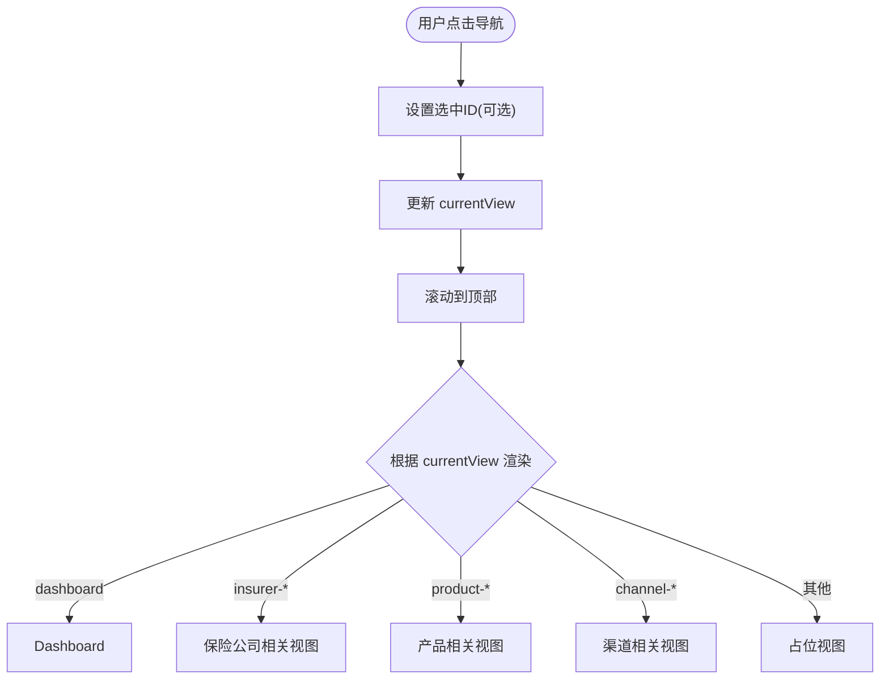
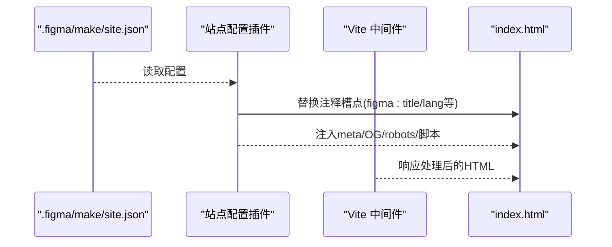
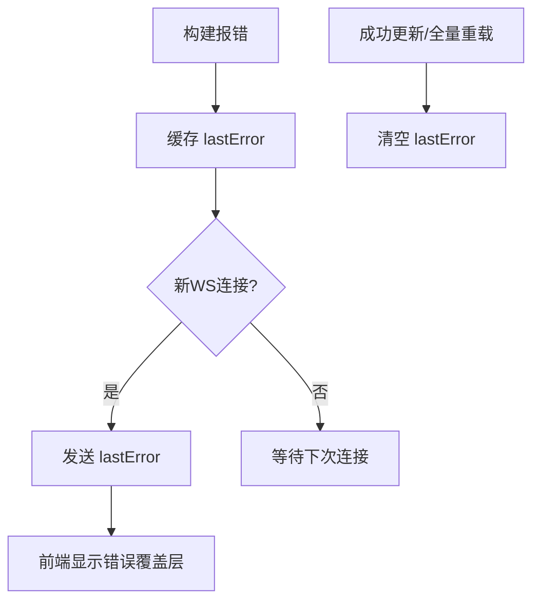
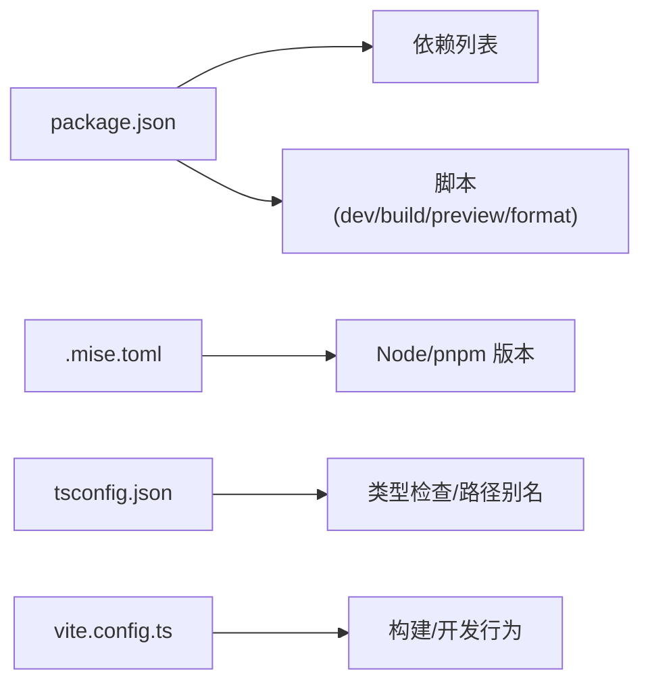

# 开发指南

<cite>
**本文引用的文件**
- [package.json](file://产品设计/UI-V1.0/package.json)
- [vite.config.ts](file://产品设计/UI-V1.0/vite.config.ts)
- [tsconfig.json](file://产品设计/UI-V1.0/tsconfig.json)
- [App.tsx](file://产品设计/UI-V1.0/src/App.tsx)
- [main.tsx](file://产品设计/UI-V1.0/src/main.tsx)
- [Sidebar.tsx](file://产品设计/UI-V1.0/src/components/Sidebar.tsx)
- [site.json](file://产品设计/UI-V1.0/.figma/make/site.json)
- [.gitignore](file://产品设计/UI-V1.0/.gitignore)
- [.mise.toml](file://产品设计/UI-V1.0/.mise.toml)
- [AGENTS.md](file://产品设计/UI-V1.0/AGENTS.md)
</cite>

## 目录
1. [简介](#简介)
2. [项目结构](#项目结构)
3. [核心组件](#核心组件)
4. [架构总览](#架构总览)
5. [详细组件分析](#详细组件分析)
6. [依赖分析](#依赖分析)
7. [性能考虑](#性能考虑)
8. [故障排查指南](#故障排查指南)
9. [结论](#结论)
10. [附录](#附录)

## 简介
本指南面向OverInsurData平台（当前为UI-V1.0原型）的开发者，覆盖开发环境配置、代码规范与最佳实践、调试技巧与测试策略、TypeScript配置、Vite构建优化、Git工作流与代码质量工具使用。目标是帮助团队高效进行项目开发与维护，确保一致的开发体验与可维护的代码结构。

## 项目结构
- 入口与挂载
  - 应用入口：src/main.tsx 负责创建React根节点并挂载App组件
  - 全局样式：src/index.css 作为Tailwind CSS v4的导入入口
  - HTML模板：index.html 提供#root容器与加载脚本
- 应用主视图
  - src/App.tsx 作为路由与布局中枢，组合侧边栏、顶栏与各业务视图
- 导航与模块
  - src/components/Sidebar.tsx 定义视图枚举与导航分组
  - src/views/* 各业务视图组件
- 构建与配置
  - vite.config.ts 集成React、Tailwind、站点元信息注入、错误覆盖回放、React Refresh边界回退等插件
  - tsconfig.json 启用严格模式、路径别名、ESNext模块解析等
  - package.json 管理依赖与脚本（dev/build/preview/format）
  - .figma/make/site.json 控制站点标题、描述、robots、可访问性等
  - .gitignore 忽略构建产物、日志与环境变量
  - .mise.toml 锁定Node与pnpm版本

图表来源
- [main.tsx:1-11](file://产品设计/UI-V1.0/src/main.tsx#L1-L11)
- [App.tsx:1-123](file://产品设计/UI-V1.0/src/App.tsx#L1-L123)
- [Sidebar.tsx:1-203](file://产品设计/UI-V1.0/src/components/Sidebar.tsx#L1-L203)
- [vite.config.ts:1-43](file://产品设计/UI-V1.0/vite.config.ts#L1-L43)
- [site.json:1-10](file://产品设计/UI-V1.0/.figma/make/site.json#L1-L10)
- [tsconfig.json:1-24](file://产品设计/UI-V1.0/tsconfig.json#L1-L24)
- [package.json:1-30](file://产品设计/UI-V1.0/package.json#L1-L30)

章节来源
- [AGENTS.md:1-42](file://产品设计/UI-V1.0/AGENTS.md#L1-L42)
- [package.json:1-30](file://产品设计/UI-V1.0/package.json#L1-L30)
- [vite.config.ts:1-43](file://产品设计/UI-V1.0/vite.config.ts#L1-L43)
- [tsconfig.json:1-24](file://产品设计/UI-V1.0/tsconfig.json#L1-L24)

## 核心组件
- App 组件
  - 集中管理当前视图、选中实体ID、弹窗状态
  - 通过navigateTo统一切换视图并滚动到顶部
  - 根据currentView渲染对应视图或占位视图
- Sidebar 组件
  - 定义所有视图ID的类型联合，保证类型安全
  - 按“保险公司管理”“渠道管理”分组展示导航项
  - 支持折叠/展开与激活态高亮
- TopBar 与弹窗
  - TopBar用于页面头部信息与操作
  - DisableModal与ProductStatusModal由App层统一管理显示与确认回调

章节来源
- [App.tsx:25-82](file://产品设计/UI-V1.0/src/App.tsx#L25-L82)
- [Sidebar.tsx:9-70](file://产品设计/UI-V1.0/src/components/Sidebar.tsx#L9-L70)
- [Sidebar.tsx:77-203](file://产品设计/UI-V1.0/src/components/Sidebar.tsx#L77-L203)

## 架构总览
- 运行时入口
  - main.tsx 创建根节点并挂载App
- 构建时增强
  - Vite插件链：React、Tailwind、站点配置注入、错误覆盖回放、React Refresh边界回退、Figma Make Kit
  - 站点配置来自.site.json，动态注入meta、OG标签、robots、可访问性跳过链接等
- 开发与预览
  - 开发服务器默认监听0.0.0.0:8443，严格端口模式
  - 生产构建开启压缩，按需生成source map

图表来源
- [vite.config.ts:9-43](file://产品设计/UI-V1.0/vite.config.ts#L9-L43)
- [vite.config.ts:72-213](file://产品设计/UI-V1.0/vite.config.ts#L72-L213)
- [vite.config.ts:228-296](file://产品设计/UI-V1.0/vite.config.ts#L228-L296)
- [main.tsx:1-11](file://产品设计/UI-V1.0/src/main.tsx#L1-L11)

## 详细组件分析

### 视图路由与导航流程
- 视图枚举集中定义在Sidebar中，App通过switch分发渲染
- navigateTo统一处理参数传递与滚动重置
- 未匹配视图进入PlaceholderView

图表来源
- [App.tsx:25-82](file://产品设计/UI-V1.0/src/App.tsx#L25-L82)
- [Sidebar.tsx:9-70](file://产品设计/UI-V1.0/src/components/Sidebar.tsx#L9-L70)

章节来源
- [App.tsx:25-82](file://产品设计/UI-V1.0/src/App.tsx#L25-L82)
- [Sidebar.tsx:9-70](file://产品设计/UI-V1.0/src/components/Sidebar.tsx#L9-L70)

### 站点配置注入流程
- site.json控制标题、描述、robots、可访问性选项
- 插件在transformIndexHtml阶段替换注释槽点并注入meta/OG/脚本
- 当robots.index=false时，同时输出robots.txt并在head注入noindex

图表来源
- [site.json:1-10](file://产品设计/UI-V1.0/.figma/make/site.json#L1-L10)
- [vite.config.ts:72-213](file://产品设计/UI-V1.0/vite.config.ts#L72-L213)

章节来源
- [vite.config.ts:72-213](file://产品设计/UI-V1.0/vite.config.ts#L72-L213)
- [site.json:1-10](file://产品设计/UI-V1.0/.figma/make/site.json#L1-L10)

### 错误覆盖回放与React Refresh边界回退
- 错误覆盖回放：拦截ws.send缓存最近错误，新连接时重放，避免预览iframe重载后丢失错误提示
- React Refresh边界回退：当某模块不再定义React Refresh边界时触发full-reload，防止旧树残留

图表来源
- [vite.config.ts:228-296](file://产品设计/UI-V1.0/vite.config.ts#L228-L296)

章节来源
- [vite.config.ts:228-296](file://产品设计/UI-V1.0/vite.config.ts#L228-L296)

## 依赖分析
- 运行期依赖
  - React 19、React DOM 19
  - 图标库 lucide-react
  - 图表库 recharts
- 开发期依赖
  - Vite 8、@vitejs/plugin-react
  - Tailwind CSS v4 与 @tailwindcss/vite
  - TypeScript 5.7
  - 格式化 oxfmt
- 工具链
  - Node 22、pnpm 10.34.3（通过.mise.toml锁定）

图表来源
- [package.json:1-30](file://产品设计/UI-V1.0/package.json#L1-L30)
- [.mise.toml:1-4](file://产品设计/UI-V1.0/.mise.toml#L1-L4)
- [tsconfig.json:1-24](file://产品设计/UI-V1.0/tsconfig.json#L1-L24)
- [vite.config.ts:1-43](file://产品设计/UI-V1.0/vite.config.ts#L1-L43)

章节来源
- [package.json:1-30](file://产品设计/UI-V1.0/package.json#L1-L30)
- [.mise.toml:1-4](file://产品设计/UI-V1.0/.mise.toml#L1-L4)
- [tsconfig.json:1-24](file://产品设计/UI-V1.0/tsconfig.json#L1-L24)
- [vite.config.ts:1-43](file://产品设计/UI-V1.0/vite.config.ts#L1-L43)

## 性能考虑
- 构建产物
  - 开发模式内联source map便于调试；生产模式关闭source map并启用压缩
- 样式与主题
  - 使用Tailwind v4原子类减少自定义CSS体积；全局样式集中在index.css
- 路由与渲染
  - 视图切换采用条件渲染，建议后续对大视图引入懒加载以减小首屏包体
- 热更新
  - 已内置错误覆盖回放与React Refresh边界回退，提升HMR稳定性
- 资源与SEO
  - 通过site.json注入OG与robots，按需启用可访问性跳过链接

[本节为通用指导，不直接分析具体文件]

## 故障排查指南
- 端口占用
  - 开发/预览默认端口8443且strictPort=true，若端口被占用需调整环境变量PORT或释放端口
- 构建失败
  - 检查TS严格模式与语法问题；遵循AGENTS中的字符串引号与闭合规则
- 样式异常
  - 确认Tailwind导入位于index.css首位；避免在JSX中使用未定义的类名
- 热更新失效
  - 观察是否出现React Refresh边界丢失导致的全量重载；必要时重启开发服务器
- 站点元信息未生效
  - 核对.site.json字段与插件注入逻辑；确认transformIndexHtml阶段未被其他插件干扰
- 忽略文件
  - 确保dist、node_modules、日志与环境变量不被提交；参考.gitignore

章节来源
- [vite.config.ts:32-41](file://产品设计/UI-V1.0/vite.config.ts#L32-L41)
- [AGENTS.md:31-42](file://产品设计/UI-V1.0/AGENTS.md#L31-L42)
- [.gitignore:1-21](file://产品设计/UI-V1.0/.gitignore#L1-L21)

## 结论
本项目基于React + Vite + Tailwind v4的现代前端栈，具备完善的开发体验与构建能力。通过统一的视图管理、类型安全的导航、站点配置注入与增强的HMR机制，团队可以高效迭代UI与功能。建议在后续演进中引入视图级懒加载、单元测试与端到端测试，进一步完善质量保障体系。

## 附录

### 开发环境配置
- 工具链
  - Node 22、pnpm 10.34.3（由.mise.toml锁定）
- 安装与启动
  - 安装依赖：pnpm install
  - 启动开发服务器：pnpm dev（默认端口8443，host 0.0.0.0）
  - 构建产物：pnpm build
  - 预览构建：pnpm preview
  - 格式化代码：pnpm format（oxfmt）
- 环境变量
  - PORT：开发/预览端口
  - FIGMA_PUBLIC_URL：部署基础路径前缀

章节来源
- [.mise.toml:1-4](file://产品设计/UI-V1.0/.mise.toml#L1-L4)
- [package.json:6-11](file://产品设计/UI-V1.0/package.json#L6-L11)
- [vite.config.ts:14-41](file://产品设计/UI-V1.0/vite.config.ts#L14-L41)

### TypeScript配置要点
- 目标与模块
  - target ES2020，module ESNext，moduleResolution bundler
- 严格模式
  - strict true，noFallthroughCasesInSwitch true
- 路径别名
  - baseUrl "."，paths "@/*": ["./src/*"]
- JSX与类型
  - jsx react-jsx，types包含node
- 编译选项
  - isolatedModules true，noEmit true（仅类型检查）

章节来源
- [tsconfig.json:1-24](file://产品设计/UI-V1.0/tsconfig.json#L1-L24)

### Vite构建优化与插件说明
- 基础路径与源映射
  - base根据FIGMA_PUBLIC_URL设置；开发内联source map，生产关闭
- 插件链
  - React、Tailwind、站点配置注入、错误覆盖回放、React Refresh边界回退、Figma Make Kit
- 服务与预览
  - host 0.0.0.0，strictPort true，watch忽略.figma目录
- 站点元信息
  - 通过site.json注入title/description/OG/robots/可访问性跳过链接

章节来源
- [vite.config.ts:9-43](file://产品设计/UI-V1.0/vite.config.ts#L9-L43)
- [vite.config.ts:72-213](file://产品设计/UI-V1.0/vite.config.ts#L72-L213)
- [vite.config.ts:228-296](file://产品设计/UI-V1.0/vite.config.ts#L228-L296)
- [site.json:1-10](file://产品设计/UI-V1.0/.figma/make/site.json#L1-L10)

### Git工作流与代码质量
- 忽略规则
  - 忽略node_modules、dist、日志、临时文件与环境变量
- 代码格式
  - 使用oxfmt统一格式；遵循AGENTS中关于字符串与闭合的规则
- 提交建议
  - 小步提交、清晰提交信息；变更涉及站点配置时同步更新site.json

章节来源
- [.gitignore:1-21](file://产品设计/UI-V1.0/.gitignore#L1-L21)
- [AGENTS.md:37-42](file://产品设计/UI-V1.0/AGENTS.md#L37-L42)

### 调试技巧
- 开发服务器
  - 使用浏览器开发者工具查看网络与控制台；关注Vite WS消息
- 错误覆盖
  - 利用内置错误覆盖回放快速定位构建错误
- 样式调试
  - 在index.css中集中管理全局样式与字体；优先使用Tailwind原子类
- 视图调试
  - 在App中打印currentView与选中ID，确认路由与参数传递正确

章节来源
- [vite.config.ts:32-41](file://产品设计/UI-V1.0/vite.config.ts#L32-L41)
- [vite.config.ts:228-296](file://产品设计/UI-V1.0/vite.config.ts#L228-L296)
- [App.tsx:25-82](file://产品设计/UI-V1.0/src/App.tsx#L25-L82)

### 测试策略（建议）
- 单元测试
  - 针对纯函数与工具方法使用轻量测试框架（如Vitest）编写用例
- 组件测试
  - 对关键视图与交互组件进行快照与交互测试
- 端到端测试
  - 对核心业务流程（如新增/编辑/删除）编写E2E用例
- 持续集成
  - 在CI中执行类型检查、格式化校验与测试用例

[本节为通用建议，不直接分析具体文件]