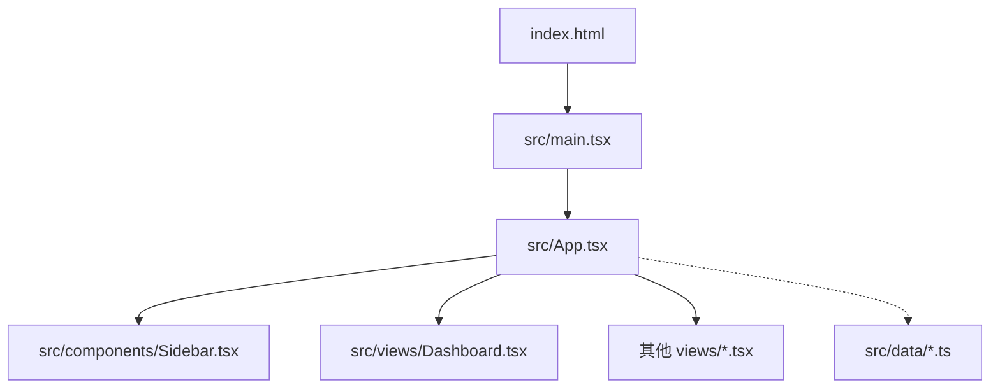
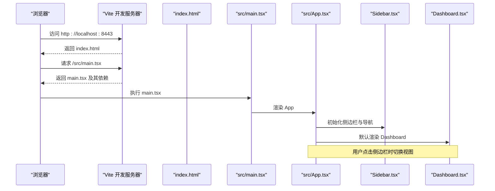
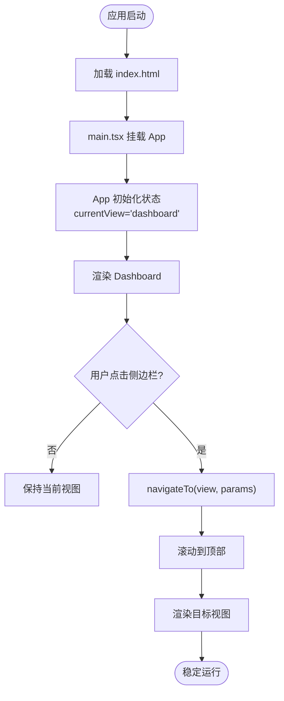
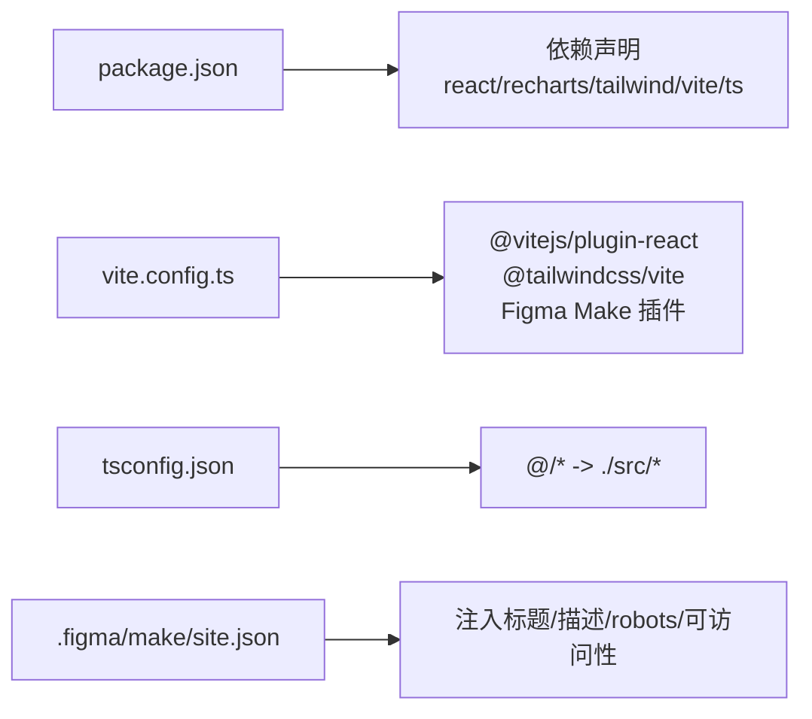

# 快速开始

<cite>
**本文引用的文件**
- [package.json](file://产品设计/UI-V1.0/package.json)
- [vite.config.ts](file://产品设计/UI-V1.0/vite.config.ts)
- [tsconfig.json](file://产品设计/UI-V1.0/tsconfig.json)
- [index.html](file://产品设计/UI-V1.0/index.html)
- [src/main.tsx](file://产品设计/UI-V1.0/src/main.tsx)
- [src/App.tsx](file://产品设计/UI-V1.0/src/App.tsx)
- [src/components/Sidebar.tsx](file://产品设计/UI-V1.0/src/components/Sidebar.tsx)
- [src/views/Dashboard.tsx](file://产品设计/UI-V1.0/src/views/Dashboard.tsx)
- [.figma/make/site.json](file://产品设计/UI-V1.0/.figma/make/site.json)
- [AGENTS.md](file://产品设计/UI-V1.0/AGENTS.md)
</cite>

## 目录
1. [简介](#简介)
2. [项目结构](#项目结构)
3. [核心组件](#核心组件)
4. [架构总览](#架构总览)
5. [详细组件分析](#详细组件分析)
6. [依赖关系分析](#依赖关系分析)
7. [性能注意事项](#性能注意事项)
8. [故障排查指南](#故障排查指南)
9. [结论](#结论)
10. [附录](#附录)

## 简介
本快速开始指南帮助你从零搭建 OverInsurData（海外保险数字化平台）前端工程，完成环境准备、依赖安装、开发服务器启动与基本使用。你将了解项目的技术栈（React + Vite + Tailwind CSS v4）、入口文件组织、路由式视图切换机制，以及常见环境配置问题与解决方案。

## 项目结构
本项目采用基于功能模块的前端工程化结构：
- 应用入口与页面挂载：index.html 提供根节点并加载 main.tsx；main.tsx 渲染 App 组件。
- 主布局与导航：App.tsx 管理当前视图与侧边栏、顶栏的交互；Sidebar.tsx 定义可导航的视图集合。
- 视图与数据：views 目录下为各业务页面（如 Dashboard），data 目录包含模拟数据与工具函数。
- 构建与样式：vite.config.ts 集成 React、Tailwind CSS v4 及 Figma Make 插件；tsconfig.json 配置 TypeScript 编译选项与路径别名 @/* -> src/*。
- 站点元信息：.figma/make/site.json 控制标题、描述、robots、可访问性等注入项。

图表来源
- [index.html:1-17](file://产品设计/UI-V1.0/index.html#L1-L17)
- [src/main.tsx:1-11](file://产品设计/UI-V1.0/src/main.tsx#L1-L11)
- [src/App.tsx:1-123](file://产品设计/UI-V1.0/src/App.tsx#L1-L123)
- [src/components/Sidebar.tsx:1-203](file://产品设计/UI-V1.0/src/components/Sidebar.tsx#L1-L203)
- [src/views/Dashboard.tsx:1-348](file://产品设计/UI-V1.0/src/views/Dashboard.tsx#L1-L348)

章节来源
- [index.html:1-17](file://产品设计/UI-V1.0/index.html#L1-L17)
- [src/main.tsx:1-11](file://产品设计/UI-V1.0/src/main.tsx#L1-L11)
- [src/App.tsx:1-123](file://产品设计/UI-V1.0/src/App.tsx#L1-L123)
- [src/components/Sidebar.tsx:1-203](file://产品设计/UI-V1.0/src/components/Sidebar.tsx#L1-L203)
- [src/views/Dashboard.tsx:1-348](file://产品设计/UI-V1.0/src/views/Dashboard.tsx#L1-L348)

## 核心组件
- 应用壳层（App.tsx）
  - 维护当前视图状态、选中实体 ID、弹窗状态等。
  - 通过 navigateTo 统一跳转并滚动到顶部。
  - 根据 currentView 动态渲染对应视图组件。
- 侧边栏（Sidebar.tsx）
  - 定义所有可导航的 ViewId 类型与分组菜单。
  - 支持折叠/展开与高亮当前项。
- 仪表盘（Dashboard.tsx）
  - 展示 KPI 卡片、保费趋势折线图、市场份额饼图、待处理事项、保险公司排名与近期活动。
  - 使用 recharts 进行可视化，数据来自 data/mockData。

章节来源
- [src/App.tsx:1-123](file://产品设计/UI-V1.0/src/App.tsx#L1-L123)
- [src/components/Sidebar.tsx:1-203](file://产品设计/UI-V1.0/src/components/Sidebar.tsx#L1-L203)
- [src/views/Dashboard.tsx:1-348](file://产品设计/UI-V1.0/src/views/Dashboard.tsx#L1-L348)

## 架构总览
下图展示了从浏览器到 React 应用的请求与渲染流程，以及关键配置文件的作用。

图表来源
- [vite.config.ts:32-41](file://产品设计/UI-V1.0/vite.config.ts#L32-L41)
- [index.html:1-17](file://产品设计/UI-V1.0/index.html#L1-L17)
- [src/main.tsx:1-11](file://产品设计/UI-V1.0/src/main.tsx#L1-L11)
- [src/App.tsx:1-123](file://产品设计/UI-V1.0/src/App.tsx#L1-L123)
- [src/components/Sidebar.tsx:1-203](file://产品设计/UI-V1.0/src/components/Sidebar.tsx#L1-L203)
- [src/views/Dashboard.tsx:1-348](file://产品设计/UI-V1.0/src/views/Dashboard.tsx#L1-L348)

## 详细组件分析

### 应用启动与视图切换流程
- 启动入口：index.html 引入 main.tsx；main.tsx 在 #root 上挂载 React 应用。
- 视图管理：App.tsx 通过 useState 维护 currentView，并提供 navigateTo 方法更新视图与滚动位置。
- 导航菜单：Sidebar.tsx 定义 ViewId 联合类型与分组菜单，点击后调用 navigateTo 切换视图。
- 默认视图：首次进入渲染 Dashboard，后续可通过侧边栏切换到保险公司列表、产品管理等视图。

图表来源
- [index.html:1-17](file://产品设计/UI-V1.0/index.html#L1-L17)
- [src/main.tsx:1-11](file://产品设计/UI-V1.0/src/main.tsx#L1-L11)
- [src/App.tsx:1-123](file://产品设计/UI-V1.0/src/App.tsx#L1-L123)
- [src/components/Sidebar.tsx:1-203](file://产品设计/UI-V1.0/src/components/Sidebar.tsx#L1-L203)

章节来源
- [src/App.tsx:1-123](file://产品设计/UI-V1.0/src/App.tsx#L1-L123)
- [src/components/Sidebar.tsx:1-203](file://产品设计/UI-V1.0/src/components/Sidebar.tsx#L1-L203)

### 仪表盘数据与可视化
- 数据来源：Dashboard 使用 mockData 中的聚合指标、趋势数据、市场份额与活动记录。
- 图表实现：recharts 的 LineChart、PieChart、BarChart 组合呈现保费趋势、份额分布与相关统计。
- 交互能力：KPI 卡片与表格支持点击跳转到相应视图（如保险公司列表）。

章节来源
- [src/views/Dashboard.tsx:1-348](file://产品设计/UI-V1.0/src/views/Dashboard.tsx#L1-L348)

## 依赖关系分析
- 运行时依赖：React 19、React DOM 19、recharts 用于图表、lucide-react 用于图标。
- 开发依赖：Vite 8、@vitejs/plugin-react、TypeScript 5.7、Tailwind CSS v4（通过 @tailwindcss/vite 插件）、oxfmt 格式化。
- 构建与开发服务器：
  - dev 脚本：vite --host 0.0.0.0，默认端口由环境变量 PORT 决定（默认 8443）。
  - preview 脚本：vite preview，同样监听 0.0.0.0 与相同端口。
  - build 脚本：vite build 生成生产包。
- TypeScript 配置：
  - target ES2020，module ESNext，strict 开启，jsx react-jsx。
  - baseUrl 与 paths 将 @/* 映射到 src/*，便于绝对路径导入。
- 站点元信息：.figma/make/site.json 控制 title、description、robots、可访问性注入等。

图表来源
- [package.json:1-30](file://产品设计/UI-V1.0/package.json#L1-L30)
- [vite.config.ts:1-43](file://产品设计/UI-V1.0/vite.config.ts#L1-L43)
- [tsconfig.json:1-24](file://产品设计/UI-V1.0/tsconfig.json#L1-L24)
- [.figma/make/site.json:1-10](file://产品设计/UI-V1.0/.figma/make/site.json#L1-L10)

章节来源
- [package.json:1-30](file://产品设计/UI-V1.0/package.json#L1-L30)
- [vite.config.ts:1-43](file://产品设计/UI-V1.0/vite.config.ts#L1-L43)
- [tsconfig.json:1-24](file://产品设计/UI-V1.0/tsconfig.json#L1-L24)
- [.figma/make/site.json:1-10](file://产品设计/UI-V1.0/.figma/make/site.json#L1-L10)

## 性能注意事项
- 开发模式源码映射：开发模式下启用内联 sourcemap，便于调试；生产构建关闭以减小体积。
- 热更新与错误覆盖：Vite 内置 HMR；自定义插件增强错误覆盖回放与 React Refresh 边界回退，提升开发体验。
- 资源优化：生产构建启用压缩；按需引入 recharts 与 lucide-react 图标减少包体。
- 样式策略：Tailwind CSS v4 通过 Vite 插件直接生效，无需额外 PostCSS 配置，减少构建步骤。

章节来源
- [vite.config.ts:9-43](file://产品设计/UI-V1.0/vite.config.ts#L9-L43)
- [vite.config.ts:228-296](file://产品设计/UI-V1.0/vite.config.ts#L228-L296)

## 故障排查指南
常见问题与解决思路：
- 端口占用或无法访问
  - 现象：开发服务器启动失败或本地无法访问。
  - 原因：默认端口 8443 被占用或未绑定 0.0.0.0。
  - 解决：设置环境变量 PORT 指定可用端口；确认 server.host 为 0.0.0.0（已在配置中设置）。
  - 参考：[vite.config.ts:32-41](file://产品设计/UI-V1.0/vite.config.ts#L32-L41)
- 预览模式端口不一致
  - 现象：preview 与 dev 端口不同导致链接失效。
  - 解决：确保 preview 也使用相同 host/port 配置。
  - 参考：[vite.config.ts:38-41](file://产品设计/UI-V1.0/vite.config.ts#L38-L41)
- 构建产物基础路径不正确
  - 现象：部署后静态资源 404。
  - 解决：设置环境变量 FIGMA_PUBLIC_URL 以调整 base 路径。
  - 参考：[vite.config.ts:14](file://产品设计/UI-V1.0/vite.config.ts#L14)
- 站点元信息与 robots
  - 现象：搜索引擎索引异常或缺少 favicon/description。
  - 解决：编辑 .figma/make/site.json 配置 title、description、robots、icons、openGraph 等。
  - 参考：[.figma/make/site.json:1-10](file://产品设计/UI-V1.0/.figma/make/site.json#L1-L10)
- TypeScript 路径别名不生效
  - 现象：@/* 导入报错。
  - 解决：检查 tsconfig.json 的 paths 与 include 配置，确保包含 vite.config.ts。
  - 参考：[tsconfig.json:1-24](file://产品设计/UI-V1.0/tsconfig.json#L1-L24)
- 样式未生效
  - 现象：Tailwind 类无效。
  - 解决：确认 index.css 已引入 Tailwind，并在 main.tsx 中正确加载全局样式。
  - 参考：[src/main.tsx:1-11](file://产品设计/UI-V1.0/src/main.tsx#L1-L11)

章节来源
- [vite.config.ts:14-41](file://产品设计/UI-V1.0/vite.config.ts#L14-L41)
- [tsconfig.json:1-24](file://产品设计/UI-V1.0/tsconfig.json#L1-L24)
- [.figma/make/site.json:1-10](file://产品设计/UI-V1.0/.figma/make/site.json#L1-L10)
- [src/main.tsx:1-11](file://产品设计/UI-V1.0/src/main.tsx#L1-L11)

## 结论
通过本指南，你已完成 OverInsurData 前端工程的搭建与理解：掌握 Node.js 与 pnpm 环境要求、依赖安装、开发服务器启动、项目结构与核心组件职责，并能定位常见环境问题。建议在实际开发中结合 Sidebar 的视图扩展点逐步添加新页面，利用 Dashboard 的数据与图表模式复用可视化逻辑，并通过 vite.config.ts 的插件体系扩展构建与开发体验。

## 附录

### 环境搭建步骤
- 前置要求
  - Node.js：建议使用与项目兼容的版本（参考 AGENTS.md 与 package.json 的生态）。
  - 包管理器：pnpm（推荐）或 npm/yarn。
- 安装依赖
  - 进入项目目录：cd 产品设计/UI-V1.0
  - 安装依赖：pnpm install
- 启动开发服务器
  - 运行：pnpm dev
  - 默认地址：http://localhost:8443（若端口占用，设置 PORT 环境变量）
- 预览与构建
  - 预览：pnpm preview
  - 构建：pnpm build

章节来源
- [package.json:6-11](file://产品设计/UI-V1.0/package.json#L6-L11)
- [vite.config.ts:32-41](file://产品设计/UI-V1.0/vite.config.ts#L32-L41)
- [AGENTS.md:5-10](file://产品设计/UI-V1.0/AGENTS.md#L5-L10)

### 基本使用示例
- 打开仪表盘
  - 启动后默认进入 Dashboard，查看 KPI、保费趋势、市场份额与待办事项。
- 切换视图
  - 点击侧边栏“保险公司管理”或“渠道管理”下的菜单项，即可切换到对应视图。
- 新增/编辑页面
  - 通过侧边栏进入 InsurerForm/ProductForm 等表单视图，按需求录入数据。
- 数据与图表
  - 在 Dashboard 中点击表格行或按钮，跳转到列表或详情视图，验证导航与参数传递。

章节来源
- [src/App.tsx:25-82](file://产品设计/UI-V1.0/src/App.tsx#L25-L82)
- [src/components/Sidebar.tsx:42-70](file://产品设计/UI-V1.0/src/components/Sidebar.tsx#L42-L70)
- [src/views/Dashboard.tsx:102-348](file://产品设计/UI-V1.0/src/views/Dashboard.tsx#L102-L348)