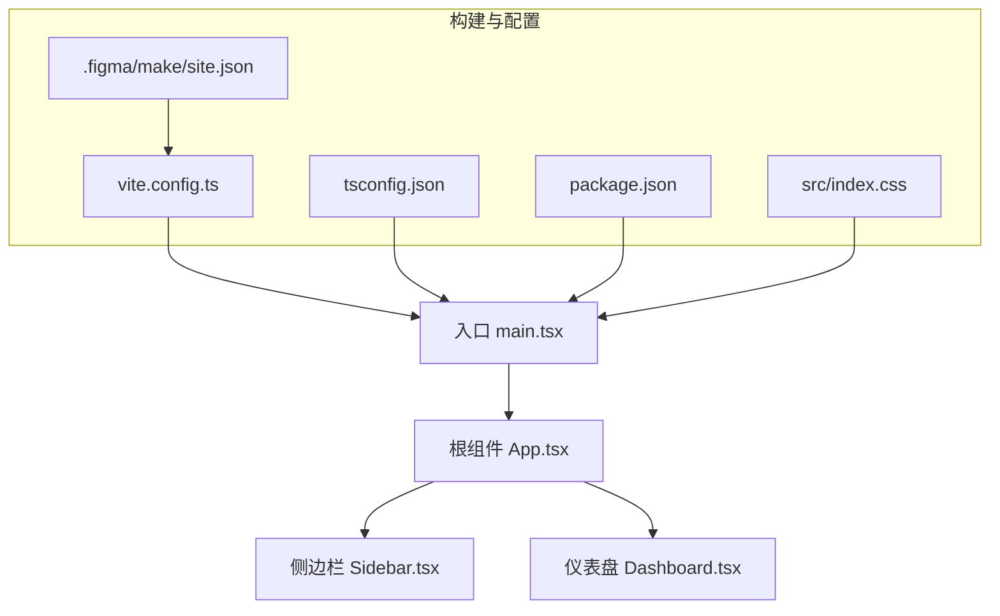
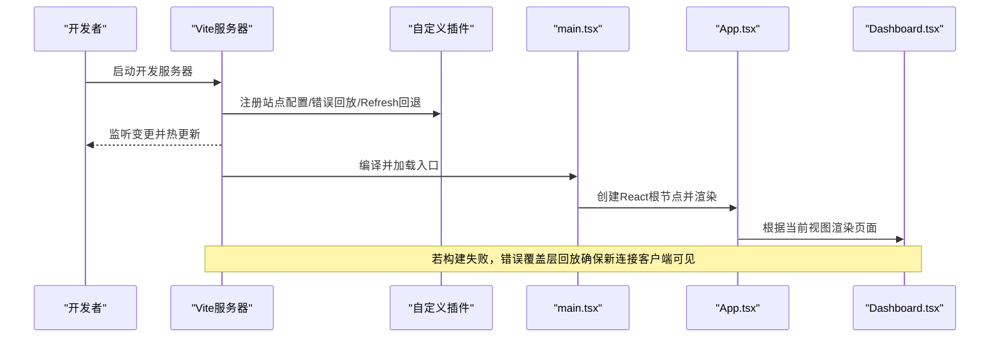
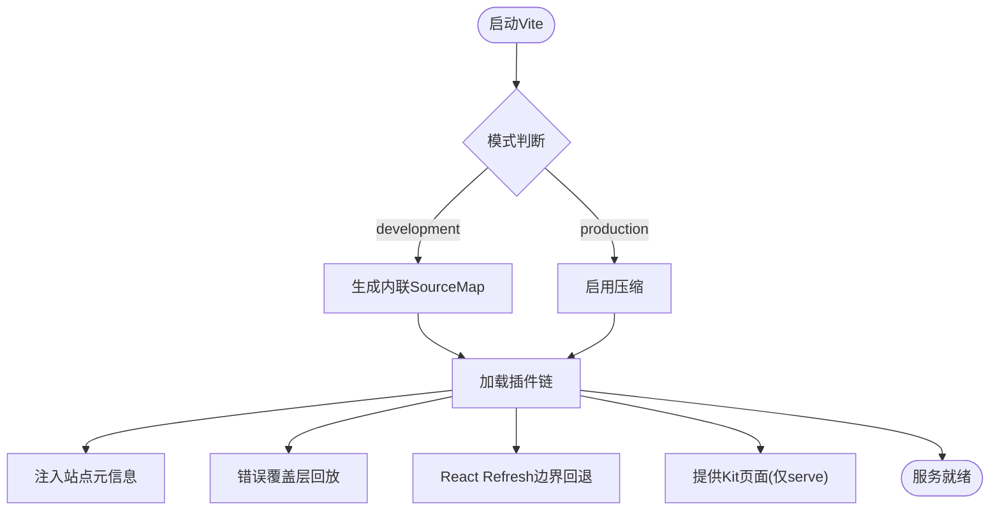
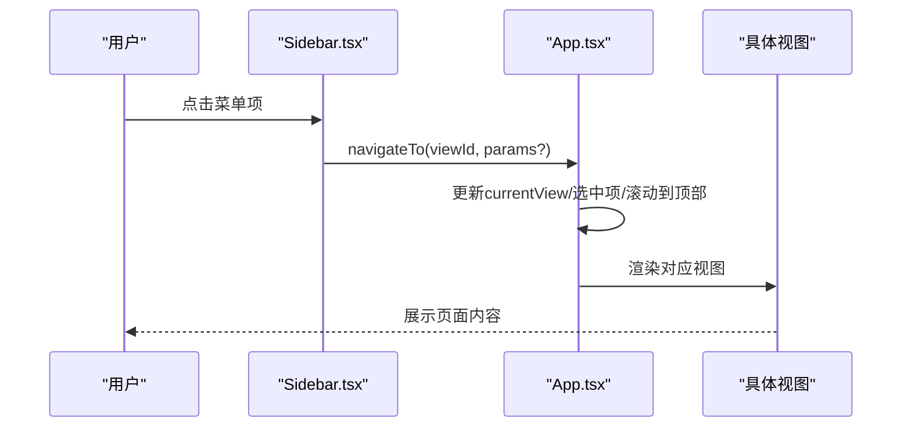
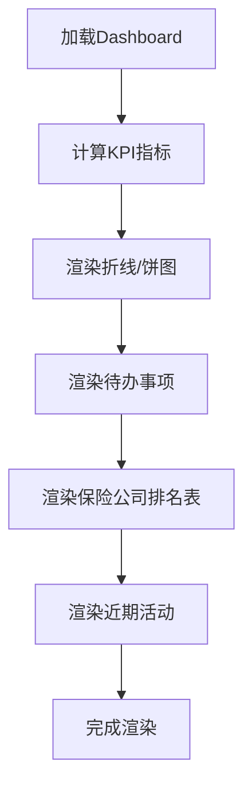
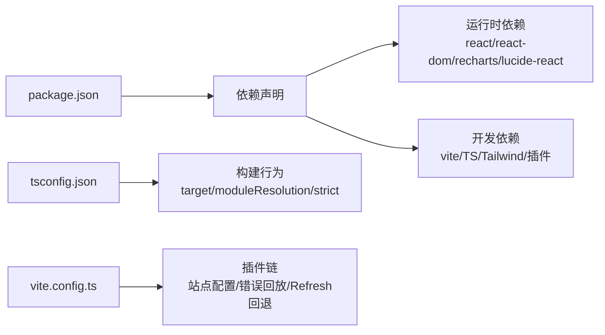

# 故障排除与FAQ

<cite>
**本文引用的文件**
- [package.json](file://产品方案/UI-V1.0/package.json)
- [vite.config.ts](file://产品方案/UI-V1.0/vite.config.ts)
- [tsconfig.json](file://产品方案/UI-V1.0/tsconfig.json)
- [site.json](file://产品方案/UI-V1.0/.figma/make/site.json)
- [index.css](file://产品方案/UI-V1.0/src/index.css)
- [main.tsx](file://产品方案/UI-V1.0/src/main.tsx)
- [App.tsx](file://产品方案/UI-V1.0/src/App.tsx)
- [Sidebar.tsx](file://产品方案/UI-V1.0/src/components/Sidebar.tsx)
- [Dashboard.tsx](file://产品方案/UI-V1.0/src/views/Dashboard.tsx)
</cite>

## 目录
1. [简介](#简介)
2. [项目结构](#项目结构)
3. [核心组件](#核心组件)
4. [架构总览](#架构总览)
5. [详细组件分析](#详细组件分析)
6. [依赖关系分析](#依赖关系分析)
7. [性能注意事项](#性能注意事项)
8. [故障排除指南](#故障排除指南)
9. [结论](#结论)
10. [附录](#附录)

## 简介
本文件面向OverInsurData平台（UI-V1.0）的开发者与维护者，聚焦开发、构建与运行阶段的常见问题与解决方案。内容涵盖：
- 环境配置问题（端口、路径、环境变量）
- 构建错误（Vite/React/Tailwind/TypeScript）
- 运行时异常（HMR、路由、样式与资源加载）
- 性能问题排查（渲染、图表、样式计算）
- 兼容性问题（浏览器、Node版本、第三方库）

目标是帮助快速定位并修复问题，提升开发与交付效率。

## 项目结构
本项目为基于Vite + React + TypeScript的前端应用，采用Tailwind CSS进行样式管理，并通过自定义Vite插件增强站点元信息注入、错误覆盖层回放与React Refresh边界回退等能力。入口由main.tsx挂载App组件，App负责视图路由与全局状态，侧边栏与顶部栏提供导航与上下文操作。

图示来源
- [main.tsx:1-11](file://产品方案/UI-V1.0/src/main.tsx#L1-L11)
- [App.tsx:1-123](file://产品方案/UI-V1.0/src/App.tsx#L1-L123)
- [Sidebar.tsx:1-203](file://产品方案/UI-V1.0/src/components/Sidebar.tsx#L1-L203)
- [Dashboard.tsx:1-348](file://产品方案/UI-V1.0/src/views/Dashboard.tsx#L1-L348)
- [vite.config.ts:1-357](file://产品方案/UI-V1.0/vite.config.ts#L1-L357)
- [tsconfig.json:1-24](file://产品方案/UI-V1.0/tsconfig.json#L1-L24)
- [package.json:1-30](file://产品方案/UI-V1.0/package.json#L1-L30)
- [site.json:1-10](file://产品方案/UI-V1.0/.figma/make/site.json#L1-L10)
- [index.css:1-361](file://产品方案/UI-V1.0/src/index.css#L1-L361)

章节来源
- [package.json:1-30](file://产品方案/UI-V1.0/package.json#L1-L30)
- [vite.config.ts:1-357](file://产品方案/UI-V1.0/vite.config.ts#L1-L357)
- [tsconfig.json:1-24](file://产品方案/UI-V1.0/tsconfig.json#L1-L24)
- [site.json:1-10](file://产品方案/UI-V1.0/.figma/make/site.json#L1-L10)
- [index.css:1-361](file://产品方案/UI-V1.0/src/index.css#L1-L361)
- [main.tsx:1-11](file://产品方案/UI-V1.0/src/main.tsx#L1-L11)
- [App.tsx:1-123](file://产品方案/UI-V1.0/src/App.tsx#L1-L123)
- [Sidebar.tsx:1-203](file://产品方案/UI-V1.0/src/components/Sidebar.tsx#L1-L203)
- [Dashboard.tsx:1-348](file://产品方案/UI-V1.0/src/views/Dashboard.tsx#L1-L348)

## 核心组件
- 应用入口与挂载：main.tsx使用React StrictMode挂载根组件，确保严格模式下的额外检查。
- 根组件与路由：App.tsx维护当前视图与选中项状态，通过switch渲染不同页面；提供统一的导航函数navigateTo。
- 侧边栏：Sidebar.tsx定义可折叠的导航分组与高亮逻辑，承载业务模块入口。
- 仪表盘：Dashboard.tsx展示KPI、趋势图、市场份额饼图、待办事项与近期活动，依赖recharts与mock数据。

章节来源
- [main.tsx:1-11](file://产品方案/UI-V1.0/src/main.tsx#L1-L11)
- [App.tsx:1-123](file://产品方案/UI-V1.0/src/App.tsx#L1-L123)
- [Sidebar.tsx:1-203](file://产品方案/UI-V1.0/src/components/Sidebar.tsx#L1-L203)
- [Dashboard.tsx:1-348](file://产品方案/UI-V1.0/src/views/Dashboard.tsx#L1-L348)

## 架构总览
下图展示了从入口到视图渲染的关键流程，以及Vite构建与插件对开发体验的影响。

图示来源
- [vite.config.ts:1-357](file://产品方案/UI-V1.0/vite.config.ts#L1-L357)
- [main.tsx:1-11](file://产品方案/UI-V1.0/src/main.tsx#L1-L11)
- [App.tsx:1-123](file://产品方案/UI-V1.0/src/App.tsx#L1-L123)
- [Dashboard.tsx:1-348](file://产品方案/UI-V1.0/src/views/Dashboard.tsx#L1-L348)

## 详细组件分析

### 构建与开发服务器（Vite）
- 基础路径与环境变量：base支持通过FIGMA_PUBLIC_URL设置部署前缀；端口通过PORT环境变量控制，默认8443。
- SourceMap与压缩：开发模式内联SourceMap，生产模式关闭并启用压缩。
- 插件体系：
  - 站点配置：将.site.json中的标题、描述、robots、图标、OpenGraph、Google Analytics、无障碍跳过链接等注入HTML。
  - 错误覆盖层回放：捕获最后一次错误并在新WebSocket连接时重放，避免预览iframe重载后丢失错误提示。
  - React Refresh边界回退：当模块不再包含React Refresh边界时触发全量刷新，避免旧树残留。
  - Figma Kit页面：仅在serve模式下提供虚拟故事页面，供设计工具动态导入。

图示来源
- [vite.config.ts:1-357](file://产品方案/UI-V1.0/vite.config.ts#L1-L357)
- [site.json:1-10](file://产品方案/UI-V1.0/.figma/make/site.json#L1-L10)

章节来源
- [vite.config.ts:1-357](file://产品方案/UI-V1.0/vite.config.ts#L1-L357)
- [site.json:1-10](file://产品方案/UI-V1.0/.figma/make/site.json#L1-L10)

### 应用路由与视图切换
- 状态管理：App.tsx使用useState维护currentView与选中项；navigateTo统一处理参数与滚动位置重置。
- 视图映射：switch分支对应各业务视图，未匹配时降级至占位视图。
- 模态框：禁用确认与产品状态变更通过集中状态控制显示。

图示来源
- [App.tsx:1-123](file://产品方案/UI-V1.0/src/App.tsx#L1-L123)
- [Sidebar.tsx:1-203](file://产品方案/UI-V1.0/src/components/Sidebar.tsx#L1-L203)

章节来源
- [App.tsx:1-123](file://产品方案/UI-V1.0/src/App.tsx#L1-L123)
- [Sidebar.tsx:1-203](file://产品方案/UI-V1.0/src/components/Sidebar.tsx#L1-L203)

### 仪表盘与图表渲染
- KPI卡片：聚合mock数据计算总额、保单数、渠道数与佣金收入。
- 图表：使用recharts绘制折线图与饼图，含自定义Tooltip与颜色映射。
- 交互：筛选器、导出按钮与跳转至列表页。

图示来源
- [Dashboard.tsx:1-348](file://产品方案/UI-V1.0/src/views/Dashboard.tsx#L1-L348)

章节来源
- [Dashboard.tsx:1-348](file://产品方案/UI-V1.0/src/views/Dashboard.tsx#L1-L348)

## 依赖关系分析
- 运行时依赖：react、react-dom、recharts、lucide-react。
- 开发依赖：vite、@vitejs/plugin-react、tailwindcss、@tailwindcss/vite、typescript、@types/*、oxfmt。
- 构建配置：TS目标ES2020，模块解析bundler，开启strict与noFallthroughCasesInSwitch；baseUrl与paths别名@指向src。

图示来源
- [package.json:1-30](file://产品方案/UI-V1.0/package.json#L1-L30)
- [tsconfig.json:1-24](file://产品方案/UI-V1.0/tsconfig.json#L1-L24)
- [vite.config.ts:1-357](file://产品方案/UI-V1.0/vite.config.ts#L1-L357)

章节来源
- [package.json:1-30](file://产品方案/UI-V1.0/package.json#L1-L30)
- [tsconfig.json:1-24](file://产品方案/UI-V1.0/tsconfig.json#L1-L24)
- [vite.config.ts:1-357](file://产品方案/UI-V1.0/vite.config.ts#L1-L357)

## 性能注意事项
- 图表大数据量：Dashboard中大量recharts渲染可能引起卡顿，建议分页或虚拟化、减少tooltip计算、按需渲染。
- 样式与玻璃效果：大量backdrop-filter与阴影在低端设备上可能影响性能，可按需降级或减少层级。
- 热更新与全量刷新：当模块失去React Refresh边界时会触发full-reload，频繁重构可能导致体验下降，建议保持组件边界稳定。
- SourceMap与体积：开发模式内联SourceMap增大内存占用，生产模式应关闭并启用压缩以减小包体。

[本节为通用指导，不直接分析具体文件]

## 故障排除指南

### 环境与启动问题
- 端口冲突或无法访问
  - 现象：启动时报端口占用或外部无法访问。
  - 排查：检查PORT环境变量与server.preview.port配置；确认防火墙与容器端口映射。
  - 解决：设置PORT或使用默认8443；如需外网访问，确保host为0.0.0.0且端口开放。
  - 参考
    - [vite.config.ts:32-41](file://产品方案/UI-V1.0/vite.config.ts#L32-L41)
- 部署路径不正确
  - 现象：静态资源404或样式脚本加载失败。
  - 排查：检查FIGMA_PUBLIC_URL是否设置；确认base前缀与实际部署路径一致。
  - 解决：设置FIGMA_PUBLIC_URL为部署域名前缀，如https://example.com/app。
  - 参考
    - [vite.config.ts:14](file://产品方案/UI-V1.0/vite.config.ts#L14)

章节来源
- [vite.config.ts:32-41](file://产品方案/UI-V1.0/vite.config.ts#L32-L41)
- [vite.config.ts:14](file://产品方案/UI-V1.0/vite.config.ts#L14)

### 构建错误
- TypeScript类型错误
  - 现象：构建时报类型不匹配或属性不存在。
  - 排查：检查tsconfig.strict与noFallthroughCasesInSwitch；核对组件props与接口定义。
  - 解决：修正类型定义或放宽必要时的类型约束；确保import路径与别名@正确。
  - 参考
    - [tsconfig.json:1-24](file://产品方案/UI-V1.0/tsconfig.json#L1-L24)
- Tailwind样式未生效
  - 现象：类名无效或主题变量缺失。
  - 排查：确认已引入tailwindcss与@tailwindcss/vite；检查CSS中@theme变量与类名拼写。
  - 解决：安装并配置Tailwind；清理缓存后重试。
  - 参考
    - [vite.config.ts:19-21](file://产品方案/UI-V1.0/vite.config.ts#L19-L21)
    - [index.css:1-361](file://产品方案/UI-V1.0/src/index.css#L1-L361)

章节来源
- [tsconfig.json:1-24](file://产品方案/UI-V1.0/tsconfig.json#L1-L24)
- [vite.config.ts:19-21](file://产品方案/UI-V1.0/vite.config.ts#L19-L21)
- [index.css:1-361](file://产品方案/UI-V1.0/src/index.css#L1-L361)

### 运行时异常
- 页面空白或根节点未找到
  - 现象：打开页面白屏。
  - 排查：确认HTML中存在id为root的元素；检查main.tsx挂载逻辑。
  - 解决：确保index.html包含

；清理DOM缓存。
  - 参考
    - [main.tsx:1-11](file://产品方案/UI-V1.0/src/main.tsx#L1-L11)
- 视图未渲染或路由失效
  - 现象：点击菜单无响应或显示占位页。
  - 排查：检查Sidebar中ViewId枚举与App中switch分支是否一致；确认navigateTo调用参数。
  - 解决：补齐缺失的视图分支或修正ViewId；必要时添加调试日志。
  - 参考
    - [Sidebar.tsx:9-36](file://产品方案/UI-V1.0/src/components/Sidebar.tsx#L9-L36)
    - [App.tsx:25-82](file://产品方案/UI-V1.0/src/App.tsx#L25-L82)

章节来源
- [main.tsx:1-11](file://产品方案/UI-V1.0/src/main.tsx#L1-L11)
- [Sidebar.tsx:9-36](file://产品方案/UI-V1.0/src/components/Sidebar.tsx#L9-L36)
- [App.tsx:25-82](file://产品方案/UI-V1.0/src/App.tsx#L25-L82)

### 热更新与错误覆盖层
- 错误覆盖层不显示或重复显示
  - 现象：构建失败但前端无提示，或修复后仍显示旧错误。
  - 排查：确认错误覆盖层回放插件是否生效；检查WebSocket连接与lastError缓存。
  - 解决：重启开发服务器；确保update/full-reload事件能清空缓存。
  - 参考
    - [vite.config.ts:215-256](file://产品方案/UI-V1.0/vite.config.ts#L215-L256)
- React Refresh边界丢失导致界面不更新
  - 现象：修改组件后HMR成功但界面未刷新。
  - 排查：检查transform阶段是否检测到registerExportsForReactRefresh；确认模块是否被替换为重导出。
  - 解决：保持组件内部实现而非仅重导出；必要时触发全量刷新。
  - 参考
    - [vite.config.ts:258-296](file://产品方案/UI-V1.0/vite.config.ts#L258-L296)

章节来源
- [vite.config.ts:215-256](file://产品方案/UI-V1.0/vite.config.ts#L215-L256)
- [vite.config.ts:258-296](file://产品方案/UI-V1.0/vite.config.ts#L258-L296)

### 站点元信息与SEO
- robots.txt未生效或搜索引擎索引异常
  - 现象：robots.txt请求返回空或未被注入meta noindex。
  - 排查：检查site.json中robots.index配置；确认中间件与generateBundle逻辑。
  - 解决：设置robots.index为false以禁止索引；验证生成的robots.txt与meta标签。
  - 参考
    - [site.json:1-10](file://产品方案/UI-V1.0/.figma/make/site.json#L1-L10)
    - [vite.config.ts:94-114](file://产品方案/UI-V1.0/vite.config.ts#L94-L114)
    - [vite.config.ts:130-132](file://产品方案/UI-V1.0/vite.config.ts#L130-L132)

章节来源
- [site.json:1-10](file://产品方案/UI-V1.0/.figma/make/site.json#L1-L10)
- [vite.config.ts:94-114](file://产品方案/UI-V1.0/vite.config.ts#L94-L114)
- [vite.config.ts:130-132](file://产品方案/UI-V1.0/vite.config.ts#L130-L132)

### 性能问题排查
- 仪表盘渲染缓慢
  - 现象：图表切换或数据量大时卡顿。
  - 排查：检查recharts数据规模与Tooltip计算；评估backdrop-filter与阴影开销。
  - 解决：分页或虚拟列表；简化复杂样式；按需渲染图表区域。
  - 参考
    - [Dashboard.tsx:1-348](file://产品方案/UI-V1.0/src/views/Dashboard.tsx#L1-L348)
    - [index.css:64-96](file://产品方案/UI-V1.0/src/index.css#L64-L96)
- 全量刷新频繁
  - 现象：修改组件后出现full-reload。
  - 排查：确认模块是否仍保留React Refresh边界；避免仅重导出的模式。
  - 解决：调整组件结构以保持边界；减少不必要的重构。
  - 参考
    - [vite.config.ts:258-296](file://产品方案/UI-V1.0/vite.config.ts#L258-L296)

章节来源
- [Dashboard.tsx:1-348](file://产品方案/UI-V1.0/src/views/Dashboard.tsx#L1-L348)
- [index.css:64-96](file://产品方案/UI-V1.0/src/index.css#L64-L96)
- [vite.config.ts:258-296](file://产品方案/UI-V1.0/vite.config.ts#L258-L296)

### 兼容性问题的解决方案
- Node版本与包管理器
  - 现象：安装依赖或构建失败。
  - 排查：检查Node版本与pnpm/yarn/npm一致性；确认scripts与依赖版本。
  - 解决：升级Node至兼容版本；锁定依赖版本；清理node_modules后重装。
  - 参考
    - [package.json:1-30](file://产品方案/UI-V1.0/package.json#L1-L30)
- 浏览器兼容
  - 现象：样式或API在某些浏览器异常。
  - 排查：检查polyfill与CSS特性（如backdrop-filter）；确认TS目标与lib配置。
  - 解决：降级或添加polyfill；调整target/lib以满足目标浏览器。
  - 参考
    - [tsconfig.json:1-24](file://产品方案/UI-V1.0/tsconfig.json#L1-L24)
    - [index.css:64-96](file://产品方案/UI-V1.0/src/index.css#L64-L96)

章节来源
- [package.json:1-30](file://产品方案/UI-V1.0/package.json#L1-L30)
- [tsconfig.json:1-24](file://产品方案/UI-V1.0/tsconfig.json#L1-L24)
- [index.css:64-96](file://产品方案/UI-V1.0/src/index.css#L64-L96)

## 结论
通过对Vite构建、应用路由、样式与图表渲染的深入分析，本文提供了针对环境配置、构建错误、运行时异常、性能与兼容性问题的系统化排查方法与修复步骤。建议在开发中结合错误覆盖层回放与React Refresh边界回退机制，快速定位问题；在生产环境中关注包体积与渲染性能，合理配置SourceMap与压缩策略。

[本节为总结性内容，不直接分析具体文件]

## 附录
- 常用命令
  - 开发：npm run dev / pnpm dev
  - 构建：npm run build / pnpm build
  - 预览：npm run preview / pnpm preview
  - 格式化：npm run format / pnpm format
- 关键环境变量
  - PORT：开发/预览端口，默认8443
  - FIGMA_PUBLIC_URL：部署基础路径前缀
- 参考文件
  - [package.json:6-11](file://产品方案/UI-V1.0/package.json#L6-L11)
  - [vite.config.ts:32-41](file://产品方案/UI-V1.0/vite.config.ts#L32-L41)
  - [vite.config.ts:14](file://产品方案/UI-V1.0/vite.config.ts#L14)

章节来源
- [package.json:6-11](file://产品方案/UI-V1.0/package.json#L6-L11)
- [vite.config.ts:32-41](file://产品方案/UI-V1.0/vite.config.ts#L32-L41)
- [vite.config.ts:14](file://产品方案/UI-V1.0/vite.config.ts#L14)