# 业务数据模型

<cite>
**本文引用的文件**
- [channelHierarchyData.ts](file://产品方案/UI-V1.0/src/data/channelHierarchyData.ts)
- [channelMasterData.ts](file://产品方案/UI-V1.0/src/data/channelMasterData.ts)
- [onboardingData.ts](file://产品方案/UI-V1.0/src/data/onboardingData.ts)
- [appointmentComplianceData.ts](file://产品方案/UI-V1.0/src/data/appointmentComplianceData.ts)
- [insurerAnalyticsData.ts](file://产品方案/UI-V1.0/src/data/insurerAnalyticsData.ts)
- [cooperationData.ts](file://产品方案/UI-V1.0/src/data/cooperationData.ts)
- [financeData.ts](file://产品方案/UI-V1.0/src/data/financeData.ts)
- [insurerDetails.ts](file://产品方案/UI-V1.0/src/data/insurerDetails.ts)
- [productDetails.ts](file://产品方案/UI-V1.0/src/data/productDetails.ts)
</cite>

## 目录
1. [引言](#引言)
2. [项目结构](#项目结构)
3. [核心组件](#核心组件)
4. [架构总览](#架构总览)
5. [详细组件分析](#详细组件分析)
6. [依赖关系分析](#依赖关系分析)
7. [性能与可扩展性](#性能与可扩展性)
8. [故障排查指南](#故障排查指南)
9. [结论](#结论)
10. [附录：实体关系图](#附录实体关系图)

## 引言
本文件面向OverInsurData平台的业务数据模型，围绕渠道层级结构、渠道主数据、入驻流程数据、合规管理数据与保险分析数据五大模块进行系统化说明。文档聚焦实体间关系映射、数据流转模式、业务规则约束与异常处理机制，并给出复杂场景下的建模考虑（多级渠道、动态状态转换、关联数据管理等）以及扩展与定制的最佳实践。

## 项目结构
平台以“数据即模型”的方式组织在UI-V1.0的data目录下，每个TS文件承载一个业务域的数据类型定义与示例数据，便于前端展示与校验逻辑复用。主要文件职责如下：
- 渠道层级：渠道节点、层级关系、待变更、白标配置、团队绩效汇总
- 渠道主数据：机构、代理人、资质文件、变更历史、导入结果
- 入驻流程：申请、步骤流水线、资料审核、NIPR验证、背景调查、E&O、电子合同、培训认证、账号开通
- 合规管理：Appointment记录、NIPR牌照、合规拦截日志、合规规则、OFAC筛查、合规报告
- 保险分析：保险公司KPI、月度保费趋势、产品表现、区域表现、渠道贡献、赔付率与续保率
- 合作与结算：合作关系、合同、结算参数、联系人、续约管理、产品接入
- 财务对账：佣金账单解析、行项目匹配、差异处理、结算周期、保费对账、模板与结算历史
- 保险公司详情：变更记录、文档、联系人、重复分组、州列表与评级枚举
- 产品详情：费率计划、州启用、核保规则、培训材料、产品表现

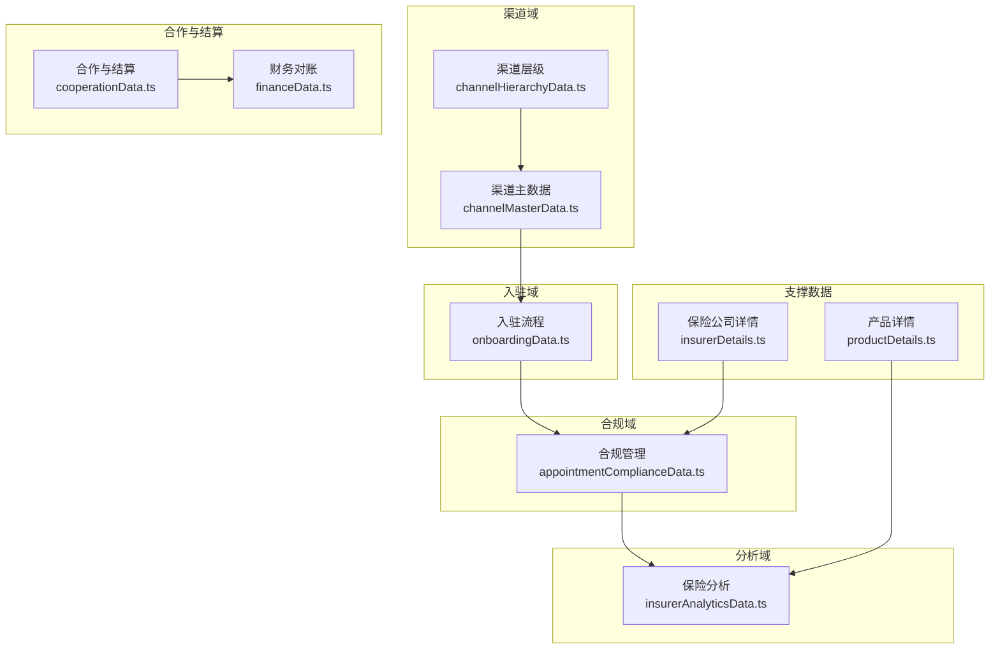

图表来源
- [channelHierarchyData.ts:1-261](file://产品方案/UI-V1.0/src/data/channelHierarchyData.ts#L1-L261)
- [channelMasterData.ts:1-449](file://产品方案/UI-V1.0/src/data/channelMasterData.ts#L1-L449)
- [onboardingData.ts:1-528](file://产品方案/UI-V1.0/src/data/onboardingData.ts#L1-L528)
- [appointmentComplianceData.ts:1-200](file://产品方案/UI-V1.0/src/data/appointmentComplianceData.ts#L1-L200)
- [insurerAnalyticsData.ts:1-275](file://产品方案/UI-V1.0/src/data/insurerAnalyticsData.ts#L1-L275)
- [cooperationData.ts:1-422](file://产品方案/UI-V1.0/src/data/cooperationData.ts#L1-L422)
- [financeData.ts:1-273](file://产品方案/UI-V1.0/src/data/financeData.ts#L1-L273)
- [insurerDetails.ts:1-140](file://产品方案/UI-V1.0/src/data/insurerDetails.ts#L1-L140)
- [productDetails.ts:1-329](file://产品方案/UI-V1.0/src/data/productDetails.ts#L1-L329)

章节来源
- [channelHierarchyData.ts:1-261](file://产品方案/UI-V1.0/src/data/channelHierarchyData.ts#L1-L261)
- [channelMasterData.ts:1-449](file://产品方案/UI-V1.0/src/data/channelMasterData.ts#L1-L449)
- [onboardingData.ts:1-528](file://产品方案/UI-V1.0/src/data/onboardingData.ts#L1-L528)
- [appointmentComplianceData.ts:1-200](file://产品方案/UI-V1.0/src/data/appointmentComplianceData.ts#L1-L200)
- [insurerAnalyticsData.ts:1-275](file://产品方案/UI-V1.0/src/data/insurerAnalyticsData.ts#L1-L275)
- [cooperationData.ts:1-422](file://产品方案/UI-V1.0/src/data/cooperationData.ts#L1-L422)
- [financeData.ts:1-273](file://产品方案/UI-V1.0/src/data/financeData.ts#L1-L273)
- [insurerDetails.ts:1-140](file://产品方案/UI-V1.0/src/data/insurerDetails.ts#L1-L140)
- [productDetails.ts:1-329](file://产品方案/UI-V1.0/src/data/productDetails.ts#L1-L329)

## 核心组件
- 渠道层级结构：支持平台-大区-代理机构-分支机构-经纪人-子代理的多级树形结构；节点具备多父节点能力与主次上级区分；关系包含分成比例、生效/终止时间、审批人、变更历史；提供待变更工作流与白标配置。
- 渠道主数据：机构与代理人主数据，含执照州、税务信息、合同、业绩指标、标签；资质文件按类别与有效期管理；变更历史可追溯。
- 入驻流程：端到端流水线（申请-资料审核-NIPR-背调-E&O-合同-Appointment-账号-培训-终审），每步可独立推进，支持补充材料与驳回原因。
- 合规管理：Appointment生命周期与到期预警；NIPR牌照有效性检查；出单前拦截规则（Appointment/牌照/OFAC/渠道状态/州授权）；OFAC筛查与人工复核；合规报告生成。
- 保险分析：保险公司KPI、月度保费趋势、产品表现、区域表现、渠道贡献、赔付率与续保率趋势、续保队列。
- 合作与结算：合作关系、合同、结算参数、联系人、续约管理、产品接入进度。
- 财务对账：账单导入与解析、行项目匹配、差异分类与处理、结算周期与支付、保费对账、解析模板与结算历史。
- 保险公司详情：变更记录、文档、联系人、重复分组、州列表与评级枚举。
- 产品详情：费率计划、州启用、核保规则、培训材料、产品表现。

章节来源
- [channelHierarchyData.ts:1-261](file://产品方案/UI-V1.0/src/data/channelHierarchyData.ts#L1-L261)
- [channelMasterData.ts:1-449](file://产品方案/UI-V1.0/src/data/channelMasterData.ts#L1-L449)
- [onboardingData.ts:1-528](file://产品方案/UI-V1.0/src/data/onboardingData.ts#L1-L528)
- [appointmentComplianceData.ts:1-200](file://产品方案/UI-V1.0/src/data/appointmentComplianceData.ts#L1-L200)
- [insurerAnalyticsData.ts:1-275](file://产品方案/UI-V1.0/src/data/insurerAnalyticsData.ts#L1-L275)
- [cooperationData.ts:1-422](file://产品方案/UI-V1.0/src/data/cooperationData.ts#L1-L422)
- [financeData.ts:1-273](file://产品方案/UI-V1.0/src/data/financeData.ts#L1-L273)
- [insurerDetails.ts:1-140](file://产品方案/UI-V1.0/src/data/insurerDetails.ts#L1-L140)
- [productDetails.ts:1-329](file://产品方案/UI-V1.0/src/data/productDetails.ts#L1-L329)

## 架构总览
数据模型以“领域分文件、类型先行”的方式组织，各模块通过ID进行跨域关联：
- 渠道层级与主数据通过ChannelNode.id与ChannelOrg.id/ChannelAgent.orgId建立关联
- 入驻流程通过parentChannelId与渠道节点/机构关联
- 合规管理通过channelId与渠道主数据/层级关联，通过insurerId与保险公司详情关联
- 保险分析通过insurerShort/insurerId与保险公司详情关联，通过channelName/channelId与渠道关联
- 合作与结算通过insurerId与保险公司详情关联
- 财务对账通过insurerId、channelId与渠道/保险公司关联

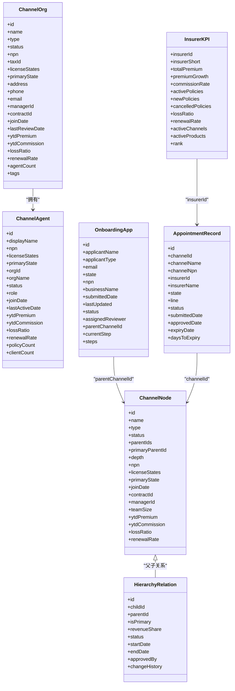

图表来源
- [channelHierarchyData.ts:7-103](file://产品方案/UI-V1.0/src/data/channelHierarchyData.ts#L7-L103)
- [channelMasterData.ts:11-42](file://产品方案/UI-V1.0/src/data/channelMasterData.ts#L11-L42)
- [channelMasterData.ts:165-192](file://产品方案/UI-V1.0/src/data/channelMasterData.ts#L165-L192)
- [onboardingData.ts:11-39](file://产品方案/UI-V1.0/src/data/onboardingData.ts#L11-L39)
- [appointmentComplianceData.ts:3-25](file://产品方案/UI-V1.0/src/data/appointmentComplianceData.ts#L3-L25)
- [insurerAnalyticsData.ts:8-26](file://产品方案/UI-V1.0/src/data/insurerAnalyticsData.ts#L8-L26)

## 详细组件分析

### 渠道层级结构
- 设计要点
  - 节点类型：平台、大区、代理机构、分支机构、经纪人、子代理；深度字段用于快速定位层级
  - 多父节点：parentIds数组支持跨分支协作；primaryParentId明确收入归属与报表口径
  - 关系维度：分成比例、生效/终止时间、审批人、变更历史，满足收益分配与审计需求
  - 白标配置：品牌化门户、移动端、文档模板、API开关等特性控制
  - 团队绩效：聚合到节点维度的保费、佣金、续保率、赔付率、活跃保单、人均保费等
- 关键约束
  - 深度与类型一致性校验（例如深度为4应为agent或sub-agent）
  - 关系状态与节点状态联动（如节点暂停时关系应受限）
  - 分成比例总和约束（同一子节点的多个父节点分成需合理）
- 典型流程
  - 新增/调整/终止关系：提交待变更→审批→生效日期执行→写入变更历史

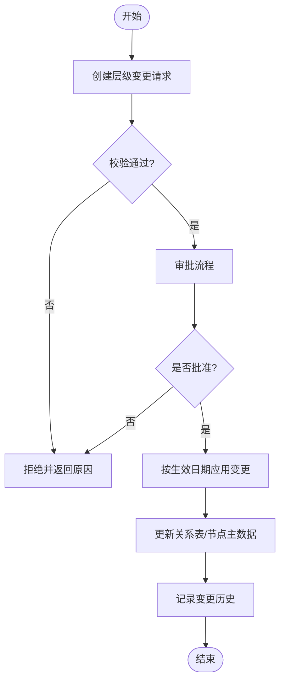

图表来源
- [channelHierarchyData.ts:126-151](file://产品方案/UI-V1.0/src/data/channelHierarchyData.ts#L126-L151)
- [channelHierarchyData.ts:80-122](file://产品方案/UI-V1.0/src/data/channelHierarchyData.ts#L80-L122)
- [channelHierarchyData.ts:155-189](file://产品方案/UI-V1.0/src/data/channelHierarchyData.ts#L155-L189)

章节来源
- [channelHierarchyData.ts:1-261](file://产品方案/UI-V1.0/src/data/channelHierarchyData.ts#L1-L261)

### 渠道主数据
- 设计要点
  - 机构与代理人主数据：统一标识（NPN/Tax ID）、许可州、地址、联系方式、合同、负责人、业绩指标、标签
  - 资质文件：按类别（执照/E&O/W-9/合同/背调/培训/公司注册/其他）管理，支持版本与有效期
  - 变更历史：字段级变更留痕，操作者角色、时间戳、IP、备注
  - 导入校验：批量导入错误明细（行号、字段、消息）
- 关键约束
  - NPN格式校验、州代码标准化
  - 资质到期自动预警与限制出单
  - 机构/代理人状态与资质状态联动
- 典型流程
  - 入驻后主数据创建→资质上传→审核→生效→持续监控到期

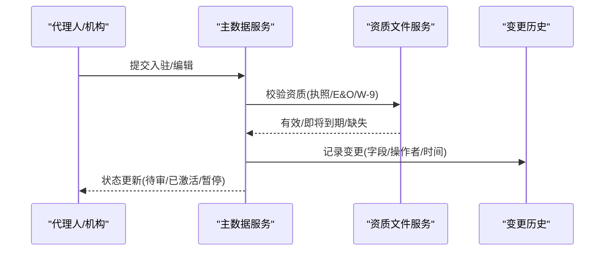

图表来源
- [channelMasterData.ts:11-42](file://产品方案/UI-V1.0/src/data/channelMasterData.ts#L11-L42)
- [channelMasterData.ts:165-192](file://产品方案/UI-V1.0/src/data/channelMasterData.ts#L165-L192)
- [channelMasterData.ts:334-377](file://产品方案/UI-V1.0/src/data/channelMasterData.ts#L334-L377)
- [channelMasterData.ts:381-417](file://产品方案/UI-V1.0/src/data/channelMasterData.ts#L381-L417)
- [channelMasterData.ts:421-435](file://产品方案/UI-V1.0/src/data/channelMasterData.ts#L421-L435)

章节来源
- [channelMasterData.ts:1-449](file://产品方案/UI-V1.0/src/data/channelMasterData.ts#L1-L449)

### 入驻流程数据
- 设计要点
  - 流水线步骤：在线申请、资料审核、NIPR验证、背景调查、E&O验证、合同签署、Appointment、账号开通、培训认证、最终审批
  - 每步状态：pending/in-progress/passed/failed/waived/waiting，支持动作要求与完成时间
  - 外部集成：NIPR验证、背景调查供应商、电子合同平台、培训模块
  - 补充材料：待补充状态与截止日期，逾期关闭
- 关键约束
  - 前置步骤未通过不可进入后续步骤
  - 背调高风险标记直接拒绝
  - E&O证书过期阻止继续
- 典型流程
  - 申请人提交→资料审核→NIPR/背调/E&O并行或串行→合同→Appointment→账号→培训→终审

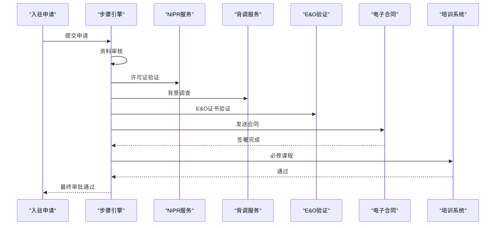

图表来源
- [onboardingData.ts:11-39](file://产品方案/UI-V1.0/src/data/onboardingData.ts#L11-L39)
- [onboardingData.ts:154-165](file://产品方案/UI-V1.0/src/data/onboardingData.ts#L154-L165)
- [onboardingData.ts:204-328](file://产品方案/UI-V1.0/src/data/onboardingData.ts#L204-L328)
- [onboardingData.ts:332-353](file://产品方案/UI-V1.0/src/data/onboardingData.ts#L332-L353)
- [onboardingData.ts:357-386](file://产品方案/UI-V1.0/src/data/onboardingData.ts#L357-L386)
- [onboardingData.ts:390-410](file://产品方案/UI-V1.0/src/data/onboardingData.ts#L390-L410)
- [onboardingData.ts:414-437](file://产品方案/UI-V1.0/src/data/onboardingData.ts#L414-L437)
- [onboardingData.ts:441-463](file://产品方案/UI-V1.0/src/data/onboardingData.ts#L441-L463)
- [onboardingData.ts:467-489](file://产品方案/UI-V1.0/src/data/onboardingData.ts#L467-L489)
- [onboardingData.ts:494-516](file://产品方案/UI-V1.0/src/data/onboardingData.ts#L494-L516)

章节来源
- [onboardingData.ts:1-528](file://产品方案/UI-V1.0/src/data/onboardingData.ts#L1-L528)

### 合规管理数据
- 设计要点
  - Appointment记录：渠道-保险公司-州-业务线四维授权，状态机包含批准/待批/拒绝/过期/终止/审核中，到期天数计算
  - NIPR牌照：牌照类型、州、有效期、CE学分、核验状态
  - 合规拦截：出单前实时拦截，原因包括无Appointment、过期Appointment、无效/过期牌照、OFAC命中、暂停渠道、非授权州
  - OFAC筛查：精确匹配拦截、模糊匹配人工审核
  - 合规报告：Appointment状态、牌照合规、OFAC摘要、拦截日志、续期日历、监管申报
- 关键约束
  - 出单必须满足Appointment有效且未过期
  - 牌照必须在有效期内且状态允许
  - OFAC命中需人工复核，必要时拒绝
- 典型流程
  - 出单请求→合规规则引擎→放行/警告/拦截/转人工→记录日志→生成报告

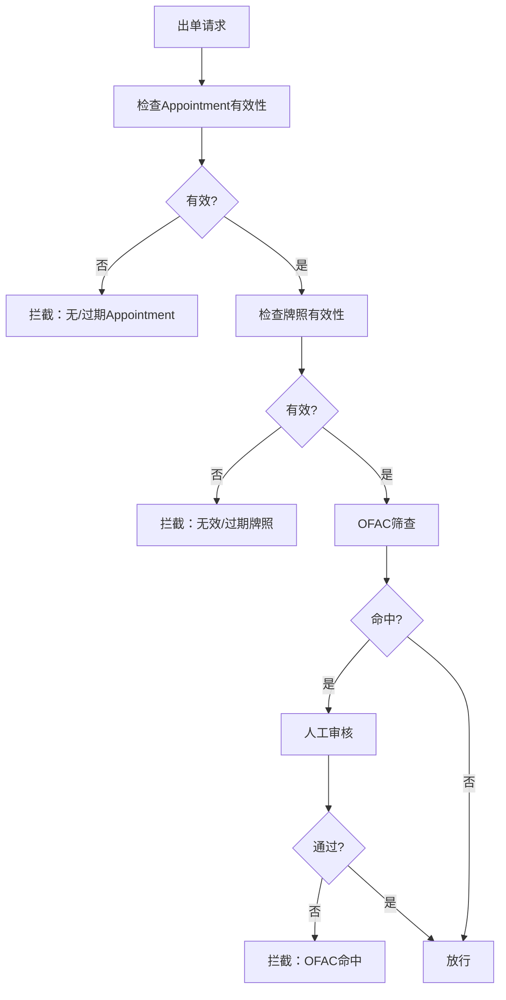

图表来源
- [appointmentComplianceData.ts:3-40](file://产品方案/UI-V1.0/src/data/appointmentComplianceData.ts#L3-L40)
- [appointmentComplianceData.ts:46-77](file://产品方案/UI-V1.0/src/data/appointmentComplianceData.ts#L46-L77)
- [appointmentComplianceData.ts:84-112](file://产品方案/UI-V1.0/src/data/appointmentComplianceData.ts#L84-L112)
- [appointmentComplianceData.ts:116-137](file://产品方案/UI-V1.0/src/data/appointmentComplianceData.ts#L116-L137)
- [appointmentComplianceData.ts:143-168](file://产品方案/UI-V1.0/src/data/appointmentComplianceData.ts#L143-L168)
- [appointmentComplianceData.ts:172-193](file://产品方案/UI-V1.0/src/data/appointmentComplianceData.ts#L172-L193)

章节来源
- [appointmentComplianceData.ts:1-200](file://产品方案/UI-V1.0/src/data/appointmentComplianceData.ts#L1-L200)

### 保险分析数据
- 设计要点
  - 保险公司KPI：保费、增长、佣金、活跃保单、新单、取消、赔付率、续保率、活跃渠道/产品数、排名
  - 月度趋势：按保险公司与产品线统计保费走势
  - 产品表现：保费、增长、保单数、均保、佣金、赔付率、续保率、主力州/渠道
  - 区域表现：州-区域聚合，增长率、赔付率、Top产品/渠道
  - 渠道贡献：渠道层级、保费份额、增长、活跃保险公司/产品、赔付率、续保率
  - 赔付率与续保率：趋势、队列分析、产品维度续保率
- 关键约束
  - 指标口径一致（YTD/滚动月）
  - 区域与州映射固定
  - 产品状态（在售/停售）影响统计
- 典型流程
  - 原始交易→聚合KPI→趋势计算→阈值告警→报表输出

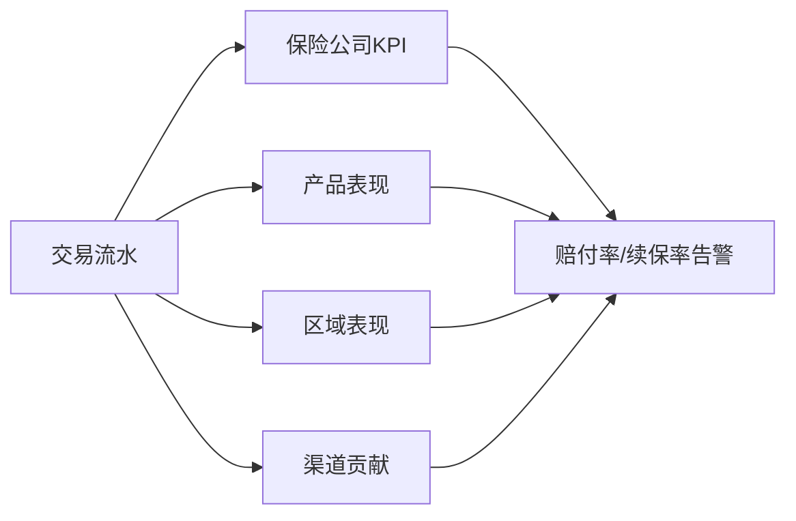

图表来源
- [insurerAnalyticsData.ts:8-35](file://产品方案/UI-V1.0/src/data/insurerAnalyticsData.ts#L8-L35)
- [insurerAnalyticsData.ts:60-87](file://产品方案/UI-V1.0/src/data/insurerAnalyticsData.ts#L60-L87)
- [insurerAnalyticsData.ts:100-146](file://产品方案/UI-V1.0/src/data/insurerAnalyticsData.ts#L100-L146)
- [insurerAnalyticsData.ts:159-186](file://产品方案/UI-V1.0/src/data/insurerAnalyticsData.ts#L159-L186)
- [insurerAnalyticsData.ts:198-227](file://产品方案/UI-V1.0/src/data/insurerAnalyticsData.ts#L198-L227)
- [insurerAnalyticsData.ts:240-275](file://产品方案/UI-V1.0/src/data/insurerAnalyticsData.ts#L240-L275)

章节来源
- [insurerAnalyticsData.ts:1-275](file://产品方案/UI-V1.0/src/data/insurerAnalyticsData.ts#L1-L275)

### 合作与结算数据
- 设计要点
  - 合作关系：类型（全服务/专业/优选/超限额）、范围、地域、佣金层级、负责人、起止时间
  - 合同：主协议、佣金表、数据共享、修订、附加协议、NDA，版本与到期提醒
  - 结算参数：周期、截单日、付款期限、支付方式、币种、账单格式、API开关、对账联系人
  - 联系人：角色、部门、联系方式、首选沟通方式、升级联系人
  - 续约管理：合同/合作到期跟踪、优先级、最后动作
  - 产品接入：产品可用性、技术需求、测试完成度、目标州
- 关键约束
  - 合同到期前预警与自动续约策略
  - 结算周期与支付方法需与对方约定一致
  - 产品接入需先有合作关系与审批
- 典型流程
  - 合作申请→合同签署→结算参数配置→联系人维护→续约管理→产品接入

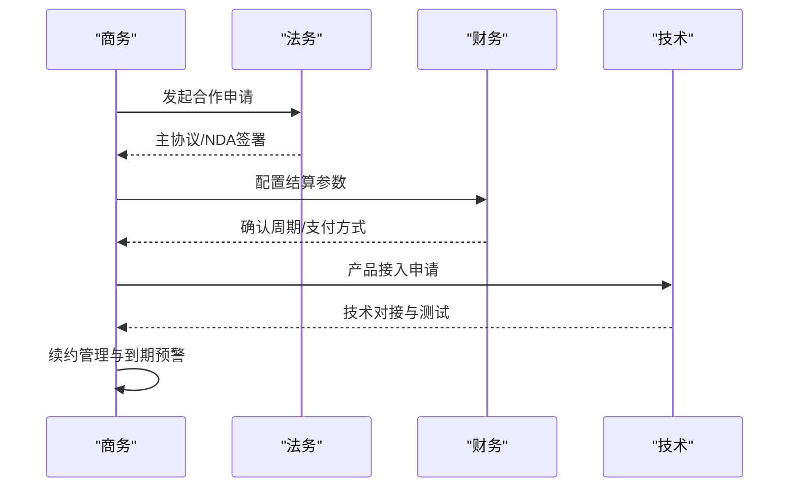

图表来源
- [cooperationData.ts:5-91](file://产品方案/UI-V1.0/src/data/cooperationData.ts#L5-L91)
- [cooperationData.ts:97-183](file://产品方案/UI-V1.0/src/data/cooperationData.ts#L97-L183)
- [cooperationData.ts:187-252](file://产品方案/UI-V1.0/src/data/cooperationData.ts#L187-L252)
- [cooperationData.ts:256-286](file://产品方案/UI-V1.0/src/data/cooperationData.ts#L256-L286)
- [cooperationData.ts:290-342](file://产品方案/UI-V1.0/src/data/cooperationData.ts#L290-L342)
- [cooperationData.ts:348-421](file://产品方案/UI-V1.0/src/data/cooperationData.ts#L348-L421)

章节来源
- [cooperationData.ts:1-422](file://产品方案/UI-V1.0/src/data/cooperationData.ts#L1-L422)

### 财务对账数据
- 设计要点
  - 账单导入：文件格式（CSV/Excel/PDF/EDI）、解析状态、匹配数量、异常计数、差额
  - 行项目匹配：保单号、被保人、渠道、州、业务线、生效日、保费、佣金率/金额、匹配状态（匹配/不匹配/金额差/费率差/重复）
  - 差异处理：差异类型（费率/金额/缺失保单/重复/账单缺项）、状态（开放/审核中/认可/争议/调整/豁免）
  - 结算周期：频率、截止日、付款期限、支付方式、最小结算金额、自动对账/结算、通知提前天数、银行账户
  - 保费对账：应收/实收差异、类型（未到账/多缴/费率错误/取消调整/背书调整）、状态
  - 解析模板：字段映射、成功率和使用次数
  - 结算历史：支付凭证、状态、确认人
- 关键约束
  - 匹配失败需人工介入
  - 差异超过阈值需升级
  - 结算需遵循合同周期与支付条款
- 典型流程
  - 导入账单→解析→匹配→差异处理→对账→结算→归档

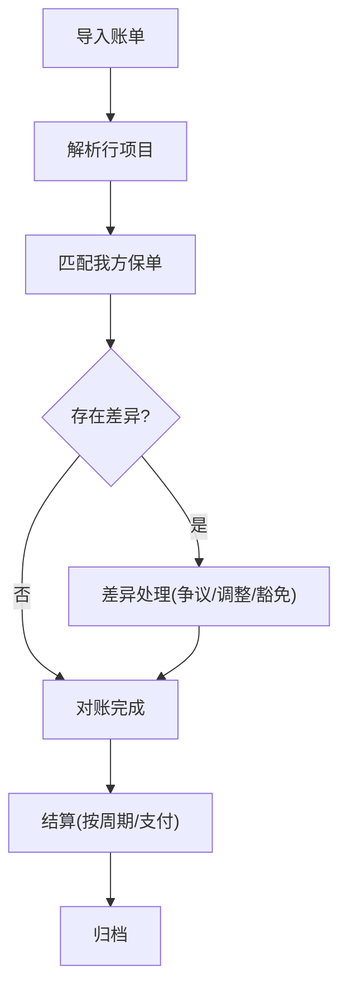

图表来源
- [financeData.ts:5-36](file://产品方案/UI-V1.0/src/data/financeData.ts#L5-L36)
- [financeData.ts:42-72](file://产品方案/UI-V1.0/src/data/financeData.ts#L42-L72)
- [financeData.ts:79-105](file://产品方案/UI-V1.0/src/data/financeData.ts#L79-L105)
- [financeData.ts:112-142](file://产品方案/UI-V1.0/src/data/financeData.ts#L112-L142)
- [financeData.ts:149-196](file://产品方案/UI-V1.0/src/data/financeData.ts#L149-L196)
- [financeData.ts:200-223](file://产品方案/UI-V1.0/src/data/financeData.ts#L200-L223)
- [financeData.ts:227-246](file://产品方案/UI-V1.0/src/data/financeData.ts#L227-L246)

章节来源
- [financeData.ts:1-273](file://产品方案/UI-V1.0/src/data/financeData.ts#L1-L273)

### 保险公司详情与产品详情
- 保险公司详情
  - 变更记录：字段级变更、操作者角色、时间戳、原因、审批
  - 文档：主协议、NDA、DPA、评级报告、州营业执照、佣金补充协议
  - 联系人：客户经理、核保、结算、IT、合规
  - 重复分组：公司名称相似度、NAIC编码、总部城市
  - 州列表与评级枚举：标准化州代码与评级等级
- 产品详情
  - 费率计划：基础费率、最低/最高保费、生效/到期、评分因子、备案状态
  - 州启用：按产品维度启用/待定/停用，附备案编号
  - 核保规则：资格/定价/排除/转介，条件与动作
  - 培训材料：产品指南、费率手册、核保指南、合规、课件、视频、FAQ
  - 产品表现：月度保费、新单、续保、保单数、赔付率、理赔数
- 关键约束
  - 产品州启用需符合备案与监管要求
  - 核保规则优先级与冲突处理
  - 文档到期预警与强制续期
- 典型流程
  - 产品上线→州启用→费率发布→核保规则生效→培训材料分发→表现追踪

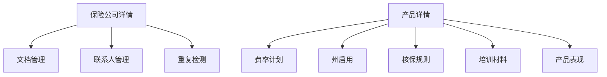

图表来源
- [insurerDetails.ts:1-140](file://产品方案/UI-V1.0/src/data/insurerDetails.ts#L1-L140)
- [productDetails.ts:1-329](file://产品方案/UI-V1.0/src/data/productDetails.ts#L1-L329)

章节来源
- [insurerDetails.ts:1-140](file://产品方案/UI-V1.0/src/data/insurerDetails.ts#L1-L140)
- [productDetails.ts:1-329](file://产品方案/UI-V1.0/src/data/productDetails.ts#L1-L329)

## 依赖关系分析
- 跨域关联
  - 渠道层级与主数据：ChannelNode.id ↔ ChannelOrg.id/ChannelAgent.orgId
  - 入驻流程与渠道：OnboardingApp.parentChannelId ↔ ChannelNode.id
  - 合规管理与渠道/保险公司：AppointmentRecord.channelId/insurerId ↔ ChannelNode/InsurerDetails
  - 保险分析与渠道/保险公司：InsurerKPI.insurerShort ↔ InsurerDetails；ChannelPerf.channelId ↔ ChannelNode
  - 合作与结算与保险公司：CooperationRelationship.insurerId ↔ InsurerDetails
  - 财务对账与渠道/保险公司：CommissionBill.billLineItems.channelId/insurerId ↔ ChannelNode/InsurerDetails
- 耦合与内聚
  - 各模块高内聚（单一职责），低耦合（通过ID关联）
  - 合规规则集中管理，易于扩展与审计
  - 财务对账与结算解耦，支持多种账单格式与支付方式
- 潜在循环依赖
  - 当前模型通过ID引用避免循环；如需双向导航应在服务层实现而非数据层

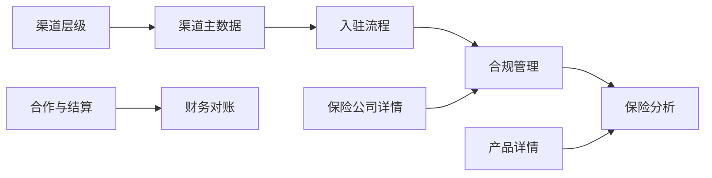

图表来源
- [channelHierarchyData.ts:1-261](file://产品方案/UI-V1.0/src/data/channelHierarchyData.ts#L1-L261)
- [channelMasterData.ts:1-449](file://产品方案/UI-V1.0/src/data/channelMasterData.ts#L1-L449)
- [onboardingData.ts:1-528](file://产品方案/UI-V1.0/src/data/onboardingData.ts#L1-L528)
- [appointmentComplianceData.ts:1-200](file://产品方案/UI-V1.0/src/data/appointmentComplianceData.ts#L1-L200)
- [insurerAnalyticsData.ts:1-275](file://产品方案/UI-V1.0/src/data/insurerAnalyticsData.ts#L1-L275)
- [cooperationData.ts:1-422](file://产品方案/UI-V1.0/src/data/cooperationData.ts#L1-L422)
- [financeData.ts:1-273](file://产品方案/UI-V1.0/src/data/financeData.ts#L1-L273)
- [insurerDetails.ts:1-140](file://产品方案/UI-V1.0/src/data/insurerDetails.ts#L1-L140)
- [productDetails.ts:1-329](file://产品方案/UI-V1.0/src/data/productDetails.ts#L1-L329)

章节来源
- [channelHierarchyData.ts:1-261](file://产品方案/UI-V1.0/src/data/channelHierarchyData.ts#L1-L261)
- [channelMasterData.ts:1-449](file://产品方案/UI-V1.0/src/data/channelMasterData.ts#L1-L449)
- [onboardingData.ts:1-528](file://产品方案/UI-V1.0/src/data/onboardingData.ts#L1-L528)
- [appointmentComplianceData.ts:1-200](file://产品方案/UI-V1.0/src/data/appointmentComplianceData.ts#L1-L200)
- [insurerAnalyticsData.ts:1-275](file://产品方案/UI-V1.0/src/data/insurerAnalyticsData.ts#L1-L275)
- [cooperationData.ts:1-422](file://产品方案/UI-V1.0/src/data/cooperationData.ts#L1-L422)
- [financeData.ts:1-273](file://产品方案/UI-V1.0/src/data/financeData.ts#L1-L273)
- [insurerDetails.ts:1-140](file://产品方案/UI-V1.0/src/data/insurerDetails.ts#L1-L140)
- [productDetails.ts:1-329](file://产品方案/UI-V1.0/src/data/productDetails.ts#L1-L329)

## 性能与可扩展性
- 性能考量
  - 层级树构建：使用childrenMap缓存减少遍历开销
  - 指标聚合：按月/季度预计算KPI与趋势，降低实时计算压力
  - 合规拦截：规则引擎按优先级顺序执行，命中即止，提升响应速度
  - 财务对账：批量解析与匹配，异常行单独处理，避免阻塞整体流程
- 可扩展性建议
  - 渠道层级：支持更多节点类型与自定义属性（如地区细分、产品线专营）
  - 合规规则：规则表达式可配置化，支持热更新与灰度发布
  - 财务对账：新增账单格式模板，支持插件化解析器
  - 保险分析：增加更多维度（客户画像、渠道行为）与预测模型接口
  - 产品详情：引入动态评分因子与A/B测试框架

[本节为通用指导，无需特定文件来源]

## 故障排查指南
- 常见问题与处理
  - 渠道层级关系异常：检查parentIds与primaryParentId一致性，确认关系状态与节点状态联动
  - 入驻流程卡滞：查看当前步骤状态与actionRequired，确认前置步骤是否通过
  - 合规拦截频繁：核对Appointment有效期、牌照状态、OFAC命中结果，必要时人工复核
  - 财务对账差异：定位差异类型（费率/金额/缺失/重复），按状态流转处理（争议/调整/豁免）
  - 产品上线失败：检查州启用状态、费率计划生效日期、核保规则优先级与冲突
- 排错步骤
  - 定位实体ID（渠道/保险公司/产品）
  - 检查相关状态与有效期
  - 查看变更历史与拦截日志
  - 根据规则与模板进行修正
  - 重新触发流程并验证

章节来源
- [channelHierarchyData.ts:126-151](file://产品方案/UI-V1.0/src/data/channelHierarchyData.ts#L126-L151)
- [onboardingData.ts:154-183](file://产品方案/UI-V1.0/src/data/onboardingData.ts#L154-L183)
- [appointmentComplianceData.ts:116-137](file://产品方案/UI-V1.0/src/data/appointmentComplianceData.ts#L116-L137)
- [financeData.ts:79-105](file://产品方案/UI-V1.0/src/data/financeData.ts#L79-L105)
- [productDetails.ts:162-175](file://产品方案/UI-V1.0/src/data/productDetails.ts#L162-L175)

## 结论
OverInsurData的业务数据模型以清晰的领域划分与强类型定义为基础，覆盖渠道层级、主数据、入驻流程、合规管理、保险分析、合作结算与财务对账等核心业务。模型支持多级渠道架构、动态状态转换与关联数据管理，内置完整性校验、业务规则验证与异常处理机制。通过可配置的合规规则、灵活的财务对账模板与可扩展的分析维度，平台具备良好的扩展性与定制化能力，能够支撑复杂保险业务的数字化运营。

[本节为总结，无需特定文件来源]

## 附录：实体关系图
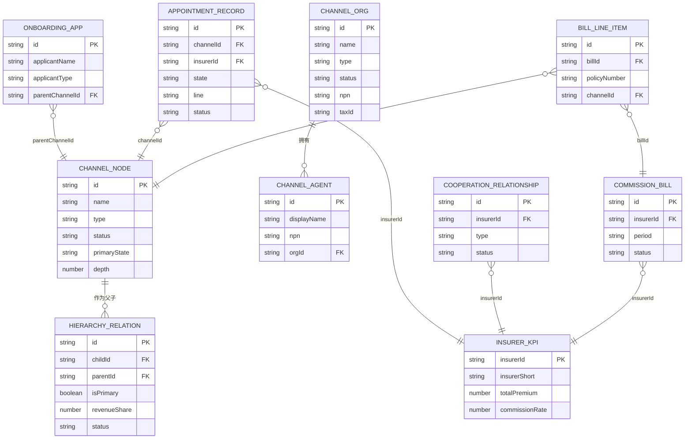

图表来源
- [channelHierarchyData.ts:7-103](file://产品方案/UI-V1.0/src/data/channelHierarchyData.ts#L7-L103)
- [channelMasterData.ts:11-42](file://产品方案/UI-V1.0/src/data/channelMasterData.ts#L11-L42)
- [channelMasterData.ts:165-192](file://产品方案/UI-V1.0/src/data/channelMasterData.ts#L165-L192)
- [onboardingData.ts:11-39](file://产品方案/UI-V1.0/src/data/onboardingData.ts#L11-L39)
- [appointmentComplianceData.ts:3-25](file://产品方案/UI-V1.0/src/data/appointmentComplianceData.ts#L3-L25)
- [insurerAnalyticsData.ts:8-26](file://产品方案/UI-V1.0/src/data/insurerAnalyticsData.ts#L8-L26)
- [cooperationData.ts:5-22](file://产品方案/UI-V1.0/src/data/cooperationData.ts#L5-L22)
- [financeData.ts:5-26](file://产品方案/UI-V1.0/src/data/financeData.ts#L5-L26)
- [financeData.ts:42-62](file://产品方案/UI-V1.0/src/data/financeData.ts#L42-L62)