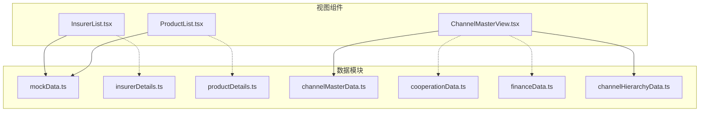
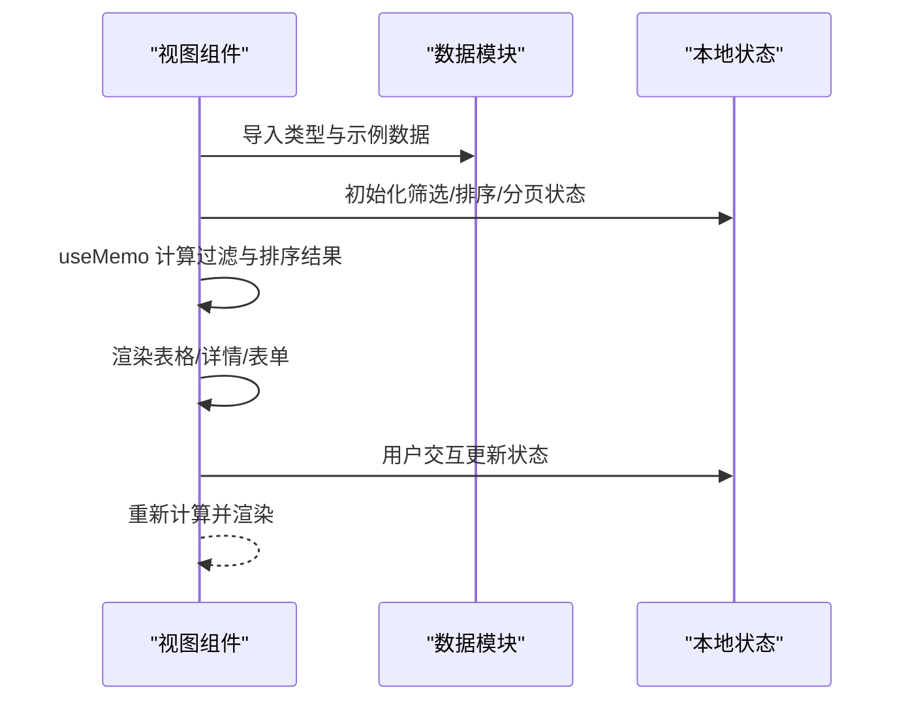
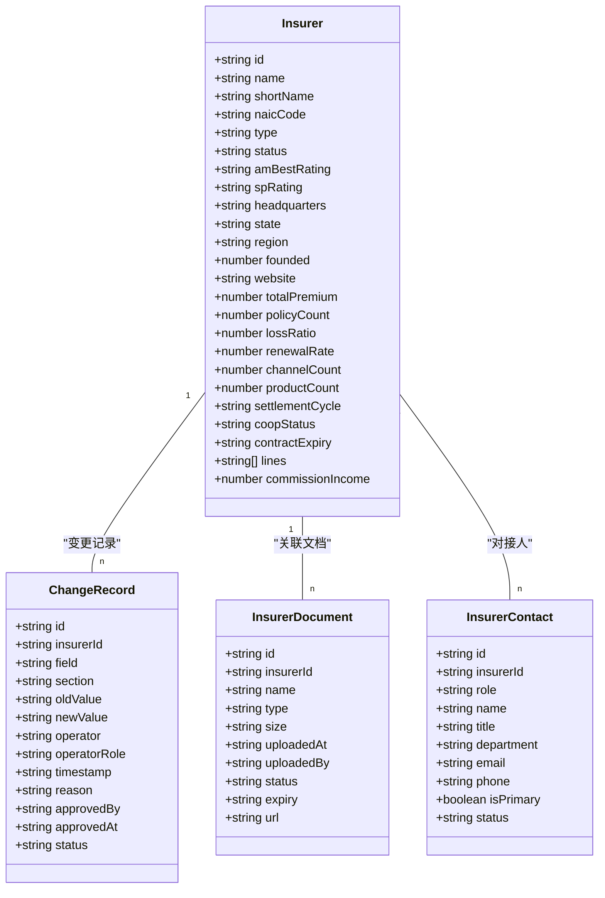
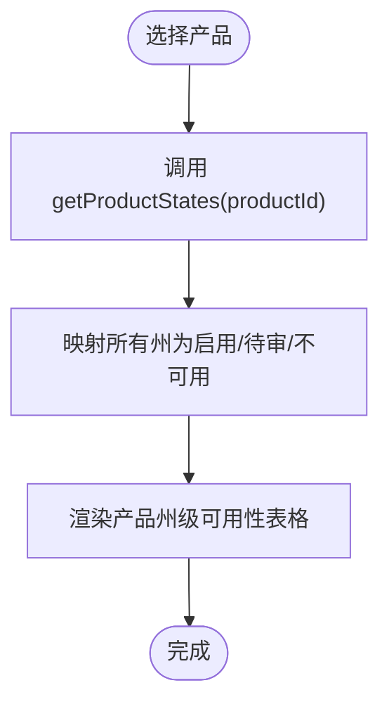
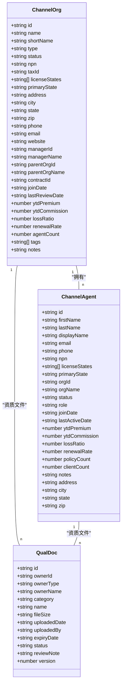
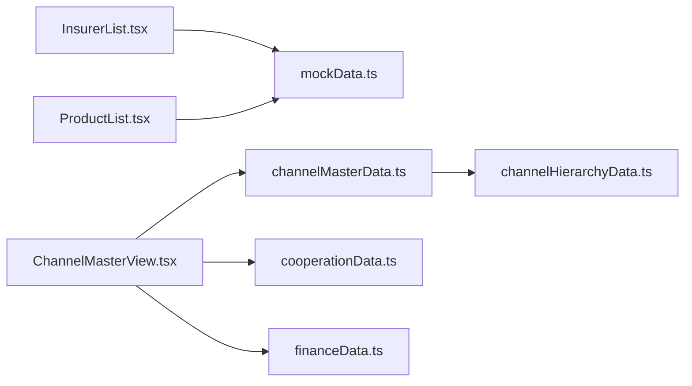

# 数据管理

<cite>
**本文引用的文件**
- [mockData.ts](file://产品设计/UI-V1.0/src/data/mockData.ts)
- [insurerDetails.ts](file://产品设计/UI-V1.0/src/data/insurerDetails.ts)
- [productDetails.ts](file://产品设计/UI-V1.0/src/data/productDetails.ts)
- [channelMasterData.ts](file://产品设计/UI-V1.0/src/data/channelMasterData.ts)
- [cooperationData.ts](file://产品设计/UI-V1.0/src/data/cooperationData.ts)
- [financeData.ts](file://产品设计/UI-V1.0/src/data/financeData.ts)
- [channelHierarchyData.ts](file://产品设计/UI-V1.0/src/data/channelHierarchyData.ts)
- [InsurerList.tsx](file://产品设计/UI-V1.0/src/views/InsurerList.tsx)
- [ProductList.tsx](file://产品设计/UI-V1.0/src/views/ProductList.tsx)
- [ChannelMasterView.tsx](file://产品设计/UI-V1.0/src/views/ChannelMasterView.tsx)
</cite>

## 目录
1. [简介](#简介)
2. [项目结构](#项目结构)
3. [核心组件](#核心组件)
4. [架构总览](#架构总览)
5. [详细组件分析](#详细组件分析)
6. [依赖关系分析](#依赖关系分析)
7. [性能考虑](#性能考虑)
8. [故障排查指南](#故障排查指南)
9. [结论](#结论)
10. [附录](#附录)

## 简介
本文件面向 OverInsurData 平台的数据管理层，聚焦数据类型定义、模拟数据管理策略、数据模型设计与数据验证规则；覆盖保险公司、产品、渠道、合作关系等关键业务实体；说明数据在组件间的传递与状态管理方式；并给出数据持久化方案建议与性能优化策略。文档基于当前前端代码中的 TypeScript 类型与静态数据模块进行梳理，确保读者既能理解整体架构，也能定位到具体实现位置。

## 项目结构
数据层以“按领域划分的静态数据模块 + 视图组件消费”的方式组织：
- 数据模块集中在 src/data 下，每个文件负责一个业务域的类型定义与示例数据（如 mockData、insurerDetails、productDetails、channelMasterData、cooperationData、financeData、channelHierarchyData）。
- 视图组件位于 src/views，通过导入对应数据模块渲染列表、详情、表单与统计面板，并在本地维护筛选、排序、分页、选择等 UI 状态。
- 组件间通过 props 与路由参数传递上下文（如 insurerId、productId），不直接共享全局可变状态。

图表来源
- [InsurerList.tsx:1-360](file://产品设计/UI-V1.0/src/views/InsurerList.tsx#L1-L360)
- [ProductList.tsx:1-243](file://产品设计/UI-V1.0/src/views/ProductList.tsx#L1-L243)
- [ChannelMasterView.tsx:1-800](file://产品设计/UI-V1.0/src/views/ChannelMasterView.tsx#L1-L800)
- [mockData.ts:1-444](file://产品设计/UI-V1.0/src/data/mockData.ts#L1-L444)
- [insurerDetails.ts:1-140](file://产品设计/UI-V1.0/src/data/insurerDetails.ts#L1-L140)
- [productDetails.ts:1-329](file://产品设计/UI-V1.0/src/data/productDetails.ts#L1-L329)
- [channelMasterData.ts:1-449](file://产品设计/UI-V1.0/src/data/channelMasterData.ts#L1-L449)
- [cooperationData.ts:1-422](file://产品设计/UI-V1.0/src/data/cooperationData.ts#L1-L422)
- [financeData.ts:1-273](file://产品设计/UI-V1.0/src/data/financeData.ts#L1-L273)
- [channelHierarchyData.ts:1-261](file://产品设计/UI-V1.0/src/data/channelHierarchyData.ts#L1-L261)

章节来源
- [InsurerList.tsx:1-360](file://产品设计/UI-V1.0/src/views/InsurerList.tsx#L1-L360)
- [ProductList.tsx:1-243](file://产品设计/UI-V1.0/src/views/ProductList.tsx#L1-L243)
- [ChannelMasterView.tsx:1-800](file://产品设计/UI-V1.0/src/views/ChannelMasterView.tsx#L1-L800)

## 核心组件
- 数据模块
  - mockData.ts：定义保险公司、产品、渠道、Appointment 等核心类型与示例数据，并提供格式化函数。
  - insurerDetails.ts：扩展保险公司维度（变更历史、文档、联系人、重复检测分组）及枚举常量。
  - productDetails.ts：产品费率计划、州级可用性、核保规则、培训资料、产品表现数据与工具函数。
  - channelMasterData.ts：渠道主数据（机构、代理人、资质文件、变更历史、导入结果、统计）。
  - cooperationData.ts：合作关系、合同、结算参数、联系人、续约管理与产品接入跟踪。
  - financeData.ts：佣金账单导入、解析、对账差异、结算周期、保费对账、模板与结算历史。
  - channelHierarchyData.ts：渠道层级节点、关系、待审批变更、白标配置与团队绩效汇总。
- 视图组件
  - InsurerList.tsx：保险公司列表的搜索、过滤、排序、分页、批量操作与导出。
  - ProductList.tsx：产品列表的搜索、过滤、排序、批量上架/下架与详情跳转。
  - ChannelMasterView.tsx：渠道主数据的综合视图（机构列表与详情抽屉、代理人、文件、变更历史、导入与统计）。

章节来源
- [mockData.ts:1-444](file://产品设计/UI-V1.0/src/data/mockData.ts#L1-L444)
- [insurerDetails.ts:1-140](file://产品设计/UI-V1.0/src/data/insurerDetails.ts#L1-L140)
- [productDetails.ts:1-329](file://产品设计/UI-V1.0/src/data/productDetails.ts#L1-L329)
- [channelMasterData.ts:1-449](file://产品设计/UI-V1.0/src/data/channelMasterData.ts#L1-L449)
- [cooperationData.ts:1-422](file://产品设计/UI-V1.0/src/data/cooperationData.ts#L1-L422)
- [financeData.ts:1-273](file://产品设计/UI-V1.0/src/data/financeData.ts#L1-L273)
- [channelHierarchyData.ts:1-261](file://产品设计/UI-V1.0/src/data/channelHierarchyData.ts#L1-L261)
- [InsurerList.tsx:1-360](file://产品设计/UI-V1.0/src/views/InsurerList.tsx#L1-L360)
- [ProductList.tsx:1-243](file://产品设计/UI-V1.0/src/views/ProductList.tsx#L1-L243)
- [ChannelMasterView.tsx:1-800](file://产品设计/UI-V1.0/src/views/ChannelMasterView.tsx#L1-L800)

## 架构总览
数据流采用“静态数据模块 -> 视图组件本地状态”的模式：
- 数据模块提供强类型的接口与示例数据，作为单一事实源。
- 视图组件通过 React useState/useMemo 维护筛选、排序、分页、选择等 UI 状态，并对数据进行就地计算。
- 跨页面导航通过路由参数（如 insurerId、productId）传递上下文，避免全局状态耦合。
- 复杂场景（如渠道主数据）使用侧边抽屉或模态框承载详情与编辑流程，保持主列表简洁。

图表来源
- [InsurerList.tsx:18-53](file://产品设计/UI-V1.0/src/views/InsurerList.tsx#L18-L53)
- [ProductList.tsx:20-47](file://产品设计/UI-V1.0/src/views/ProductList.tsx#L20-L47)
- [ChannelMasterView.tsx:694-712](file://产品设计/UI-V1.0/src/views/ChannelMasterView.tsx#L694-L712)

## 详细组件分析

### 保险公司数据模型与管理
- 核心类型
  - Insurer：包含基本信息、评级、区域、财务指标、合作状态、产品线、佣金收入等。
  - ChangeRecord/InsurerDocument/InsurerContact/DuplicateGroup：支持审计追踪、文档管理、对接人管理与重复检测。
- 数据策略
  - 静态示例数据用于演示与开发联调；生产环境应替换为后端 API。
  - 变更历史与文档状态用于合规与审计。
- 组件集成
  - InsurerList.tsx 使用 insurers 数组进行筛选、排序、分页与批量操作。
  - 详情页通过路由参数 insurerId 获取上下文。

图表来源
- [mockData.ts:6-31](file://产品设计/UI-V1.0/src/data/mockData.ts#L6-L31)
- [insurerDetails.ts:1-41](file://产品设计/UI-V1.0/src/data/insurerDetails.ts#L1-L41)

章节来源
- [mockData.ts:6-31](file://产品设计/UI-V1.0/src/data/mockData.ts#L6-L31)
- [insurerDetails.ts:1-140](file://产品设计/UI-V1.0/src/data/insurerDetails.ts#L1-L140)
- [InsurerList.tsx:18-53](file://产品设计/UI-V1.0/src/views/InsurerList.tsx#L18-L53)

### 产品数据模型与管理
- 核心类型
  - Product：产品基本信息、状态、可售州、保费、保单数、赔付率、续保率、上线日期。
  - RatePlan：费率计划、等级、基础费率、上下限、生效/失效日期、评估因素、备案状态。
  - UnderwritingRule：核保规则（资格、定价、排除、转介）、优先级、条件与动作。
  - TrainingMaterial：培训资料、版本、下载量、有效期、适用渠道。
  - ProductState：州级可用性与状态。
- 数据策略
  - 通过 getProductStates(productId) 动态生成各州启用状态与备案编号。
  - 产品表现数据按产品维度聚合月度指标。
- 组件集成
  - ProductList.tsx 支持按保险公司、业务线、状态筛选与排序，支持批量上架/下架。

图表来源
- [productDetails.ts:162-175](file://产品设计/UI-V1.0/src/data/productDetails.ts#L162-L175)

章节来源
- [mockData.ts:33-48](file://产品设计/UI-V1.0/src/data/mockData.ts#L33-L48)
- [productDetails.ts:1-329](file://产品设计/UI-V1.0/src/data/productDetails.ts#L1-L329)
- [ProductList.tsx:20-47](file://产品设计/UI-V1.0/src/views/ProductList.tsx#L20-L47)

### 渠道主数据与层级
- 核心类型
  - ChannelOrg：机构注册信息、授权州、业绩、标签、备注。
  - ChannelAgent：代理人信息、执照州、角色、业绩、客户数。
  - QualDoc：资质文件类别、状态、版本号、审核备注。
  - HierarchyRelation/PendingChange：层级关系与待审批变更。
  - WhiteLabelConfig：白标品牌配置与功能开关。
- 数据策略
  - 支持多上级关系与分成比例，记录变更历史与审批流。
  - 提供构建子节点映射的工具函数，便于树形渲染。
- 组件集成
  - ChannelMasterView.tsx 展示机构列表、详情抽屉、代理人与文件、变更历史、导入结果与统计。

图表来源
- [channelMasterData.ts:11-42](file://产品设计/UI-V1.0/src/data/channelMasterData.ts#L11-L42)
- [channelMasterData.ts:165-192](file://产品设计/UI-V1.0/src/data/channelMasterData.ts#L165-L192)
- [channelMasterData.ts:334-348](file://产品设计/UI-V1.0/src/data/channelMasterData.ts#L334-L348)

章节来源
- [channelMasterData.ts:1-449](file://产品设计/UI-V1.0/src/data/channelMasterData.ts#L1-L449)
- [channelHierarchyData.ts:1-261](file://产品设计/UI-V1.0/src/data/channelHierarchyData.ts#L1-L261)
- [ChannelMasterView.tsx:694-800](file://产品设计/UI-V1.0/src/views/ChannelMasterView.tsx#L694-L800)

### 合作关系与合同
- 核心类型
  - CooperationRelationship：合作范围、地域、佣金等级、负责人、审批信息。
  - CoopContract：合同类型、版本、签署方、到期日、自动续约、标签。
  - SettlementConfig：结算周期、截单日、付款期限、支付方式、对账联系人。
  - CoopContact：合作方联系人角色、联系方式、时区、首选沟通方式。
  - RenewalItem：续约项、剩余天数、优先级、最近动作。
  - ProductIntegration：产品接入申请、技术需求、测试进度。
- 数据策略
  - 将合作关系、合同、结算参数与联系人解耦，便于独立维护与查询。
  - 续约管理集中展示即将到期与风险项。
- 组件集成
  - 主要作为数据参考与报表展示，供运营与商务人员查阅。

章节来源
- [cooperationData.ts:1-422](file://产品设计/UI-V1.0/src/data/cooperationData.ts#L1-L422)

### 财务与对账
- 核心类型
  - CommissionBill：账单导入状态、解析数量、匹配数量、异常数、对账金额、差额。
  - BillLineItem：明细行匹配状态、差异金额与备注。
  - ReconciliationDiff：差异类型、处理状态、分配与解决记录。
  - SettlementCycleConfig：结算频率、截止日、付款期限、银行信息、下次到期日。
  - PremiumRecRecord/PremiumSummary：保费对账记录与汇总。
  - ParseTemplate：不同保险公司的账单解析模板。
  - SettlementRecord：结算历史记录。
- 数据策略
  - 支持多种文件格式与模板，提升导入成功率。
  - 差异分类与状态流转支持争议、调整、豁免等闭环处理。
- 组件集成
  - 可作为后台任务与报表数据来源，结合视图进行可视化与操作。

章节来源
- [financeData.ts:1-273](file://产品设计/UI-V1.0/src/data/financeData.ts#L1-L273)

## 依赖关系分析
- 组件对数据模块的依赖
  - InsurerList.tsx 依赖 mockData.ts 的 insurers 与格式化工具。
  - ProductList.tsx 依赖 mockData.ts 的 products 与 insurers。
  - ChannelMasterView.tsx 依赖 channelMasterData.ts 的多类数据与样式映射。
- 数据模块内部关系
  - mockData.ts 提供基础实体与示例数据。
  - insurerDetails.ts、productDetails.ts、channelMasterData.ts、cooperationData.ts、financeData.ts、channelHierarchyData.ts 分别扩展特定领域的类型与数据。
- 潜在循环依赖
  - 当前模块均为单向导入，未见循环依赖迹象。

图表来源
- [InsurerList.tsx:1-360](file://产品设计/UI-V1.0/src/views/InsurerList.tsx#L1-L360)
- [ProductList.tsx:1-243](file://产品设计/UI-V1.0/src/views/ProductList.tsx#L1-L243)
- [ChannelMasterView.tsx:1-800](file://产品设计/UI-V1.0/src/views/ChannelMasterView.tsx#L1-L800)

章节来源
- [InsurerList.tsx:1-360](file://产品设计/UI-V1.0/src/views/InsurerList.tsx#L1-L360)
- [ProductList.tsx:1-243](file://产品设计/UI-V1.0/src/views/ProductList.tsx#L1-L243)
- [ChannelMasterView.tsx:1-800](file://产品设计/UI-V1.0/src/views/ChannelMasterView.tsx#L1-L800)

## 性能考虑
- 列表性能
  - 使用 useMemo 缓存过滤与排序结果，减少重渲染开销。
  - 分页加载减少首屏渲染压力。
- 大数据集
  - 对于渠道层级与财务对账数据，建议在后端实现分页、索引与增量更新。
- 计算复杂度
  - 过滤与排序为 O(n log n)，在千级数据规模内可接受；超过万级需引入服务端分页与搜索。
- 渲染优化
  - 避免在渲染中执行昂贵计算，尽量将计算逻辑前置到 useMemo 或 Web Worker。
- 网络与缓存
  - 生产环境建议引入请求缓存与增量同步，减少重复请求。

[本节为通用性能指导，无需引用具体文件]

## 故障排查指南
- 数据不一致
  - 检查数据模块中的示例数据是否与业务规则一致（如状态枚举、必填字段）。
  - 核对视图组件的筛选条件是否与实际数据结构匹配。
- 导入与解析失败
  - 查看 financeData.ts 中的 ParseTemplate 与导入结果，确认列名与表头行号是否正确。
  - 关注 BillLineItem 的 matchStatus 与 diffNote，定位差异原因。
- 对账差异处理
  - 根据 ReconciliationDiff 的状态流转（open -> under-review -> accepted/disputed/adjusted/waived）推进处理。
- 渠道状态与权限
  - 当机构或代理人被暂停时，检查 ChannelMasterView 中的状态弹窗与变更历史，确保权限冻结生效。
- 产品州级可用性
  - 若某州显示不可用，检查 productDetails.ts 中 getProductStates 的逻辑与目标产品映射。

章节来源
- [financeData.ts:198-223](file://产品设计/UI-V1.0/src/data/financeData.ts#L198-L223)
- [financeData.ts:74-105](file://产品设计/UI-V1.0/src/data/financeData.ts#L74-L105)
- [channelMasterData.ts:379-417](file://产品设计/UI-V1.0/src/data/channelMasterData.ts#L379-L417)
- [productDetails.ts:162-175](file://产品设计/UI-V1.0/src/data/productDetails.ts#L162-L175)

## 结论
OverInsurData 的数据管理层以强类型与静态数据模块为核心，配合视图组件的本地状态管理，实现了保险公司、产品、渠道、合作关系与财务对账等关键业务的数据建模与展示。当前架构清晰、职责分离明确，具备良好的可扩展性。生产落地时建议引入后端 API、数据库持久化、权限控制与审计日志，并结合分页、索引与缓存策略优化性能。

[本节为总结性内容，无需引用具体文件]

## 附录
- 数据持久化方案建议
  - 数据库设计：为 Insurer、Product、ChannelOrg、CooperationRelationship、CommissionBill 等建立规范化表结构，设置主键、外键与索引。
  - API 设计：提供 CRUD 与批量操作接口，支持分页、筛选、排序与导出。
  - 权限与安全：基于角色控制数据访问与操作，敏感字段加密存储。
  - 审计与合规：记录变更历史、操作人与时间戳，支持追溯与审计。
- 数据验证规则建议
  - 前端：使用 TypeScript 类型与运行时校验（如 zod/yup）确保输入合法性。
  - 后端：在服务端再次校验，防止恶意输入与数据污染。
  - 业务规则：如状态机约束（例如合作状态流转）、数值范围（如赔付率阈值）、唯一性约束（如 NAIC 编码）。

[本节为通用指导，无需引用具体文件]