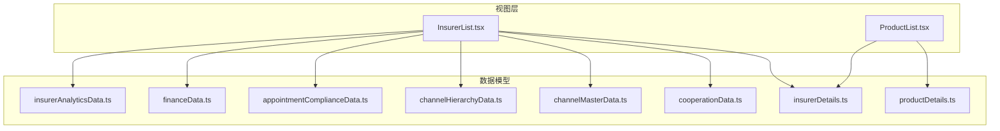
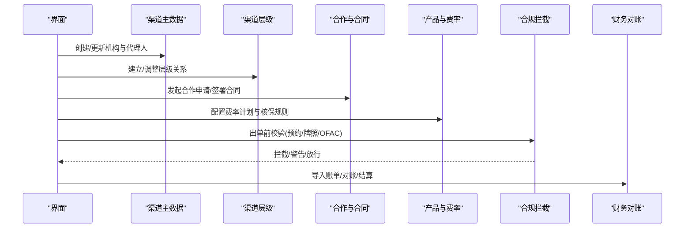
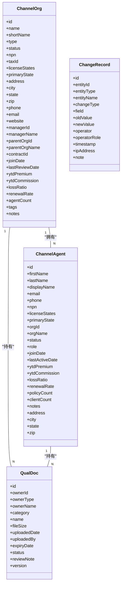
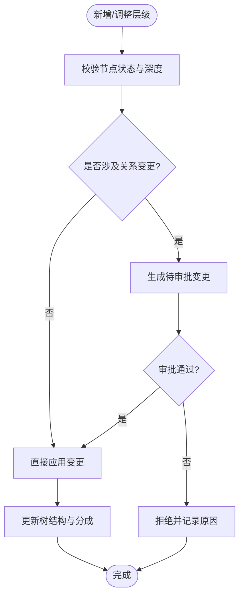
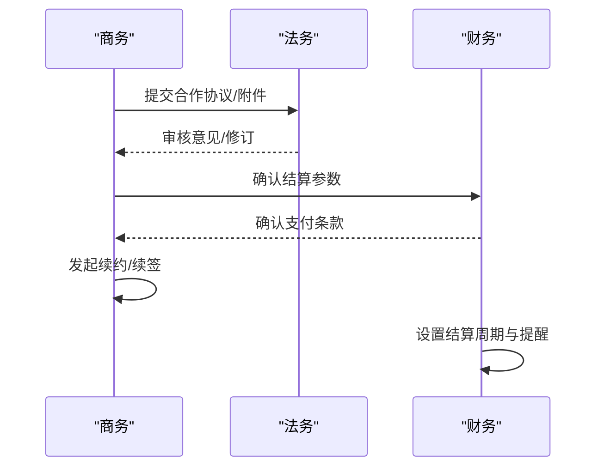
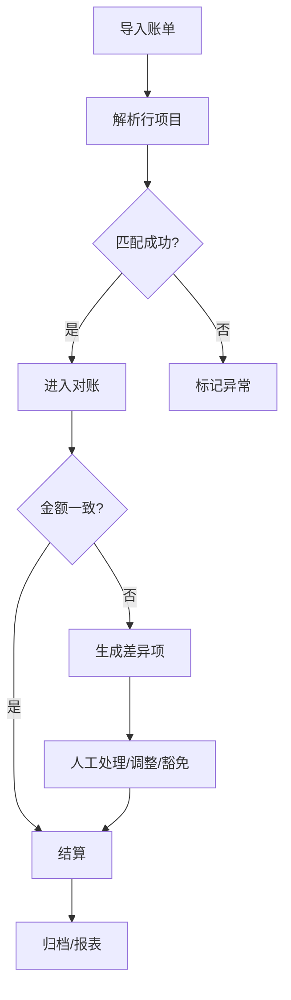
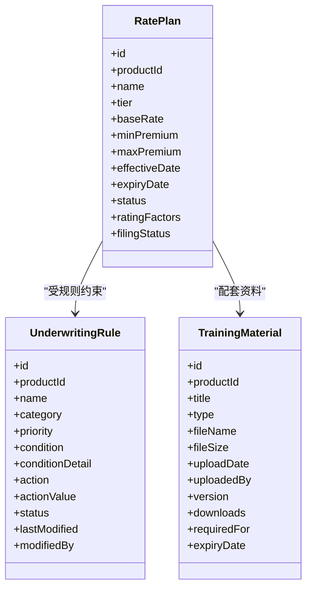
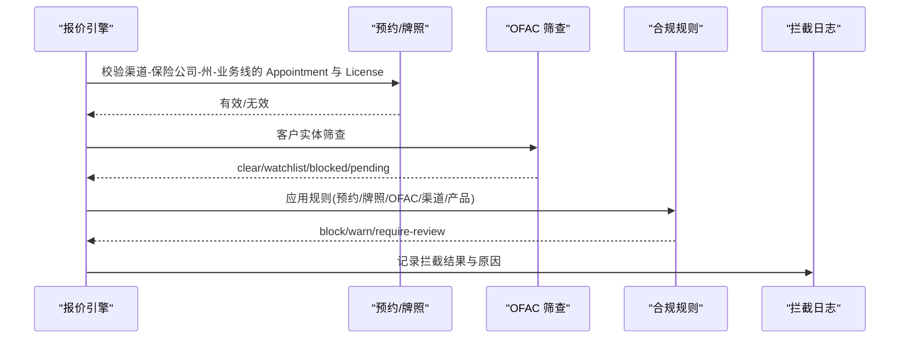
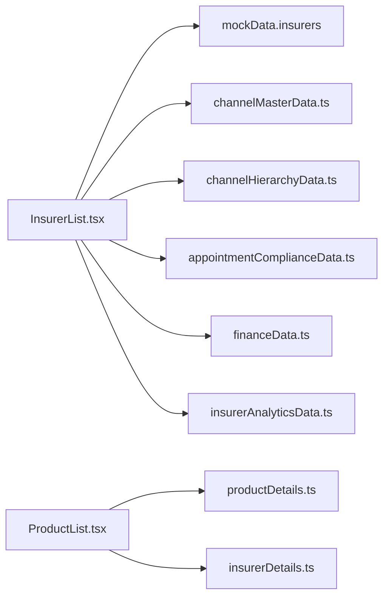

# 数据类型定义

<cite>
**本文引用的文件**
- [appointmentComplianceData.ts](file://产品方案/UI-V1.0/src/data/appointmentComplianceData.ts)
- [channelHierarchyData.ts](file://产品方案/UI-V1.0/src/data/channelHierarchyData.ts)
- [channelMasterData.ts](file://产品方案/UI-V1.0/src/data/channelMasterData.ts)
- [insurerDetails.ts](file://产品方案/UI-V1.0/src/data/insurerDetails.ts)
- [productDetails.ts](file://产品方案/UI-V1.0/src/data/productDetails.ts)
- [cooperationData.ts](file://产品方案/UI-V1.0/src/data/cooperationData.ts)
- [financeData.ts](file://产品方案/UI-V1.0/src/data/financeData.ts)
- [insurerAnalyticsData.ts](file://产品方案/UI-V1.0/src/data/insurerAnalyticsData.ts)
- [InsurerList.tsx](file://产品方案/UI-V1.0/src/views/InsurerList.tsx)
- [ProductList.tsx](file://产品方案/UI-V1.0/src/views/ProductList.tsx)
</cite>

## 目录
1. [简介](#简介)
2. [项目结构](#项目结构)
3. [核心组件](#核心组件)
4. [架构总览](#架构总览)
5. [详细组件分析](#详细组件分析)
6. [依赖关系分析](#依赖关系分析)
7. [性能与扩展性考虑](#性能与扩展性考虑)
8. [故障排查指南](#故障排查指南)
9. [结论](#结论)
10. [附录：字段约束与校验建议](#附录字段约束与校验建议)

## 简介
本文件为 OverInsurData 平台的数据类型系统提供权威说明，覆盖保险公司（Insurer）、产品（Product）、渠道（Channel）、预约（Appointment）等关键业务实体的 TypeScript 接口定义、枚举状态、数据验证规则与最佳实践。文档面向产品、研发与合规人员，帮助统一数据契约、降低沟通成本并提升系统可维护性。

## 项目结构
- 数据模型集中在 src/data 下的多个模块中，按领域划分：渠道主数据、渠道层级、合作与合同、财务对账、产品与费率、合规拦截、OFAC 筛查、保险公司动态与联系人、分析指标等。
- 视图层通过导入上述数据模型进行展示与交互，如 InsurerList.tsx、ProductList.tsx 等。

图表来源
- [InsurerList.tsx:1-200](file://产品方案/UI-V1.0/src/views/InsurerList.tsx#L1-L200)
- [ProductList.tsx:1-200](file://产品方案/UI-V1.0/src/views/ProductList.tsx#L1-L200)
- [appointmentComplianceData.ts:1-200](file://产品方案/UI-V1.0/src/data/appointmentComplianceData.ts#L1-L200)
- [channelHierarchyData.ts:1-261](file://产品方案/UI-V1.0/src/data/channelHierarchyData.ts#L1-L261)
- [channelMasterData.ts:1-449](file://产品方案/UI-V1.0/src/data/channelMasterData.ts#L1-L449)
- [cooperationData.ts:1-422](file://产品方案/UI-V1.0/src/data/cooperationData.ts#L1-L422)
- [financeData.ts:1-273](file://产品方案/UI-V1.0/src/data/financeData.ts#L1-L273)
- [productDetails.ts:1-329](file://产品方案/UI-V1.0/src/data/productDetails.ts#L1-L329)
- [insurerDetails.ts:1-140](file://产品方案/UI-V1.0/src/data/insurerDetails.ts#L1-L140)
- [insurerAnalyticsData.ts:1-275](file://产品方案/UI-V1.0/src/data/insurerAnalyticsData.ts#L1-L275)

章节来源
- [InsurerList.tsx:1-200](file://产品方案/UI-V1.0/src/views/InsurerList.tsx#L1-L200)
- [ProductList.tsx:1-200](file://产品方案/UI-V1.0/src/views/ProductList.tsx#L1-L200)

## 核心组件
本节概述各数据域的核心实体与用途：
- 渠道主数据：机构与代理人、资质文档、变更历史、导入结果与统计
- 渠道层级：节点、关系、待审批变更、白标配置、团队绩效
- 合作与合同：合作关系、合同、结算参数、联系人、续约管理、产品接入
- 财务对账：佣金账单、行项目匹配、差异处理、结算周期、保费对账、解析模板、结算历史
- 产品与费率：费率计划、可售州、核保规则、培训材料、产品表现
- 合规拦截与 OFAC：预约记录、牌照、拦截日志、规则、筛查、报告
- 保险公司动态与联系人：变更记录、文档、联系人、重复分组、评级字典
- 分析指标：KPI、趋势、区域与渠道贡献、赔付率、续保队列

章节来源
- [channelMasterData.ts:1-449](file://产品方案/UI-V1.0/src/data/channelMasterData.ts#L1-L449)
- [channelHierarchyData.ts:1-261](file://产品方案/UI-V1.0/src/data/channelHierarchyData.ts#L1-L261)
- [cooperationData.ts:1-422](file://产品方案/UI-V1.0/src/data/cooperationData.ts#L1-L422)
- [financeData.ts:1-273](file://产品方案/UI-V1.0/src/data/financeData.ts#L1-L273)
- [productDetails.ts:1-329](file://产品方案/UI-V1.0/src/data/productDetails.ts#L1-L329)
- [appointmentComplianceData.ts:1-200](file://产品方案/UI-V1.0/src/data/appointmentComplianceData.ts#L1-L200)
- [insurerDetails.ts:1-140](file://产品方案/UI-V1.0/src/data/insurerDetails.ts#L1-L140)
- [insurerAnalyticsData.ts:1-275](file://产品方案/UI-V1.0/src/data/insurerAnalyticsData.ts#L1-L275)

## 架构总览
数据模型以“领域模块化”组织，视图层按需引用。核心流程包括：
- 渠道入驻与层级管理：ChannelOrg/ChannelAgent + ChannelNode/HierarchyRelation
- 合作生命周期：CooperationRelationship + CoopContract + SettlementConfig
- 产品上线：RatePlan + UnderwritingRule + ProductState
- 合规前置检查：AppointmentRecord + NIPRLicense + ComplianceInterception + OFACScreening
- 财务闭环：CommissionBill + BillLineItem + ReconciliationDiff + PremiumRecRecord

图表来源
- [channelMasterData.ts:1-449](file://产品方案/UI-V1.0/src/data/channelMasterData.ts#L1-L449)
- [channelHierarchyData.ts:1-261](file://产品方案/UI-V1.0/src/data/channelHierarchyData.ts#L1-L261)
- [cooperationData.ts:1-422](file://产品方案/UI-V1.0/src/data/cooperationData.ts#L1-L422)
- [productDetails.ts:1-329](file://产品方案/UI-V1.0/src/data/productDetails.ts#L1-L329)
- [appointmentComplianceData.ts:1-200](file://产品方案/UI-V1.0/src/data/appointmentComplianceData.ts#L1-L200)
- [financeData.ts:1-273](file://产品方案/UI-V1.0/src/data/financeData.ts#L1-L273)

## 详细组件分析

### 渠道主数据（Channel Master）
- 机构 ChannelOrg：标识、类型、状态、执照州、主营州、地址、联系方式、负责人、合同、业绩与风险指标、标签与备注
- 代理人 ChannelAgent：个人基本信息、执照州、所属机构、角色、状态、业绩与指标
- 资质文档 QualDoc：所有者、类别、文件元信息、有效期、审核状态、版本
- 变更历史 ChangeRecord：实体、变更类型、字段、新旧值、操作人、时间戳、IP、备注
- 导入结果 ImportResult：总数、成功/失败/跳过、错误明细
- 枚举与样式映射：OrgStatus/OrgType/AgentStatus/DocCategory/ChangeType 及对应样式表

图表来源
- [channelMasterData.ts:11-42](file://产品方案/UI-V1.0/src/data/channelMasterData.ts#L11-L42)
- [channelMasterData.ts:165-192](file://产品方案/UI-V1.0/src/data/channelMasterData.ts#L165-L192)
- [channelMasterData.ts:334-348](file://产品方案/UI-V1.0/src/data/channelMasterData.ts#L334-L348)
- [channelMasterData.ts:381-395](file://产品方案/UI-V1.0/src/data/channelMasterData.ts#L381-L395)

章节来源
- [channelMasterData.ts:1-449](file://产品方案/UI-V1.0/src/data/channelMasterData.ts#L1-L449)

### 渠道层级（Channel Hierarchy）
- 节点 ChannelNode：类型、状态、多父级支持、深度、执照州、主要州、加入日期、合同、管理者、团队规模、业绩与风险指标、白标 ID、佣金覆盖
- 关系 HierarchyRelation：父子关联、主次关系、分成比例、状态、起止日期、终止原因、审批人、变更历史
- 待审批变更 PendingChange：变更类型、节点、父级变更、分成调整、请求人与日期、审批状态、生效日、原因
- 白标配置 WhiteLabelConfig：品牌、域名、功能开关、状态、特性列表
- 团队绩效 TeamPerf：聚合指标、排名、Top Agent

图表来源
- [channelHierarchyData.ts:7-32](file://产品方案/UI-V1.0/src/data/channelHierarchyData.ts#L7-L32)
- [channelHierarchyData.ts:80-103](file://产品方案/UI-V1.0/src/data/channelHierarchyData.ts#L80-L103)
- [channelHierarchyData.ts:126-144](file://产品方案/UI-V1.0/src/data/channelHierarchyData.ts#L126-L144)
- [channelHierarchyData.ts:155-174](file://产品方案/UI-V1.0/src/data/channelHierarchyData.ts#L155-L174)

章节来源
- [channelHierarchyData.ts:1-261](file://产品方案/UI-V1.0/src/data/channelHierarchyData.ts#L1-L261)

### 合作与合同（Cooperation & Contracts）
- 合作关系 CooperationRelationship：类型、状态、范围、地域、佣金等级、账户经理、审批信息
- 合同 CoopContract：类型、版本、状态、生效/到期、签署信息、文件大小、上传信息、续约提醒、自动续约、标签
- 结算参数 SettlementConfig：周期、截单日、付款期限、支付方式、币种、保费收取方式、账单格式、API 开关、对账联系人、银行信息、状态
- 联系人 CoopContact：角色、联系信息、首选方式、是否主联系人/升级联系人
- 续约 RenewalItem：类型、到期日、自动续约、状态、剩余天数、优先级、备注
- 产品接入 ProductIntegration：状态、技术需求、目标州、预估保费、测试完成度

图表来源
- [cooperationData.ts:5-22](file://产品方案/UI-V1.0/src/data/cooperationData.ts#L5-L22)
- [cooperationData.ts:97-117](file://产品方案/UI-V1.0/src/data/cooperationData.ts#L97-L117)
- [cooperationData.ts:187-206](file://产品方案/UI-V1.0/src/data/cooperationData.ts#L187-L206)
- [cooperationData.ts:256-273](file://产品方案/UI-V1.0/src/data/cooperationData.ts#L256-L273)
- [cooperationData.ts:290-306](file://产品方案/UI-V1.0/src/data/cooperationData.ts#L290-L306)
- [cooperationData.ts:348-367](file://产品方案/UI-V1.0/src/data/cooperationData.ts#L348-L367)

章节来源
- [cooperationData.ts:1-422](file://产品方案/UI-V1.0/src/data/cooperationData.ts#L1-L422)

### 财务对账（Finance）
- 佣金账单 CommissionBill：文件、期间、导入信息、状态、保单/保费/佣金汇总、解析与匹配情况、差异金额、结算日期
- 行项目 BillLineItem：保单号、被保人、渠道、州、业务线、生效日、保费、费率、佣金、匹配状态、差异说明
- 差异 ReconciliationDiff：差异类型、账单/系统金额、状态、处理人与备注
- 结算周期 SettlementCycleConfig：频率、截止日、付款期限、支付方式、最小结算额、自动对账/结算、通知提前天数、银行账户、下次应付
- 保费对账 PremiumRecRecord/PremiumSummary：应收/实收、差异类型、状态、到期日；汇总指标
- 解析模板 ParseTemplate：字段映射、列名、头行、使用统计与成功率
- 结算历史 SettlementRecord：期间、金额、方式、参考号、状态、确认人

图表来源
- [financeData.ts:5-26](file://产品方案/UI-V1.0/src/data/financeData.ts#L5-L26)
- [financeData.ts:42-62](file://产品方案/UI-V1.0/src/data/financeData.ts#L42-L62)
- [financeData.ts:79-95](file://产品方案/UI-V1.0/src/data/financeData.ts#L79-L95)
- [financeData.ts:112-133](file://产品方案/UI-V1.0/src/data/financeData.ts#L112-L133)
- [financeData.ts:149-165](file://产品方案/UI-V1.0/src/data/financeData.ts#L149-L165)
- [financeData.ts:200-216](file://产品方案/UI-V1.0/src/data/financeData.ts#L200-L216)
- [financeData.ts:227-238](file://产品方案/UI-V1.0/src/data/financeData.ts#L227-L238)

章节来源
- [financeData.ts:1-273](file://产品方案/UI-V1.0/src/data/financeData.ts#L1-L273)

### 产品与费率（Product & Rate Plan）
- 费率计划 RatePlan：名称、层级、基础费率、保费区间、生效/到期、状态、评分因子、备案状态
- 可售州 ProductState：州代码、名称、启用、生效日、备案号、状态、渠道数
- 核保规则 UnderwritingRule：分类、优先级、条件、动作、状态、修改信息
- 培训材料 TrainingMaterial：类型、文件元信息、版本、下载量、适用对象、有效期
- 产品表现 ProductPerformanceData：月度保费、新单/续保、保单数、赔付率、理赔数

图表来源
- [productDetails.ts:1-14](file://产品方案/UI-V1.0/src/data/productDetails.ts#L1-L14)
- [productDetails.ts:26-39](file://产品方案/UI-V1.0/src/data/productDetails.ts#L26-L39)
- [productDetails.ts:41-54](file://产品方案/UI-V1.0/src/data/productDetails.ts#L41-L54)

章节来源
- [productDetails.ts:1-329](file://产品方案/UI-V1.0/src/data/productDetails.ts#L1-L329)

### 合规拦截与 OFAC（Compliance & OFAC）
- 预约 AppointmentRecord：渠道/保险公司、州、业务线、状态、提交/批准/过期/终止日期、续期状态、处理天数、拒绝原因、NIPR 交易号
- 牌照 NIPRLicense：渠道、NPN、牌照号、州、类型、可经营业务线、状态、有效期、CE 学分
- 拦截日志 ComplianceInterception：时间、渠道/保险公司、州/业务线、保单草稿、客户、保费、结果、原因、复核与覆盖
- 规则 ComplianceRule：名称、分类、条件、动作、启用、优先级、触发次数、最后触发时间
- OFAC 筛查 OFACScreening：实体、类型、筛查人、结果、匹配分数/条目/清单、保单、复核信息与覆盖
- 报告 ComplianceReport：名称、类型、期间、生成时间/人、状态、大小、记录数、格式、收件人

图表来源
- [appointmentComplianceData.ts:3-25](file://产品方案/UI-V1.0/src/data/appointmentComplianceData.ts#L3-L25)
- [appointmentComplianceData.ts:44-65](file://产品方案/UI-V1.0/src/data/appointmentComplianceData.ts#L44-L65)
- [appointmentComplianceData.ts:81-102](file://产品方案/UI-V1.0/src/data/appointmentComplianceData.ts#L81-L102)
- [appointmentComplianceData.ts:116-126](file://产品方案/UI-V1.0/src/data/appointmentComplianceData.ts#L116-L126)
- [appointmentComplianceData.ts:141-157](file://产品方案/UI-V1.0/src/data/appointmentComplianceData.ts#L141-L157)
- [appointmentComplianceData.ts:172-184](file://产品方案/UI-V1.0/src/data/appointmentComplianceData.ts#L172-L184)

章节来源
- [appointmentComplianceData.ts:1-200](file://产品方案/UI-V1.0/src/data/appointmentComplianceData.ts#L1-L200)

### 保险公司动态与联系人（Insurer Details）
- 变更记录 ChangeRecord：字段、板块、新旧值、操作人/角色、时间、原因、审批信息与状态
- 文档 InsurerDocument：名称、类型、大小、上传时间/人、状态、有效期、URL
- 联系人 InsurerContact：角色、姓名、职位、部门、邮箱、电话、是否主联系人、状态
- 重复分组 DuplicateGroup/DuplicateRecord：相似度、匹配字段、记录集合
- 评级字典 US_STATES、AM_BEST_RATINGS、SP_RATINGS

章节来源
- [insurerDetails.ts:1-140](file://产品方案/UI-V1.0/src/data/insurerDetails.ts#L1-L140)

### 分析指标（Analytics）
- KPI InsurerKPI：保费、增长、佣金、活跃保单、新单、取消、赔付率、续保率、活跃渠道/产品、排名
- 产品表现 ProductPerf：产品线、保费、增长、保单数、均保、佣金、赔付率、续保率、Top 州/渠道、在售状态
- 区域 StatePerf：州、大区、保费、保单数、赔付率、增长率、Top 公司/产品、渠道数
- 渠道贡献 ChannelPerf：渠道层级、保费份额、增长、保单数、佣金、均保、活跃公司/产品、赔付率、续保率、主营州
- 赔付率 LossAlert：当前比率、阈值、趋势、期间、严重级别
- 续保队列 RenewalCohort：应续/已续/取消/失效、续保率、均保费变化

章节来源
- [insurerAnalyticsData.ts:1-275](file://产品方案/UI-V1.0/src/data/insurerAnalyticsData.ts#L1-L275)

## 依赖关系分析
- 视图层依赖数据模型：InsurerList.tsx 依赖 insurers（来自 mockData），并通过筛选器使用 Insurer 的 type/status/region/amBestRating 等字段；ProductList.tsx 依赖 products/insurers，并使用 line/status 等字段进行过滤与排序。
- 数据模型内部耦合：
  - 渠道主数据与层级：ChannelOrg/ChannelAgent 与 ChannelNode/HierarchyRelation 通过 id/name 关联，用于组织与汇报关系。
  - 合作与财务：CooperationRelationship/CoopContract/SettlementConfig 与 financeData 中的账单/对账/结算形成闭环。
  - 合规与产品：Appointment/NIPR/Compliance 与 productDetails 的 RatePlan/UnderwritingRule 共同决定出单可行性。
  - 保险公司动态与协作：insurerDetails 的变更/文档/联系人支撑合作与结算流程。

图表来源
- [InsurerList.tsx:1-200](file://产品方案/UI-V1.0/src/views/InsurerList.tsx#L1-L200)
- [ProductList.tsx:1-200](file://产品方案/UI-V1.0/src/views/ProductList.tsx#L1-L200)
- [channelMasterData.ts:1-449](file://产品方案/UI-V1.0/src/data/channelMasterData.ts#L1-L449)
- [channelHierarchyData.ts:1-261](file://产品方案/UI-V1.0/src/data/channelHierarchyData.ts#L1-L261)
- [appointmentComplianceData.ts:1-200](file://产品方案/UI-V1.0/src/data/appointmentComplianceData.ts#L1-L200)
- [financeData.ts:1-273](file://产品方案/UI-V1.0/src/data/financeData.ts#L1-L273)
- [insurerAnalyticsData.ts:1-275](file://产品方案/UI-V1.0/src/data/insurerAnalyticsData.ts#L1-L275)
- [insurerDetails.ts:1-140](file://产品方案/UI-V1.0/src/data/insurerDetails.ts#L1-L140)

章节来源
- [InsurerList.tsx:1-200](file://产品方案/UI-V1.0/src/views/InsurerList.tsx#L1-L200)
- [ProductList.tsx:1-200](file://产品方案/UI-V1.0/src/views/ProductList.tsx#L1-L200)

## 性能与扩展性考虑
- 类型安全：优先使用联合类型与字面量类型表达状态机，避免字符串自由拼接导致不一致。
- 可扩展性：新增状态或分类时，同步更新对应的样式/标签映射，确保 UI 一致性。
- 数据体积：分析类数据（如月度趋势）采用数组映射生成，减少冗余存储。
- 计算复杂度：层级树构建使用 map 索引，查询复杂度近似 O(n)。
- 校验策略：前端表单与后端接口均应基于同一类型定义进行校验，减少歧义。

[本节为通用指导，不直接分析具体文件]

## 故障排查指南
- 合规拦截问题：检查 Appointment 状态、License 有效期、OFAC 匹配结果与规则优先级；查看拦截日志的原因描述与复核记录。
- 对账差异：定位 BillLineItem 的 matchStatus 与 diffNote，结合 ReconciliationDiff 的处理状态进行追踪。
- 合同续约风险：关注 CoopContract 的 expiryDate 与 renewalAlert，以及 RenewalItem 的 daysLeft 与 priority。
- 产品上线受阻：核对 RatePlan 的 filingStatus 与 ProductState 的 enabled/status，确认 UnderwritingRule 是否阻断。
- 渠道层级异常：检查 HierarchyRelation 的 status 与 changeHistory，确认 PendingChange 的审批流。

章节来源
- [appointmentComplianceData.ts:81-102](file://产品方案/UI-V1.0/src/data/appointmentComplianceData.ts#L81-L102)
- [financeData.ts:42-62](file://产品方案/UI-V1.0/src/data/financeData.ts#L42-L62)
- [financeData.ts:79-95](file://产品方案/UI-V1.0/src/data/financeData.ts#L79-L95)
- [cooperationData.ts:97-117](file://产品方案/UI-V1.0/src/data/cooperationData.ts#L97-L117)
- [cooperationData.ts:290-306](file://产品方案/UI-V1.0/src/data/cooperationData.ts#L290-L306)
- [productDetails.ts:1-14](file://产品方案/UI-V1.0/src/data/productDetails.ts#L1-L14)
- [channelHierarchyData.ts:80-103](file://产品方案/UI-V1.0/src/data/channelHierarchyData.ts#L80-L103)

## 结论
OverInsurData 的类型系统以强类型与领域化组织为核心，覆盖了从渠道、合作、产品到合规与财务的全链路数据契约。通过统一的枚举与接口定义，平台实现了高内聚、低耦合的业务建模，便于前端展示、后端校验与跨团队协作。建议在后续迭代中持续完善字段约束与校验规则，保持类型与业务语义的一致性。

[本节为总结，不直接分析具体文件]

## 附录：字段约束与校验建议
- 日期字段：effectiveDate/expiryDate/joinDate 等需遵循 ISO 日期格式，并进行范围校验（如 effectiveDate <= expiryDate）。
- 数值字段：保费、佣金、费率等需为非负数，必要时设置上限与精度限制。
- 状态字段：严格使用联合类型，禁止自由字符串赋值；新增状态需同步更新样式与文案映射。
- 地址与州码：使用标准两字母州码，提供校验函数与下拉选项。
- 唯一性：id、npn、licenseNumber、policyNumber 等应具备唯一性约束。
- 必填与可选：关键字段（如 name、status、primaryState）设为必填；辅助字段（如 notes、website）可为可选。
- 审计字段：所有写操作需记录 operator、timestamp、ipAddress 等审计信息。
- 国际化：枚举显示文本集中管理，避免硬编码。

[本节为通用指导，不直接分析具体文件]