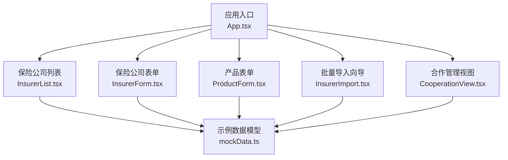
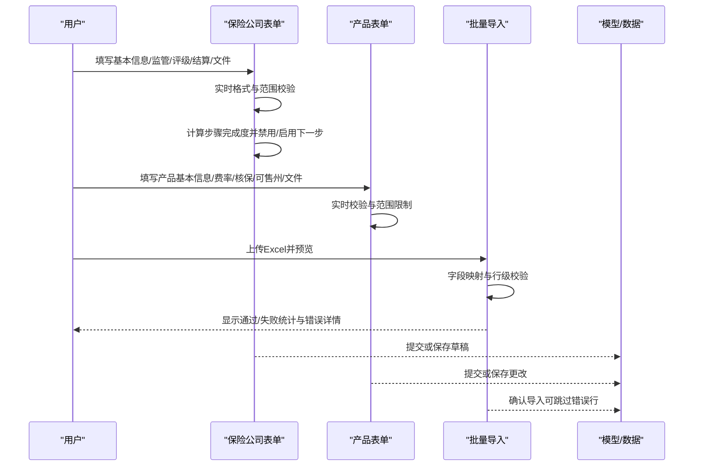
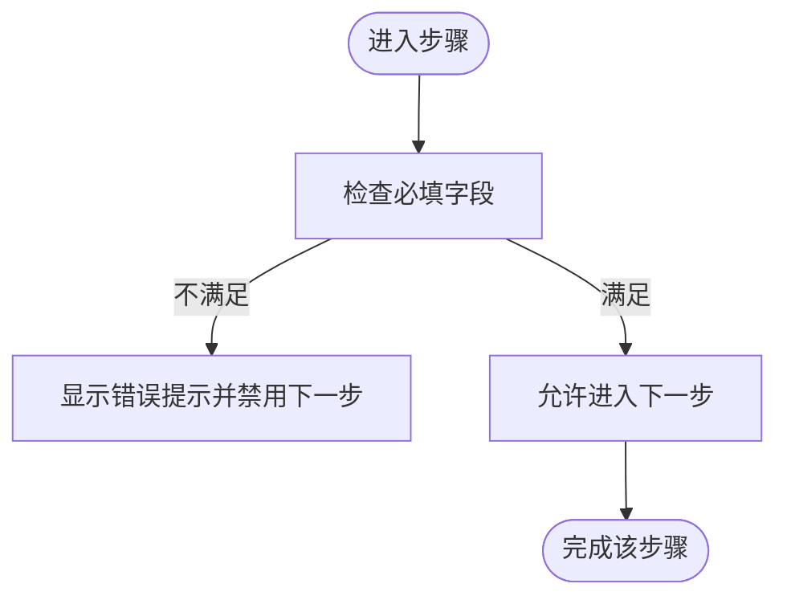
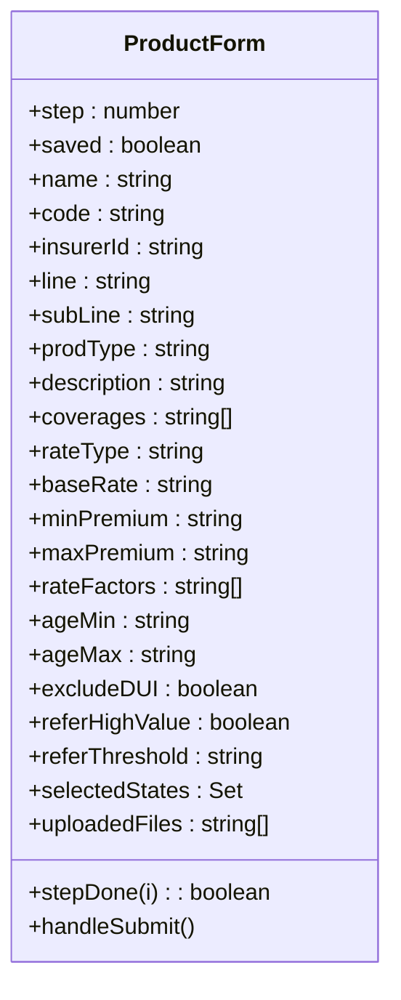
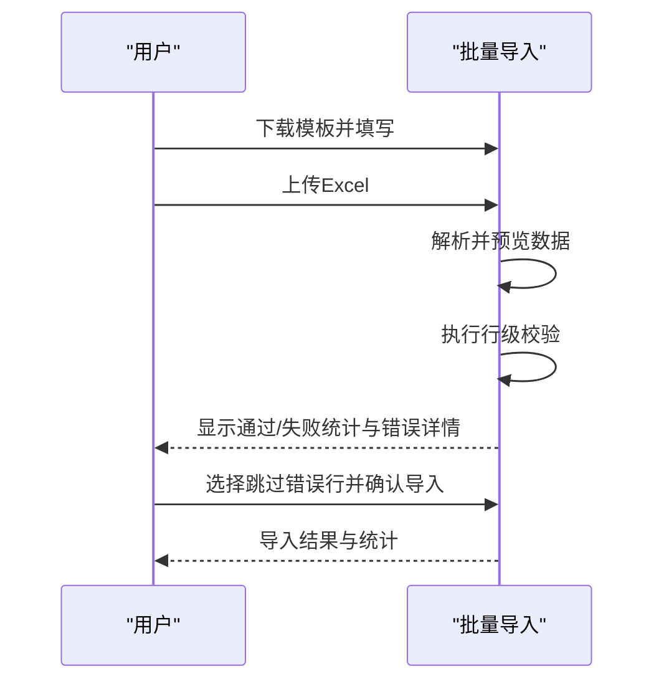
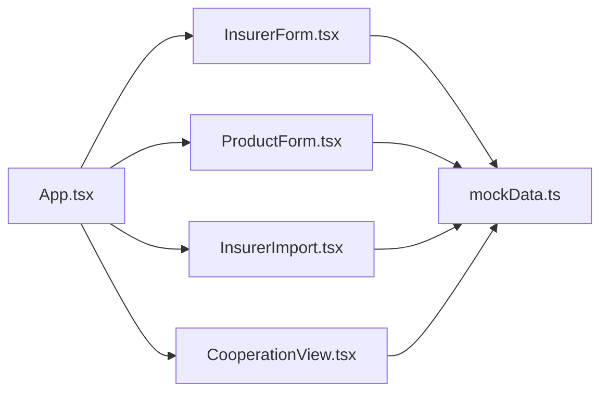

# 数据验证规则

<cite>
**本文引用的文件**
- [App.tsx](file://产品方案/UI-V1.0/src/App.tsx)
- [InsurerForm.tsx](file://产品方案/UI-V1.0/src/views/InsurerForm.tsx)
- [ProductForm.tsx](file://产品方案/UI-V1.0/src/views/ProductForm.tsx)
- [InsurerImport.tsx](file://产品方案/UI-V1.0/src/views/InsurerImport.tsx)
- [CooperationView.tsx](file://产品方案/UI-V1.0/src/views/CooperationView.tsx)
- [InsurerList.tsx](file://产品方案/UI-V1.0/src/views/InsurerList.tsx)
- [mockData.ts](file://产品方案/UI-V1.0/src/data/mockData.ts)
- [package.json](file://产品方案/UI-V1.0/package.json)
</cite>

## 目录
1. [简介](#简介)
2. [项目结构](#项目结构)
3. [核心组件](#核心组件)
4. [架构总览](#架构总览)
5. [详细组件分析](#详细组件分析)
6. [依赖关系分析](#依赖关系分析)
7. [性能考虑](#性能考虑)
8. [故障排查指南](#故障排查指南)
9. [结论](#结论)
10. [附录](#附录)

## 简介
本文件面向 OverInsurData 平台的数据验证系统，聚焦前端数据验证的实现策略与落地方式。内容覆盖：
- 表单输入验证、业务规则验证、数据格式校验
- 必填字段、格式、范围、自定义逻辑等验证规则配置方法
- 错误处理、用户反馈与错误恢复策略
- 实时验证、异步验证（流程化）与批量验证的实现方案
- 验证规则的扩展方法与性能优化建议

## 项目结构
本项目采用基于视图（views）与组件（components）的前端组织方式，数据模型与示例数据集中在 data 目录中。关键入口为应用根组件，负责路由与页面渲染；各业务视图承担各自的数据录入与验证逻辑；批量导入流程提供多步骤的上传、预览、校验与确认。

图表来源
- [App.tsx:25-82](file://产品方案/UI-V1.0/src/App.tsx#L25-L82)
- [InsurerList.tsx:18-41](file://产品方案/UI-V1.0/src/views/InsurerList.tsx#L18-L41)
- [InsurerForm.tsx:59-109](file://产品方案/UI-V1.0/src/views/InsurerForm.tsx#L59-L109)
- [ProductForm.tsx:58-113](file://产品方案/UI-V1.0/src/views/ProductForm.tsx#L58-L113)
- [InsurerImport.tsx:44-61](file://产品方案/UI-V1.0/src/views/InsurerImport.tsx#L44-L61)
- [CooperationView.tsx:358-412](file://产品方案/UI-V1.0/src/views/CooperationView.tsx#L358-L412)
- [mockData.ts:6-48](file://产品方案/UI-V1.0/src/data/mockData.ts#L6-L48)

章节来源
- [App.tsx:25-82](file://产品方案/UI-V1.0/src/App.tsx#L25-L82)
- [package.json:1-30](file://产品方案/UI-V1.0/package.json#L1-L30)

## 核心组件
- 保险公司表单（InsurerForm）：多步骤录入，包含基本信息、监管信息、财务评级、结算配置、资质文件；内置必填校验、格式校验（如 NAIC 编码）、范围校验（如成立年份、账单截止日、付款期限），以及步骤完成度计算。
- 产品表单（ProductForm）：五步向导式录入，涵盖基本信息、费率配置、核保规则、可售州、合规文件；包含必填校验、数值范围校验、多选集合校验（如可售州）。
- 批量导入（InsurerImport）：六步流程（下载模板→上传→预览→校验→确认→结果），提供字段映射、行级错误提示、跳过错误行与仅导入正常行的策略。
- 合作管理（CooperationView）：合作关系建立向导、合同与结算参数编辑面板，包含选择类字段的必填约束与提交前摘要确认。
- 列表与筛选（InsurerList）：搜索与多维过滤、排序、分页；用于展示与操作已入库数据，间接体现数据一致性要求。

章节来源
- [InsurerForm.tsx:59-109](file://产品方案/UI-V1.0/src/views/InsurerForm.tsx#L59-L109)
- [InsurerForm.tsx:202-262](file://产品方案/UI-V1.0/src/views/InsurerForm.tsx#L202-L262)
- [InsurerForm.tsx:264-313](file://产品方案/UI-V1.0/src/views/InsurerForm.tsx#L264-L313)
- [InsurerForm.tsx:315-362](file://产品方案/UI-V1.0/src/views/InsurerForm.tsx#L315-L362)
- [InsurerForm.tsx:364-422](file://产品方案/UI-V1.0/src/views/InsurerForm.tsx#L364-L422)
- [InsurerForm.tsx:424-490](file://产品方案/UI-V1.0/src/views/InsurerForm.tsx#L424-L490)
- [ProductForm.tsx:58-113](file://产品方案/UI-V1.0/src/views/ProductForm.tsx#L58-L113)
- [ProductForm.tsx:190-258](file://产品方案/UI-V1.0/src/views/ProductForm.tsx#L190-L258)
- [ProductForm.tsx:260-325](file://产品方案/UI-V1.0/src/views/ProductForm.tsx#L260-L325)
- [ProductForm.tsx:327-391](file://产品方案/UI-V1.0/src/views/ProductForm.tsx#L327-L391)
- [ProductForm.tsx:393-433](file://产品方案/UI-V1.0/src/views/ProductForm.tsx#L393-L433)
- [InsurerImport.tsx:44-61](file://产品方案/UI-V1.0/src/views/InsurerImport.tsx#L44-L61)
- [InsurerImport.tsx:189-267](file://产品方案/UI-V1.0/src/views/InsurerImport.tsx#L189-L267)
- [InsurerImport.tsx:269-312](file://产品方案/UI-V1.0/src/views/InsurerImport.tsx#L269-L312)
- [CooperationView.tsx:84-299](file://产品方案/UI-V1.0/src/views/CooperationView.tsx#L84-L299)
- [InsurerList.tsx:18-41](file://产品方案/UI-V1.0/src/views/InsurerList.tsx#L18-L41)

## 架构总览
前端验证以“表单/向导 + 步骤完成度 + 即时反馈”为核心模式：
- 实时验证：在输入变更时立即进行格式与范围检查，并在 UI 上给出明确提示（如 NAIC 编码格式、数字范围）。
- 步骤级验证：通过“步骤完成度”函数控制导航按钮可用性，确保进入下一步前满足必要规则。
- 批量验证：导入流程将校验结果汇总为统计卡片与错误详情，支持下载错误报告与选择性导入。
- 错误恢复：允许跳过错误行、重新上传、返回上一步修改，保证用户体验与容错性。

图表来源
- [InsurerForm.tsx:99-109](file://产品方案/UI-V1.0/src/views/InsurerForm.tsx#L99-L109)
- [InsurerForm.tsx:216-224](file://产品方案/UI-V1.0/src/views/InsurerForm.tsx#L216-L224)
- [ProductForm.tsx:102-113](file://产品方案/UI-V1.0/src/views/ProductForm.tsx#L102-L113)
- [InsurerImport.tsx:44-61](file://产品方案/UI-V1.0/src/views/InsurerImport.tsx#L44-L61)
- [InsurerImport.tsx:189-267](file://产品方案/UI-V1.0/src/views/InsurerImport.tsx#L189-L267)
- [InsurerImport.tsx:269-312](file://产品方案/UI-V1.0/src/views/InsurerImport.tsx#L269-L312)
- [mockData.ts:6-48](file://产品方案/UI-V1.0/src/data/mockData.ts#L6-L48)

## 详细组件分析

### 保险公司表单（InsurerForm）
- 表单结构与状态
  - 多步骤（基本信息、监管信息、财务评级、结算配置、资质文件），每步包含若干字段与交互控件。
  - 使用本地状态维护表单值与步骤进度，并提供“保存草稿”和“提交审核/保存修改”动作。
- 验证规则
  - 必填字段：公司名称、简称、NAIC 编码、公司类型、合作类型、总部所在州、大区、结算周期、账单格式等。
  - 格式验证：NAIC 编码必须为 5 位数字，输入时即时正则匹配并提示。
  - 范围验证：成立年份设置最小/最大值；账单截止日与付款期限限定合理区间。
  - 业务规则：非获准入（Non-Admitted）公司需额外确认 Surplus Lines 合规要求（条件提示）。
  - 步骤完成度：根据当前步骤的必填项计算是否可前进。
- 错误处理与反馈
  - 即时错误提示（红色文字+图标），位于对应字段下方。
  - 步骤导航按钮根据完成度禁用/启用，避免无效提交。
- 扩展点
  - 新增字段可在对应步骤区域添加 FieldLabel 与输入控件，并在步骤完成度函数中加入相应判断。
  - 自定义验证可通过在 onChange 中增加正则或业务规则判断，并渲染错误提示。

图表来源
- [InsurerForm.tsx:99-109](file://产品方案/UI-V1.0/src/views/InsurerForm.tsx#L99-L109)
- [InsurerForm.tsx:216-224](file://产品方案/UI-V1.0/src/views/InsurerForm.tsx#L216-L224)
- [InsurerForm.tsx:226-228](file://产品方案/UI-V1.0/src/views/InsurerForm.tsx#L226-L228)
- [InsurerForm.tsx:388-403](file://产品方案/UI-V1.0/src/views/InsurerForm.tsx#L388-L403)
- [InsurerForm.tsx:492-511](file://产品方案/UI-V1.0/src/views/InsurerForm.tsx#L492-L511)

章节来源
- [InsurerForm.tsx:59-109](file://产品方案/UI-V1.0/src/views/InsurerForm.tsx#L59-L109)
- [InsurerForm.tsx:202-262](file://产品方案/UI-V1.0/src/views/InsurerForm.tsx#L202-L262)
- [InsurerForm.tsx:264-313](file://产品方案/UI-V1.0/src/views/InsurerForm.tsx#L264-L313)
- [InsurerForm.tsx:315-362](file://产品方案/UI-V1.0/src/views/InsurerForm.tsx#L315-L362)
- [InsurerForm.tsx:364-422](file://产品方案/UI-V1.0/src/views/InsurerForm.tsx#L364-L422)
- [InsurerForm.tsx:424-490](file://产品方案/UI-V1.0/src/views/InsurerForm.tsx#L424-L490)
- [InsurerForm.tsx:492-511](file://产品方案/UI-V1.0/src/views/InsurerForm.tsx#L492-L511)

### 产品表单（ProductForm）
- 表单结构与状态
  - 五步向导：基本信息、费率配置、核保规则、可售州、合规文件。
  - 使用多个独立状态变量管理不同步骤的字段值，并提供“保存草稿”与“提交上架申请/保存更改”。
- 验证规则
  - 必填字段：产品全称、产品代码、承保保险公司、产品类型、业务线、业务子线、基础费率、最低/最高保费、年龄上下限、至少选择一个可售州等。
  - 范围验证：费率相关数值输入；年龄范围；可选州集合非空。
  - 业务规则：DUI 记录拒保开关、高价值标的转人工核保阈值。
  - 步骤完成度：按步骤维度判定是否允许进入下一步。
- 错误处理与反馈
  - 通过步骤完成度控制导航按钮可用性；未满足条件时无法继续。
  - 提交后显示成功状态并跳转至列表页。
- 扩展点
  - 新增核保规则或费率因子可在对应步骤中添加选项与校验逻辑。
  - 可售州可选择预设组合（如东北、加州+德州）提升效率。

图表来源
- [ProductForm.tsx:58-113](file://产品方案/UI-V1.0/src/views/ProductForm.tsx#L58-L113)
- [ProductForm.tsx:190-258](file://产品方案/UI-V1.0/src/views/ProductForm.tsx#L190-L258)
- [ProductForm.tsx:260-325](file://产品方案/UI-V1.0/src/views/ProductForm.tsx#L260-L325)
- [ProductForm.tsx:327-391](file://产品方案/UI-V1.0/src/views/ProductForm.tsx#L327-L391)
- [ProductForm.tsx:393-433](file://产品方案/UI-V1.0/src/views/ProductForm.tsx#L393-L433)
- [ProductForm.tsx:480-495](file://产品方案/UI-V1.0/src/views/ProductForm.tsx#L480-L495)

章节来源
- [ProductForm.tsx:58-113](file://产品方案/UI-V1.0/src/views/ProductForm.tsx#L58-L113)
- [ProductForm.tsx:190-258](file://产品方案/UI-V1.0/src/views/ProductForm.tsx#L190-L258)
- [ProductForm.tsx:260-325](file://产品方案/UI-V1.0/src/views/ProductForm.tsx#L260-L325)
- [ProductForm.tsx:327-391](file://产品方案/UI-V1.0/src/views/ProductForm.tsx#L327-L391)
- [ProductForm.tsx:393-433](file://产品方案/UI-V1.0/src/views/ProductForm.tsx#L393-L433)
- [ProductForm.tsx:480-495](file://产品方案/UI-V1.0/src/views/ProductForm.tsx#L480-L495)

### 批量导入（InsurerImport）
- 流程设计
  - 六步向导：下载模板→上传→预览→校验→确认→结果。
  - 预览阶段展示字段映射与数据表，标记行级错误；校验阶段汇总通过/失败数量与错误详情。
- 验证规则
  - 模板字段说明与必填标识；上传文件格式与大小限制提示。
  - 行级校验：如 NAIC 编码不能为空、AM Best 评级不能为空等。
- 错误处理与恢复
  - 错误详情列表，支持下载错误报告。
  - 提供“跳过错误行，仅导入正常行”的策略，增强容错能力。
- 扩展点
  - 可扩展更多字段映射与校验规则；可接入真实 Excel 解析与后端校验接口。

图表来源
- [InsurerImport.tsx:44-61](file://产品方案/UI-V1.0/src/views/InsurerImport.tsx#L44-L61)
- [InsurerImport.tsx:189-267](file://产品方案/UI-V1.0/src/views/InsurerImport.tsx#L189-L267)
- [InsurerImport.tsx:269-312](file://产品方案/UI-V1.0/src/views/InsurerImport.tsx#L269-L312)
- [InsurerImport.tsx:314-346](file://产品方案/UI-V1.0/src/views/InsurerImport.tsx#L314-L346)
- [InsurerImport.tsx:348-379](file://产品方案/UI-V1.0/src/views/InsurerImport.tsx#L348-L379)

章节来源
- [InsurerImport.tsx:44-61](file://产品方案/UI-V1.0/src/views/InsurerImport.tsx#L44-L61)
- [InsurerImport.tsx:189-267](file://产品方案/UI-V1.0/src/views/InsurerImport.tsx#L189-L267)
- [InsurerImport.tsx:269-312](file://产品方案/UI-V1.0/src/views/InsurerImport.tsx#L269-L312)
- [InsurerImport.tsx:314-346](file://产品方案/UI-V1.0/src/views/InsurerImport.tsx#L314-L346)
- [InsurerImport.tsx:348-379](file://产品方案/UI-V1.0/src/views/InsurerImport.tsx#L348-L379)

### 合作管理（CooperationView）
- 合作关系建立向导
  - 四步流程：选择保险公司→合作范围→条款确认→提交。
  - 选择类字段（保险公司、合作类型、业务线、经营州）具备必填约束；提交前生成摘要供确认。
- 结算参数编辑面板
  - 提供结算周期、账单截止日、付款账期、付款方式、对账格式、保费归集方式等配置项。
  - 支持启用 API 实时对账开关。
- 错误处理与反馈
  - 通过向导步骤控制导航按钮可用性；提交后显示成功状态。
- 扩展点
  - 可增加更多合作类型、佣金等级与条款选项；可对接后端审批流。

章节来源
- [CooperationView.tsx:84-299](file://产品方案/UI-V1.0/src/views/CooperationView.tsx#L84-L299)
- [CooperationView.tsx:301-354](file://产品方案/UI-V1.0/src/views/CooperationView.tsx#L301-L354)
- [CooperationView.tsx:358-412](file://产品方案/UI-V1.0/src/views/CooperationView.tsx#L358-L412)

### 列表与筛选（InsurerList）
- 功能要点
  - 搜索与多维过滤（公司类型、合作状态、大区、评级），排序与分页。
  - 批量操作（启用/停用、导出选中）。
- 与验证的关系
  - 列表展示体现数据一致性与完整性要求；导入与表单提交后的数据在此呈现。
- 扩展点
  - 可增加更多筛选维度与导出字段；可集成重复检测与数据质量看板。

章节来源
- [InsurerList.tsx:18-41](file://产品方案/UI-V1.0/src/views/InsurerList.tsx#L18-L41)
- [InsurerList.tsx:116-160](file://产品方案/UI-V1.0/src/views/InsurerList.tsx#L116-L160)
- [InsurerList.tsx:173-346](file://产品方案/UI-V1.0/src/views/InsurerList.tsx#L173-L346)

## 依赖关系分析
- 应用入口（App.tsx）负责视图切换与全局状态（当前视图、选中项、模态框状态）。
- 各视图依赖 mockData.ts 中的数据类型与示例数据，确保表单与列表展示的一致性。
- 批量导入与表单提交均与数据模型对齐，便于后续接入真实后端服务。

图表来源
- [App.tsx:25-82](file://产品方案/UI-V1.0/src/App.tsx#L25-L82)
- [InsurerForm.tsx:59-109](file://产品方案/UI-V1.0/src/views/InsurerForm.tsx#L59-L109)
- [ProductForm.tsx:58-113](file://产品方案/UI-V1.0/src/views/ProductForm.tsx#L58-L113)
- [InsurerImport.tsx:44-61](file://产品方案/UI-V1.0/src/views/InsurerImport.tsx#L44-L61)
- [CooperationView.tsx:358-412](file://产品方案/UI-V1.0/src/views/CooperationView.tsx#L358-L412)
- [mockData.ts:6-48](file://产品方案/UI-V1.0/src/data/mockData.ts#L6-L48)

章节来源
- [App.tsx:25-82](file://产品方案/UI-V1.0/src/App.tsx#L25-L82)
- [mockData.ts:6-48](file://产品方案/UI-V1.0/src/data/mockData.ts#L6-L48)

## 性能考虑
- 减少不必要的重渲染：在表单中使用局部状态与受控组件，避免整表重绘；批量导入预览阶段尽量使用虚拟滚动或分页加载。
- 校验延迟与防抖：对于长文本或复杂正则校验，可采用防抖策略降低频繁计算开销。
- 步骤级校验优先：将耗时校验放在“下一步”触发时执行，而非每次输入都执行，提升交互流畅度。
- 复用校验逻辑：将公共规则（如邮箱、电话、日期、数值范围）抽取为工具函数，统一调用，减少重复代码。
- 资源与依赖：项目使用 React、Tailwind、Lucide 图标等，保持依赖精简，避免引入重型库影响首屏性能。

[本节为通用性能建议，不直接分析具体文件]

## 故障排查指南
- 常见问题定位
  - 必填字段缺失：检查步骤完成度函数与导航按钮禁用逻辑，确认对应字段是否已赋值。
  - 格式错误：核对正则表达式与输入控件类型（如数字、日期），确保提示信息清晰。
  - 范围越界：检查 min/max 属性与业务规则判断，确保边界值处理正确。
  - 批量导入错误：查看错误详情列表，定位问题行与字段；必要时下载错误报告进行分析。
- 错误恢复策略
  - 表单：允许返回上一步修改；支持保存草稿，避免丢失数据。
  - 批量导入：支持跳过错误行并仅导入正常行；提供重新上传入口。
- 调试建议
  - 在关键校验处添加日志输出（控制台），跟踪状态变化与校验结果。
  - 使用浏览器开发者工具的“断点”与“网络”面板，模拟异步校验与提交过程。

章节来源
- [InsurerForm.tsx:99-109](file://产品方案/UI-V1.0/src/views/InsurerForm.tsx#L99-L109)
- [InsurerForm.tsx:216-224](file://产品方案/UI-V1.0/src/views/InsurerForm.tsx#L216-L224)
- [ProductForm.tsx:102-113](file://产品方案/UI-V1.0/src/views/ProductForm.tsx#L102-L113)
- [InsurerImport.tsx:269-312](file://产品方案/UI-V1.0/src/views/InsurerImport.tsx#L269-L312)
- [InsurerImport.tsx:314-346](file://产品方案/UI-V1.0/src/views/InsurerImport.tsx#L314-L346)

## 结论
OverInsurData 平台的前端数据验证体系以“实时校验 + 步骤完成度 + 批量导入流程”为核心，覆盖了从单条录入到批量处理的完整场景。通过明确的必填、格式、范围与业务规则校验，结合友好的错误提示与恢复机制，有效提升了数据质量与用户体验。未来可进一步抽象校验规则为可配置模块，并接入后端异步校验以提升准确性与可维护性。

[本节为总结性内容，不直接分析具体文件]

## 附录
- 技术栈与环境
  - 前端框架：React
  - 样式：Tailwind CSS
  - 构建工具：Vite
  - 开发脚本：dev/build/preview/format
- 参考文件
  - 应用入口与路由：App.tsx
  - 表单与导入：InsurerForm.tsx、ProductForm.tsx、InsurerImport.tsx
  - 合作管理：CooperationView.tsx
  - 列表与筛选：InsurerList.tsx
  - 数据模型与示例：mockData.ts
  - 项目配置：package.json

章节来源
- [package.json:1-30](file://产品方案/UI-V1.0/package.json#L1-L30)
- [App.tsx:25-82](file://产品方案/UI-V1.0/src/App.tsx#L25-L82)
- [InsurerForm.tsx:59-109](file://产品方案/UI-V1.0/src/views/InsurerForm.tsx#L59-L109)
- [ProductForm.tsx:58-113](file://产品方案/UI-V1.0/src/views/ProductForm.tsx#L58-L113)
- [InsurerImport.tsx:44-61](file://产品方案/UI-V1.0/src/views/InsurerImport.tsx#L44-L61)
- [CooperationView.tsx:358-412](file://产品方案/UI-V1.0/src/views/CooperationView.tsx#L358-L412)
- [InsurerList.tsx:18-41](file://产品方案/UI-V1.0/src/views/InsurerList.tsx#L18-L41)
- [mockData.ts:6-48](file://产品方案/UI-V1.0/src/data/mockData.ts#L6-L48)