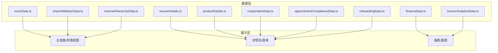
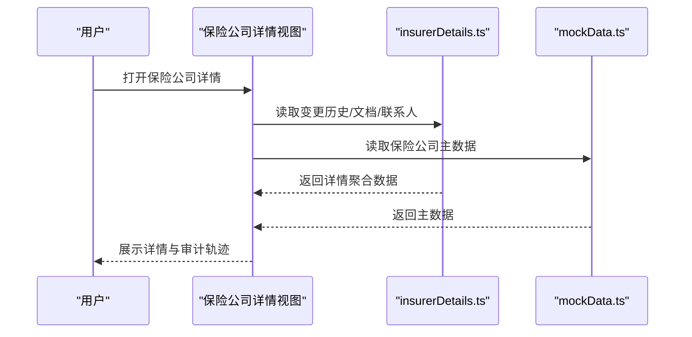
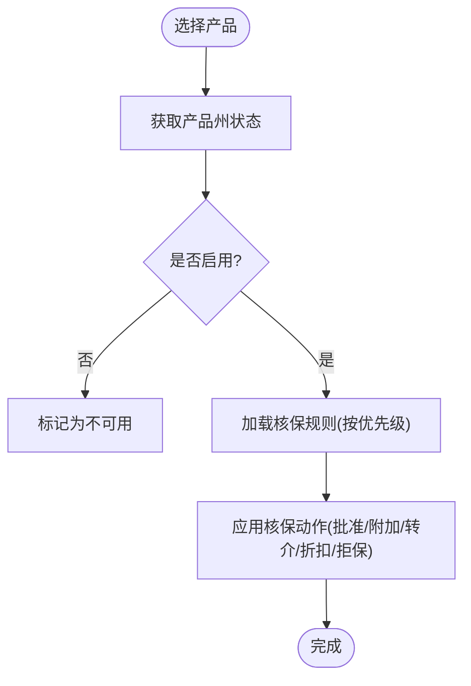
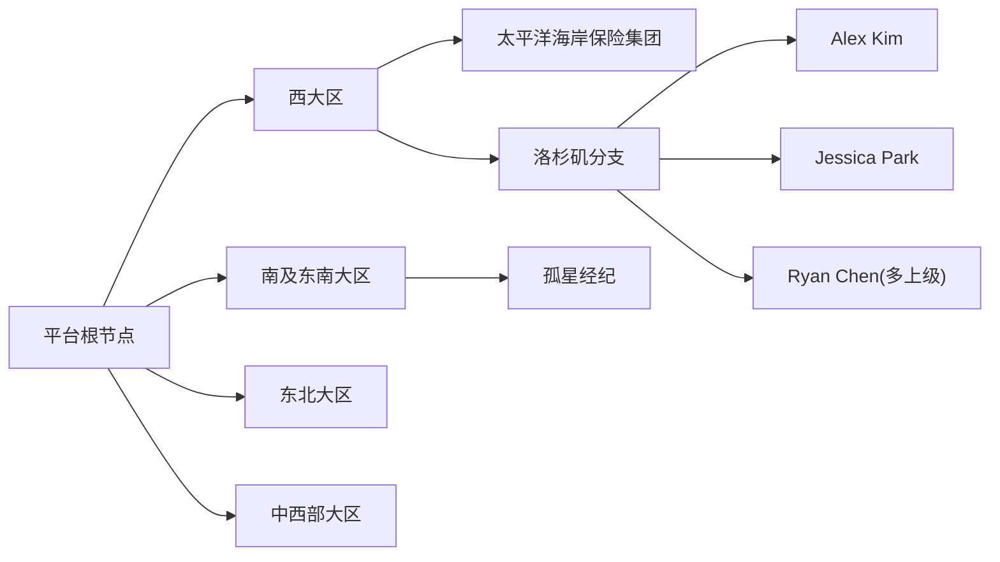
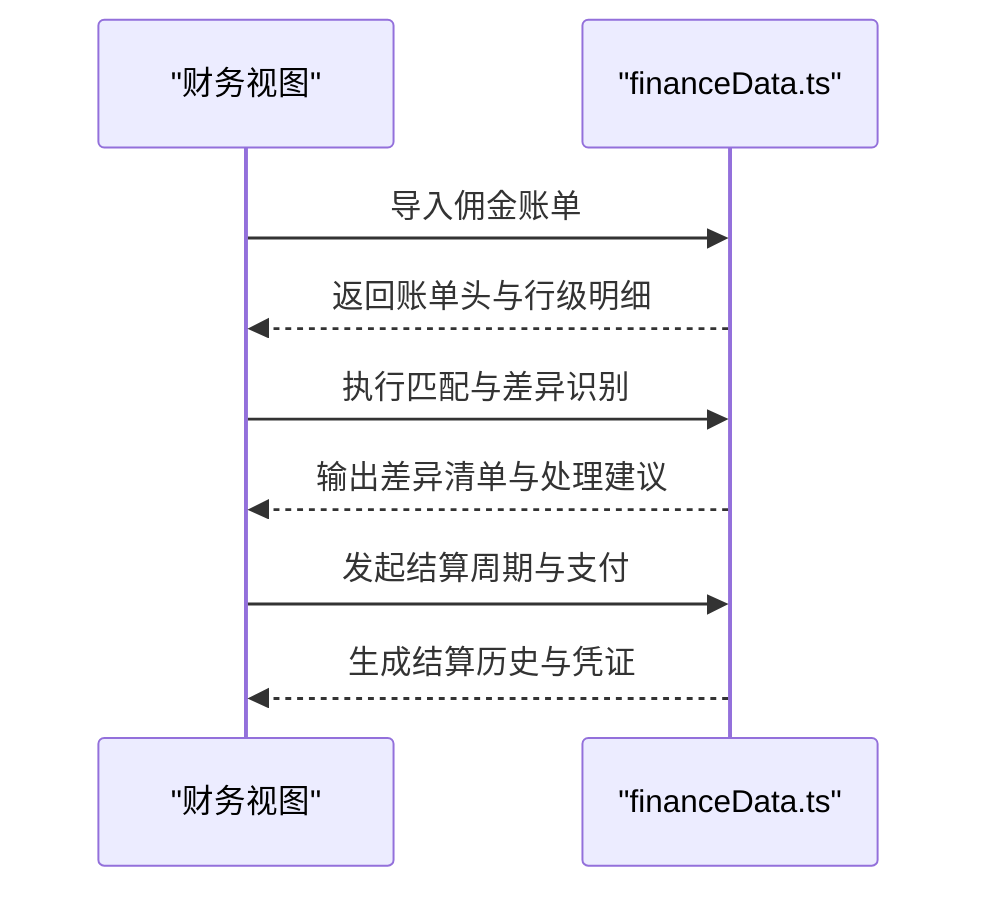
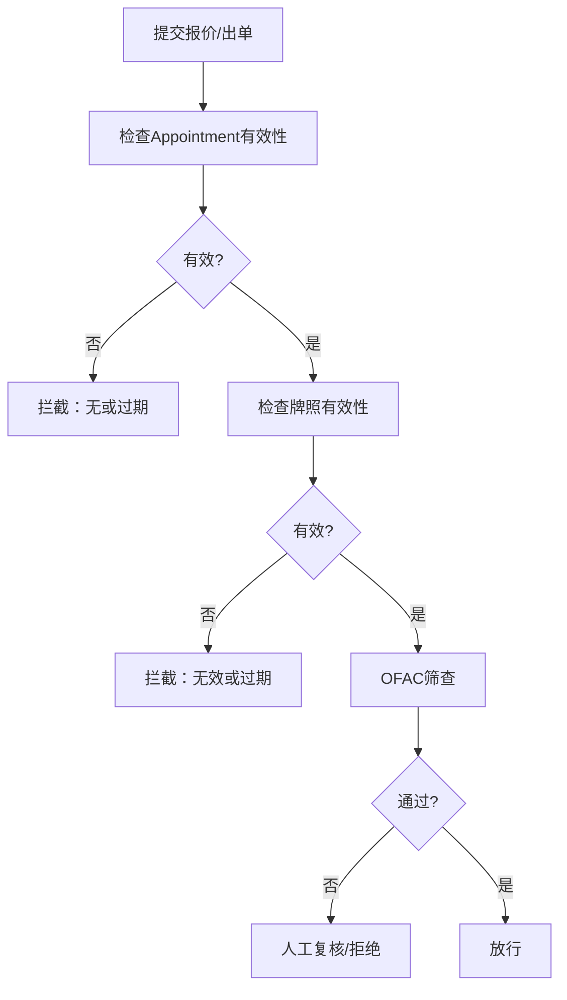
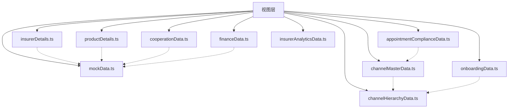

# 模拟数据管理

<cite>
**本文引用的文件**
- [mockData.ts](file://产品方案/UI-V1.0/src/data/mockData.ts)
- [insurerDetails.ts](file://产品方案/UI-V1.0/src/data/insurerDetails.ts)
- [productDetails.ts](file://产品方案/UI-V1.0/src/data/productDetails.ts)
- [channelMasterData.ts](file://产品方案/UI-V1.0/src/data/channelMasterData.ts)
- [cooperationData.ts](file://产品方案/UI-V1.0/src/data/cooperationData.ts)
- [financeData.ts](file://产品方案/UI-V1.0/src/data/financeData.ts)
- [channelHierarchyData.ts](file://产品方案/UI-V1.0/src/data/channelHierarchyData.ts)
- [appointmentComplianceData.ts](file://产品方案/UI-V1.0/src/data/appointmentComplianceData.ts)
- [onboardingData.ts](file://产品方案/UI-V1.0/src/data/onboardingData.ts)
- [insurerAnalyticsData.ts](file://产品方案/UI-V1.0/src/data/insurerAnalyticsData.ts)
</cite>

## 目录
1. [简介](#简介)
2. [项目结构](#项目结构)
3. [核心组件](#核心组件)
4. [架构总览](#架构总览)
5. [详细组件分析](#详细组件分析)
6. [依赖关系分析](#依赖关系分析)
7. [性能与一致性考虑](#性能与一致性考虑)
8. [故障排查指南](#故障排查指南)
9. [结论](#结论)
10. [附录：新增与扩展现有数据的操作指引](#附录新增与扩展现有数据的操作指引)

## 简介
本文件为 OverInsurData 平台的“模拟数据管理”专项文档，聚焦于前端静态模拟数据的组织结构、生成策略与维护方法。内容覆盖保险公司、产品、渠道、合作关系、财务、合规与入驻流程等关键业务域的数据模型、关联关系与测试覆盖范围；并提供数据更新策略、版本管理与一致性保障建议，以及新增与扩展现有数据的实操指导。

## 项目结构
模拟数据集中存放于 src/data 目录下，按业务域拆分多个 TypeScript 模块，每个模块导出类型定义与常量数组，供视图与图表直接消费。主要模块职责如下：
- mockData.ts：基础主数据（保险公司、产品、渠道、预约、趋势与告警）
- insurerDetails.ts：保险公司详情（变更历史、文档、联系人、重复记录、州与评级字典）
- productDetails.ts：产品详情（费率方案、州状态、核保规则、培训资料、产品表现）
- channelMasterData.ts：渠道主数据（机构、代理人、资质文档、变更历史、导入样例、统计）
- cooperationData.ts：合作关系（合作主体、合同、结算参数、联系人、续约、产品接入）
- financeData.ts：财务数据（佣金账单、对账差异、结算周期、保费对账、解析模板、结算历史）
- channelHierarchyData.ts：渠道层级（节点、关系、待审批变更、白标配置、团队绩效）
- appointmentComplianceData.ts：预约与合规（预约记录、NIPR 牌照、拦截日志、合规规则、OFAC 筛查、报告）
- onboardingData.ts：入驻流程（申请、步骤、文档审核、NIPR 验证、背景调查、E&O、电子合同、培训、账号）
- insurerAnalyticsData.ts：保险与分析（KPI、月度趋势、区域与渠道贡献、赔付率、续保率）

**章节来源**
- [mockData.ts:1-444](file://产品方案/UI-V1.0/src/data/mockData.ts#L1-L444)
- [insurerDetails.ts:1-140](file://产品方案/UI-V1.0/src/data/insurerDetails.ts#L1-L140)
- [productDetails.ts:1-329](file://产品方案/UI-V1.0/src/data/productDetails.ts#L1-L329)
- [channelMasterData.ts:1-449](file://产品方案/UI-V1.0/src/data/channelMasterData.ts#L1-L449)
- [cooperationData.ts:1-422](file://产品方案/UI-V1.0/src/data/cooperationData.ts#L1-L422)
- [financeData.ts:1-273](file://产品方案/UI-V1.0/src/data/financeData.ts#L1-L273)
- [channelHierarchyData.ts:1-261](file://产品方案/UI-V1.0/src/data/channelHierarchyData.ts#L1-L261)
- [appointmentComplianceData.ts:1-200](file://产品方案/UI-V1.0/src/data/appointmentComplianceData.ts#L1-L200)
- [onboardingData.ts:1-528](file://产品方案/UI-V1.0/src/data/onboardingData.ts#L1-L528)
- [insurerAnalyticsData.ts:1-275](file://产品方案/UI-V1.0/src/data/insurerAnalyticsData.ts#L1-L275)

## 核心组件
- 保险公司主数据与详情：包含基础信息、评级、合作状态、合同到期、产品线、佣金收入，以及变更历史、文档、联系人、重复检测分组。
- 产品数据：产品主数据、费率方案、州授权状态、核保规则、培训资料、产品表现时间序列。
- 渠道主数据与层级：机构与代理人主数据、资质文档、变更历史、导入结果样例；渠道层级树（平台-大区-机构-分支-代理人）、关系与分成比例、白标配置、团队绩效。
- 合作关系：合作主体、合同、结算参数、联系人、续约项、产品接入进度。
- 财务数据：佣金账单导入、行级匹配、对账差异、结算周期、保费对账、解析模板、结算历史。
- 预约与合规：预约记录、NIPR 牌照、拦截日志、合规规则、OFAC 筛查、合规报告。
- 入驻流程：申请、步骤流水线、文档审核、NIPR 验证、背景调查、E&O、电子合同、培训认证、账号设置。
- 分析与指标：保险公司 KPI、月度趋势、区域/州表现、渠道贡献、赔付率与续保率趋势。

**章节来源**
- [mockData.ts:6-388](file://产品方案/UI-V1.0/src/data/mockData.ts#L6-L388)
- [insurerDetails.ts:1-140](file://产品方案/UI-V1.0/src/data/insurerDetails.ts#L1-L140)
- [productDetails.ts:1-329](file://产品方案/UI-V1.0/src/data/productDetails.ts#L1-L329)
- [channelMasterData.ts:11-449](file://产品方案/UI-V1.0/src/data/channelMasterData.ts#L11-L449)
- [cooperationData.ts:5-422](file://产品方案/UI-V1.0/src/data/cooperationData.ts#L5-L422)
- [financeData.ts:5-273](file://产品方案/UI-V1.0/src/data/financeData.ts#L5-L273)
- [channelHierarchyData.ts:7-261](file://产品方案/UI-V1.0/src/data/channelHierarchyData.ts#L7-L261)
- [appointmentComplianceData.ts:3-200](file://产品方案/UI-V1.0/src/data/appointmentComplianceData.ts#L3-L200)
- [onboardingData.ts:11-528](file://产品方案/UI-V1.0/src/data/onboardingData.ts#L11-L528)
- [insurerAnalyticsData.ts:8-275](file://产品方案/UI-V1.0/src/data/insurerAnalyticsData.ts#L8-L275)

## 架构总览
模拟数据以“领域内聚、跨域通过 ID 关联”的方式组织。各模块独立维护自身实体与枚举，并通过统一的主键（如 insurerId、productId、channelId、orgId 等）建立关联。视图层按需引入对应模块，组合渲染列表、详情与图表。

**图示来源**
- [mockData.ts:6-84](file://产品方案/UI-V1.0/src/data/mockData.ts#L6-L84)
- [productDetails.ts:1-39](file://产品方案/UI-V1.0/src/data/productDetails.ts#L1-L39)
- [channelMasterData.ts:11-42](file://产品方案/UI-V1.0/src/data/channelMasterData.ts#L11-L42)
- [channelMasterData.ts:165-192](file://产品方案/UI-V1.0/src/data/channelMasterData.ts#L165-L192)
- [cooperationData.ts:5-22](file://产品方案/UI-V1.0/src/data/cooperationData.ts#L5-L22)
- [financeData.ts:5-26](file://产品方案/UI-V1.0/src/data/financeData.ts#L5-L26)
- [financeData.ts:79-95](file://产品方案/UI-V1.0/src/data/financeData.ts#L79-L95)
- [financeData.ts:112-133](file://产品方案/UI-V1.0/src/data/financeData.ts#L112-L133)
- [channelHierarchyData.ts:7-32](file://产品方案/UI-V1.0/src/data/channelHierarchyData.ts#L7-L32)
- [appointmentComplianceData.ts:46-65](file://产品方案/UI-V1.0/src/data/appointmentComplianceData.ts#L46-L65)
- [onboardingData.ts:11-30](file://产品方案/UI-V1.0/src/data/onboardingData.ts#L11-L30)

## 详细组件分析

### 保险公司数据与详情
- 数据结构设计原则
  - 主数据与详情分离：主数据用于列表与概览，详情提供变更历史、文档、联系人、重复组等扩展信息。
  - 枚举化字段：状态、类型、地区、评级等使用联合类型，保证 UI 显示一致性与校验便利。
  - 可审计性：变更记录包含字段、段落、新旧值、操作人角色、时间与审批流。
- 数据关联关系
  - 产品通过 insurerId 关联保险公司；渠道通过 channelId 与保险公司形成预约关系；财务账单通过 insurerId 关联结算。
- 测试覆盖范围
  - 覆盖多类型（Admitted/Non-Admitted）、多状态（active/inactive/pending）、不同评级与区域、合同即将到期与已终止等场景。
- 数据更新策略与版本管理
  - 采用“增量追加 + 明确标识”的更新方式：新增记录保持唯一 id；变更通过 changeHistory 体现；到期与过期通过日期字段驱动告警。
- 一致性保障
  - 通过统一 id 与枚举约束，避免脏数据；结合州与评级字典减少自由文本错误。

**图示来源**
- [insurerDetails.ts:62-98](file://产品方案/UI-V1.0/src/data/insurerDetails.ts#L62-L98)
- [mockData.ts:86-347](file://产品方案/UI-V1.0/src/data/mockData.ts#L86-L347)

**章节来源**
- [insurerDetails.ts:1-140](file://产品方案/UI-V1.0/src/data/insurerDetails.ts#L1-L140)
- [mockData.ts:6-347](file://产品方案/UI-V1.0/src/data/mockData.ts#L6-L347)

### 产品数据与核保规则
- 数据结构设计原则
  - 产品主数据与费率方案解耦：同一产品可有多套费率方案，支持生效/过期与申报状态。
  - 州授权状态动态计算：通过函数根据产品 id 生成各州启用/待批/不可用状态，便于演示不同市场准入。
  - 核保规则分类清晰：资格、定价、排除、转介四类，优先级与动作明确。
- 数据关联关系
  - 费率方案与核保规则均通过 productId 关联产品；产品表现数据按产品维度汇总。
- 测试覆盖范围
  - 覆盖个人/团体/自愿型产品、在售/暂停/待审状态、不同州授权、高价值住宅与企业网络安全等多类场景。
- 数据更新策略与版本管理
  - 费率方案通过有效期控制版本切换；核保规则通过状态与修改时间追踪；产品表现按月序列演进。
- 一致性保障
  - 使用函数生成州状态，确保状态与可用集合一致；产品表现查询提供默认回退。

**图示来源**
- [productDetails.ts:162-175](file://产品方案/UI-V1.0/src/data/productDetails.ts#L162-L175)
- [productDetails.ts:177-242](file://产品方案/UI-V1.0/src/data/productDetails.ts#L177-L242)

**章节来源**
- [productDetails.ts:1-329](file://产品方案/UI-V1.0/src/data/productDetails.ts#L1-L329)

### 渠道主数据与层级
- 数据结构设计原则
  - 主数据与层级分离：主数据侧重机构/代理人基本信息与业绩；层级数据描述平台-大区-机构-分支-代理人的树形结构与分成关系。
  - 资质文档与变更历史：每类实体配套文档与变更记录，支持合规与审计。
  - 白标配置：按渠道品牌化能力与功能开关进行隔离。
- 数据关联关系
  - 代理人通过 orgId 归属机构；层级节点通过 parentIds 构建多父关系；关系表记录分成比例与生效期。
- 测试覆盖范围
  - 覆盖多种机构类型、状态（活跃/暂停/待审批）、多州执照、文档即将到期或缺失、多上级分成等复杂场景。
- 数据更新策略与版本管理
  - 层级变更通过“待审批变更”队列管理，批准后生效；文档版本递增；统计基于当前快照计算。
- 一致性保障
  - 通过 buildChildrenMap 与 getNodeById 工具函数保证树渲染与查找一致性；状态样式映射集中管理。

**图示来源**
- [channelHierarchyData.ts:34-76](file://产品方案/UI-V1.0/src/data/channelHierarchyData.ts#L34-L76)
- [channelHierarchyData.ts:105-122](file://产品方案/UI-V1.0/src/data/channelHierarchyData.ts#L105-L122)

**章节来源**
- [channelMasterData.ts:11-449](file://产品方案/UI-V1.0/src/data/channelMasterData.ts#L11-L449)
- [channelHierarchyData.ts:1-261](file://产品方案/UI-V1.0/src/data/channelHierarchyData.ts#L1-L261)

### 合作关系与合同
- 数据结构设计原则
  - 合作关系与合同解耦：前者定义合作范围、区域、佣金等级与负责人；后者记录协议版本、签署方、到期日与自动续约。
  - 结算参数与联系人：按保险公司维度配置结算周期、截单日、付款方式、对接人与联系方式。
- 数据关联关系
  - 合同通过 cooperationId 与 insurerId 关联；结算配置与联系人同样绑定到保险公司；续约项汇总到期风险。
- 测试覆盖范围
  - 覆盖全服务/专业/优选/超线等不同合作类型；合同状态涵盖草稿、谈判、待签、活跃、即将到期、已过期、终止；结算方式多样。
- 数据更新策略与版本管理
  - 合同版本化；续约项通过 daysLeft 与状态提示风险；结算参数变更需记录更新时间与操作人。
- 一致性保障
  - 通过统一的 insurerId 与短名保持一致；续约项与合同到期日联动。

**章节来源**
- [cooperationData.ts:5-422](file://产品方案/UI-V1.0/src/data/cooperationData.ts#L5-L422)

### 财务数据（佣金账单、对账、结算）
- 数据结构设计原则
  - 账单导入与行级明细分离：账单头记录总体情况，行级明细记录保单、保费、佣金、匹配状态与差异说明。
  - 对账差异分类明确：费率差异、金额差异、缺失保单、重复行、我方有账单无等，并附带处理状态。
  - 结算周期配置：频率、截止日、付款天数、支付方式、最小结算额、自动对账/结算开关。
- 数据关联关系
  - 行级明细通过 billId 关联账单；对账差异通过 billId 关联账单；结算周期与历史记录通过 insurerId 关联。
- 测试覆盖范围
  - 覆盖 CSV/Excel/PDF/EDI 多种格式；状态涵盖待解析、已解析、已对账、存在差异、已结算、已归档；差异处理涵盖开放、审核中、认可、争议、调整、豁免。
- 数据更新策略与版本管理
  - 账单导入后逐步推进状态；差异处理闭环记录；结算历史保留凭证号与确认人。
- 一致性保障
  - 解析模板按保险公司维护列映射；状态样式与标签集中管理，避免歧义。

**图示来源**
- [financeData.ts:28-36](file://产品方案/UI-V1.0/src/data/financeData.ts#L28-L36)
- [financeData.ts:64-72](file://产品方案/UI-V1.0/src/data/financeData.ts#L64-L72)
- [financeData.ts:97-105](file://产品方案/UI-V1.0/src/data/financeData.ts#L97-L105)
- [financeData.ts:135-142](file://产品方案/UI-V1.0/src/data/financeData.ts#L135-L142)
- [financeData.ts:240-246](file://产品方案/UI-V1.0/src/data/financeData.ts#L240-L246)

**章节来源**
- [financeData.ts:1-273](file://产品方案/UI-V1.0/src/data/financeData.ts#L1-L273)

### 预约与合规
- 数据结构设计原则
  - 预约记录与牌照管理分离：预约记录关注渠道-保险公司-州-业务线的授权状态与到期；牌照记录关注 NIPR 有效性、继续教育学时与验证状态。
  - 拦截日志与合规规则：出单时触发规则检查，记录拦截结果与原因；支持人工复核与放行。
  - OFAC 筛查：自动筛查与人工复核，支持模糊匹配与风险分级。
- 数据关联关系
  - 预约记录通过 channelId 与 insurerId 关联；牌照通过 channelId 关联渠道；拦截日志关联渠道、保险公司与保单草稿。
- 测试覆盖范围
  - 覆盖多种状态（批准、待审、拒绝、过期、终止、审核中）；牌照状态涵盖有效、即将到期、暂停、待批；拦截原因包括无预约、过期、无效牌照、OFAC 匹配、暂停渠道、未授权州等。
- 数据更新策略与版本管理
  - 预约到期与续签状态由系统计算；拦截日志按时间顺序记录；合规报告定期生成。
- 一致性保障
  - 合规规则优先级与动作明确；拦截日志与规则触发次数联动，便于回溯。

**图示来源**
- [appointmentComplianceData.ts:27-40](file://产品方案/UI-V1.0/src/data/appointmentComplianceData.ts#L27-L40)
- [appointmentComplianceData.ts:67-77](file://产品方案/UI-V1.0/src/data/appointmentComplianceData.ts#L67-L77)
- [appointmentComplianceData.ts:104-112](file://产品方案/UI-V1.0/src/data/appointmentComplianceData.ts#L104-L112)
- [appointmentComplianceData.ts:128-137](file://产品方案/UI-V1.0/src/data/appointmentComplianceData.ts#L128-L137)

**章节来源**
- [appointmentComplianceData.ts:1-200](file://产品方案/UI-V1.0/src/data/appointmentComplianceData.ts#L1-L200)

### 入驻流程
- 数据结构设计原则
  - 流程步骤标准化：在线申请、资料审核、NIPR 验证、背景调查、E&O 验证、合同签署、Appointment、账号开通、培训认证、最终审批。
  - 文档审核与外部验证：文档状态与外部系统（NIPR、背景调查供应商）结果联动。
  - 电子合同与培训证书：记录签署状态、模板版本、完成度与成绩。
- 数据关联关系
  - 申请通过 parentChannelId 关联渠道；文档审核、NIPR 验证、背景调查、E&O、电子合同、培训、账号均通过 appId 关联申请。
- 测试覆盖范围
  - 覆盖代理机构、分支机构、个人代理、GA 等多种类型；状态涵盖草稿、提交、审核中、待补充、批准、拒绝等。
- 数据更新策略与版本管理
  - 步骤状态推进记录完成时间与备注；拒绝与待补充提供明确原因与截止日期。
- 一致性保障
  - 步骤流水线固定，状态样式与标签集中管理，避免歧义。

**章节来源**
- [onboardingData.ts:11-528](file://产品方案/UI-V1.0/src/data/onboardingData.ts#L11-L528)

### 分析与指标
- 数据结构设计原则
  - 多维度指标：保险公司 KPI、月度趋势、区域/州表现、渠道贡献、赔付率与续保率趋势。
  - 时间序列与聚合：月度数据与 YTD 目标对比，区域聚合计算均值与总量。
- 数据关联关系
  - 产品表现与保险公司、渠道、州维度交叉；区域与州通过映射关系聚合。
- 测试覆盖范围
  - 覆盖多保险公司、多产品线、多区域与州，展示增长、赔付率变化与续保率波动。
- 数据更新策略与版本管理
  - 月度数据逐月累加；目标与实际对比用于评估达成率。
- 一致性保障
  - 区域与州映射集中维护，避免不一致。

**章节来源**
- [insurerAnalyticsData.ts:8-275](file://产品方案/UI-V1.0/src/data/insurerAnalyticsData.ts#L8-L275)

## 依赖关系分析
- 组件耦合与内聚
  - 各数据模块内聚度高，职责单一；跨模块通过 id 弱耦合，降低循环依赖风险。
- 直接依赖
  - 视图层直接依赖数据模块；部分模块内部提供工具函数（如州状态生成、层级树构建）。
- 间接依赖
  - 通过统一枚举与字典（州代码、评级、状态样式）间接保持一致性。
- 外部依赖
  - 数据为静态 TS 常量，无运行时外部依赖；适合前端演示与测试。

**图示来源**
- [mockData.ts:6-388](file://产品方案/UI-V1.0/src/data/mockData.ts#L6-L388)
- [insurerDetails.ts:1-140](file://产品方案/UI-V1.0/src/data/insurerDetails.ts#L1-L140)
- [productDetails.ts:1-329](file://产品方案/UI-V1.0/src/data/productDetails.ts#L1-L329)
- [channelMasterData.ts:11-449](file://产品方案/UI-V1.0/src/data/channelMasterData.ts#L11-L449)
- [cooperationData.ts:5-422](file://产品方案/UI-V1.0/src/data/cooperationData.ts#L5-L422)
- [financeData.ts:5-273](file://产品方案/UI-V1.0/src/data/financeData.ts#L5-L273)
- [channelHierarchyData.ts:7-261](file://产品方案/UI-V1.0/src/data/channelHierarchyData.ts#L7-L261)
- [appointmentComplianceData.ts:3-200](file://产品方案/UI-V1.0/src/data/appointmentComplianceData.ts#L3-L200)
- [onboardingData.ts:11-528](file://产品方案/UI-V1.0/src/data/onboardingData.ts#L11-L528)

**章节来源**
- [channelHierarchyData.ts:247-261](file://产品方案/UI-V1.0/src/data/channelHierarchyData.ts#L247-L261)
- [productDetails.ts:162-175](file://产品方案/UI-V1.0/src/data/productDetails.ts#L162-L175)

## 性能与一致性考虑
- 性能
  - 静态数据直接导入，无网络请求，渲染性能优异；大数据集（如月度趋势）建议分页或虚拟滚动。
  - 层级树构建使用 O(n) 遍历生成子节点映射，适合中等规模数据。
- 一致性
  - 通过枚举与字典约束字段取值；工具函数集中处理派生数据（州状态、层级树），避免重复逻辑。
  - 变更历史与版本字段提供可追溯性；到期与过期通过日期字段驱动告警。
- 可扩展性
  - 新增数据只需遵循现有类型与 id 规范；如需新字段，优先扩展接口并在相关模块同步。

[本节为通用指导，不直接分析具体文件]

## 故障排查指南
- 常见问题定位
  - 数据缺失：检查对应模块是否导出所需常量；确认 id 关联是否正确。
  - 状态异常：核对枚举值与状态样式映射；检查日期字段是否合理。
  - 层级渲染错误：确认 parentIds 与 primaryParentId 设置；使用 buildChildrenMap 调试。
  - 对账差异：查看行级匹配状态与差异类型；依据差异状态推进处理流程。
- 调试建议
  - 在视图中打印关键对象（如产品州状态、层级树映射、账单匹配结果）。
  - 利用变更历史与拦截日志回溯问题来源。
- 修复策略
  - 修正枚举值与日期；补充缺失文档或更新到期日；调整合规规则优先级与动作。

**章节来源**
- [channelHierarchyData.ts:247-261](file://产品方案/UI-V1.0/src/data/channelHierarchyData.ts#L247-L261)
- [financeData.ts:64-72](file://产品方案/UI-V1.0/src/data/financeData.ts#L64-L72)
- [appointmentComplianceData.ts:104-112](file://产品方案/UI-V1.0/src/data/appointmentComplianceData.ts#L104-L112)

## 结论
OverInsurData 的模拟数据体系以领域内聚、id 关联为核心，覆盖保险公司、产品、渠道、合作关系、财务、合规与入驻等关键业务域。通过枚举与字典约束、工具函数派生数据、变更历史与版本管理，实现了良好的可维护性与一致性。建议在后续迭代中继续遵循现有规范，逐步完善自动化校验与数据质量监控。

[本节为总结，不直接分析具体文件]

## 附录：新增与扩展现有数据的操作指引
- 新增保险公司
  - 在 mockData.ts 中扩展 insurers 数组，确保 id 唯一、状态与类型符合枚举；如需详情扩展，在 insurerDetails.ts 中添加变更历史、文档或联系人。
  - 参考路径：[insurers 数组:86-347](file://产品方案/UI-V1.0/src/data/mockData.ts#L86-L347)、[变更历史:62-98](file://产品方案/UI-V1.0/src/data/insurerDetails.ts#L62-L98)。
- 新增产品
  - 在 mockData.ts 中扩展 products 数组；如需费率方案与核保规则，在 productDetails.ts 中新增 ratePlans 与 underwritingRules，并通过 productId 关联。
  - 参考路径：[products 数组:349-362](file://产品方案/UI-V1.0/src/data/mockData.ts#L349-L362)、[费率方案:66-137](file://产品方案/UI-V1.0/src/data/productDetails.ts#L66-L137)、[核保规则:177-242](file://产品方案/UI-V1.0/src/data/productDetails.ts#L177-L242)。
- 新增渠道与层级
  - 在 channelMasterData.ts 中新增机构与代理人；在 channelHierarchyData.ts 中新增节点与关系，并更新父子关系与分成比例。
  - 参考路径：[机构与代理人:53-328](file://产品方案/UI-V1.0/src/data/channelMasterData.ts#L53-L328)、[层级节点与关系:34-76](file://产品方案/UI-V1.0/src/data/channelHierarchyData.ts#L34-L76)、[关系与待审批变更:105-151](file://产品方案/UI-V1.0/src/data/channelHierarchyData.ts#L105-L151)。
- 新增合作关系与合同
  - 在 cooperationData.ts 中新增合作关系与合同，确保 insurerId 与 cooperationId 正确关联；更新结算参数与联系人。
  - 参考路径：[合作关系:24-91](file://产品方案/UI-V1.0/src/data/cooperationData.ts#L24-L91)、[合同:119-183](file://产品方案/UI-V1.0/src/data/cooperationData.ts#L119-L183)、[结算参数:208-252](file://产品方案/UI-V1.0/src/data/cooperationData.ts#L208-L252)。
- 新增财务数据
  - 在 financeData.ts 中新增佣金账单、行级明细与对账差异；更新结算周期与结算历史。
  - 参考路径：[佣金账单:28-36](file://产品方案/UI-V1.0/src/data/financeData.ts#L28-L36)、[行级明细:64-72](file://产品方案/UI-V1.0/src/data/financeData.ts#L64-L72)、[对账差异:97-105](file://产品方案/UI-V1.0/src/data/financeData.ts#L97-L105)、[结算周期:135-142](file://产品方案/UI-V1.0/src/data/financeData.ts#L135-L142)、[结算历史:240-246](file://产品方案/UI-V1.0/src/data/financeData.ts#L240-L246)。
- 新增预约与合规
  - 在 appointmentComplianceData.ts 中新增预约记录、NIPR 牌照与拦截日志；必要时调整合规规则。
  - 参考路径：[预约记录:27-40](file://产品方案/UI-V1.0/src/data/appointmentComplianceData.ts#L27-L40)、[牌照:67-77](file://产品方案/UI-V1.0/src/data/appointmentComplianceData.ts#L67-L77)、[拦截日志:104-112](file://产品方案/UI-V1.0/src/data/appointmentComplianceData.ts#L104-L112)、[合规规则:128-137](file://产品方案/UI-V1.0/src/data/appointmentComplianceData.ts#L128-L137)。
- 新增入驻流程
  - 在 onboardingData.ts 中新增申请与步骤，完善文档审核、NIPR 验证、背景调查、E&O、电子合同、培训与账号设置。
  - 参考路径：[申请与步骤:204-328](file://产品方案/UI-V1.0/src/data/onboardingData.ts#L204-L328)、[文档审核:332-353](file://产品方案/UI-V1.0/src/data/onboardingData.ts#L332-L353)、[NIPR 验证:357-386](file://产品方案/UI-V1.0/src/data/onboardingData.ts#L357-L386)、[背景调查:390-410](file://产品方案/UI-V1.0/src/data/onboardingData.ts#L390-L410)、[E&O:414-437](file://产品方案/UI-V1.0/src/data/onboardingData.ts#L414-L437)、[电子合同:441-463](file://产品方案/UI-V1.0/src/data/onboardingData.ts#L441-L463)、[培训:467-490](file://产品方案/UI-V1.0/src/data/onboardingData.ts#L467-L490)、[账号:494-516](file://产品方案/UI-V1.0/src/data/onboardingData.ts#L494-L516)。
- 新增分析与指标
  - 在 insurerAnalyticsData.ts 中扩展 KPI、月度趋势、区域与渠道贡献数据，确保与主数据 id 一致。
  - 参考路径：[KPI:28-35](file://产品方案/UI-V1.0/src/data/insurerAnalyticsData.ts#L28-L35)、[月度趋势:39-47](file://产品方案/UI-V1.0/src/data/insurerAnalyticsData.ts#L39-L47)、[区域表现:121-146](file://产品方案/UI-V1.0/src/data/insurerAnalyticsData.ts#L121-L146)、[渠道贡献:177-194](file://产品方案/UI-V1.0/src/data/insurerAnalyticsData.ts#L177-L194)。

**章节来源**
- [mockData.ts:86-388](file://产品方案/UI-V1.0/src/data/mockData.ts#L86-L388)
- [insurerDetails.ts:62-98](file://产品方案/UI-V1.0/src/data/insurerDetails.ts#L62-L98)
- [productDetails.ts:66-242](file://产品方案/UI-V1.0/src/data/productDetails.ts#L66-L242)
- [channelMasterData.ts:53-328](file://产品方案/UI-V1.0/src/data/channelMasterData.ts#L53-L328)
- [channelHierarchyData.ts:34-151](file://产品方案/UI-V1.0/src/data/channelHierarchyData.ts#L34-L151)
- [cooperationData.ts:24-252](file://产品方案/UI-V1.0/src/data/cooperationData.ts#L24-L252)
- [financeData.ts:28-246](file://产品方案/UI-V1.0/src/data/financeData.ts#L28-L246)
- [appointmentComplianceData.ts:27-137](file://产品方案/UI-V1.0/src/data/appointmentComplianceData.ts#L27-L137)
- [onboardingData.ts:204-516](file://产品方案/UI-V1.0/src/data/onboardingData.ts#L204-L516)
- [insurerAnalyticsData.ts:28-194](file://产品方案/UI-V1.0/src/data/insurerAnalyticsData.ts#L28-L194)