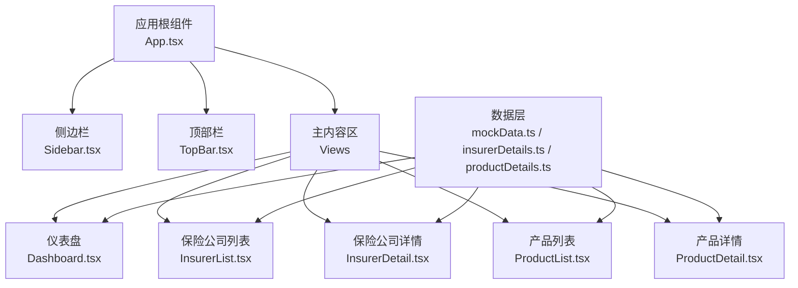
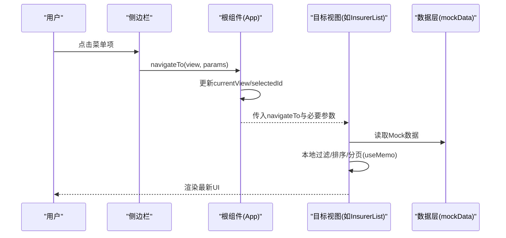
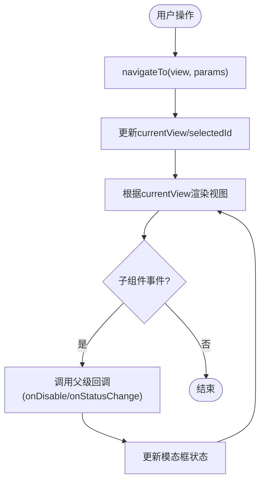
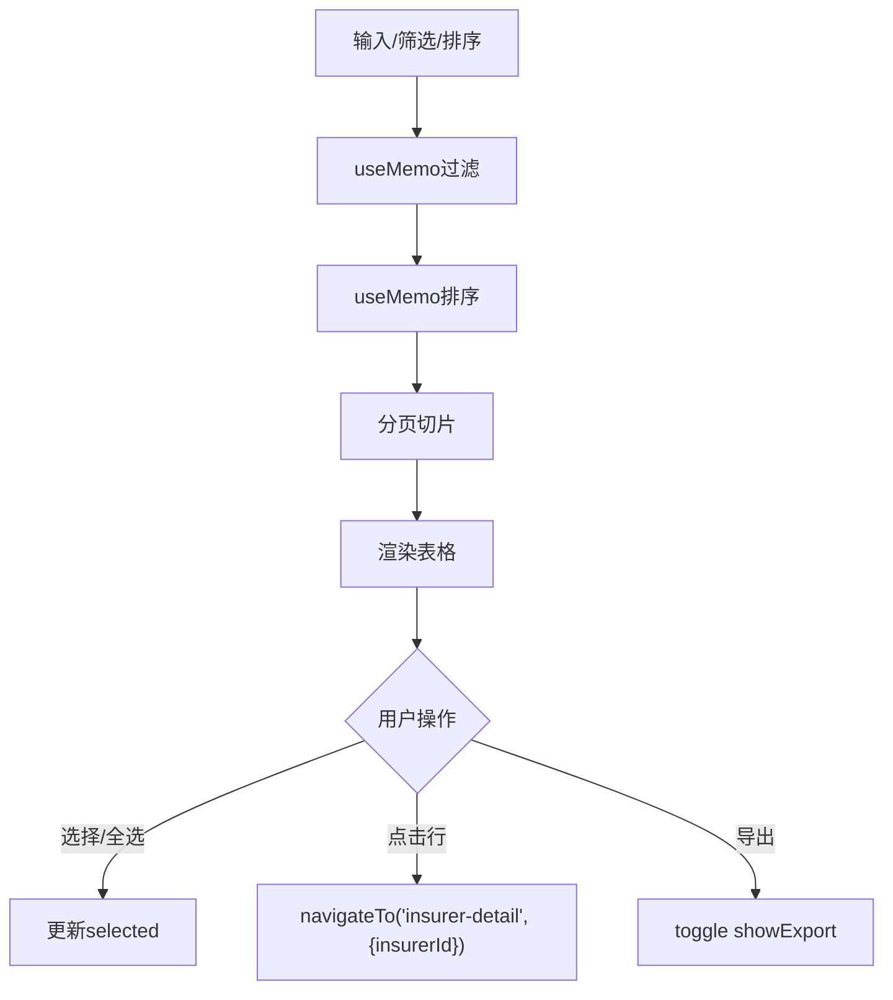
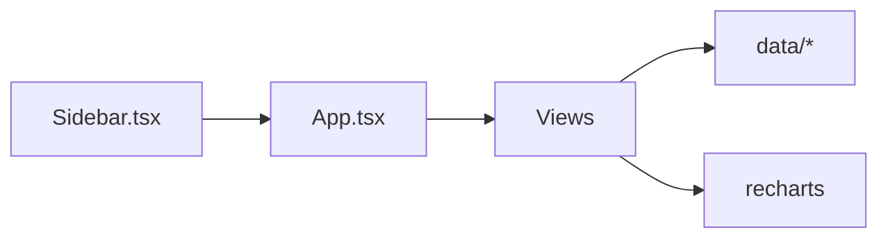
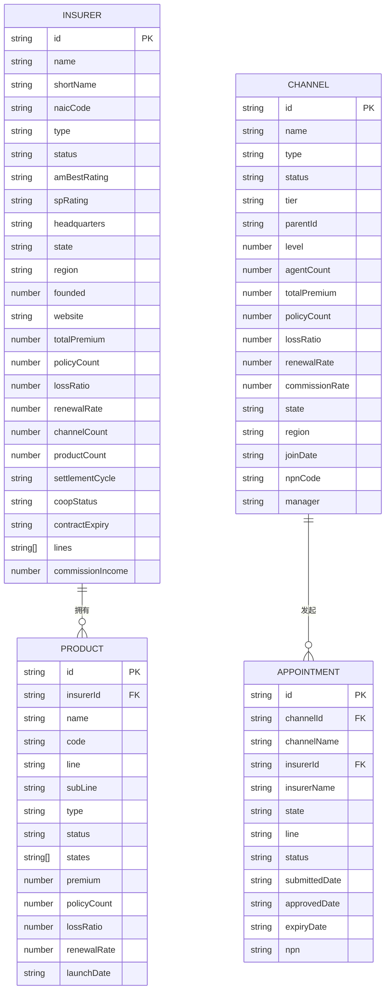
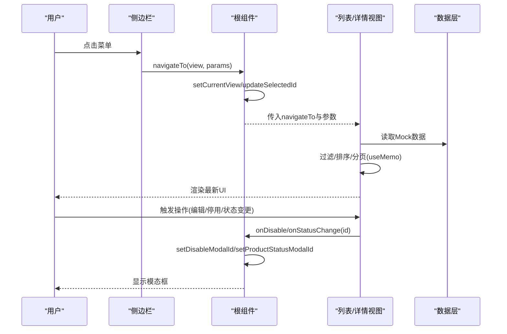

# 数据流架构

<cite>
**本文引用的文件**
- [App.tsx](file://产品方案/UI-V1.0/src/App.tsx)
- [Sidebar.tsx](file://产品方案/UI-V1.0/src/components/Sidebar.tsx)
- [Dashboard.tsx](file://产品方案/UI-V1.0/src/views/Dashboard.tsx)
- [InsurerList.tsx](file://产品方案/UI-V1.0/src/views/InsurerList.tsx)
- [ProductList.tsx](file://产品方案/UI-V1.0/src/views/ProductList.tsx)
- [InsurerDetail.tsx](file://产品方案/UI-V1.0/src/views/InsurerDetail.tsx)
- [ProductDetail.tsx](file://产品方案/UI-V1.0/src/views/ProductDetail.tsx)
- [mockData.ts](file://产品方案/UI-V1.0/src/data/mockData.ts)
- [insurerDetails.ts](file://产品方案/UI-V1.0/src/data/insurerDetails.ts)
- [productDetails.ts](file://产品方案/UI-V1.0/src/data/productDetails.ts)
</cite>

## 目录
1. [引言](#引言)
2. [项目结构](#项目结构)
3. [核心组件](#核心组件)
4. [架构总览](#架构总览)
5. [详细组件分析](#详细组件分析)
6. [依赖关系分析](#依赖关系分析)
7. [性能考量](#性能考量)
8. [故障排查指南](#故障排查指南)
9. [结论](#结论)
10. [附录](#附录)

## 引言
本文件面向OverInsurData平台，系统化阐述单向数据流设计模式在应用中的落地方式：以React函数式组件为核心，通过父组件集中管理状态（useState），将数据与回调以props形式自上而下传递；子组件仅负责渲染与触发事件，不直接修改共享状态。文档覆盖状态管理策略、数据传递机制、跨组件状态共享、Mock数据管理与校验规则、错误处理机制，并给出从用户交互到UI更新的完整数据流图。

## 项目结构
- 路由与全局状态位于根组件，负责视图切换与跨页面共享的选中项（如保险公司ID、产品ID）。
- 侧边栏与顶部栏为布局组件，接收当前视图与导航回调。
- 视图层按业务域划分（仪表盘、保险公司列表/详情、产品列表/详情等），各自维护本地交互状态（搜索、筛选、排序、分页、选择等）。
- 数据层集中在data目录，提供类型定义与Mock数据，以及工具函数（格式化货币、百分比等）。

**图表来源**
- [App.tsx:25-82](file://产品方案/UI-V1.0/src/App.tsx#L25-L82)
- [Sidebar.tsx:72-82](file://产品方案/UI-V1.0/src/components/Sidebar.tsx#L72-L82)
- [Dashboard.tsx:102-118](file://产品方案/UI-V1.0/src/views/Dashboard.tsx#L102-L118)
- [InsurerList.tsx:18-30](file://产品方案/UI-V1.0/src/views/InsurerList.tsx#L18-L30)
- [ProductList.tsx:20-28](file://产品方案/UI-V1.0/src/views/ProductList.tsx#L20-L28)
- [InsurerDetail.tsx:56-63](file://产品方案/UI-V1.0/src/views/InsurerDetail.tsx#L56-L63)
- [ProductDetail.tsx:72-83](file://产品方案/UI-V1.0/src/views/ProductDetail.tsx#L72-L83)

**章节来源**
- [App.tsx:25-82](file://产品方案/UI-V1.0/src/App.tsx#L25-L82)
- [Sidebar.tsx:72-82](file://产品方案/UI-V1.0/src/components/Sidebar.tsx#L72-L82)

## 核心组件
- 应用根组件（App）
  - 使用useState维护当前视图、选中实体ID、模态框控制等全局状态。
  - 提供统一的navigateTo方法，集中处理参数透传与滚动复位。
  - 根据currentView渲染对应视图，并将必要的回调（如禁用确认、状态变更）下推给子组件。
- 侧边栏（Sidebar）
  - 暴露ViewId类型，作为导航契约。
  - 通过navigateTo回调通知父组件切换视图。
- 各视图组件
  - 使用useState管理本地交互状态（搜索、筛选、排序、分页、多选等）。
  - 通过useMemo对过滤与排序结果进行缓存，避免重复计算。
  - 通过props调用父级回调完成跨组件状态同步（如打开模态、切换产品状态）。

**章节来源**
- [App.tsx:25-82](file://产品方案/UI-V1.0/src/App.tsx#L25-L82)
- [Sidebar.tsx:9-36](file://产品方案/UI-V1.0/src/components/Sidebar.tsx#L9-L36)
- [InsurerList.tsx:18-58](file://产品方案/UI-V1.0/src/views/InsurerList.tsx#L18-L58)
- [ProductList.tsx:20-52](file://产品方案/UI-V1.0/src/views/ProductList.tsx#L20-L52)

## 架构总览
采用“状态上移、数据下推”的单向数据流：
- 状态源：根组件持有跨页面共享的状态（当前视图、选中ID、模态框ID）。
- 数据源：data目录提供强类型的Mock数据与工具函数，视图按需读取并进行本地过滤/排序。
- 事件流：子组件通过props回调向上传递用户意图，由父组件更新状态，再向下传递新数据，驱动UI重渲染。

**图表来源**
- [App.tsx:32-37](file://产品方案/UI-V1.0/src/App.tsx#L32-L37)
- [Sidebar.tsx:151-156](file://产品方案/UI-V1.0/src/components/Sidebar.tsx#L151-L156)
- [InsurerList.tsx:31-53](file://产品方案/UI-V1.0/src/views/InsurerList.tsx#L31-L53)
- [mockData.ts:86-347](file://产品方案/UI-V1.0/src/data/mockData.ts#L86-L347)

## 详细组件分析

### 根组件：状态与导航中枢
- 状态管理
  - currentView：当前激活视图，决定渲染哪个页面。
  - selectedInsurerId/selectedProductId：跨页面共享的实体标识，用于详情页定位。
  - disableModalId/productStatusModalId：控制全局模态框显示。
- 导航与参数传递
  - navigateTo统一封装了参数设置与视图切换，保证行为一致。
- 跨组件状态同步
  - 通过onDisable/onStatusChange等回调，将子组件的动作提升到根组件，再由根组件决定是否展示模态或执行后续逻辑。

**图表来源**
- [App.tsx:25-82](file://产品方案/UI-V1.0/src/App.tsx#L25-L82)

**章节来源**
- [App.tsx:25-82](file://产品方案/UI-V1.0/src/App.tsx#L25-L82)

### 仪表盘：只读数据展示与导航入口
- 数据来源：直接从mockData导入聚合指标与图表数据。
- 交互：点击表格行或按钮调用navigateTo跳转到列表或详情页。
- 特点：无本地写操作，纯展示型组件，适合做数据看板。

**章节来源**
- [Dashboard.tsx:102-118](file://产品方案/UI-V1.0/src/views/Dashboard.tsx#L102-L118)
- [Dashboard.tsx:254-319](file://产品方案/UI-V1.0/src/views/Dashboard.tsx#L254-L319)

### 保险公司列表：本地状态与过滤排序
- 本地状态：search、filterType、filterStatus、filterRegion、filterRating、sortKey、sortDir、page、selected、showExport。
- 数据处理：
  - useMemo计算filtered与sorted，提升性能。
  - 分页基于pageSize切片。
- 事件：
  - 点击行或操作按钮调用navigateTo进入详情/编辑。
  - 批量操作与导出通过本地状态控制弹窗。

**图表来源**
- [InsurerList.tsx:18-58](file://产品方案/UI-V1.0/src/views/InsurerList.tsx#L18-L58)
- [InsurerList.tsx:60-71](file://产品方案/UI-V1.0/src/views/InsurerList.tsx#L60-L71)
- [InsurerList.tsx:210-217](file://产品方案/UI-V1.0/src/views/InsurerList.tsx#L210-L217)

**章节来源**
- [InsurerList.tsx:18-58](file://产品方案/UI-V1.0/src/views/InsurerList.tsx#L18-L58)
- [InsurerList.tsx:60-71](file://产品方案/UI-V1.0/src/views/InsurerList.tsx#L60-L71)
- [InsurerList.tsx:210-217](file://产品方案/UI-V1.0/src/views/InsurerList.tsx#L210-L217)

### 产品列表：筛选、排序与状态变更回调
- 本地状态：search、filterInsurer、filterLine、filterStatus、sortKey、sortDir、selected。
- 数据处理：useMemo实现过滤与排序。
- 事件：
  - 点击行/操作按钮navigateTo跳转。
  - 上架/下架通过onStatusChange回调上报给父组件，由父组件决定是否弹出状态确认模态。

**章节来源**
- [ProductList.tsx:20-52](file://产品方案/UI-V1.0/src/views/ProductList.tsx#L20-L52)
- [ProductList.tsx:165-170](file://产品方案/UI-V1.0/src/views/ProductList.tsx#L165-L170)
- [ProductList.tsx:214-228](file://产品方案/UI-V1.0/src/views/ProductList.tsx#L214-L228)

### 保险公司详情：Tab切换与数据聚合
- 本地状态：activeTab。
- 数据聚合：根据insurerId从mockData中筛选产品、渠道、历史、文档、联系人等。
- 交互：
  - Tab切换渲染不同区块。
  - 停用/启用通过onDisable回调上报。
  - 编辑通过navigateTo携带insurerId跳转。

**章节来源**
- [InsurerDetail.tsx:56-63](file://产品方案/UI-V1.0/src/views/InsurerDetail.tsx#L56-L63)
- [InsurerDetail.tsx:71-87](file://产品方案/UI-V1.0/src/views/InsurerDetail.tsx#L71-L87)

### 产品详情：多Tab与动态州列表
- 本地状态：activeTab、stateSearch、showAllStates。
- 数据聚合：从productDetails获取费率方案、可售州、核保规则、培训材料、业绩数据。
- 交互：
  - 在售/停售通过onStatusChange回调上报。
  - 编辑通过navigateTo携带productId跳转。

**章节来源**
- [ProductDetail.tsx:72-83](file://产品方案/UI-V1.0/src/views/ProductDetail.tsx#L72-L83)
- [ProductDetail.tsx:150-163](file://产品方案/UI-V1.0/src/views/ProductDetail.tsx#L150-L163)

## 依赖关系分析
- 组件耦合
  - 根组件与视图之间通过props解耦，视图不感知其他视图的内部状态。
  - 侧边栏与根组件通过ViewId类型契约通信，降低耦合度。
- 数据依赖
  - 视图组件依赖data目录的类型与Mock数据，便于前后端联调前独立开发。
  - 工具函数（formatCurrency/formatPercent）被多处复用，减少重复代码。
- 外部依赖
  - 图表库recharts用于可视化，不影响数据流主线。

**图表来源**
- [App.tsx:25-82](file://产品方案/UI-V1.0/src/App.tsx#L25-L82)
- [Dashboard.tsx:1-11](file://产品方案/UI-V1.0/src/views/Dashboard.tsx#L1-L11)
- [InsurerList.tsx:1-9](file://产品方案/UI-V1.0/src/views/InsurerList.tsx#L1-L9)
- [ProductList.tsx:1-5](file://产品方案/UI-V1.0/src/views/ProductList.tsx#L1-L5)

**章节来源**
- [App.tsx:25-82](file://产品方案/UI-V1.0/src/App.tsx#L25-L82)
- [Sidebar.tsx:9-36](file://产品方案/UI-V1.0/src/components/Sidebar.tsx#L9-L36)

## 性能考量
- 使用useMemo缓存过滤与排序结果，避免每次渲染重复计算。
- 列表分页减少DOM节点数量，提升渲染性能。
- 图表数据量适中，结合ResponsiveContainer自适应尺寸。
- 建议：
  - 大数据集可考虑虚拟滚动。
  - 复杂筛选可引入防抖。
  - 图表数据可按需懒加载。

[本节为通用指导，无需特定文件引用]

## 故障排查指南
- 常见问题
  - 视图未切换：检查navigateTo是否正确更新currentView与selectedId。
  - 列表为空：检查search/filter条件是否过于严格，或数据源是否为空。
  - 详情页数据异常：核对insurerId/productId是否与Mock数据匹配。
  - 模态框不显示：确认父组件回调是否被调用且状态已更新。
- 调试建议
  - 在关键回调处打印入参与状态变化。
  - 使用浏览器开发者工具观察组件props与state变化。
  - 逐步缩小范围，先验证数据层再验证视图层。

**章节来源**
- [App.tsx:32-37](file://产品方案/UI-V1.0/src/App.tsx#L32-L37)
- [InsurerList.tsx:31-53](file://产品方案/UI-V1.0/src/views/InsurerList.tsx#L31-L53)
- [InsurerDetail.tsx:56-63](file://产品方案/UI-V1.0/src/views/InsurerDetail.tsx#L56-L63)
- [ProductDetail.tsx:72-83](file://产品方案/UI-V1.0/src/views/ProductDetail.tsx#L72-L83)

## 结论
OverInsurData平台采用清晰的单向数据流：根组件集中管理跨页面状态，视图组件专注本地交互与数据展示，数据层提供强类型Mock数据与工具函数。通过props回调实现跨组件状态同步，配合useMemo与分页优化渲染性能。该模式易于扩展与维护，便于后续替换为真实后端API与更复杂的全局状态管理。

[本节为总结性内容，无需特定文件引用]

## 附录

### 数据模型概览

**图表来源**
- [mockData.ts:6-84](file://产品方案/UI-V1.0/src/data/mockData.ts#L6-L84)

**章节来源**
- [mockData.ts:6-84](file://产品方案/UI-V1.0/src/data/mockData.ts#L6-L84)

### 用户交互到UI更新的数据流图

**图表来源**
- [App.tsx:25-82](file://产品方案/UI-V1.0/src/App.tsx#L25-L82)
- [Sidebar.tsx:151-156](file://产品方案/UI-V1.0/src/components/Sidebar.tsx#L151-L156)
- [InsurerList.tsx:210-217](file://产品方案/UI-V1.0/src/views/InsurerList.tsx#L210-L217)
- [ProductList.tsx:214-228](file://产品方案/UI-V1.0/src/views/ProductList.tsx#L214-L228)

### Mock数据管理与验证规则
- 数据组织
  - 类型定义：在mockData.ts中明确Insurer、Product、Channel、Appointment等接口，确保类型安全。
  - 常量数据：insurers、products、channels、appointments、premiumTrendData、marketShareData、alertItems、recentActivities等集中管理。
  - 工具函数：formatCurrency、formatPercent用于统一格式输出。
- 验证规则
  - 枚举约束：如InsurerStatus、InsurerType、CoopStatus、Region等限制取值范围。
  - 字段约束：如Product.status、Channel.tier等限定合法值。
- 错误处理
  - 前端以防御式编程为主：默认回退数据（如找不到则取首条）、边界条件判断（空数组/空对象）。
  - 建议在后续接入后端时增加请求错误处理与用户提示。

**章节来源**
- [mockData.ts:1-49](file://产品方案/UI-V1.0/src/data/mockData.ts#L1-L49)
- [mockData.ts:431-443](file://产品方案/UI-V1.0/src/data/mockData.ts#L431-L443)
- [insurerDetails.ts:1-41](file://产品方案/UI-V1.0/src/data/insurerDetails.ts#L1-L41)
- [productDetails.ts:1-64](file://产品方案/UI-V1.0/src/data/productDetails.ts#L1-L64)