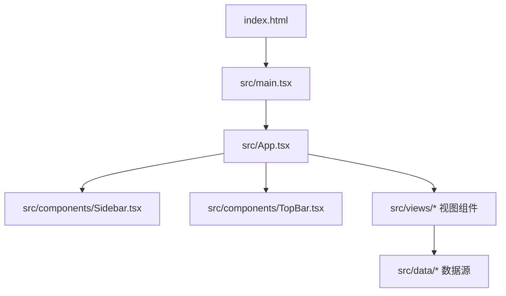
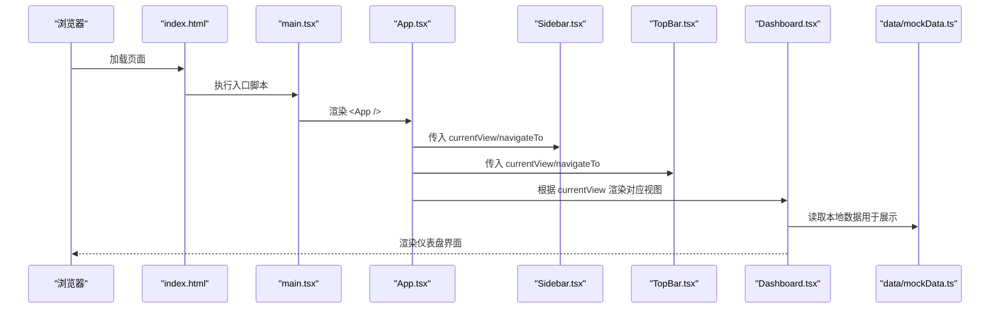
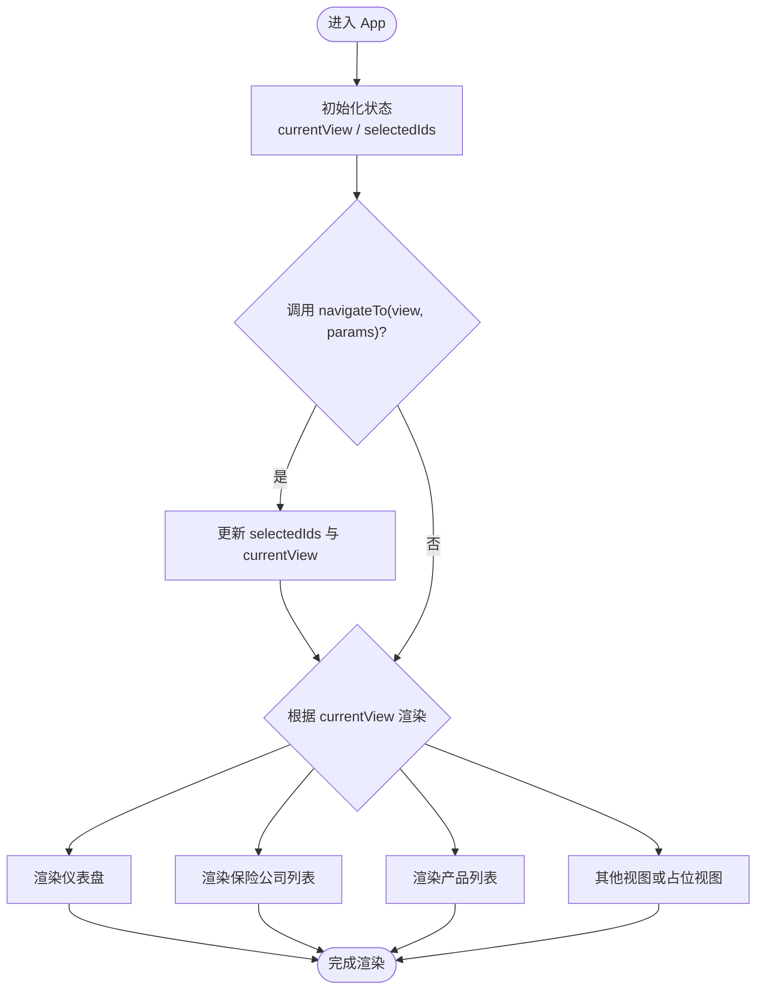
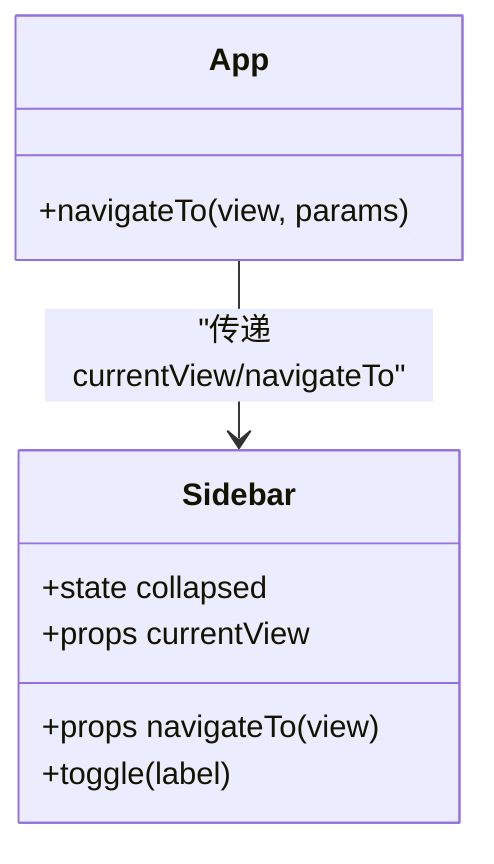
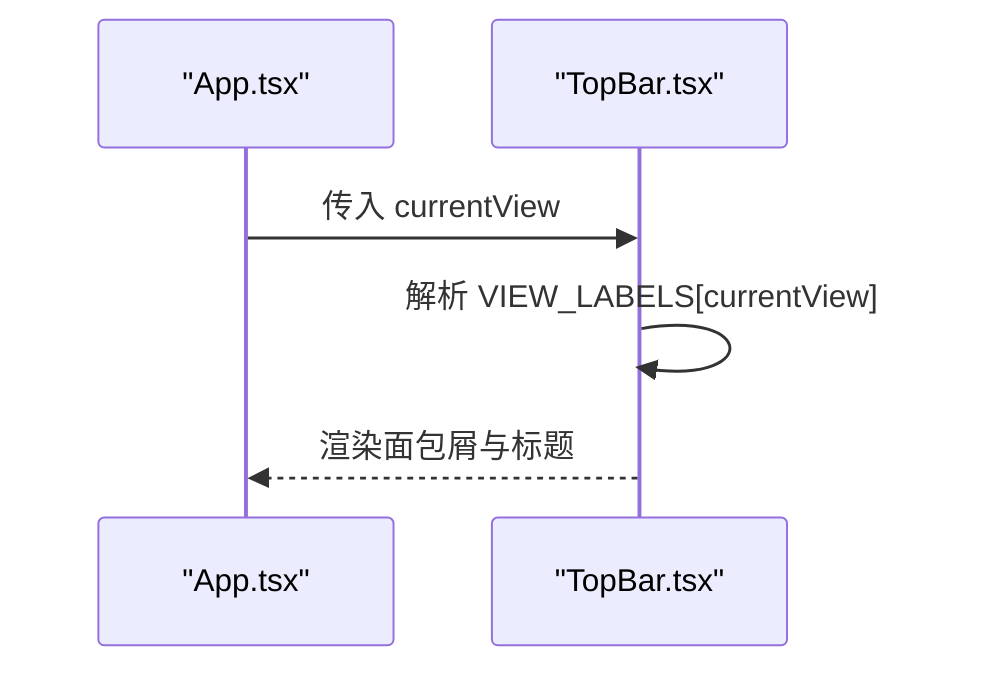
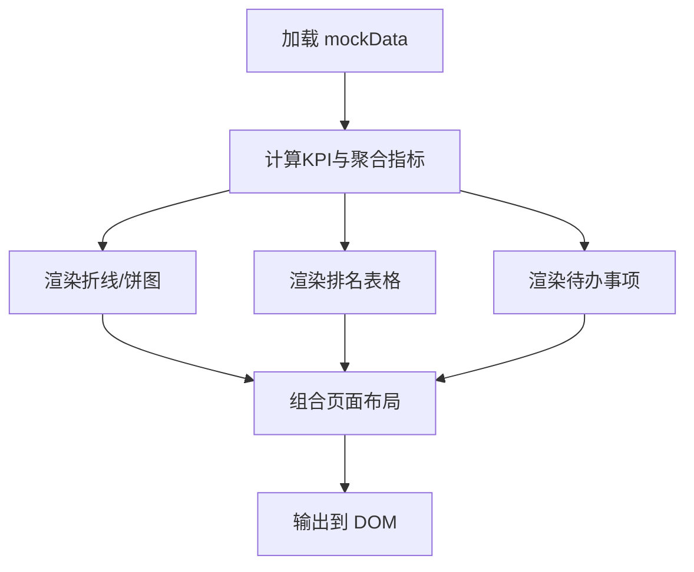
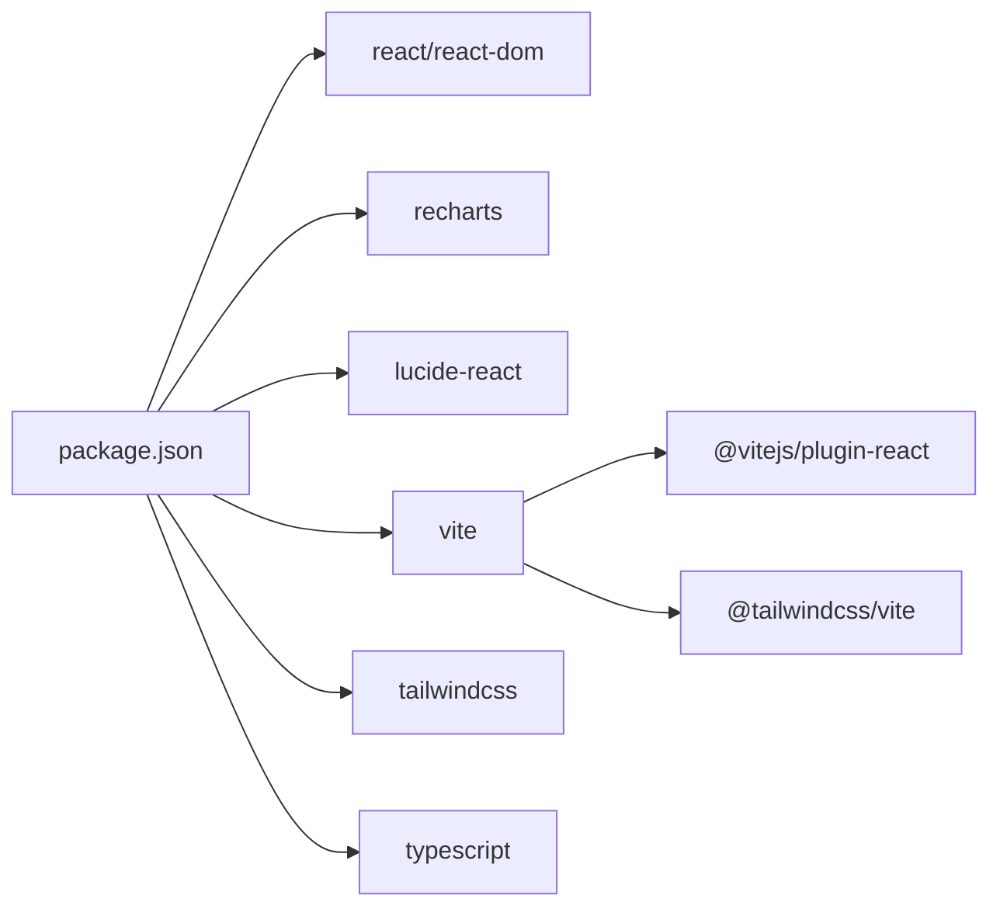

# 整体架构设计

<cite>
**本文引用的文件**
- [package.json](file://产品方案/UI-V1.0/package.json)
- [vite.config.ts](file://产品方案/UI-V1.0/vite.config.ts)
- [tsconfig.json](file://产品方案/UI-V1.0/tsconfig.json)
- [index.html](file://产品方案/UI-V1.0/index.html)
- [main.tsx](file://产品方案/UI-V1.0/src/main.tsx)
- [App.tsx](file://产品方案/UI-V1.0/src/App.tsx)
- [Sidebar.tsx](file://产品方案/UI-V1.0/src/components/Sidebar.tsx)
- [TopBar.tsx](file://产品方案/UI-V1.0/src/components/TopBar.tsx)
- [Dashboard.tsx](file://产品方案/UI-V1.0/src/views/Dashboard.tsx)
</cite>

## 目录
1. [引言](#引言)
2. [项目结构](#项目结构)
3. [核心组件](#核心组件)
4. [架构总览](#架构总览)
5. [详细组件分析](#详细组件分析)
6. [依赖关系分析](#依赖关系分析)
7. [性能与构建优化](#性能与构建优化)
8. [故障排查指南](#故障排查指南)
9. [结论](#结论)
10. [附录](#附录)

## 引言
本文件为 OverInsurData 平台的前端整体架构设计文档，聚焦于基于 React 19 + TypeScript 的现代化单页应用（SPA）架构。内容涵盖：
- 技术栈选型与原因
- 应用整体结构与模块划分原则
- Vite 构建系统配置、开发服务器与生产构建流程
- SPA 路由与状态管理方式
- 架构图表展示组件关系与数据流向
- 部署策略建议与最佳实践

该前端采用“轻量路由 + 集中式视图切换”的模式，通过 App 组件维护当前视图与上下文参数，配合侧边栏与顶部栏完成导航与面包屑展示；数据层以本地 Mock 为主，便于快速原型验证与演示。

## 项目结构
项目采用按功能域划分的目录组织方式：
- src/components：通用 UI 组件（侧边栏、顶栏、模态框等）
- src/views：页面级视图组件（仪表盘、保险公司、产品、渠道等）
- src/data：本地数据与模拟数据
- 根级配置文件：Vite、TypeScript、HTML 入口等

图表来源
- [index.html:1-17](file://产品方案/UI-V1.0/index.html#L1-L17)
- [main.tsx:1-11](file://产品方案/UI-V1.0/src/main.tsx#L1-L11)
- [App.tsx:1-123](file://产品方案/UI-V1.0/src/App.tsx#L1-L123)
- [Sidebar.tsx:1-203](file://产品方案/UI-V1.0/src/components/Sidebar.tsx#L1-L203)
- [TopBar.tsx:1-135](file://产品方案/UI-V1.0/src/components/TopBar.tsx#L1-L135)
- [Dashboard.tsx:1-348](file://产品方案/UI-V1.0/src/views/Dashboard.tsx#L1-L348)

章节来源
- [index.html:1-17](file://产品方案/UI-V1.0/index.html#L1-L17)
- [main.tsx:1-11](file://产品方案/UI-V1.0/src/main.tsx#L1-L11)
- [App.tsx:1-123](file://产品方案/UI-V1.0/src/App.tsx#L1-L123)

## 核心组件
- 应用壳层（App）：集中管理当前视图与关键参数（如选中保险公司/产品 ID），提供统一导航函数 navigateTo，渲染侧边栏、顶栏与主内容区，并挂载全局模态框。
- 侧边栏（Sidebar）：定义所有可导航的 ViewId 类型与分组菜单，驱动视图切换。
- 顶栏（TopBar）：根据当前视图生成面包屑与标题，提供搜索、通知、帮助与用户头像区域。
- 仪表盘（Dashboard）：聚合 KPI、趋势图、市场份额饼图、待办事项、近期活动与排名表格，使用 Recharts 进行可视化。

职责分离原则：
- 视图层（views）：负责页面布局与业务展示逻辑
- 组件层（components）：提供可复用的 UI 能力（导航、头部、模态框等）
- 数据层（data）：提供本地数据与工具函数，解耦 UI 与数据源
- 配置层（根级）：构建、类型与运行时环境配置

章节来源
- [App.tsx:25-82](file://产品方案/UI-V1.0/src/App.tsx#L25-L82)
- [Sidebar.tsx:9-70](file://产品方案/UI-V1.0/src/components/Sidebar.tsx#L9-L70)
- [TopBar.tsx:4-30](file://产品方案/UI-V1.0/src/components/TopBar.tsx#L4-L30)
- [Dashboard.tsx:13-56](file://产品方案/UI-V1.0/src/views/Dashboard.tsx#L13-L56)

## 架构总览
下图展示了从 HTML 入口到 React 应用、再到视图与数据的整体调用链与数据流。

图表来源
- [index.html:1-17](file://产品方案/UI-V1.0/index.html#L1-L17)
- [main.tsx:1-11](file://产品方案/UI-V1.0/src/main.tsx#L1-L11)
- [App.tsx:25-82](file://产品方案/UI-V1.0/src/App.tsx#L25-L82)
- [Sidebar.tsx:77-168](file://产品方案/UI-V1.0/src/components/Sidebar.tsx#L77-L168)
- [TopBar.tsx:37-132](file://产品方案/UI-V1.0/src/components/TopBar.tsx#L37-L132)
- [Dashboard.tsx:102-348](file://产品方案/UI-V1.0/src/views/Dashboard.tsx#L102-L348)

## 详细组件分析

### 应用壳层与视图路由（App）
- 使用 useState 维护当前视图与上下文参数（insurerId、productId 等）
- 提供统一的 navigateTo(view, params?) 方法，更新视图并滚动至顶部
- 通过 switch-case 将 ViewId 映射到具体视图组件，实现无第三方路由的轻量 SPA 路由
- 挂载全局模态框（禁用确认、产品状态变更等）

图表来源
- [App.tsx:25-82](file://产品方案/UI-V1.0/src/App.tsx#L25-L82)

章节来源
- [App.tsx:25-82](file://产品方案/UI-V1.0/src/App.tsx#L25-L82)

### 侧边栏与导航（Sidebar）
- 定义 ViewId 联合类型，约束所有可导航视图
- 将菜单项按业务域分组（保险公司管理、渠道管理等），支持折叠/展开
- 点击菜单项触发 navigateTo，高亮当前项

图表来源
- [Sidebar.tsx:9-70](file://产品方案/UI-V1.0/src/components/Sidebar.tsx#L9-L70)
- [Sidebar.tsx:77-168](file://产品方案/UI-V1.0/src/components/Sidebar.tsx#L77-L168)
- [App.tsx:25-37](file://产品方案/UI-V1.0/src/App.tsx#L25-L37)

章节来源
- [Sidebar.tsx:9-70](file://产品方案/UI-V1.0/src/components/Sidebar.tsx#L9-L70)
- [Sidebar.tsx:77-168](file://产品方案/UI-V1.0/src/components/Sidebar.tsx#L77-L168)

### 顶栏与面包屑（TopBar）
- 根据 currentView 查找对应的面包屑与标题映射
- 左侧显示面包屑导航，右侧提供搜索、通知、帮助与用户头像

图表来源
- [TopBar.tsx:4-30](file://产品方案/UI-V1.0/src/components/TopBar.tsx#L4-L30)
- [TopBar.tsx:37-132](file://产品方案/UI-V1.0/src/components/TopBar.tsx#L37-L132)

章节来源
- [TopBar.tsx:4-30](file://产品方案/UI-V1.0/src/components/TopBar.tsx#L4-L30)
- [TopBar.tsx:37-132](file://产品方案/UI-V1.0/src/components/TopBar.tsx#L37-L132)

### 仪表盘（Dashboard）
- 计算并展示 KPI 卡片（保费、保单数、渠道数、佣金收入）
- 使用 Recharts 绘制保费趋势折线图与市场份额饼图
- 展示待办事项、保险公司业绩排名与近期操作日志

图表来源
- [Dashboard.tsx:13-56](file://产品方案/UI-V1.0/src/views/Dashboard.tsx#L13-L56)
- [Dashboard.tsx:153-222](file://产品方案/UI-V1.0/src/views/Dashboard.tsx#L153-L222)
- [Dashboard.tsx:224-348](file://产品方案/UI-V1.0/src/views/Dashboard.tsx#L224-L348)

章节来源
- [Dashboard.tsx:13-56](file://产品方案/UI-V1.0/src/views/Dashboard.tsx#L13-L56)
- [Dashboard.tsx:153-222](file://产品方案/UI-V1.0/src/views/Dashboard.tsx#L153-L222)
- [Dashboard.tsx:224-348](file://产品方案/UI-V1.0/src/views/Dashboard.tsx#L224-L348)

## 依赖关系分析
- 运行时依赖：React 19、ReactDOM 19、Recharts（图表）、Lucide React（图标）
- 开发依赖：Vite 8、@vitejs/plugin-react、Tailwind CSS v4、TypeScript 5、oxfmt 格式化
- 构建与样式：通过 Tailwind 插件集成，CSS 变量与类名驱动主题与布局
- 类型与路径：TS 严格模式开启，启用 @/* 路径别名，moduleResolution 使用 bundler

图表来源
- [package.json:12-28](file://产品方案/UI-V1.0/package.json#L12-L28)

章节来源
- [package.json:1-28](file://产品方案/UI-V1.0/package.json#L1-L28)
- [tsconfig.json:1-24](file://产品方案/UI-V1.0/tsconfig.json#L1-L24)

## 性能与构建优化
- 构建产物
  - 开发模式：内联 SourceMap，便于调试；关闭压缩以提升构建速度
  - 生产模式：启用压缩，关闭 SourceMap，减小包体体积
- 资源基础路径：支持通过环境变量设置 base，便于多环境部署
- 开发服务器
  - 监听 0.0.0.0，端口可通过环境变量配置，strictPort 确保端口独占
  - 忽略 .figma 目录变更，减少不必要的热更新
- 插件生态
  - React 插件：启用 React Refresh 与 JSX 转换
  - Tailwind 插件：按需编译样式，提升开发体验
  - 自定义插件：站点元信息注入、错误覆盖回放、React Refresh 边界回退、Figma Kit 预览支持
- 类型与模块
  - TS 严格模式、noFallthroughCasesInSwitch 提升代码健壮性
  - moduleResolution: bundler，适配现代打包器
  - paths 别名 @/* 简化导入路径

章节来源
- [vite.config.ts:9-43](file://产品方案/UI-V1.0/vite.config.ts#L9-L43)
- [vite.config.ts:72-213](file://产品方案/UI-V1.0/vite.config.ts#L72-L213)
- [vite.config.ts:228-296](file://产品方案/UI-V1.0/vite.config.ts#L228-L296)
- [vite.config.ts:298-357](file://产品方案/UI-V1.0/vite.config.ts#L298-L357)
- [tsconfig.json:1-24](file://产品方案/UI-V1.0/tsconfig.json#L1-L24)

## 故障排查指南
- 构建错误覆盖回放
  - 在开发模式下，若客户端重连后错过首次错误消息，插件会缓存最近一次错误并在连接时重放，确保错误覆盖可见
- React Refresh 边界回退
  - 当某个模块不再定义 React Refresh 边界时（例如被替换为重导出），插件会触发全量刷新，避免旧树残留
- 站点元信息与 SEO
  - 通过 site.json 配置 title、description、favicon、Open Graph 标签、robots 控制与 Google Analytics 注入
  - 开发服务器中间件可在需要时提供 robots.txt
- 常见问题定位
  - 检查 vite 端口占用与 strictPort 配置
  - 确认 base 路径与环境变量是否正确
  - 查看控制台错误覆盖与网络面板中的资源加载情况

章节来源
- [vite.config.ts:228-296](file://产品方案/UI-V1.0/vite.config.ts#L228-L296)
- [vite.config.ts:72-213](file://产品方案/UI-V1.0/vite.config.ts#L72-L213)
- [vite.config.ts:32-42](file://产品方案/UI-V1.0/vite.config.ts#L32-L42)

## 结论
OverInsurData 前端采用 React 19 + TypeScript + Vite 的现代技术栈，结合 Tailwind 样式体系与 Recharts 可视化库，实现了清晰的分层与职责分离。通过 App 组件集中管理视图与导航，形成轻量而高效的 SPA 架构。Vite 构建配置兼顾开发与生产场景，提供丰富的插件扩展能力与良好的调试体验。后续可在此基础上引入后端 API、状态管理与更完善的路由机制，进一步提升工程化水平与可维护性。

## 附录
- 启动与构建命令
  - 开发：vite dev（监听 0.0.0.0，端口可配置）
  - 构建：vite build（生产压缩，SourceMap 关闭）
  - 预览：vite preview
  - 格式化：oxfmt
- 环境变量
  - PORT：开发/预览端口
  - FIGMA_PUBLIC_URL：base 路径前缀（可选）

章节来源
- [package.json:6-11](file://产品方案/UI-V1.0/package.json#L6-L11)
- [vite.config.ts:32-42](file://产品方案/UI-V1.0/vite.config.ts#L32-L42)