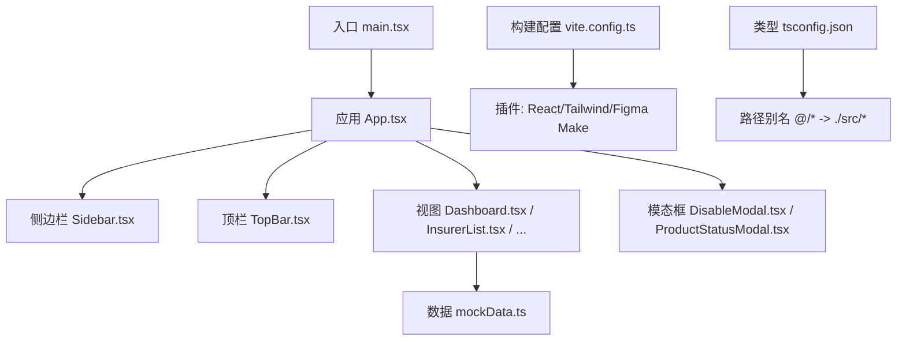
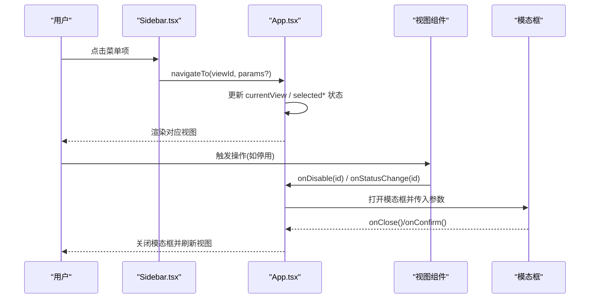
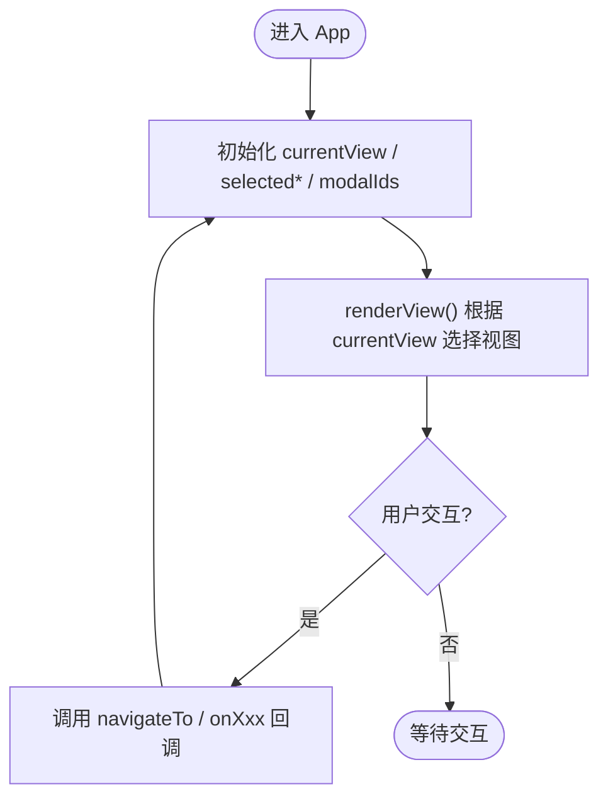
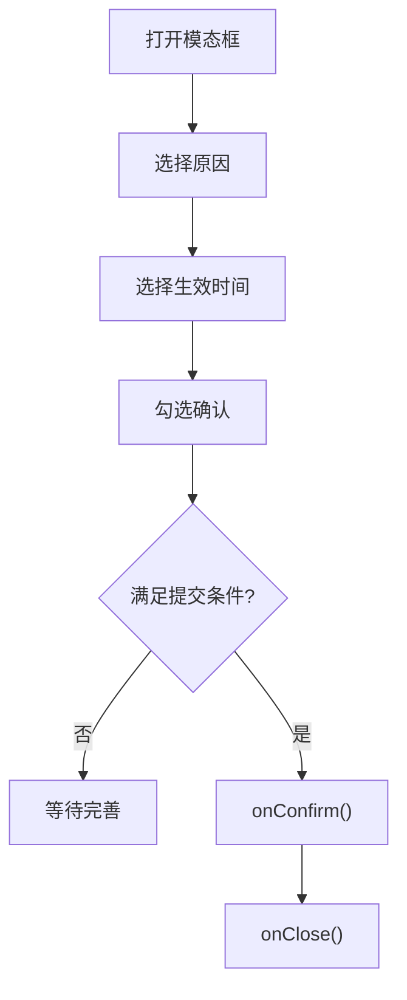
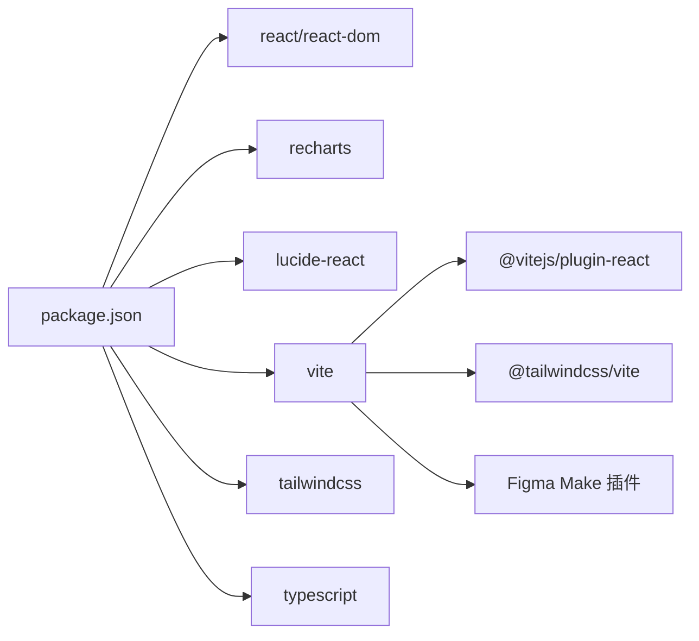

# 架构设计

<cite>
**本文引用的文件**
- [package.json](file://产品设计\UI-V1.0\package.json)
- [vite.config.ts](file://产品设计\UI-V1.0\vite.config.ts)
- [tsconfig.json](file://产品设计\UI-V1.0\tsconfig.json)
- [main.tsx](file://产品设计\UI-V1.0\src\main.tsx)
- [App.tsx](file://产品设计\UI-V1.0\src\App.tsx)
- [Sidebar.tsx](file://产品设计\UI-V1.0\src\components\Sidebar.tsx)
- [TopBar.tsx](file://产品设计\UI-V1.0\src\components\TopBar.tsx)
- [Dashboard.tsx](file://产品设计\UI-V1.0\src\views\Dashboard.tsx)
- [InsurerList.tsx](file://产品设计\UI-V1.0\src\views\InsurerList.tsx)
- [DisableModal.tsx](file://产品设计\UI-V1.0\src\components\DisableModal.tsx)
- [mockData.ts](file://产品设计\UI-V1.0\src\data\mockData.ts)
- [site.json](file://产品设计\UI-V1.0\.figma\make\site.json)
</cite>

## 目录
1. [简介](#简介)
2. [项目结构](#项目结构)
3. [核心组件](#核心组件)
4. [架构总览](#架构总览)
5. [详细组件分析](#详细组件分析)
6. [依赖关系分析](#依赖关系分析)
7. [性能与构建优化](#性能与构建优化)
8. [故障排查指南](#故障排查指南)
9. [结论](#结论)
10. [附录](#附录)

## 简介
本架构设计文档面向 OverInsurData 平台的前端工程，基于 React 19 + TypeScript + Vite 的现代化前端架构。文档从系统架构、模块划分、数据流、状态管理策略、路由机制、构建优化以及与 Figma Make 集成等方面展开，解释技术选型原因与权衡，并提供可视化图示帮助理解。

## 项目结构
项目采用“视图/组件/数据”分层组织：
- src/components：通用 UI 组件（侧边栏、顶栏、模态框等）
- src/views：页面级视图（仪表盘、保险公司列表、产品管理等）
- src/data：模拟数据与工具函数（用于原型与演示）
- 根配置：Vite、TypeScript、Figma Make 站点配置

图表来源
- [main.tsx:1-11](file://产品设计\UI-V1.0\src\main.tsx#L1-L11)
- [App.tsx:1-123](file://产品设计\UI-V1.0\src\App.tsx#L1-L123)
- [Sidebar.tsx:1-203](file://产品设计\UI-V1.0\src\components\Sidebar.tsx#L1-L203)
- [TopBar.tsx:1-135](file://产品设计\UI-V1.0\src\components\TopBar.tsx#L1-L135)
- [Dashboard.tsx:1-348](file://产品设计\UI-V1.0\src\views\Dashboard.tsx#L1-L348)
- [InsurerList.tsx:1-360](file://产品设计\UI-V1.0\src\views\InsurerList.tsx#L1-L360)
- [DisableModal.tsx:1-236](file://产品设计\UI-V1.0\src\components\DisableModal.tsx#L1-L236)
- [mockData.ts:1-444](file://产品设计\UI-V1.0\src\data\mockData.ts#L1-L444)
- [vite.config.ts:1-357](file://产品设计\UI-V1.0\vite.config.ts#L1-L357)
- [tsconfig.json:1-24](file://产品设计\UI-V1.0\tsconfig.json#L1-L24)

章节来源
- [package.json:1-30](file://产品设计\UI-V1.0\package.json#L1-L30)
- [vite.config.ts:1-43](file://产品设计\UI-V1.0\vite.config.ts#L1-L43)
- [tsconfig.json:1-24](file://产品设计\UI-V1.0\tsconfig.json#L1-L24)

## 核心组件
- 应用容器 App.tsx：集中维护当前视图、选中实体 ID、全局弹窗状态；通过 props 向下传递导航回调与事件回调，实现“状态提升”的轻量状态管理。
- 侧边栏 Sidebar.tsx：定义 ViewId 联合类型与导航分组，驱动视图切换。
- 顶栏 TopBar.tsx：根据当前视图渲染面包屑与标题，提供全局搜索与通知入口。
- 视图层：Dashboard、InsurerList 等页面组件负责业务展示与交互，使用本地 state 与 useMemo 进行过滤、排序、分页。
- 模态框：DisableModal、ProductStatusModal 等处理确认型操作，通过父组件状态控制显隐与回调。

章节来源
- [App.tsx:25-82](file://产品设计\UI-V1.0\src\App.tsx#L25-L82)
- [Sidebar.tsx:9-70](file://产品设计\UI-V1.0\src\components\Sidebar.tsx#L9-L70)
- [TopBar.tsx:4-30](file://产品设计\UI-V1.0\src\components\TopBar.tsx#L4-L30)
- [Dashboard.tsx:102-119](file://产品设计\UI-V1.0\src\views\Dashboard.tsx#L102-L119)
- [InsurerList.tsx:18-58](file://产品设计\UI-V1.0\src\views\InsurerList.tsx#L18-L58)
- [DisableModal.tsx:29-50](file://产品设计\UI-V1.0\src\components\DisableModal.tsx#L29-L50)

## 架构总览
整体采用“单页应用 + 内存路由”模式：以字符串 ViewId 作为路由标识，由 App 统一渲染对应视图。数据源为本地 mockData，后续可替换为 API 服务。样式采用 Tailwind CSS 4 + 自定义玻璃态风格。构建与开发体验由 Vite 及 Figma Make 插件增强。

图表来源
- [Sidebar.tsx:77-168](file://产品设计\UI-V1.0\src\components\Sidebar.tsx#L77-L168)
- [App.tsx:25-82](file://产品设计\UI-V1.0\src\App.tsx#L25-L82)
- [InsurerList.tsx:276-303](file://产品设计\UI-V1.0\src\views\InsurerList.tsx#L276-L303)
- [DisableModal.tsx:29-50](file://产品设计\UI-V1.0\src\components\DisableModal.tsx#L29-L50)

## 详细组件分析

### 应用容器与路由机制（App.tsx）
- 路由策略：使用字符串 ViewId 作为路由键，集中式 switch-case 渲染视图，避免引入第三方路由库，降低复杂度。
- 状态管理：采用“状态提升”，将跨视图共享的状态（当前视图、选中实体 ID、弹窗 ID）上移至 App，子组件通过 props 访问与回调。
- 导航行为：navigateTo 统一设置滚动位置与参数，保证一致的 UX。

图表来源
- [App.tsx:25-82](file://产品设计\UI-V1.0\src\App.tsx#L25-L82)

章节来源
- [App.tsx:25-82](file://产品设计\UI-V1.0\src\App.tsx#L25-L82)

### 侧边栏与导航（Sidebar.tsx）
- 导航模型：ViewId 联合类型约束所有可路由视图，确保类型安全。
- 分组与折叠：按业务域分组（保险公司管理、渠道管理），支持折叠与高亮当前项。
- 图标与标签：使用 lucide-react 图标，保持视觉一致性。

章节来源
- [Sidebar.tsx:9-70](file://产品设计\UI-V1.0\src\components\Sidebar.tsx#L9-L70)
- [Sidebar.tsx:77-168](file://产品设计\UI-V1.0\src\components\Sidebar.tsx#L77-L168)

### 顶栏与面包屑（TopBar.tsx）
- 面包屑映射：VIEW_LABELS 将 ViewId 映射到面包屑与标题，便于导航上下文表达。
- 全局能力：搜索输入、通知、帮助入口与用户头像占位。

章节来源
- [TopBar.tsx:4-30](file://产品设计\UI-V1.0\src\components\TopBar.tsx#L4-L30)
- [TopBar.tsx:37-132](file://产品设计\UI-V1.0\src\components\TopBar.tsx#L37-L132)

### 仪表盘（Dashboard.tsx）
- 数据聚合：计算 KPI 指标（保费、保单数、渠道数、佣金收入）。
- 图表展示：使用 recharts 绘制趋势线与市场份额饼图，提供自定义 Tooltip。
- 交互：筛选时间范围、导出报告、跳转至相关视图。

章节来源
- [Dashboard.tsx:13-18](file://产品设计\UI-V1.0\src\views\Dashboard.tsx#L13-L18)
- [Dashboard.tsx:102-119](file://产品设计\UI-V1.0\src\views\Dashboard.tsx#L102-L119)
- [Dashboard.tsx:153-222](file://产品设计\UI-V1.0\src\views\Dashboard.tsx#L153-L222)

### 保险公司列表（InsurerList.tsx）
- 本地状态：搜索、多条件筛选、排序、分页、多选批量操作。
- 性能优化：useMemo 缓存过滤与排序结果，减少重渲染开销。
- 交互：查看详情、编辑、停用/启用（触发父级模态框）、导入/导出。

```mermaid
flowchart TD
Input["输入搜索/筛选/排序"] --> Filter["useMemo 过滤"]
Filter --> Sort["useMemo 排序"]
Sort --> Page["分页切片"]
Page --> Render["渲染表格行"]
Render --> Action{"用户操作"}
Action --> |选择/全选| UpdateSel["更新 selected"]
Action --> |排序/翻页| UpdatePage["更新 page/sort"]
Action --> |停用| OnDisable["调用 onDisable"]
```

图表来源
- [InsurerList.tsx:18-58](file://产品设计\UI-V1.0\src\views\InsurerList.tsx#L18-L58)
- [InsurerList.tsx:60-71](file://产品设计\UI-V1.0\src\views\InsurerList.tsx#L60-L71)
- [InsurerList.tsx:276-303](file://产品设计\UI-V1.0\src\views\InsurerList.tsx#L276-L303)

章节来源
- [InsurerList.tsx:18-58](file://产品设计\UI-V1.0\src\views\InsurerList.tsx#L18-L58)
- [InsurerList.tsx:60-71](file://产品设计\UI-V1.0\src\views\InsurerList.tsx#L60-L71)
- [InsurerList.tsx:276-303](file://产品设计\UI-V1.0\src\views\InsurerList.tsx#L276-L303)

### 停用/启用模态框（DisableModal.tsx）
- 流程校验：必须选择原因、生效时间（立即或定时）、勾选确认方可提交。
- 影响预览：停用场景下展示关联产品、渠道、有效保单、在途报价、待结佣金等影响面。
- 交互：取消、确认提交，通过父组件回调关闭并执行后续逻辑。

图表来源
- [DisableModal.tsx:29-50](file://产品设计\UI-V1.0\src\components\DisableModal.tsx#L29-L50)
- [DisableModal.tsx:125-208](file://产品设计\UI-V1.0\src\components\DisableModal.tsx#L125-L208)
- [DisableModal.tsx:211-231](file://产品设计\UI-V1.0\src\components\DisableModal.tsx#L211-L231)

章节来源
- [DisableModal.tsx:29-50](file://产品设计\UI-V1.0\src\components\DisableModal.tsx#L29-L50)
- [DisableModal.tsx:125-208](file://产品设计\UI-V1.0\src\components\DisableModal.tsx#L125-L208)
- [DisableModal.tsx:211-231](file://产品设计\UI-V1.0\src\components\DisableModal.tsx#L211-L231)

### 数据模型与工具（mockData.ts）
- 领域模型：保险公司、产品、渠道、Appointment 等接口定义，覆盖关键业务字段。
- 示例数据：提供多家公司、产品、渠道、预约与活动数据，支撑界面演示。
- 工具函数：金额格式化、百分比格式化，统一展示格式。

章节来源
- [mockData.ts:1-84](file://产品设计\UI-V1.0\src\data\mockData.ts#L1-L84)
- [mockData.ts:86-347](file://产品设计\UI-V1.0\src\data\mockData.ts#L86-L347)
- [mockData.ts:349-444](file://产品设计\UI-V1.0\src\data\mockData.ts#L349-L444)

## 依赖关系分析
- 运行时依赖：React 19、ReactDOM 19、recharts（图表）、lucide-react（图标）。
- 开发依赖：Vite 8、@vitejs/plugin-react、Tailwind CSS 4、TypeScript 5、oxfmt 格式化。
- 构建与插件：
  - React 插件：启用 JSX 转换与 HMR。
  - Tailwind 插件：样式编译。
  - Figma Make 插件：注入站点元信息、错误覆盖回放、React Refresh 边界回退、故事集注册等。

图表来源
- [package.json:12-28](file://产品设计\UI-V1.0\package.json#L12-L28)
- [vite.config.ts:19-26](file://产品设计\UI-V1.0\vite.config.ts#L19-L26)

章节来源
- [package.json:12-28](file://产品设计\UI-V1.0\package.json#L12-L28)
- [vite.config.ts:19-26](file://产品设计\UI-V1.0\vite.config.ts#L19-L26)

## 性能与构建优化
- 构建产物：
  - 开发模式开启内联 sourcemap，生产模式关闭并启用压缩，减小体积。
  - base 支持 Figma 部署 URL，便于嵌入预览。
- 开发体验：
  - 错误覆盖回放：捕获最近构建错误并在新连接时重放，提升调试效率。
  - React Refresh 边界回退：当组件不再定义刷新边界时强制全量刷新，避免旧树残留。
  - 故事集注册：按需扫描 stories 并暴露给 Figma 预览脚本。
- 代码质量：
  - TypeScript 严格模式、路径别名 @/* 简化导入。
  - 使用 useMemo 对大数据集进行过滤与排序缓存，减少重复计算。
  - 列表分页与虚拟滚动可扩展方向（当前已实现分页）。

章节来源
- [vite.config.ts:13-43](file://产品设计\UI-V1.0\vite.config.ts#L13-L43)
- [vite.config.ts:228-296](file://产品设计\UI-V1.0\vite.config.ts#L228-L296)
- [vite.config.ts:309-356](file://产品设计\UI-V1.0\vite.config.ts#L309-L356)
- [tsconfig.json:1-24](file://产品设计\UI-V1.0\tsconfig.json#L1-L24)
- [InsurerList.tsx:31-53](file://产品设计\UI-V1.0\src\views\InsurerList.tsx#L31-L53)

## 故障排查指南
- 构建/预览问题：
  - 检查 .figma/make/site.json 是否包含 robots、accessibility 等必要字段。
  - 若出现 React Refresh 异常，确认组件是否仍保留刷新边界；必要时触发全量刷新。
- 运行时问题：
  - 视图未渲染：核对 App.tsx 中 currentView 是否在 switch-case 分支内。
  - 数据为空：确认 mockData.ts 是否被正确引入与引用。
- 样式问题：
  - Tailwind 类名是否正确；确认 @tailwindcss/vite 插件已启用。
- 调试技巧：
  - 使用浏览器开发者工具查看网络请求与 WebSocket 消息（HMR）。
  - 通过 console 输出关键状态变化，定位状态流转问题。

章节来源
- [site.json:1-10](file://产品设计\UI-V1.0\.figma\make\site.json#L1-L10)
- [vite.config.ts:228-296](file://产品设计\UI-V1.0\vite.config.ts#L228-L296)
- [App.tsx:39-82](file://产品设计\UI-V1.0\src\App.tsx#L39-L82)

## 结论
本项目采用简洁高效的“状态提升 + 内存路由”架构，配合 Vite 与 Figma Make 插件，实现了快速迭代与良好的开发体验。通过 TypeScript 强类型约束、Tailwind 原子化样式与 recharts 可视化，满足了保险管理平台的数据展示与交互需求。未来可在数据层引入 API 服务与状态管理库（如 Zustand/Redux Toolkit），进一步增强可测试性与扩展性。

## 附录
- 技术选型与权衡
  - React 19：最新特性与生态成熟度，长期支持。
  - TypeScript：类型安全与更好的 IDE 支持，降低维护成本。
  - Vite：极速开发与构建，插件生态丰富。
  - Tailwind CSS 4：原子化样式，灵活定制，与 Vite 深度集成。
  - Recharts：轻量图表库，适合复杂数据可视化。
  - Figma Make 插件：无缝对接设计与开发，提升协作效率。
- 与 Figma 集成方式
  - 站点元信息注入：title、description、robots、OG 标签等。
  - 错误覆盖回放与 React Refresh 回退：提升预览稳定性。
  - 故事集注册：供 Figma 预览脚本动态加载与渲染。