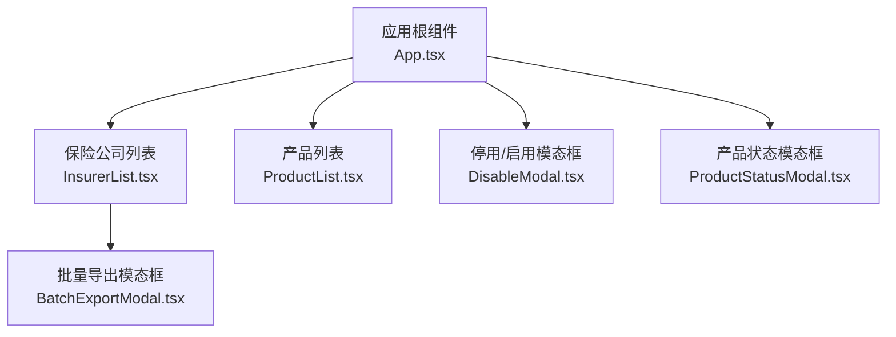
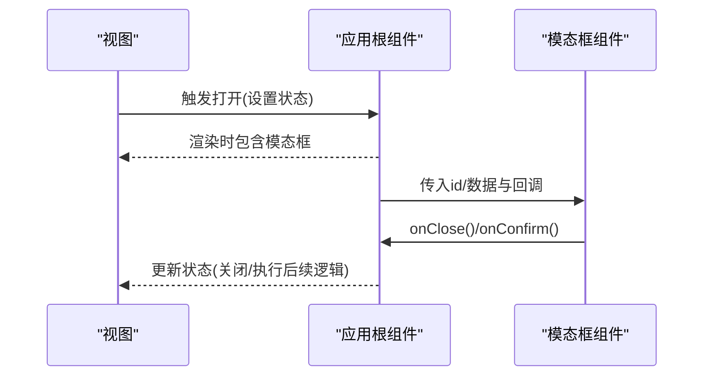
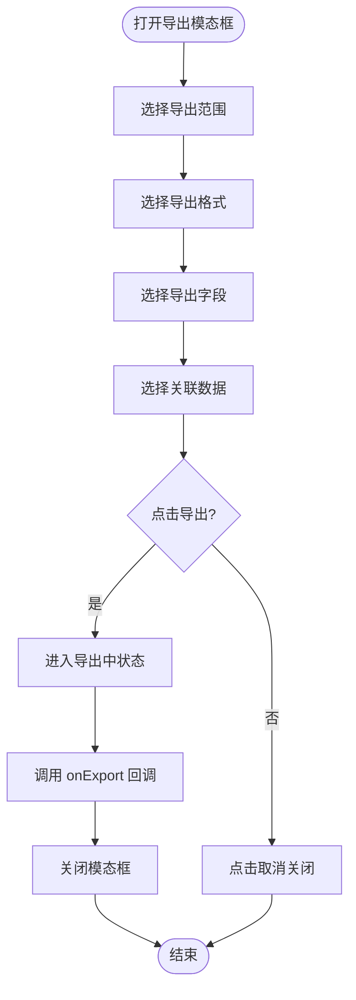
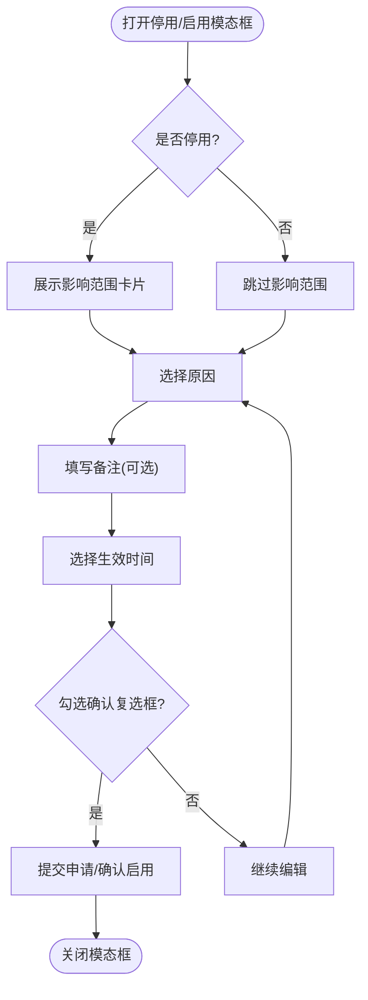
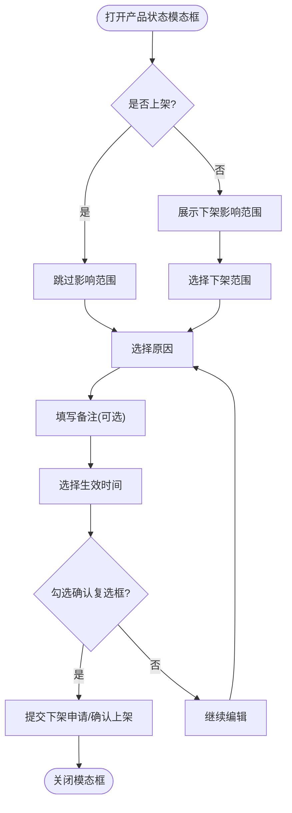
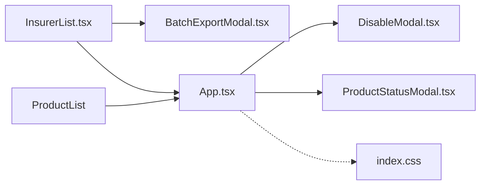

# 模态框组件模式

<cite>
**本文引用的文件**
- [BatchExportModal.tsx](file://产品方案/UI-V1.0/src/components/BatchExportModal.tsx)
- [DisableModal.tsx](file://产品方案/UI-V1.0/src/components/DisableModal.tsx)
- [ProductStatusModal.tsx](file://产品方案/UI-V1.0/src/components/ProductStatusModal.tsx)
- [App.tsx](file://产品方案/UI-V1.0/src/App.tsx)
- [index.css](file://产品方案/UI-V1.0/src/index.css)
- [InsurerList.tsx](file://产品方案/UI-V1.0/src/views/InsurerList.tsx)
- [ProductList.tsx](file://产品方案/UI-V1.0/src/views/ProductList.tsx)
</cite>

## 目录
1. [简介](#简介)
2. [项目结构](#项目结构)
3. [核心组件](#核心组件)
4. [架构总览](#架构总览)
5. [详细组件分析](#详细组件分析)
6. [依赖关系分析](#依赖关系分析)
7. [性能与可访问性](#性能与可访问性)
8. [故障排查指南](#故障排查指南)
9. [结论](#结论)
10. [附录：API参考与使用示例](#附录api参考与使用示例)

## 简介
本文件为 OverInsurData 平台提供“模态框组件模式”的统一设计说明，覆盖生命周期管理、遮罩层处理、键盘事件监听与焦点管理、不同场景的模态框类型（确认对话框、表单模态框、信息展示模态框）、状态控制、动画效果与响应式设计，以及复用策略与扩展方法。文档基于现有代码实现进行归纳总结，并给出可操作的实践建议。

## 项目结构
当前项目中已存在三类模态框组件，均由父级视图或应用根组件通过条件渲染挂载：
- 批量导出模态框：用于选择导出范围、格式、字段与关联数据
- 停用/启用保险公司模态框：用于高风险操作前的影响预览、原因选择、生效时间与确认
- 产品上架/下架模态框：用于产品状态变更的影响预览、范围选择、原因与生效时间

图表来源
- [App.tsx:114-119](file://产品方案/UI-V1.0/src/App.tsx#L114-L119)
- [InsurerList.tsx:107-109](file://产品方案/UI-V1.0/src/views/InsurerList.tsx#L107-L109)
- [ProductList.tsx:80-84](file://产品方案/UI-V1.0/src/views/ProductList.tsx#L80-L84)

章节来源
- [App.tsx:25-37](file://产品方案/UI-V1.0/src/App.tsx#L25-L37)
- [App.tsx:114-119](file://产品方案/UI-V1.0/src/App.tsx#L114-L119)
- [InsurerList.tsx:107-109](file://产品方案/UI-V1.0/src/views/InsurerList.tsx#L107-L109)
- [ProductList.tsx:80-84](file://产品方案/UI-V1.0/src/views/ProductList.tsx#L80-L84)

## 核心组件
- 批量导出模态框：负责导出范围、格式、字段勾选与关联数据选择，提供加载态与结果回调
- 停用/启用保险公司模态框：提供影响范围预览、原因选择、备注、生效时间（立即/定时）与二次确认
- 产品上架/下架模态框：提供下架影响范围、范围选择（全部/指定州）、原因、备注、生效时间与确认

这些组件均遵循统一的视觉风格（毛玻璃面板、圆角、阴影），并通过父组件的状态控制显示与关闭。

章节来源
- [BatchExportModal.tsx:42-56](file://产品方案/UI-V1.0/src/components/BatchExportModal.tsx#L42-L56)
- [DisableModal.tsx:29-49](file://产品方案/UI-V1.0/src/components/DisableModal.tsx#L29-L49)
- [ProductStatusModal.tsx:29-43](file://产品方案/UI-V1.0/src/components/ProductStatusModal.tsx#L29-L43)

## 架构总览
模态框采用“受控式”模式：父组件持有是否显示的布尔状态与上下文数据（如ID），通过 props 传递给子组件；子组件通过回调函数通知父组件更新状态。

图表来源
- [App.tsx:114-119](file://产品方案/UI-V1.0/src/App.tsx#L114-L119)
- [InsurerList.tsx:107-109](file://产品方案/UI-V1.0/src/views/InsurerList.tsx#L107-L109)
- [ProductList.tsx:80-84](file://产品方案/UI-V1.0/src/views/ProductList.tsx#L80-L84)

## 详细组件分析

### 批量导出模态框（BatchExportModal）
- 职责：配置导出范围（筛选结果/已选/全部）、导出格式（xlsx/csv）、字段勾选、关联数据勾选，并提供导出动作
- 状态：范围、格式、字段集合、关联数据集合、导出中标志
- 交互：点击遮罩关闭；底部按钮支持取消与导出；导出过程有加载态
- 样式：固定定位全屏遮罩 + 毛玻璃面板；内容区滚动；底部操作栏

图表来源
- [BatchExportModal.tsx:42-56](file://产品方案/UI-V1.0/src/components/BatchExportModal.tsx#L42-L56)
- [BatchExportModal.tsx:58-183](file://产品方案/UI-V1.0/src/components/BatchExportModal.tsx#L58-L183)

章节来源
- [BatchExportModal.tsx:42-56](file://产品方案/UI-V1.0/src/components/BatchExportModal.tsx#L42-L56)
- [BatchExportModal.tsx:58-183](file://产品方案/UI-V1.0/src/components/BatchExportModal.tsx#L58-L183)

### 停用/启用保险公司模态框（DisableModal）
- 职责：在高风险操作前展示影响范围、收集原因、备注、生效时间，并要求二次确认
- 状态：原因、备注、生效时间（立即/定时）、未来日期、确认复选框
- 交互：点击遮罩关闭；根据是否停用动态切换标题与颜色；提交前校验必填项
- 样式：顶部区域根据操作类型着色；影响范围卡片突出风险；底部操作栏右对齐

图表来源
- [DisableModal.tsx:29-49](file://产品方案/UI-V1.0/src/components/DisableModal.tsx#L29-L49)
- [DisableModal.tsx:98-123](file://产品方案/UI-V1.0/src/components/DisableModal.tsx#L98-L123)
- [DisableModal.tsx:125-208](file://产品方案/UI-V1.0/src/components/DisableModal.tsx#L125-L208)
- [DisableModal.tsx:211-231](file://产品方案/UI-V1.0/src/components/DisableModal.tsx#L211-L231)

章节来源
- [DisableModal.tsx:29-49](file://产品方案/UI-V1.0/src/components/DisableModal.tsx#L29-L49)
- [DisableModal.tsx:98-123](file://产品方案/UI-V1.0/src/components/DisableModal.tsx#L98-L123)
- [DisableModal.tsx:125-208](file://产品方案/UI-V1.0/src/components/DisableModal.tsx#L125-L208)
- [DisableModal.tsx:211-231](file://产品方案/UI-V1.0/src/components/DisableModal.tsx#L211-L231)

### 产品上架/下架模态框（ProductStatusModal）
- 职责：在产品状态变更前展示影响范围、范围选择（全部/指定州）、原因、备注、生效时间与确认
- 状态：原因、范围、备注、生效时间、未来日期、确认复选框
- 交互：点击遮罩关闭；下架时展示影响范围卡片；提交前校验必填项
- 样式：顶部区域根据操作类型着色；影响范围卡片突出风险；底部操作栏右对齐

图表来源
- [ProductStatusModal.tsx:29-43](file://产品方案/UI-V1.0/src/components/ProductStatusModal.tsx#L29-L43)
- [ProductStatusModal.tsx:76-100](file://产品方案/UI-V1.0/src/components/ProductStatusModal.tsx#L76-L100)
- [ProductStatusModal.tsx:102-122](file://产品方案/UI-V1.0/src/components/ProductStatusModal.tsx#L102-L122)
- [ProductStatusModal.tsx:124-181](file://产品方案/UI-V1.0/src/components/ProductStatusModal.tsx#L124-L181)
- [ProductStatusModal.tsx:184-201](file://产品方案/UI-V1.0/src/components/ProductStatusModal.tsx#L184-L201)

章节来源
- [ProductStatusModal.tsx:29-43](file://产品方案/UI-V1.0/src/components/ProductStatusModal.tsx#L29-L43)
- [ProductStatusModal.tsx:76-100](file://产品方案/UI-V1.0/src/components/ProductStatusModal.tsx#L76-L100)
- [ProductStatusModal.tsx:102-122](file://产品方案/UI-V1.0/src/components/ProductStatusModal.tsx#L102-L122)
- [ProductStatusModal.tsx:124-181](file://产品方案/UI-V1.0/src/components/ProductStatusModal.tsx#L124-L181)
- [ProductStatusModal.tsx:184-201](file://产品方案/UI-V1.0/src/components/ProductStatusModal.tsx#L184-L201)

## 依赖关系分析
- 父组件状态管理：App.tsx 通过状态变量控制模态框的显示与关闭，并将必要参数（如ID）传递给子组件
- 视图触发：InsurerList.tsx 和 ProductList.tsx 通过回调将打开模态框的事件上报给 App.tsx
- 样式依赖：统一使用 index.css 中的毛玻璃类名与主题变量，确保一致的视觉体验

图表来源
- [App.tsx:114-119](file://产品方案/UI-V1.0/src/App.tsx#L114-L119)
- [InsurerList.tsx:107-109](file://产品方案/UI-V1.0/src/views/InsurerList.tsx#L107-L109)
- [ProductList.tsx:80-84](file://产品方案/UI-V1.0/src/views/ProductList.tsx#L80-L84)
- [index.css:64-86](file://产品方案/UI-V1.0/src/index.css#L64-L86)

章节来源
- [App.tsx:114-119](file://产品方案/UI-V1.0/src/App.tsx#L114-L119)
- [InsurerList.tsx:107-109](file://产品方案/UI-V1.0/src/views/InsurerList.tsx#L107-L109)
- [ProductList.tsx:80-84](file://产品方案/UI-V1.0/src/views/ProductList.tsx#L80-L84)
- [index.css:64-86](file://产品方案/UI-V1.0/src/index.css#L64-L86)

## 性能与可访问性
- 性能
  - 条件渲染：仅在需要时挂载模态框，避免不必要的重渲染
  - 本地状态：各模态框内部使用局部状态管理交互，减少父组件负担
  - 样式优化：使用 CSS 变量与毛玻璃效果，提升视觉层次的同时保持轻量
- 可访问性（现状与建议）
  - 现状：遮罩层通过点击外部关闭；未实现 ESC 键关闭与焦点陷阱
  - 建议：增加键盘事件监听（ESC 关闭）、焦点管理（首次聚焦到标题或第一个输入）、ARIA 属性（role="dialog"、aria-modal="true"、aria-labelledby）以提升无障碍体验

[本节为通用指导，不直接分析具体文件]

## 故障排查指南
- 模态框无法关闭
  - 检查父组件是否正确维护显示状态并在回调中重置
  - 确认遮罩层点击事件绑定正确
- 表单校验失败导致无法提交
  - 核对必填项（原因、生效时间、确认复选框）是否满足
  - 查看禁用按钮的条件表达式
- 样式异常
  - 确认全局样式文件已引入，且使用了正确的毛玻璃类名
  - 检查浏览器对 backdrop-filter 的支持情况

章节来源
- [App.tsx:114-119](file://产品方案/UI-V1.0/src/App.tsx#L114-L119)
- [DisableModal.tsx:211-231](file://产品方案/UI-V1.0/src/components/DisableModal.tsx#L211-L231)
- [ProductStatusModal.tsx:184-201](file://产品方案/UI-V1.0/src/components/ProductStatusModal.tsx#L184-L201)
- [index.css:64-86](file://产品方案/UI-V1.0/src/index.css#L64-L86)

## 结论
当前项目的模态框采用统一的受控式模式与一致的视觉风格，覆盖了导出配置、高风险操作确认与产品状态变更等典型场景。建议在后续迭代中补充键盘事件监听与焦点管理，进一步提升可访问性与用户体验。

[本节为总结，不直接分析具体文件]

## 附录：API参考与使用示例

### 批量导出模态框（BatchExportModal）
- Props
  - totalCount: number — 总记录数
  - selectedCount: number — 已选记录数
  - filteredCount: number — 当前筛选结果数量
  - onClose: () => void — 关闭回调
  - onExport: () => void — 导出完成回调
- 行为
  - 点击遮罩或取消按钮关闭
  - 导出过程中显示加载态，完成后调用 onExport 并关闭
- 使用示例
  - 在列表页中通过状态控制显示，并在导出完成后刷新数据或提示用户

章节来源
- [BatchExportModal.tsx:4-10](file://产品方案/UI-V1.0/src/components/BatchExportModal.tsx#L4-L10)
- [BatchExportModal.tsx:42-56](file://产品方案/UI-V1.0/src/components/BatchExportModal.tsx#L42-L56)
- [InsurerList.tsx:107-109](file://产品方案/UI-V1.0/src/views/InsurerList.tsx#L107-L109)

### 停用/启用保险公司模态框（DisableModal）
- Props
  - insurerId: string — 目标保险公司ID
  - onClose: () => void — 关闭回调
  - onConfirm: () => void — 确认提交回调
- 行为
  - 根据当前状态决定标题与颜色
  - 停用时展示影响范围卡片
  - 提交前需选择原因、生效时间并勾选确认
- 使用示例
  - 在保险公司列表或详情页触发，确认后执行停用/启用流程

章节来源
- [DisableModal.tsx:5-9](file://产品方案/UI-V1.0/src/components/DisableModal.tsx#L5-L9)
- [DisableModal.tsx:29-49](file://产品方案/UI-V1.0/src/components/DisableModal.tsx#L29-L49)
- [DisableModal.tsx:98-123](file://产品方案/UI-V1.0/src/components/DisableModal.tsx#L98-L123)
- [DisableModal.tsx:211-231](file://产品方案/UI-V1.0/src/components/DisableModal.tsx#L211-L231)

### 产品上架/下架模态框（ProductStatusModal）
- Props
  - productId: string — 目标产品ID
  - onClose: () => void — 关闭回调
  - onConfirm: () => void — 确认提交回调
- 行为
  - 下架时展示影响范围卡片
  - 可选择下架范围（全部/指定州）
  - 提交前需选择原因、生效时间并勾选确认
- 使用示例
  - 在产品列表或详情页触发，确认后执行上架/下架流程

章节来源
- [ProductStatusModal.tsx:5-9](file://产品方案/UI-V1.0/src/components/ProductStatusModal.tsx#L5-L9)
- [ProductStatusModal.tsx:29-43](file://产品方案/UI-V1.0/src/components/ProductStatusModal.tsx#L29-L43)
- [ProductStatusModal.tsx:76-100](file://产品方案/UI-V1.0/src/components/ProductStatusModal.tsx#L76-L100)
- [ProductStatusModal.tsx:102-122](file://产品方案/UI-V1.0/src/components/ProductStatusModal.tsx#L102-L122)
- [ProductStatusModal.tsx:184-201](file://产品方案/UI-V1.0/src/components/ProductStatusModal.tsx#L184-L201)

### 统一设计模式要点
- 生命周期管理
  - 由父组件控制显示与关闭，子组件仅负责交互与回调
- 遮罩层处理
  - 固定定位全屏遮罩，点击外部关闭
- 键盘事件监听与焦点管理（建议）
  - 增加 ESC 键关闭
  - 首次聚焦到标题或首个输入
  - 限制 Tab 循环在模态框内
- 状态控制
  - 使用局部状态管理表单与交互
  - 提交前进行必填项校验
- 动画效果
  - 使用 CSS 过渡与毛玻璃效果提升质感
- 响应式设计
  - 使用百分比宽度与滚动容器适配不同屏幕尺寸

[本节为通用指导，不直接分析具体文件]