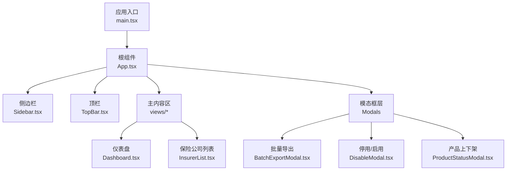
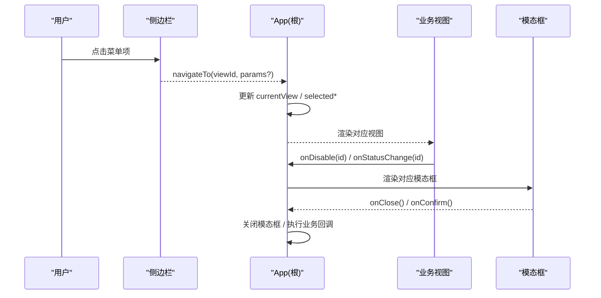
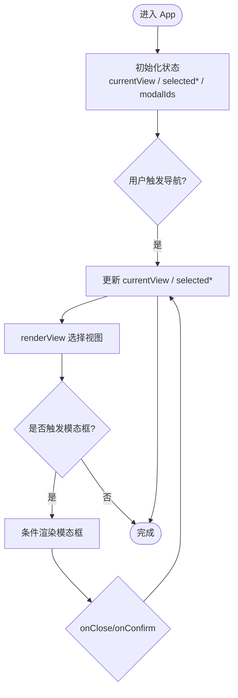
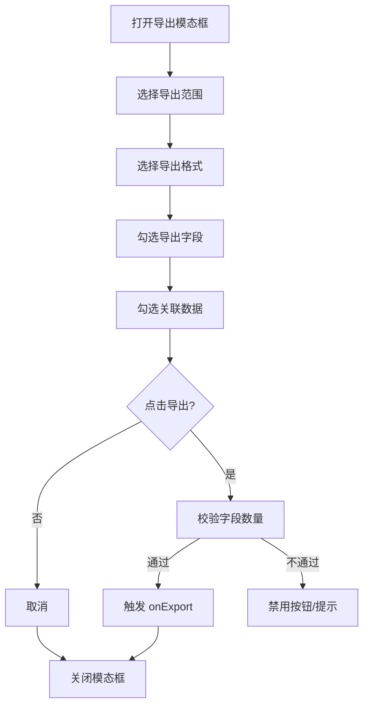
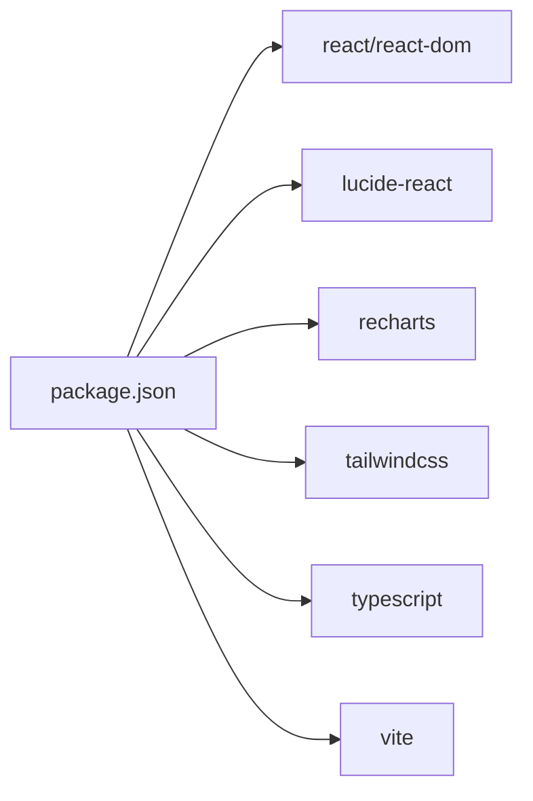
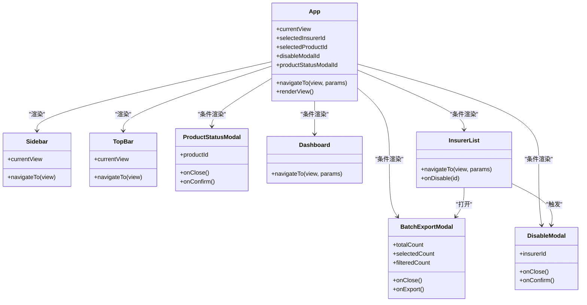

# 组件架构设计

<cite>
**本文引用的文件**
- [main.tsx](file://产品方案/UI-V1.0/src/main.tsx)
- [App.tsx](file://产品方案/UI-V1.0/src/App.tsx)
- [Sidebar.tsx](file://产品方案/UI-V1.0/src/components/Sidebar.tsx)
- [TopBar.tsx](file://产品方案/UI-V1.0/src/components/TopBar.tsx)
- [BatchExportModal.tsx](file://产品方案/UI-V1.0/src/components/BatchExportModal.tsx)
- [DisableModal.tsx](file://产品方案/UI-V1.0/src/components/DisableModal.tsx)
- [ProductStatusModal.tsx](file://产品方案/UI-V1.0/src/components/ProductStatusModal.tsx)
- [Dashboard.tsx](file://产品方案/UI-V1.0/src/views/Dashboard.tsx)
- [InsurerList.tsx](file://产品方案/UI-V1.0/src/views/InsurerList.tsx)
- [package.json](file://产品方案/UI-V1.0/package.json)
</cite>

## 目录
1. [简介](#简介)
2. [项目结构](#项目结构)
3. [核心组件](#核心组件)
4. [架构总览](#架构总览)
5. [详细组件分析](#详细组件分析)
6. [依赖关系分析](#依赖关系分析)
7. [性能考量](#性能考量)
8. [故障排查指南](#故障排查指南)
9. [结论](#结论)
10. [附录](#附录)

## 简介
本文件为 OverInsurData 平台的组件架构设计文档，聚焦基于 React 函数组件的组件化设计模式。内容涵盖：
- 组件层次结构与职责划分（通用组件 vs 业务组件）
- 组件间通信机制与状态提升策略
- 模态框组件的设计模式与生命周期管理
- Props 接口设计与事件处理机制
- 错误边界与健壮性建议
- 组件关系图与最佳实践指南

## 项目结构
项目采用“视图层 + 通用组件”的分层组织方式：
- 入口与根容器：main.tsx 挂载 App；App.tsx 负责全局路由、布局与跨视图状态
- 通用组件：Sidebar、TopBar、各类 Modal（批量导出、停用/启用、产品上下架）
- 业务视图：Dashboard、InsurerList 等页面级组件
- 数据与样式：mockData、index.css、Tailwind 类名与内联样式结合

图表来源
- [main.tsx:1-11](file://产品方案/UI-V1.0/src/main.tsx#L1-L11)
- [App.tsx:25-122](file://产品方案/UI-V1.0/src/App.tsx#L25-L122)
- [Sidebar.tsx:72-203](file://产品方案/UI-V1.0/src/components/Sidebar.tsx#L72-L203)
- [TopBar.tsx:32-135](file://产品方案/UI-V1.0/src/components/TopBar.tsx#L32-L135)
- [BatchExportModal.tsx:4-186](file://产品方案/UI-V1.0/src/components/BatchExportModal.tsx#L4-L186)
- [DisableModal.tsx:5-236](file://产品方案/UI-V1.0/src/components/DisableModal.tsx#L5-L236)
- [ProductStatusModal.tsx:5-206](file://产品方案/UI-V1.0/src/components/ProductStatusModal.tsx#L5-L206)
- [Dashboard.tsx:9-348](file://产品方案/UI-V1.0/src/views/Dashboard.tsx#L9-L348)
- [InsurerList.tsx:10-360](file://产品方案/UI-V1.0/src/views/InsurerList.tsx#L10-L360)

章节来源
- [main.tsx:1-11](file://产品方案/UI-V1.0/src/main.tsx#L1-L11)
- [App.tsx:25-122](file://产品方案/UI-V1.0/src/App.tsx#L25-L122)

## 核心组件
- 根容器 App
  - 职责：统一导航、布局、全局状态（当前视图、选中实体、模态框开关）
  - 关键能力：navigateTo 路由跳转、集中式模态框控制
- 侧边栏 Sidebar
  - 职责：导航分组、高亮当前视图、折叠展开
  - 通信：接收 currentView/navigateTo，触发 navigateTo(viewId)
- 顶栏 TopBar
  - 职责：面包屑、标题、全局搜索、通知、帮助入口
  - 通信：读取 currentView，调用 navigateTo('dashboard')
- 模态框族
  - BatchExportModal：配置导出范围、格式、字段、关联数据
  - DisableModal：保险公司停用/启用的原因、影响面、生效时间、确认
  - ProductStatusModal：产品上架/下架的原因、范围、生效时间、确认
- 业务视图
  - Dashboard：KPI、图表、待办、近期活动
  - InsurerList：筛选、排序、分页、多选、批量操作、打开导出模态框

章节来源
- [App.tsx:25-122](file://产品方案/UI-V1.0/src/App.tsx#L25-L122)
- [Sidebar.tsx:72-203](file://产品方案/UI-V1.0/src/components/Sidebar.tsx#L72-L203)
- [TopBar.tsx:32-135](file://产品方案/UI-V1.0/src/components/TopBar.tsx#L32-L135)
- [BatchExportModal.tsx:4-186](file://产品方案/UI-V1.0/src/components/BatchExportModal.tsx#L4-L186)
- [DisableModal.tsx:5-236](file://产品方案/UI-V1.0/src/components/DisableModal.tsx#L5-L236)
- [ProductStatusModal.tsx:5-206](file://产品方案/UI-V1.0/src/components/ProductStatusModal.tsx#L5-L206)
- [Dashboard.tsx:9-348](file://产品方案/UI-V1.0/src/views/Dashboard.tsx#L9-L348)
- [InsurerList.tsx:10-360](file://产品方案/UI-V1.0/src/views/InsurerList.tsx#L10-L360)

## 架构总览
整体采用“父组件集中状态 + 子组件受控渲染”的模式：
- 状态提升：App 持有 currentView、selected 实体 ID、模态框开关；通过 props 下传
- 单向数据流：子组件通过回调（如 navigateTo、onClose、onConfirm）向上传递事件
- 模态框即插即用：由 App 根据条件渲染，避免在子组件中维护全局可见性

图表来源
- [App.tsx:25-122](file://产品方案/UI-V1.0/src/App.tsx#L25-L122)
- [Sidebar.tsx:72-203](file://产品方案/UI-V1.0/src/components/Sidebar.tsx#L72-L203)
- [InsurerList.tsx:10-360](file://产品方案/UI-V1.0/src/views/InsurerList.tsx#L10-L360)
- [BatchExportModal.tsx:4-186](file://产品方案/UI-V1.0/src/components/BatchExportModal.tsx#L4-L186)
- [DisableModal.tsx:5-236](file://产品方案/UI-V1.0/src/components/DisableModal.tsx#L5-L236)
- [ProductStatusModal.tsx:5-206](file://产品方案/UI-V1.0/src/components/ProductStatusModal.tsx#L5-L206)

## 详细组件分析

### 根组件 App：路由与全局状态中枢
- 状态设计
  - currentView：当前视图标识（ViewId）
  - selectedInsurerId / selectedProductId：当前选中实体的 ID
  - disableModalId / productStatusModalId：模态框显示控制
- 导航流程
  - navigateTo 统一设置参数并滚动到顶部
  - renderView 根据 currentView 选择具体视图
- 模态框控制
  - 通过条件渲染控制 DisableModal 与 ProductStatusModal 的显隐
  - 提供 onClose/onConfirm 回调以关闭或执行业务逻辑

图表来源
- [App.tsx:25-122](file://产品方案/UI-V1.0/src/App.tsx#L25-L122)

章节来源
- [App.tsx:25-122](file://产品方案/UI-V1.0/src/App.tsx#L25-L122)

### 侧边栏 Sidebar：导航与分组
- Props 接口
  - currentView：用于高亮当前项
  - navigateTo：回调，携带 ViewId
- 交互逻辑
  - 分组折叠/展开
  - 点击子项调用 navigateTo
- 类型安全
  - 使用 ViewId 联合类型约束所有可导航视图

章节来源
- [Sidebar.tsx:72-203](file://产品方案/UI-V1.0/src/components/Sidebar.tsx#L72-L203)

### 顶栏 TopBar：面包屑与全局操作
- Props 接口
  - currentView：映射为面包屑与标题
  - navigateTo：返回总览页
- 行为
  - 根据 currentView 查找 VIEW_LABELS 生成面包屑
  - 右侧提供搜索、通知、帮助、头像入口

章节来源
- [TopBar.tsx:32-135](file://产品方案/UI-V1.0/src/components/TopBar.tsx#L32-L135)

### 批量导出模态框 BatchExportModal：配置化导出
- Props 接口
  - totalCount / selectedCount / filteredCount：统计信息
  - onClose / onExport：关闭与执行导出
- 内部状态
  - scope：导出范围（全部/已选/筛选结果）
  - format：xlsx/csv
  - fields：字段勾选集合
  - related：关联数据勾选
  - exporting：导出中状态
- 交互流程
  - 选择范围与格式 → 勾选字段 → 可选关联数据 → 导出

图表来源
- [BatchExportModal.tsx:4-186](file://产品方案/UI-V1.0/src/components/BatchExportModal.tsx#L4-L186)

章节来源
- [BatchExportModal.tsx:4-186](file://产品方案/UI-V1.0/src/components/BatchExportModal.tsx#L4-L186)

### 停用/启用模态框 DisableModal：高风险操作确认
- Props 接口
  - insurerId：目标保险公司 ID
  - onClose / onConfirm：关闭与确认提交
- 内部状态
  - reason：停用/启用原因
  - note：备注
  - effectDate：立即/定时
  - futureDate：定时日期
  - confirmed：二次确认复选框
- 行为要点
  - 区分停用/启用场景，展示不同影响面
  - 必填校验：原因、生效时间、确认复选框
  - 按钮禁用：未满足条件时不可提交

章节来源
- [DisableModal.tsx:5-236](file://产品方案/UI-V1.0/src/components/DisableModal.tsx#L5-L236)

### 产品上下架模态框 ProductStatusModal：合规与范围控制
- Props 接口
  - productId：目标产品 ID
  - onClose / onConfirm：关闭与确认提交
- 内部状态
  - reason：上架/下架原因
  - scope：全部可售州/指定州（仅下架）
  - note：备注
  - effectDate/futureDate：生效时间
  - confirmed：二次确认复选框
- 行为要点
  - 下架时展示影响面与范围选择
  - 严格校验后允许提交

章节来源
- [ProductStatusModal.tsx:5-206](file://产品方案/UI-V1.0/src/components/ProductStatusModal.tsx#L5-L206)

### 业务视图：Dashboard 与 InsurerList
- Dashboard
  - 展示 KPI、保费趋势、市场份额、待办事项、近期活动
  - 通过 navigateTo 跳转到各业务视图
- InsurerList
  - 支持搜索、多条件筛选、排序、分页、多选
  - 打开批量导出模态框
  - 通过 onDisable 触发停用/启用模态框

章节来源
- [Dashboard.tsx:9-348](file://产品方案/UI-V1.0/src/views/Dashboard.tsx#L9-L348)
- [InsurerList.tsx:10-360](file://产品方案/UI-V1.0/src/views/InsurerList.tsx#L10-L360)

## 依赖关系分析
- 运行时依赖
  - React、React DOM：UI 框架
  - lucide-react：图标库
  - recharts：图表库
- 构建与开发
  - Vite、TypeScript、Tailwind CSS、oxfmt

图表来源
- [package.json:1-30](file://产品方案/UI-V1.0/package.json#L1-L30)

章节来源
- [package.json:1-30](file://产品方案/UI-V1.0/package.json#L1-L30)

## 性能考量
- 列表与筛选
  - 使用 useMemo 缓存筛选与排序结果，减少重复计算
  - 分页加载，降低首屏渲染压力
- 图表渲染
  - 使用 ResponsiveContainer 自适应尺寸，按需重绘
- 模态框
  - 条件渲染，避免不必要的 DOM 开销
  - 导出前进行最小化校验，减少无效请求
- 样式与主题
  - 使用 Tailwind 原子类与少量内联样式，兼顾灵活性与可维护性

[本节为通用指导，不直接分析具体文件]

## 故障排查指南
- 模态框无法关闭
  - 检查父组件是否正确传递 onClose 回调并在模态框中调用
  - 确认外部点击遮罩层的关闭逻辑未被阻止
- 导航无效
  - 检查 navigateTo 是否被正确传入子组件
  - 确认 currentView 变更是否触发重新渲染
- 表单提交被禁用
  - 检查必填字段与确认复选框是否满足条件
  - 核对 effectDate 与 futureDate 的联动逻辑
- 列表筛选/排序异常
  - 检查 useMemo 的依赖数组是否完整
  - 确认 sortKey 与数据类型一致（数值/字符串）

章节来源
- [DisableModal.tsx:5-236](file://产品方案/UI-V1.0/src/components/DisableModal.tsx#L5-L236)
- [ProductStatusModal.tsx:5-206](file://产品方案/UI-V1.0/src/components/ProductStatusModal.tsx#L5-L206)
- [InsurerList.tsx:10-360](file://产品方案/UI-V1.0/src/views/InsurerList.tsx#L10-L360)

## 结论
本项目采用清晰的“根组件集中状态 + 子组件受控渲染”的架构，配合统一的导航与模态框管理模式，实现了良好的可维护性与扩展性。通过严格的 Props 接口与事件回调，保证了组件间的松耦合与高内聚。后续可在以下方面持续优化：
- 引入错误边界，提升容错能力
- 将复杂表单与表格抽象为可复用基础组件
- 增加单元测试与集成测试，保障质量

[本节为总结性内容，不直接分析具体文件]

## 附录

### 组件关系图（代码级）

图表来源
- [App.tsx:25-122](file://产品方案/UI-V1.0/src/App.tsx#L25-L122)
- [Sidebar.tsx:72-203](file://产品方案/UI-V1.0/src/components/Sidebar.tsx#L72-L203)
- [TopBar.tsx:32-135](file://产品方案/UI-V1.0/src/components/TopBar.tsx#L32-L135)
- [BatchExportModal.tsx:4-186](file://产品方案/UI-V1.0/src/components/BatchExportModal.tsx#L4-L186)
- [DisableModal.tsx:5-236](file://产品方案/UI-V1.0/src/components/DisableModal.tsx#L5-L236)
- [ProductStatusModal.tsx:5-206](file://产品方案/UI-V1.0/src/components/ProductStatusModal.tsx#L5-L206)
- [Dashboard.tsx:9-348](file://产品方案/UI-V1.0/src/views/Dashboard.tsx#L9-L348)
- [InsurerList.tsx:10-360](file://产品方案/UI-V1.0/src/views/InsurerList.tsx#L10-L360)

### 最佳实践指南
- 组件职责单一
  - 通用组件只关注 UI 与交互，业务逻辑尽量上提
- 受控组件与回调
  - 所有可变状态由父组件管理，子组件通过 props 与回调通信
- 类型安全
  - 使用 TypeScript 定义 Props 与枚举类型（如 ViewId），减少运行时错误
- 可访问性与一致性
  - 保持键盘可达、焦点管理与语义化标签
  - 统一按钮、输入框、徽章等视觉风格
- 错误边界
  - 为关键视图或第三方组件包裹错误边界，防止白屏
- 性能优化
  - 合理使用 useMemo/useCallback，避免不必要重渲染
  - 大数据列表采用虚拟滚动或分页

[本节为通用指导，不直接分析具体文件]