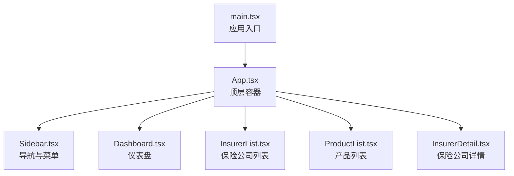
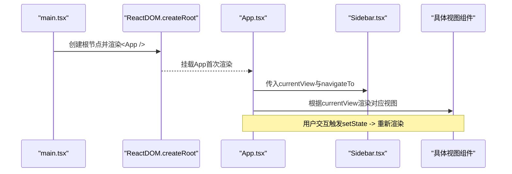
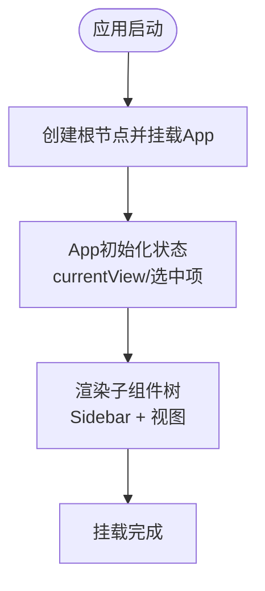
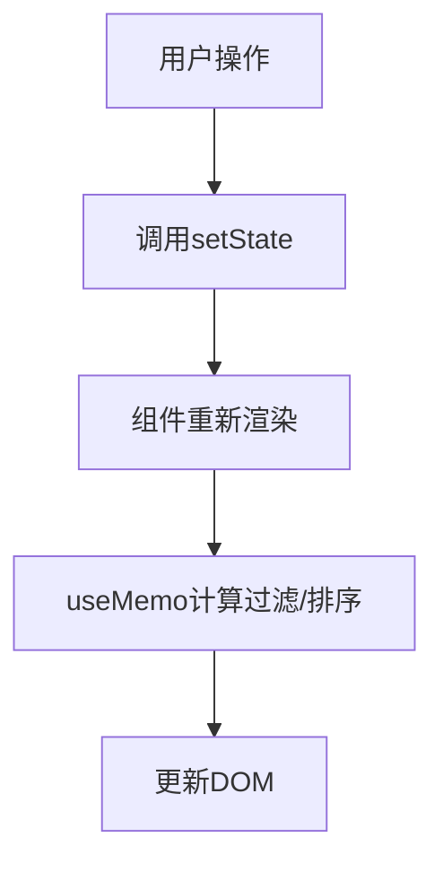
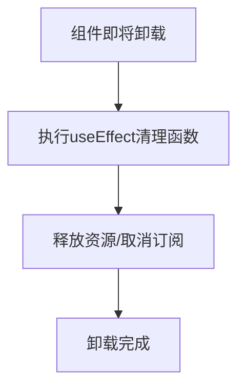
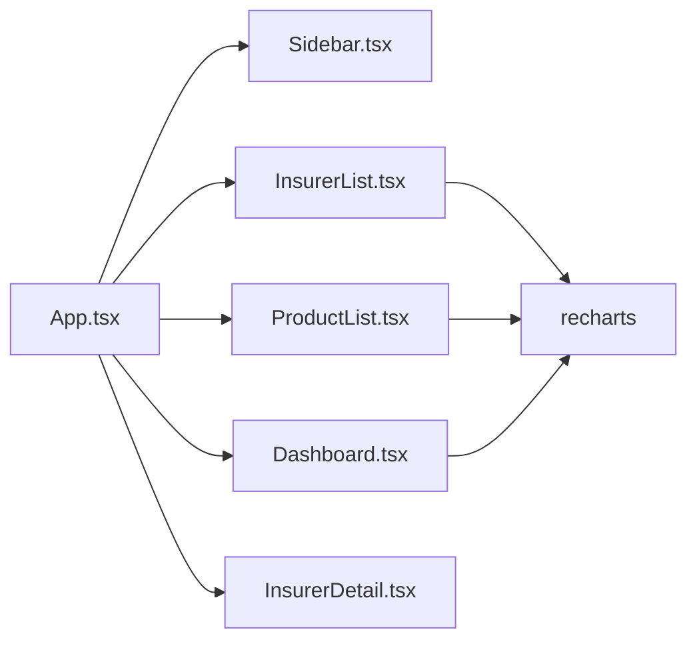

# 组件生命周期管理

<cite>
**本文引用的文件**
- [src/main.tsx](file://产品方案/UI-V1.0/src/main.tsx)
- [src/App.tsx](file://产品方案/UI-V1.0/src/App.tsx)
- [src/components/Sidebar.tsx](file://产品方案/UI-V1.0/src/components/Sidebar.tsx)
- [src/views/InsurerList.tsx](file://产品方案/UI-V1.0/src/views/InsurerList.tsx)
- [src/views/ProductList.tsx](file://产品方案/UI-V1.0/src/views/ProductList.tsx)
- [src/views/Dashboard.tsx](file://产品方案/UI-V1.0/src/views/Dashboard.tsx)
- [src/views/InsurerDetail.tsx](file://产品方案/UI-V1.0/src/views/InsurerDetail.tsx)
- [package.json](file://产品方案/UI-V1.0/package.json)
</cite>

## 目录
1. [简介](#简介)
2. [项目结构](#项目结构)
3. [核心组件](#核心组件)
4. [架构总览](#架构总览)
5. [详细组件分析](#详细组件分析)
6. [依赖关系分析](#依赖关系分析)
7. [性能考虑](#性能考虑)
8. [故障排查指南](#故障排查指南)
9. [结论](#结论)
10. [附录](#附录)

## 简介
本文件面向OverInsurData平台，系统化阐述React函数组件的生命周期概念与最佳实践，覆盖挂载、更新、卸载阶段的处理要点；解释useState与useEffect的使用模式及副作用执行时机；给出记忆化（memo、useMemo、useCallback）与懒加载等性能优化策略；并补充错误边界与异常处理机制，确保组件稳定健壮。文档同时结合仓库中的实际组件代码，提供可追溯的源码定位与图示说明。

## 项目结构
项目采用按功能域划分的目录组织：
- src/main.tsx：应用入口，创建根节点并渲染App
- src/App.tsx：顶层路由与状态容器，集中管理视图切换与全局弹窗状态
- src/components：通用UI组件（侧边栏、顶部栏、模态框等）
- src/views：页面级视图组件（仪表盘、保险公司列表/详情、产品管理等）
- package.json：依赖与脚本配置（React 19、Vite、Tailwind等）

图表来源
- [src/main.tsx:1-11](file://产品方案/UI-V1.0/src/main.tsx#L1-L11)
- [src/App.tsx:25-82](file://产品方案/UI-V1.0/src/App.tsx#L25-L82)
- [src/components/Sidebar.tsx:77-203](file://产品方案/UI-V1.0/src/components/Sidebar.tsx#L77-L203)
- [src/views/Dashboard.tsx:102-348](file://产品方案/UI-V1.0/src/views/Dashboard.tsx#L102-L348)
- [src/views/InsurerList.tsx:18-360](file://产品方案/UI-V1.0/src/views/InsurerList.tsx#L18-L360)
- [src/views/ProductList.tsx:20-243](file://产品方案/UI-V1.0/src/views/ProductList.tsx#L20-L243)
- [src/views/InsurerDetail.tsx:56-644](file://产品方案/UI-V1.0/src/views/InsurerDetail.tsx#L56-L644)

章节来源
- [src/main.tsx:1-11](file://产品方案/UI-V1.0/src/main.tsx#L1-L11)
- [src/App.tsx:25-82](file://产品方案/UI-V1.0/src/App.tsx#L25-L82)
- [package.json:1-30](file://产品方案/UI-V1.0/package.json#L1-L30)

## 核心组件
- App：使用useState维护当前视图与选中项，通过navigateTo统一导航与滚动重置，集中渲染各视图与全局弹窗。
- Sidebar：维护分组折叠状态，响应点击事件触发父级导航回调。
- InsurerList / ProductList：使用useState管理搜索、筛选、排序、分页与多选；使用useMemo缓存过滤与排序结果，避免重复计算。
- Dashboard / InsurerDetail：展示型组件，以props驱动渲染，局部状态用于交互（如Tab切换）。

章节来源
- [src/App.tsx:25-82](file://产品方案/UI-V1.0/src/App.tsx#L25-L82)
- [src/components/Sidebar.tsx:77-203](file://产品方案/UI-V1.0/src/components/Sidebar.tsx#L77-L203)
- [src/views/InsurerList.tsx:18-360](file://产品方案/UI-V1.0/src/views/InsurerList.tsx#L18-L360)
- [src/views/ProductList.tsx:20-243](file://产品方案/UI-V1.0/src/views/ProductList.tsx#L20-L243)
- [src/views/Dashboard.tsx:102-348](file://产品方案/UI-V1.0/src/views/Dashboard.tsx#L102-L348)
- [src/views/InsurerDetail.tsx:56-644](file://产品方案/UI-V1.0/src/views/InsurerDetail.tsx#L56-L644)

## 架构总览
下图展示了从应用启动到视图渲染的关键调用链，体现“挂载阶段”的初始化流程与“更新阶段”的状态驱动渲染。

图表来源
- [src/main.tsx:6-10](file://产品方案/UI-V1.0/src/main.tsx#L6-L10)
- [src/App.tsx:25-82](file://产品方案/UI-V1.0/src/App.tsx#L25-L82)
- [src/components/Sidebar.tsx:77-203](file://产品方案/UI-V1.0/src/components/Sidebar.tsx#L77-L203)
- [src/views/InsurerList.tsx:18-360](file://产品方案/UI-V1.0/src/views/InsurerList.tsx#L18-L360)

## 详细组件分析

### 挂载阶段（Mount）
- 应用启动：main.tsx创建根节点并挂载App，完成首次渲染。
- 顶层容器：App在挂载时初始化视图与选中项状态，准备子组件树。
- 子组件：Sidebar、各视图组件在挂载时读取props并构建初始UI。

图表来源
- [src/main.tsx:6-10](file://产品方案/UI-V1.0/src/main.tsx#L6-L10)
- [src/App.tsx:25-37](file://产品方案/UI-V1.0/src/App.tsx#L25-L37)

章节来源
- [src/main.tsx:6-10](file://产品方案/UI-V1.0/src/main.tsx#L6-L10)
- [src/App.tsx:25-37](file://产品方案/UI-V1.0/src/App.tsx#L25-L37)

### 更新阶段（Update）
- 状态驱动：用户操作触发setState（如搜索、筛选、排序、分页），组件进入更新阶段。
- 记忆化优化：InsurerList与ProductList使用useMemo缓存过滤与排序结果，减少重渲染开销。
- 导航更新：App中navigateTo更新currentView与选中项，触发视图切换与滚动重置。

图表来源
- [src/views/InsurerList.tsx:18-58](file://产品方案/UI-V1.0/src/views/InsurerList.tsx#L18-L58)
- [src/views/ProductList.tsx:20-52](file://产品方案/UI-V1.0/src/views/ProductList.tsx#L20-L52)
- [src/App.tsx:32-37](file://产品方案/UI-V1.0/src/App.tsx#L32-L37)

章节来源
- [src/views/InsurerList.tsx:18-58](file://产品方案/UI-V1.0/src/views/InsurerList.tsx#L18-L58)
- [src/views/ProductList.tsx:20-52](file://产品方案/UI-V1.0/src/views/ProductList.tsx#L20-L52)
- [src/App.tsx:32-37](file://产品方案/UI-V1.0/src/App.tsx#L32-L37)

### 卸载阶段（Unmount）
- 清理副作用：若组件内存在定时器、订阅或事件监听，应在useEffect返回的清理函数中释放资源，避免内存泄漏。
- 弹窗关闭：App层通过状态控制弹窗显示/隐藏，关闭即触发子组件卸载与清理。

[本节为通用流程说明，不直接分析具体文件]

### useState与useEffect使用模式
- useState：用于本地状态管理（如搜索词、筛选条件、排序键、分页、选中集合、活跃Tab等）。
- useEffect：适用于副作用场景（如数据获取、订阅、第三方库集成、浏览器API调用）。应明确依赖数组，确保仅在必要时执行；并在清理函数中释放资源。
- 建议：将副作用与渲染逻辑解耦；复杂副作用拆分为自定义Hook；避免在渲染过程中执行昂贵计算。

章节来源
- [src/views/InsurerList.tsx:18-58](file://产品方案/UI-V1.0/src/views/InsurerList.tsx#L18-L58)
- [src/views/ProductList.tsx:20-52](file://产品方案/UI-V1.0/src/views/ProductList.tsx#L20-L52)
- [src/views/InsurerDetail.tsx:56-644](file://产品方案/UI-V1.0/src/views/InsurerDetail.tsx#L56-L644)

### 性能优化策略
- 记忆化
  - useMemo：对过滤、排序等昂贵计算进行缓存，减少重复计算（见InsurerList、ProductList）。
  - useCallback：对传递给子组件的回调进行稳定引用，避免不必要的子组件重渲染。
  - React.memo：对纯展示组件进行包裹，基于props浅比较决定是否重渲染。
- 懒加载
  - 使用React.lazy与Suspense对大体积视图或图表组件进行按需加载，降低首屏体积与渲染时间。
- 列表渲染
  - 为列表项提供稳定的key（如id），提升Diff效率。
  - 大数据集考虑虚拟滚动或分页加载。

章节来源
- [src/views/InsurerList.tsx:31-50](file://产品方案/UI-V1.0/src/views/InsurerList.tsx#L31-L50)
- [src/views/ProductList.tsx:29-47](file://产品方案/UI-V1.0/src/views/ProductList.tsx#L29-L47)

### 错误边界与异常处理
- 错误边界：使用类组件ErrorBoundary或第三方库（如react-error-boundary）捕获子树渲染错误，提供降级UI与上报。
- 异步错误：在useEffect中进行数据请求时，使用try/catch捕获异常，设置错误状态并提示用户。
- 空值与边界：对可能为空的props或数据进行防御性检查，避免运行时崩溃。

[本节为通用指导，不直接分析具体文件]

### 生命周期钩子的最佳实践与常见陷阱
- 最佳实践
  - 将副作用放入useEffect，并正确声明依赖数组。
  - 在清理函数中释放资源（定时器、订阅、事件监听）。
  - 使用useMemo/useCallback减少不必要重渲染。
  - 将复杂逻辑封装为自定义Hook，提高复用性与可测试性。
- 常见陷阱
  - 遗漏依赖导致闭包过期或无限循环。
  - 在渲染期间执行副作用或同步网络请求。
  - 过度使用useEffect导致难以追踪的状态变化。
  - 未清理资源造成内存泄漏。

[本节为通用指导，不直接分析具体文件]

## 依赖关系分析
- 组件耦合
  - App作为容器，依赖Sidebar与各视图组件；通过props传递导航与状态。
  - 视图组件之间无直接耦合，通过App进行协调。
- 外部依赖
  - React与ReactDOM用于组件渲染与生命周期管理。
  - Tailwind与Lucide图标库用于样式与图标。
  - Recharts用于图表渲染。

图表来源
- [src/App.tsx:25-82](file://产品方案/UI-V1.0/src/App.tsx#L25-L82)
- [src/components/Sidebar.tsx:77-203](file://产品方案/UI-V1.0/src/components/Sidebar.tsx#L77-L203)
- [src/views/Dashboard.tsx:102-348](file://产品方案/UI-V1.0/src/views/Dashboard.tsx#L102-L348)
- [src/views/InsurerList.tsx:18-360](file://产品方案/UI-V1.0/src/views/InsurerList.tsx#L18-L360)
- [src/views/ProductList.tsx:20-243](file://产品方案/UI-V1.0/src/views/ProductList.tsx#L20-L243)
- [src/views/InsurerDetail.tsx:56-644](file://产品方案/UI-V1.0/src/views/InsurerDetail.tsx#L56-L644)

章节来源
- [package.json:12-17](file://产品方案/UI-V1.0/package.json#L12-L17)
- [src/App.tsx:25-82](file://产品方案/UI-V1.0/src/App.tsx#L25-L82)

## 性能考虑
- 首屏优化：使用React.lazy与Suspense对非关键视图进行懒加载；拆分大组件与图表。
- 渲染优化：合理使用React.memo与useCallback稳定回调引用；对列表项使用稳定key。
- 计算优化：使用useMemo缓存过滤、排序与复杂计算；避免在渲染中执行昂贵操作。
- 数据流优化：将状态上移至合适的容器组件，减少深层props传递；使用上下文或状态管理库（如Zustand/Redux）管理全局状态。
- 资源管理：在useEffect清理函数中释放定时器、订阅与事件监听，防止内存泄漏。

[本节为通用指导，不直接分析具体文件]

## 故障排查指南
- 常见问题
  - 状态不同步：检查useEffect依赖数组是否完整，避免闭包过期。
  - 无限渲染：确认是否在渲染中修改了状态或触发了副作用。
  - 内存泄漏：确认useEffect清理函数是否正确释放资源。
  - 性能问题：定位频繁重渲染的组件，使用React DevTools Profiler分析。
- 调试建议
  - 使用StrictMode辅助发现潜在问题（如双重渲染）。
  - 打印关键状态与副作用执行日志，定位问题链路。
  - 对复杂副作用封装为自定义Hook，便于单测与隔离。

[本节为通用指导，不直接分析具体文件]

## 结论
通过对OverInsurData平台组件生命周期的系统梳理，明确了挂载、更新、卸载阶段的职责与最佳实践；结合useState与useEffect的模式化使用，实现了副作用与渲染的清晰分离；借助记忆化与懒加载等手段，有效提升了性能与用户体验；并通过错误边界与异常处理机制，增强了应用的稳定性与健壮性。建议在后续迭代中持续遵循上述原则，逐步完善自定义Hook与错误处理体系。

[本节为总结，不直接分析具体文件]

## 附录
- 版本与环境
  - React 19、ReactDOM 19
  - Vite 8、Tailwind 4、Recharts 3
- 参考路径
  - 入口与容器：src/main.tsx、src/App.tsx
  - 导航与菜单：src/components/Sidebar.tsx
  - 列表与详情：src/views/InsurerList.tsx、src/views/ProductList.tsx、src/views/InsurerDetail.tsx、src/views/Dashboard.tsx
  - 依赖配置：package.json

[本节为附加信息，不直接分析具体文件]