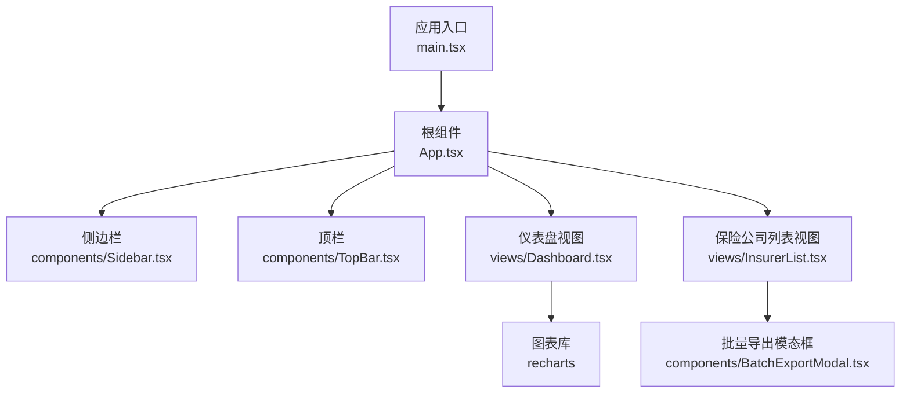
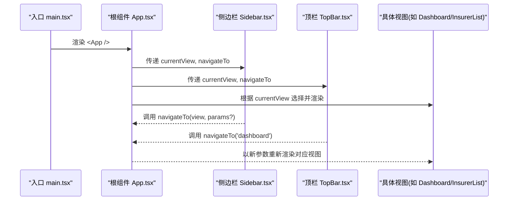
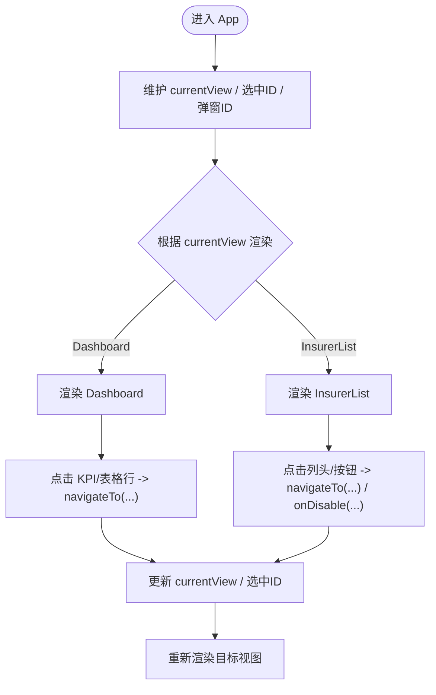
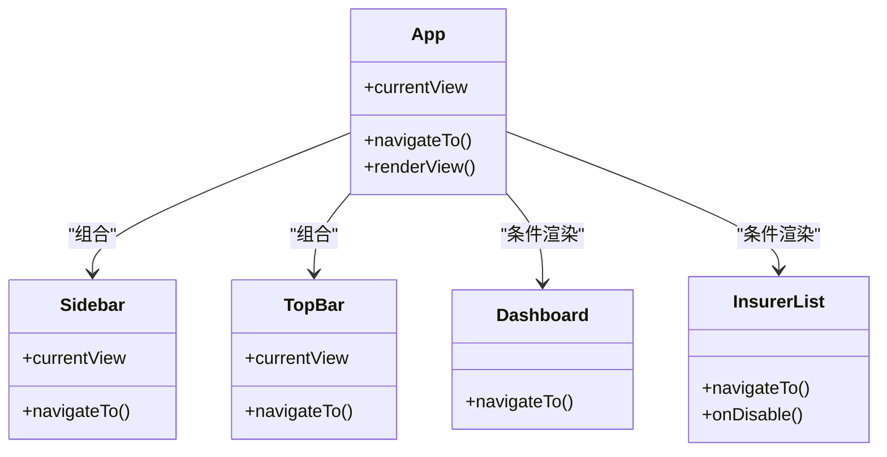
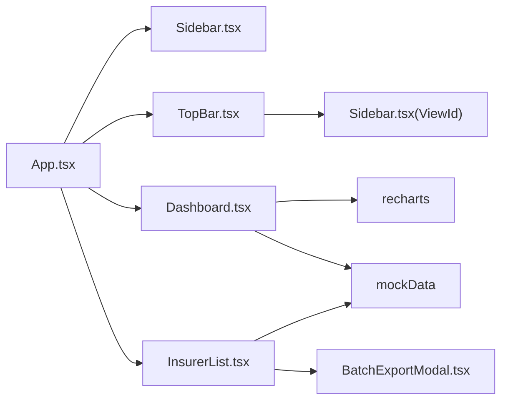

# 组件设计模式

<cite>
**本文引用的文件**
- [main.tsx](file://产品方案/UI-V1.0/src/main.tsx)
- [App.tsx](file://产品方案/UI-V1.0/src/App.tsx)
- [Sidebar.tsx](file://产品方案/UI-V1.0/src/components/Sidebar.tsx)
- [TopBar.tsx](file://产品方案/UI-V1.0/src/components/TopBar.tsx)
- [Dashboard.tsx](file://产品方案/UI-V1.0/src/views/Dashboard.tsx)
- [InsurerList.tsx](file://产品方案/UI-V1.0/src/views/InsurerList.tsx)
</cite>

## 目录
1. [简介](#简介)
2. [项目结构](#项目结构)
3. [核心组件](#核心组件)
4. [架构总览](#架构总览)
5. [详细组件分析](#详细组件分析)
6. [依赖关系分析](#依赖关系分析)
7. [性能考量](#性能考量)
8. [故障排查指南](#故障排查指南)
9. [结论](#结论)
10. [附录](#附录)

## 简介
本文件面向 OverInsurData 平台，系统化阐述基于 React 函数组件的组件设计模式与最佳实践。重点包括：
- 容器组件与展示组件的职责分离
- 高阶组件（HOC）的使用场景与落地建议
- 渲染属性模式（Render Props）在复杂交互中的价值
- 组合模式构建可复用通用组件与特定业务组件
- Props 接口设计规范、事件处理最佳实践与状态管理策略
- 结合仓库实际代码给出可视化图示与路径引用

## 项目结构
项目采用“视图层按功能域划分”的组织方式：
- 应用入口与根组件负责挂载与全局布局
- 通用 UI 组件集中在 components 目录（如侧边栏、顶栏、模态框等）
- 业务视图集中在 views 目录（如仪表盘、保险公司列表等）
- 数据与工具逻辑位于 data 目录（示例数据、格式化函数等）

**图示来源**
- [main.tsx:1-11](file://产品方案/UI-V1.0/src/main.tsx#L1-L11)
- [App.tsx:1-123](file://产品方案/UI-V1.0/src/App.tsx#L1-L123)
- [Sidebar.tsx:1-203](file://产品方案/UI-V1.0/src/components/Sidebar.tsx#L1-L203)
- [TopBar.tsx:1-135](file://产品方案/UI-V1.0/src/components/TopBar.tsx#L1-L135)
- [Dashboard.tsx:1-348](file://产品方案/UI-V1.0/src/views/Dashboard.tsx#L1-L348)
- [InsurerList.tsx:1-360](file://产品方案/UI-V1.0/src/views/InsurerList.tsx#L1-L360)

**章节来源**
- [main.tsx:1-11](file://产品方案/UI-V1.0/src/main.tsx#L1-L11)
- [App.tsx:1-123](file://产品方案/UI-V1.0/src/App.tsx#L1-L123)

## 核心组件
- 根组件 App
  - 职责：集中式路由切换、跨视图共享状态（当前视图、选中实体 ID、弹窗控制）、导航回调派发
  - 关键模式：容器组件（持有状态并驱动子视图渲染）、组合模式（将 Sidebar、TopBar 与具体视图组合为页面骨架）
- 侧边栏 Sidebar
  - 职责：导航分组、高亮当前项、折叠/展开组、用户信息区
  - 关键模式：展示组件（接收 currentView 与 navigateTo 回调），通过 props 驱动行为
- 顶栏 TopBar
  - 职责：面包屑导航、全局搜索、通知、帮助入口、头像
  - 关键模式：展示组件（根据 currentView 映射标题与面包屑）
- 仪表盘 Dashboard
  - 职责：KPI 卡片、趋势图、市场份额饼图、待办事项、近期活动
  - 关键模式：组合模式（聚合多个图表与列表片段），渲染属性模式（自定义 Tooltip）
- 保险公司列表 InsurerList
  - 职责：搜索、多维筛选、排序、分页、多选与批量操作、导出
  - 关键模式：容器+展示混合（内部维护本地筛选/排序/分页状态，向上抛出导航与禁用确认等事件）

**章节来源**
- [App.tsx:25-82](file://产品方案/UI-V1.0/src/App.tsx#L25-L82)
- [Sidebar.tsx:72-82](file://产品方案/UI-V1.0/src/components/Sidebar.tsx#L72-L82)
- [TopBar.tsx:32-39](file://产品方案/UI-V1.0/src/components/TopBar.tsx#L32-L39)
- [Dashboard.tsx:9-11](file://产品方案/UI-V1.0/src/views/Dashboard.tsx#L9-L11)
- [InsurerList.tsx:10-29](file://产品方案/UI-V1.0/src/views/InsurerList.tsx#L10-L29)

## 架构总览
下图展示了从应用入口到各视图的调用链路与数据流向，体现“容器组件驱动 + 展示组件呈现”的分层思想。

**图示来源**
- [main.tsx:6-10](file://产品方案/UI-V1.0/src/main.tsx#L6-L10)
- [App.tsx:25-82](file://产品方案/UI-V1.0/src/App.tsx#L25-L82)
- [Sidebar.tsx:120-168](file://产品方案/UI-V1.0/src/components/Sidebar.tsx#L120-L168)
- [TopBar.tsx:51-72](file://产品方案/UI-V1.0/src/components/TopBar.tsx#L51-L72)
- [Dashboard.tsx:102-119](file://产品方案/UI-V1.0/src/views/Dashboard.tsx#L102-L119)
- [InsurerList.tsx:92-114](file://产品方案/UI-V1.0/src/views/InsurerList.tsx#L92-L114)

## 详细组件分析

### 容器组件与展示组件分离
- 容器组件（App）
  - 集中管理路由状态、选中项与弹窗状态
  - 提供统一的 navigateTo 方法，统一滚动与参数透传
  - 通过 switch-case 或条件渲染选择具体视图
- 展示组件（Sidebar、TopBar、Dashboard、InsurerList）
  - 仅关注 UI 呈现与局部交互
  - 通过 props 接收数据与回调，不直接持有跨组件状态

**图示来源**
- [App.tsx:25-82](file://产品方案/UI-V1.0/src/App.tsx#L25-L82)
- [Dashboard.tsx:254-280](file://产品方案/UI-V1.0/src/views/Dashboard.tsx#L254-L280)
- [InsurerList.tsx:173-305](file://产品方案/UI-V1.0/src/views/InsurerList.tsx#L173-L305)

**章节来源**
- [App.tsx:25-82](file://产品方案/UI-V1.0/src/App.tsx#L25-L82)

### 高阶组件（HOC）使用建议
- 适用场景
  - 横切关注点：权限校验、埋点统计、错误边界包裹、加载态注入
  - 日志与调试：打印 props 变更、渲染耗时
- 在本项目中的落地建议
  - 为需要权限控制的视图添加 withAuth(viewComponent)
  - 为数据密集型视图添加 withLoading(viewComponent)
  - 为所有视图添加 withAnalytics(viewComponent) 记录页面访问与交互
- 注意事项
  - 保持 HOC 无副作用，避免引入新的全局状态
  - 合理命名提升可读性（如 withXxx）
  - 谨慎使用多层 HOC 嵌套，必要时考虑组合模式替代

[本节为概念性说明，不直接分析具体文件]

### 渲染属性模式（Render Props）
- 典型用法
  - 将渲染逻辑抽象为回调，由父组件决定如何渲染子内容
  - 适用于动态插槽、条件渲染、复杂模板拼装
- 本项目参考
  - Dashboard 中为图表提供 CustomTooltip/PieTooltip，作为渲染属性的变体，将“提示内容”的渲染交由父组件配置
- 扩展建议
  - 对复杂表格行、卡片、弹窗内容采用 renderRow/renderCard/renderContent 等回调，提高复用性与可定制性

**章节来源**
- [Dashboard.tsx:73-100](file://产品方案/UI-V1.0/src/views/Dashboard.tsx#L73-L100)

### 组合模式
- 组合原则
  - 小粒度、单一职责的组件通过组合形成复杂界面
  - 通过 props.children、插槽回调、配置对象进行编排
- 本项目体现
  - App 组合 Sidebar、TopBar 与具体视图，形成页面骨架
  - Dashboard 组合 KPI 卡片、图表、待办、活动列表等模块
  - InsurerList 组合搜索、筛选、排序、分页、批量操作、导出等模块

**图示来源**
- [App.tsx:84-120](file://产品方案/UI-V1.0/src/App.tsx#L84-L120)
- [Sidebar.tsx:72-82](file://产品方案/UI-V1.0/src/components/Sidebar.tsx#L72-L82)
- [TopBar.tsx:32-39](file://产品方案/UI-V1.0/src/components/TopBar.tsx#L32-L39)
- [Dashboard.tsx:9-11](file://产品方案/UI-V1.0/src/views/Dashboard.tsx#L9-L11)
- [InsurerList.tsx:10-13](file://产品方案/UI-V1.0/src/views/InsurerList.tsx#L10-L13)

**章节来源**
- [App.tsx:84-120](file://产品方案/UI-V1.0/src/App.tsx#L84-L120)

### 组件职责划分原则
- 容器组件
  - 负责状态、路由、数据获取、事件协调
  - 尽量薄，只负责“组装与调度”
- 展示组件
  - 专注 UI 与交互细节
  - 通过 props 暴露配置项与回调，避免隐式耦合
- 业务视图 vs 通用组件
  - 业务视图：承载领域流程（如 InsurerList 的筛选/排序/分页）
  - 通用组件：跨视图复用（如 Sidebar、TopBar、模态框）

**章节来源**
- [App.tsx:25-82](file://产品方案/UI-V1.0/src/App.tsx#L25-L82)
- [InsurerList.tsx:18-58](file://产品方案/UI-V1.0/src/views/InsurerList.tsx#L18-L58)

### Props 接口设计规范
- 命名与类型
  - 使用 TypeScript 定义 Props 接口，明确可选/必填字段
  - 回调命名遵循 onXxx 约定（如 onDisable、onStatusChange）
- 最小化接口
  - 仅暴露必要字段，避免过度透传
  - 复杂配置使用对象解构（如 options: { pageSize, sortable }）
- 可组合性
  - 支持 children、render* 回调，便于组合与定制
- 示例参考
  - Sidebar 的 Props：currentView、navigateTo
  - TopBar 的 Props：currentView、navigateTo
  - Dashboard 的 Props：navigateTo
  - InsurerList 的 Props：navigateTo、onDisable

**章节来源**
- [Sidebar.tsx:72-75](file://产品方案/UI-V1.0/src/components/Sidebar.tsx#L72-L75)
- [TopBar.tsx:32-35](file://产品方案/UI-V1.0/src/components/TopBar.tsx#L32-L35)
- [Dashboard.tsx:9-11](file://产品方案/UI-V1.0/src/views/Dashboard.tsx#L9-L11)
- [InsurerList.tsx:10-13](file://产品方案/UI-V1.0/src/views/InsurerList.tsx#L10-L13)

### 事件处理最佳实践
- 事件冒泡与阻止
  - 在表格单元格内点击时，使用 e.stopPropagation() 避免触发行点击
  - 在容器组件中统一处理导航与状态更新
- 回调幂等与健壮性
  - navigateTo 应能安全处理重复调用与空参数
  - onDisable 等回调需具备防抖/去重能力（视业务而定）
- 可测试性
  - 将事件处理拆分为纯函数，便于单元测试

**章节来源**
- [InsurerList.tsx:210-220](file://产品方案/UI-V1.0/src/views/InsurerList.tsx#L210-L220)
- [InsurerList.tsx:276-301](file://产品方案/UI-V1.0/src/views/InsurerList.tsx#L276-L301)
- [App.tsx:32-37](file://产品方案/UI-V1.0/src/App.tsx#L32-L37)

### 组件状态管理策略
- 本地状态
  - 使用 useState/useMemo/useCallback 管理视图级状态（如筛选、排序、分页）
  - 将计算结果缓存，减少重复计算
- 共享状态
  - 简单场景：通过 App 集中管理（currentView、选中 ID、弹窗 ID）
  - 复杂场景：引入 Context/状态库（如 Zustand/Redux）管理跨模块状态
- 不可变更新
  - 使用不可变数据结构与函数式更新，确保可预测性
- 性能优化
  - 合理使用 useMemo/useCallback 避免不必要的重渲染
  - 大数据列表采用虚拟滚动或分页

**章节来源**
- [InsurerList.tsx:18-58](file://产品方案/UI-V1.0/src/views/InsurerList.tsx#L18-L58)
- [App.tsx:25-37](file://产品方案/UI-V1.0/src/App.tsx#L25-L37)

## 依赖关系分析
- 组件间依赖
  - App 依赖 Sidebar、TopBar 与各视图
  - TopBar 依赖 Sidebar 的类型定义（ViewId）
  - Dashboard 依赖 recharts 与 mockData
  - InsurerList 依赖 BatchExportModal 与 mockData
- 外部依赖
  - recharts：图表渲染
  - lucide-react：图标资源
  - 样式：CSS 变量与类名（glass、card、badge 等）

**图示来源**
- [App.tsx:1-23](file://产品方案/UI-V1.0/src/App.tsx#L1-L23)
- [TopBar.tsx:1-3](file://产品方案/UI-V1.0/src/components/TopBar.tsx#L1-L3)
- [Dashboard.tsx:1-7](file://产品方案/UI-V1.0/src/views/Dashboard.tsx#L1-L7)
- [InsurerList.tsx:1-9](file://产品方案/UI-V1.0/src/views/InsurerList.tsx#L1-L9)

**章节来源**
- [App.tsx:1-23](file://产品方案/UI-V1.0/src/App.tsx#L1-L23)
- [TopBar.tsx:1-3](file://产品方案/UI-V1.0/src/components/TopBar.tsx#L1-L3)
- [Dashboard.tsx:1-7](file://产品方案/UI-V1.0/src/views/Dashboard.tsx#L1-L7)
- [InsurerList.tsx:1-9](file://产品方案/UI-V1.0/src/views/InsurerList.tsx#L1-L9)

## 性能考量
- 列表与表格
  - 使用 useMemo 缓存筛选与排序结果
  - 分页加载与按需渲染，避免一次性渲染大量 DOM
- 图表
  - 合理设置 ResponsiveContainer 尺寸，避免频繁重绘
  - 自定义 Tooltip 轻量实现，减少额外开销
- 状态更新
  - 合并多次 setState 调用，减少重渲染次数
  - 对高频回调使用 useCallback 稳定引用
- 资源与样式
  - 图标按需引入，避免打包体积膨胀
  - 使用 CSS 变量与类名复用，减少内联样式

[本节为通用指导，不直接分析具体文件]

## 故障排查指南
- 常见问题定位
  - 路由切换无效：检查 App 的 currentView 与 navigateTo 是否正确传递
  - 列表筛选失效：检查 useMemo 依赖数组是否完整
  - 弹窗无法关闭：检查 onClose/onConfirm 回调是否被正确调用
- 调试技巧
  - 在关键回调处打印入参与返回值
  - 使用浏览器开发者工具的组件树与性能面板定位重渲染热点
- 错误边界与容错
  - 为复杂视图添加错误边界，捕获渲染异常
  - 对外部数据做防御性校验，避免空指针与类型错误

**章节来源**
- [App.tsx:32-37](file://产品方案/UI-V1.0/src/App.tsx#L32-L37)
- [InsurerList.tsx:31-58](file://产品方案/UI-V1.0/src/views/InsurerList.tsx#L31-L58)

## 结论
OverInsurData 平台采用清晰的容器/展示分离与组合模式，配合 TypeScript 强类型约束与合理的状态管理策略，形成了高内聚、低耦合的组件体系。建议在后续迭代中：
- 继续推进通用组件沉淀与文档化
- 引入 HOC/渲染属性模式增强横切能力
- 完善错误边界与性能监控
- 持续优化大型列表与图表渲染性能

[本节为总结性内容，不直接分析具体文件]

## 附录
- 术语
  - 容器组件：负责状态与逻辑，驱动子组件渲染
  - 展示组件：仅负责 UI 呈现与局部交互
  - 高阶组件（HOC）：包装组件以增强功能
  - 渲染属性模式：通过回调将渲染逻辑交给调用方
  - 组合模式：通过组合小组件构建复杂界面
- 参考路径
  - 容器组件示例：[App.tsx:25-82](file://产品方案/UI-V1.0/src/App.tsx#L25-L82)
  - 展示组件示例：[Sidebar.tsx:72-82](file://产品方案/UI-V1.0/src/components/Sidebar.tsx#L72-L82)、[TopBar.tsx:32-39](file://产品方案/UI-V1.0/src/components/TopBar.tsx#L32-L39)
  - 渲染属性模式示例：[Dashboard.tsx:73-100](file://产品方案/UI-V1.0/src/views/Dashboard.tsx#L73-L100)
  - 组合模式示例：[App.tsx:84-120](file://产品方案/UI-V1.0/src/App.tsx#L84-L120)