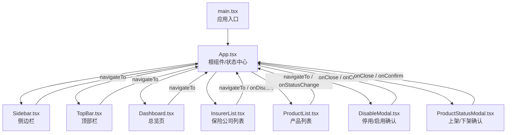
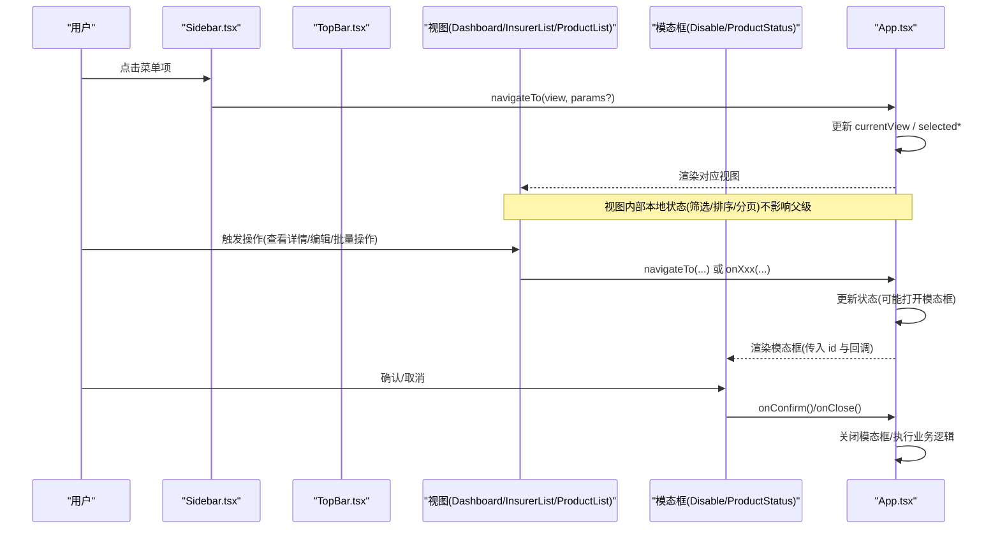
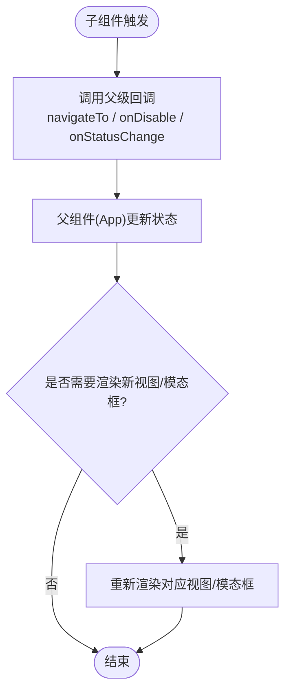
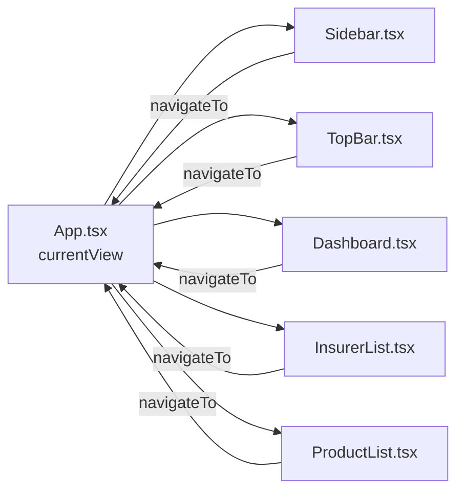
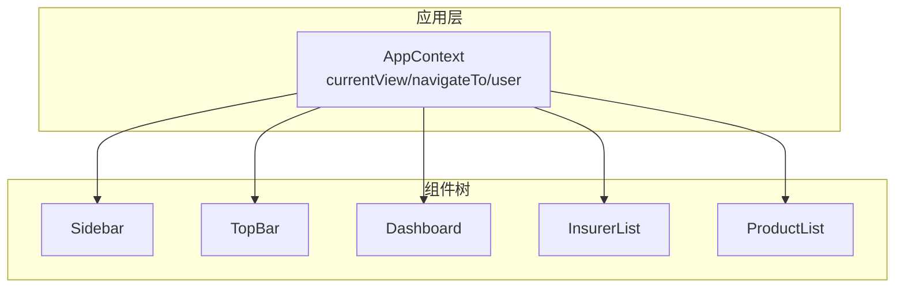
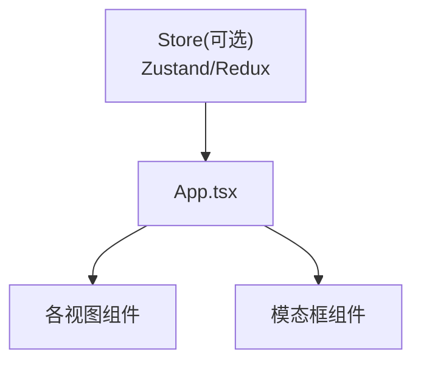
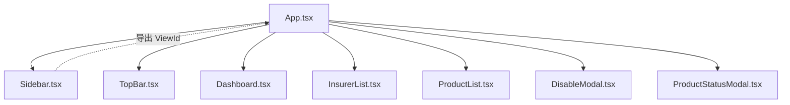

# 组件通信机制

<cite>
**本文引用的文件**
- [App.tsx](file://产品方案/UI-V1.0/src/App.tsx)
- [main.tsx](file://产品方案/UI-V1.0/src/main.tsx)
- [Sidebar.tsx](file://产品方案/UI-V1.0/src/components/Sidebar.tsx)
- [TopBar.tsx](file://产品方案/UI-V1.0/src/components/TopBar.tsx)
- [Dashboard.tsx](file://产品方案/UI-V1.0/src/views/Dashboard.tsx)
- [InsurerList.tsx](file://产品方案/UI-V1.0/src/views/InsurerList.tsx)
- [ProductList.tsx](file://产品方案/UI-V1.0/src/views/ProductList.tsx)
- [DisableModal.tsx](file://产品方案/UI-V1.0/src/components/DisableModal.tsx)
- [ProductStatusModal.tsx](file://产品方案/UI-V1.0/src/components/ProductStatusModal.tsx)
</cite>

## 目录
1. [简介](#简介)
2. [项目结构](#项目结构)
3. [核心组件](#核心组件)
4. [架构总览](#架构总览)
5. [详细组件分析](#详细组件分析)
6. [依赖关系分析](#依赖关系分析)
7. [性能考虑](#性能考虑)
8. [故障排查指南](#故障排查指南)
9. [结论](#结论)
10. [附录](#附录)

## 简介
本文件面向 OverInsurData 平台，系统化说明 React 组件间的通信机制与数据流向。基于当前代码实现，平台采用“状态提升 + Props 回调”的单向数据流模式：应用根组件集中持有路由视图、选中项与模态框等全局状态，并通过 props 将导航能力与操作回调传递给子组件；子组件通过触发回调将事件向上传递，由父组件统一更新状态并驱动 UI 变化。文档同时补充了事件冒泡与捕获、自定义事件、异步通信模式的最佳实践建议，帮助在现有基础上扩展更复杂的跨层级通信与全局状态管理。

## 项目结构
- 入口渲染：main.tsx 挂载 App 根组件。
- 根布局：App.tsx 维护当前视图、选中实体 ID、模态框开关等状态，负责根据 currentView 渲染对应视图，并向 Sidebar、TopBar 及各视图传递 navigateTo 与业务回调。
- 侧边栏与顶栏：Sidebar.tsx、TopBar.tsx 接收 currentView 与 navigateTo，用于导航与面包屑展示。
- 页面视图：Dashboard.tsx、InsurerList.tsx、ProductList.tsx 等通过 props 接收导航与回调，执行本地筛选、排序、分页等操作，并在需要时调用父级回调（如 onDisable、onStatusChange）。
- 模态框：DisableModal.tsx、ProductStatusModal.tsx 为受控弹窗，通过 onClose/onConfirm 与父组件交互。



图表来源
- [main.tsx:1-11](file://产品方案/UI-V1.0/src/main.tsx#L1-L11)
- [App.tsx:25-120](file://产品方案/UI-V1.0/src/App.tsx#L25-L120)
- [Sidebar.tsx:72-82](file://产品方案/UI-V1.0/src/components/Sidebar.tsx#L72-L82)
- [TopBar.tsx:32-38](file://产品方案/UI-V1.0/src/components/TopBar.tsx#L32-L38)
- [Dashboard.tsx:9-11](file://产品方案/UI-V1.0/src/views/Dashboard.tsx#L9-L11)
- [InsurerList.tsx:10-13](file://产品方案/UI-V1.0/src/views/InsurerList.tsx#L10-L13)
- [ProductList.tsx:6-9](file://产品方案/UI-V1.0/src/views/ProductList.tsx#L6-L9)
- [DisableModal.tsx:5-9](file://产品方案/UI-V1.0/src/components/DisableModal.tsx#L5-L9)
- [ProductStatusModal.tsx:5-9](file://产品方案/UI-V1.0/src/components/ProductStatusModal.tsx#L5-L9)

章节来源
- [main.tsx:1-11](file://产品方案/UI-V1.0/src/main.tsx#L1-L11)
- [App.tsx:25-120](file://产品方案/UI-V1.0/src/App.tsx#L25-L120)

## 核心组件
- App.tsx：集中管理 currentView、selectedInsurerId、selectedProductId、disableModalId、productStatusModalId；提供 navigateTo 方法；按视图渲染对应页面；控制模态框显示。
- Sidebar.tsx：定义 ViewId 类型与导航分组；接收 currentView 与 navigateTo；点击菜单项调用 navigateTo。
- TopBar.tsx：根据 currentView 计算面包屑标题；点击返回或跳转调用 navigateTo。
- Dashboard.tsx：展示 KPI、图表与活动；通过 navigateTo 跳转到列表或详情。
- InsurerList.tsx：实现搜索、过滤、排序、分页、多选；通过 navigateTo 进入详情/编辑；通过 onDisable 触发停用流程。
- ProductList.tsx：实现搜索、过滤、排序；通过 navigateTo 进入详情/编辑；通过 onStatusChange 触发上架/下架流程。
- DisableModal.tsx：受控弹窗，选择原因、生效时间、备注，确认后通过 onConfirm 通知父组件。
- ProductStatusModal.tsx：受控弹窗，选择范围、原因、生效时间、备注，确认后通过 onConfirm 通知父组件。

章节来源
- [App.tsx:25-82](file://产品方案/UI-V1.0/src/App.tsx#L25-L82)
- [Sidebar.tsx:9-36](file://产品方案/UI-V1.0/src/components/Sidebar.tsx#L9-L36)
- [Sidebar.tsx:72-82](file://产品方案/UI-V1.0/src/components/Sidebar.tsx#L72-L82)
- [TopBar.tsx:4-38](file://产品方案/UI-V1.0/src/components/TopBar.tsx#L4-L38)
- [Dashboard.tsx:9-11](file://产品方案/UI-V1.0/src/views/Dashboard.tsx#L9-L11)
- [InsurerList.tsx:10-13](file://产品方案/UI-V1.0/src/views/InsurerList.tsx#L10-L13)
- [ProductList.tsx:6-9](file://产品方案/UI-V1.0/src/views/ProductList.tsx#L6-L9)
- [DisableModal.tsx:5-9](file://产品方案/UI-V1.0/src/components/DisableModal.tsx#L5-L9)
- [ProductStatusModal.tsx:5-9](file://产品方案/UI-V1.0/src/components/ProductStatusModal.tsx#L5-L9)

## 架构总览
平台采用“状态提升”的单向数据流：所有可被多个视图共享的状态（当前视图、选中项、模态框）均提升至 App 层；子组件仅负责展示与触发回调，不直接修改父级状态。导航通过统一的 navigateTo 函数完成，确保路由切换与滚动行为一致。



图表来源
- [App.tsx:25-82](file://产品方案/UI-V1.0/src/App.tsx#L25-L82)
- [Sidebar.tsx:72-82](file://产品方案/UI-V1.0/src/components/Sidebar.tsx#L72-L82)
- [TopBar.tsx:32-38](file://产品方案/UI-V1.0/src/components/TopBar.tsx#L32-L38)
- [InsurerList.tsx:10-13](file://产品方案/UI-V1.0/src/views/InsurerList.tsx#L10-L13)
- [ProductList.tsx:6-9](file://产品方案/UI-V1.0/src/views/ProductList.tsx#L6-L9)
- [DisableModal.tsx:5-9](file://产品方案/UI-V1.0/src/components/DisableModal.tsx#L5-L9)
- [ProductStatusModal.tsx:5-9](file://产品方案/UI-V1.0/src/components/ProductStatusModal.tsx#L5-L9)

## 详细组件分析

### 父子组件通信（Props 传递）
- 导航能力：App 提供 navigateTo，Sidebar、TopBar、Dashboard、InsurerList、ProductList 均通过 props 接收并调用，实现从任意子组件向上发起导航。
- 业务回调：InsurerList 通过 onDisable 将“停用/启用”意图上报给 App；ProductList 通过 onStatusChange 将“上架/下架”意图上报给 App。
- 模态框参数：App 将 disableModalId/productStatusModalId 与 onClose/onConfirm 传给对应模态框，模态框仅在父级状态允许时渲染。



图表来源
- [App.tsx:25-82](file://产品方案/UI-V1.0/src/App.tsx#L25-L82)
- [InsurerList.tsx:10-13](file://产品方案/UI-V1.0/src/views/InsurerList.tsx#L10-L13)
- [ProductList.tsx:6-9](file://产品方案/UI-V1.0/src/views/ProductList.tsx#L6-L9)
- [DisableModal.tsx:5-9](file://产品方案/UI-V1.0/src/components/DisableModal.tsx#L5-L9)
- [ProductStatusModal.tsx:5-9](file://产品方案/UI-V1.0/src/components/ProductStatusModal.tsx#L5-L9)

章节来源
- [App.tsx:25-82](file://产品方案/UI-V1.0/src/App.tsx#L25-L82)
- [Sidebar.tsx:72-82](file://产品方案/UI-V1.0/src/components/Sidebar.tsx#L72-L82)
- [TopBar.tsx:32-38](file://产品方案/UI-V1.0/src/components/TopBar.tsx#L32-L38)
- [InsurerList.tsx:10-13](file://产品方案/UI-V1.0/src/views/InsurerList.tsx#L10-L13)
- [ProductList.tsx:6-9](file://产品方案/UI-V1.0/src/views/ProductList.tsx#L6-L9)
- [DisableModal.tsx:5-9](file://产品方案/UI-V1.0/src/components/DisableModal.tsx#L5-L9)
- [ProductStatusModal.tsx:5-9](file://产品方案/UI-V1.0/src/components/ProductStatusModal.tsx#L5-L9)

### 兄弟组件通信（状态提升）
- 场景：Sidebar 与 TopBar 需要同步高亮当前视图；Dashboard、InsurerList、ProductList 需要响应来自侧边栏/顶栏的导航。
- 实现：将 currentView 提升到 App，再作为 props 分别传给 Sidebar、TopBar 与各视图；任何一处变更都会同步到所有兄弟组件。



图表来源
- [App.tsx:25-82](file://产品方案/UI-V1.0/src/App.tsx#L25-L82)
- [Sidebar.tsx:72-82](file://产品方案/UI-V1.0/src/components/Sidebar.tsx#L72-L82)
- [TopBar.tsx:32-38](file://产品方案/UI-V1.0/src/components/TopBar.tsx#L32-L38)
- [Dashboard.tsx:9-11](file://产品方案/UI-V1.0/src/views/Dashboard.tsx#L9-L11)
- [InsurerList.tsx:10-13](file://产品方案/UI-V1.0/src/views/InsurerList.tsx#L10-L13)
- [ProductList.tsx:6-9](file://产品方案/UI-V1.0/src/views/ProductList.tsx#L6-L9)

章节来源
- [App.tsx:25-82](file://产品方案/UI-V1.0/src/App.tsx#L25-L82)
- [Sidebar.tsx:72-82](file://产品方案/UI-V1.0/src/components/Sidebar.tsx#L72-L82)
- [TopBar.tsx:32-38](file://产品方案/UI-V1.0/src/components/TopBar.tsx#L32-L38)

### 跨层级组件通信（Context API）
- 现状：当前代码未使用 Context，所有跨层级通信通过 props 回调完成。
- 建议：当导航与用户信息、主题、权限等需要在深层级共享且避免“props 逐层透传”时，可使用 Context 封装 AppContext，暴露 { currentView, navigateTo, user } 等，减少中间层组件的 props 负担。



[本节为概念性设计，不对应具体源码]

### 全局状态管理
- 现状：全局状态集中在 App.tsx（currentView、selectedInsurerId、selectedProductId、模态框开关），适合中小型应用。
- 建议：随着功能扩展，可将状态拆分至独立 store（如 Zustand/Redux Toolkit），并通过 Provider 注入，保持 App 职责单一。



[本节为概念性设计，不对应具体源码]

### 事件冒泡与捕获机制
- 现状：列表行点击会触发导航，单元格内按钮通过 e.stopPropagation() 阻止冒泡，避免整行导航与按钮操作冲突。
- 示例路径：
  - 行点击导航：[InsurerList.tsx:210-217](file://产品方案/UI-V1.0/src/views/InsurerList.tsx#L210-L217)
  - 单元格按钮阻止冒泡：[InsurerList.tsx:218-219](file://产品方案/UI-V1.0/src/views/InsurerList.tsx#L218-L219)
- 建议：对复杂交互（如嵌套菜单、浮层）优先使用捕获阶段处理关闭逻辑，或使用明确的阻止冒泡策略，避免误触。

章节来源
- [InsurerList.tsx:210-219](file://产品方案/UI-V1.0/src/views/InsurerList.tsx#L210-L219)

### 自定义事件的创建和处理
- 现状：未使用浏览器 CustomEvent；组件间通过 props 回调进行通信。
- 建议：对于非 React 元素的事件（如第三方图表、Canvas），可在 DOM 上派发与监听 CustomEvent，并在 React 中通过 useEffect 订阅与清理，保证生命周期安全。

[本节为概念性指导，不对应具体源码]

### 数据流向与单向数据流
- 数据自上而下：App 持有状态，通过 props 下发给子组件；子组件只读展示。
- 事件自下而上：子组件通过回调将用户意图上报，由 App 决定如何更新状态并驱动 UI。
- 优势：可预测、易调试、便于测试与重构。

```mermaid
flowchart TD
P["父组件(App)"] --> |props| C["子组件(视图/侧边栏/顶栏)"]
C --> |回调(onXxx)| P
P --> |更新状态| P
P --> |重新渲染| C
```

[本节为概念性说明，不对应具体源码]

### 异步通信的处理模式
- 现状：当前页面主要使用本地 mock 数据，未见网络请求。
- 建议：
  - 在视图中使用 async/await 包装请求，结合 loading/error 状态管理。
  - 将副作用与数据获取下沉到独立的 hooks 或服务层，保持组件纯展示。
  - 对模态框确认后的提交，增加防抖与乐观更新，提升体验。

[本节为概念性指导，不对应具体源码]

## 依赖关系分析
- 模块耦合：App 依赖 Sidebar、TopBar 及各视图；视图依赖 App 提供的导航与回调；模态框依赖 App 的状态与回调。
- 类型共享：ViewId 类型由 Sidebar 导出，供 App 与其他视图引用，保证导航一致性。
- 潜在风险：若未来引入更多全局上下文，需评估是否改用 Context/Store 以降低耦合。



图表来源
- [App.tsx:25-82](file://产品方案/UI-V1.0/src/App.tsx#L25-L82)
- [Sidebar.tsx:9-36](file://产品方案/UI-V1.0/src/components/Sidebar.tsx#L9-L36)

章节来源
- [App.tsx:25-82](file://产品方案/UI-V1.0/src/App.tsx#L25-L82)
- [Sidebar.tsx:9-36](file://产品方案/UI-V1.0/src/components/Sidebar.tsx#L9-L36)

## 性能考虑
- 列表筛选与排序：InsurerList、ProductList 使用 useMemo 缓存过滤与排序结果，降低重复计算开销。
- 局部状态：每个视图维护自身筛选、排序、分页等状态，避免不必要的父级重渲染。
- 建议：对大数据量表格考虑虚拟滚动；对图表渲染使用按需更新与节流；模态框频繁切换时可考虑懒加载。

章节来源
- [InsurerList.tsx:31-53](file://产品方案/UI-V1.0/src/views/InsurerList.tsx#L31-L53)
- [ProductList.tsx:29-47](file://产品方案/UI-V1.0/src/views/ProductList.tsx#L29-L47)

## 故障排查指南
- 导航无效：检查 navigateTo 是否正确传入子组件，以及 currentView 是否被正确更新。
- 模态框不显示：确认 App 中的模态框状态变量是否被设置，以及条件渲染是否生效。
- 列表点击冲突：确认单元格按钮是否调用了阻止冒泡，避免行点击误触发。
- 回调未触发：检查子组件是否正确绑定 onDisable/onStatusChange，并确保父组件提供了实现。

章节来源
- [App.tsx:25-82](file://产品方案/UI-V1.0/src/App.tsx#L25-L82)
- [InsurerList.tsx:210-219](file://产品方案/UI-V1.0/src/views/InsurerList.tsx#L210-L219)
- [DisableModal.tsx:5-9](file://产品方案/UI-V1.0/src/components/DisableModal.tsx#L5-L9)
- [ProductStatusModal.tsx:5-9](file://产品方案/UI-V1.0/src/components/ProductStatusModal.tsx#L5-L9)

## 结论
OverInsurData 平台当前采用清晰、可维护的“状态提升 + Props 回调”单向数据流，满足导航、筛选、模态框等业务场景。建议在后续演进中按需引入 Context 或全局状态库，以简化深层级通信；对异步操作与大数据渲染进行优化，进一步提升用户体验与可维护性。

## 附录
- 关键通信路径参考：
  - 导航：[App.tsx:25-82](file://产品方案/UI-V1.0/src/App.tsx#L25-L82)、[Sidebar.tsx:72-82](file://产品方案/UI-V1.0/src/components/Sidebar.tsx#L72-L82)、[TopBar.tsx:32-38](file://产品方案/UI-V1.0/src/components/TopBar.tsx#L32-L38)
  - 列表操作：[InsurerList.tsx:10-13](file://产品方案/UI-V1.0/src/views/InsurerList.tsx#L10-L13)、[ProductList.tsx:6-9](file://产品方案/UI-V1.0/src/views/ProductList.tsx#L6-L9)
  - 模态框交互：[DisableModal.tsx:5-9](file://产品方案/UI-V1.0/src/components/DisableModal.tsx#L5-L9)、[ProductStatusModal.tsx:5-9](file://产品方案/UI-V1.0/src/components/ProductStatusModal.tsx#L5-L9)