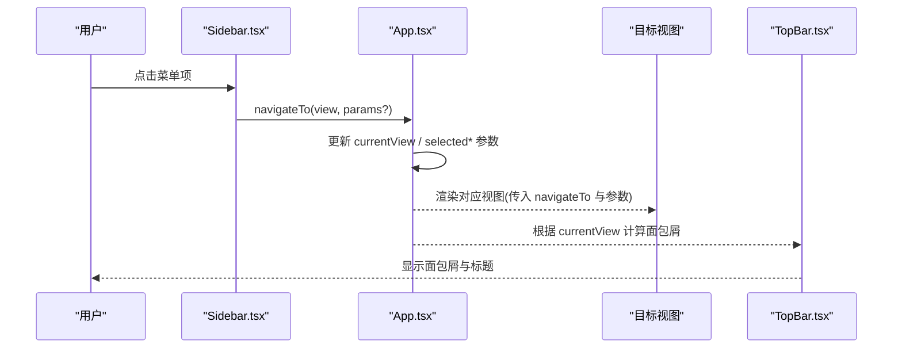
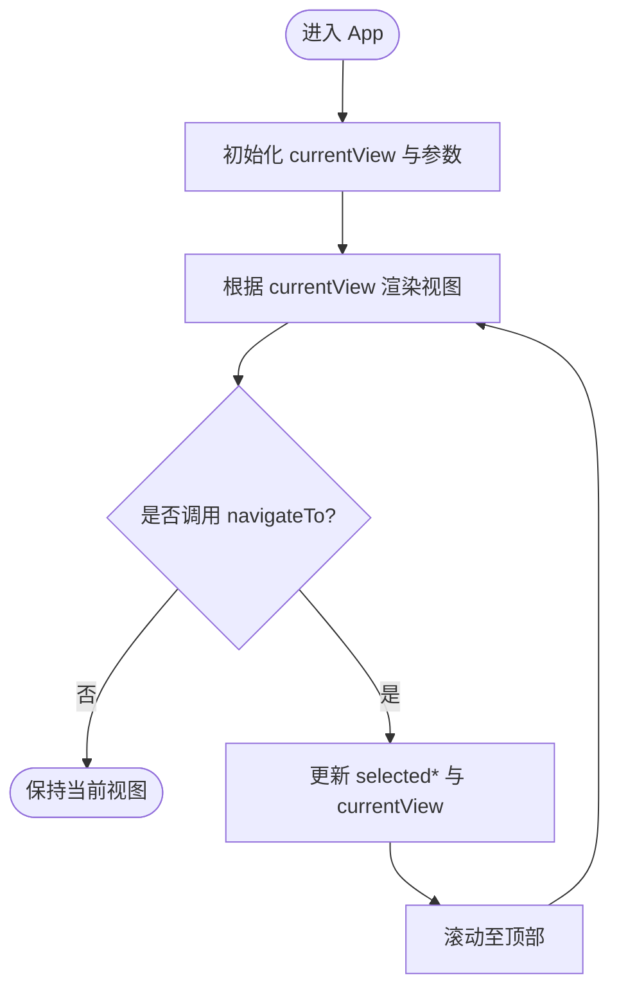
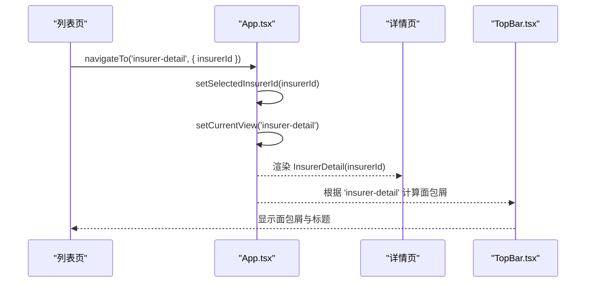
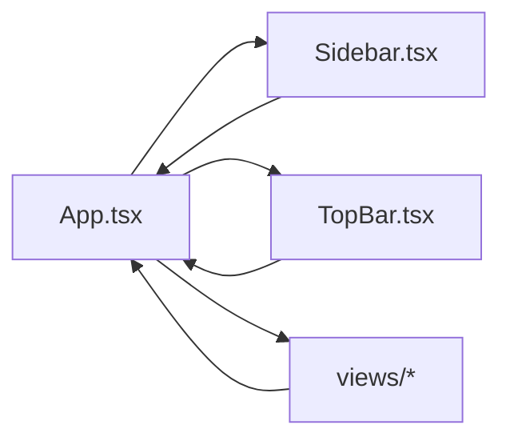
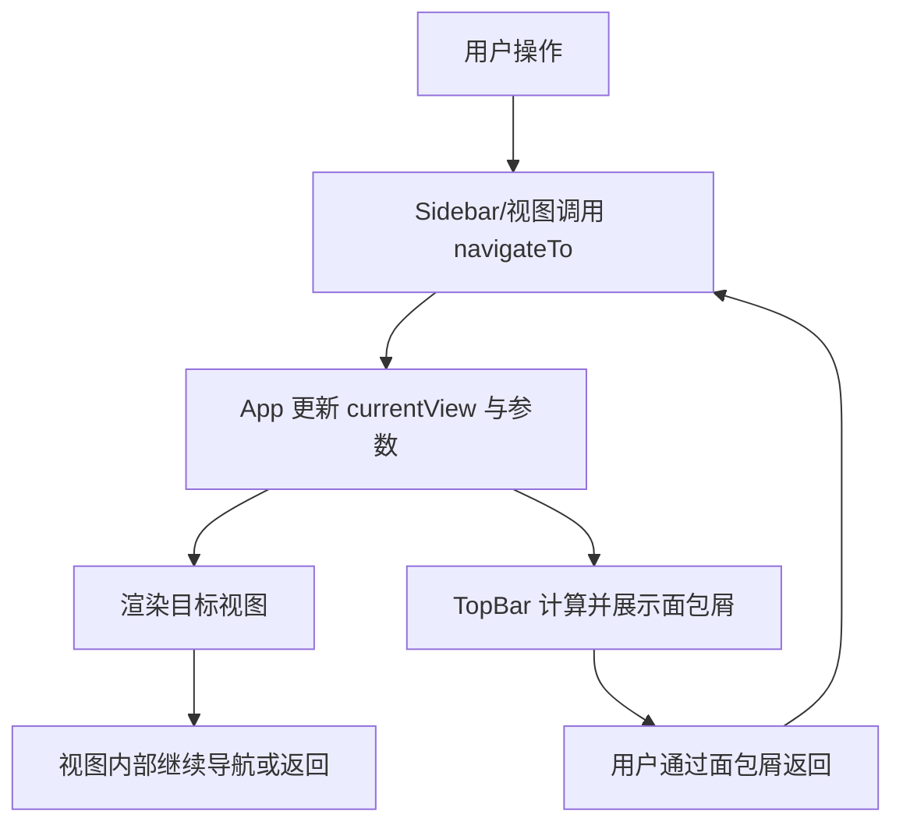

# 路由导航架构

<cite>
**本文引用的文件**
- [App.tsx](file://产品方案/UI-V1.0/src/App.tsx)
- [main.tsx](file://产品方案/UI-V1.0/src/main.tsx)
- [Sidebar.tsx](file://产品方案/UI-V1.0/src/components/Sidebar.tsx)
- [TopBar.tsx](file://产品方案/UI-V1.0/src/components/TopBar.tsx)
- [Dashboard.tsx](file://产品方案/UI-V1.0/src/views/Dashboard.tsx)
- [InsurerList.tsx](file://产品方案/UI-V1.0/src/views/InsurerList.tsx)
- [InsurerDetail.tsx](file://产品方案/UI-V1.0/src/views/InsurerDetail.tsx)
- [ProductList.tsx](file://产品方案/UI-V1.0/src/views/ProductList.tsx)
</cite>

## 目录
1. [简介](#简介)
2. [项目结构](#项目结构)
3. [核心组件](#核心组件)
4. [架构总览](#架构总览)
5. [详细组件分析](#详细组件分析)
6. [依赖关系分析](#依赖关系分析)
7. [性能考量](#性能考量)
8. [故障排查指南](#故障排查指南)
9. [结论](#结论)
10. [附录](#附录)

## 简介
本文件为 OverInsurData 平台的路由导航架构文档。该平台采用基于状态的路由管理机制：通过应用级状态维护当前视图与参数，使用统一的导航函数进行视图切换与参数传递，并在顶部栏实现面包屑导航。本文档将系统阐述视图切换逻辑、参数传递方案、导航守卫（校验）机制、自定义路由类型定义、导航函数设计、侧边栏与页面内容的联动方式，以及面包屑导航的实现。同时提供路由映射表与关键流程图，帮助读者快速理解并扩展该导航体系。

## 项目结构
- 入口与根组件
  - 应用入口渲染根组件，挂载到 DOM。
  - 根组件集中管理“当前视图”和“路由参数”，并提供统一导航函数。
- 导航与布局
  - 侧边栏：声明所有可导航的视图标识与分组，点击触发导航。
  - 顶栏：根据当前视图渲染面包屑与标题。
- 视图层
  - 各业务视图通过 props 接收 navigateTo 与必要参数，调用导航完成跳转或返回。

```mermaid
graph TB
A["main.tsx<br/>应用入口"] --> B["App.tsx<br/>根组件/状态中心"]
B --> C["Sidebar.tsx<br/>侧边栏导航"]
B --> D["TopBar.tsx<br/>顶栏/面包屑"]
B --> E["views/*<br/>业务视图"]
C --> |navigateTo(view, params)| B
E --> |navigateTo(view, params)| B
D --> |读取 currentView| B
```

图示来源
- [main.tsx:1-11](file://产品方案/UI-V1.0/src/main.tsx#L1-L11)
- [App.tsx:25-82](file://产品方案/UI-V1.0/src/App.tsx#L25-L82)
- [Sidebar.tsx:72-168](file://产品方案/UI-V1.0/src/components/Sidebar.tsx#L72-L168)
- [TopBar.tsx:37-72](file://产品方案/UI-V1.0/src/components/TopBar.tsx#L37-L72)

章节来源
- [main.tsx:1-11](file://产品方案/UI-V1.0/src/main.tsx#L1-L11)
- [App.tsx:25-82](file://产品方案/UI-V1.0/src/App.tsx#L25-L82)

## 核心组件
- 根组件 App
  - 维护当前视图 currentView 与路由参数 selectedInsurerId、selectedProductId。
  - 提供统一导航函数 navigateTo，负责更新视图与参数，并滚动至顶部。
  - 根据 currentView 渲染对应视图，并将 navigateTo 与必要参数注入。
- 侧边栏 Sidebar
  - 定义 ViewId 联合类型，作为路由标识的类型约束。
  - 按分组组织菜单项，点击后调用 navigateTo 切换视图。
  - 高亮当前选中项，支持折叠/展开。
- 顶栏 TopBar
  - 根据 currentView 查找对应的面包屑与标题，展示在顶部。
  - 支持点击回到首页或上级路径。

章节来源
- [App.tsx:25-82](file://产品方案/UI-V1.0/src/App.tsx#L25-L82)
- [Sidebar.tsx:9-75](file://产品方案/UI-V1.0/src/components/Sidebar.tsx#L9-L75)
- [TopBar.tsx:4-38](file://产品方案/UI-V1.0/src/components/TopBar.tsx#L4-L38)

## 架构总览
基于状态的路由架构以 App 为中心，侧边栏与视图均通过 navigateTo 发起导航请求，App 更新状态后重新渲染目标视图；顶栏根据当前视图计算并展示面包屑。



图示来源
- [Sidebar.tsx:151-156](file://产品方案/UI-V1.0/src/components/Sidebar.tsx#L151-L156)
- [App.tsx:32-82](file://产品方案/UI-V1.0/src/App.tsx#L32-L82)
- [TopBar.tsx:37-72](file://产品方案/UI-V1.0/src/components/TopBar.tsx#L37-L72)

## 详细组件分析

### 基于状态的路由管理与视图切换
- 视图标识与类型
  - ViewId 为字符串字面量联合类型，覆盖所有可导航视图，确保类型安全。
- 导航函数
  - navigateTo(view, params?)：设置 selectedInsurerId/selectedProductId（若存在），更新 currentView，并滚动至顶部。
- 视图渲染
  - 使用 switch 分支根据 currentView 渲染具体视图，并将 navigateTo 与必要参数注入。
- 默认兜底
  - 未知视图时渲染占位视图 PlaceholderView，避免白屏。



图示来源
- [App.tsx:25-82](file://产品方案/UI-V1.0/src/App.tsx#L25-L82)

章节来源
- [App.tsx:25-82](file://产品方案/UI-V1.0/src/App.tsx#L25-L82)

### 参数传递方案
- 参数来源
  - 列表页点击行或按钮时，携带 insurerId 或 productId 等上下文参数。
- 参数存储
  - App 中维护 selectedInsurerId、selectedProductId，供详情页等子视图消费。
- 参数注入
  - 详情页通过 props 接收 insurerId/productId，并据此加载数据。
- 示例路径
  - 保险公司列表 -> 详情：传递 insurerId。
  - 产品列表 -> 详情：传递 productId。

章节来源
- [InsurerList.tsx:10-12](file://产品方案/UI-V1.0/src/views/InsurerList.tsx#L10-L12)
- [InsurerDetail.tsx:16-20](file://产品方案/UI-V1.0/src/views/InsurerDetail.tsx#L16-L20)
- [ProductList.tsx:6-9](file://产品方案/UI-V1.0/src/views/ProductList.tsx#L6-L9)
- [App.tsx:32-62](file://产品方案/UI-V1.0/src/App.tsx#L32-L62)

### 导航守卫与参数验证机制
- 视图内校验
  - 详情页根据传入 ID 查找数据，若未找到则回退到默认数据，避免空指针。
- 路由级校验建议
  - 可在 navigateTo 前对参数进行合法性检查（如非空、格式校验）。
  - 对未知或非法的 viewId，统一走占位视图，防止异常渲染。
- 错误处理策略
  - 列表/筛选/排序失败时保留当前视图，仅提示或重置过滤条件。
  - 详情页操作（启用/停用）通过回调通知父组件，再决定是否刷新或关闭弹窗。

章节来源
- [InsurerDetail.tsx:56-63](file://产品方案/UI-V1.0/src/views/InsurerDetail.tsx#L56-L63)
- [App.tsx:79-81](file://产品方案/UI-V1.0/src/App.tsx#L79-L81)

### 自定义路由类型定义
- ViewId 联合类型集中管理所有路由标识，保证侧边栏、顶栏与视图之间的类型一致性。
- 新增路由需：
  - 在 ViewId 中添加新标识。
  - 在 Sidebar 的菜单配置中添加对应项。
  - 在 App 的 renderView 分支中添加渲染逻辑。
  - 在 TopBar 的 VIEW_LABELS 中添加面包屑与标题映射。

章节来源
- [Sidebar.tsx:9-35](file://产品方案/UI-V1.0/src/components/Sidebar.tsx#L9-L35)
- [Sidebar.tsx:42-70](file://产品方案/UI-V1.0/src/components/Sidebar.tsx#L42-L70)
- [TopBar.tsx:4-30](file://产品方案/UI-V1.0/src/components/TopBar.tsx#L4-L30)
- [App.tsx:39-82](file://产品方案/UI-V1.0/src/App.tsx#L39-L82)

### 导航函数的设计与职责
- 职责单一
  - 仅负责更新状态与滚动位置，不耦合业务逻辑。
- 参数可选
  - 通过可选参数对象传递上下文，提高复用性。
- 可扩展点
  - 可在其中加入埋点、权限校验、历史记录等能力。

章节来源
- [App.tsx:32-37](file://产品方案/UI-V1.0/src/App.tsx#L32-L37)

### 侧边栏导航与页面内容联动
- 联动方式
  - 侧边栏点击菜单项 -> 调用 navigateTo -> App 更新 currentView -> 渲染对应视图。
- 高亮与折叠
  - 根据 currentView 高亮当前项；支持分组折叠/展开。
- 业务入口
  - 保险公司管理、渠道管理等分组下包含多个子功能入口。

章节来源
- [Sidebar.tsx:77-168](file://产品方案/UI-V1.0/src/components/Sidebar.tsx#L77-L168)
- [App.tsx:103-111](file://产品方案/UI-V1.0/src/App.tsx#L103-L111)

### 面包屑导航的实现
- 映射表驱动
  - 通过 VIEW_LABELS 将 currentView 映射为面包屑数组与标题。
- 交互
  - 点击面包屑可返回上一级或首页。
- 一致性
  - 面包屑与侧边栏分组保持一致，提升信息层级清晰度。

章节来源
- [TopBar.tsx:4-30](file://产品方案/UI-V1.0/src/components/TopBar.tsx#L4-L30)
- [TopBar.tsx:51-72](file://产品方案/UI-V1.0/src/components/TopBar.tsx#L51-L72)

### 视图间导航流程（序列图）


图示来源
- [InsurerList.tsx:10-12](file://产品方案/UI-V1.0/src/views/InsurerList.tsx#L10-L12)
- [App.tsx:32-47](file://产品方案/UI-V1.0/src/App.tsx#L32-L47)
- [TopBar.tsx:4-30](file://产品方案/UI-V1.0/src/components/TopBar.tsx#L4-L30)

## 依赖关系分析
- 组件耦合
  - App 依赖 Sidebar、TopBar 与各视图；Sidebar 与 TopBar 通过 ViewId 与 App 解耦。
- 外部依赖
  - 图标库用于菜单与操作按钮；图表库用于数据可视化（不影响路由逻辑）。
- 潜在循环
  - 视图仅依赖 App 提供的 navigateTo，无反向依赖，避免循环引用。



图示来源
- [App.tsx:25-111](file://产品方案/UI-V1.0/src/App.tsx#L25-L111)
- [Sidebar.tsx:72-168](file://产品方案/UI-V1.0/src/components/Sidebar.tsx#L72-L168)
- [TopBar.tsx:37-72](file://产品方案/UI-V1.0/src/components/TopBar.tsx#L37-L72)

## 性能考量
- 最小化重渲染
  - 仅在 currentView 或参数变化时触发视图切换，减少不必要的渲染。
- 懒加载建议
  - 对于复杂视图（如图表密集页面），可考虑按需加载或延迟初始化。
- 滚动优化
  - 导航后滚动至顶部，提升用户体验；可结合虚拟滚动优化长列表。

[本节为通用指导，无需特定文件来源]

## 故障排查指南
- 面包屑不正确
  - 检查 VIEW_LABELS 中是否包含当前 currentView 的映射。
- 详情页数据为空
  - 确认 navigateTo 是否正确传递了 insurerId/productId；检查详情页的数据查找逻辑。
- 未知视图导致空白
  - 确认 App 的默认分支已渲染占位视图；必要时增加日志定位。
- 侧边栏高亮异常
  - 核对 currentView 与菜单项 id 的一致性。

章节来源
- [TopBar.tsx:4-30](file://产品方案/UI-V1.0/src/components/TopBar.tsx#L4-L30)
- [InsurerDetail.tsx:56-63](file://产品方案/UI-V1.0/src/views/InsurerDetail.tsx#L56-L63)
- [App.tsx:79-81](file://产品方案/UI-V1.0/src/App.tsx#L79-L81)
- [Sidebar.tsx:133-168](file://产品方案/UI-V1.0/src/components/Sidebar.tsx#L133-L168)

## 结论
本项目采用简洁高效的基于状态的路由架构：以 App 为中枢，通过统一的 navigateTo 管理视图切换与参数传递；侧边栏与顶栏分别承担导航入口与信息展示；通过 ViewId 与 VIEW_LABELS 实现类型安全与一致的面包屑体验。该架构易于扩展与维护，适合中小型前端应用在无路由库场景下的快速迭代。

[本节为总结性内容，无需特定文件来源]

## 附录

### 路由映射表
- dashboard -> 总览
- insurer-list -> 保险公司列表
- insurer-detail -> 保险公司详情
- insurer-new -> 新增保险公司
- insurer-edit -> 编辑保险公司
- insurer-import -> 批量导入
- insurer-duplicate -> 重复数据检测
- product-list -> 产品管理
- product-detail -> 产品详情
- product-new -> 新增产品
- product-edit -> 编辑产品
- cooperation -> 合作管理
- appointment -> Appointment & 合规
- finance -> 财务与结算
- insurer-analytics -> 数据分析
- channel-list -> 渠道列表
- channel-hierarchy -> 渠道层级
- channel-onboarding -> 入驻管理
- channel-master -> 渠道主数据
- product-auth -> 产品授权
- commission-scheme -> 佣金方案
- commission-settlement -> 佣金结算
- channel-performance -> 绩效考核
- channel-training -> 培训认证
- channel-portal -> 渠道门户
- channel-analytics -> 渠道分析

章节来源
- [Sidebar.tsx:9-35](file://产品方案/UI-V1.0/src/components/Sidebar.tsx#L9-L35)
- [Sidebar.tsx:42-70](file://产品方案/UI-V1.0/src/components/Sidebar.tsx#L42-L70)
- [TopBar.tsx:4-30](file://产品方案/UI-V1.0/src/components/TopBar.tsx#L4-L30)
- [App.tsx:39-82](file://产品方案/UI-V1.0/src/App.tsx#L39-L82)

### 关键流程图（综合）


图示来源
- [Sidebar.tsx:151-156](file://产品方案/UI-V1.0/src/components/Sidebar.tsx#L151-L156)
- [App.tsx:32-82](file://产品方案/UI-V1.0/src/App.tsx#L32-L82)
- [TopBar.tsx:51-72](file://产品方案/UI-V1.0/src/components/TopBar.tsx#L51-L72)