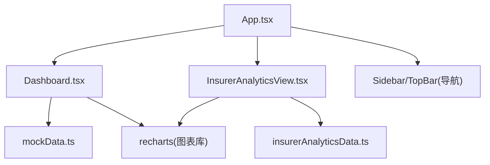
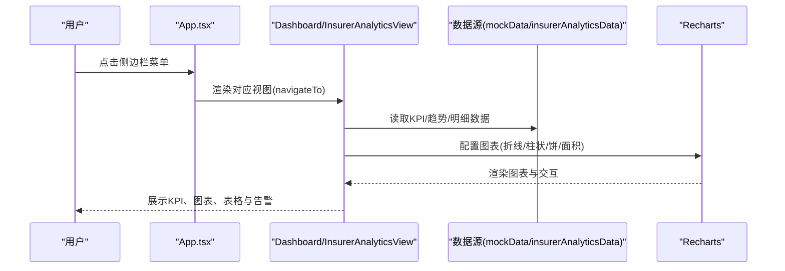
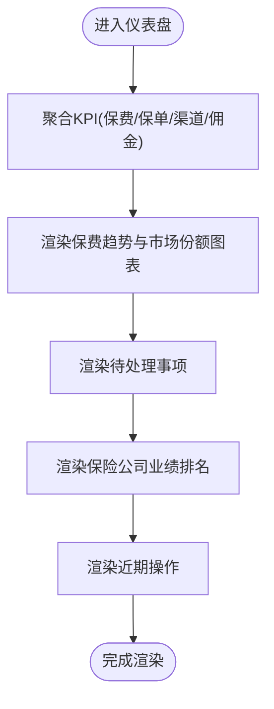
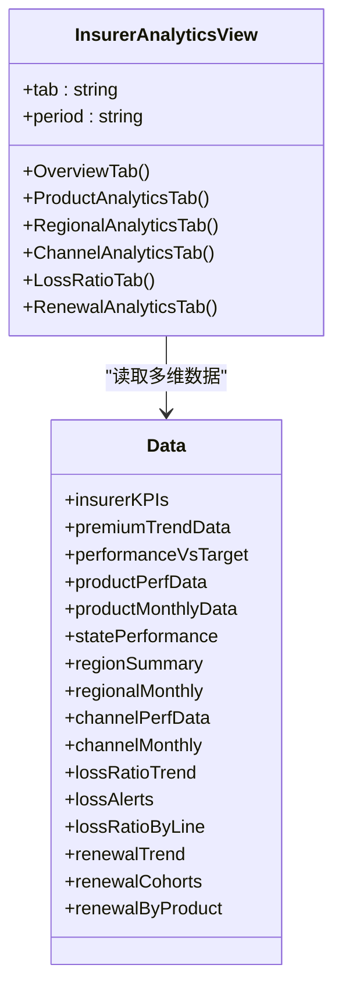
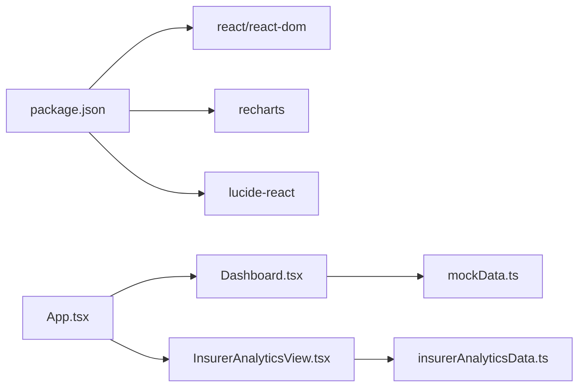

# 仪表盘与数据分析

<cite>
**本文引用的文件**
- [Dashboard.tsx](file://产品方案/UI-V1.0/src/views/Dashboard.tsx)
- [InsurerAnalyticsView.tsx](file://产品方案/UI-V1.0/src/views/InsurerAnalyticsView.tsx)
- [insurerAnalyticsData.ts](file://产品方案/UI-V1.0/src/data/insurerAnalyticsData.ts)
- [mockData.ts](file://产品方案/UI-V1.0/src/data/mockData.ts)
- [App.tsx](file://产品方案/UI-V1.0/src/App.tsx)
- [package.json](file://产品方案/UI-V1.0/package.json)
- [vite.config.ts](file://产品方案/UI-V1.0/vite.config.ts)
</cite>

## 目录
1. [简介](#简介)
2. [项目结构](#项目结构)
3. [核心组件](#核心组件)
4. [架构总览](#架构总览)
5. [详细组件分析](#详细组件分析)
6. [依赖关系分析](#依赖关系分析)
7. [性能考量](#性能考量)
8. [故障排查指南](#故障排查指南)
9. [结论](#结论)
10. [附录](#附录)

## 简介
本文件面向OverInsurData平台的“仪表盘与数据分析”模块，聚焦平台总览仪表盘的KPI指标展示、数据可视化图表实现、趋势分析与市场洞察；并深入说明InsurerAnalyticsView中的保险公司分析功能（业绩统计、赔付率分析、续保率监控等）。文档同时覆盖数据绑定、图表配置、实时数据更新策略与用户交互设计，以及可落地的性能优化与最佳实践。

## 项目结构
该模块基于React + Recharts构建，采用视图层（views）与数据层（data）分离的组织方式：
- 视图层
  - Dashboard.tsx：平台总览仪表盘，包含KPI卡片、保费趋势折线图、市场份额饼图、待处理事项、保险公司业绩排名、近期操作等。
  - InsurerAnalyticsView.tsx：保险公司分析页，按Tab组织为“业绩总览、产品业绩、区域业绩、渠道贡献、赔付率监控、续保率分析”。
- 数据层
  - mockData.ts：总览仪表盘所需的基础数据（保险公司列表、保费趋势、市场份额、告警、近期活动等）。
  - insurerAnalyticsData.ts：保险公司分析页的多维数据（月度趋势、YTD达成、产品明细、区域汇总、渠道表现、赔付率与续保队列等）。
- 应用路由与装配
  - App.tsx：集中管理视图切换与导航参数。
  - vite.config.ts：Vite构建与开发服务器配置，含TailwindCSS与自定义插件。
  - package.json：依赖声明（React、Recharts、Lucide图标等）。

图示来源
- [App.tsx:25-82](file://产品方案/UI-V1.0/src/App.tsx#L25-L82)
- [Dashboard.tsx:1-12](file://产品方案/UI-V1.0/src/views/Dashboard.tsx#L1-L12)
- [InsurerAnalyticsView.tsx:1-22](file://产品方案/UI-V1.0/src/views/InsurerAnalyticsView.tsx#L1-L22)
- [mockData.ts:390-429](file://产品方案/UI-V1.0/src/data/mockData.ts#L390-L429)
- [insurerAnalyticsData.ts:1-35](file://产品方案/UI-V1.0/src/data/insurerAnalyticsData.ts#L1-L35)

章节来源
- [App.tsx:25-82](file://产品方案/UI-V1.0/src/App.tsx#L25-L82)
- [package.json:12-17](file://产品方案/UI-V1.0/package.json#L12-L17)
- [vite.config.ts:19-42](file://产品方案/UI-V1.0/vite.config.ts#L19-L42)

## 核心组件
- 平台总览仪表盘（Dashboard）
  - KPI卡片：聚合保险公司数据计算本年总保费、有效保单数、合作渠道数、本年佣金收入，并显示同比趋势。
  - 保费趋势：近12个月新单、续保、总计的折线趋势。
  - 市场份额：按保险公司的环形饼图占比。
  - 待处理事项：按严重级别与类型渲染告警条目。
  - 保险公司业绩排名：按总保费排序的前6家，展示赔付率、续保率、状态等。
  - 近期操作：最近的用户或系统活动记录。
- 保险公司分析（InsurerAnalyticsView）
  - 业绩总览：平台级KPI条、各保险公司KPI卡片、月度保费趋势、YTD达成对比。
  - 产品业绩：Top增速产品、产品明细表、主要产品月度保费面积图。
  - 区域业绩：区域KPI卡片、区域月度趋势、区域保费与赔付率双轴图、州级明细表。
  - 渠道贡献：层级KPI、渠道规模排名、主要渠道月度趋势、渠道明细表。
  - 赔付率监控：预警卡片、各公司赔付率趋势（含阈值参考线）、业务线赔付率与行业基准对比、公司赔付率汇总。
  - 续保率分析：续保KPI、各公司续保率趋势、队列堆叠柱状图、公司续保率排名、产品续保率对比、月度队列明细表。

章节来源
- [Dashboard.tsx:13-151](file://产品方案/UI-V1.0/src/views/Dashboard.tsx#L13-L151)
- [Dashboard.tsx:153-348](file://产品方案/UI-V1.0/src/views/Dashboard.tsx#L153-L348)
- [InsurerAnalyticsView.tsx:64-165](file://产品方案/UI-V1.0/src/views/InsurerAnalyticsView.tsx#L64-L165)
- [InsurerAnalyticsView.tsx:169-291](file://产品方案/UI-V1.0/src/views/InsurerAnalyticsView.tsx#L169-L291)
- [InsurerAnalyticsView.tsx:295-406](file://产品方案/UI-V1.0/src/views/InsurerAnalyticsView.tsx#L295-L406)
- [InsurerAnalyticsView.tsx:410-522](file://产品方案/UI-V1.0/src/views/InsurerAnalyticsView.tsx#L410-L522)
- [InsurerAnalyticsView.tsx:526-638](file://产品方案/UI-V1.0/src/views/InsurerAnalyticsView.tsx#L526-L638)
- [InsurerAnalyticsView.tsx:642-772](file://产品方案/UI-V1.0/src/views/InsurerAnalyticsView.tsx#L642-L772)

## 架构总览
整体采用“视图-数据”解耦模式：
- 视图层通过导入静态数据源进行渲染，图表由Recharts提供，交互通过本地state控制筛选、排序、Tab切换等。
- 数据层以TS接口定义数据结构，并提供多组时间序列与汇总数据，便于在多个图表中复用。
- 应用层通过App.tsx统一路由分发，将导航函数传递给子视图，实现跨页面跳转。

图示来源
- [App.tsx:32-82](file://产品方案/UI-V1.0/src/App.tsx#L32-L82)
- [Dashboard.tsx:102-119](file://产品方案/UI-V1.0/src/views/Dashboard.tsx#L102-L119)
- [InsurerAnalyticsView.tsx:776-793](file://产品方案/UI-V1.0/src/views/InsurerAnalyticsView.tsx#L776-L793)
- [insurerAnalyticsData.ts:39-56](file://产品方案/UI-V1.0/src/data/insurerAnalyticsData.ts#L39-L56)
- [mockData.ts:390-429](file://产品方案/UI-V1.0/src/data/mockData.ts#L390-L429)

## 详细组件分析

### 平台总览仪表盘（Dashboard）
- KPI聚合逻辑
  - 从保险公司列表聚合本年总保费、有效保单数、合作渠道数、本年佣金收入，并计算平均赔付率用于辅助判断。
  - 使用格式化函数对金额与百分比进行统一展示。
- 图表渲染机制
  - 保费趋势：折线图，展示新单、续保、总计三条线，支持Tooltip与自定义样式。
  - 市场份额：环形饼图，按保险公司占比展示，附带Tooltip显示占比与对应保费。
- 用户交互
  - 顶部时间选择器（本年度/上年度/近12个月）与导出报告按钮。
  - 保险公司业绩排名表格支持点击跳转到列表页。
- 数据绑定
  - 直接绑定mockData中的insurers、premiumTrendData、marketShareData、alertItems、recentActivities。

图示来源
- [Dashboard.tsx:13-18](file://产品方案/UI-V1.0/src/views/Dashboard.tsx#L13-L18)
- [Dashboard.tsx:153-222](file://产品方案/UI-V1.0/src/views/Dashboard.tsx#L153-L222)
- [Dashboard.tsx:224-348](file://产品方案/UI-V1.0/src/views/Dashboard.tsx#L224-L348)
- [mockData.ts:390-429](file://产品方案/UI-V1.0/src/data/mockData.ts#L390-L429)

章节来源
- [Dashboard.tsx:13-151](file://产品方案/UI-V1.0/src/views/Dashboard.tsx#L13-L151)
- [Dashboard.tsx:153-348](file://产品方案/UI-V1.0/src/views/Dashboard.tsx#L153-L348)
- [mockData.ts:390-429](file://产品方案/UI-V1.0/src/data/mockData.ts#L390-L429)

### 保险公司分析（InsurerAnalyticsView）
- Tab结构与状态管理
  - 使用本地state维护当前Tab与周期选择，Tab包括：业绩总览、产品业绩、区域业绩、渠道贡献、赔付率监控、续保率分析。
- 业绩总览
  - 平台KPI条：年化保费、佣金收入、综合赔付率、综合续保率。
  - 保险公司KPI卡片：保费规模、增速、赔付率、续保率、活跃保单/渠道/产品数。
  - 月度保费趋势：按保险公司维度绘制折线。
  - YTD达成：实际vs目标对比柱状图。
- 产品业绩
  - Top增速产品卡片。
  - 产品明细表：支持按保险公司筛选与多维度排序（保费规模、增速、赔付率、续保率）。
  - 主要产品月度保费趋势：面积图带渐变填充。
- 区域业绩
  - 区域KPI卡片：保费、州数量、增长、赔付率。
  - 区域月度趋势：面积图。
  - 区域保费与赔付率对比：双轴图（左轴保费，右轴赔付率）。
  - 州级明细表：支持按区域筛选与查看全部。
- 渠道贡献
  - 层级KPI：Platinum/Gold/Silver/Bronze四档。
  - 渠道规模排名：水平柱状图。
  - 主要渠道月度趋势：折线图。
  - 渠道明细表：层级、保费贡献、占比、增速、佣金、赔付率、续保率等。
- 赔付率监控
  - 预警卡片：严重/警告/关注三级，显示当前比率、阈值、趋势与备注。
  - 各公司赔付率趋势：折线图+阈值参考线。
  - 业务线赔付率 vs 行业基准：柱状图+基准线。
  - 公司赔付率汇总：进度条式可视化。
- 续保率分析
  - 续保KPI：平台综合续保率、到期/已续保数量、续保保费增长。
  - 各公司续保率趋势：折线图+85%参考线。
  - 队列堆叠柱状图：已续保/主动取消/自动失效构成。
  - 公司续保率排名：横向进度条+变化量。
  - 产品续保率对比：水平柱状图+85%参考线。
  - 月度队列明细表：账期、到期/续保/取消/失效、续保率、件均保费变动。

图示来源
- [InsurerAnalyticsView.tsx:776-793](file://产品方案/UI-V1.0/src/views/InsurerAnalyticsView.tsx#L776-L793)
- [insurerAnalyticsData.ts:8-35](file://产品方案/UI-V1.0/src/data/insurerAnalyticsData.ts#L8-L35)
- [insurerAnalyticsData.ts:60-96](file://产品方案/UI-V1.0/src/data/insurerAnalyticsData.ts#L60-L96)
- [insurerAnalyticsData.ts:100-155](file://产品方案/UI-V1.0/src/data/insurerAnalyticsData.ts#L100-L155)
- [insurerAnalyticsData.ts:159-194](file://产品方案/UI-V1.0/src/data/insurerAnalyticsData.ts#L159-L194)
- [insurerAnalyticsData.ts:198-236](file://产品方案/UI-V1.0/src/data/insurerAnalyticsData.ts#L198-L236)
- [insurerAnalyticsData.ts:240-275](file://产品方案/UI-V1.0/src/data/insurerAnalyticsData.ts#L240-L275)

章节来源
- [InsurerAnalyticsView.tsx:64-165](file://产品方案/UI-V1.0/src/views/InsurerAnalyticsView.tsx#L64-L165)
- [InsurerAnalyticsView.tsx:169-291](file://产品方案/UI-V1.0/src/views/InsurerAnalyticsView.tsx#L169-L291)
- [InsurerAnalyticsView.tsx:295-406](file://产品方案/UI-V1.0/src/views/InsurerAnalyticsView.tsx#L295-L406)
- [InsurerAnalyticsView.tsx:410-522](file://产品方案/UI-V1.0/src/views/InsurerAnalyticsView.tsx#L410-L522)
- [InsurerAnalyticsView.tsx:526-638](file://产品方案/UI-V1.0/src/views/InsurerAnalyticsView.tsx#L526-L638)
- [InsurerAnalyticsView.tsx:642-772](file://产品方案/UI-V1.0/src/views/InsurerAnalyticsView.tsx#L642-L772)
- [insurerAnalyticsData.ts:1-275](file://产品方案/UI-V1.0/src/data/insurerAnalyticsData.ts#L1-L275)

## 依赖关系分析
- 外部依赖
  - React与React DOM：组件化UI框架。
  - Recharts：图表渲染库，提供折线、柱状、饼、面积、雷达等多种图表能力。
  - Lucide React：图标库，用于KPI与交互元素图标。
- 内部依赖
  - App.tsx作为入口，负责视图切换与导航参数传递。
  - Dashboard与InsurerAnalyticsView分别依赖mockData与insurerAnalyticsData的数据结构。
  - 图表组件通过ResponsiveContainer适配不同屏幕尺寸。

图示来源
- [package.json:12-17](file://产品方案/UI-V1.0/package.json#L12-L17)
- [App.tsx:25-82](file://产品方案/UI-V1.0/src/App.tsx#L25-L82)
- [Dashboard.tsx:1-12](file://产品方案/UI-V1.0/src/views/Dashboard.tsx#L1-L12)
- [InsurerAnalyticsView.tsx:1-22](file://产品方案/UI-V1.0/src/views/InsurerAnalyticsView.tsx#L1-L22)

章节来源
- [package.json:12-17](file://产品方案/UI-V1.0/package.json#L12-L17)
- [App.tsx:25-82](file://产品方案/UI-V1.0/src/App.tsx#L25-L82)

## 性能考量
- 数据聚合与计算
  - Dashboard在组件顶层对insurers进行reduce聚合，建议在数据较大时考虑使用useMemo缓存结果，避免重复计算。
  - InsurerAnalyticsView中对产品、区域、渠道数据进行过滤与排序，建议将排序与过滤逻辑提取为纯函数并使用useMemo优化。
- 图表渲染
  - 使用Recharts的ResponsiveContainer确保自适应布局；对于大数据集，可考虑分页或采样以减少重绘开销。
  - 自定义Tooltip与Legend仅在必要时渲染，避免过多DOM节点。
- 交互与状态
  - 本地state用于Tab、筛选、排序，保持组件内聚；当状态复杂时可考虑使用useReducer或上下文管理。
- 构建与开发
  - Vite启用TailwindCSS与React插件，生产构建开启压缩；开发环境启用HMR提升迭代效率。
  - 自定义插件增强错误覆盖与React Refresh边界回退，有助于快速定位问题。

章节来源
- [Dashboard.tsx:13-18](file://产品方案/UI-V1.0/src/views/Dashboard.tsx#L13-L18)
- [InsurerAnalyticsView.tsx:169-210](file://产品方案/UI-V1.0/src/views/InsurerAnalyticsView.tsx#L169-L210)
- [vite.config.ts:19-42](file://产品方案/UI-V1.0/vite.config.ts#L19-L42)
- [vite.config.ts:228-296](file://产品方案/UI-V1.0/vite.config.ts#L228-L296)

## 故障排查指南
- 图表不显示或空白
  - 检查数据源是否完整（如insurerKPIs、premiumTrendData等），确认字段名与图表dataKey一致。
  - 确认ResponsiveContainer容器有明确宽高，避免父容器高度塌陷。
- 交互无效
  - 检查本地state是否正确更新（如Tab、筛选条件），确认事件处理器绑定正确。
- 构建或预览异常
  - 查看Vite控制台错误信息，利用自定义错误覆盖插件复现最近错误。
  - 若React Refresh边界丢失，插件会触发全量刷新，检查组件是否被重新导出导致边界丢失。

章节来源
- [vite.config.ts:228-296](file://产品方案/UI-V1.0/vite.config.ts#L228-L296)

## 结论
本模块通过清晰的视图-数据分层与丰富的图表能力，实现了平台总览与保险公司分析的全面可视化。Dashboard聚焦关键KPI与趋势洞察，InsurerAnalyticsView则提供多维度、细粒度的分析能力（产品、区域、渠道、赔付率、续保率）。结合合理的性能优化与交互设计，能够有效支撑保险业务的日常监控与决策分析。后续可引入真实API替换静态数据，增加实时更新与更复杂的筛选联动，进一步提升用户体验与分析深度。

## 附录
- 关键数据模型
  - 保险公司KPI：包含保费、佣金、赔付率、续保率、活跃保单/渠道/产品数等。
  - 产品业绩：产品名称、保险公司、业务线、保费规模、增速、保单数、赔付率、续保率等。
  - 区域业绩：州级与区域汇总，包含保费、增长率、赔付率、主要保险公司与渠道数。
  - 渠道贡献：层级、保费贡献、占比、增速、佣金、赔付率、续保率等。
  - 赔付率监控：趋势、业务线对比、预警事项。
  - 续保率分析：趋势、队列构成、产品对比、月度明细。

章节来源
- [insurerAnalyticsData.ts:8-35](file://产品方案/UI-V1.0/src/data/insurerAnalyticsData.ts#L8-L35)
- [insurerAnalyticsData.ts:60-96](file://产品方案/UI-V1.0/src/data/insurerAnalyticsData.ts#L60-L96)
- [insurerAnalyticsData.ts:100-155](file://产品方案/UI-V1.0/src/data/insurerAnalyticsData.ts#L100-L155)
- [insurerAnalyticsData.ts:159-194](file://产品方案/UI-V1.0/src/data/insurerAnalyticsData.ts#L159-L194)
- [insurerAnalyticsData.ts:198-236](file://产品方案/UI-V1.0/src/data/insurerAnalyticsData.ts#L198-L236)
- [insurerAnalyticsData.ts:240-275](file://产品方案/UI-V1.0/src/data/insurerAnalyticsData.ts#L240-L275)