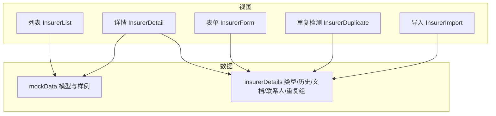
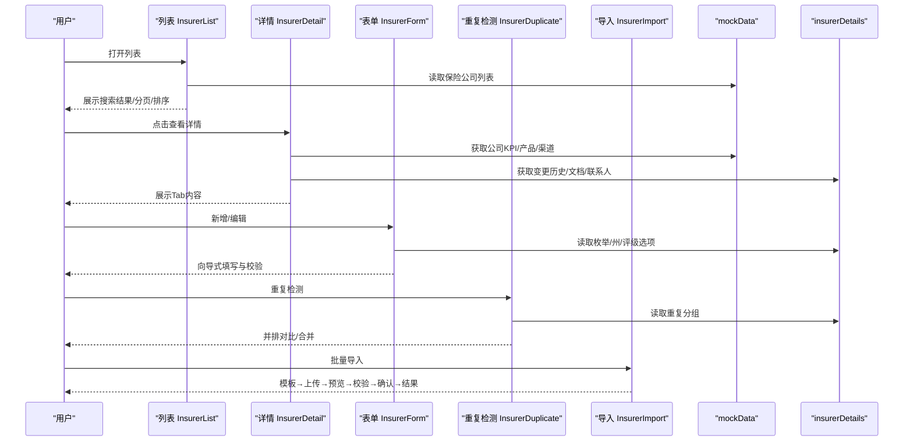
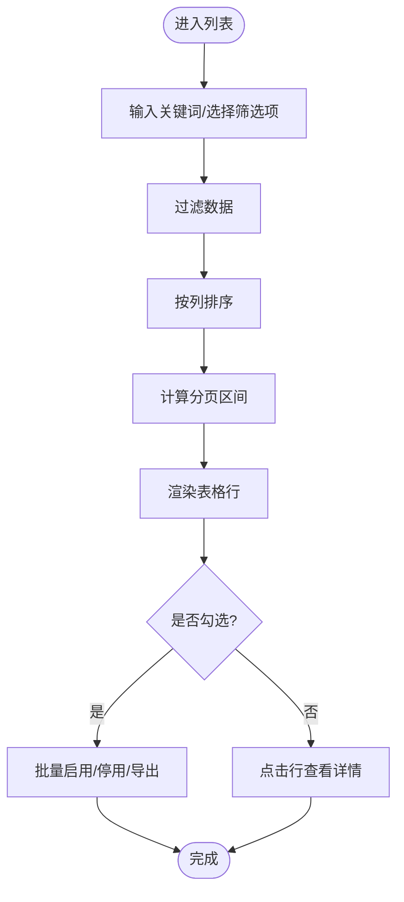
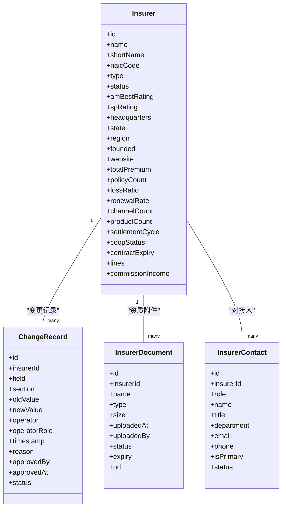
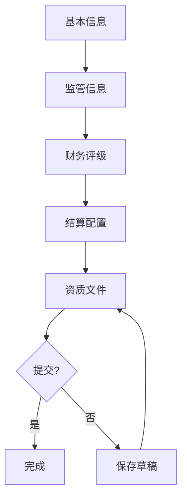
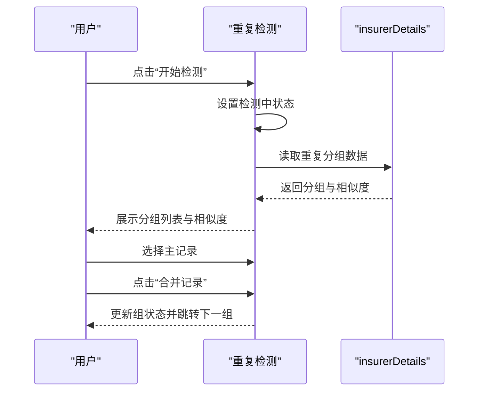
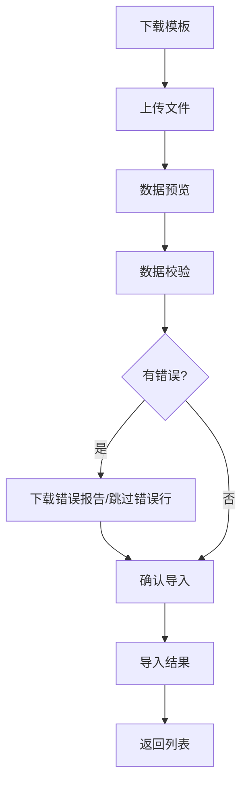
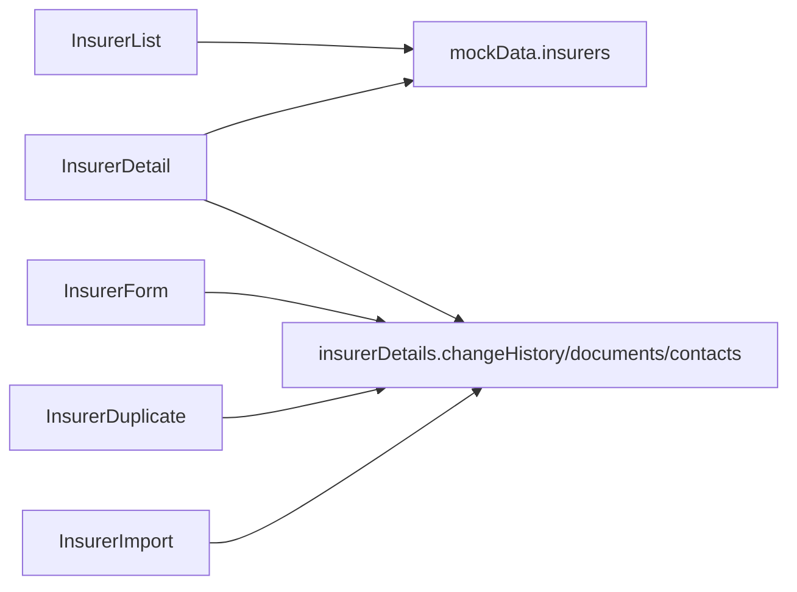

# 保险公司管理模块

<cite>
**本文引用的文件**
- [InsurerList.tsx](file://产品方案/UI-V1.0/src/views/InsurerList.tsx)
- [InsurerDetail.tsx](file://产品方案/UI-V1.0/src/views/InsurerDetail.tsx)
- [InsurerForm.tsx](file://产品方案/UI-V1.0/src/views/InsurerForm.tsx)
- [InsurerDuplicate.tsx](file://产品方案/UI-V1.0/src/views/InsurerDuplicate.tsx)
- [InsurerImport.tsx](file://产品方案/UI-V1.0/src/views/InsurerImport.tsx)
- [insurerDetails.ts](file://产品方案/UI-V1.0/src/data/insurerDetails.ts)
- [mockData.ts](file://产品方案/UI-V1.0/src/data/mockData.ts)
</cite>

## 目录
1. [简介](#简介)
2. [项目结构](#项目结构)
3. [核心组件](#核心组件)
4. [架构总览](#架构总览)
5. [详细组件分析](#详细组件分析)
6. [依赖关系分析](#依赖关系分析)
7. [性能考虑](#性能考虑)
8. [故障排查指南](#故障排查指南)
9. [结论](#结论)
10. [附录](#附录)

## 简介
本模块为 OverInsurData 平台的“保险公司主数据管理”提供完整的前端实现，覆盖以下能力：
- 列表页：搜索、筛选、排序、分页、批量操作（启用/停用、导出）
- 详情页：基本信息、财务评级、关联产品、合作渠道、业绩概览、资质附件、变更历史
- 表单页：新增与编辑的向导式多步骤表单，含字段校验与草稿保存
- 重复检测：按 NAIC 编码与公司名称相似度识别潜在重复，支持并排对比与合并
- 导入导出：Excel 模板下载、拖拽上传、字段映射、预览、校验、确认导入与结果反馈；列表导出选中或全部数据

目标读者包括产品经理、前端开发与测试人员，帮助快速理解业务规则、数据模型与交互流程。

## 项目结构
保险公司管理相关视图与数据集中在 views 与 data 目录下：
- 视图层：列表、详情、表单、重复检测、导入
- 数据层：模拟数据、类型定义、变更历史、文档、联系人、重复分组等

图表来源
- [InsurerList.tsx:1-360](file://产品方案/UI-V1.0/src/views/InsurerList.tsx#L1-L360)
- [InsurerDetail.tsx:1-644](file://产品方案/UI-V1.0/src/views/InsurerDetail.tsx#L1-L644)
- [InsurerForm.tsx:1-517](file://产品方案/UI-V1.0/src/views/InsurerForm.tsx#L1-L517)
- [InsurerDuplicate.tsx:1-276](file://产品方案/UI-V1.0/src/views/InsurerDuplicate.tsx#L1-L276)
- [InsurerImport.tsx:1-384](file://产品方案/UI-V1.0/src/views/InsurerImport.tsx#L1-L384)
- [mockData.ts:1-444](file://产品方案/UI-V1.0/src/data/mockData.ts#L1-L444)
- [insurerDetails.ts:1-140](file://产品方案/UI-V1.0/src/data/insurerDetails.ts#L1-L140)

章节来源
- [InsurerList.tsx:1-360](file://产品方案/UI-V1.0/src/views/InsurerList.tsx#L1-L360)
- [mockData.ts:1-444](file://产品方案/UI-V1.0/src/data/mockData.ts#L1-L444)

## 核心组件
- 列表页：提供全局搜索、多维度筛选、列排序、分页、批量选择与导出，以及跳转新增/编辑/详情、重复检测与批量导入入口
- 详情页：以 Tab 组织信息，展示 KPI、财务评级、产品与渠道、业绩趋势、附件与审计日志，支持启用/停用与编辑
- 表单页：五步向导（基本信息、监管信息、财务评级、结算配置、资质文件），内置必填校验与业务提示，支持草稿保存与提交审核
- 重复检测：基于相似度阈值与匹配字段分组，支持选择主记录、合并或忽略
- 导入：六步流程（模板下载→上传→预览→校验→确认→结果），包含字段映射、错误定位与跳过策略

章节来源
- [InsurerList.tsx:1-360](file://产品方案/UI-V1.0/src/views/InsurerList.tsx#L1-L360)
- [InsurerDetail.tsx:1-644](file://产品方案/UI-V1.0/src/views/InsurerDetail.tsx#L1-L644)
- [InsurerForm.tsx:1-517](file://产品方案/UI-V1.0/src/views/InsurerForm.tsx#L1-L517)
- [InsurerDuplicate.tsx:1-276](file://产品方案/UI-V1.0/src/views/InsurerDuplicate.tsx#L1-L276)
- [InsurerImport.tsx:1-384](file://产品方案/UI-V1.0/src/views/InsurerImport.tsx#L1-L384)

## 架构总览
从用户视角看，模块由“列表→详情/表单/导入/重复检测”构成闭环；数据侧通过 mockData 与 insurerDetails 提供模型与示例数据。

图表来源
- [InsurerList.tsx:1-360](file://产品方案/UI-V1.0/src/views/InsurerList.tsx#L1-L360)
- [InsurerDetail.tsx:1-644](file://产品方案/UI-V1.0/src/views/InsurerDetail.tsx#L1-L644)
- [InsurerForm.tsx:1-517](file://产品方案/UI-V1.0/src/views/InsurerForm.tsx#L1-L517)
- [InsurerDuplicate.tsx:1-276](file://产品方案/UI-V1.0/src/views/InsurerDuplicate.tsx#L1-L276)
- [InsurerImport.tsx:1-384](file://产品方案/UI-V1.0/src/views/InsurerImport.tsx#L1-L384)
- [mockData.ts:1-444](file://产品方案/UI-V1.0/src/data/mockData.ts#L1-L444)
- [insurerDetails.ts:1-140](file://产品方案/UI-V1.0/src/data/insurerDetails.ts#L1-L140)

## 详细组件分析

### 列表页：搜索、筛选、排序、分页与批量操作
- 搜索：支持公司名、简称、NAIC 编码模糊匹配
- 筛选：公司类型、合作状态、大区、AM Best 评级，支持一键重置
- 排序：支持按名称、总保费、赔付率、续保率、渠道数升/降序
- 分页：固定每页条数，显示当前页码与总页数，支持首尾页与上下翻页
- 批量操作：全选/单选，批量启用/停用、导出选中项
- 导航：跳转到新增、编辑、详情、重复检测、批量导入

图表来源
- [InsurerList.tsx:31-58](file://产品方案/UI-V1.0/src/views/InsurerList.tsx#L31-L58)
- [InsurerList.tsx:116-170](file://产品方案/UI-V1.0/src/views/InsurerList.tsx#L116-L170)
- [InsurerList.tsx:173-345](file://产品方案/UI-V1.0/src/views/InsurerList.tsx#L173-L345)

章节来源
- [InsurerList.tsx:1-360](file://产品方案/UI-V1.0/src/views/InsurerList.tsx#L1-L360)

### 详情页：信息展示与管理
- 头部：公司标识、AM Best 评级、合作状态、关键 KPI（总保费、保单数、赔付率、续保率、渠道数、产品数）
- 基本信息：公司全称、简称、NAIC、类型、成立年份、官网、总部地址、州、大区、业务线
- 结算配置：周期、账单格式、截止日、付款期限、货币、归集方式
- 对接人：角色、姓名、职位、部门、邮箱、电话
- 财务评级：多家机构评级与日期、近6月赔付率折线图、健康指标
- 关联产品：产品列表（名称、代码、业务线、类型、保费、保单数、赔付率、状态）
- 合作渠道：渠道列表（名称、类型、等级、贡献保费、占比、赔付率、续保率、状态）
- 业绩概览：月度保费柱状图、核心指标同比变化
- 资质附件：文件列表、到期预警、查看/下载/删除
- 变更历史：时间轴展示字段变更前后值、操作人、审批信息与原因
- 操作：导出 PDF、启用/停用、编辑

图表来源
- [mockData.ts:6-31](file://产品方案/UI-V1.0/src/data/mockData.ts#L6-L31)
- [insurerDetails.ts:1-41](file://产品方案/UI-V1.0/src/data/insurerDetails.ts#L1-L41)

章节来源
- [InsurerDetail.tsx:1-644](file://产品方案/UI-V1.0/src/views/InsurerDetail.tsx#L1-L644)
- [insurerDetails.ts:62-98](file://产品方案/UI-V1.0/src/data/insurerDetails.ts#L62-L98)
- [mockData.ts:86-347](file://产品方案/UI-V1.0/src/data/mockData.ts#L86-L347)

### 表单页：新增与编辑（向导式）
- 步骤划分：基本信息、监管信息、财务评级、结算配置、资质文件
- 必填校验：如 NAIC 编码必须为5位数字；AM Best 评级必填；结算周期与账单格式必填
- 业务提示：Non-Admitted 需额外合规确认；业务线多选；文件上传限制与类型
- 进度与草稿：左侧步骤导航、完成度进度条、保存草稿与提交审核/保存修改

图表来源
- [InsurerForm.tsx:16-22](file://产品方案/UI-V1.0/src/views/InsurerForm.tsx#L16-L22)
- [InsurerForm.tsx:99-109](file://产品方案/UI-V1.0/src/views/InsurerForm.tsx#L99-L109)
- [InsurerForm.tsx:202-511](file://产品方案/UI-V1.0/src/views/InsurerForm.tsx#L202-L511)

章节来源
- [InsurerForm.tsx:1-517](file://产品方案/UI-V1.0/src/views/InsurerForm.tsx#L1-L517)
- [insurerDetails.ts:130-139](file://产品方案/UI-V1.0/src/data/insurerDetails.ts#L130-L139)

### 重复检测：识别、对比与合并
- 检测触发：支持重新检测，模拟异步过程
- 分组与相似度：按相似度百分比与匹配字段分组展示
- 主记录选择：在组内选择保留的主记录
- 合并与忽略：一键合并或标记为非重复，自动切换下一组
- 并排对比：高亮差异字段，提示将被删除的记录及迁移行为

图表来源
- [InsurerDuplicate.tsx:20-41](file://产品方案/UI-V1.0/src/views/InsurerDuplicate.tsx#L20-L41)
- [InsurerDuplicate.tsx:142-261](file://产品方案/UI-V1.0/src/views/InsurerDuplicate.tsx#L142-L261)
- [insurerDetails.ts:100-128](file://产品方案/UI-V1.0/src/data/insurerDetails.ts#L100-L128)

章节来源
- [InsurerDuplicate.tsx:1-276](file://产品方案/UI-V1.0/src/views/InsurerDuplicate.tsx#L1-L276)
- [insurerDetails.ts:100-128](file://产品方案/UI-V1.0/src/data/insurerDetails.ts#L100-L128)

### 导入导出：批量导入流程
- 模板下载：标准模板与空白模板，字段说明与必填标注
- 上传：拖拽或点击上传，支持 .xlsx/.xls，大小限制
- 预览：字段映射确认，解析行数统计，错误行高亮
- 校验：统计通过/失败行数，展示错误详情，支持下载错误报告与跳过错误行
- 确认：汇总导入参数（模式、审核要求等）
- 结果：成功/跳过/待审核数量统计，返回列表

图表来源
- [InsurerImport.tsx:14-21](file://产品方案/UI-V1.0/src/views/InsurerImport.tsx#L14-L21)
- [InsurerImport.tsx:105-379](file://产品方案/UI-V1.0/src/views/InsurerImport.tsx#L105-L379)

章节来源
- [InsurerImport.tsx:1-384](file://产品方案/UI-V1.0/src/views/InsurerImport.tsx#L1-L384)

## 依赖关系分析
- 列表页依赖 mockData 中的保险公司数组进行过滤、排序与分页
- 详情页依赖 mockData 的产品与渠道数据，以及 insurerDetails 的变更历史、文档、联系人
- 表单页依赖 insurerDetails 的州列表、评级枚举与业务线常量
- 重复检测依赖 insurerDetails 的重复分组数据
- 导入页依赖 insurerDetails 的字段映射与校验逻辑（模拟数据）

图表来源
- [InsurerList.tsx:6-7](file://产品方案/UI-V1.0/src/views/InsurerList.tsx#L6-L7)
- [InsurerDetail.tsx:12-14](file://产品方案/UI-V1.0/src/views/InsurerDetail.tsx#L12-L14)
- [InsurerForm.tsx:6-8](file://产品方案/UI-V1.0/src/views/InsurerForm.tsx#L6-L8)
- [InsurerDuplicate.tsx:3-5](file://产品方案/UI-V1.0/src/views/InsurerDuplicate.tsx#L3-L5)
- [InsurerImport.tsx:6-7](file://产品方案/UI-V1.0/src/views/InsurerImport.tsx#L6-L7)

章节来源
- [InsurerList.tsx:1-360](file://产品方案/UI-V1.0/src/views/InsurerList.tsx#L1-L360)
- [InsurerDetail.tsx:1-644](file://产品方案/UI-V1.0/src/views/InsurerDetail.tsx#L1-L644)
- [InsurerForm.tsx:1-517](file://产品方案/UI-V1.0/src/views/InsurerForm.tsx#L1-L517)
- [InsurerDuplicate.tsx:1-276](file://产品方案/UI-V1.0/src/views/InsurerDuplicate.tsx#L1-L276)
- [InsurerImport.tsx:1-384](file://产品方案/UI-V1.0/src/views/InsurerImport.tsx#L1-L384)
- [mockData.ts:1-444](file://产品方案/UI-V1.0/src/data/mockData.ts#L1-L444)
- [insurerDetails.ts:1-140](file://产品方案/UI-V1.0/src/data/insurerDetails.ts#L1-L140)

## 性能考虑
- 列表过滤与排序使用 useMemo 缓存，避免每次渲染重复计算
- 分页切片仅渲染当前页数据，降低 DOM 节点数量
- 详情页图表使用响应式容器，按需渲染最近数据子集
- 导入流程分步推进，减少单次处理的数据量与内存占用
- 建议后续优化：
  - 大数据量时引入虚拟滚动或后端分页
  - 复杂筛选条件可考虑服务端聚合
  - 图表数据按需懒加载

[本节为通用性能建议，不直接分析具体文件]

## 故障排查指南
- 列表无结果：检查搜索词与筛选条件组合，确认重置按钮是否生效
- 详情页数据为空：核对传入的 insurerId 是否存在于 mockData 中
- 表单校验失败：关注 NAIC 编码格式、必填字段与业务提示
- 重复检测未触发：确认已点击“开始检测”，并等待异步状态结束
- 导入失败：查看校验步骤的错误详情，下载错误报告修正后重试

章节来源
- [InsurerList.tsx:116-170](file://产品方案/UI-V1.0/src/views/InsurerList.tsx#L116-L170)
- [InsurerDetail.tsx:56-63](file://产品方案/UI-V1.0/src/views/InsurerDetail.tsx#L56-L63)
- [InsurerForm.tsx:215-223](file://产品方案/UI-V1.0/src/views/InsurerForm.tsx#L215-L223)
- [InsurerDuplicate.tsx:20-23](file://产品方案/UI-V1.0/src/views/InsurerDuplicate.tsx#L20-L23)
- [InsurerImport.tsx:269-311](file://产品方案/UI-V1.0/src/views/InsurerImport.tsx#L269-L311)

## 结论
本模块以清晰的视图分层与数据模型为基础，实现了保险公司主数据的完整生命周期管理：从列表检索到详情洞察，从表单录入到批量导入与重复治理。通过向导式表单与严格的校验规则，保障数据质量；通过重复检测与导入校验，提升数据一致性与准确性。后续可结合后端服务实现持久化与权限控制，进一步增强系统能力。

[本节为总结性内容，不直接分析具体文件]

## 附录

### 数据模型设计要点
- 保险公司实体：包含基础信息、财务指标、结算配置与合作状态
- 变更历史：记录字段级变更、操作人与审批流
- 资质附件：支持有效期管理与状态预警
- 对接人：角色、联系方式与主次标记
- 重复分组：相似度与匹配字段，便于人工决策

章节来源
- [mockData.ts:6-31](file://产品方案/UI-V1.0/src/data/mockData.ts#L6-L31)
- [insurerDetails.ts:1-41](file://产品方案/UI-V1.0/src/data/insurerDetails.ts#L1-L41)
- [insurerDetails.ts:62-98](file://产品方案/UI-V1.0/src/data/insurerDetails.ts#L62-L98)
- [insurerDetails.ts:100-128](file://产品方案/UI-V1.0/src/data/insurerDetails.ts#L100-L128)

### 用户交互流程与业务规则验证
- 列表：搜索/筛选/排序/分页/批量操作，确保高效检索与批量处理
- 详情：多维信息聚合与可视化，辅助运营与风控决策
- 表单：分步引导与强校验，保证主数据完整性与合规性
- 重复检测：相似度阈值与匹配字段，支持主记录选择与合并
- 导入：模板驱动与分步校验，提供错误定位与回退机制

章节来源
- [InsurerList.tsx:31-58](file://产品方案/UI-V1.0/src/views/InsurerList.tsx#L31-L58)
- [InsurerDetail.tsx:189-638](file://产品方案/UI-V1.0/src/views/InsurerDetail.tsx#L189-L638)
- [InsurerForm.tsx:99-109](file://产品方案/UI-V1.0/src/views/InsurerForm.tsx#L99-L109)
- [InsurerDuplicate.tsx:20-41](file://产品方案/UI-V1.0/src/views/InsurerDuplicate.tsx#L20-L41)
- [InsurerImport.tsx:105-379](file://产品方案/UI-V1.0/src/views/InsurerImport.tsx#L105-L379)