# 合作关系管理

<cite>
**本文引用的文件**
- [cooperationData.ts](file://产品方案/UI-V1.0/src/data/cooperationData.ts)
- [CooperationView.tsx](file://产品方案/UI-V1.0/src/views/CooperationView.tsx)
- [mockData.ts](file://产品方案/UI-V1.0/src/data/mockData.ts)
- [产品功能清单_V1.0.0.md](file://产品需求/产品功能清单_V1.0.0.md)
- [技术方案_海外保险数字化平台_V1.0.0.md](file://项目概述/技术方案_海外保险数字化平台_V1.0.0.md)
</cite>

## 目录
1. [引言](#引言)
2. [项目结构](#项目结构)
3. [核心组件](#核心组件)
4. [架构总览](#架构总览)
5. [详细组件分析](#详细组件分析)
6. [依赖关系分析](#依赖关系分析)
7. [性能与可用性考虑](#性能与可用性考虑)
8. [故障排查指南](#故障排查指南)
9. [结论](#结论)
10. [附录：数据模型与状态机](#附录数据模型与状态机)

## 引言
本文件面向OverInsurData平台的“合作关系管理”模块，聚焦保险公司与渠道之间的合作关系全生命周期管理：从建立、维护、监控到终止。文档围绕合作关系的配置选项、协议条款管理、绩效评估机制、合作状态跟踪、合同管理、授权范围控制、到期提醒与续约流程等关键业务场景展开，并结合前端原型与后端技术方案，给出可落地的数据模型设计与状态机转换方案，帮助开发者理解B2B合作管理的核心实现路径。

## 项目结构
当前仓库中与合作关系管理直接相关的代码与文档分布如下：
- 前端原型（UI-V1.0）
  - 视图层：CooperationView.tsx 提供“合作关系建立/终止、合同协议、结算参数、对接人联络、续约管理、产品资源接入”等Tab页与交互流程。
  - 数据层：cooperationData.ts 定义合作关系、合同、结算参数、对接人、续约项、产品接入等数据结构与示例数据。
  - 主数据：mockData.ts 提供保险公司、产品、渠道、Appointment等主数据样例，用于界面展示与联动筛选。
- 产品需求
  - 产品功能清单_V1.0.0.md 明确“我司与保险公司合作管理”的业务范围与操作级能力，包括合作关系建立/终止、合同协议、结算参数、对接人、续约管理等。
- 技术方案
  - 技术方案_海外保险数字化平台_V1.0.0.md 给出整体微服务拆分、数据库划分、事件驱动、合规引擎、审批流等设计，其中cooperation-service负责合作关系/合同/结算参数/产品接入/渠道授权/出单权限限额等。

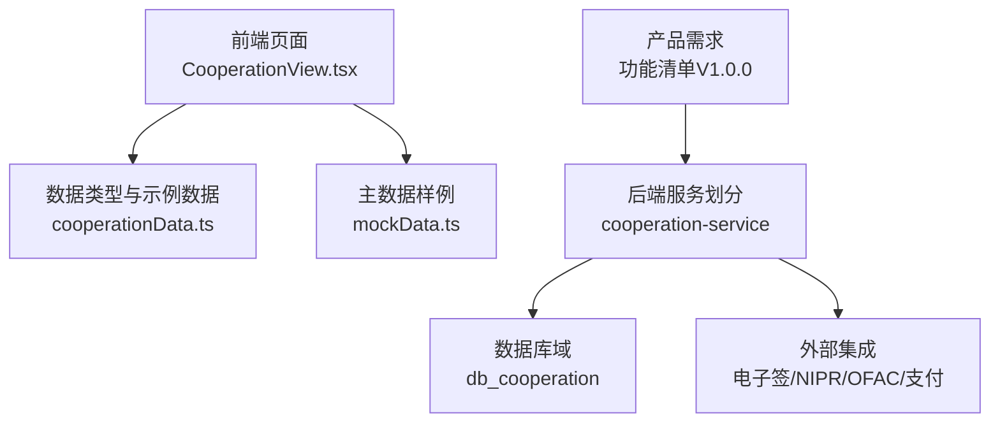

**图表来源**
- [CooperationView.tsx:21-29](file://产品方案/UI-V1.0/src/views/CooperationView.tsx#L21-L29)
- [cooperationData.ts:5-22](file://产品方案/UI-V1.0/src/data/cooperationData.ts#L5-L22)
- [技术方案_海外保险数字化平台_V1.0.0.md:194-213](file://项目概述/技术方案_海外保险数字化平台_V1.0.0.md#L194-L213)

**章节来源**
- [CooperationView.tsx:21-29](file://产品方案/UI-V1.0/src/views/CooperationView.tsx#L21-L29)
- [cooperationData.ts:5-22](file://产品方案/UI-V1.0/src/data/cooperationData.ts#L5-L22)
- [产品功能清单_V1.0.0.md:372-549](file://产品需求/产品功能清单_V1.0.0.md#L372-L549)
- [技术方案_海外保险数字化平台_V1.0.0.md:194-213](file://项目概述/技术方案_海外保险数字化平台_V1.0.0.md#L194-L213)

## 核心组件
- 合作关系建立与终止
  - 建立：四步向导式申请（选择保险公司→合作范围→条款确认→提交），支持业务线、经营州、佣金等级等配置；提交后进入合规审核流程。
  - 终止：对已生效合作发起终止，预览影响范围（产品数、渠道授权、在途报价、有效保单、未结佣金），支持过渡期设置与批量收回下游渠道授权。
- 合同协议管理
  - 多类型合同（主协议、佣金表、数据共享、补充协议、NDA等），版本化、签署方、有效期、到期提醒、自动续约开关、标签分类。
- 结算参数配置
  - 周期（月/季/半年）、账单截止日、付款账期、支付方式、保费归集方式、对账格式（CSV/EDI/API/Excel）、API实时对账开关、联系人等。
- 对接人联络
  - 按角色（核保、理赔、财务、IT/API、法务、市场、高管）维护联系人，标记主要联系人、升级联系人、首选联系方式与时区。
- 续约管理
  - 时间轴视图，按优先级与剩余天数排序，记录最后动作与日期，支持风险预警与续约谈判跟踪。
- 产品资源接入
  - 产品接入状态机（可接入→已申请→审核中→已批准→已接入/拒绝/暂停），技术需求、目标州、测试完成度、预估保费等。

**章节来源**
- [CooperationView.tsx:84-299](file://产品方案/UI-V1.0/src/views/CooperationView.tsx#L84-L299)
- [CooperationView.tsx:496-634](file://产品方案/UI-V1.0/src/views/CooperationView.tsx#L496-L634)
- [CooperationView.tsx:636-757](file://产品方案/UI-V1.0/src/views/CooperationView.tsx#L636-L757)
- [CooperationView.tsx:759-800](file://产品方案/UI-V1.0/src/views/CooperationView.tsx#L759-L800)
- [cooperationData.ts:93-183](file://产品方案/UI-V1.0/src/data/cooperationData.ts#L93-L183)
- [cooperationData.ts:185-252](file://产品方案/UI-V1.0/src/data/cooperationData.ts#L185-L252)
- [cooperationData.ts:254-286](file://产品方案/UI-V1.0/src/data/cooperationData.ts#L254-L286)
- [cooperationData.ts:288-342](file://产品方案/UI-V1.0/src/data/cooperationData.ts#L288-L342)
- [cooperationData.ts:344-422](file://产品方案/UI-V1.0/src/data/cooperationData.ts#L344-L422)
- [产品功能清单_V1.0.0.md:383-549](file://产品需求/产品功能清单_V1.0.0.md#L383-L549)

## 架构总览
- 前端应用
  - 管理后台（Admin）：合作关系管理、合同协议、结算参数、对接人、续约、产品接入等。
  - 渠道门户（Portal）：面向渠道的报价出单、保单、佣金、培训等（与本模块间接相关）。
- 后端服务
  - cooperation-service：承载合作关系、合同、结算参数、产品接入、渠道授权、出单权限限额等业务。
  - 其他服务：认证授权、主数据、入驻、合规、佣金、绩效、培训、通知、报表、文件等。
- 数据层
  - db_cooperation：合作关系、合同、结算参数、产品接入、渠道授权、出单权限限额等。
  - 审计日志、拦截日志写入Elasticsearch；分析数据入ClickHouse；文件存S3。
- 外部集成
  - NIPR、OFAC、核心保单系统、电子签名、背景调查、银行支付、邮件短信等。

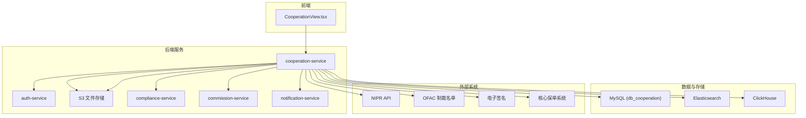

**图表来源**
- [技术方案_海外保险数字化平台_V1.0.0.md:194-213](file://项目概述/技术方案_海外保险数字化平台_V1.0.0.md#L194-L213)
- [技术方案_海外保险数字化平台_V1.0.0.md:282-306](file://项目概述/技术方案_海外保险数字化平台_V1.0.0.md#L282-L306)
- [技术方案_海外保险数字化平台_V1.0.0.md:360-386](file://项目概述/技术方案_海外保险数字化平台_V1.0.0.md#L360-L386)

## 详细组件分析

### 合作关系建立（向导式流程）
- 步骤说明
  - 选择保险公司：过滤尚未建立“合作中”关系的保险公司。
  - 合作范围：选择合作类型（全服务/优选/专项/Surplus Lines）、业务线、经营州。
  - 条款确认：选择佣金等级、填写备注，生成申请摘要。
  - 提交：进入内部合规审核，预计5–10个工作日，结果邮件通知。
- 交互要点
  - 向导进度条、单选/多选控件、校验与禁用逻辑。
  - 提交成功后返回成功提示并关闭向导。

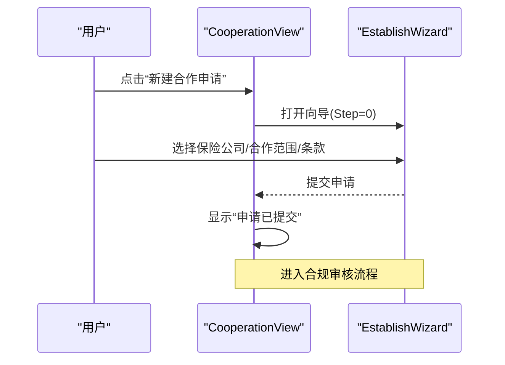

**图表来源**
- [CooperationView.tsx:84-299](file://产品方案/UI-V1.0/src/views/CooperationView.tsx#L84-L299)

**章节来源**
- [CooperationView.tsx:84-299](file://产品方案/UI-V1.0/src/views/CooperationView.tsx#L84-L299)
- [产品功能清单_V1.0.0.md:383-403](file://产品需求/产品功能清单_V1.0.0.md#L383-L403)

### 合作关系终止（影响面与过渡期）
- 终止前检查
  - 展示受影响的产品数、渠道授权数、在途报价单、有效保单、未结佣金金额。
- 终止策略
  - 在途业务处理（继续完成/作废/转其他公司）、有效保单后续服务安排、未结佣金结算计划。
  - 自动收回下游渠道对该保险公司的全部产品销售授权，批量终止渠道在该公司的Appointment。
  - 设置立即或未来生效日期，支持过渡期（过渡期内不可新单但可处理在途）。
- 审批与审计
  - 需法务/合规/总经理审批；完成后生成审计报告，确认授权回收与佣金结清。

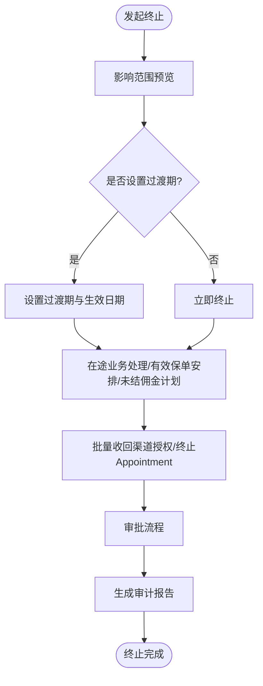

**图表来源**
- [CooperationView.tsx:496-563](file://产品方案/UI-V1.0/src/views/CooperationView.tsx#L496-L563)
- [产品功能清单_V1.0.0.md:404-424](file://产品需求/产品功能清单_V1.0.0.md#L404-L424)

**章节来源**
- [CooperationView.tsx:496-563](file://产品方案/UI-V1.0/src/views/CooperationView.tsx#L496-L563)
- [产品功能清单_V1.0.0.md:404-424](file://产品需求/产品功能清单_V1.0.0.md#L404-L424)

### 合同协议管理（版本化与到期提醒）
- 合同类型与字段
  - 类型：主协议、佣金表、数据共享、补充协议、NDA等。
  - 关键字段：版本号、生效/到期日、签署方、文件大小、上传人与时间、到期提醒天数、自动续约开关、标签。
- 列表与操作
  - 展示有效/即将到期/已到期数量；支持查看、下载、续约、签署等操作。
  - 即将到期时高亮剩余天数，支持一键跳转续约。

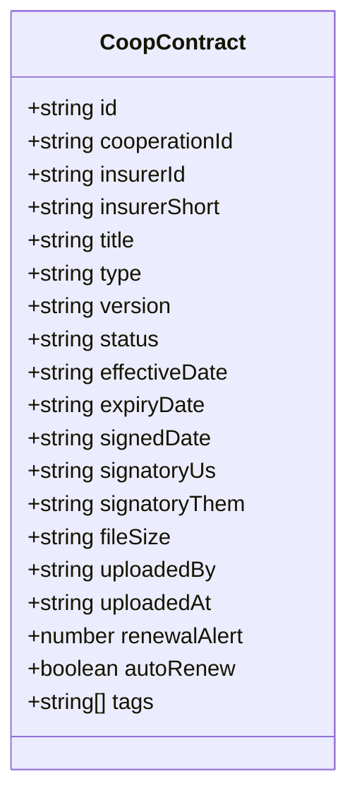

**图表来源**
- [cooperationData.ts:93-183](file://产品方案/UI-V1.0/src/data/cooperationData.ts#L93-L183)

**章节来源**
- [cooperationData.ts:93-183](file://产品方案/UI-V1.0/src/data/cooperationData.ts#L93-L183)
- [CooperationView.tsx:565-634](file://产品方案/UI-V1.0/src/views/CooperationView.tsx#L565-L634)
- [产品功能清单_V1.0.0.md:425-449](file://产品需求/产品功能清单_V1.0.0.md#L425-L449)

### 结算参数配置（周期、对账与支付）
- 配置项
  - 结算周期（月/季/半年）、账单截止日、付款账期、支付方式（ACH/Wire/Check/EFT）、保费归集方式、对账格式（CSV/EDI/API/Excel）、API实时对账开关、对账联系人、银行账户、备注等。
- 编辑与保存
  - 表单编辑，保存后反馈成功；支持按保险公司分组查看与编辑。

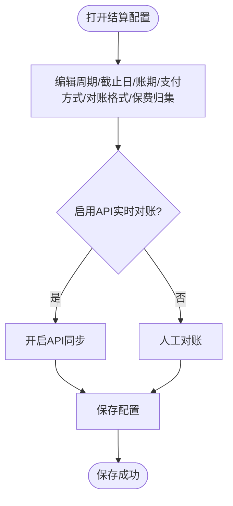

**图表来源**
- [CooperationView.tsx:301-354](file://产品方案/UI-V1.0/src/views/CooperationView.tsx#L301-L354)
- [cooperationData.ts:185-252](file://产品方案/UI-V1.0/src/data/cooperationData.ts#L185-L252)

**章节来源**
- [CooperationView.tsx:301-354](file://产品方案/UI-V1.0/src/views/CooperationView.tsx#L301-L354)
- [cooperationData.ts:185-252](file://产品方案/UI-V1.0/src/data/cooperationData.ts#L185-L252)
- [产品功能清单_V1.0.0.md:450-475](file://产品需求/产品功能清单_V1.0.0.md#L450-L475)

### 对接人联络（角色与沟通记录）
- 角色与标识
  - 角色：核保、理赔、财务、IT/API、法务、市场、高管；标记主要联系人、升级联系人、首选联系方式与时区。
- 列表与操作
  - 按保险公司分组展示，支持添加、编辑、联系（邮件/消息）、备注等。

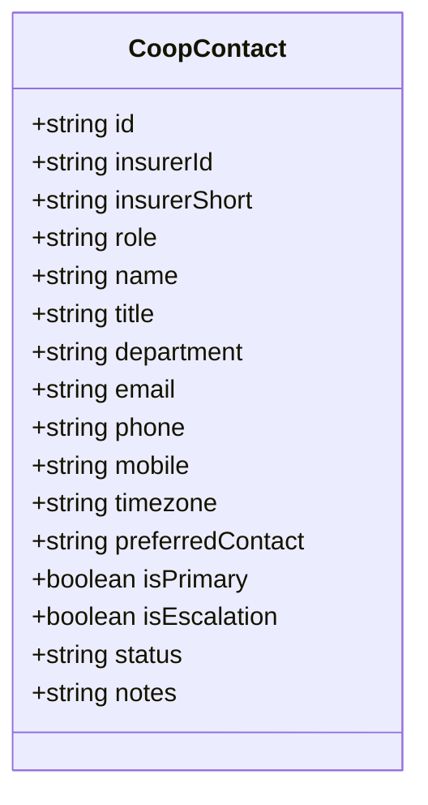

**图表来源**
- [cooperationData.ts:254-286](file://产品方案/UI-V1.0/src/data/cooperationData.ts#L254-L286)

**章节来源**
- [cooperationData.ts:254-286](file://产品方案/UI-V1.0/src/data/cooperationData.ts#L254-L286)
- [CooperationView.tsx:690-757](file://产品方案/UI-V1.0/src/views/CooperationView.tsx#L690-L757)
- [产品功能清单_V1.0.0.md:476-499](file://产品需求/产品功能清单_V1.0.0.md#L476-L499)

### 续约管理（时间轴与风险提示）
- 时间轴视图
  - 按剩余天数排序，显示到期日、状态、优先级、最后动作与日期、备注。
  - 超期与临近到期以颜色区分，支持快速定位高风险项。
- 续约决策
  - 续约评估（业绩、质量、战略匹配度）、续约谈判记录、续签合同签署、续约生效延长合作到期日。

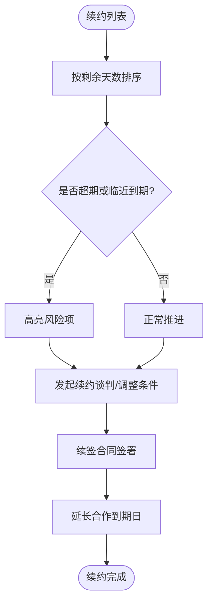

**图表来源**
- [CooperationView.tsx:759-800](file://产品方案/UI-V1.0/src/views/CooperationView.tsx#L759-L800)
- [cooperationData.ts:288-342](file://产品方案/UI-V1.0/src/data/cooperationData.ts#L288-L342)

**章节来源**
- [CooperationView.tsx:759-800](file://产品方案/UI-V1.0/src/views/CooperationView.tsx#L759-L800)
- [cooperationData.ts:288-342](file://产品方案/UI-V1.0/src/data/cooperationData.ts#L288-L342)
- [产品功能清单_V1.0.0.md:500-523](file://产品需求/产品功能清单_V1.0.0.md#L500-L523)

### 产品资源接入（接入状态机）
- 状态机
  - 可接入→已申请→审核中→已批准→已接入/拒绝/暂停。
- 字段与流程
  - 产品名称/代码/业务线、请求/批准/接入日期、技术需求、目标州、预估保费、API文档、测试完成度等。
- 与上游合作的联动
  - 待主合作申请审批通过后启动产品接入；若合同到期，可能暂停新产品接入。

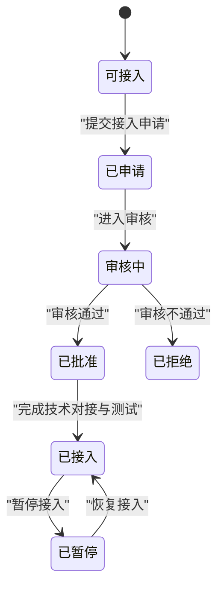

**图表来源**
- [cooperationData.ts:344-422](file://产品方案/UI-V1.0/src/data/cooperationData.ts#L344-L422)

**章节来源**
- [cooperationData.ts:344-422](file://产品方案/UI-V1.0/src/data/cooperationData.ts#L344-L422)
- [产品功能清单_V1.0.0.md:524-549](file://产品需求/产品功能清单_V1.0.0.md#L524-L549)

## 依赖关系分析
- 前端依赖
  - CooperationView.tsx 依赖 cooperationData.ts 的数据结构与示例数据，以及 mockData.ts 的主数据（保险公司、产品、渠道、Appointment）。
- 后端依赖
  - cooperation-service 依赖 master-data-service（保险公司/产品/渠道主数据）、compliance-service（合规校验）、commission-service（佣金结算）、notification-service（通知）、file-service（合同附件）、外部系统（电子签、NIPR、OFAC、核心保单系统）。
- 数据依赖
  - db_cooperation 存储合作关系、合同、结算参数、产品接入、渠道授权、出单权限限额；审计与拦截日志写入ES；分析数据入ClickHouse；文件存S3。

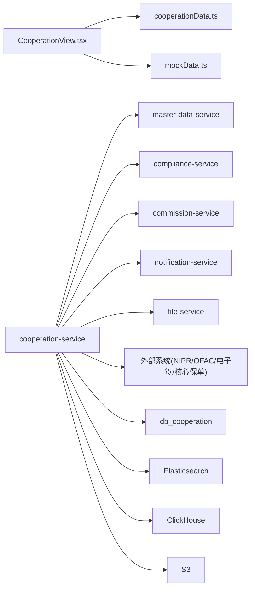

**图表来源**
- [技术方案_海外保险数字化平台_V1.0.0.md:194-213](file://项目概述/技术方案_海外保险数字化平台_V1.0.0.md#L194-L213)
- [技术方案_海外保险数字化平台_V1.0.0.md:282-306](file://项目概述/技术方案_海外保险数字化平台_V1.0.0.md#L282-L306)
- [技术方案_海外保险数字化平台_V1.0.0.md:360-386](file://项目概述/技术方案_海外保险数字化平台_V1.0.0.md#L360-L386)

**章节来源**
- [技术方案_海外保险数字化平台_V1.0.0.md:194-213](file://项目概述/技术方案_海外保险数字化平台_V1.0.0.md#L194-L213)
- [技术方案_海外保险数字化平台_V1.0.0.md:282-306](file://项目概述/技术方案_海外保险数字化平台_V1.0.0.md#L282-L306)
- [技术方案_海外保险数字化平台_V1.0.0.md:360-386](file://项目概述/技术方案_海外保险数字化平台_V1.0.0.md#L360-L386)

## 性能与可用性考虑
- 前端性能
  - 路由级代码分割、列表虚拟滚动、请求缓存（TanStack Query）、大文件导出异步任务+轮询下载。
- 后端性能
  - 合规校验引擎串行短路、缓存命中（Redis）、降级策略（NIPR不可用以本地缓存兜底）、审计日志写ES。
  - 佣金计算引擎分片并行、快照机制、增量/全量重算、失败重试与断点续算。
- 可用性与容量
  - 多副本+Multi-AZ、熔断降级、金丝雀发布；P95响应≤2秒、合规校验≤500ms、佣金计算≤4小时、5000并发/100TPS。
- 备份与恢复
  - RDS每日快照+事务日志备份、跨区容灾、季度恢复演练；RPO≤1h/RTO≤4h。

**章节来源**
- [技术方案_海外保险数字化平台_V1.0.0.md:162-173](file://项目概述/技术方案_海外保险数字化平台_V1.0.0.md#L162-L173)
- [技术方案_海外保险数字化平台_V1.0.0.md:215-253](file://项目概述/技术方案_海外保险数字化平台_V1.0.0.md#L215-L253)
- [技术方案_海外保险数字化平台_V1.0.0.md:488-512](file://项目概述/技术方案_海外保险数字化平台_V1.0.0.md#L488-L512)
- [技术方案_海外保险数字化平台_V1.0.0.md:349-357](file://项目概述/技术方案_海外保险数字化平台_V1.0.0.md#L349-L357)

## 故障排查指南
- 常见问题定位
  - 合同即将到期未提醒：检查renewalAlert与autoRenew配置；核对expiryDate与当前时间差计算。
  - 续约时间轴异常：检查daysLeft计算与状态映射；确认lastAction与lastActionDate更新。
  - 结算参数未生效：检查status（active/pending-review/suspended）与updatedBy/lastUpdated；确认审批流程。
  - 产品接入卡住：检查IntegrationStatus流转（requested→in-review→approved→integrated/rejected/suspended）与技术需求完成度。
- 日志与审计
  - 合规拦截日志与审计日志写入ES，支持按traceId关联查询；保留≥5年。
  - 外部调用日志记录请求/响应/耗时，便于排障与对账。
- 外部集成异常
  - NIPR/OFAC接口超时或失败：适配器重试+熔断降级；结果落库+缓存；失败自动重试并标记待重试。

**章节来源**
- [cooperationData.ts:93-183](file://产品方案/UI-V1.0/src/data/cooperationData.ts#L93-L183)
- [cooperationData.ts:288-342](file://产品方案/UI-V1.0/src/data/cooperationData.ts#L288-L342)
- [cooperationData.ts:185-252](file://产品方案/UI-V1.0/src/data/cooperationData.ts#L185-L252)
- [cooperationData.ts:344-422](file://产品方案/UI-V1.0/src/data/cooperationData.ts#L344-L422)
- [技术方案_海外保险数字化平台_V1.0.0.md:360-386](file://项目概述/技术方案_海外保险数字化平台_V1.0.0.md#L360-L386)

## 结论
本模块以“合作关系”为核心，贯穿合同协议、结算参数、对接人、续约与产品接入等关键业务环节，形成完整的B2B合作管理闭环。前端原型提供了直观的向导式操作与可视化看板，后端技术方案明确了服务拆分、数据域划分、事件驱动与合规引擎等落地方案。建议在实际开发中：
- 严格遵循数据模型与状态机设计，确保状态流转可追溯、可审计。
- 强化到期提醒与续约自动化，降低人为遗漏风险。
- 完善外部集成适配与降级策略，保障系统稳定性与可用性。
- 结合合规校验引擎与审批流，确保所有关键变更受控且可审计。

## 附录：数据模型与状态机

### 数据模型概览
- 合作关系（CooperationRelationship）
  - 关键字段：id、insurerId、insurerName、type、status、startDate、endDate、scope、territoryStates、commissionTier、accountManager、submittedDate、notes等。
- 合同（CoopContract）
  - 关键字段：id、cooperationId、insurerId、title、type、version、status、effectiveDate、expiryDate、signedDate、signatoryUs、signatoryThem、fileSize、uploadedBy、uploadedAt、renewalAlert、autoRenew、tags。
- 结算参数（SettlementConfig）
  - 关键字段：id、insurerId、cycle、billCutoffDay、paymentTermDays、paymentMethod、currency、premiumCollection、billingFormat、apiEnabled、reconciliationContact、bankAccount、routingNote、lastUpdated、updatedBy、status、notes。
- 对接人（CoopContact）
  - 关键字段：id、insurerId、role、name、title、department、email、phone、mobile、timezone、preferredContact、isPrimary、isEscalation、status、notes。
- 续约项（RenewalItem）
  - 关键字段：id、insurerId、type、title、expiryDate、autoRenew、status、daysLeft、accountManager、renewalContact、lastAction、lastActionDate、priority、notes。
- 产品接入（ProductIntegration）
  - 关键字段：id、insurerId、productName、productCode、line、requestDate、approvedDate、integratedDate、status、requestedBy、priority、estimatedPremium、targetStates、technicalReqs、notes、apiDoc、testCompleted。

**章节来源**
- [cooperationData.ts:5-22](file://产品方案/UI-V1.0/src/data/cooperationData.ts#L5-L22)
- [cooperationData.ts:93-183](file://产品方案/UI-V1.0/src/data/cooperationData.ts#L93-L183)
- [cooperationData.ts:185-252](file://产品方案/UI-V1.0/src/data/cooperationData.ts#L185-L252)
- [cooperationData.ts:254-286](file://产品方案/UI-V1.0/src/data/cooperationData.ts#L254-L286)
- [cooperationData.ts:288-342](file://产品方案/UI-V1.0/src/data/cooperationData.ts#L288-L342)
- [cooperationData.ts:344-422](file://产品方案/UI-V1.0/src/data/cooperationData.ts#L344-L422)

### 状态机设计
- 合作关系状态机
  - 草稿→已提交→审核中→已批准→已拒绝/已终止
  - 触发条件：提交申请、合规审核、批准/拒绝、终止操作。
- 合同状态机
  - 草稿→谈判中→待签署→有效→即将到期→已到期→已终止
  - 触发条件：上传/审批、签署、到期计算、续签/终止。
- 产品接入状态机
  - 可接入→已申请→审核中→已批准→已接入/已拒绝/已暂停
  - 触发条件：提交申请、审核、技术对接与测试、暂停/恢复。

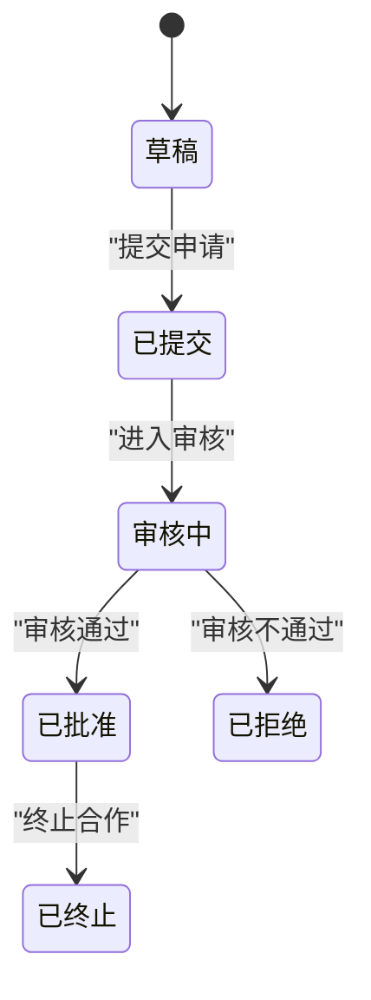

**图表来源**
- [cooperationData.ts:5-22](file://产品方案/UI-V1.0/src/data/cooperationData.ts#L5-L22)
- [cooperationData.ts:93-183](file://产品方案/UI-V1.0/src/data/cooperationData.ts#L93-L183)
- [cooperationData.ts:344-422](file://产品方案/UI-V1.0/src/data/cooperationData.ts#L344-L422)