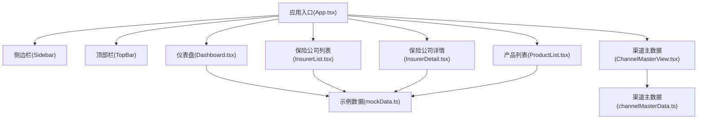
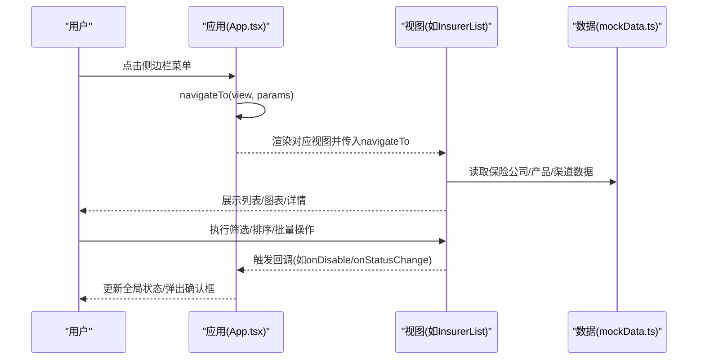
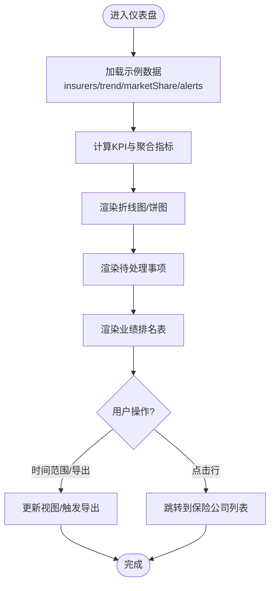
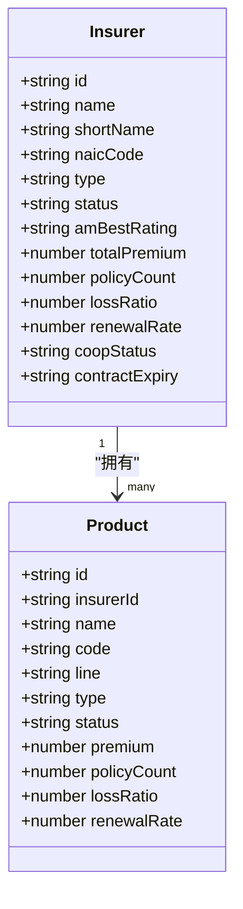
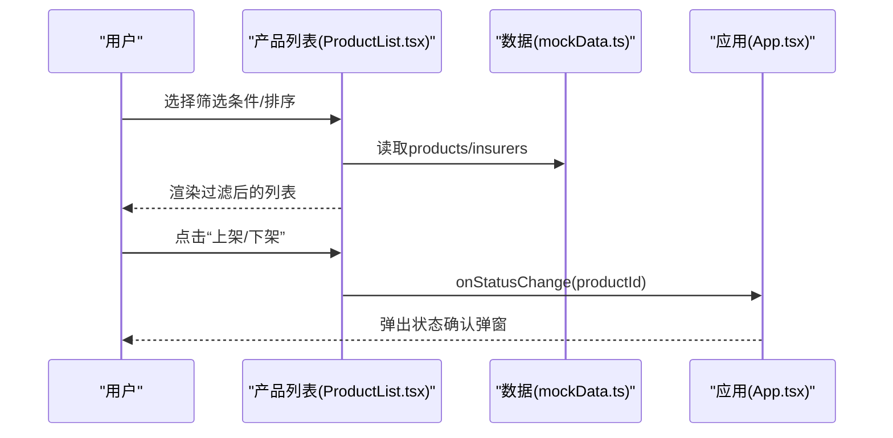
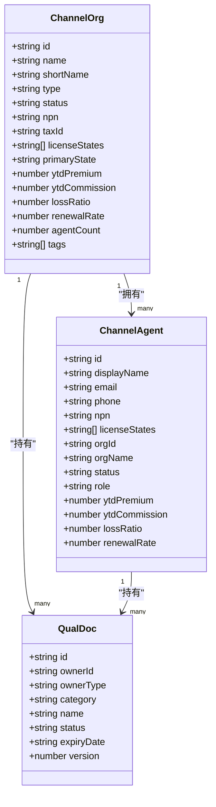
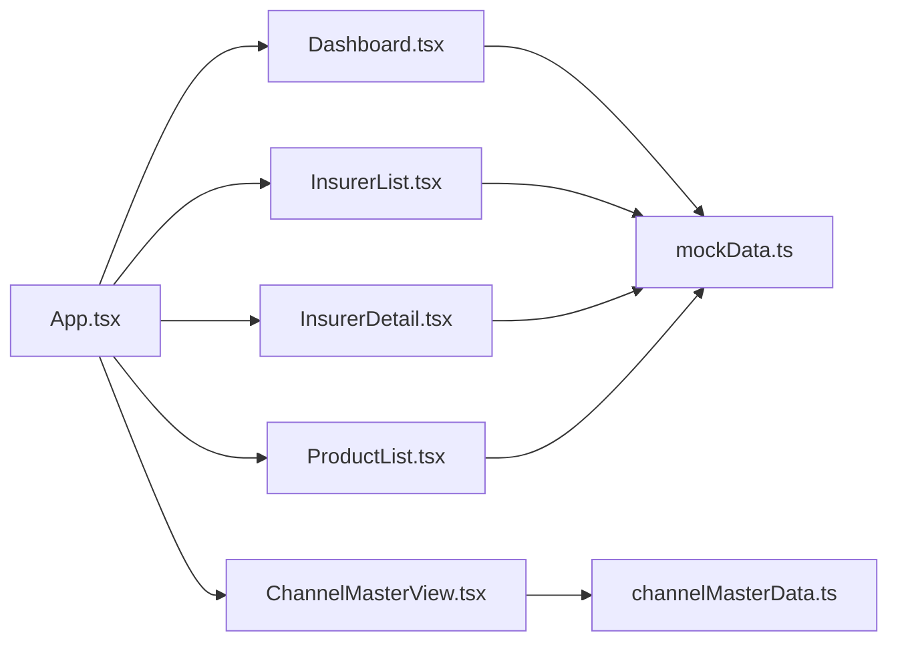

# 核心功能模块

<cite>
**本文引用的文件**
- [App.tsx](file://产品设计/UI-V1.0/src/App.tsx)
- [Dashboard.tsx](file://产品设计/UI-V1.0/src/views/Dashboard.tsx)
- [InsurerList.tsx](file://产品设计/UI-V1.0/src/views/InsurerList.tsx)
- [InsurerDetail.tsx](file://产品设计/UI-V1.0/src/views/InsurerDetail.tsx)
- [ProductList.tsx](file://产品设计/UI-V1.0/src/views/ProductList.tsx)
- [ChannelMasterView.tsx](file://产品设计/UI-V1.0/src/views/ChannelMasterView.tsx)
- [mockData.ts](file://产品设计/UI-V1.0/src/data/mockData.ts)
- [channelMasterData.ts](file://产品设计/UI-V1.0/src/data/channelMasterData.ts)
- [产品功能清单_V1.0.0.md](file://产品需求/产品功能清单_V1.0.0.md)
</cite>

## 目录
1. [引言](#引言)
2. [项目结构](#项目结构)
3. [核心组件](#核心组件)
4. [架构总览](#架构总览)
5. [详细组件分析](#详细组件分析)
6. [依赖关系分析](#依赖关系分析)
7. [性能考量](#性能考量)
8. [故障排查指南](#故障排查指南)
9. [结论](#结论)
10. [附录](#附录)

## 引言
本文件面向OverInsurData平台的核心业务模块，聚焦保险公司管理、渠道管理与Dashboard仪表盘三大模块的实现细节、业务流程与用户交互模式。文档基于前端代码与数据模型，梳理各模块间的协作关系、数据共享机制与关键业务逻辑，并提供可视化图示与使用场景说明，帮助开发者快速理解并扩展系统能力。

## 项目结构
- 应用入口与路由分发：App.tsx集中维护视图切换与全局状态（当前视图、选中实体ID、弹窗状态等），通过导航函数将参数传递给子视图。
- 视图层：按业务域划分views目录，包含Dashboard、保险公司列表/详情、产品列表、渠道主数据等页面。
- 数据层：mockData.ts提供保险公司、产品、渠道、预约等示例数据；channelMasterData.ts提供渠道主数据的类型定义、字典与样例数据。
- 组件层：components目录提供通用UI组件（侧边栏、顶部栏、模态框等）。

**图表来源**
- [App.tsx:25-82](file://产品设计/UI-V1.0/src/App.tsx#L25-L82)
- [Dashboard.tsx:1-20](file://产品设计/UI-V1.0/src/views/Dashboard.tsx#L1-L20)
- [InsurerList.tsx:1-20](file://产品设计/UI-V1.0/src/views/InsurerList.tsx#L1-L20)
- [InsurerDetail.tsx:1-20](file://产品设计/UI-V1.0/src/views/InsurerDetail.tsx#L1-L20)
- [ProductList.tsx:1-20](file://产品设计/UI-V1.0/src/views/ProductList.tsx#L1-L20)
- [ChannelMasterView.tsx:1-22](file://产品设计/UI-V1.0/src/views/ChannelMasterView.tsx#L1-L22)
- [mockData.ts:1-70](file://产品设计/UI-V1.0/src/data/mockData.ts#L1-L70)
- [channelMasterData.ts:1-52](file://产品设计/UI-V1.0/src/data/channelMasterData.ts#L1-L52)

**章节来源**
- [App.tsx:25-82](file://产品设计/UI-V1.0/src/App.tsx#L25-L82)
- [Dashboard.tsx:1-20](file://产品设计/UI-V1.0/src/views/Dashboard.tsx#L1-L20)
- [InsurerList.tsx:1-20](file://产品设计/UI-V1.0/src/views/InsurerList.tsx#L1-L20)
- [InsurerDetail.tsx:1-20](file://产品设计/UI-V1.0/src/views/InsurerDetail.tsx#L1-L20)
- [ProductList.tsx:1-20](file://产品设计/UI-V1.0/src/views/ProductList.tsx#L1-L20)
- [ChannelMasterView.tsx:1-22](file://产品设计/UI-V1.0/src/views/ChannelMasterView.tsx#L1-L22)
- [mockData.ts:1-70](file://产品设计/UI-V1.0/src/data/mockData.ts#L1-L70)
- [channelMasterData.ts:1-52](file://产品设计/UI-V1.0/src/data/channelMasterData.ts#L1-L52)

## 核心组件
- 仪表盘（Dashboard）：聚合KPI、保费趋势、市场份额、待处理事项、近期操作等，支持时间范围选择与报告导出。
- 保险公司管理：列表页支持搜索、筛选、排序、分页、批量操作；详情页提供基本信息、财务评级、关联产品、合作渠道、业绩概览、资质附件、变更历史等。
- 产品管理：列表页支持按保险公司、业务线、状态筛选与排序，支持批量上下架与状态变更。
- 渠道主数据：机构与代理人管理、资质文件、变更历史、导入结果统计等，提供多步骤表单与状态变更流程。

**章节来源**
- [Dashboard.tsx:102-348](file://产品设计/UI-V1.0/src/views/Dashboard.tsx#L102-L348)
- [InsurerList.tsx:18-360](file://产品设计/UI-V1.0/src/views/InsurerList.tsx#L18-L360)
- [InsurerDetail.tsx:56-644](file://产品设计/UI-V1.0/src/views/InsurerDetail.tsx#L56-L644)
- [ProductList.tsx:20-243](file://产品设计/UI-V1.0/src/views/ProductList.tsx#L20-L243)
- [ChannelMasterView.tsx:246-800](file://产品设计/UI-V1.0/src/views/ChannelMasterView.tsx#L246-L800)

## 架构总览
前端采用“单入口+视图路由”的轻量架构：App.tsx作为根组件，维护当前视图与选中实体ID，并通过navigateTo统一跳转。各视图组件从mockData或channelMasterData读取示例数据，渲染表格、图表与交互控件。跨视图的数据共享通过App层状态与回调函数实现。

**图表来源**
- [App.tsx:25-82](file://产品设计/UI-V1.0/src/App.tsx#L25-L82)
- [InsurerList.tsx:18-114](file://产品设计/UI-V1.0/src/views/InsurerList.tsx#L18-L114)
- [mockData.ts:86-347](file://产品设计/UI-V1.0/src/data/mockData.ts#L86-L347)

## 详细组件分析

### 仪表盘（Dashboard）
- 功能要点：
  - KPI卡片：本年总保费、有效保单数、合作渠道数、本年佣金收入，带同比趋势。
  - 保费趋势折线图：新单、续保、总计三系列，支持自定义Tooltip。
  - 市场份额饼图：按保险公司分布，显示占比与保费换算。
  - 待处理事项：按严重级别与类型展示，支持跳转。
  - 保险公司业绩排名：Top N表格，支持跳转到列表。
  - 近期操作：最近操作日志。
- 数据流：
  - 从mockData.ts获取insurers、premiumTrendData、marketShareData、alertItems、recentActivities等。
  - 计算聚合指标（如总保费、平均赔付率）并在界面展示。
- 交互：
  - 时间范围下拉选择、导出报告按钮。
  - 点击表格行跳转到保险公司列表。

**图表来源**
- [Dashboard.tsx:102-348](file://产品设计/UI-V1.0/src/views/Dashboard.tsx#L102-L348)
- [mockData.ts:390-429](file://产品设计/UI-V1.0/src/data/mockData.ts#L390-L429)

**章节来源**
- [Dashboard.tsx:102-348](file://产品设计/UI-V1.0/src/views/Dashboard.tsx#L102-L348)
- [mockData.ts:390-429](file://产品设计/UI-V1.0/src/data/mockData.ts#L390-L429)

### 保险公司管理（列表与详情）
- 列表页（InsurerList）：
  - 搜索与筛选：公司名/简称/NAIC编码模糊搜索；公司类型、合作状态、大区、AM Best评级筛选。
  - 排序与分页：支持按名称、总保费、赔付率、续保率、渠道数排序；分页控制。
  - 批量操作：多选后批量启用/停用、导出选中项。
  - 操作列：查看详情、编辑、启用/停用（触发禁用确认弹窗）。
- 详情页（InsurerDetail）：
  - 基本信息：公司全称、NAIC、总部、成立年份、官网、类型等。
  - 财务评级：展示多家评级机构当前评级与日期。
  - 关联产品：列出该产品下的产品明细与状态。
  - 合作渠道：展示授权合作渠道及贡献指标。
  - 业绩概览：月度保费趋势、核心指标（保费、件均、新单占比、赔付率、续保率、佣金收入）。
  - 资质附件：文件列表、预览/下载/删除、到期提醒。
  - 变更历史：字段级前后对比、操作人/角色/时间轴。

**图表来源**
- [mockData.ts:6-48](file://产品设计/UI-V1.0/src/data/mockData.ts#L6-L48)

**章节来源**
- [InsurerList.tsx:18-360](file://产品设计/UI-V1.0/src/views/InsurerList.tsx#L18-L360)
- [InsurerDetail.tsx:56-644](file://产品设计/UI-V1.0/src/views/InsurerDetail.tsx#L56-L644)
- [mockData.ts:86-347](file://产品设计/UI-V1.0/src/data/mockData.ts#L86-L347)

### 产品管理（列表）
- 功能要点：
  - 筛选：按产品名称/代码、所属保险公司、业务线、状态筛选。
  - 排序：按保费、保单数、赔付率、续保率、名称排序。
  - 批量操作：批量上架/下架、取消选择。
  - 状态变更：触发状态变更弹窗（由App层管理）。
- 数据流：
  - 从mockData.ts读取products与insurers，进行过滤与排序。
  - 列表项点击跳转到产品详情。

**图表来源**
- [ProductList.tsx:20-243](file://产品设计/UI-V1.0/src/views/ProductList.tsx#L20-L243)
- [App.tsx:25-82](file://产品设计/UI-V1.0/src/App.tsx#L25-L82)
- [mockData.ts:349-362](file://产品设计/UI-V1.0/src/data/mockData.ts#L349-L362)

**章节来源**
- [ProductList.tsx:20-243](file://产品设计/UI-V1.0/src/views/ProductList.tsx#L20-L243)
- [App.tsx:25-82](file://产品设计/UI-V1.0/src/App.tsx#L25-L82)
- [mockData.ts:349-362](file://产品设计/UI-V1.0/src/data/mockData.ts#L349-L362)

### 渠道主数据（机构与代理人）
- 功能要点：
  - 机构列表：搜索、状态/类型筛选、排序（YTD保费、赔付率、续保率）、右侧详情抽屉。
  - 机构详情：基本信息、联系人、授权州、上级机构、KPI条、代理人列表、资质文件。
  - 多步骤表单：新增/编辑机构分三步（基本信息、联系方式、资质州域），含保存与进度指示。
  - 状态变更：支持机构/代理人状态切换，暂停时提示权限冻结。
  - 资质文件：按类别与状态展示，支持上传与审核标记。
  - 变更历史：记录创建、编辑、状态变更、文件上传、导入、关系变更等操作。
- 数据模型：
  - 机构（ChannelOrg）、代理人（ChannelAgent）、资质文件（QualDoc）、变更记录（ChangeRecord）等类型与样例数据。

**图表来源**
- [channelMasterData.ts:11-42](file://产品设计/UI-V1.0/src/data/channelMasterData.ts#L11-L42)
- [channelMasterData.ts:165-192](file://产品设计/UI-V1.0/src/data/channelMasterData.ts#L165-L192)
- [channelMasterData.ts:334-348](file://产品设计/UI-V1.0/src/data/channelMasterData.ts#L334-L348)

**章节来源**
- [ChannelMasterView.tsx:246-800](file://产品设计/UI-V1.0/src/views/ChannelMasterView.tsx#L246-L800)
- [channelMasterData.ts:11-42](file://产品设计/UI-V1.0/src/data/channelMasterData.ts#L11-L42)
- [channelMasterData.ts:165-192](file://产品设计/UI-V1.0/src/data/channelMasterData.ts#L165-L192)
- [channelMasterData.ts:334-348](file://产品设计/UI-V1.0/src/data/channelMasterData.ts#L334-L348)

## 依赖关系分析
- 视图与数据：
  - Dashboard、InsurerList、InsurerDetail、ProductList均依赖mockData.ts中的示例数据。
  - ChannelMasterView依赖channelMasterData.ts的类型与样例数据。
- 视图间协作：
  - App.tsx通过navigateTo在视图间传递参数（如insurerId、productId），并管理全局弹窗状态（禁用确认、产品状态变更）。
- 外部库：
  - 图表使用recharts，图标使用lucide-react。

**图表来源**
- [App.tsx:25-82](file://产品设计/UI-V1.0/src/App.tsx#L25-L82)
- [Dashboard.tsx:1-20](file://产品设计/UI-V1.0/src/views/Dashboard.tsx#L1-L20)
- [InsurerList.tsx:1-20](file://产品设计/UI-V1.0/src/views/InsurerList.tsx#L1-L20)
- [InsurerDetail.tsx:1-20](file://产品设计/UI-V1.0/src/views/InsurerDetail.tsx#L1-L20)
- [ProductList.tsx:1-20](file://产品设计/UI-V1.0/src/views/ProductList.tsx#L1-L20)
- [ChannelMasterView.tsx:1-22](file://产品设计/UI-V1.0/src/views/ChannelMasterView.tsx#L1-L22)
- [mockData.ts:1-70](file://产品设计/UI-V1.0/src/data/mockData.ts#L1-L70)
- [channelMasterData.ts:1-52](file://产品设计/UI-V1.0/src/data/channelMasterData.ts#L1-L52)

**章节来源**
- [App.tsx:25-82](file://产品设计/UI-V1.0/src/App.tsx#L25-L82)
- [mockData.ts:1-70](file://产品设计/UI-V1.0/src/data/mockData.ts#L1-L70)
- [channelMasterData.ts:1-52](file://产品设计/UI-V1.0/src/data/channelMasterData.ts#L1-L52)

## 性能考量
- 列表页优化：
  - 使用useMemo对筛选与排序结果进行缓存，避免重复计算。
  - 分页减少单次渲染条目数量，提升首屏性能。
- 图表渲染：
  - 使用ResponsiveContainer自适应容器尺寸，避免重绘开销。
  - 自定义Tooltip减少DOM节点复杂度。
- 交互反馈：
  - 批量操作前进行确认，降低误操作风险。
  - 状态变更弹窗集中管理，减少重复状态。

[本节为通用指导，不直接分析具体文件]

## 故障排查指南
- 常见问题定位：
  - 数据为空：检查mockData.ts或channelMasterData.ts中对应数组是否被正确引入与赋值。
  - 筛选无效：确认筛选条件与数据字段匹配（如type/status/region等）。
  - 图表异常：检查数据格式是否符合recharts要求（dataKey、数值类型等）。
  - 导航失败：确认App.tsx中currentView与renderView分支是否覆盖目标视图。
- 调试建议：
  - 在关键函数处添加console.log输出中间状态。
  - 使用浏览器开发者工具查看网络请求（如有）与组件状态。
  - 对于复杂筛选/排序逻辑，逐步缩小输入范围验证。

[本节为通用指导，不直接分析具体文件]

## 结论
OverInsurData平台的前端以清晰的视图分层与数据驱动为核心，实现了保险公司管理、渠道管理与仪表盘三大模块的完整闭环。通过统一的导航与状态管理，各模块间协作顺畅；借助示例数据与类型定义，便于快速迭代与扩展。建议在后续开发中引入真实后端API、完善权限控制与审计日志，进一步提升系统的可维护性与安全性。

[本节为总结性内容，不直接分析具体文件]

## 附录
- 业务规则参考：
  - 保险公司主数据管理、产品管理、合作管理、Appointment与合规、财务结算、数据分析等功能点详见需求文档。
- 使用场景示例：
  - 仪表盘：运营人员每日查看KPI与预警，快速定位问题。
  - 保险公司管理：管理员新增/编辑保险公司档案，查看变更历史与资质附件。
  - 产品管理：产品经理批量上下架产品，监控业绩指标。
  - 渠道主数据：渠道运营维护机构与代理人信息，管理资质文件与状态变更。

**章节来源**
- [产品功能清单_V1.0.0.md:40-182](file://产品需求/产品功能清单_V1.0.0.md#L40-L182)
- [产品功能清单_V1.0.0.md:184-369](file://产品需求/产品功能清单_V1.0.0.md#L184-L369)
- [产品功能清单_V1.0.0.md:372-549](file://产品需求/产品功能清单_V1.0.0.md#L372-L549)
- [产品功能清单_V1.0.0.md:552-700](file://产品需求/产品功能清单_V1.0.0.md#L552-L700)
- [产品功能清单_V1.0.0.md:703-800](file://产品需求/产品功能清单_V1.0.0.md#L703-L800)