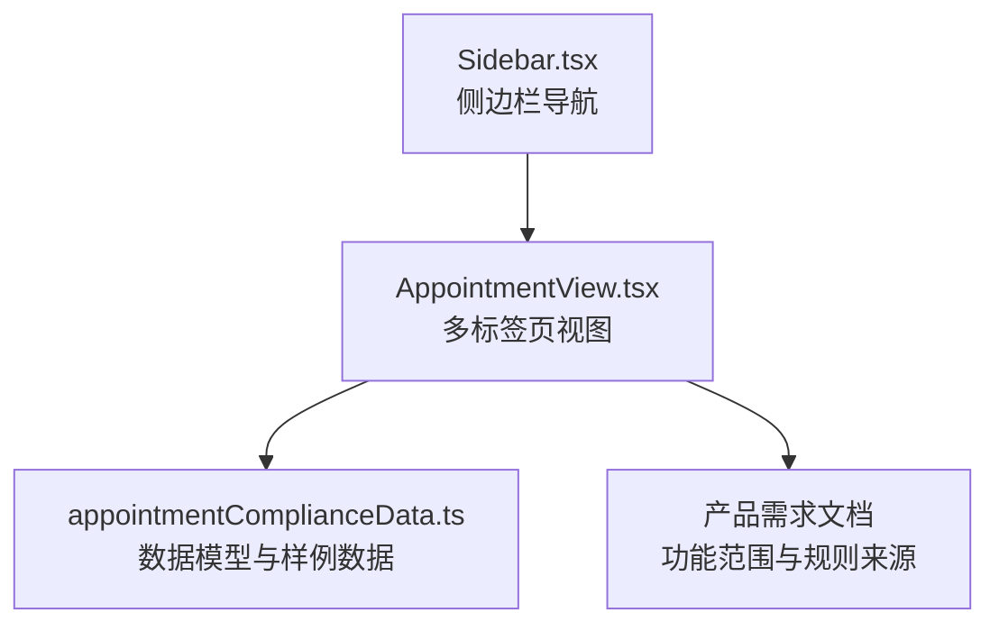
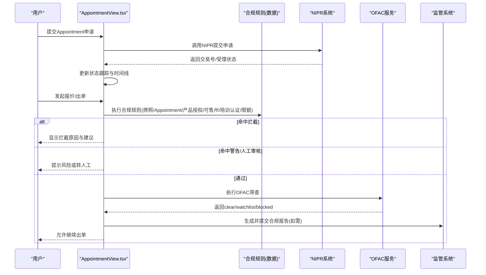
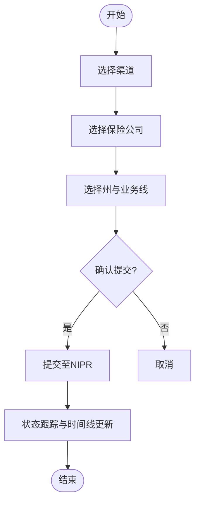
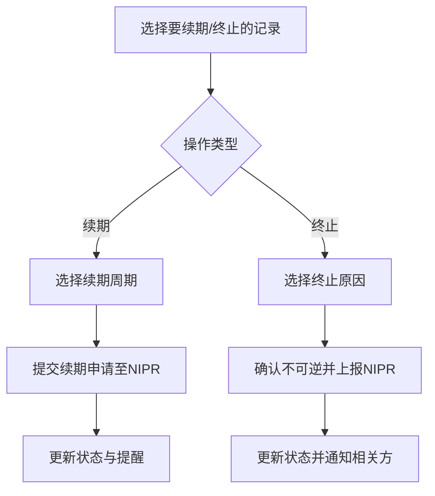
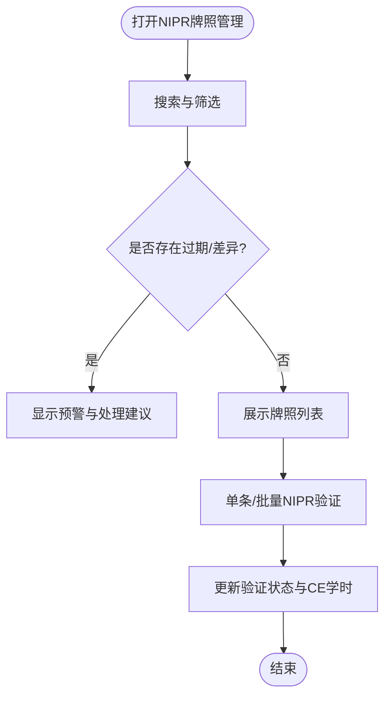
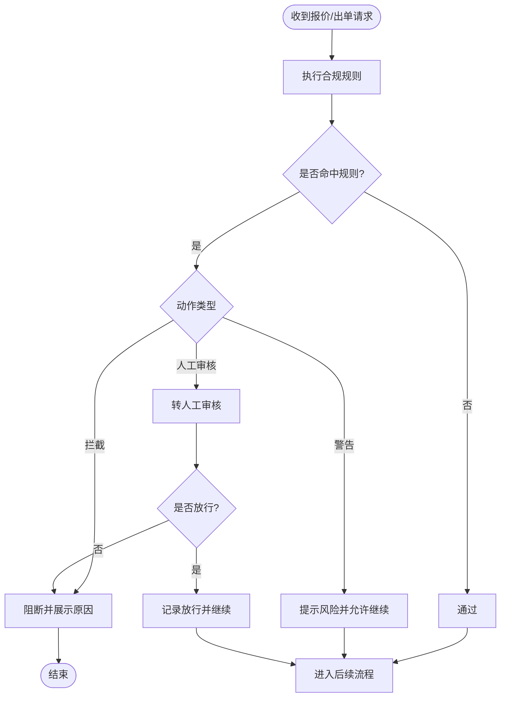
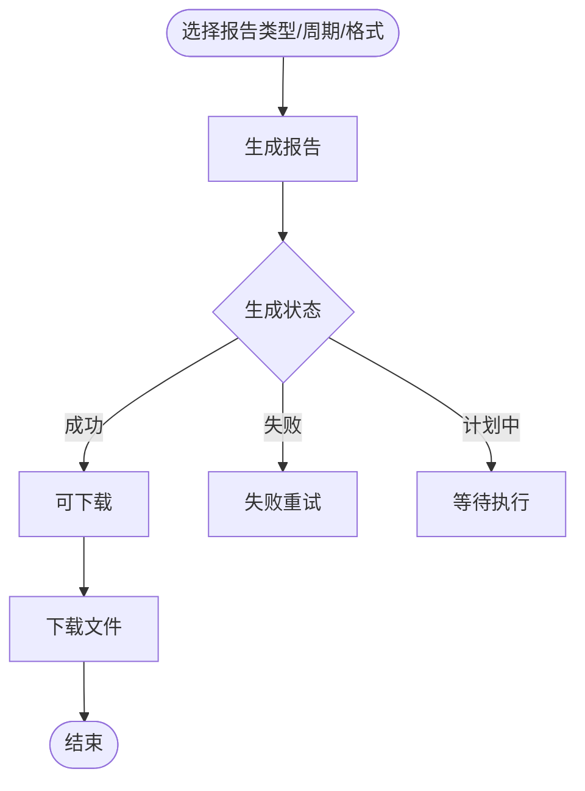
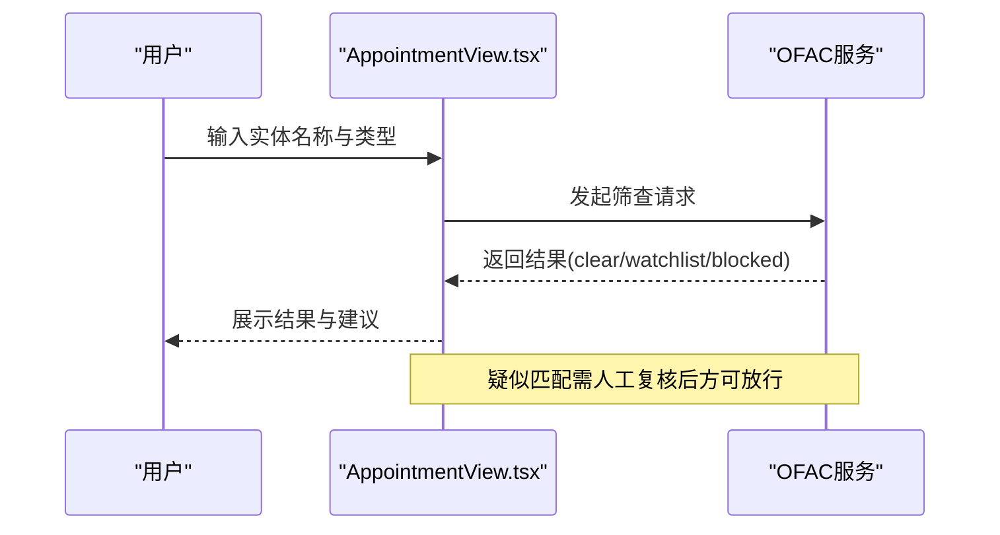
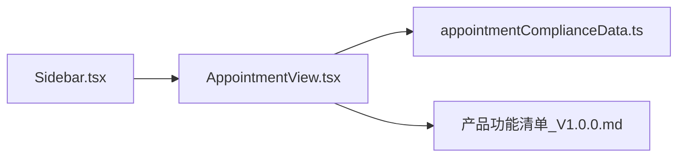

# Appointment合规管理

<cite>
**本文引用的文件**
- [AppointmentView.tsx](file://产品方案/UI-V1.0/src/views/AppointmentView.tsx)
- [appointmentComplianceData.ts](file://产品方案/UI-V1.0/src/data/appointmentComplianceData.ts)
- [Sidebar.tsx](file://产品方案/UI-V1.0/src/components/Sidebar.tsx)
- [产品功能清单_V1.0.0.md](file://产品需求/产品功能清单_V1.0.0.md)
</cite>

## 目录
1. [简介](#简介)
2. [项目结构](#项目结构)
3. [核心组件](#核心组件)
4. [架构总览](#架构总览)
5. [详细组件分析](#详细组件分析)
6. [依赖关系分析](#依赖关系分析)
7. [性能与可用性考虑](#性能与可用性考虑)
8. [故障排查指南](#故障排查指南)
9. [结论](#结论)
10. [附录：监管与集成要点](#附录监管与集成要点)

## 简介
本文件面向美国保险监管中的Appointment制度，围绕渠道商在特定州对特定保险公司的销售授权（Appointment）进行全生命周期管理，并覆盖牌照校验、NIPR数据核验、OFAC制裁筛查、出单合规拦截与合规报告生成等关键能力。文档基于前端视图与数据模型，结合产品需求说明，梳理业务流程、规则引擎、交互流程与可观测性指标，帮助产品、研发与合规团队理解并落地该模块。

## 项目结构
- 视图层：AppointmentView.tsx 提供多标签页的完整操作界面，包括申请、状态跟踪、续期与终止、NIPR牌照管理、出单合规拦截、合规报告、OFAC筛查。
- 数据层：appointmentComplianceData.ts 定义Appointment记录、NIPR牌照、合规拦截日志、合规规则、OFAC筛查结果与合规报告等数据结构与样例数据。
- 导航层：Sidebar.tsx 将“Appointment & 合规”作为保险公司管理模块下的一个入口，便于从平台主导航进入。
- 需求依据：产品功能清单明确了Appointment申请、状态跟踪、续期、终止、NIPR校验、出单拦截、合规报告、OFAC筛查等功能点。

**图表来源**
- [Sidebar.tsx:42-52](file://产品方案/UI-V1.0/src/components/Sidebar.tsx#L42-L52)
- [AppointmentView.tsx:1007-1075](file://产品方案/UI-V1.0/src/views/AppointmentView.tsx#L1007-L1075)
- [appointmentComplianceData.ts:1-200](file://产品方案/UI-V1.0/src/data/appointmentComplianceData.ts#L1-L200)
- [产品功能清单_V1.0.0.md:552-700](file://产品需求/产品功能清单_V1.0.0.md#L552-L700)

**章节来源**
- [Sidebar.tsx:42-52](file://产品方案/UI-V1.0/src/components/Sidebar.tsx#L42-L52)
- [AppointmentView.tsx:1007-1075](file://产品方案/UI-V1.0/src/views/AppointmentView.tsx#L1007-L1075)
- [appointmentComplianceData.ts:1-200](file://产品方案/UI-V1.0/src/data/appointmentComplianceData.ts#L1-L200)
- [产品功能清单_V1.0.0.md:552-700](file://产品需求/产品功能清单_V1.0.0.md#L552-L700)

## 核心组件
- 申请向导与列表：支持选择渠道、保险公司、州与业务线，提交后通过NIPR向监管机构提交申请；列表展示状态、到期日、处理天数等。
- 状态跟踪：展示待审核/审核中记录的进度时间线与最近事件流。
- 续期与终止：按到期阈值预警，支持发起续期或终止，并通过NIPR上报。
- NIPR牌照管理：展示各州牌照状态、到期日、CE学时完成度，支持批量验证与差异提示。
- 出单合规拦截：在报价/出单时执行规则引擎检查，输出拦截/警告/人工审核/通过四类结果，并记录原因描述。
- 合规报告：支持按类型、周期、格式生成与下载，含Appointment状态、牌照合规、OFAC摘要、拦截日志、续期日历、监管申报等。
- OFAC筛查：输入实体名称与类型，返回无命中、疑似匹配、已拦截三类结果，并提供历史筛查记录与人工复核入口。

**章节来源**
- [AppointmentView.tsx:71-318](file://产品方案/UI-V1.0/src/views/AppointmentView.tsx#L71-L318)
- [AppointmentView.tsx:320-539](file://产品方案/UI-V1.0/src/views/AppointmentView.tsx#L320-L539)
- [AppointmentView.tsx:541-677](file://产品方案/UI-V1.0/src/views/AppointmentView.tsx#L541-L677)
- [AppointmentView.tsx:679-886](file://产品方案/UI-V1.0/src/views/AppointmentView.tsx#L679-L886)
- [AppointmentView.tsx:888-1003](file://产品方案/UI-V1.0/src/views/AppointmentView.tsx#L888-L1003)
- [appointmentComplianceData.ts:1-200](file://产品方案/UI-V1.0/src/data/appointmentComplianceData.ts#L1-L200)

## 架构总览
系统以“前台视图 + 数据模型 + 规则引擎 + 外部系统对接”的方式组织：
- 前台视图：React组件负责用户交互、表单收集、状态展示与操作触发。
- 数据模型：TypeScript接口与数组样例承载Appointment、NIPR牌照、拦截日志、规则、OFAC筛查与报告等数据。
- 规则引擎：基于complianceRules配置，对出单请求进行条件判断，输出block/warn/manual-review/pass。
- 外部系统：NIPR用于牌照查询与Appointment提交/续期/终止上报；OFAC名单用于制裁筛查；监管系统用于合规报告提交。

**图表来源**
- [AppointmentView.tsx:71-318](file://产品方案/UI-V1.0/src/views/AppointmentView.tsx#L71-L318)
- [appointmentComplianceData.ts:114-137](file://产品方案/UI-V1.0/src/data/appointmentComplianceData.ts#L114-L137)
- [appointmentComplianceData.ts:139-168](file://产品方案/UI-V1.0/src/data/appointmentComplianceData.ts#L139-L168)
- [产品功能清单_V1.0.0.md:552-700](file://产品需求/产品功能清单_V1.0.0.md#L552-L700)

## 详细组件分析

### 申请与状态跟踪
- 申请向导：四步式引导（选择渠道→选择保险公司→配置州与业务线→确认提交），支持紧急标记与注意事项提示。
- 列表与筛选：支持按状态、关键词搜索，统计总数、已批准、待审核/审核中、近30天到期数量。
- 状态跟踪：展示进行中申请的时间轴与最近事件流，包含NIPR提交、州局受理、保险公司审核、完成等节点。

**图表来源**
- [AppointmentView.tsx:71-210](file://产品方案/UI-V1.0/src/views/AppointmentView.tsx#L71-L210)
- [AppointmentView.tsx:212-318](file://产品方案/UI-V1.0/src/views/AppointmentView.tsx#L212-L318)
- [AppointmentView.tsx:320-399](file://产品方案/UI-V1.0/src/views/AppointmentView.tsx#L320-L399)

**章节来源**
- [AppointmentView.tsx:71-318](file://产品方案/UI-V1.0/src/views/AppointmentView.tsx#L71-L318)
- [AppointmentView.tsx:320-399](file://产品方案/UI-V1.0/src/views/AppointmentView.tsx#L320-L399)

### 续期与终止
- 续期管理：按到期阈值（如60/90/120天）分类展示，支持发起续期与查看进度。
- 终止管理：不可逆操作，需选择终止原因，并通过NIPR上报；终止前提示影响范围。

**图表来源**
- [AppointmentView.tsx:401-539](file://产品方案/UI-V1.0/src/views/AppointmentView.tsx#L401-L539)

**章节来源**
- [AppointmentView.tsx:401-539](file://产品方案/UI-V1.0/src/views/AppointmentView.tsx#L401-L539)

### NIPR牌照管理
- 概览与预警：展示过期、即将到期、暂停等异常数量，提示立即续期或核实差异。
- 列表与验证：展示牌照号、类型、业务线、到期日、CE学时完成度；支持单条/批量NIPR验证。
- 数据差异：当本地数据与NIPR不一致时标记为“数据差异”，需人工核对更新。

**图表来源**
- [AppointmentView.tsx:541-677](file://产品方案/UI-V1.0/src/views/AppointmentView.tsx#L541-L677)
- [appointmentComplianceData.ts:42-77](file://产品方案/UI-V1.0/src/data/appointmentComplianceData.ts#L42-L77)

**章节来源**
- [AppointmentView.tsx:541-677](file://产品方案/UI-V1.0/src/views/AppointmentView.tsx#L541-L677)
- [appointmentComplianceData.ts:42-77](file://产品方案/UI-V1.0/src/data/appointmentComplianceData.ts#L42-L77)

### 出单合规拦截
- 规则配置：按类别（Appointment、牌照、OFAC、渠道、产品）设置条件与动作（拦截/警告/人工审核），支持优先级与启用开关。
- 拦截日志：记录每次拦截的时间戳、渠道、保险公司、州、业务线、保单草稿、客户、保费、结果与原因描述。
- 人工审核：对需要人工介入的结果提供审核与放行按钮，并记录审核人与备注。

**图表来源**
- [appointmentComplianceData.ts:114-137](file://产品方案/UI-V1.0/src/data/appointmentComplianceData.ts#L114-L137)
- [appointmentComplianceData.ts:79-112](file://产品方案/UI-V1.0/src/data/appointmentComplianceData.ts#L79-L112)
- [AppointmentView.tsx:679-789](file://产品方案/UI-V1.0/src/views/AppointmentView.tsx#L679-L789)

**章节来源**
- [appointmentComplianceData.ts:79-137](file://产品方案/UI-V1.0/src/data/appointmentComplianceData.ts#L79-L137)
- [AppointmentView.tsx:679-789](file://产品方案/UI-V1.0/src/views/AppointmentView.tsx#L679-L789)

### 合规报告
- 报告类型：Appointment状态、牌照合规、OFAC摘要、拦截日志、续期日历、监管申报。
- 生成与下载：支持选择周期与格式（PDF/Excel/CSV），展示生成状态、文件大小、记录数与收件人。
- 计划任务：支持定时自动生成与手动触发。

**图表来源**
- [appointmentComplianceData.ts:170-193](file://产品方案/UI-V1.0/src/data/appointmentComplianceData.ts#L170-L193)
- [AppointmentView.tsx:792-886](file://产品方案/UI-V1.0/src/views/AppointmentView.tsx#L792-L886)

**章节来源**
- [appointmentComplianceData.ts:170-193](file://产品方案/UI-V1.0/src/data/appointmentComplianceData.ts#L170-L193)
- [AppointmentView.tsx:792-886](file://产品方案/UI-V1.0/src/views/AppointmentView.tsx#L792-L886)

### OFAC制裁筛查
- 实时筛查：输入实体名称与类型，返回无命中、疑似匹配、已拦截三类结果，并显示相似度与匹配条目。
- 历史记录：展示历史筛查时间戳、实体、类型、结果、匹配条目、操作人与处置。
- 人工复核：疑似匹配项支持人工复核与放行记录。

**图表来源**
- [appointmentComplianceData.ts:139-168](file://产品方案/UI-V1.0/src/data/appointmentComplianceData.ts#L139-L168)
- [AppointmentView.tsx:888-1003](file://产品方案/UI-V1.0/src/views/AppointmentView.tsx#L888-L1003)

**章节来源**
- [appointmentComplianceData.ts:139-168](file://产品方案/UI-V1.0/src/data/appointmentComplianceData.ts#L139-L168)
- [AppointmentView.tsx:888-1003](file://产品方案/UI-V1.0/src/views/AppointmentView.tsx#L888-L1003)

## 依赖关系分析
- 视图与数据：AppointmentView.tsx 直接引用 appointmentComplianceData.ts 的数据结构与样例数据，用于渲染列表、统计与交互。
- 导航与路由：Sidebar.tsx 将“Appointment & 合规”纳入保险公司管理模块，统一入口。
- 需求对齐：产品功能清单定义了功能边界与规则来源，确保实现与需求一致。

**图表来源**
- [Sidebar.tsx:42-52](file://产品方案/UI-V1.0/src/components/Sidebar.tsx#L42-L52)
- [AppointmentView.tsx:1007-1075](file://产品方案/UI-V1.0/src/views/AppointmentView.tsx#L1007-L1075)
- [appointmentComplianceData.ts:1-200](file://产品方案/UI-V1.0/src/data/appointmentComplianceData.ts#L1-L200)
- [产品功能清单_V1.0.0.md:552-700](file://产品需求/产品功能清单_V1.0.0.md#L552-L700)

**章节来源**
- [Sidebar.tsx:42-52](file://产品方案/UI-V1.0/src/components/Sidebar.tsx#L42-L52)
- [AppointmentView.tsx:1007-1075](file://产品方案/UI-V1.0/src/views/AppointmentView.tsx#L1007-L1075)
- [appointmentComplianceData.ts:1-200](file://产品方案/UI-V1.0/src/data/appointmentComplianceData.ts#L1-L200)
- [产品功能清单_V1.0.0.md:552-700](file://产品需求/产品功能清单_V1.0.0.md#L552-L700)

## 性能与可用性考虑
- 列表与筛选：前端过滤与排序适用于当前规模数据；未来可扩展分页与后端聚合以提升性能。
- 批量验证：NIPR批量验证采用异步模拟，实际应引入队列与限流避免外部API过载。
- 规则引擎：规则优先级与启用开关支持动态调整；建议增加规则测试用例与灰度发布机制。
- 报告生成：大文件生成建议后台任务化与分片导出，减少前端阻塞。
- 用户体验：关键路径（申请、拦截、续期、终止）提供明确反馈与错误提示，降低误操作风险。

[本节为通用指导，不直接分析具体文件]

## 故障排查指南
- 拦截原因定位：查看拦截日志中的reasons与reasonDescriptions，快速定位是Appointment过期、牌照无效、OFAC命中还是州未授权等问题。
- 规则命中追踪：根据complianceRules的category与priority，定位具体规则与触发次数，必要时临时关闭或调整规则。
- NIPR差异处理：若出现verificationStatus为mismatch/not-found，需重新验证并更新本地数据。
- OFAC疑似匹配：对watchlist结果进行人工复核，记录reviewNote与overrideApproved，确保审计可追溯。
- 报告生成失败：检查报告状态与格式配置，必要时重试或切换格式。

**章节来源**
- [appointmentComplianceData.ts:79-137](file://产品方案/UI-V1.0/src/data/appointmentComplianceData.ts#L79-L137)
- [appointmentComplianceData.ts:139-168](file://产品方案/UI-V1.0/src/data/appointmentComplianceData.ts#L139-L168)
- [AppointmentView.tsx:679-789](file://产品方案/UI-V1.0/src/views/AppointmentView.tsx#L679-L789)
- [AppointmentView.tsx:888-1003](file://产品方案/UI-V1.0/src/views/AppointmentView.tsx#L888-L1003)

## 结论
本模块以清晰的视图与数据模型为基础，实现了Appointment全生命周期管理与合规检查闭环。通过NIPR牌照校验、OFAC制裁筛查与规则驱动的出单拦截，有效降低合规风险；配合合规报告与审计日志，满足监管报送与内部治理要求。建议在后续迭代中完善后台任务化、规则测试与外部系统集成，进一步提升稳定性与可维护性。

[本节为总结，不直接分析具体文件]

## 附录：监管与集成要点
- 州级监管要求：不同州对Appointment有效期、续期周期、CE学时要求存在差异，需在规则与UI中体现州级差异化策略。
- NIPR集成：提交申请、续期、终止均需通过NIPR上报；建议建立交易号映射与状态同步机制，确保前后端一致。
- OFAC名单更新：定期拉取并更新制裁名单，提升匹配准确率；对模糊匹配设定阈值与人工复核流程。
- 合规报告：按州监管模板生成报告，支持定时自动提交与回执记录，确保合规可审计。
- 数据同步策略：本地数据与NIPR/OFAC/监管系统之间采用增量同步与冲突解决策略，保证数据一致性。

[本节为概念性内容，不直接分析具体文件]