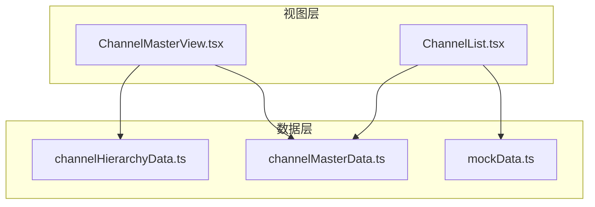
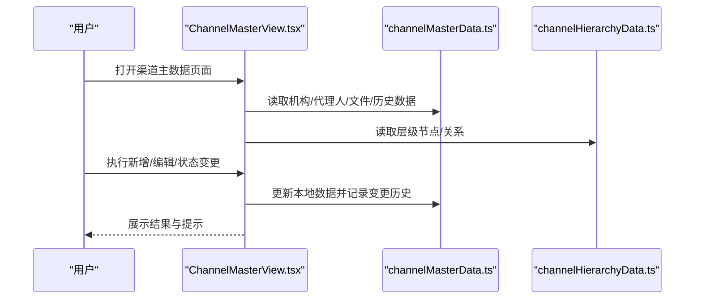
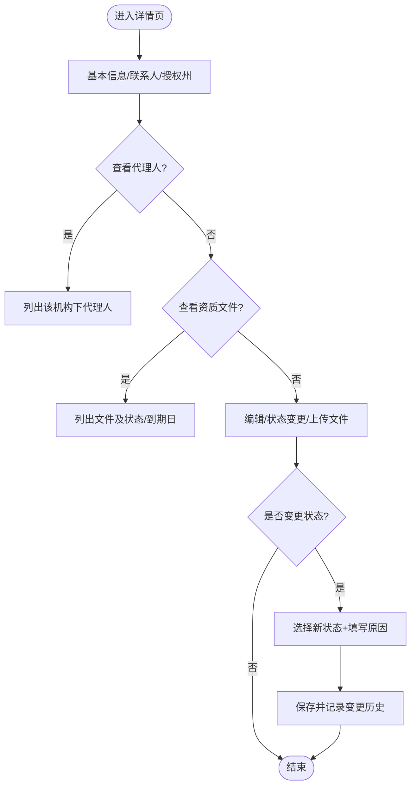
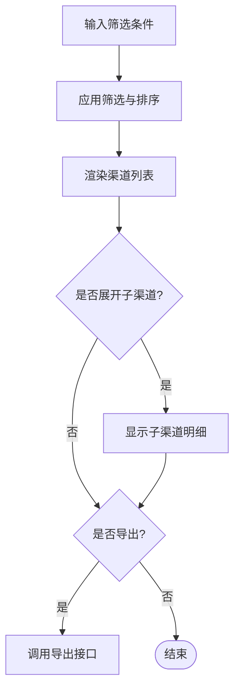
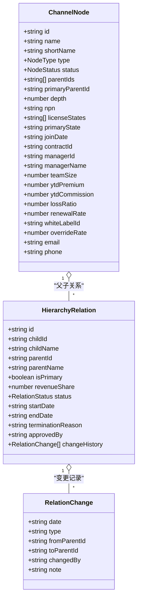
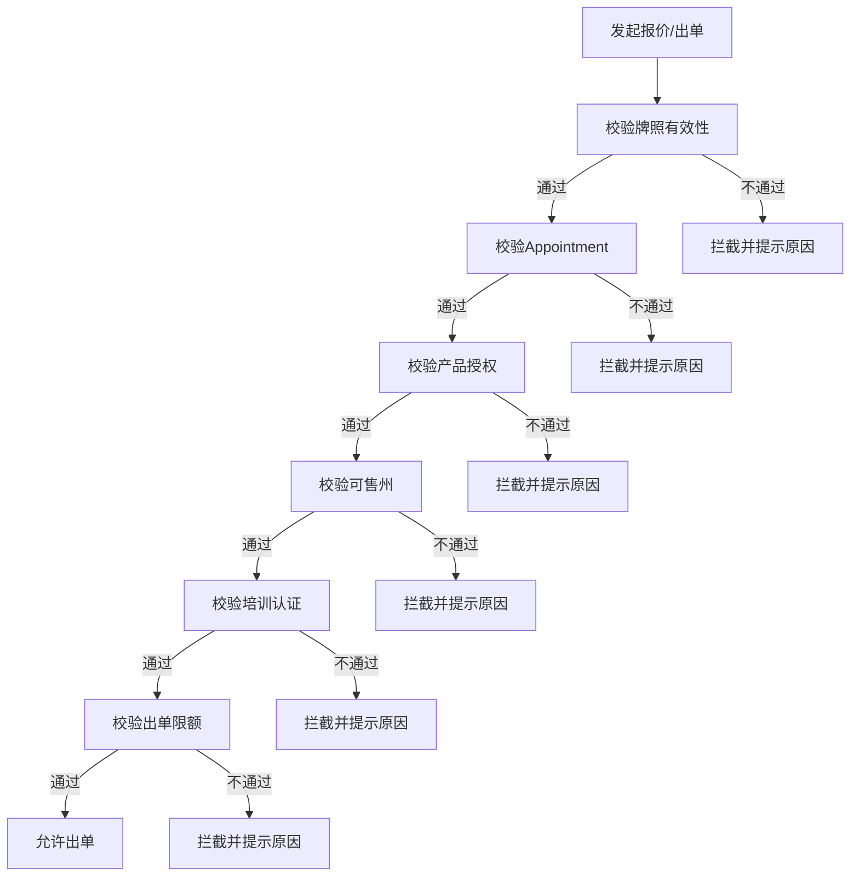
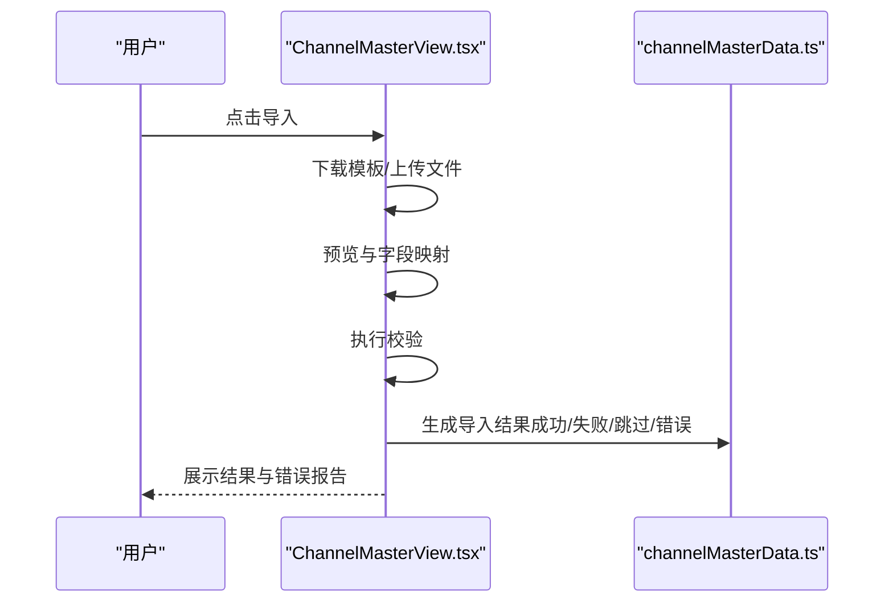
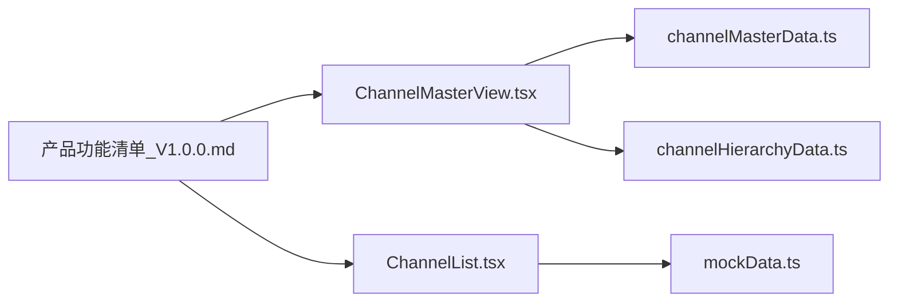

# 渠道主数据管理

<cite>
**本文引用的文件**
- [channelMasterData.ts](file://产品方案/UI-V1.0/src/data/channelMasterData.ts)
- [ChannelMasterView.tsx](file://产品方案/UI-V1.0/src/views/ChannelMasterView.tsx)
- [ChannelList.tsx](file://产品方案/UI-V1.0/src/views/ChannelList.tsx)
- [channelHierarchyData.ts](file://产品方案/UI-V1.0/src/data/channelHierarchyData.ts)
- [mockData.ts](file://产品方案/UI-V1.0/src/data/mockData.ts)
- [产品功能清单_V1.0.0.md](file://产品需求/产品功能清单_V1.0.0.md)
</cite>

## 目录
1. [简介](#简介)
2. [项目结构](#项目结构)
3. [核心组件](#核心组件)
4. [架构总览](#架构总览)
5. [详细组件分析](#详细组件分析)
6. [依赖关系分析](#依赖关系分析)
7. [性能与可用性](#性能与可用性)
8. [故障排查指南](#故障排查指南)
9. [结论](#结论)
10. [附录：字段定义、校验规则与业务约束](#附录字段定义校验规则与业务约束)

## 简介
本模块面向“渠道主数据”的全生命周期管理，覆盖渠道基础信息的增删改查、渠道类型分类（独立代理、经纪商、MGA、批发经纪、直销）、渠道等级体系（铂金、金级、银级、标准）以及状态管理（活跃、停用、入驻中、已暂停）。同时提供搜索过滤、批量操作、导入导出、变更历史与合规拦截等能力，支撑渠道运营、合规与结算等业务场景。

## 项目结构
- 数据层
  - channelMasterData.ts：渠道机构、代理人、资质文件、变更历史、导入结果与统计等核心数据模型与样例数据
  - channelHierarchyData.ts：渠道层级节点、关系、白标配置、团队绩效汇总等
  - mockData.ts：渠道列表、保险公司、产品等通用示例数据与工具函数
- 视图层
  - ChannelMasterView.tsx：渠道主数据详情与编辑、状态变更、文件上传、变更历史等交互
  - ChannelList.tsx：渠道列表、多维筛选、排序、展开子渠道、导出入口
- 需求文档
  - 产品功能清单_V1.0.0.md：渠道主数据相关功能点说明（CRUD、导入导出、审批、合规拦截等）

图表来源
- [ChannelMasterView.tsx:1-22](file://产品方案/UI-V1.0/src/views/ChannelMasterView.tsx#L1-L22)
- [ChannelList.tsx:1-5](file://产品方案/UI-V1.0/src/views/ChannelList.tsx#L1-L5)
- [channelMasterData.ts:1-449](file://产品方案/UI-V1.0/src/data/channelMasterData.ts#L1-L449)
- [channelHierarchyData.ts:1-261](file://产品方案/UI-V1.0/src/data/channelHierarchyData.ts#L1-L261)
- [mockData.ts:50-69](file://产品方案/UI-V1.0/src/data/mockData.ts#L50-L69)

章节来源
- [ChannelMasterView.tsx:1-22](file://产品方案/UI-V1.0/src/views/ChannelMasterView.tsx#L1-L22)
- [ChannelList.tsx:1-5](file://产品方案/UI-V1.0/src/views/ChannelList.tsx#L1-L5)
- [channelMasterData.ts:1-449](file://产品方案/UI-V1.0/src/data/channelMasterData.ts#L1-L449)
- [channelHierarchyData.ts:1-261](file://产品方案/UI-V1.0/src/data/channelHierarchyData.ts#L1-L261)
- [mockData.ts:50-69](file://产品方案/UI-V1.0/src/data/mockData.ts#L50-L69)

## 核心组件
- 渠道机构与代理人主数据
  - 机构：包含名称、简称、类型、状态、NPN、税务ID、授权州、主营州、地址、联系方式、负责人、合同编号、入驻日期、业绩指标、标签等
  - 代理人：包含姓名、邮箱、电话、NPN、持牌州、主营州、所属机构、状态、角色、业绩指标等
- 资质文件与变更历史
  - 资质文件：类别、有效期、状态、版本、审核备注等
  - 变更历史：实体、变更类型、字段、前后值、操作人、时间戳、IP、备注
- 渠道层级与关系
  - 节点：平台/大区/机构/分支/代理人，支持多上级、主次上级、分成比例、生效状态
  - 关系：父子关系、分成比例、状态、变更记录
- 渠道列表与等级
  - 渠道类型：独立代理、经纪商、MGA、批发经纪、直销
  - 渠道等级：铂金、金级、银级、标准
  - 状态：活跃、停用、入驻中、已暂停

章节来源
- [channelMasterData.ts:11-42](file://产品方案/UI-V1.0/src/data/channelMasterData.ts#L11-L42)
- [channelMasterData.ts:165-204](file://产品方案/UI-V1.0/src/data/channelMasterData.ts#L165-L204)
- [channelMasterData.ts:332-377](file://产品方案/UI-V1.0/src/data/channelMasterData.ts#L332-L377)
- [channelMasterData.ts:381-417](file://产品方案/UI-V1.0/src/data/channelMasterData.ts#L381-L417)
- [channelHierarchyData.ts:7-32](file://产品方案/UI-V1.0/src/data/channelHierarchyData.ts#L7-L32)
- [channelHierarchyData.ts:80-122](file://产品方案/UI-V1.0/src/data/channelHierarchyData.ts#L80-L122)
- [mockData.ts:50-69](file://产品方案/UI-V1.0/src/data/mockData.ts#L50-L69)
- [ChannelList.tsx:10-37](file://产品方案/UI-V1.0/src/views/ChannelList.tsx#L10-L37)

## 架构总览
渠道主数据由“数据模型 + 视图交互 + 需求规范”构成：
- 数据模型集中定义类型、枚举、样式映射与样例数据
- 视图组件负责展示、筛选、排序、编辑、状态变更、文件上传、导入导出入口
- 需求文档定义了功能边界与流程（如合规拦截、审批、导入模板、错误报告等）

图表来源
- [ChannelMasterView.tsx:1-22](file://产品方案/UI-V1.0/src/views/ChannelMasterView.tsx#L1-L22)
- [channelMasterData.ts:11-42](file://产品方案/UI-V1.0/src/data/channelMasterData.ts#L11-L42)
- [channelHierarchyData.ts:7-32](file://产品方案/UI-V1.0/src/data/channelHierarchyData.ts#L7-L32)

## 详细组件分析

### 渠道机构与代理人管理（CRUD）
- 新增/编辑
  - 表单分步：基本信息（名称、类型、NPN、税务ID、上级机构、合同编号）、联系方式（邮箱、电话、官网、负责人、地址、城市、州、邮编）、资质州域（主营州、授权州多选、标签、备注）
  - 保存时模拟异步提交并关闭弹窗
- 查看详情
  - 基本信息、联系人、授权州、上级机构、KPI（YTD保费、佣金、赔付率、续保率）
  - 关联代理人列表、资质文件列表（含状态图标与到期日）
- 状态变更
  - 支持机构与代理人状态切换；暂停时提示权限冻结
  - 记录变更原因，写入变更历史
- 删除
  - 当前视图未直接暴露删除按钮，但可通过编辑或状态变更流程配合后端实现删除逻辑

图表来源
- [ChannelMasterView.tsx:246-477](file://产品方案/UI-V1.0/src/views/ChannelMasterView.tsx#L246-L477)
- [ChannelMasterView.tsx:479-633](file://产品方案/UI-V1.0/src/views/ChannelMasterView.tsx#L479-L633)
- [ChannelMasterView.tsx:635-688](file://产品方案/UI-V1.0/src/views/ChannelMasterView.tsx#L635-L688)
- [channelMasterData.ts:381-417](file://产品方案/UI-V1.0/src/data/channelMasterData.ts#L381-L417)

章节来源
- [ChannelMasterView.tsx:246-477](file://产品方案/UI-V1.0/src/views/ChannelMasterView.tsx#L246-L477)
- [ChannelMasterView.tsx:479-633](file://产品方案/UI-V1.0/src/views/ChannelMasterView.tsx#L479-L633)
- [ChannelMasterView.tsx:635-688](file://产品方案/UI-V1.0/src/views/ChannelMasterView.tsx#L635-L688)
- [channelMasterData.ts:11-42](file://产品方案/UI-V1.0/src/data/channelMasterData.ts#L11-L42)
- [channelMasterData.ts:165-204](file://产品方案/UI-V1.0/src/data/channelMasterData.ts#L165-L204)
- [channelMasterData.ts:381-417](file://产品方案/UI-V1.0/src/data/channelMasterData.ts#L381-L417)

### 渠道列表与筛选
- 筛选维度
  - 关键词搜索（名称、NPN编码）
  - 渠道类型（独立代理、经纪商、MGA、批发经纪）
  - 渠道状态（活跃、入驻中、已暂停、停用）
  - 渠道等级（铂金、金级、银级、标准）
  - 区域（大区）
- 表格展示
  - 一级渠道可展开子渠道，显示聚合的代理人数、保费、保单数、赔付率、续保率、佣金率、入驻日期、状态
- 导出
  - 提供导出按钮入口（实际导出逻辑需对接后端）

图表来源
- [ChannelList.tsx:40-60](file://产品方案/UI-V1.0/src/views/ChannelList.tsx#L40-L60)
- [ChannelList.tsx:104-144](file://产品方案/UI-V1.0/src/views/ChannelList.tsx#L104-L144)
- [ChannelList.tsx:146-285](file://产品方案/UI-V1.0/src/views/ChannelList.tsx#L146-L285)

章节来源
- [ChannelList.tsx:10-37](file://产品方案/UI-V1.0/src/views/ChannelList.tsx#L10-L37)
- [ChannelList.tsx:40-60](file://产品方案/UI-V1.0/src/views/ChannelList.tsx#L40-L60)
- [ChannelList.tsx:104-144](file://产品方案/UI-V1.0/src/views/ChannelList.tsx#L104-L144)
- [ChannelList.tsx:146-285](file://产品方案/UI-V1.0/src/views/ChannelList.tsx#L146-L285)
- [mockData.ts:50-69](file://产品方案/UI-V1.0/src/data/mockData.ts#L50-L69)

### 渠道层级与组织架构
- 节点类型与深度
  - 平台(0) → 大区(1) → 机构(2) → 分支(3) → 代理人(4)
- 多上级与分成
  - 支持多父节点、主次上级、收入分成比例
- 关系与待办变更
  - 关系状态（活跃、待审、终止、调整中），变更历史
  - 待审批变更（移动上级、增加上级、终止关系、调整分成）

图表来源
- [channelHierarchyData.ts:7-32](file://产品方案/UI-V1.0/src/data/channelHierarchyData.ts#L7-L32)
- [channelHierarchyData.ts:80-122](file://产品方案/UI-V1.0/src/data/channelHierarchyData.ts#L80-L122)
- [channelHierarchyData.ts:126-151](file://产品方案/UI-V1.0/src/data/channelHierarchyData.ts#L126-L151)

章节来源
- [channelHierarchyData.ts:7-32](file://产品方案/UI-V1.0/src/data/channelHierarchyData.ts#L7-L32)
- [channelHierarchyData.ts:80-122](file://产品方案/UI-V1.0/src/data/channelHierarchyData.ts#L80-L122)
- [channelHierarchyData.ts:126-151](file://产品方案/UI-V1.0/src/data/channelHierarchyData.ts#L126-L151)

### 资质文件与合规
- 文件类别
  - 保险执照、E&O证书、W-9税务、合同协议、背景调查、培训证书、公司注册、其他
- 文件状态
  - 有效、即将到期、已过期、缺失、待审核
- 合规拦截（需求）
  - 牌照校验、Appointment校验、产品授权校验、可售州校验、培训认证校验、出单限额校验、状态校验
  - 拦截原因展示、豁免申请、日志记录、统计报表

图表来源
- [产品功能清单_V1.0.0.md:650-666](file://产品需求/产品功能清单_V1.0.0.md#L650-L666)
- [channelMasterData.ts:332-377](file://产品方案/UI-V1.0/src/data/channelMasterData.ts#L332-L377)

章节来源
- [产品功能清单_V1.0.0.md:650-666](file://产品需求/产品功能清单_V1.0.0.md#L650-L666)
- [channelMasterData.ts:332-377](file://产品方案/UI-V1.0/src/data/channelMasterData.ts#L332-L377)

### 批量操作与导入导出
- 批量操作
  - 批量停用/启用、批量状态变更（需求）
  - 列表勾选后执行批量动作（视图预留入口）
- 导入
  - 下载模板、上传Excel、预览、字段映射、校验、错误报告、确认导入、结果反馈
  - 示例导入结果包含成功/失败/跳过条数与错误明细
- 导出
  - 选择范围、字段、格式、是否含关联数据、任务记录

图表来源
- [channelMasterData.ts:419-435](file://产品方案/UI-V1.0/src/data/channelMasterData.ts#L419-L435)
- [产品功能清单_V1.0.0.md:126-141](file://产品需求/产品功能清单_V1.0.0.md#L126-L141)
- [产品功能清单_V1.0.0.md:142-154](file://产品需求/产品功能清单_V1.0.0.md#L142-L154)

章节来源
- [channelMasterData.ts:419-435](file://产品方案/UI-V1.0/src/data/channelMasterData.ts#L419-L435)
- [产品功能清单_V1.0.0.md:126-141](file://产品需求/产品功能清单_V1.0.0.md#L126-L141)
- [产品功能清单_V1.0.0.md:142-154](file://产品需求/产品功能清单_V1.0.0.md#L142-L154)

## 依赖关系分析
- ChannelMasterView.tsx 依赖 channelMasterData.ts 的类型与数据，用于展示与编辑
- ChannelList.tsx 依赖 mockData.ts 的渠道数据与工具函数，用于列表展示与筛选
- channelHierarchyData.ts 提供层级结构与关系数据，供复杂组织管理使用
- 需求文档为功能边界与流程提供依据（导入导出、合规拦截、审批等）

图表来源
- [ChannelMasterView.tsx:1-22](file://产品方案/UI-V1.0/src/views/ChannelMasterView.tsx#L1-L22)
- [ChannelList.tsx:1-5](file://产品方案/UI-V1.0/src/views/ChannelList.tsx#L1-L5)
- [channelMasterData.ts:1-449](file://产品方案/UI-V1.0/src/data/channelMasterData.ts#L1-L449)
- [channelHierarchyData.ts:1-261](file://产品方案/UI-V1.0/src/data/channelHierarchyData.ts#L1-L261)
- [mockData.ts:50-69](file://产品方案/UI-V1.0/src/data/mockData.ts#L50-L69)
- [产品功能清单_V1.0.0.md:126-154](file://产品需求/产品功能清单_V1.0.0.md#L126-L154)

章节来源
- [ChannelMasterView.tsx:1-22](file://产品方案/UI-V1.0/src/views/ChannelMasterView.tsx#L1-L22)
- [ChannelList.tsx:1-5](file://产品方案/UI-V1.0/src/views/ChannelList.tsx#L1-L5)
- [channelMasterData.ts:1-449](file://产品方案/UI-V1.0/src/data/channelMasterData.ts#L1-L449)
- [channelHierarchyData.ts:1-261](file://产品方案/UI-V1.0/src/data/channelHierarchyData.ts#L1-L261)
- [mockData.ts:50-69](file://产品方案/UI-V1.0/src/data/mockData.ts#L50-L69)
- [产品功能清单_V1.0.0.md:126-154](file://产品需求/产品功能清单_V1.0.0.md#L126-L154)

## 性能与可用性
- 前端性能
  - 列表筛选与排序在客户端进行，适合中小规模数据；大数据量建议分页与后端过滤
  - 详情面板采用局部渲染，减少重绘
- 可用性
  - 状态变更需填写原因，避免误操作
  - 资质文件状态可视化（有效/即将到期/已过期/缺失/待审核），便于及时维护
  - 导入导出提供错误报告与结果反馈，提升容错性

[本节为通用指导，无需特定文件引用]

## 故障排查指南
- 导入失败
  - 检查模板列名与字段映射
  - 查看错误报告中的行号与字段错误信息
- 状态变更无效
  - 确认是否选择了必填的原因
  - 检查是否存在前置校验（如合规拦截）
- 资质文件异常
  - 关注即将到期与已过期文件，及时续期或替换
  - 查看审核备注与版本号，确保最新文件已上传

章节来源
- [channelMasterData.ts:419-435](file://产品方案/UI-V1.0/src/data/channelMasterData.ts#L419-L435)
- [ChannelMasterView.tsx:635-688](file://产品方案/UI-V1.0/src/views/ChannelMasterView.tsx#L635-L688)
- [channelMasterData.ts:332-377](file://产品方案/UI-V1.0/src/data/channelMasterData.ts#L332-L377)

## 结论
渠道主数据模块以清晰的数据模型与直观的视图交互，实现了渠道基础信息的CRUD、类型与等级管理、状态控制、搜索过滤、批量操作与导入导出。结合层级与关系管理、资质文件与合规拦截，形成完整的渠道运营闭环。后续可结合后端API完善持久化、审批流与更丰富的数据分析能力。

[本节为总结，无需特定文件引用]

## 附录：字段定义、校验规则与业务约束

### 渠道机构字段定义（节选）
- 标识与名称：id、name、shortName
- 类型与状态：type（agency/ga/branch/sub-agency）、status（active/inactive/suspended/pending）
- 监管与税务：npn、taxId、licenseStates、primaryState
- 联系信息：address、city、state、zip、phone、email、website
- 管理与关系：managerId、managerName、parentOrgId、parentOrgName、contractId
- 时间与业绩：joinDate、lastReviewDate、ytdPremium、ytdCommission、lossRatio、renewalRate、agentCount
- 标签与备注：tags、notes

章节来源
- [channelMasterData.ts:11-42](file://产品方案/UI-V1.0/src/data/channelMasterData.ts#L11-L42)

### 渠道代理人字段定义（节选）
- 标识与姓名：id、firstName、lastName、displayName
- 联系与监管：email、phone、npn、licenseStates、primaryState
- 组织与角色：orgId、orgName、role（agent/senior-agent/manager/principal）
- 状态与时间：status（active/inactive/suspended/pending/terminated）、joinDate、lastActiveDate
- 业绩指标：ytdPremium、ytdCommission、lossRatio、renewalRate、policyCount、clientCount
- 地址与备注：address、city、state、zip、notes

章节来源
- [channelMasterData.ts:165-204](file://产品方案/UI-V1.0/src/data/channelMasterData.ts#L165-L204)

### 资质文件字段定义（节选）
- 标识与归属：id、ownerId、ownerType（org/agent）、ownerName
- 类别与元数据：category（license/eo/w9/contract/bg/training/corp/other）、name、fileSize、uploadedDate、uploadedBy
- 有效期与状态：expiryDate、status（valid/expired/expiring-soon/missing/pending-review）、reviewNote、version

章节来源
- [channelMasterData.ts:332-377](file://产品方案/UI-V1.0/src/data/channelMasterData.ts#L332-L377)

### 渠道类型与等级
- 渠道类型：Independent Agency（独立代理）、Broker（经纪商）、MGA、Wholesale Broker（批发经纪）、Direct（直销）
- 渠道等级：Platinum（铂金）、Gold（金级）、Silver（银级）、Standard（标准）

章节来源
- [mockData.ts:50-69](file://产品方案/UI-V1.0/src/data/mockData.ts#L50-L69)
- [ChannelList.tsx:10-37](file://产品方案/UI-V1.0/src/views/ChannelList.tsx#L10-L37)

### 状态管理
- 机构状态：active（正常）、inactive（未激活）、suspended（已暂停）、pending（待审批）
- 代理人状态：active（在职）、inactive（未激活）、suspended（已暂停）、pending（待审批）、terminated（已离职）
- 资质文件状态：valid（有效）、expired（已过期）、expiring-soon（即将到期）、missing（缺失）、pending-review（待审核）

章节来源
- [channelMasterData.ts:44-51](file://产品方案/UI-V1.0/src/data/channelMasterData.ts#L44-L51)
- [channelMasterData.ts:194-204](file://产品方案/UI-V1.0/src/data/channelMasterData.ts#L194-L204)
- [channelMasterData.ts:350-356](file://产品方案/UI-V1.0/src/data/channelMasterData.ts#L350-L356)

### 验证规则与业务约束（基于代码与需求）
- NPN格式校验：导入时校验NPN格式（示例错误：应为8-10位数字）
- 州代码校验：主营州与授权州需为标准两字母代码（示例错误：无法识别“Cali”）
- 必填项校验：机构名称、简称、类型、NPN、税务ID、邮箱、主营州等为必填
- 状态变更约束：暂停时需填写原因，暂停后权限立即停止
- 合规拦截：牌照、Appointment、产品授权、可售州、培训认证、出单限额、状态等前置校验不通过则拦截

章节来源
- [channelMasterData.ts:429-435](file://产品方案/UI-V1.0/src/data/channelMasterData.ts#L429-L435)
- [ChannelMasterView.tsx:635-688](file://产品方案/UI-V1.0/src/views/ChannelMasterView.tsx#L635-L688)
- [产品功能清单_V1.0.0.md:650-666](file://产品需求/产品功能清单_V1.0.0.md#L650-L666)