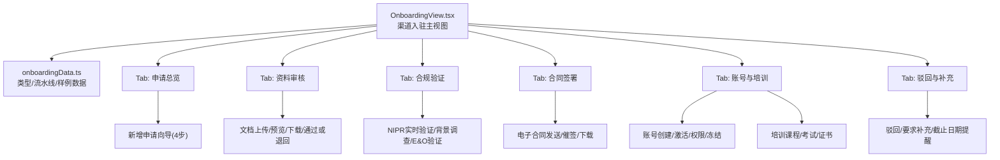
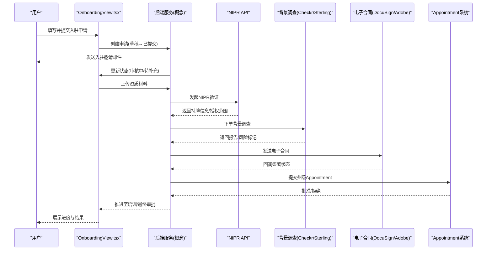
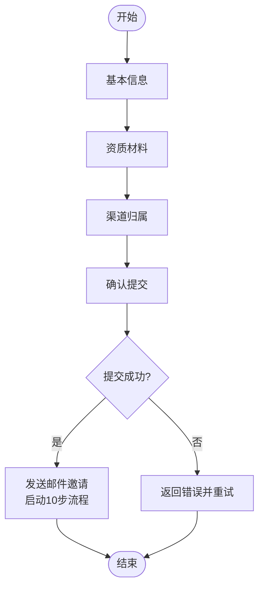
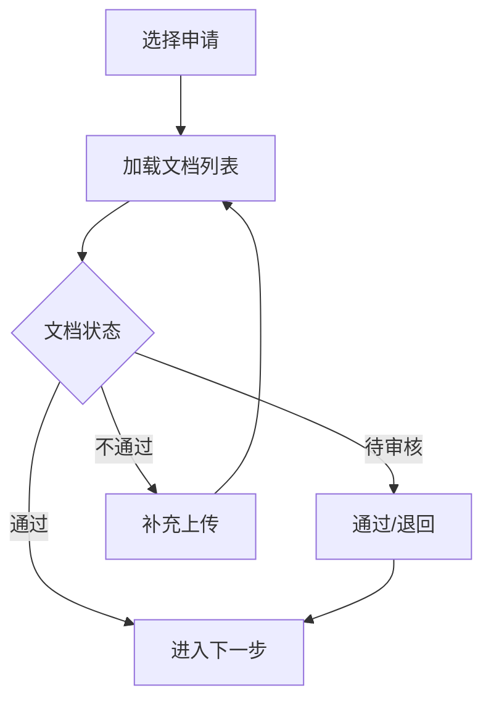
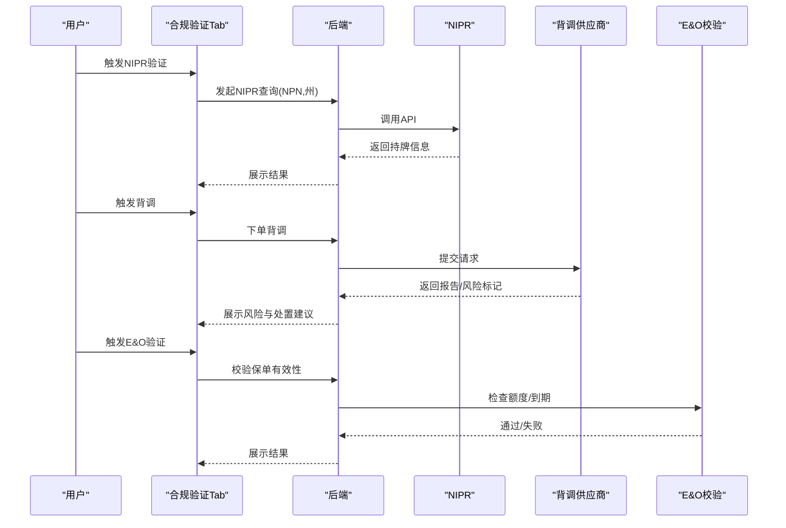
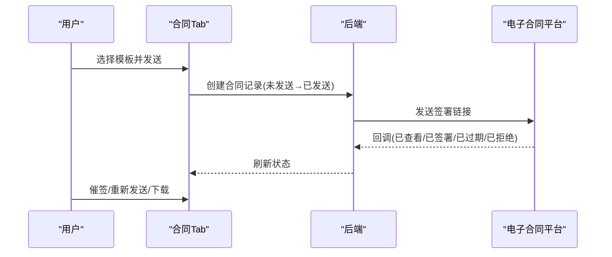
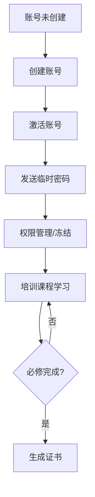
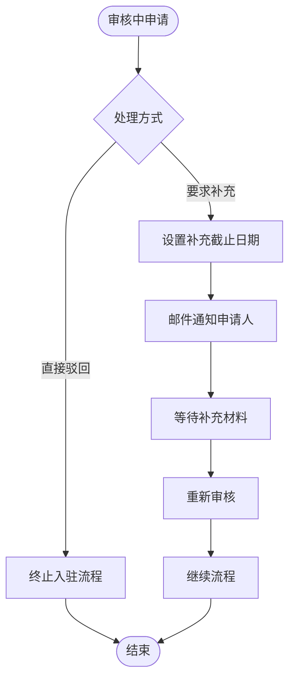
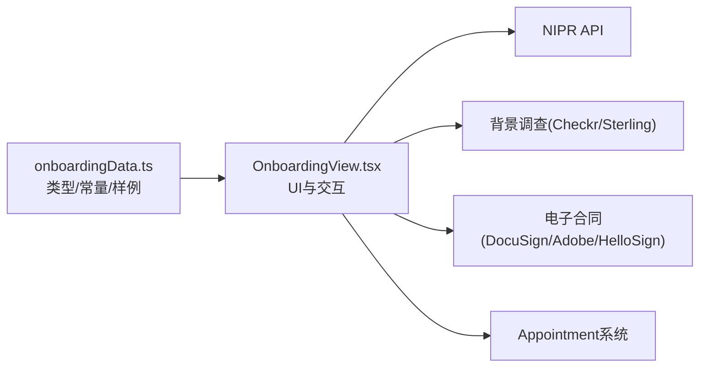

# 渠道入驻管理

<cite>
**本文引用的文件**
- [OnboardingView.tsx](file://产品方案/UI-V1.0/src/views/OnboardingView.tsx)
- [onboardingData.ts](file://产品方案/UI-V1.0/src/data/onboardingData.ts)
- [产品功能清单_V1.0.0.md](file://产品需求/产品功能清单_V1.0.0.md)
</cite>

## 目录
1. [简介](#简介)
2. [项目结构](#项目结构)
3. [核心组件](#核心组件)
4. [架构总览](#架构总览)
5. [详细组件分析](#详细组件分析)
6. [依赖关系分析](#依赖关系分析)
7. [性能与可用性考虑](#性能与可用性考虑)
8. [故障排查指南](#故障排查指南)
9. [结论](#结论)
10. [附录：接口与数据同步建议](#附录接口与数据同步建议)

## 简介
本文件围绕“渠道入驻管理”能力，系统化梳理从申请提交、资质审核、合规验证、合同签署到账号开通与培训认证的全流程；明确各阶段状态转换、通知机制、权限控制与外部系统集成点。文档基于前端实现（React + TypeScript）与产品需求进行对照说明，并提供流程图与时序图帮助理解。

## 项目结构
- 前端视图层：以单页应用形式组织，核心页面为 OnboardingView，按 Tab 划分“申请总览、资料审核、合规验证、合同签署、账号与培训、驳回与补充”等子模块。
- 数据模型与样例：统一在 onboardingData.ts 中定义类型、流水线步骤、状态样式映射及示例数据。
- 产品需求：功能清单明确了渠道入驻与准入管理的操作级能力边界，包括 NIPR 校验、背景调查、E&O 保险验证、Appointment、合规拦截等。

**图表来源**
- [OnboardingView.tsx:1182-1248](file://产品方案/UI-V1.0/src/views/OnboardingView.tsx#L1182-L1248)
- [onboardingData.ts:154-165](file://产品方案/UI-V1.0/src/data/onboardingData.ts#L154-L165)

**章节来源**
- [OnboardingView.tsx:1-1251](file://产品方案/UI-V1.0/src/views/OnboardingView.tsx#L1-L1251)
- [onboardingData.ts:1-528](file://产品方案/UI-V1.0/src/data/onboardingData.ts#L1-L528)

## 核心组件
- 申请总览：展示申请列表、筛选、搜索、KPI 指标；支持新增申请向导（基本信息、资质材料、渠道归属、确认提交）。
- 资料审核：按申请维度查看上传的文档，支持预览、下载、通过/退回、补充上传。
- 合规验证：集成 NIPR 牌照验证、背景调查（Checkr/Sterling）、E&O 保险验证，展示结果与风险标记。
- 合同签署：电子合同模板库、发送签署链接、催签、下载已签署合同。
- 账号与培训：账号创建、激活、临时密码发送、权限管理；培训课程进度、成绩与证书。
- 驳回与补充：对处于审核中的申请执行“要求补充”或“直接驳回”，设置补充截止日期并邮件通知。

**章节来源**
- [OnboardingView.tsx:123-418](file://产品方案/UI-V1.0/src/views/OnboardingView.tsx#L123-L418)
- [OnboardingView.tsx:422-534](file://产品方案/UI-V1.0/src/views/OnboardingView.tsx#L422-L534)
- [OnboardingView.tsx:538-740](file://产品方案/UI-V1.0/src/views/OnboardingView.tsx#L538-L740)
- [OnboardingView.tsx:744-865](file://产品方案/UI-V1.0/src/views/OnboardingView.tsx#L744-L865)
- [OnboardingView.tsx:869-1046](file://产品方案/UI-V1.0/src/views/OnboardingView.tsx#L869-L1046)
- [OnboardingView.tsx:1050-1178](file://产品方案/UI-V1.0/src/views/OnboardingView.tsx#L1050-L1178)

## 架构总览
渠道入驻采用“流水线式”多步骤审批与验证，前端通过统一的类型与状态映射驱动界面渲染与交互。后端（概念性）应提供以下能力：
- 申请生命周期管理：草稿→已提交→审核中→各合规验证→合同→Appointment→账号→培训→最终审批→已入驻/已驳回。
- 文档与附件管理：上传、预览、版本、过期校验。
- 外部系统对接：NIPR API、背景调查服务商（Checkr/Sterling）、电子合同平台（DocuSign/Adobe Sign/HelloSign）、监管 Appointment 系统。
- 通知与审计：邮件/站内信通知、操作日志、变更历史。

**图表来源**
- [onboardingData.ts:154-165](file://产品方案/UI-V1.0/src/data/onboardingData.ts#L154-L165)
- [OnboardingView.tsx:538-740](file://产品方案/UI-V1.0/src/views/OnboardingView.tsx#L538-L740)
- [OnboardingView.tsx:744-865](file://产品方案/UI-V1.0/src/views/OnboardingView.tsx#L744-L865)

## 详细组件分析

### 申请总览与新增申请向导
- 功能要点
  - 列表展示：申请人、状态、流程进度、审核人、提交日期、截止补充时间。
  - 筛选与搜索：按状态、关键词过滤。
  - 新增申请向导（4步）：基本信息（渠道类型、主营州、姓名/机构、邮箱、电话、NPN）、资质材料（执照、E&O、背调授权、身份证件、W-9）、渠道归属（上级渠道、分配审核人、合同模板）、确认提交（汇总与提示）。
- 状态与通知
  - 提交后自动发送邮件邀请，启动10步入驻流程，并通知分配审核人。
- 数据绑定与文件上传
  - 表单字段与下拉选择绑定；第二步提供文件上传入口（执照、E&O、背调授权、ID、W-9）。
- 代码片段路径
  - 新增申请向导与步骤切换：[OnboardingView.tsx:276-418](file://产品方案/UI-V1.0/src/views/OnboardingView.tsx#L276-L418)
  - 列表与筛选：[OnboardingView.tsx:123-195](file://产品方案/UI-V1.0/src/views/OnboardingView.tsx#L123-L195)

**图表来源**
- [OnboardingView.tsx:276-418](file://产品方案/UI-V1.0/src/views/OnboardingView.tsx#L276-L418)

**章节来源**
- [OnboardingView.tsx:123-418](file://产品方案/UI-V1.0/src/views/OnboardingView.tsx#L123-L418)

### 资料审核
- 功能要点
  - 按申请维度查看文档：保险执照、E&O证书、背调授权、身份证件、W-9、合同、培训证书等。
  - 操作：预览、下载、通过/退回、补充上传（失败项可重新上传）。
  - 状态：通过、不通过、待审核、豁免。
- 规则与校验
  - 过期校验（如E&O到期）、格式校验（如W-9版本）。
- 代码片段路径
  - 文档审核面板与操作按钮：[OnboardingView.tsx:422-534](file://产品方案/UI-V1.0/src/views/OnboardingView.tsx#L422-L534)

**图表来源**
- [OnboardingView.tsx:422-534](file://产品方案/UI-V1.0/src/views/OnboardingView.tsx#L422-L534)

**章节来源**
- [OnboardingView.tsx:422-534](file://产品方案/UI-V1.0/src/views/OnboardingView.tsx#L422-L534)

### 合规验证（NIPR / 背景调查 / E&O）
- NIPR 实时验证
  - 输入 NPN 与州，调用 NIPR API 获取持牌信息与授权范围，展示有效期与状态。
- 背景调查
  - 集成 Checkr（主要）与 Sterling（备用），显示订单时间、完成时间、风险标记（刑事、民事、监管、信用、雇佣）及处置建议（无影响/需复核/不予准入）。
- E&O 保险验证
  - 校验保单号、承保金额、生效/到期日，过期或额度不足则标记失败。
- 代码片段路径
  - NIPR 验证与结果展示：[OnboardingView.tsx:538-624](file://产品方案/UI-V1.0/src/views/OnboardingView.tsx#L538-L624)
  - 背景调查与风险标记：[OnboardingView.tsx:626-693](file://产品方案/UI-V1.0/src/views/OnboardingView.tsx#L626-L693)
  - E&O 保险验证与过期提示：[OnboardingView.tsx:695-740](file://产品方案/UI-V1.0/src/views/OnboardingView.tsx#L695-L740)

**图表来源**
- [OnboardingView.tsx:538-740](file://产品方案/UI-V1.0/src/views/OnboardingView.tsx#L538-L740)

**章节来源**
- [OnboardingView.tsx:538-740](file://产品方案/UI-V1.0/src/views/OnboardingView.tsx#L538-L740)

### 合同签署
- 功能要点
  - 电子合同模板库：代理人协议、GA协议、子代理协议、分支机构委任书等。
  - 发送签署链接、催签、重新发送、下载已签署合同。
  - 状态：未发送、已发送、已查看、已签署、已过期、已拒绝。
- 代码片段路径
  - 合同状态与操作：[OnboardingView.tsx:744-865](file://产品方案/UI-V1.0/src/views/OnboardingView.tsx#L744-L865)

**图表来源**
- [OnboardingView.tsx:744-865](file://产品方案/UI-V1.0/src/views/OnboardingView.tsx#L744-L865)

**章节来源**
- [OnboardingView.tsx:744-865](file://产品方案/UI-V1.0/src/views/OnboardingView.tsx#L744-L865)

### 账号开通与培训认证
- 账号开通
  - 创建账号、激活、发送临时密码、权限管理、冻结。
- 培训认证
  - 必修/选修课程、时长、状态、得分、完成日期；整体通过率与平均分；证书下载。
- 代码片段路径
  - 账号与培训面板：[OnboardingView.tsx:869-1046](file://产品方案/UI-V1.0/src/views/OnboardingView.tsx#L869-L1046)

**图表来源**
- [OnboardingView.tsx:869-1046](file://产品方案/UI-V1.0/src/views/OnboardingView.tsx#L869-L1046)

**章节来源**
- [OnboardingView.tsx:869-1046](file://产品方案/UI-V1.0/src/views/OnboardingView.tsx#L869-L1046)

### 驳回与补充
- 功能要点
  - 对处于审核中的申请执行“要求补充”或“直接驳回”。
  - 设置补充截止日期，邮件通知申请人。
  - 已驳回的申请支持“重新申请”。
- 代码片段路径
  - 驳回与补充弹窗与列表：[OnboardingView.tsx:1050-1178](file://产品方案/UI-V1.0/src/views/OnboardingView.tsx#L1050-L1178)

**图表来源**
- [OnboardingView.tsx:1050-1178](file://产品方案/UI-V1.0/src/views/OnboardingView.tsx#L1050-L1178)

**章节来源**
- [OnboardingView.tsx:1050-1178](file://产品方案/UI-V1.0/src/views/OnboardingView.tsx#L1050-L1178)

## 依赖关系分析
- 类型与数据
  - 流水线步骤定义、状态样式映射、渠道类型标签、审核结果样式均集中在 onboardingData.ts，供 OnboardingView 多处复用。
  - 示例数据覆盖多个申请在不同阶段的完整状态，便于演示与测试。
- 视图与数据耦合
  - OnboardingView 通过导入 onboardingData 的类型与常量，确保 UI 与数据模型一致。
- 外部依赖
  - NIPR API、背景调查供应商、电子合同平台、Appointment 系统作为后端集成点，前端通过状态与回调驱动界面变化。

**图表来源**
- [onboardingData.ts:1-195](file://产品方案/UI-V1.0/src/data/onboardingData.ts#L1-L195)
- [OnboardingView.tsx:1-16](file://产品方案/UI-V1.0/src/views/OnboardingView.tsx#L1-L16)

**章节来源**
- [onboardingData.ts:1-195](file://产品方案/UI-V1.0/src/data/onboardingData.ts#L1-L195)
- [OnboardingView.tsx:1-16](file://产品方案/UI-V1.0/src/views/OnboardingView.tsx#L1-L16)

## 性能与可用性考虑
- 前端渲染
  - 使用轻量卡片与表格布局，避免复杂重绘；批量数据分页与懒加载可降低首屏压力。
- 异步操作
  - 外部验证（NIPR/背调/E&O）与合同发送采用异步回调，前端通过状态占位与加载指示提升体验。
- 可访问性与提示
  - 关键操作（驳回/补充/发送合同）提供明确提示与二次确认；错误与警告使用高对比度标识。
- 可扩展性
  - 流水线步骤与状态样式集中配置，便于后续扩展新步骤或调整状态语义。

[本节为通用指导，不直接分析具体文件]

## 故障排查指南
- 常见异常
  - 资料审核失败：检查文档是否过期或格式不符（如 W-9 版本），根据“不通过”提示补充上传。
  - NIPR 验证失败：核对 NPN 与州是否正确，必要时手动刷新校验。
  - 背景调查延迟：查看供应商处理时间与预计完成时间，必要时催办。
  - 合同未签署：检查签署链接是否过期，支持重新发送与催签。
  - 账号未激活：确认账号创建与激活状态，必要时重发临时密码。
- 定位方法
  - 通过“流程进度”查看当前步骤与备注；结合“驳回与补充”查看问题说明与截止日期。
  - 在“合规验证”与“合同签署”中查看外部系统回调状态。

**章节来源**
- [OnboardingView.tsx:422-534](file://产品方案/UI-V1.0/src/views/OnboardingView.tsx#L422-L534)
- [OnboardingView.tsx:538-740](file://产品方案/UI-V1.0/src/views/OnboardingView.tsx#L538-L740)
- [OnboardingView.tsx:744-865](file://产品方案/UI-V1.0/src/views/OnboardingView.tsx#L744-L865)
- [OnboardingView.tsx:1050-1178](file://产品方案/UI-V1.0/src/views/OnboardingView.tsx#L1050-L1178)

## 结论
渠道入驻管理以“流水线+多外部验证”为核心，前端通过清晰的 Tab 与状态映射实现端到端可视化。建议在后端完善：
- 严格的申请生命周期与状态机；
- 外部系统回调与重试机制；
- 完整的审计日志与通知体系；
- 合规拦截与权限控制（如出单前校验牌照、Appointment、产品授权、培训认证）。

[本节为总结，不直接分析具体文件]

## 附录：接口与数据同步建议
- 申请生命周期接口（概念）
  - 创建申请：POST /api/onboarding/applications
  - 更新状态：PATCH /api/onboarding/applications/{id}/status
  - 查询列表：GET /api/onboarding/applications?filters=...
- 文档与附件接口（概念）
  - 上传文档：POST /api/onboarding/documents
  - 预览/下载：GET /api/onboarding/documents/{id}
  - 审核结果：PATCH /api/onboarding/documents/{id}/review
- 合规验证接口（概念）
  - NIPR 验证：POST /api/compliance/nipr
  - 背景调查：POST /api/compliance/background-checks
  - E&O 验证：POST /api/compliance/eo-insurance
- 合同签署接口（概念）
  - 发送合同：POST /api/contracts/send
  - 回调状态：POST /api/contracts/callback
- 账号与培训接口（概念）
  - 创建账号：POST /api/accounts
  - 激活账号：PATCH /api/accounts/{id}/activate
  - 培训进度：GET/POST /api/training/modules/{id}
- 数据同步机制
  - 外部系统回调：Webhook 接收状态变更，落库并触发前端刷新。
  - 定时任务：定期拉取 NIPR/背调/E&O 最新状态，更新本地缓存。
  - 幂等与重试：对回调与外部调用增加幂等键与重试策略，保证一致性。

[本节为概念性设计，不直接分析具体文件]