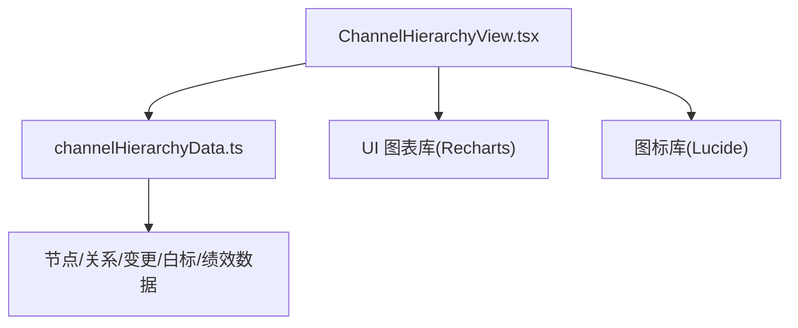
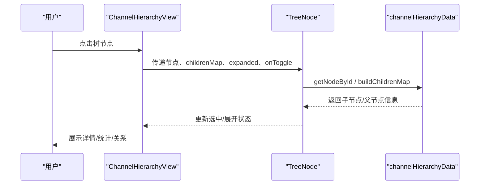
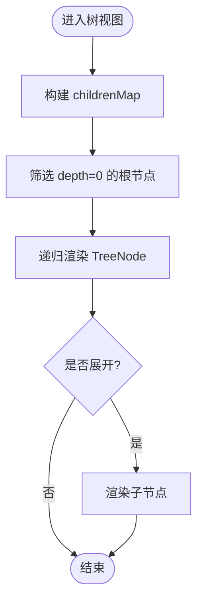
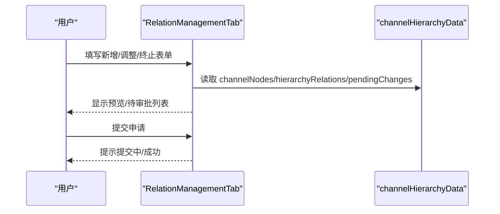
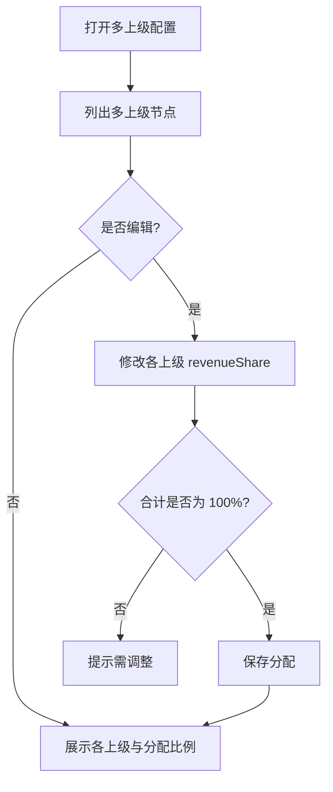
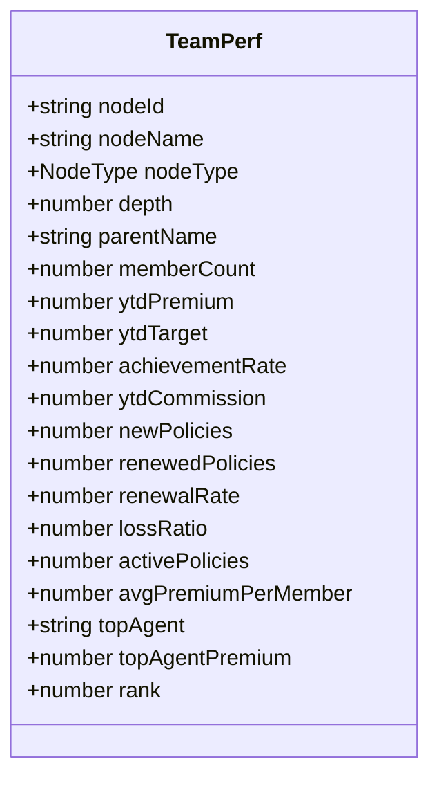
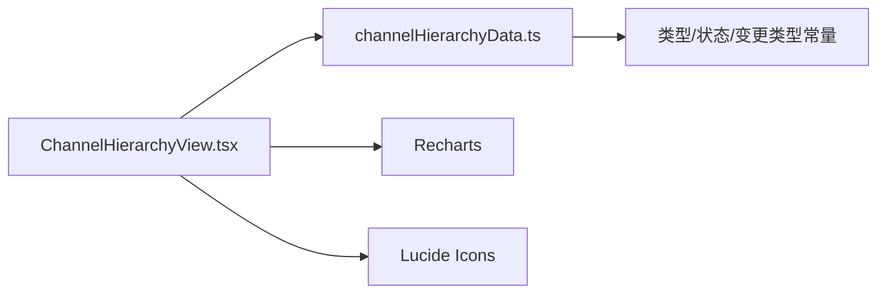

# 渠道层级管理

<cite>
**本文引用的文件**
- [ChannelHierarchyView.tsx](file://产品方案/UI-V1.0/src/views/ChannelHierarchyView.tsx)
- [channelHierarchyData.ts](file://产品方案/UI-V1.0/src/data/channelHierarchyData.ts)
- [产品功能清单_V1.0.0.md](file://产品需求/产品功能清单_V1.0.0.md)
</cite>

## 目录
1. [简介](#简介)
2. [项目结构](#项目结构)
3. [核心组件](#核心组件)
4. [架构总览](#架构总览)
5. [详细组件分析](#详细组件分析)
6. [依赖关系分析](#依赖关系分析)
7. [性能考量](#性能考量)
8. [故障排查指南](#故障排查指南)
9. [结论](#结论)
10. [附录](#附录)

## 简介
本文件面向“渠道层级管理”能力，聚焦以下目标：
- 树形组织架构的创建、编辑、移动与删除
- 父子关系维护与多上级支持
- 层级权限控制与数据隔离策略
- 基于层级关系的聚合统计、绩效汇总、佣金计算逻辑
- 树节点展开/收起、拖拽排序等交互实现要点
- 变更审批流与审计追踪

该功能覆盖渠道主数据、层级与组织、入驻准入、产品授权、佣金方案与结算、绩效考核等模块的联动。

## 项目结构
前端以 React + TypeScript 构建，采用单页视图+数据模型分离的组织方式：
- 视图层：ChannelHierarchyView.tsx 提供六大 Tab（组织架构树、层级关系管理、多上级配置、White-label 品牌配置、变更历史、团队业绩汇总）
- 数据层：channelHierarchyData.ts 定义节点类型、节点集合、层级关系、待审批变更、白标配置、团队绩效汇总及工具函数
- 业务规则与指标：在视图中通过数据层提供的常量与工具进行渲染与计算

图示来源
- [ChannelHierarchyView.tsx:1-20](file://产品方案/UI-V1.0/src/views/ChannelHierarchyView.tsx#L1-L20)
- [channelHierarchyData.ts:1-33](file://产品方案/UI-V1.0/src/data/channelHierarchyData.ts#L1-L33)

章节来源
- [ChannelHierarchyView.tsx:1-20](file://产品方案/UI-V1.0/src/views/ChannelHierarchyView.tsx#L1-L20)
- [channelHierarchyData.ts:1-33](file://产品方案/UI-V1.0/src/data/channelHierarchyData.ts#L1-L33)

## 核心组件
- 树节点组件 TreeNode：负责单个节点的渲染、展开/收起、选中态、多上级标识、状态标签、类型标签、保费展示、子节点递归渲染
- 组织架构树 OrgTreeTab：根节点筛选、搜索与类型过滤、树渲染、详情面板（基本信息、业绩指标、上级关系、下级节点）
- 层级关系管理 RelationManagementTab：新增/调整/终止三种子场景，含表单、预览、待处理变更列表
- 多上级配置 MultiParentTab：列出多上级节点，编辑各上级收入分配比例，校验合计为 100%
- White-label 品牌配置 WhiteLabelTab：按渠道维度配置品牌色、域名、功能开关与特性
- 变更历史 ChangeHistoryTab：时间线展示所有变更事件（含待审批与已批准）
- 团队业绩汇总 TeamPerformanceTab：大区/代理机构维度聚合，达成率、续保率、赔付率对比与排行

章节来源
- [ChannelHierarchyView.tsx:36-95](file://产品方案/UI-V1.0/src/views/ChannelHierarchyView.tsx#L36-L95)
- [ChannelHierarchyView.tsx:97-285](file://产品方案/UI-V1.0/src/views/ChannelHierarchyView.tsx#L97-L285)
- [ChannelHierarchyView.tsx:287-530](file://产品方案/UI-V1.0/src/views/ChannelHierarchyView.tsx#L287-L530)
- [ChannelHierarchyView.tsx:532-643](file://产品方案/UI-V1.0/src/views/ChannelHierarchyView.tsx#L532-L643)
- [ChannelHierarchyView.tsx:645-797](file://产品方案/UI-V1.0/src/views/ChannelHierarchyView.tsx#L645-L797)
- [ChannelHierarchyView.tsx:800-858](file://产品方案/UI-V1.0/src/views/ChannelHierarchyView.tsx#L800-L858)
- [ChannelHierarchyView.tsx:860-996](file://产品方案/UI-V1.0/src/views/ChannelHierarchyView.tsx#L860-L996)

## 架构总览
整体采用“视图-数据-图表”三层协作：
- 视图层：React 组件组合，使用 Recharts 做图表，Lucide 图标增强可读性
- 数据层：集中式数据模型与工具函数，提供节点查找、子节点映射、类型/状态/变更类型标签
- 业务层：在视图中完成层级关系操作、审批流展示、绩效聚合与可视化

图示来源
- [ChannelHierarchyView.tsx:36-95](file://产品方案/UI-V1.0/src/views/ChannelHierarchyView.tsx#L36-L95)
- [channelHierarchyData.ts:246-260](file://产品方案/UI-V1.0/src/data/channelHierarchyData.ts#L246-L260)

## 详细组件分析

### 树形结构与节点渲染
- 数据结构：ChannelNode 包含 id、name、type、status、parentIds、primaryParentId、depth、业绩指标等；HierarchyRelation 描述父子关系、是否主上级、收入分配比例、状态与变更历史
- 树构建：buildChildrenMap 根据 parentIds[0] 建立父子映射，用于快速渲染子节点
- 节点渲染：TreeNode 递归渲染，支持展开/收起、选中高亮、多上级标记、状态与类型标签、YTD 保费展示
- 搜索与过滤：OrgTreeTab 支持按名称/简称模糊搜索与按类型过滤

图示来源
- [channelHierarchyData.ts:246-260](file://产品方案/UI-V1.0/src/data/channelHierarchyData.ts#L246-L260)
- [ChannelHierarchyView.tsx:97-149](file://产品方案/UI-V1.0/src/views/ChannelHierarchyView.tsx#L97-L149)

章节来源
- [channelHierarchyData.ts:7-32](file://产品方案/UI-V1.0/src/data/channelHierarchyData.ts#L7-L32)
- [channelHierarchyData.ts:246-260](file://产品方案/UI-V1.0/src/data/channelHierarchyData.ts#L246-L260)
- [ChannelHierarchyView.tsx:36-95](file://产品方案/UI-V1.0/src/views/ChannelHierarchyView.tsx#L36-L95)
- [ChannelHierarchyView.tsx:97-149](file://产品方案/UI-V1.0/src/views/ChannelHierarchyView.tsx#L97-L149)

### 父子关系维护（新增/调整/终止）
- 新增层级关系：选择子节点与父节点，设置收入分配比例与是否主上级，提交申请并显示预览
- 调整层级关系：选择当前上级与新上级，填写生效日期与原因，进入待审批队列
- 终止层级关系：列出活跃关系，支持终止并弹窗确认生效日与原因
- 待审批变更：统一展示 move-parent/add-parent/remove-parent/terminate 等变更项，支持批准/拒绝

图示来源
- [ChannelHierarchyView.tsx:287-530](file://产品方案/UI-V1.0/src/views/ChannelHierarchyView.tsx#L287-L530)
- [channelHierarchyData.ts:105-151](file://产品方案/UI-V1.0/src/data/channelHierarchyData.ts#L105-L151)

章节来源
- [ChannelHierarchyView.tsx:287-530](file://产品方案/UI-V1.0/src/views/ChannelHierarchyView.tsx#L287-L530)
- [channelHierarchyData.ts:105-151](file://产品方案/UI-V1.0/src/data/channelHierarchyData.ts#L105-L151)

### 多上级配置与收入分配
- 多上级节点：当 parentIds.length > 1 时，视为多上级；主上级决定合规归属、产品授权与佣金合同版本，次上级仅享有收入分配权
- 分配校验：各上级 revenueShare 之和需等于 100%，否则给出警告
- 编辑模式：可展开编辑每个上级的分配比例，保存后刷新展示

图示来源
- [ChannelHierarchyView.tsx:532-643](file://产品方案/UI-V1.0/src/views/ChannelHierarchyView.tsx#L532-L643)
- [channelHierarchyData.ts:126-151](file://产品方案/UI-V1.0/src/data/channelHierarchyData.ts#L126-L151)

章节来源
- [ChannelHierarchyView.tsx:532-643](file://产品方案/UI-V1.0/src/views/ChannelHierarchyView.tsx#L532-L643)
- [channelHierarchyData.ts:126-151](file://产品方案/UI-V1.0/src/data/channelHierarchyData.ts#L126-L151)

### White-label 品牌配置
- 按渠道维度配置品牌名、主辅色、门户域名、邮件域名、功能开关（门户、移动 APP、文档模板、报告品牌化、API）
- 支持新增/编辑/停用，展示最后修改时间与特性标签

章节来源
- [ChannelHierarchyView.tsx:645-797](file://产品方案/UI-V1.0/src/views/ChannelHierarchyView.tsx#L645-L797)
- [channelHierarchyData.ts:153-189](file://产品方案/UI-V1.0/src/data/channelHierarchyData.ts#L153-L189)

### 变更历史与审计
- 时间线展示所有变更事件，包括新增层级、调整上级、增加/移除上级、终止关系、分成调整、合规暂停等
- 每条记录包含类型、节点、操作人、日期、描述与状态（待审批/已批准/已拒绝）

章节来源
- [ChannelHierarchyView.tsx:800-858](file://产品方案/UI-V1.0/src/views/ChannelHierarchyView.tsx#L800-L858)
- [channelHierarchyData.ts:126-151](file://产品方案/UI-V1.0/src/data/channelHierarchyData.ts#L126-L151)

### 团队业绩汇总与聚合统计
- 维度切换：大区/代理机构
- 指标：成员数、YTD 保费、目标达成率、新保单、续保率、赔付率、人均保费、标杆人员
- 可视化：柱状图对比实际与目标，进度条对比续保率与赔付率，表格排行

图示来源
- [channelHierarchyData.ts:191-225](file://产品方案/UI-V1.0/src/data/channelHierarchyData.ts#L191-L225)

章节来源
- [ChannelHierarchyView.tsx:860-996](file://产品方案/UI-V1.0/src/views/ChannelHierarchyView.tsx#L860-L996)
- [channelHierarchyData.ts:191-225](file://产品方案/UI-V1.0/src/data/channelHierarchyData.ts#L191-L225)

## 依赖关系分析
- ChannelHierarchyView 依赖 channelHierarchyData 提供的数据与工具函数
- 图表依赖 Recharts，图标依赖 Lucide
- 数据层提供类型、状态、变更类型的标签映射，保证 UI 一致性

图示来源
- [ChannelHierarchyView.tsx:1-20](file://产品方案/UI-V1.0/src/views/ChannelHierarchyView.tsx#L1-L20)
- [channelHierarchyData.ts:227-244](file://产品方案/UI-V1.0/src/data/channelHierarchyData.ts#L227-L244)

章节来源
- [ChannelHierarchyView.tsx:1-20](file://产品方案/UI-V1.0/src/views/ChannelHierarchyView.tsx#L1-L20)
- [channelHierarchyData.ts:227-244](file://产品方案/UI-V1.0/src/data/channelHierarchyData.ts#L227-L244)

## 性能考量
- 树渲染优化：使用 childrenMap 避免重复遍历，按需展开减少 DOM 节点数量
- 大数据量：对长列表（如关系表、变更历史）建议分页或虚拟滚动（当前为静态示例）
- 图表性能：限制数据点数量，必要时聚合到更高层级
- 状态管理：将 expanded、selectedId、filterType 等局部状态保持在组件内，避免全局污染

## 故障排查指南
- 多上级分配不合法：检查各上级 revenueShare 合计是否为 100%，否则无法保存
- 终止关系影响：终止后子节点脱离该上级，相关收入分配及产品授权停止；若子节点仅有此一个上级，须重新指定上级方可恢复出单
- 待审批流程：变更申请进入 pending-approval 状态，需管理员批准/拒绝后方可生效
- 合规拦截：依据功能清单，出单前会校验牌照、Appointment、产品授权、可售州、培训认证、出单限额与状态，不满足则拦截并提示原因

章节来源
- [ChannelHierarchyView.tsx:457-527](file://产品方案/UI-V1.0/src/views/ChannelHierarchyView.tsx#L457-L527)
- [产品功能清单_V1.0.0.md:650-667](file://产品需求/产品功能清单_V1.0.0.md#L650-L667)

## 结论
本方案通过清晰的树形结构与关系模型，实现了渠道层级管理的核心能力：创建、编辑、移动、删除、多上级配置与审批流；同时结合 White-label 品牌配置与团队业绩汇总，形成完整的渠道运营闭环。建议在后续迭代中引入后端服务与持久化存储，完善权限控制、数据隔离与审计日志，提升系统可扩展性与安全性。

## 附录

### 关键数据模型与字段说明
- ChannelNode：渠道节点主数据，包含层级深度、状态、业绩指标、负责人、联系方式、白标关联等
- HierarchyRelation：父子关系定义，包含是否主上级、收入分配比例、状态、起止日期、审批人与变更历史
- PendingChange：待审批变更，涵盖新增/调整/终止/分成调整等类型，支持生效日期与原因
- WhiteLabelConfig：品牌配置，支持门户、移动 APP、文档模板、报告品牌化、API 等功能开关
- TeamPerf：团队绩效汇总，用于聚合统计与可视化

章节来源
- [channelHierarchyData.ts:7-32](file://产品方案/UI-V1.0/src/data/channelHierarchyData.ts#L7-L32)
- [channelHierarchyData.ts:80-103](file://产品方案/UI-V1.0/src/data/channelHierarchyData.ts#L80-L103)
- [channelHierarchyData.ts:126-151](file://产品方案/UI-V1.0/src/data/channelHierarchyData.ts#L126-L151)
- [channelHierarchyData.ts:153-189](file://产品方案/UI-V1.0/src/data/channelHierarchyData.ts#L153-L189)
- [channelHierarchyData.ts:191-225](file://产品方案/UI-V1.0/src/data/channelHierarchyData.ts#L191-L225)

### 交互实现要点（代码片段路径）
- 树节点展开/收起：见 [TreeNode 组件:36-95](file://产品方案/UI-V1.0/src/views/ChannelHierarchyView.tsx#L36-L95)
- 树渲染与详情面板：见 [OrgTreeTab:97-285](file://产品方案/UI-V1.0/src/views/ChannelHierarchyView.tsx#L97-L285)
- 新增/调整/终止关系：见 [RelationManagementTab:287-530](file://产品方案/UI-V1.0/src/views/ChannelHierarchyView.tsx#L287-L530)
- 多上级分配编辑：见 [MultiParentTab:532-643](file://产品方案/UI-V1.0/src/views/ChannelHierarchyView.tsx#L532-L643)
- White-label 配置：见 [WhiteLabelTab:645-797](file://产品方案/UI-V1.0/src/views/ChannelHierarchyView.tsx#L645-L797)
- 变更历史时间线：见 [ChangeHistoryTab:800-858](file://产品方案/UI-V1.0/src/views/ChannelHierarchyView.tsx#L800-L858)
- 团队业绩汇总图表：见 [TeamPerformanceTab:860-996](file://产品方案/UI-V1.0/src/views/ChannelHierarchyView.tsx#L860-L996)

### 权限控制与数据隔离策略（建议）
- 角色与资源：基于 RBAC 控制不同角色对层级关系、白标配置、变更审批的访问与操作权限
- 数据隔离：按大区/机构维度隔离数据，确保用户仅能查看与管理其管辖范围内的渠道节点
- 审计追踪：所有层级关系变更、白标配置修改、审批操作均记录审计日志，支持追溯与导出
- 合规拦截：在出单链路中校验牌照、Appointment、产品授权、可售州、培训认证、出单限额与状态，不满足则拦截并提示

章节来源
- [产品功能清单_V1.0.0.md:650-667](file://产品需求/产品功能清单_V1.0.0.md#L650-L667)