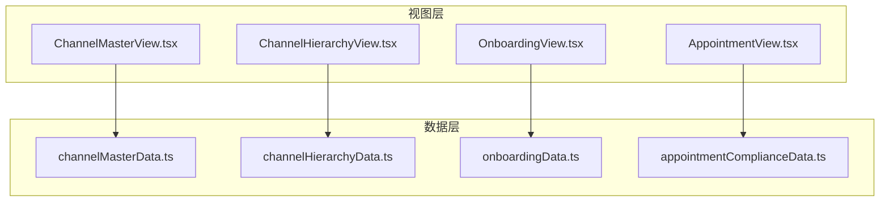
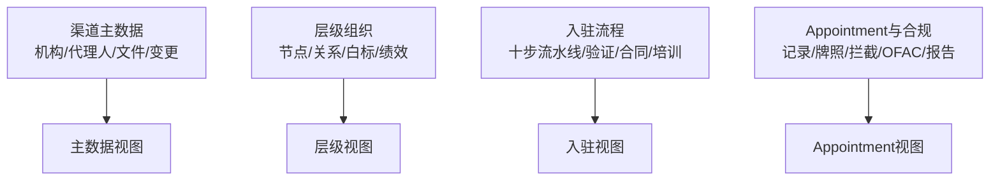
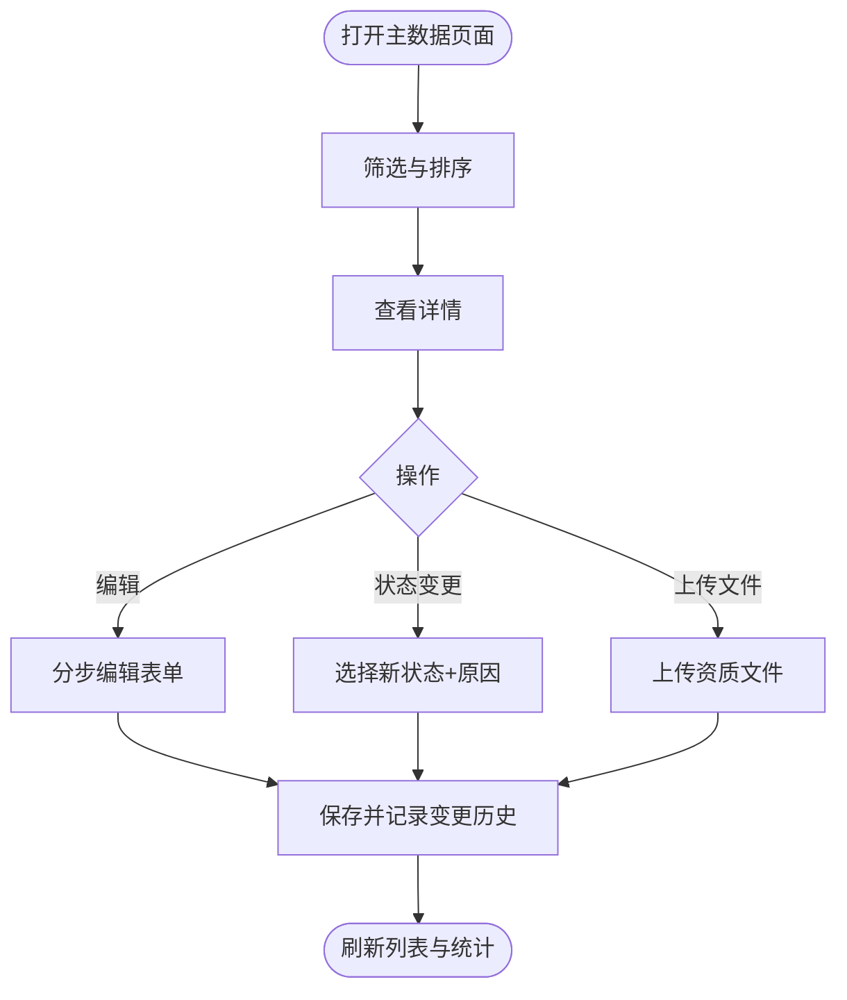
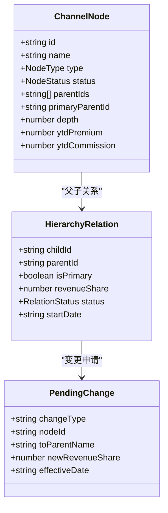
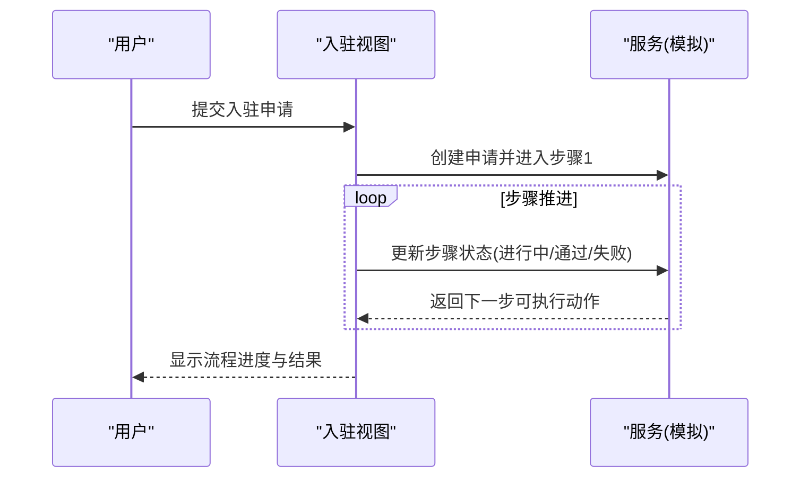
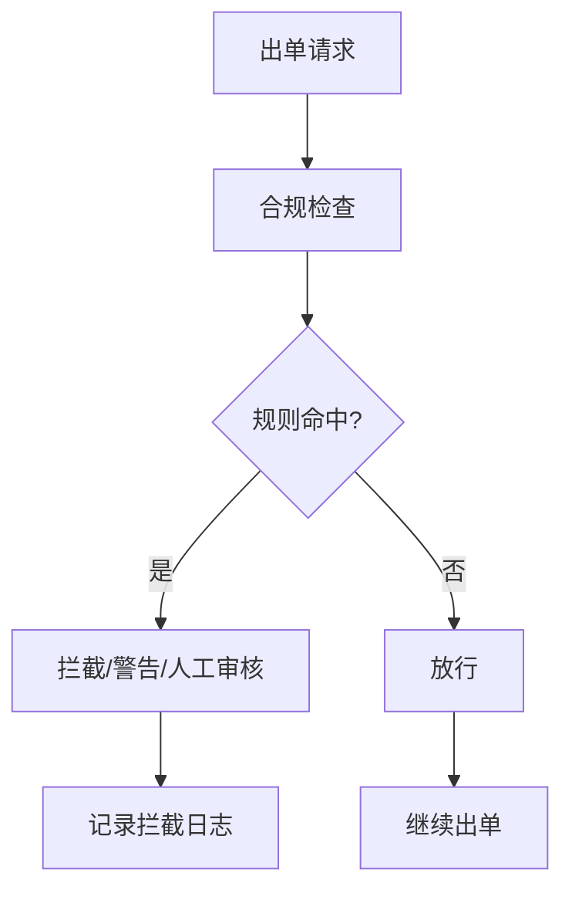
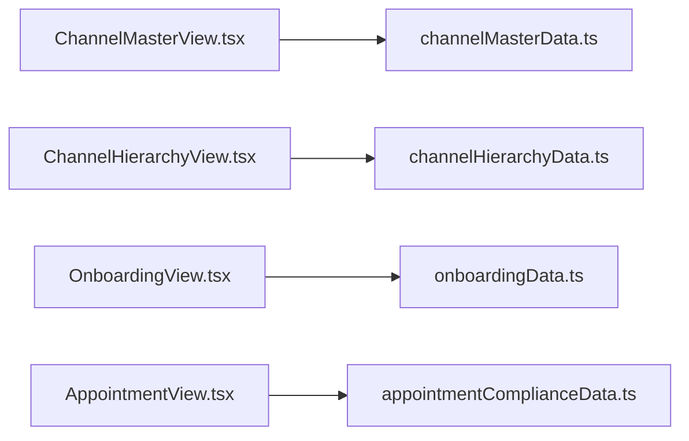

# 渠道管理模块

<cite>
**本文引用的文件**
- [channelMasterData.ts](file://产品方案/UI-V1.0/src/data/channelMasterData.ts)
- [channelHierarchyData.ts](file://产品方案/UI-V1.0/src/data/channelHierarchyData.ts)
- [onboardingData.ts](file://产品方案/UI-V1.0/src/data/onboardingData.ts)
- [appointmentComplianceData.ts](file://产品方案/UI-V1.0/src/data/appointmentComplianceData.ts)
- [ChannelMasterView.tsx](file://产品方案/UI-V1.0/src/views/ChannelMasterView.tsx)
- [ChannelHierarchyView.tsx](file://产品方案/UI-V1.0/src/views/ChannelHierarchyView.tsx)
- [OnboardingView.tsx](file://产品方案/UI-V1.0/src/views/OnboardingView.tsx)
- [AppointmentView.tsx](file://产品方案/UI-V1.0/src/views/AppointmentView.tsx)
</cite>

## 目录
1. [简介](#简介)
2. [项目结构](#项目结构)
3. [核心组件](#核心组件)
4. [架构总览](#架构总览)
5. [详细组件分析](#详细组件分析)
6. [依赖关系分析](#依赖关系分析)
7. [性能考虑](#性能考虑)
8. [故障排查指南](#故障排查指南)
9. [结论](#结论)
10. [附录](#附录)

## 简介
本模块面向OverInsurData平台的渠道管理，覆盖四大核心能力：
- 渠道主数据管理：机构与代理人主数据、资质文件、变更历史与导入模板。
- 渠道层级组织架构：平台-大区-机构-分支-代理的多级树形组织，支持多上级与收入分成。
- 渠道入驻申请审批流程：从在线申请到最终审批的十步流水线，包含资料审核、NIPR验证、背景调查、E&O验证、合同签署、Appointment、账号开通、培训认证等。
- Appointment合规管理：Appointment生命周期、牌照管理、出单合规拦截规则、OFAC筛查与合规报告。

文档以“数据结构 + 界面视图”的方式，说明状态管理、权限控制与工作流处理的关键实现思路，并配套流程图帮助开发者理解复杂业务场景。

## 项目结构
渠道管理模块由数据定义与视图页面组成：
- 数据层（data）：集中定义类型、枚举、示例数据与工具函数，如渠道主数据、层级节点、入驻流程、Appointment与合规数据。
- 视图层（views）：对应功能页面的React组件，负责交互、筛选、表单与流程展示。

图表来源
- [channelMasterData.ts:1-449](file://产品方案/UI-V1.0/src/data/channelMasterData.ts#L1-L449)
- [channelHierarchyData.ts:1-261](file://产品方案/UI-V1.0/src/data/channelHierarchyData.ts#L1-L261)
- [onboardingData.ts:1-528](file://产品方案/UI-V1.0/src/data/onboardingData.ts#L1-L528)
- [appointmentComplianceData.ts:1-200](file://产品方案/UI-V1.0/src/data/appointmentComplianceData.ts#L1-L200)
- [ChannelMasterView.tsx:1-800](file://产品方案/UI-V1.0/src/views/ChannelMasterView.tsx#L1-L800)
- [ChannelHierarchyView.tsx:1-800](file://产品方案/UI-V1.0/src/views/ChannelHierarchyView.tsx#L1-L800)
- [OnboardingView.tsx:1-800](file://产品方案/UI-V1.0/src/views/OnboardingView.tsx#L1-L800)
- [AppointmentView.tsx:1-800](file://产品方案/UI-V1.0/src/views/AppointmentView.tsx#L1-L800)

章节来源
- [channelMasterData.ts:1-449](file://产品方案/UI-V1.0/src/data/channelMasterData.ts#L1-L449)
- [channelHierarchyData.ts:1-261](file://产品方案/UI-V1.0/src/data/channelHierarchyData.ts#L1-L261)
- [onboardingData.ts:1-528](file://产品方案/UI-V1.0/src/data/onboardingData.ts#L1-L528)
- [appointmentComplianceData.ts:1-200](file://产品方案/UI-V1.0/src/data/appointmentComplianceData.ts#L1-L200)
- [ChannelMasterView.tsx:1-800](file://产品方案/UI-V1.0/src/views/ChannelMasterView.tsx#L1-L800)
- [ChannelHierarchyView.tsx:1-800](file://产品方案/UI-V1.0/src/views/ChannelHierarchyView.tsx#L1-L800)
- [OnboardingView.tsx:1-800](file://产品方案/UI-V1.0/src/views/OnboardingView.tsx#L1-L800)
- [AppointmentView.tsx:1-800](file://产品方案/UI-V1.0/src/views/AppointmentView.tsx#L1-L800)

## 核心组件
- 渠道主数据：机构、代理人、资质文件、变更历史与导入结果统计。
- 渠道层级组织：节点树、父子关系、待审批变更、白标配置与团队绩效汇总。
- 入驻流程：十步流水线、资料审核、NIPR/背景/E&O验证、电子合同、培训与账号开通。
- Appointment与合规：Appointment记录、NIPR牌照、合规拦截日志、规则配置、OFAC筛查与合规报告。

章节来源
- [channelMasterData.ts:1-449](file://产品方案/UI-V1.0/src/data/channelMasterData.ts#L1-L449)
- [channelHierarchyData.ts:1-261](file://产品方案/UI-V1.0/src/data/channelHierarchyData.ts#L1-L261)
- [onboardingData.ts:1-528](file://产品方案/UI-V1.0/src/data/onboardingData.ts#L1-L528)
- [appointmentComplianceData.ts:1-200](file://产品方案/UI-V1.0/src/data/appointmentComplianceData.ts#L1-L200)

## 架构总览
渠道管理模块采用“数据模型 + 视图组件”的分层设计。数据层提供强类型结构与示例数据；视图层通过筛选、排序、弹窗与向导完成业务流程操作。关键交互包括：
- 主数据维护：列表筛选、详情抽屉、编辑表单、状态变更、文件上传。
- 层级管理：树形展开、多上级配置、关系新增/调整/终止、待审批工作流。
- 入驻流程：步骤进度条、资料审核、合规验证、合同签署、培训与账号开通。
- Appointment与合规：申请向导、状态跟踪、续期与终止、牌照管理、拦截日志与规则配置、OFAC筛查与报告生成。

图表来源
- [channelMasterData.ts:1-449](file://产品方案/UI-V1.0/src/data/channelMasterData.ts#L1-L449)
- [channelHierarchyData.ts:1-261](file://产品方案/UI-V1.0/src/data/channelHierarchyData.ts#L1-L261)
- [onboardingData.ts:1-528](file://产品方案/UI-V1.0/src/data/onboardingData.ts#L1-L528)
- [appointmentComplianceData.ts:1-200](file://产品方案/UI-V1.0/src/data/appointmentComplianceData.ts#L1-L200)
- [ChannelMasterView.tsx:1-800](file://产品方案/UI-V1.0/src/views/ChannelMasterView.tsx#L1-L800)
- [ChannelHierarchyView.tsx:1-800](file://产品方案/UI-V1.0/src/views/ChannelHierarchyView.tsx#L1-L800)
- [OnboardingView.tsx:1-800](file://产品方案/UI-V1.0/src/views/OnboardingView.tsx#L1-L800)
- [AppointmentView.tsx:1-800](file://产品方案/UI-V1.0/src/views/AppointmentView.tsx#L1-L800)

## 详细组件分析

### 渠道主数据管理
- 数据结构
  - 机构：包含标识、类型、状态、执照州域、地址、负责人、业绩指标、标签等。
  - 代理人：个人基本信息、执照州域、所属机构、角色、业绩指标等。
  - 资质文件：分类、有效期、审核状态、版本等。
  - 变更历史：实体、变更类型、字段、新旧值、操作人、时间戳等。
  - 导入结果：总数、成功、失败、跳过与错误明细。
- 界面能力
  - 列表筛选与排序（按保费、赔付率、续保率等）。
  - 详情抽屉：基本信息、联系人、授权州、上级机构、代理人列表、资质文件。
  - 编辑表单：分步填写基本信息、联系方式、资质州域与标签。
  - 状态变更：选择新状态与原因，暂停时提示权限冻结。
- 关键逻辑
  - 状态样式映射：机构/代理人/文件状态均有统一样式表。
  - 聚合统计：活跃机构数、暂停机构数、待审批代理人、即将到期/缺失文件数量。

图表来源
- [ChannelMasterView.tsx:246-688](file://产品方案/UI-V1.0/src/views/ChannelMasterView.tsx#L246-L688)
- [channelMasterData.ts:11-417](file://产品方案/UI-V1.0/src/data/channelMasterData.ts#L11-L417)

章节来源
- [channelMasterData.ts:11-417](file://产品方案/UI-V1.0/src/data/channelMasterData.ts#L11-L417)
- [ChannelMasterView.tsx:246-688](file://产品方案/UI-V1.0/src/views/ChannelMasterView.tsx#L246-L688)

### 渠道层级组织架构管理
- 数据结构
  - 节点：平台/大区/机构/分支/代理，支持多上级、主上级、深度、业绩指标、佣金覆盖比例等。
  - 关系：子节点、父节点、是否主上级、收入分配比例、生效日期、变更历史。
  - 待审批变更：新增/调整/终止关系，含申请人、生效日、原因。
  - 白标配置：品牌名、域名、功能开关、特性清单。
  - 团队绩效：成员数、目标达成率、佣金、续保率、赔付率、Top代理人等。
- 界面能力
  - 树形组织：搜索、类型过滤、展开/折叠、多上级标记。
  - 关系管理：新增层级、调整上级、终止关系，预览与提交。
  - 多上级配置：编辑各上级分配比例，校验合计为100%。
  - 白标管理：品牌色、域名、功能开关、特性配置。
- 关键逻辑
  - 构建子节点映射：用于渲染树与下级列表。
  - 主上级决定合规归属、产品授权与佣金合同版本；次上级仅享有收入分配权。
  - 待审批工作流：支持批准/拒绝，记录生效日期与原因。

图表来源
- [channelHierarchyData.ts:7-151](file://产品方案/UI-V1.0/src/data/channelHierarchyData.ts#L7-L151)
- [channelHierarchyData.ts:247-261](file://产品方案/UI-V1.0/src/data/channelHierarchyData.ts#L247-L261)

章节来源
- [channelHierarchyData.ts:7-151](file://产品方案/UI-V1.0/src/data/channelHierarchyData.ts#L7-L151)
- [channelHierarchyData.ts:247-261](file://产品方案/UI-V1.0/src/data/channelHierarchyData.ts#L247-L261)
- [ChannelHierarchyView.tsx:99-530](file://产品方案/UI-V1.0/src/views/ChannelHierarchyView.tsx#L99-L530)

### 渠道入驻申请审批流程
- 数据结构
  - 申请：申请人信息、渠道类型、状态、当前步骤、步骤集合、驳回原因、补充截止日期。
  - 步骤：名称、状态（进行中/通过/失败/豁免/等待）、完成日期、备注、需行动项。
  - 资料审核：文件类型、上传日期、文件大小、审核结果、备注、有效期。
  - NIPR验证：NPN、州、执照号、签发/到期、状态、授权险种。
  - 背景调查：服务商、下单/完成日期、状态、风险标志。
  - E&O保险：承保公司、保单号、保额、有效期、验证结果。
  - 电子合同：合同类型、模板版本、发送/签署状态、签署平台。
  - 培训认证：模块、是否必修、时长、状态、分数、完成日期。
  - 账号开通：用户名、邮箱、角色、权限、激活状态。
- 界面能力
  - 申请总览：KPI、筛选、搜索、新增申请向导。
  - 流程进度：可视化步骤条与详细步骤面板。
  - 资料审核：逐项审核、通过/退回、补充上传。
  - 合规验证：NIPR实时查询、背景调查状态、E&O证书核验。
  - 合同签署：发送、查看、签署状态跟踪。
- 关键逻辑
  - 十步流水线：在线申请→资料审核→NIPR验证→背景调查→E&O验证→合同签署→Appointment→账号开通→培训认证→最终审批。
  - 状态驱动：不同状态触发不同操作按钮与提示信息。
  - 补充材料：设置截止日期，逾期关闭申请。

图表来源
- [onboardingData.ts:154-165](file://产品方案/UI-V1.0/src/data/onboardingData.ts#L154-L165)
- [OnboardingView.tsx:38-88](file://产品方案/UI-V1.0/src/views/OnboardingView.tsx#L38-L88)

章节来源
- [onboardingData.ts:11-151](file://产品方案/UI-V1.0/src/data/onboardingData.ts#L11-L151)
- [onboardingData.ts:154-165](file://产品方案/UI-V1.0/src/data/onboardingData.ts#L154-L165)
- [OnboardingView.tsx:123-418](file://产品方案/UI-V1.0/src/views/OnboardingView.tsx#L123-L418)

### Appointment合规管理
- 数据结构
  - Appointment记录：渠道、保险公司、州、业务线、状态、提交/批准/到期日、处理天数、NIPR交易ID、续期状态。
  - NIPR牌照：渠道、NPN、牌照号、州、类型、业务线、状态、到期日、CE学时。
  - 合规拦截日志：时间、渠道、保险公司、州、业务线、保单草稿、客户、保费、结果、原因描述、人工审核标记。
  - 合规规则：类别、条件、动作（拦截/警告/人工审核）、优先级、触发次数。
  - OFAC筛查：实体名称、类型、结果、匹配分数、名单、人工复核。
  - 合规报告：类型、周期、生成时间、格式、接收人。
- 界面能力
  - 申请向导：选择渠道、保险公司、州与业务线，确认提交。
  - 状态跟踪：处理中列表、事件流时间轴。
  - 续期与终止：待续期提醒、发起续期、申请终止。
  - 牌照管理：批量NIPR验证、过期与差异预警、CE学时进度。
  - 拦截日志与规则：查看拦截原因、人工审核、规则启用/禁用。
  - 合规报告：生成与下载。
- 关键逻辑
  - 规则引擎：基于Appointment有效性、牌照有效性、OFAC匹配、渠道状态等条件进行拦截或警告。
  - 续期管理：根据到期日计算紧急程度，支持一键发起续期。
  - 终止管理：不可逆操作，需选择原因并通过NIPR上报。

图表来源
- [appointmentComplianceData.ts:116-137](file://产品方案/UI-V1.0/src/data/appointmentComplianceData.ts#L116-L137)
- [appointmentComplianceData.ts:84-112](file://产品方案/UI-V1.0/src/data/appointmentComplianceData.ts#L84-L112)
- [AppointmentView.tsx:681-789](file://产品方案/UI-V1.0/src/views/AppointmentView.tsx#L681-L789)

章节来源
- [appointmentComplianceData.ts:3-40](file://产品方案/UI-V1.0/src/data/appointmentComplianceData.ts#L3-L40)
- [appointmentComplianceData.ts:46-77](file://产品方案/UI-V1.0/src/data/appointmentComplianceData.ts#L46-L77)
- [appointmentComplianceData.ts:84-112](file://产品方案/UI-V1.0/src/data/appointmentComplianceData.ts#L84-L112)
- [appointmentComplianceData.ts:116-137](file://产品方案/UI-V1.0/src/data/appointmentComplianceData.ts#L116-L137)
- [appointmentComplianceData.ts:143-168](file://产品方案/UI-V1.0/src/data/appointmentComplianceData.ts#L143-L168)
- [appointmentComplianceData.ts:172-193](file://产品方案/UI-V1.0/src/data/appointmentComplianceData.ts#L172-L193)
- [AppointmentView.tsx:73-210](file://产品方案/UI-V1.0/src/views/AppointmentView.tsx#L73-L210)
- [AppointmentView.tsx:212-318](file://产品方案/UI-V1.0/src/views/AppointmentView.tsx#L212-L318)
- [AppointmentView.tsx:322-399](file://产品方案/UI-V1.0/src/views/AppointmentView.tsx#L322-L399)
- [AppointmentView.tsx:403-539](file://产品方案/UI-V1.0/src/views/AppointmentView.tsx#L403-L539)
- [AppointmentView.tsx:543-677](file://产品方案/UI-V1.0/src/views/AppointmentView.tsx#L543-L677)
- [AppointmentView.tsx:681-789](file://产品方案/UI-V1.0/src/views/AppointmentView.tsx#L681-L789)

## 依赖关系分析
- 视图对数据的依赖
  - ChannelMasterView.tsx 依赖 channelMasterData.ts 的类型与示例数据。
  - ChannelHierarchyView.tsx 依赖 channelHierarchyData.ts 的节点、关系、待审批变更与工具函数。
  - OnboardingView.tsx 依赖 onboardingData.ts 的流程步骤、状态映射与示例数据。
  - AppointmentView.tsx 依赖 appointmentComplianceData.ts 的记录、规则、拦截日志与报告。
- 内部耦合
  - 视图通过本地状态管理交互流程（筛选、排序、弹窗、向导），不直接修改数据源，便于扩展为真实后端集成。
  - 数据层提供统一的样式与标签映射，保证UI一致性。

图表来源
- [ChannelMasterView.tsx:1-800](file://产品方案/UI-V1.0/src/views/ChannelMasterView.tsx#L1-L800)
- [ChannelHierarchyView.tsx:1-800](file://产品方案/UI-V1.0/src/views/ChannelHierarchyView.tsx#L1-L800)
- [OnboardingView.tsx:1-800](file://产品方案/UI-V1.0/src/views/OnboardingView.tsx#L1-L800)
- [AppointmentView.tsx:1-800](file://产品方案/UI-V1.0/src/views/AppointmentView.tsx#L1-L800)
- [channelMasterData.ts:1-449](file://产品方案/UI-V1.0/src/data/channelMasterData.ts#L1-L449)
- [channelHierarchyData.ts:1-261](file://产品方案/UI-V1.0/src/data/channelHierarchyData.ts#L1-L261)
- [onboardingData.ts:1-528](file://产品方案/UI-V1.0/src/data/onboardingData.ts#L1-L528)
- [appointmentComplianceData.ts:1-200](file://产品方案/UI-V1.0/src/data/appointmentComplianceData.ts#L1-L200)

章节来源
- [ChannelMasterView.tsx:1-800](file://产品方案/UI-V1.0/src/views/ChannelMasterView.tsx#L1-L800)
- [ChannelHierarchyView.tsx:1-800](file://产品方案/UI-V1.0/src/views/ChannelHierarchyView.tsx#L1-L800)
- [OnboardingView.tsx:1-800](file://产品方案/UI-V1.0/src/views/OnboardingView.tsx#L1-L800)
- [AppointmentView.tsx:1-800](file://产品方案/UI-V1.0/src/views/AppointmentView.tsx#L1-L800)

## 性能考虑
- 前端渲染
  - 使用树形组件按需展开，减少初始渲染节点数量。
  - 列表页支持筛选与排序，避免全量重绘。
- 数据规模
  - 示例数据较小，实际接入后端时应分页加载与增量更新。
- 交互体验
  - 表单与向导使用分步模式，降低认知负担。
  - 状态变更与提交增加加载态与反馈，提升可用性。

## 故障排查指南
- 主数据问题
  - 状态异常：检查状态样式映射与变更历史，确认操作人与原因。
  - 文件过期或缺失：关注资质文件状态与到期日，及时续期或补充。
- 层级组织问题
  - 多上级分配不平衡：确保各上级收入分配合计为100%，必要时调整。
  - 待审批变更未生效：检查生效日期与审批状态。
- 入驻流程问题
  - 步骤卡住：查看步骤状态与需行动项，补充材料或重新验证。
  - 背景调查失败：根据风险标志与处置建议进行处理。
- Appointment与合规问题
  - 出单被拦截：查看拦截日志与原因描述，依据规则进行人工审核或整改。
  - 牌照过期或差异：批量NIPR验证并更新数据，确保CE学时达标。
  - OFAC疑似匹配：人工复核后决定是否放行或拒绝。

章节来源
- [channelMasterData.ts:330-417](file://产品方案/UI-V1.0/src/data/channelMasterData.ts#L330-L417)
- [channelHierarchyData.ts:126-151](file://产品方案/UI-V1.0/src/data/channelHierarchyData.ts#L126-L151)
- [onboardingData.ts:330-528](file://产品方案/UI-V1.0/src/data/onboardingData.ts#L330-L528)
- [appointmentComplianceData.ts:84-137](file://产品方案/UI-V1.0/src/data/appointmentComplianceData.ts#L84-L137)
- [appointmentComplianceData.ts:143-193](file://产品方案/UI-V1.0/src/data/appointmentComplianceData.ts#L143-L193)

## 结论
本模块通过清晰的数据结构与直观的界面交互，实现了渠道主数据、层级组织、入驻流程与Appointment合规管理的闭环。借助状态驱动的工作流与规则引擎，系统能够有效管控渠道准入与出单合规风险。后续可扩展为真实后端集成，增强数据持久化、权限控制与审计能力。

## 附录
- 术语说明
  - 主上级：决定合规归属、产品授权与佣金合同版本的上级节点。
  - 次上级：仅享有收入分配权的上级节点。
  - Appointment：渠道在特定州与业务线对保险公司的销售授权。
  - NIPR：国家保险生产者注册局，用于牌照与Appointment验证。
  - OFAC：美国海外资产控制办公室，用于制裁名单筛查。