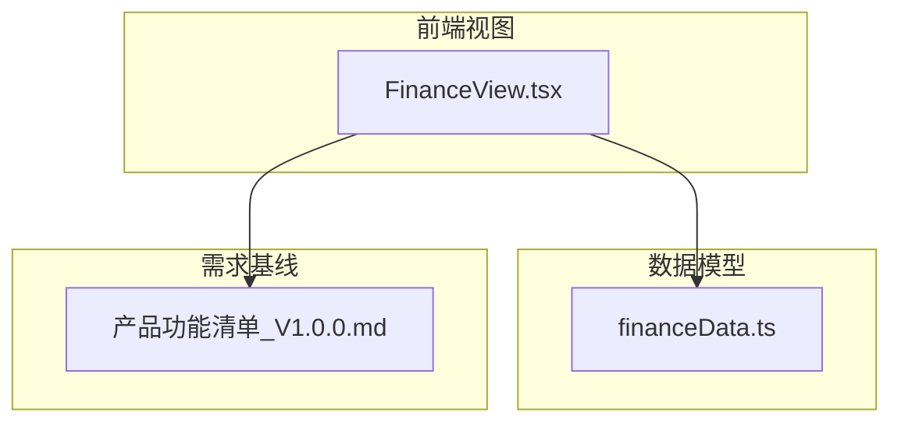
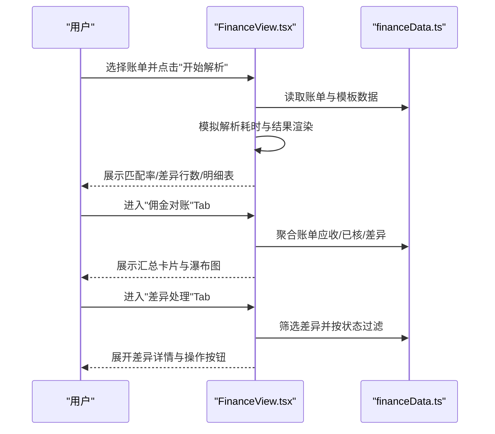
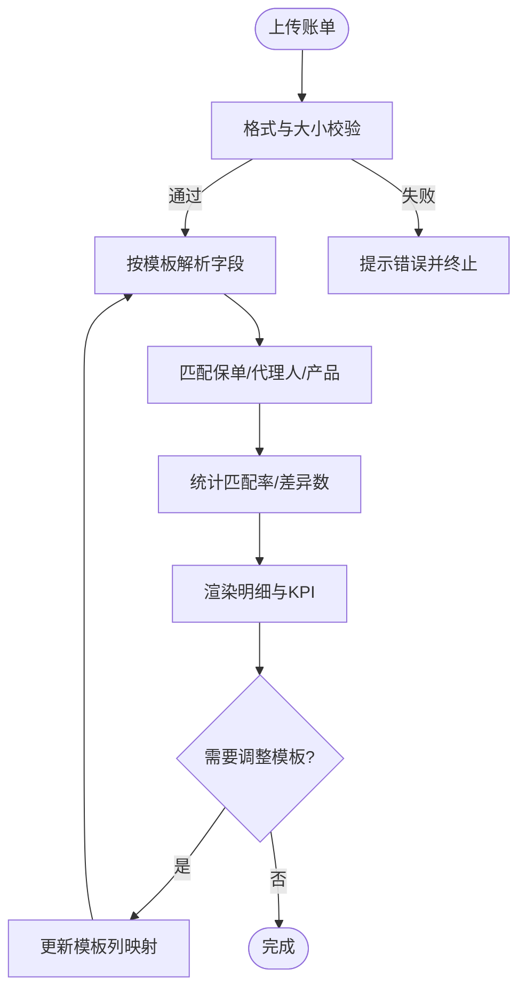
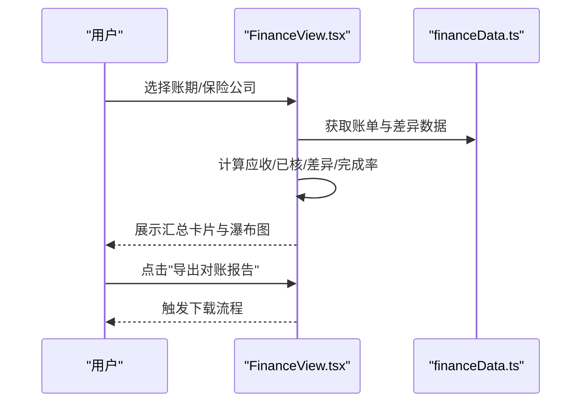
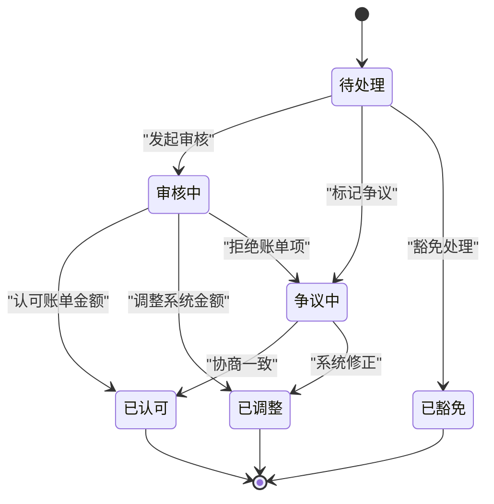
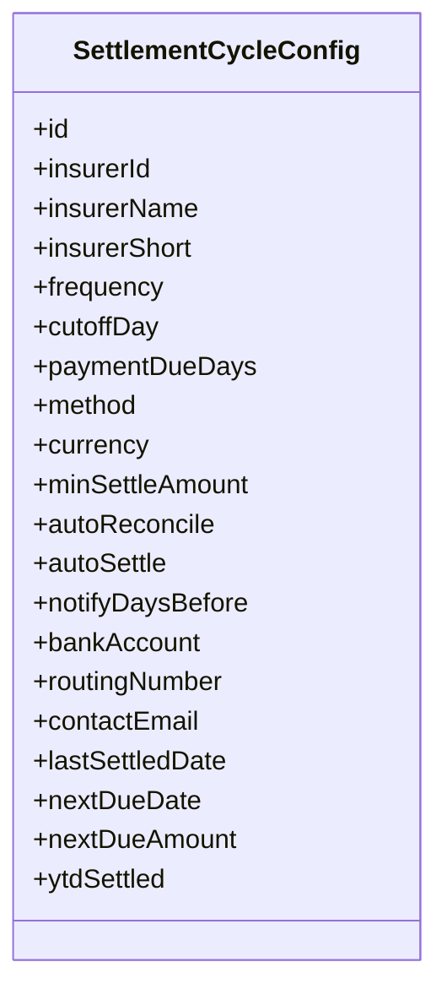
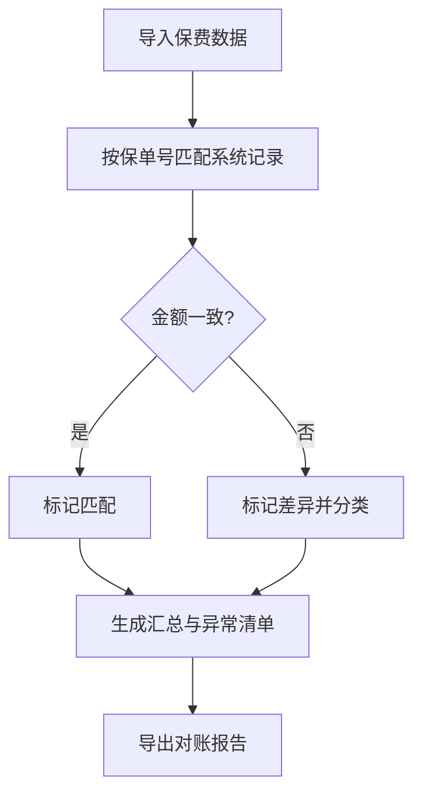
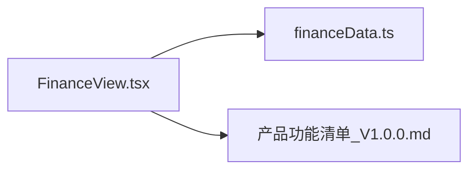

# 财务与结算管理

<cite>
**本文引用的文件**
- [financeData.ts](file://产品方案/UI-V1.0/src/data/financeData.ts)
- [FinanceView.tsx](file://产品方案/UI-V1.0/src/views/FinanceView.tsx)
- [产品功能清单_V1.0.0.md](file://产品需求/产品功能清单_V1.0.0.md)
</cite>

## 目录
1. [简介](#简介)
2. [项目结构](#项目结构)
3. [核心组件](#核心组件)
4. [架构总览](#架构总览)
5. [详细组件分析](#详细组件分析)
6. [依赖关系分析](#依赖关系分析)
7. [性能考虑](#性能考虑)
8. [故障排查指南](#故障排查指南)
9. [结论](#结论)
10. [附录](#附录)

## 简介
本模块面向OverInsurData平台的“保险公司财务与结算管理”，覆盖佣金账单导入与解析、对账与差异处理、结算周期配置、保费对账及结算历史等关键能力。文档聚焦以下目标：
- 佣金计算逻辑与结算规则配置
- 账单审核流程与状态流转
- 对账差异识别、分类与处理闭环
- 报表导出与可视化分析
- 错误处理与最佳实践，适配保险行业财务合规要求

## 项目结构
财务与结算相关的前端实现集中在UI层的数据模型与视图组件中：
- 数据模型与示例数据：financeData.ts（定义账单、明细、对账差异、结算周期、保费对账、模板、结算历史等类型与常量）
- 视图与交互：FinanceView.tsx（多Tab页面：账单导入、解析、对账、差异处理、结算周期配置、保费对账）
- 业务需求基线：产品功能清单_V1.0.0.md（明确各功能点、字段、流程与边界）

图表来源
- [FinanceView.tsx:1-15](file://产品方案/UI-V1.0/src/views/FinanceView.tsx#L1-L15)
- [financeData.ts:1-273](file://产品方案/UI-V1.0/src/data/financeData.ts#L1-L273)

章节来源
- [FinanceView.tsx:1-15](file://产品方案/UI-V1.0/src/views/FinanceView.tsx#L1-L15)
- [financeData.ts:1-273](file://产品方案/UI-V1.0/src/data/financeData.ts#L1-L273)
- [产品功能清单_V1.0.0.md:703-806](file://产品需求/产品功能清单_V1.0.0.md#L703-L806)

## 核心组件
- 佣金账单导入与解析：支持CSV/Excel/PDF/EDI上传与自动解析，匹配保单、代理人、产品，输出匹配率与异常统计
- 佣金对账：按账期与保险公司维度汇总应收、已核、差异金额与差异条数，提供瀑布图与导出
- 差异处理：差异分类（费率/金额/缺失/重复/我方有账单无），状态机驱动（待处理/审核中/争议/认可/调整/豁免），可批量操作与备注留痕
- 结算周期配置：按保险公司配置频率、截止日、付款宽限期、支付方式、最低结算额、通知天数、银行账户等；展示下次到期与本年累计
- 保费对账：对比系统应收保费与保险公司实收，标记差异类型（未收到/多缴/费率错误/退保调整/批单调整），生成汇总与异常清单
- 结算历史：记录每笔结算的日期、金额、方式、参考号、状态与确认人

章节来源
- [financeData.ts:5-36](file://产品方案/UI-V1.0/src/data/financeData.ts#L5-L36)
- [financeData.ts:42-72](file://产品方案/UI-V1.0/src/data/financeData.ts#L42-L72)
- [financeData.ts:76-105](file://产品方案/UI-V1.0/src/data/financeData.ts#L76-L105)
- [financeData.ts:109-142](file://产品方案/UI-V1.0/src/data/financeData.ts#L109-L142)
- [financeData.ts:146-196](file://产品方案/UI-V1.0/src/data/financeData.ts#L146-L196)
- [financeData.ts:227-246](file://产品方案/UI-V1.0/src/data/financeData.ts#L227-L246)
- [FinanceView.tsx:43-179](file://产品方案/UI-V1.0/src/views/FinanceView.tsx#L43-L179)
- [FinanceView.tsx:182-332](file://产品方案/UI-V1.0/src/views/FinanceView.tsx#L182-L332)
- [FinanceView.tsx:334-452](file://产品方案/UI-V1.0/src/views/FinanceView.tsx#L334-L452)
- [FinanceView.tsx:454-578](file://产品方案/UI-V1.0/src/views/FinanceView.tsx#L454-L578)
- [FinanceView.tsx:580-734](file://产品方案/UI-V1.0/src/views/FinanceView.tsx#L580-L734)
- [FinanceView.tsx:736-800](file://产品方案/UI-V1.0/src/views/FinanceView.tsx#L736-L800)

## 架构总览
财务与结算模块采用“数据模型 + 视图组件”的分层组织：
- 数据层：financeData.ts集中定义所有实体类型、枚举、标签映射与示例数据，便于前后端契约统一与Mock演示
- 视图层：FinanceView.tsx以多Tab形式承载业务流程，通过本地状态驱动上传、解析、对账、差异处理、配置编辑与历史查看
- 需求对齐：产品功能清单明确了各功能的输入输出、校验规则、审批节点与审计要求

图表来源
- [FinanceView.tsx:182-332](file://产品方案/UI-V1.0/src/views/FinanceView.tsx#L182-L332)
- [FinanceView.tsx:334-452](file://产品方案/UI-V1.0/src/views/FinanceView.tsx#L334-L452)
- [FinanceView.tsx:454-578](file://产品方案/UI-V1.0/src/views/FinanceView.tsx#L454-L578)
- [financeData.ts:1-273](file://产品方案/UI-V1.0/src/data/financeData.ts#L1-L273)

## 详细组件分析

### 佣金账单导入与解析
- 功能要点
  - 支持拖拽/选择上传CSV/Excel/PDF/EDI，显示文件大小与格式限制
  - 解析后展示：解析行数、匹配成功数、差异数、匹配率
  - 明细表包含：保单号、被保人、州、生效日、保费、费率、佣金(账单)、佣金(系统)、差额、匹配状态
  - 模板信息：列映射、标题行、使用次数、成功率
- 关键数据结构
  - 账单主记录：文件名、保险公司、账期、导入时间、格式、状态、保单数、保费、佣金、解析/匹配/异常计数、差异金额、结算日期
  - 账单明细：行号、保单号、渠道、州、险种、生效日、保费、费率、佣金、匹配状态、差额与备注
  - 解析模板：保险公司、模板名、文件格式、列映射、标题行、最近使用、使用次数、成功率
- 交互流程
  - 上传→预检→解析→展示结果→可编辑模板→重新解析
  - 支持按状态筛选与搜索文件名/保险公司

图表来源
- [FinanceView.tsx:43-179](file://产品方案/UI-V1.0/src/views/FinanceView.tsx#L43-L179)
- [FinanceView.tsx:182-332](file://产品方案/UI-V1.0/src/views/FinanceView.tsx#L182-L332)
- [financeData.ts:5-36](file://产品方案/UI-V1.0/src/data/financeData.ts#L5-L36)
- [financeData.ts:42-72](file://产品方案/UI-V1.0/src/data/financeData.ts#L42-L72)
- [financeData.ts:200-223](file://产品方案/UI-V1.0/src/data/financeData.ts#L200-L223)

章节来源
- [FinanceView.tsx:43-179](file://产品方案/UI-V1.0/src/views/FinanceView.tsx#L43-L179)
- [FinanceView.tsx:182-332](file://产品方案/UI-V1.0/src/views/FinanceView.tsx#L182-L332)
- [financeData.ts:5-36](file://产品方案/UI-V1.0/src/data/financeData.ts#L5-L36)
- [financeData.ts:42-72](file://产品方案/UI-V1.0/src/data/financeData.ts#L42-L72)
- [financeData.ts:200-223](file://产品方案/UI-V1.0/src/data/financeData.ts#L200-L223)

### 佣金对账
- 功能要点
  - 按账期与保险公司筛选，展示账单应收佣金、系统核实佣金、差异金额、差异条数、对账完成率
  - 提供“批量对账”与“导出对账报告”入口
  - 瀑布图直观呈现：账单应收→匹配确认→差异未结
- 数据聚合
  - 汇总指标来源于账单列表的状态与数值字段
  - 差异项来自对账差异记录集合

图表来源
- [FinanceView.tsx:334-452](file://产品方案/UI-V1.0/src/views/FinanceView.tsx#L334-L452)
- [financeData.ts:5-36](file://产品方案/UI-V1.0/src/data/financeData.ts#L5-L36)
- [financeData.ts:76-105](file://产品方案/UI-V1.0/src/data/financeData.ts#L76-L105)

章节来源
- [FinanceView.tsx:334-452](file://产品方案/UI-V1.0/src/views/FinanceView.tsx#L334-L452)
- [financeData.ts:5-36](file://产品方案/UI-V1.0/src/data/financeData.ts#L5-L36)
- [financeData.ts:76-105](file://产品方案/UI-V1.0/src/data/financeData.ts#L76-L105)

### 差异处理
- 功能要点
  - 差异类型：费率差异、金额差异、账单有我方无、重复行、我方有账单无
  - 状态机：待处理→审核中→认可/调整/拒绝→豁免或结案
  - 支持按状态筛选、展开详情、添加备注、批量操作
- 业务规则
  - 小额差异可按政策豁免
  - 争议项需与保险公司沟通并跟踪处理进度
  - 调整项需记录调整原因与生效账期

图表来源
- [financeData.ts:76-105](file://产品方案/UI-V1.0/src/data/financeData.ts#L76-L105)
- [FinanceView.tsx:454-578](file://产品方案/UI-V1.0/src/views/FinanceView.tsx#L454-L578)

章节来源
- [financeData.ts:76-105](file://产品方案/UI-V1.0/src/data/financeData.ts#L76-L105)
- [FinanceView.tsx:454-578](file://产品方案/UI-V1.0/src/views/FinanceView.tsx#L454-L578)

### 结算周期配置
- 功能要点
  - 为每家保险公司配置：结算频率、截止日、付款宽限期、支付方式、最低结算额、提前通知天数、银行账户、联系邮箱
  - 展示下次结算日期与应结金额、本年累计已结算
  - 支持启用自动对账与自动结算开关
- 数据模型
  - 结算周期配置对象包含频率、截止日、付款期限、方法、货币、最低金额、自动对账/结算、通知天数、银行信息、联系人、上次结算日、下次到期日、YTD结算额

图表来源
- [financeData.ts:109-142](file://产品方案/UI-V1.0/src/data/financeData.ts#L109-L142)

章节来源
- [financeData.ts:109-142](file://产品方案/UI-V1.0/src/data/financeData.ts#L109-L142)
- [FinanceView.tsx:580-734](file://产品方案/UI-V1.0/src/views/FinanceView.tsx#L580-L734)

### 保费对账
- 功能要点
  - 对比系统应收保费与保险公司实收，标记差异类型（未收到/多缴/费率错误/退保调整/批单调整）
  - 按保险公司维度汇总：保单数、应收、实收、差异、匹配率、异常条数
  - 支持导出对账结果与查询历史
- 数据模型
  - 保费对账记录：账期、保险公司、保单号、被保人、渠道、州、应收保费、实收保费、差异、差异类型、状态、备注、到期日
  - 保费汇总：保险公司、账期、保单数、应收总额、实收总额、差异总额、匹配率、异常数

图表来源
- [financeData.ts:146-196](file://产品方案/UI-V1.0/src/data/financeData.ts#L146-L196)
- [FinanceView.tsx:736-800](file://产品方案/UI-V1.0/src/views/FinanceView.tsx#L736-L800)

章节来源
- [financeData.ts:146-196](file://产品方案/UI-V1.0/src/data/financeData.ts#L146-L196)
- [FinanceView.tsx:736-800](file://产品方案/UI-V1.0/src/views/FinanceView.tsx#L736-L800)

### 结算历史
- 功能要点
  - 记录每次结算的保险公司、账期、结算日期、金额、方式、参考编号、状态、确认人
  - 支持查看已完成/待结算/失败/冲销状态
- 数据模型
  - 结算记录对象包含上述字段，用于审计与追踪

章节来源
- [financeData.ts:227-246](file://产品方案/UI-V1.0/src/data/financeData.ts#L227-L246)
- [FinanceView.tsx:700-734](file://产品方案/UI-V1.0/src/views/FinanceView.tsx#L700-L734)

## 依赖关系分析
- FinanceView.tsx依赖financeData.ts提供的数据类型、示例数据与标签映射
- 视图通过本地状态驱动上传、解析、对账、差异处理、配置编辑与历史查看
- 需求文档定义了功能范围与流程约束，指导界面与交互设计

图表来源
- [FinanceView.tsx:1-15](file://产品方案/UI-V1.0/src/views/FinanceView.tsx#L1-L15)
- [financeData.ts:1-273](file://产品方案/UI-V1.0/src/data/financeData.ts#L1-L273)
- [产品功能清单_V1.0.0.md:703-806](file://产品需求/产品功能清单_V1.0.0.md#L703-L806)

章节来源
- [FinanceView.tsx:1-15](file://产品方案/UI-V1.0/src/views/FinanceView.tsx#L1-L15)
- [financeData.ts:1-273](file://产品方案/UI-V1.0/src/data/financeData.ts#L1-L273)
- [产品功能清单_V1.0.0.md:703-806](file://产品需求/产品功能清单_V1.0.0.md#L703-L806)

## 性能考虑
- 大数据量解析：建议分页加载明细、异步解析与进度反馈，避免阻塞UI
- 聚合计算：对账与汇总应在后端或Web Worker中执行，减少主线程压力
- 缓存策略：模板与常用筛选条件可缓存，提升重复操作效率
- 导出优化：大文件导出采用流式生成与后台任务，提供任务进度与下载链接

[本节为通用性能建议，不直接分析具体文件]

## 故障排查指南
- 上传失败
  - 检查文件格式与大小限制，确认支持的CSV/Excel/PDF/EDI
  - 查看错误提示并修正后再上传
- 解析失败或匹配率低
  - 核对模板列映射是否正确，尤其是保单号、保费、佣金、日期列
  - 调整标题行位置与列名，保存模板后重试
- 对账差异较多
  - 按差异类型筛选，优先处理金额差异与缺失保单
  - 对争议项发起沟通并记录处理备注，跟踪至结案
- 结算延迟
  - 检查结算周期配置的截止日与付款宽限期
  - 确认是否启用自动对账/自动结算，必要时手动触发
- 保费对账异常
  - 核查批改/退保同步是否及时，确认是否存在多缴或未缴
  - 生成保费对账报告并导出，留存审计证据

章节来源
- [FinanceView.tsx:43-179](file://产品方案/UI-V1.0/src/views/FinanceView.tsx#L43-L179)
- [FinanceView.tsx:182-332](file://产品方案/UI-V1.0/src/views/FinanceView.tsx#L182-L332)
- [FinanceView.tsx:334-452](file://产品方案/UI-V1.0/src/views/FinanceView.tsx#L334-L452)
- [FinanceView.tsx:454-578](file://产品方案/UI-V1.0/src/views/FinanceView.tsx#L454-L578)
- [FinanceView.tsx:580-734](file://产品方案/UI-V1.0/src/views/FinanceView.tsx#L580-L734)
- [FinanceView.tsx:736-800](file://产品方案/UI-V1.0/src/views/FinanceView.tsx#L736-L800)

## 结论
本模块通过清晰的数据模型与直观的视图交互，实现了从账单导入、解析、对账到差异处理与结算配置的完整闭环。结合产品需求文档的功能清单，系统覆盖了保险行业财务管理的核心场景，包括佣金计算与结算规则、对账差异处理、结算状态跟踪与报表导出。建议在后续迭代中强化后端计算能力、自动化对账与结算、以及更丰富的审计与合规报告能力，以提升财务处理的准确性与效率。

[本节为总结性内容，不直接分析具体文件]

## 附录
- 术语对照
  - 账单：保险公司发送的佣金或对账文件
  - 对账：将系统计算值与账单逐笔比对并标记差异
  - 差异：金额或费率不一致、缺失或重复的记录
  - 结算：按周期向保险公司支付佣金的动作
  - 保费对账：对比应收保费与实收保费的差异处理
- 最佳实践
  - 模板先行：为新保险公司建立解析模板并验证成功率
  - 差异闭环：所有差异必须标注类型、状态与处理备注，直至结案
  - 审计留痕：所有配置变更与结算操作需记录操作人与时间
  - 阈值管理：设定小额差异豁免阈值，减少无效追讨成本
  - 定期复盘：按月/季生成对账与结算报告，评估差异率与处理时效

[本节为补充说明，不直接分析具体文件]