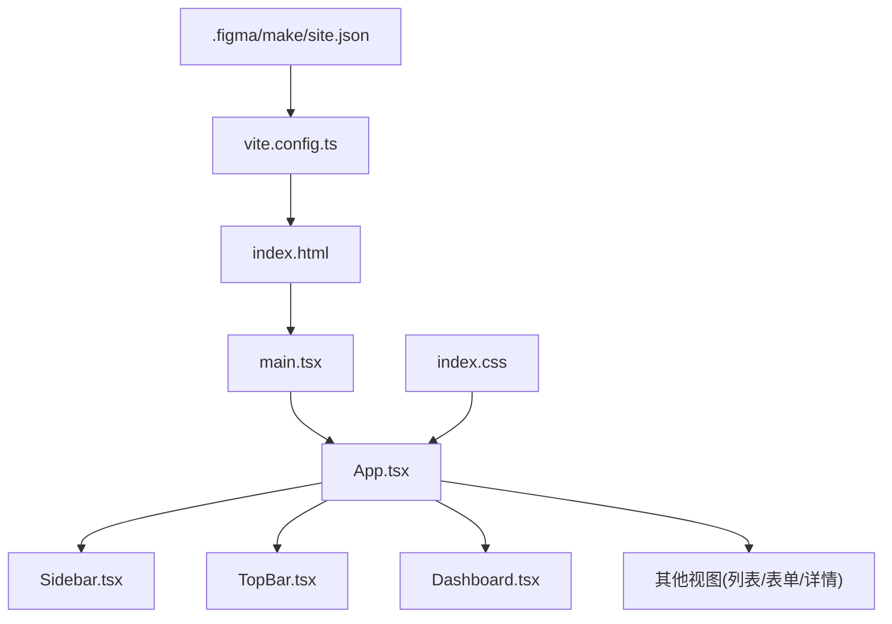
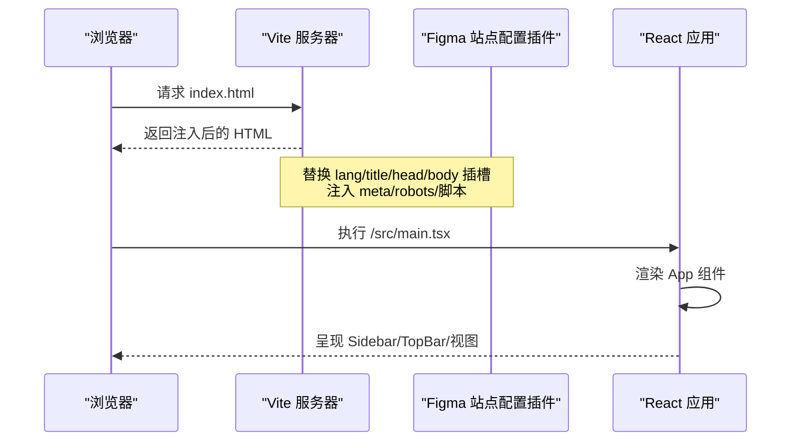
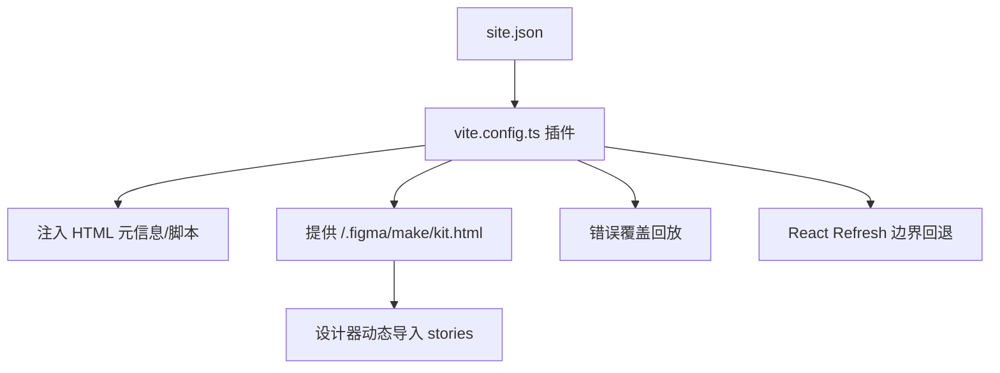
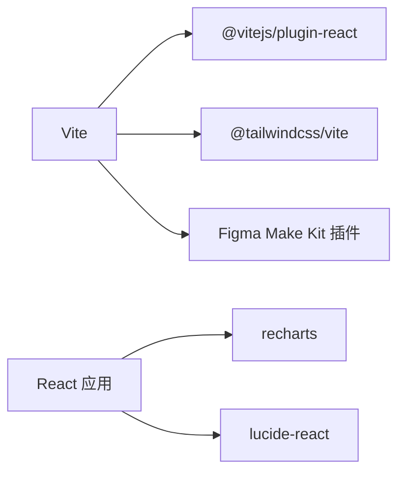

# 界面设计

<cite>
**本文引用的文件**
- [package.json](file://产品设计/UI-V1.0/package.json)
- [vite.config.ts](file://产品设计/UI-V1.0/vite.config.ts)
- [index.html](file://产品设计/UI-V1.0/index.html)
- [src/main.tsx](file://产品设计/UI-V1.0/src/main.tsx)
- [src/App.tsx](file://产品设计/UI-V1.0/src/App.tsx)
- [src/index.css](file://产品设计/UI-V1.0/src/index.css)
- [src/components/Sidebar.tsx](file://产品设计/UI-V1.0/src/components/Sidebar.tsx)
- [src/components/TopBar.tsx](file://产品设计/UI-V1.0/src/components/TopBar.tsx)
- [src/views/Dashboard.tsx](file://产品设计/UI-V1.0/src/views/Dashboard.tsx)
- [.figma/make/site.json](file://产品设计/UI-V1.0/.figma/make/site.json)
</cite>

## 目录
1. [简介](#简介)
2. [项目结构](#项目结构)
3. [核心组件](#核心组件)
4. [架构总览](#架构总览)
5. [详细组件分析](#详细组件分析)
6. [依赖关系分析](#依赖关系分析)
7. [性能考量](#性能考量)
8. [故障排查指南](#故障排查指南)
9. [结论](#结论)
10. [附录](#附录)

## 简介
本文件为 OverInsurData（InsureOS）平台的界面设计文档，聚焦于基于 Tailwind CSS 4 的设计系统、响应式布局策略、主题定制方案与用户体验原则。同时说明与 Figma 设计工具的集成方式、设计稿预览能力以及设计规范的一致性保障，并给出移动端适配、无障碍访问与国际化支持的实现要点。

## 项目结构
- 构建与开发工具链：Vite + React + TypeScript；样式采用 Tailwind CSS 4（通过 @tailwindcss/vite 插件）。
- 入口与路由：React 应用以 main.tsx 挂载 App 组件；App 内部通过状态切换渲染不同视图（Dashboard、保险公司管理、渠道管理等）。
- 全局样式与设计令牌：在 index.css 中定义主题色板、字体、圆角、玻璃态等设计令牌与通用 UI 类。
- 导航与布局：Sidebar 提供分组导航与折叠；TopBar 提供面包屑、搜索、通知与用户头像；主内容区承载各业务视图。
- Figma Make 集成：通过 vite.config.ts 中的自定义插件将 .figma/make/site.json 注入到 HTML，并提供 /.figma/make/kit.html 用于设计器预览。

图表来源
- [index.html:1-17](file://产品设计/UI-V1.0/index.html#L1-L17)
- [src/main.tsx:1-11](file://产品设计/UI-V1.0/src/main.tsx#L1-L11)
- [src/App.tsx:1-123](file://产品设计/UI-V1.0/src/App.tsx#L1-L123)
- [src/components/Sidebar.tsx:1-203](file://产品设计/UI-V1.0/src/components/Sidebar.tsx#L1-L203)
- [src/components/TopBar.tsx:1-135](file://产品设计/UI-V1.0/src/components/TopBar.tsx#L1-L135)
- [src/views/Dashboard.tsx:1-348](file://产品设计/UI-V1.0/src/views/Dashboard.tsx#L1-L348)
- [vite.config.ts:1-357](file://产品设计/UI-V1.0/vite.config.ts#L1-L357)
- [.figma/make/site.json:1-10](file://产品设计/UI-V1.0/.figma/make/site.json#L1-L10)

章节来源
- [package.json:1-30](file://产品设计/UI-V1.0/package.json#L1-L30)
- [vite.config.ts:1-43](file://产品设计/UI-V1.0/vite.config.ts#L1-L43)
- [index.html:1-17](file://产品设计/UI-V1.0/index.html#L1-L17)
- [src/main.tsx:1-11](file://产品设计/UI-V1.0/src/main.tsx#L1-L11)

## 核心组件
- 应用壳层（App.tsx）
  - 使用 flex 全屏布局，左侧固定宽度侧边栏，右侧为主内容区；顶部为 TopBar，主体区域滚动承载视图。
  - 维护当前视图与选中项状态，统一导航函数 navigateTo，支持参数传递与页面回顶。
  - 背景使用径向渐变营造氛围光效，并通过 CSS 变量 --page-bg 控制。
- 侧边栏（Sidebar.tsx）
  - 分组导航：保险公司管理与渠道管理两大组，支持折叠/展开。
  - 使用 lucide-react 图标，当前激活项高亮；部分菜单带提示徽标。
  - 底部展示用户信息与设置入口。
- 顶部栏（TopBar.tsx）
  - 根据当前视图映射显示面包屑路径与标题。
  - 右侧包含搜索框、通知（带红点）、帮助入口与用户头像。
- 仪表盘（Dashboard.tsx）
  - KPI 卡片网格、保费趋势折线图、市场份额环形图、待处理事项、保险公司业绩排名表格与近期操作日志。
  - 使用 recharts 进行数据可视化，配合 glass-strong 卡片风格。

章节来源
- [src/App.tsx:25-123](file://产品设计/UI-V1.0/src/App.tsx#L25-L123)
- [src/components/Sidebar.tsx:37-203](file://产品设计/UI-V1.0/src/components/Sidebar.tsx#L37-L203)
- [src/components/TopBar.tsx:4-135](file://产品设计/UI-V1.0/src/components/TopBar.tsx#L4-L135)
- [src/views/Dashboard.tsx:19-348](file://产品设计/UI-V1.0/src/views/Dashboard.tsx#L19-L348)

## 架构总览
下图展示了从 HTML 到 React 应用的加载流程，以及 Vite 插件对站点元信息、可访问性与 Figma 预览的增强。

图表来源
- [vite.config.ts:72-213](file://产品设计/UI-V1.0/vite.config.ts#L72-L213)
- [index.html:1-17](file://产品设计/UI-V1.0/index.html#L1-L17)
- [src/main.tsx:1-11](file://产品设计/UI-V1.0/src/main.tsx#L1-L11)
- [src/App.tsx:84-123](file://产品设计/UI-V1.0/src/App.tsx#L84-L123)

## 详细组件分析

### 设计系统与主题（Tailwind CSS 4）
- 设计令牌
  - 颜色：主色、辅色、强调色、表面色阶、文字色、描边色、错误与状态色。
  - 字体：无衬线 Inter，等宽 JetBrains Mono。
  - 圆角：xs~2xl 多级圆角体系。
- 玻璃态与卡片
  - 提供 glass/glass-strong/glass-light 三类毛玻璃效果，配合阴影与边框。
  - kpi-card/card 复用玻璃态容器，hover 提升层级。
- 交互元素
  - 按钮：primary/secondary/ghost 三种风格，统一的圆角与过渡动效。
  - 输入：input-glass 带焦点态与占位符样式。
  - 表格：data-table 表头与行悬停反馈。
  - 徽章：badge-* 多语义色彩。
  - 状态指示：orb-* 小圆点表示在线/警告/离线等。
- 全局样式
  - 页面背景使用 CSS 变量 --page-bg，支持主题化。
  - 滚动条美化、数据字体 font-data。

章节来源
- [src/index.css:4-37](file://产品设计/UI-V1.0/src/index.css#L4-L37)
- [src/index.css:39-62](file://产品设计/UI-V1.0/src/index.css#L39-L62)
- [src/index.css:64-96](file://产品设计/UI-V1.0/src/index.css#L64-L96)
- [src/index.css:98-146](file://产品设计/UI-V1.0/src/index.css#L98-L146)
- [src/index.css:147-167](file://产品设计/UI-V1.0/src/index.css#L147-L167)
- [src/index.css:169-197](file://产品设计/UI-V1.0/src/index.css#L169-L197)
- [src/index.css:199-217](file://产品设计/UI-V1.0/src/index.css#L199-L217)
- [src/index.css:218-232](file://产品设计/UI-V1.0/src/index.css#L218-L232)
- [src/index.css:234-241](file://产品设计/UI-V1.0/src/index.css#L234-L241)
- [src/index.css:243-269](file://产品设计/UI-V1.0/src/index.css#L243-L269)
- [src/index.css:271-335](file://产品设计/UI-V1.0/src/index.css#L271-L335)
- [src/index.css:337-361](file://产品设计/UI-V1.0/src/index.css#L337-L361)

### 响应式布局策略
- 桌面优先布局
  - 应用壳层使用 flex 全屏，左侧固定宽度侧边栏，右侧自适应主内容区。
  - Dashboard 使用 CSS Grid 划分 KPI 卡片与图表区域，列数与间距按桌面尺寸设定。
- 移动端适配建议
  - 侧边栏在小屏下可考虑隐藏或改为抽屉式（当前为固定宽度，需结合媒体查询或条件渲染调整）。
  - Dashboard 的三列/四列网格在小屏时降级为单列或双列，图表高度自适应。
  - 顶部栏搜索框在小屏收缩或隐藏，保留关键操作。
- 注意
  - 当前代码未显式使用 Tailwind 断点类，建议在后续迭代中引入响应式类以提升多端一致性。

章节来源
- [src/App.tsx:84-123](file://产品设计/UI-V1.0/src/App.tsx#L84-L123)
- [src/views/Dashboard.tsx:102-151](file://产品设计/UI-V1.0/src/views/Dashboard.tsx#L102-L151)
- [src/views/Dashboard.tsx:153-222](file://产品设计/UI-V1.0/src/views/Dashboard.tsx#L153-L222)
- [src/views/Dashboard.tsx:224-348](file://产品设计/UI-V1.0/src/views/Dashboard.tsx#L224-L348)

### 主题定制方案
- 通过 CSS 变量集中管理品牌色、表面色、文字色与状态色，便于全局替换。
- 使用 Tailwind 的 @theme 扩展自定义令牌（颜色、字体、圆角），并在组件中以内联 style 或类名组合使用。
- 背景与玻璃态通过 CSS 变量与 backdrop-filter 实现，保证在不同背景下的一致视觉层次。

章节来源
- [src/index.css:4-37](file://产品设计/UI-V1.0/src/index.css#L4-L37)
- [src/index.css:39-62](file://产品设计/UI-V1.0/src/index.css#L39-L62)
- [src/App.tsx:84-101](file://产品设计/UI-V1.0/src/App.tsx#L84-L101)

### 用户体验设计原则
- 清晰的信息层级：KPI 卡片突出关键指标，图表辅助趋势理解，表格提供明细数据。
- 一致的交互反馈：按钮、输入、表格行均有 hover/focus 状态，提升可操作性。
- 低认知负荷：导航分组明确，面包屑清晰定位当前位置。
- 可访问性基础：语义化标签、键盘可达的按钮与链接、对比度良好的文本与背景。

章节来源
- [src/views/Dashboard.tsx:102-348](file://产品设计/UI-V1.0/src/views/Dashboard.tsx#L102-L348)
- [src/components/TopBar.tsx:40-135](file://产品设计/UI-V1.0/src/components/TopBar.tsx#L40-L135)
- [src/components/Sidebar.tsx:84-203](file://产品设计/UI-V1.0/src/components/Sidebar.tsx#L84-L203)

### 与 Figma 设计工具的集成
- 站点元信息注入
  - 通过 vite.config.ts 中的 figmaSiteConfiguration 插件读取 .figma/make/site.json，动态替换 HTML 中的 lang/title/head/body 插槽，并注入 meta、robots、favicon、Open Graph、Google Analytics 等标签。
- 可访问性开关
  - site.json 中 accessibility.addBypassLinks 控制是否注入“跳过到内容”链接，便于键盘导航。
- 设计稿预览
  - figmaMakeKitPlugin 在开发模式下提供 /.figma/make/kit.html，暴露 window.__FIGMA__.stories 供设计器动态导入并渲染 Story 组件，实现设计与代码的实时联动。
  - 错误覆盖回放：figmaErrorOverlayReplay 确保在预览 iframe 重连后仍能显示最新构建错误。
  - React Refresh 边界回退：当模块不再注册刷新边界时触发全量重载，避免旧树残留。

图表来源
- [vite.config.ts:72-213](file://产品设计/UI-V1.0/vite.config.ts#L72-L213)
- [vite.config.ts:228-296](file://产品设计/UI-V1.0/vite.config.ts#L228-L296)
- [vite.config.ts:298-357](file://产品设计/UI-V1.0/vite.config.ts#L298-L357)
- [.figma/make/site.json:1-10](file://产品设计/UI-V1.0/.figma/make/site.json#L1-L10)

章节来源
- [vite.config.ts:72-357](file://产品设计/UI-V1.0/vite.config.ts#L72-L357)
- [.figma/make/site.json:1-10](file://产品设计/UI-V1.0/.figma/make/site.json#L1-L10)

### 移动端适配与无障碍访问
- 移动端适配
  - 当前布局为桌面优先，建议在后续版本中引入响应式类（如 sm/md/lg/xl）优化侧边栏、网格与图表在小屏下的表现。
  - 搜索框与顶部操作在小屏下可折叠或隐藏，保持核心功能可用。
- 无障碍访问
  - 可通过 site.json 开启“跳过到内容”链接，改善键盘导航体验。
  - 所有交互元素均为可点击按钮或原生控件，具备焦点态与语义标签。
  - 颜色对比度遵循设计令牌，避免低对比组合。

章节来源
- [vite.config.ts:173-204](file://产品设计/UI-V1.0/vite.config.ts#L173-L204)
- [.figma/make/site.json:6-9](file://产品设计/UI-V1.0/.figma/make/site.json#L6-L9)

### 国际化支持
- 语言与 SEO
  - HTML lang 由 site.json 的 language 字段注入，便于搜索引擎与辅助技术识别。
  - 描述、标题、社交分享图片等元信息均可通过 site.json 配置。
- 运行时 i18n
  - 当前代码未内置多语言包，建议在业务组件中将文案抽离为资源文件，并根据语言环境切换。

章节来源
- [vite.config.ts:72-171](file://产品设计/UI-V1.0/vite.config.ts#L72-L171)
- [index.html:1-17](file://产品设计/UI-V1.0/index.html#L1-L17)

## 依赖关系分析
- 构建与样式
  - Vite 作为开发与构建工具，React 插件负责 JSX/TSX 转换。
  - Tailwind CSS 4 通过 @tailwindcss/vite 启用，提供原子化样式与主题扩展。
- 运行时依赖
  - React 19 与 ReactDOM 19 提供 UI 框架。
  - Recharts 用于数据可视化。
  - Lucide React 提供一致图标库。
- 插件与工具
  - Figma Make Kit 相关插件用于站点配置注入与预览支持。
  - oxfmt 用于代码格式化。

图表来源
- [package.json:12-28](file://产品设计/UI-V1.0/package.json#L12-L28)
- [vite.config.ts:1-43](file://产品设计/UI-V1.0/vite.config.ts#L1-L43)

章节来源
- [package.json:12-28](file://产品设计/UI-V1.0/package.json#L12-L28)
- [vite.config.ts:1-43](file://产品设计/UI-V1.0/vite.config.ts#L1-L43)

## 性能考量
- 构建产物
  - 开发模式生成内联 sourcemap，生产模式关闭以减小体积。
  - 生产构建启用压缩。
- 运行时性能
  - Dashboard 图表使用 ResponsiveContainer 自适应容器大小，减少重绘。
  - 列表与表格数据来自本地 mock，适合原型演示；生产环境应接入分页与虚拟滚动。
- 可维护性
  - 主题与样式集中在 index.css，便于统一治理与按需裁剪。

章节来源
- [vite.config.ts:13-18](file://产品设计/UI-V1.0/vite.config.ts#L13-L18)
- [src/views/Dashboard.tsx:168-211](file://产品设计/UI-V1.0/src/views/Dashboard.tsx#L168-L211)

## 故障排查指南
- 构建错误在预览中不显示
  - 已实现错误覆盖回放，若仍异常，检查 WebSocket 连接与服务端错误输出。
- React Refresh 失效
  - 当组件不再注册刷新边界时会触发全量重载；若出现白屏，检查模块导出与边界声明。
- 站点元信息未生效
  - 确认 .figma/make/site.json 配置正确，且 HTML 中存在对应插槽注释。

章节来源
- [vite.config.ts:228-296](file://产品设计/UI-V1.0/vite.config.ts#L228-L296)
- [vite.config.ts:72-213](file://产品设计/UI-V1.0/vite.config.ts#L72-L213)

## 结论
本界面设计以 Tailwind CSS 4 为核心，构建了统一的主题与组件风格，结合 Vite 与 Figma Make 插件实现了高效的开发与预览闭环。整体布局清晰、交互一致，具备良好的可扩展性。后续建议完善响应式断点、引入运行时国际化与更完善的无障碍测试，进一步提升多端体验与可访问性。

## 附录
- 快速开始
  - 安装依赖：pnpm install
  - 启动开发：pnpm dev
  - 构建预览：pnpm build && pnpm preview
- 关键配置位置
  - 站点元信息与可访问性：.figma/make/site.json
  - 构建与插件：vite.config.ts
  - 主题与样式：src/index.css
  - 应用壳与视图：src/App.tsx、src/components/*、src/views/*