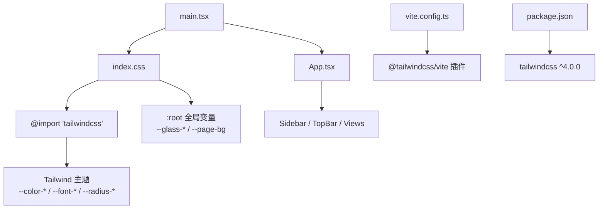
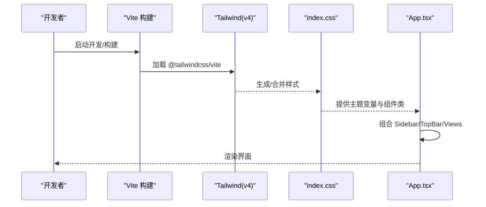
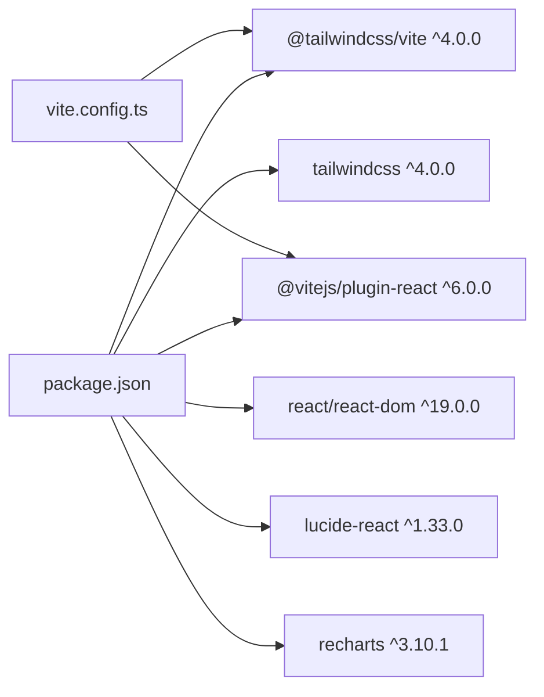

# 基础UI组件

<cite>
**本文引用的文件**
- [index.css](file://产品方案/UI-V1.0/src/index.css)
- [vite.config.ts](file://产品方案/UI-V1.0/vite.config.ts)
- [package.json](file://产品方案/UI-V1.0/package.json)
- [App.tsx](file://产品方案/UI-V1.0/src/App.tsx)
- [main.tsx](file://产品方案/UI-V1.0/src/main.tsx)
</cite>

## 目录
1. [简介](#简介)
2. [项目结构](#项目结构)
3. [核心组件](#核心组件)
4. [架构总览](#架构总览)
5. [详细组件分析](#详细组件分析)
6. [依赖分析](#依赖分析)
7. [性能考虑](#性能考虑)
8. [故障排查指南](#故障排查指南)
9. [结论](#结论)
10. [附录](#附录)

## 简介
本规范面向 OverInsurData 平台的基础 UI 组件与样式体系，聚焦 Tailwind CSS v4（通过 @tailwindcss/vite）在 Vite 工程中的配置与使用，统一颜色系统、字体规范、间距标准与组件样式类；同时说明全局 CSS 变量的定义与应用场景，约定组件基础样式、交互状态与响应式策略，并提供自定义扩展与性能优化建议。文档以仓库现有实现为依据，确保可落地与一致性。

## 项目结构
- 入口与样式注入：应用入口 main.tsx 引入 index.css，由 index.css 加载 Tailwind 主题与全局样式。
- 构建与插件：vite.config.ts 启用 @tailwindcss/vite 插件，并配置别名、开发服务器端口等。
- 依赖声明：package.json 声明 Tailwind v4 与 Vite React 插件等关键依赖。
- 页面骨架：App.tsx 组织侧边栏、顶栏与主内容区，使用 CSS 变量与 Tailwind 类组合布局。

图示来源
- [main.tsx:1-11](file://产品方案/UI-V1.0/src/main.tsx#L1-L11)
- [index.css:1-49](file://产品方案/UI-V1.0/src/index.css#L1-L49)
- [vite.config.ts:1-43](file://产品方案/UI-V1.0/vite.config.ts#L1-L43)
- [package.json:18-28](file://产品方案/UI-V1.0/package.json#L18-L28)

章节来源
- [main.tsx:1-11](file://产品方案/UI-V1.0/src/main.tsx#L1-L11)
- [index.css:1-49](file://产品方案/UI-V1.0/src/index.css#L1-L49)
- [vite.config.ts:1-43](file://产品方案/UI-V1.0/vite.config.ts#L1-L43)
- [package.json:18-28](file://产品方案/UI-V1.0/package.json#L18-L28)

## 核心组件
本节梳理已在全局样式中沉淀的通用组件样式类，便于跨页面复用与一致性维护。

- 玻璃态容器
  - glass / glass-strong / glass-light：半透明背景 + backdrop-filter 模糊 + 细边框 + 阴影层级，用于卡片、面板、模态等。
  - glass-interactive：悬停时提升高光与微缩放，增强可点击反馈。
- 导航与标签
  - nav-item / nav-sub-item：导航项与子项，含 hover/active 状态与最小高度约束。
  - tab-bar / tab-item：底部下划线切换标签，active 状态高亮。
- 数据表格
  - data-table：表头/单元格排版、行悬停高亮、底部边框分隔。
- 状态标识
  - badge-{color}：多色胶囊标签，用于状态、分类等。
  - orb-{color}：小圆点指示器，配合状态语义。
- 输入与按钮
  - input-glass：玻璃态输入框，focus 时边框与阴影强调。
  - btn-primary / btn-secondary / btn-ghost：三种按钮风格，含 hover/active 过渡。
- 卡片与排版
  - card：统一玻璃态卡片容器。
  - font-data：数据列使用等宽字体。

章节来源
- [index.css:64-145](file://产品方案/UI-V1.0/src/index.css#L64-L145)
- [index.css:147-197](file://产品方案/UI-V1.0/src/index.css#L147-L197)
- [index.css:199-217](file://产品方案/UI-V1.0/src/index.css#L199-L217)
- [index.css:218-232](file://产品方案/UI-V1.0/src/index.css#L218-L232)
- [index.css:243-335](file://产品方案/UI-V1.0/src/index.css#L243-L335)
- [index.css:337-361](file://产品方案/UI-V1.0/src/index.css#L337-L361)

## 架构总览
下图展示从构建到渲染的样式链路：Vite 通过 Tailwind 插件编译 CSS，index.css 定义主题变量与全局样式，App.tsx 组合布局并使用这些样式类与变量。

图示来源
- [vite.config.ts:1-43](file://产品方案/UI-V1.0/vite.config.ts#L1-L43)
- [index.css:1-49](file://产品方案/UI-V1.0/src/index.css#L1-L49)
- [App.tsx:84-120](file://产品方案/UI-V1.0/src/App.tsx#L84-L120)

## 详细组件分析

### 颜色系统与主题变量
- 主题色板
  - 主色：primary / primary-light / primary-muted
  - 辅色：secondary / secondary-light
  - 第三色：tertiary
  - 表面色阶：surface / surface-dim / surface-low / surface-container / surface-high / surface-highest
  - 前景与描边：on-surface / on-surface-var / outline / outline-var
  - 错误与状态：error / error-bg / status-action / status-running / status-active / status-pending
- 字体
  - 无衬线：Inter（可变字重），系统回退栈
  - 等宽：JetBrains Mono
- 圆角
  - xs/sm/md/lg/xl/2xl 五级半径

使用方式
- 通过 Tailwind 主题变量可直接在样式中使用 var(--color-*)、var(--font-*)、var(--radius-*)。
- 页面背景使用 --page-bg 渐变变量，保证整体氛围一致。

章节来源
- [index.css:4-37](file://产品方案/UI-V1.0/src/index.css#L4-L37)
- [index.css:39-62](file://产品方案/UI-V1.0/src/index.css#L39-L62)

### 全局 CSS 变量与应用场景
- 玻璃态变量
  - --glass-bg / --glass-bg-strong / --glass-bg-light：不同强度的半透明背景
  - --glass-stroke：细边框透明度
  - --glass-shadow / --glass-shadow-elevated：基础与悬浮阴影
- 页面背景
  - --page-bg：径向渐变背景，营造空间层次

应用场景
- 所有玻璃态组件（卡片、面板、模态、KPI 卡片）统一引用上述变量，确保视觉一致性与可维护性。
- 页面根背景通过 body 或容器设置 background: var(--page-bg)。

章节来源
- [index.css:39-49](file://产品方案/UI-V1.0/src/index.css#L39-L49)
- [index.css:64-96](file://产品方案/UI-V1.0/src/index.css#L64-L96)
- [index.css:218-232](file://产品方案/UI-V1.0/src/index.css#L218-L232)

### 组件基础样式约定
- 玻璃态容器
  - 使用 glass / glass-strong / glass-light 控制层级与模糊强度
  - 交互态使用 glass-interactive 获得悬停高光与微动效
- 导航与标签
  - nav-item/nav-sub-item 支持 active/hover 状态，保持最小高度与内边距
  - tab-bar/tab-item 使用下划线激活态
- 表格
  - data-table 统一表头/单元格排版与行悬停效果
- 输入与按钮
  - input-glass 聚焦态边框与阴影
  - 三类按钮：btn-primary（主操作）、btn-secondary（次级）、btn-ghost（轻量）
- 卡片与数据
  - card 统一容器风格
  - font-data 用于数值/代码列

章节来源
- [index.css:98-145](file://产品方案/UI-V1.0/src/index.css#L98-L145)
- [index.css:147-197](file://产品方案/UI-V1.0/src/index.css#L147-L197)
- [index.css:243-335](file://产品方案/UI-V1.0/src/index.css#L243-L335)
- [index.css:337-345](file://产品方案/UI-V1.0/src/index.css#L337-L345)

### 交互状态设计
- 悬停：背景色轻微加深或边框高亮，按钮有阴影与位移
- 激活：导航与标签使用主色与更深的背景
- 焦点：输入框聚焦时边框与外发光强调
- 动效：统一的 transition 时长与缓动，避免过度动画

章节来源
- [index.css:88-96](file://产品方案/UI-V1.0/src/index.css#L88-L96)
- [index.css:113-145](file://产品方案/UI-V1.0/src/index.css#L113-L145)
- [index.css:255-258](file://产品方案/UI-V1.0/src/index.css#L255-L258)
- [index.css:288-335](file://产品方案/UI-V1.0/src/index.css#L288-L335)

### 响应式断点与布局
- 当前未定义自定义断点，遵循 Tailwind v4 默认断点体系
- 布局采用 flex 与 overflow 控制，结合容器宽度自适应
- 建议在需要时通过 Tailwind 内置断点（sm/md/lg/xl/2xl）进行适配

章节来源
- [App.tsx:84-120](file://产品方案/UI-V1.0/src/App.tsx#L84-L120)

## 依赖分析
- 运行时依赖
  - React / ReactDOM：UI 框架
  - lucide-react：图标库
  - recharts：图表库
- 构建与样式
  - vite：构建工具
  - @vitejs/plugin-react：React 支持
  - tailwindcss v4 + @tailwindcss/vite：样式引擎与 Vite 集成
  - typescript：类型检查

图示来源
- [package.json:12-28](file://产品方案/UI-V1.0/package.json#L12-L28)
- [vite.config.ts:1-43](file://产品方案/UI-V1.0/vite.config.ts#L1-L43)

章节来源
- [package.json:12-28](file://产品方案/UI-V1.0/package.json#L12-L28)
- [vite.config.ts:1-43](file://产品方案/UI-V1.0/vite.config.ts#L1-L43)

## 性能考虑
- 样式体积
  - Tailwind v4 按需生成，避免冗余类；尽量复用已有组件类，减少新增样式。
- 玻璃态性能
  - backdrop-filter 在高密度区域可能影响性能，谨慎在大面积滚动列表中使用；必要时降级为纯色背景。
- 字体加载
  - Inter/JetBrains Mono 通过 Google Fonts 加载，注意网络延迟与缓存；可在生产环境预加载关键字体。
- 构建产物
  - 生产构建开启压缩与 SourceMap 控制；开发模式保留 inline sourcemap 便于调试。
- 资源与脚本
  - 通过 Vite 插件注入的脚本（如分析、无障碍跳转）按需启用，避免不必要的开销。

[本节为通用指导，不直接分析具体文件]

## 故障排查指南
- 样式未生效
  - 确认 main.tsx 已引入 index.css；确认 index.css 已 import tailwindcss。
  - 检查 vite.config.ts 是否启用 @tailwindcss/vite 插件。
- 主题变量无效
  - 确认 :root 与 @theme 块正确定义；组件中通过 var(--xxx) 引用。
- 构建报错
  - 检查 package.json 中 tailwindcss 版本与 @tailwindcss/vite 匹配；清理缓存后重试。
- 预览异常
  - 检查 vite.config.ts 的 server/preview 端口与环境变量；确认 noindex robots 等注入逻辑符合预期。

章节来源
- [main.tsx:1-11](file://产品方案/UI-V1.0/src/main.tsx#L1-L11)
- [index.css:1-49](file://产品方案/UI-V1.0/src/index.css#L1-L49)
- [vite.config.ts:1-43](file://产品方案/UI-V1.0/vite.config.ts#L1-L43)
- [package.json:18-28](file://产品方案/UI-V1.0/package.json#L18-L28)

## 结论
本项目基于 Tailwind v4 构建了统一的视觉与交互基座：通过 @theme 定义颜色、字体与圆角，通过 :root 提供玻璃态与页面背景变量，并在 index.css 中沉淀常用组件类。App.tsx 以简洁的布局组合承载业务视图。遵循本规范可确保跨模块一致的视觉语言、良好的可维护性与可扩展性。

[本节为总结，不直接分析具体文件]

## 附录

### Tailwind 配置与使用要点
- 启用方式：vite.config.ts 中引入 @tailwindcss/vite 插件。
- 主题扩展：在 index.css 的 @theme 中声明 --color-*、--font-*、--radius-*。
- 全局变量：在 :root 中声明 --glass-*、--page-bg 等变量供组件使用。
- 组件类：将高频样式封装为 .glass/.card/.btn-* 等类，统一调用。

章节来源
- [vite.config.ts:1-43](file://产品方案/UI-V1.0/vite.config.ts#L1-L43)
- [index.css:1-49](file://产品方案/UI-V1.0/src/index.css#L1-L49)

### 组件类速查
- 容器：glass / glass-strong / glass-light / card
- 导航：nav-item / nav-sub-item / tab-bar / tab-item
- 数据：data-table / font-data
- 状态：badge-{color} / orb-{color}
- 表单：input-glass
- 按钮：btn-primary / btn-secondary / btn-ghost

章节来源
- [index.css:64-361](file://产品方案/UI-V1.0/src/index.css#L64-L361)

### 页面布局参考
- 外层容器使用 flex h-screen，左侧 Sidebar，右侧 TopBar + main 内容区。
- 背景使用 --page-bg 或内联渐变，保持一致氛围。

章节来源
- [App.tsx:84-120](file://产品方案/UI-V1.0/src/App.tsx#L84-L120)