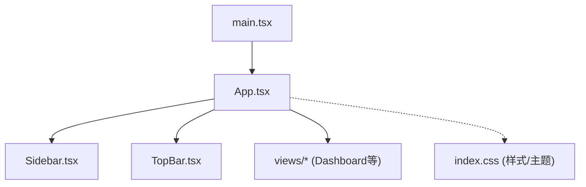
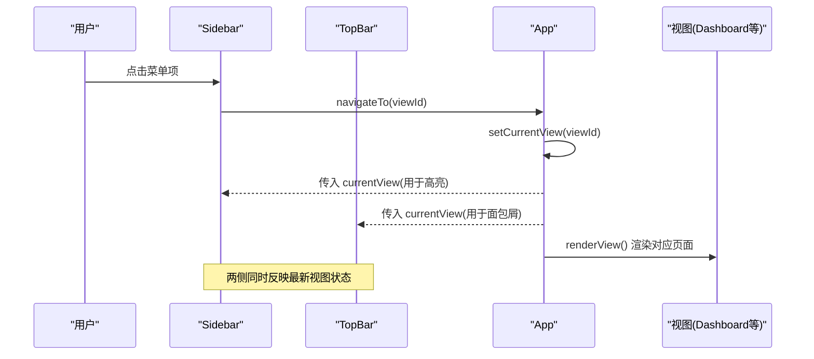
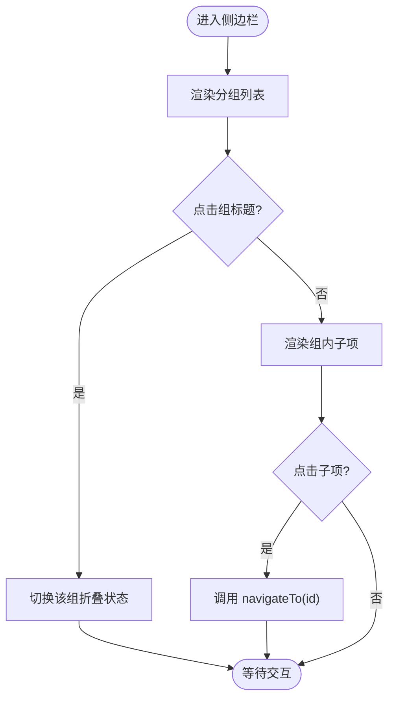
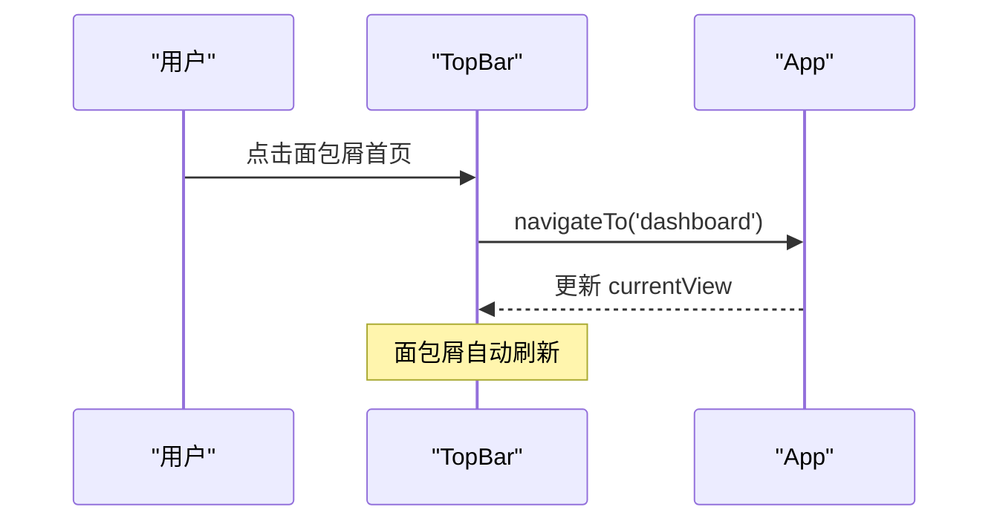
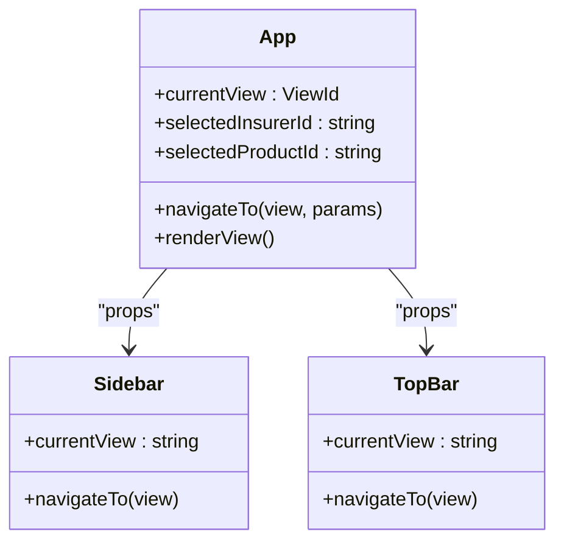
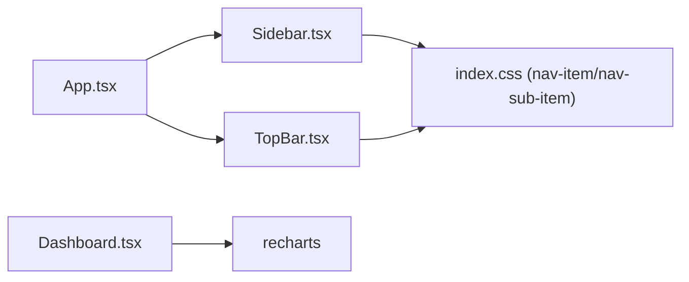

# 导航组件

<cite>
**本文引用的文件**
- [Sidebar.tsx](file://产品方案/UI-V1.0/src/components/Sidebar.tsx)
- [TopBar.tsx](file://产品方案/UI-V1.0/src/components/TopBar.tsx)
- [App.tsx](file://产品方案/UI-V1.0/src/App.tsx)
- [main.tsx](file://产品方案/UI-V1.0/src/main.tsx)
- [index.css](file://产品方案/UI-V1.0/src/index.css)
- [Dashboard.tsx](file://产品方案/UI-V1.0/src/views/Dashboard.tsx)
</cite>

## 目录
1. [简介](#简介)
2. [项目结构](#项目结构)
3. [核心组件](#核心组件)
4. [架构总览](#架构总览)
5. [详细组件分析](#详细组件分析)
6. [依赖关系分析](#依赖关系分析)
7. [性能考量](#性能考量)
8. [故障排查指南](#故障排查指南)
9. [结论](#结论)
10. [附录](#附录)

## 简介
本文件面向 OverInsurData 平台的导航子系统，聚焦 Sidebar（侧边栏）与 TopBar（顶部栏）两大组件。文档围绕以下目标展开：
- 菜单结构与路由管理：说明侧边栏分组、项定义、当前视图高亮、以及通过回调驱动的路由切换。
- 状态同步机制：解释 App 层如何集中维护 currentView，并向下传递给 Sidebar 与 TopBar，实现双向一致。
- TopBar 功能：面包屑导航、全局搜索输入、通知提示、帮助入口与用户头像。
- 响应式设计与无障碍：基于现有样式与布局的适配策略，以及可访问性现状与改进建议。
- 定制与主题扩展：提供可扩展的菜单配置方式、主题变量与样式类扩展点。

## 项目结构
导航相关代码集中在 components 与 App 中，视图层通过 App 的 switch 渲染；样式统一在 index.css 中定义。

图表来源
- [main.tsx:1-11](file://产品方案/UI-V1.0/src/main.tsx#L1-L11)
- [App.tsx:1-123](file://产品方案/UI-V1.0/src/App.tsx#L1-L123)
- [Sidebar.tsx:1-203](file://产品方案/UI-V1.0/src/components/Sidebar.tsx#L1-L203)
- [TopBar.tsx:1-135](file://产品方案/UI-V1.0/src/components/TopBar.tsx#L1-L135)
- [index.css:1-361](file://产品方案/UI-V1.0/src/index.css#L1-L361)

章节来源
- [main.tsx:1-11](file://产品方案/UI-V1.0/src/main.tsx#L1-L11)
- [App.tsx:1-123](file://产品方案/UI-V1.0/src/App.tsx#L1-L123)

## 核心组件
- Sidebar 侧边栏
  - 菜单分组与项：以数组形式声明分组与子项，包含 id、label、icon。
  - 折叠/展开：按组标签维护 collapsed 状态，控制子项显示。
  - 当前视图高亮：根据 currentView 匹配 active 样式。
  - 用户区：展示管理员头像与设置按钮。
- TopBar 顶部栏
  - 面包屑：根据 currentView 映射到 crumbs 与 title。
  - 快捷操作：搜索框、通知铃铛（带红点）、帮助按钮、用户头像。
- App 应用壳
  - 状态中心：currentView、selectedInsurerId、selectedProductId 等。
  - 路由分发：navigateTo 更新 currentView 并滚动至顶部；renderView 根据 currentView 渲染对应视图。

章节来源
- [Sidebar.tsx:9-75](file://产品方案/UI-V1.0/src/components/Sidebar.tsx#L9-L75)
- [Sidebar.tsx:77-203](file://产品方案/UI-V1.0/src/components/Sidebar.tsx#L77-L203)
- [TopBar.tsx:4-35](file://产品方案/UI-V1.0/src/components/TopBar.tsx#L4-L35)
- [TopBar.tsx:37-135](file://产品方案/UI-V1.0/src/components/TopBar.tsx#L37-L135)
- [App.tsx:25-82](file://产品方案/UI-V1.0/src/App.tsx#L25-L82)
- [App.tsx:84-123](file://产品方案/UI-V1.0/src/App.tsx#L84-L123)

## 架构总览
导航采用“单源状态”模式：App 持有 currentView，并通过 props 将 navigateTo 回调注入 Sidebar 与 TopBar。点击任一导航项均调用 navigateTo，App 更新状态后重新渲染，从而保证两侧一致。

图表来源
- [Sidebar.tsx:72-82](file://产品方案/UI-V1.0/src/components/Sidebar.tsx#L72-L82)
- [Sidebar.tsx:120-168](file://产品方案/UI-V1.0/src/components/Sidebar.tsx#L120-L168)
- [TopBar.tsx:32-72](file://产品方案/UI-V1.0/src/components/TopBar.tsx#L32-L72)
- [App.tsx:25-37](file://产品方案/UI-V1.0/src/App.tsx#L25-L37)
- [App.tsx:39-82](file://产品方案/UI-V1.0/src/App.tsx#L39-L82)

## 详细组件分析

### Sidebar 侧边栏
- 菜单结构
  - 分组：保险公司管理、渠道管理。
  - 项：每个项包含唯一 id、显示文本、图标；部分项支持角标（如 Appointment）。
  - 类型安全：使用 ViewId 联合类型约束所有有效视图标识。
- 交互逻辑
  - 折叠/展开：按组 label 维护 collapsed 状态，点击组标题切换。
  - 高亮：当 item.id === currentView 时，应用 active 样式。
  - 导航：点击项调用 navigateTo(item.id)。
- 视觉与布局
  - 固定宽度 224px，玻璃态背景，右侧边框分隔。
  - Logo 区域、Dashboard 入口、可滚动分组列表、底部用户信息区。
- 可访问性与键盘导航
  - 当前实现为 div + onClick，缺少语义化按钮与键盘焦点管理。
  - 建议：将可点击项改为 button，添加 aria-current="page" 表示当前页；为折叠按钮添加 aria-expanded 与 aria-controls。
- 响应式
  - 当前为固定宽度侧边栏，未内置移动端折叠逻辑。
  - 建议：在小屏下隐藏或收起侧边栏，并提供抽屉式入口。

图表来源
- [Sidebar.tsx:77-82](file://产品方案/UI-V1.0/src/components/Sidebar.tsx#L77-L82)
- [Sidebar.tsx:131-168](file://产品方案/UI-V1.0/src/components/Sidebar.tsx#L131-L168)

章节来源
- [Sidebar.tsx:9-75](file://产品方案/UI-V1.0/src/components/Sidebar.tsx#L9-L75)
- [Sidebar.tsx:77-203](file://产品方案/UI-V1.0/src/components/Sidebar.tsx#L77-L203)

### TopBar 顶部栏
- 面包屑导航
  - 通过 VIEW_LABELS 将 currentView 映射为 crumbs 与 title。
  - 点击首页按钮返回 dashboard。
- 快捷操作
  - 搜索框：占位符文案表明搜索范围（保险公司、产品、渠道）。
  - 通知：铃铛图标右上角红点表示未读。
  - 帮助：HelpCircle 图标按钮。
  - 用户头像：圆形渐变头像，可点击触发用户菜单（当前未实现）。
- 可访问性与键盘导航
  - 搜索框具备原生 focus 行为；按钮可使用 aria-label 增强描述。
  - 建议：为通知按钮增加 aria-label="通知"，帮助按钮增加 aria-label="帮助"。
- 响应式
  - 当前为水平布局，小屏下需考虑压缩搜索框宽度或隐藏次要按钮。

图表来源
- [TopBar.tsx:4-35](file://产品方案/UI-V1.0/src/components/TopBar.tsx#L4-L35)
- [TopBar.tsx:51-72](file://产品方案/UI-V1.0/src/components/TopBar.tsx#L51-L72)
- [App.tsx:25-37](file://产品方案/UI-V1.0/src/App.tsx#L25-L37)

章节来源
- [TopBar.tsx:4-35](file://产品方案/UI-V1.0/src/components/TopBar.tsx#L4-L35)
- [TopBar.tsx:37-135](file://产品方案/UI-V1.0/src/components/TopBar.tsx#L37-L135)

### App 路由与状态同步
- 状态设计
  - currentView：当前激活的视图 ID。
  - selectedInsurerId / selectedProductId：用于详情页参数传递。
- 导航流程
  - navigateTo(view, params?)：更新 selected* 与 currentView，并滚动到顶部。
  - renderView：根据 currentView 选择对应视图组件，缺失时回退到 PlaceholderView。
- 与导航组件集成
  - 向 Sidebar 与 TopBar 传入 currentView 与 navigateTo，确保两侧高亮与面包屑一致。

图表来源
- [App.tsx:25-82](file://产品方案/UI-V1.0/src/App.tsx#L25-L82)
- [Sidebar.tsx:72-82](file://产品方案/UI-V1.0/src/components/Sidebar.tsx#L72-L82)
- [TopBar.tsx:32-35](file://产品方案/UI-V1.0/src/components/TopBar.tsx#L32-L35)

章节来源
- [App.tsx:25-82](file://产品方案/UI-V1.0/src/App.tsx#L25-L82)
- [App.tsx:84-123](file://产品方案/UI-V1.0/src/App.tsx#L84-L123)

## 依赖关系分析
- 组件耦合
  - Sidebar 与 TopBar 均依赖 App 提供的 currentView 与 navigateTo，形成松耦合的双向数据流。
  - 视图层仅依赖 App 的 navigateTo，不直接感知导航细节。
- 外部依赖
  - 图标库：lucide-react。
  - 图表库：recharts（在 Dashboard 中使用）。
- 样式依赖
  - 导航项样式类 nav-item、nav-sub-item、active 等在 index.css 中统一定义。
  - 玻璃态风格通过 .glass/.glass-strong 等类复用。

图表来源
- [index.css:98-145](file://产品方案/UI-V1.0/src/index.css#L98-L145)
- [index.css:64-79](file://产品方案/UI-V1.0/src/index.css#L64-L79)
- [Dashboard.tsx:1-10](file://产品方案/UI-V1.0/src/views/Dashboard.tsx#L1-L10)

章节来源
- [index.css:64-79](file://产品方案/UI-V1.0/src/index.css#L64-L79)
- [index.css:98-145](file://产品方案/UI-V1.0/src/index.css#L98-L145)

## 性能考量
- 渲染优化
  - 当前通过 React 状态驱动，切换视图时仅重渲染受影响组件。
  - 建议在大型菜单场景中对 Sidebar 的子项进行 memo 或虚拟滚动，避免不必要的重渲染。
- 样式性能
  - 大量 backdrop-filter 与阴影可能影响低端设备性能，可在小屏设备上降级为纯色背景。
- 事件处理
  - 避免在每次渲染中创建新函数对象，可将 navigateTo 稳定化或使用 useCallback（如需）。

[本节为通用指导，不直接分析具体文件]

## 故障排查指南
- 菜单高亮异常
  - 检查 currentView 是否与菜单项 id 完全一致（大小写、连字符）。
  - 确认 navigateTo 是否被正确调用且未被拦截。
- 面包屑不正确
  - 核对 VIEW_LABELS 中当前 view 是否存在映射；不存在时会回退为当前 view 字符串。
- 通知红点不消失
  - 当前为静态 UI，若需动态控制，应引入状态管理并在读取后清除。
- 键盘无法聚焦
  - 将可点击项从 div 改为 button，并为折叠按钮添加 aria-expanded。
- 移动端体验差
  - 当前无响应式折叠逻辑，建议增加媒体查询与抽屉菜单。

章节来源
- [TopBar.tsx:4-35](file://产品方案/UI-V1.0/src/components/TopBar.tsx#L4-L35)
- [Sidebar.tsx:131-168](file://产品方案/UI-V1.0/src/components/Sidebar.tsx#L131-L168)

## 结论
OverInsurData 的导航系统采用简洁清晰的“单源状态 + 回调驱动”模式，Sidebar 负责菜单与分组折叠，TopBar 提供面包屑与快捷操作，App 作为中枢协调状态与视图渲染。当前实现已满足基本导航需求，但在可访问性、响应式与主题扩展方面仍有提升空间。建议优先完善键盘导航与无障碍属性，并引入更灵活的菜单配置与主题变量体系，以提升可维护性与品牌一致性。

[本节为总结性内容，不直接分析具体文件]

## 附录

### 菜单结构与路由映射
- 分组
  - 保险公司管理：保险公司列表、产品管理、合作管理、Appointment & 合规、财务与结算、数据分析。
  - 渠道管理：渠道列表、渠道主数据、渠道层级、入驻管理、产品授权、佣金方案、佣金结算、绩效考核、培训认证、渠道门户、渠道分析。
- 路由键
  - 使用 ViewId 联合类型统一管理所有有效视图标识，确保类型安全。

章节来源
- [Sidebar.tsx:9-75](file://产品方案/UI-V1.0/src/components/Sidebar.tsx#L9-L75)

### 主题与样式扩展点
- 主题变量
  - 颜色：--color-primary、--color-secondary、--color-surface 等。
  - 字体：--font-sans、--font-mono。
  - 圆角：--radius-*。
- 玻璃态
  - --glass-bg、--glass-bg-strong、--glass-stroke、--glass-shadow 等变量控制半透明背景与模糊效果。
- 样式类
  - .glass、.glass-strong、.glass-light 用于容器背景。
  - .nav-item、.nav-sub-item、.active 用于导航项样式。
  - .btn-primary、.btn-secondary、.btn-ghost 用于按钮样式。
  - .input-glass 用于输入框样式。
- 扩展建议
  - 通过修改 CSS 变量快速切换主题色。
  - 新增导航项时复用 .nav-item/.nav-sub-item 类以保持风格一致。

章节来源
- [index.css:4-49](file://产品方案/UI-V1.0/src/index.css#L4-L49)
- [index.css:64-79](file://产品方案/UI-V1.0/src/index.css#L64-L79)
- [index.css:98-145](file://产品方案/UI-V1.0/src/index.css#L98-L145)
- [index.css:243-335](file://产品方案/UI-V1.0/src/index.css#L243-L335)

### 响应式与无障碍建议清单
- 响应式
  - 小屏下隐藏或收起侧边栏，提供抽屉入口。
  - TopBar 搜索框在小屏下收缩宽度或隐藏次要按钮。
- 无障碍
  - 将可点击项改为 button，添加 aria-current="page"。
  - 折叠按钮添加 aria-expanded 与 aria-controls。
  - 为图标按钮添加 aria-label。
  - 确保焦点可见性与顺序合理。

[本节为通用建议，不直接分析具体文件]