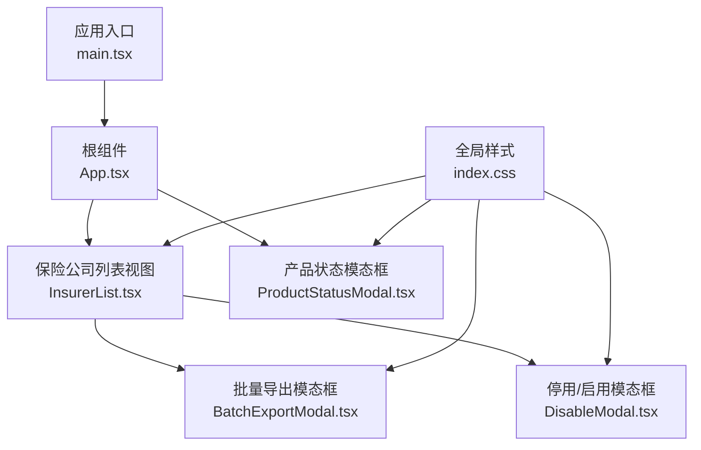
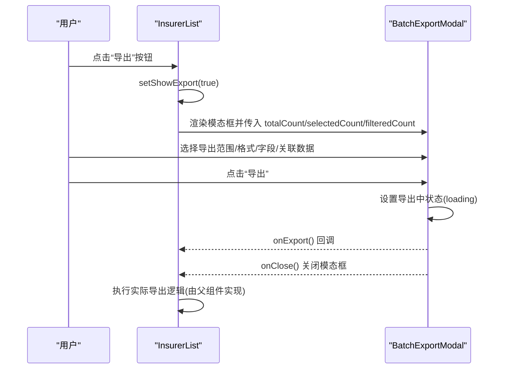
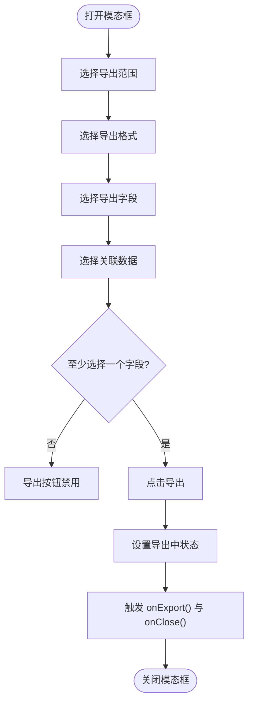
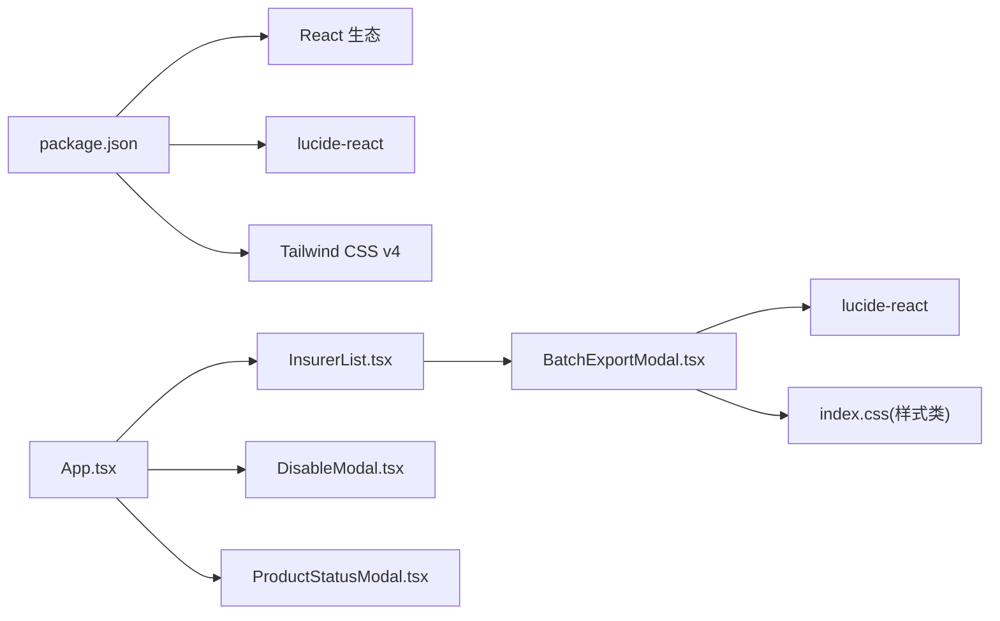

# 模态框组件

<cite>
**本文引用的文件**
- [BatchExportModal.tsx](file://产品方案/UI-V1.0/src/components/BatchExportModal.tsx)
- [InsurerList.tsx](file://产品方案/UI-V1.0/src/views/InsurerList.tsx)
- [App.tsx](file://产品方案/UI-V1.0/src/App.tsx)
- [main.tsx](file://产品方案/UI-V1.0/src/main.tsx)
- [index.css](file://产品方案/UI-V1.0/src/index.css)
- [package.json](file://产品方案/UI-V1.0/package.json)
</cite>

## 目录
1. [简介](#简介)
2. [项目结构](#项目结构)
3. [核心组件](#核心组件)
4. [架构总览](#架构总览)
5. [详细组件分析](#详细组件分析)
6. [依赖关系分析](#依赖关系分析)
7. [性能考量](#性能考量)
8. [故障排查指南](#故障排查指南)
9. [结论](#结论)
10. [附录：使用示例与扩展方法](#附录使用示例与扩展方法)

## 简介
本文件聚焦 OverInsurData 平台的模态框组件，重点解析 BatchExportModal 批量导出模态框的实现。内容涵盖导出范围选择、格式配置、字段选择与关联数据选项；详细说明状态管理、用户交互流程与事件处理机制；并总结样式设计、动画效果与响应式适配策略。最后提供组件的使用示例与自定义扩展方法，帮助开发者快速集成与二次开发。

## 项目结构
本项目采用 React + TypeScript + Vite 构建，UI 层通过 Tailwind CSS v4 进行样式组织，并使用 lucide-react 图标库。模态框组件位于 components 目录，业务视图在 views 目录中引入并使用。

图表来源
- [main.tsx:1-11](file://产品方案/UI-V1.0/src/main.tsx#L1-L11)
- [App.tsx:1-123](file://产品方案/UI-V1.0/src/App.tsx#L1-L123)
- [InsurerList.tsx:1-360](file://产品方案/UI-V1.0/src/views/InsurerList.tsx#L1-L360)
- [BatchExportModal.tsx:1-186](file://产品方案/UI-V1.0/src/components/BatchExportModal.tsx#L1-L186)
- [index.css:1-361](file://产品方案/UI-V1.0/src/index.css#L1-L361)

章节来源
- [main.tsx:1-11](file://产品方案/UI-V1.0/src/main.tsx#L1-L11)
- [App.tsx:1-123](file://产品方案/UI-V1.0/src/App.tsx#L1-L123)
- [index.css:1-361](file://产品方案/UI-V1.0/src/index.css#L1-L361)

## 核心组件
- BatchExportModal：负责批量导出的范围选择（当前筛选结果/已勾选记录/全部数据）、导出格式（Excel/CSV）、字段选择（支持全选/清空）以及关联数据选项（如产品列表、渠道列表、业绩摘要、对接人信息）。内部维护导出状态（是否正在导出），并在确认后回调父级处理实际导出逻辑。
- InsurerList：作为调用方，维护搜索、过滤、排序、分页与选中项集合，并通过状态控制显示/隐藏 BatchExportModal，同时向模态框传入总数、已选数量、过滤后数量等上下文数据。
- DisableModal / ProductStatusModal：其他业务场景的模态框，体现一致的交互模式（遮罩、确认、影响范围提示、生效时间等），可作为参考。

章节来源
- [BatchExportModal.tsx:1-186](file://产品方案/UI-V1.0/src/components/BatchExportModal.tsx#L1-L186)
- [InsurerList.tsx:1-360](file://产品方案/UI-V1.0/src/views/InsurerList.tsx#L1-L360)
- [DisableModal.tsx:1-236](file://产品方案/UI-V1.0/src/components/DisableModal.tsx#L1-L236)
- [ProductStatusModal.tsx:1-206](file://产品方案/UI-V1.0/src/components/ProductStatusModal.tsx#L1-L206)

## 架构总览
BatchExportModal 以“受控+回调”的方式与父组件协作：父组件负责数据源与导出执行，模态框仅负责用户配置与状态展示。整体交互遵循“打开 -> 配置 -> 确认 -> 关闭”的标准流程。

图表来源
- [InsurerList.tsx:107-109](file://产品方案/UI-V1.0/src/views/InsurerList.tsx#L107-L109)
- [InsurerList.tsx:348-356](file://产品方案/UI-V1.0/src/views/InsurerList.tsx#L348-L356)
- [BatchExportModal.tsx:42-56](file://产品方案/UI-V1.0/src/components/BatchExportModal.tsx#L42-L56)

## 详细组件分析

### BatchExportModal 组件分析
- 职责边界
  - 接收 props：totalCount、selectedCount、filteredCount、onClose、onExport
  - 内部管理：导出范围 scope、导出格式 format、字段选择 fields、关联数据 related、导出中状态 exporting
  - 计算值：根据 scope 动态计算待导出条数；统计已选字段数量
- 用户交互流程
  - 范围选择：单选“当前筛选结果/已勾选记录/全部数据”，当无选中记录时禁用“已勾选记录”
  - 格式选择：单选 Excel(.xlsx)/CSV(.csv)，带描述说明
  - 字段选择：网格复选框，支持全选/清空，实时统计已选字段数
  - 关联数据：多选附加数据项（产品列表、渠道列表、业绩摘要、对接人信息）
  - 导出确认：校验至少选择一个字段，进入 loading 态，延迟后触发 onExport 与 onClose
- 状态管理与事件处理
  - useState 管理各配置项与 loading 状态
  - 事件：radio/checkbox 变更更新对应 state；导出按钮触发 handleExport；遮罩点击触发 onClose
- 样式与动画
  - 使用 glass-strong 玻璃态容器，固定定位全屏遮罩，backdrop-filter 模糊背景
  - 底部导出按钮在导出中显示旋转加载动画（内联 keyframes）
  - 布局采用 flex/grid，适配中等宽度窗口；滚动区域限制最大高度，避免溢出
- 可访问性与可用性
  - 使用原生 input[type=radio|checkbox]，配合 label 提升可访问性
  - 禁用态与视觉反馈清晰（边框高亮、半透明禁用）

图表来源
- [BatchExportModal.tsx:42-56](file://产品方案/UI-V1.0/src/components/BatchExportModal.tsx#L42-L56)
- [BatchExportModal.tsx:77-157](file://产品方案/UI-V1.0/src/components/BatchExportModal.tsx#L77-L157)
- [BatchExportModal.tsx:160-182](file://产品方案/UI-V1.0/src/components/BatchExportModal.tsx#L160-L182)

章节来源
- [BatchExportModal.tsx:1-186](file://产品方案/UI-V1.0/src/components/BatchExportModal.tsx#L1-L186)

### InsurerList 中的使用方式
- 状态：search、filterType、filterStatus、filterRegion、filterRating、sortKey、sortDir、page、selected、showExport
- 行为：
  - 顶部工具栏“导出”按钮触发 showExport=true
  - 批量操作区“导出选中”同样触发 showExport=true
  - 渲染 BatchExportModal 并传入 totalCount/selectedCount/filteredCount，以及 onClose/onExport 回调
- 注意：当前 onExport 仅用于关闭模态框，实际导出逻辑需由父组件实现

章节来源
- [InsurerList.tsx:18-29](file://产品方案/UI-V1.0/src/views/InsurerList.tsx#L18-L29)
- [InsurerList.tsx:107-109](file://产品方案/UI-V1.0/src/views/InsurerList.tsx#L107-L109)
- [InsurerList.tsx:163-170](file://产品方案/UI-V1.0/src/views/InsurerList.tsx#L163-L170)
- [InsurerList.tsx:348-356](file://产品方案/UI-V1.0/src/views/InsurerList.tsx#L348-L356)

### 其他模态框对比（DisableModal / ProductStatusModal）
- 共同点：
  - 统一的全屏遮罩与玻璃态容器
  - 明确的标题、图标、关闭按钮
  - 影响范围提示、原因选择、备注、生效时间、确认勾选
  - 底部操作区：取消与确认按钮，禁用态控制
- 差异点：
  - DisableModal：针对保险公司启用/停用的复杂流程，含影响面指标与定时生效
  - ProductStatusModal：针对产品上架/下架，含下架范围（全部/指定州）与影响估算

章节来源
- [DisableModal.tsx:1-236](file://产品方案/UI-V1.0/src/components/DisableModal.tsx#L1-L236)
- [ProductStatusModal.tsx:1-206](file://产品方案/UI-V1.0/src/components/ProductStatusModal.tsx#L1-L206)

## 依赖关系分析
- 外部依赖
  - react、react-dom：组件框架
  - lucide-react：图标资源
  - tailwindcss(v4)：样式系统
- 内部依赖
  - App.tsx：路由与页面挂载，未直接引入 BatchExportModal，但展示了模态框的统一管理模式
  - InsurerList.tsx：唯一引入并渲染 BatchExportModal 的视图
  - index.css：全局主题、玻璃态、按钮、输入框等基础样式

图表来源
- [package.json:1-30](file://产品方案/UI-V1.0/package.json#L1-L30)
- [InsurerList.tsx:1-9](file://产品方案/UI-V1.0/src/views/InsurerList.tsx#L1-L9)
- [BatchExportModal.tsx:1-3](file://产品方案/UI-V1.0/src/components/BatchExportModal.tsx#L1-L3)
- [index.css:1-361](file://产品方案/UI-V1.0/src/index.css#L1-L361)

章节来源
- [package.json:1-30](file://产品方案/UI-V1.0/package.json#L1-L30)
- [InsurerList.tsx:1-9](file://产品方案/UI-V1.0/src/views/InsurerList.tsx#L1-L9)
- [BatchExportModal.tsx:1-3](file://产品方案/UI-V1.0/src/components/BatchExportModal.tsx#L1-L3)
- [index.css:1-361](file://产品方案/UI-V1.0/src/index.css#L1-L361)

## 性能考量
- 渲染优化
  - 模态框仅在 showExport=true 时渲染，减少不必要的 DOM 与事件绑定
  - 字段与关联数据为静态配置数组，避免重复计算
- 交互体验
  - 导出中状态使用短延时模拟异步，避免阻塞 UI；真实场景建议替换为 Promise/AbortController
  - 大列表导出时，建议在父组件做防抖与分页合并，避免一次性生成过大文件
- 样式性能
  - 大量 backdrop-filter 与阴影可能在高 DPI 设备上带来重绘开销，必要时可降级或按需启用

[本节为通用指导，不直接分析具体文件]

## 故障排查指南
- 导出按钮不可用
  - 检查是否至少选择一个字段；若 selectedFieldCount 为 0，按钮将禁用
  - 检查父组件是否正确传入 selectedCount/filteredCount，确保范围选项可用
- 无法关闭模态框
  - 确认遮罩点击事件是否被阻止冒泡；检查外层容器是否拦截 click
- 样式异常
  - 确认 index.css 已正确引入；glass-strong、btn-primary、badge 等类名是否存在
  - 浏览器不支持 backdrop-filter 时，回退到纯色背景
- 导出失败
  - 当前 onExport 仅关闭模态框；需在父组件实现真实导出逻辑（如调用后端接口或前端生成文件）

章节来源
- [BatchExportModal.tsx:160-182](file://产品方案/UI-V1.0/src/components/BatchExportModal.tsx#L160-L182)
- [index.css:64-79](file://产品方案/UI-V1.0/src/index.css#L64-L79)
- [index.css:271-335](file://产品方案/UI-V1.0/src/index.css#L271-L335)

## 结论
BatchExportModal 提供了完整的批量导出配置能力，覆盖范围、格式、字段与关联数据，并通过清晰的交互与状态管理保证用户体验。其“受控+回调”的设计便于在不同视图中复用。结合统一的玻璃态样式与动画，组件具备良好的视觉一致性与可扩展性。建议在父组件中完善实际的导出逻辑，并根据业务需求扩展字段与关联数据。

[本节为总结性内容，不直接分析具体文件]

## 附录：使用示例与扩展方法

### 在 InsurerList 中使用
- 打开模态框：点击“导出”或“导出选中”
- 传入参数：totalCount、selectedCount、filteredCount
- 处理回调：onExport 中实现实际导出逻辑；onClose 关闭模态框

章节来源
- [InsurerList.tsx:107-109](file://产品方案/UI-V1.0/src/views/InsurerList.tsx#L107-L109)
- [InsurerList.tsx:348-356](file://产品方案/UI-V1.0/src/views/InsurerList.tsx#L348-L356)

### 扩展字段与关联数据
- 新增字段：在 FIELDS 数组中添加新键值对，默认 selected 可根据业务设定
- 新增关联数据：在 RELATED_DATA 数组中添加新项，并在导出时传递给父组件
- 多语言：将 label 抽离为 i18n 键值，便于国际化

章节来源
- [BatchExportModal.tsx:12-40](file://产品方案/UI-V1.0/src/components/BatchExportModal.tsx#L12-L40)

### 自定义样式与主题
- 主色与玻璃态：通过 index.css 的变量与 .glass-strong/.btn-primary 等类定制
- 响应式：调整容器宽度与 grid 列数，适配移动端；必要时增加媒体查询

章节来源
- [index.css:4-37](file://产品方案/UI-V1.0/src/index.css#L4-L37)
- [index.css:64-79](file://产品方案/UI-V1.0/src/index.css#L64-L79)
- [index.css:271-335](file://产品方案/UI-V1.0/src/index.css#L271-L335)

### 接入真实导出流程
- 在父组件 onExport 中：
  - 收集当前模态框的配置（scope/format/fields/related）
  - 调用后端导出接口或前端生成文件（如 xlsx/csv）
  - 处理进度与错误提示，完成后关闭模态框
- 可选增强：
  - 添加导出任务队列与进度条
  - 支持取消导出（AbortController）
  - 缓存最近一次导出配置，提升复用效率

[本节为通用指导，不直接分析具体文件]