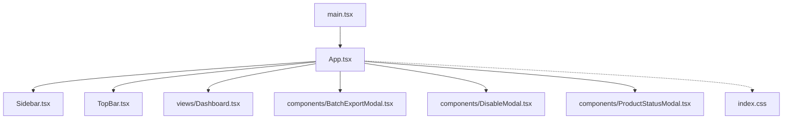
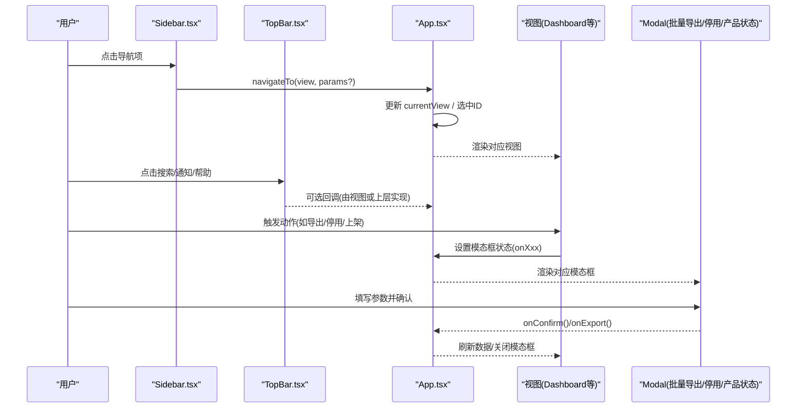
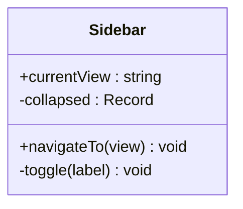
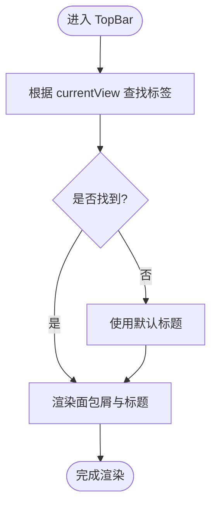
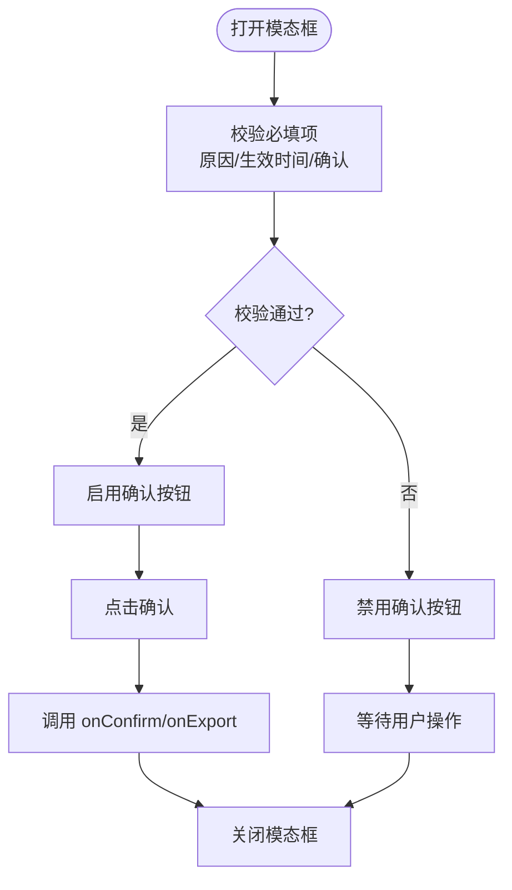
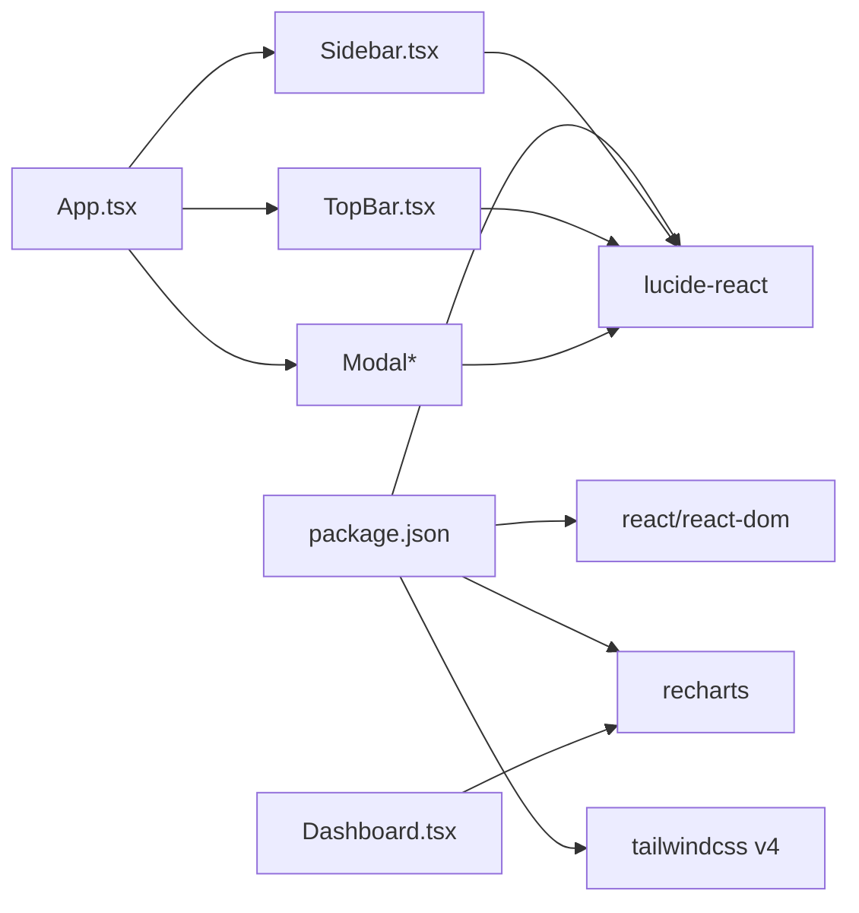

# 组件系统

<cite>
**本文引用的文件**
- [App.tsx](file://产品设计\UI-V1.0\src\App.tsx)
- [main.tsx](file://产品设计\UI-V1.0\src\main.tsx)
- [Sidebar.tsx](file://产品设计\UI-V1.0\src\components\Sidebar.tsx)
- [TopBar.tsx](file://产品设计\UI-V1.0\src\components\TopBar.tsx)
- [BatchExportModal.tsx](file://产品设计\UI-V1.0\src\components\BatchExportModal.tsx)
- [DisableModal.tsx](file://产品设计\UI-V1.0\src\components\DisableModal.tsx)
- [ProductStatusModal.tsx](file://产品设计\UI-V1.0\src\components\ProductStatusModal.tsx)
- [index.css](file://产品设计\UI-V1.0\src\index.css)
- [package.json](file://产品设计\UI-V1.0\package.json)
- [Dashboard.tsx](file://产品设计\UI-V1.0\src\views\Dashboard.tsx)
</cite>

## 目录
1. [简介](#简介)
2. [项目结构](#项目结构)
3. [核心组件](#核心组件)
4. [架构总览](#架构总览)
5. [详细组件分析](#详细组件分析)
6. [依赖关系分析](#依赖关系分析)
7. [性能考量](#性能考量)
8. [故障排查指南](#故障排查指南)
9. [结论](#结论)
10. [附录：样式与主题定制](#附录样式与主题定制)

## 简介
本文件面向 OverInsurData 平台的组件系统，聚焦可复用 UI 组件的设计原则、接口规范、样式系统与主题定制方案。文档覆盖模态框、导航栏、侧边栏等核心组件的实现细节与使用方法，并总结组件组合模式、状态管理与事件处理的最佳实践，帮助团队在统一设计语言下高效扩展与维护平台界面。

## 项目结构
- 入口与根应用
  - main.tsx 负责挂载 React 根节点并引入全局样式。
  - App.tsx 作为页面容器，组织侧边栏、顶部栏与内容区，并通过集中状态管理路由视图与模态框。
- 组件层
  - components/Sidebar.tsx：左侧导航，分组菜单、折叠展开、当前项高亮。
  - components/TopBar.tsx：顶部导航栏，面包屑、搜索、通知、用户头像。
  - components/*Modal.tsx：通用模态框族（批量导出、停用/启用保险公司、产品上架/下架）。
- 视图层
  - views/*：业务页面，通过 App 的 navigateTo 进行页面切换，并在需要时触发模态框。
- 样式与主题
  - index.css：定义颜色、圆角、玻璃拟态、按钮、输入、表格、徽章、卡片等基础样式；提供 CSS 变量用于主题定制。
- 依赖
  - package.json：React、Tailwind v4、Lucide 图标、Recharts 等。

图表来源
- [main.tsx:1-11](file://产品设计\UI-V1.0\src\main.tsx#L1-L11)
- [App.tsx:1-123](file://产品设计\UI-V1.0\src\App.tsx#L1-L123)
- [Sidebar.tsx:1-203](file://产品设计\UI-V1.0\src\components\Sidebar.tsx#L1-L203)
- [TopBar.tsx:1-135](file://产品设计\UI-V1.0\src\components\TopBar.tsx#L1-L135)
- [BatchExportModal.tsx:1-186](file://产品设计\UI-V1.0\src\components\BatchExportModal.tsx#L1-L186)
- [DisableModal.tsx:1-236](file://产品设计\UI-V1.0\src\components\DisableModal.tsx#L1-L236)
- [ProductStatusModal.tsx:1-206](file://产品设计\UI-V1.0\src\components\ProductStatusModal.tsx#L1-L206)
- [index.css:1-361](file://产品设计\UI-V1.0\src\index.css#L1-L361)

章节来源
- [main.tsx:1-11](file://产品设计\UI-V1.0\src\main.tsx#L1-L11)
- [App.tsx:1-123](file://产品设计\UI-V1.0\src\App.tsx#L1-L123)

## 核心组件
- 侧边栏 Sidebar
  - 职责：展示分组导航、维护折叠状态、高亮当前视图、触发页面跳转。
  - 关键接口：currentView、navigateTo(view)。
  - 数据模型：ViewId 联合类型、NavGroup 分组结构。
  - 交互：点击子项调用 navigateTo；分组标题可折叠/展开。
- 顶部栏 TopBar
  - 职责：显示面包屑、搜索、通知、帮助、用户头像。
  - 关键接口：currentView、navigateTo(view)。
  - 行为：根据 currentView 映射标题与面包屑路径。
- 模态框族（Modal）
  - BatchExportModal：批量导出配置（范围、格式、字段、关联数据），提交回调 onExport。
  - DisableModal：停用/启用保险公司，含影响面预览、原因选择、生效时间、确认勾选。
  - ProductStatusModal：产品上架/下架，含影响面预览、范围、原因、生效时间、确认勾选。
  - 共同特性：遮罩层、点击外部关闭、glass-strong 背景、表单校验控制确认按钮可用性。
- 视图 Dashboard
  - 使用 KPI 卡片、图表、筛选与导出按钮，体现组件组合与样式一致性。

章节来源
- [Sidebar.tsx:1-203](file://产品设计\UI-V1.0\src\components\Sidebar.tsx#L1-L203)
- [TopBar.tsx:1-135](file://产品设计\UI-V1.0\src\components\TopBar.tsx#L1-L135)
- [BatchExportModal.tsx:1-186](file://产品设计\UI-V1.0\src\components\BatchExportModal.tsx#L1-L186)
- [DisableModal.tsx:1-236](file://产品设计\UI-V1.0\src\components\DisableModal.tsx#L1-L236)
- [ProductStatusModal.tsx:1-206](file://产品设计\UI-V1.0\src\components\ProductStatusModal.tsx#L1-L206)
- [Dashboard.tsx:1-200](file://产品设计\UI-V1.0\src\views\Dashboard.tsx#L1-L200)

## 架构总览
应用采用“容器 + 组件”的分层组织：
- App 作为容器，集中管理视图路由与模态框显隐状态，向下传递导航与回调。
- Sidebar/TopBar 为布局型组件，负责导航与上下文信息展示。
- Modal 组件为无副作用的纯展示+本地状态组件，通过 props 暴露操作结果。
- 视图层通过 App 提供的 navigateTo 切换页面，必要时触发模态框。

图表来源
- [App.tsx:25-82](file://产品设计\UI-V1.0\src\App.tsx#L25-L82)
- [Sidebar.tsx:72-168](file://产品设计\UI-V1.0\src\components\Sidebar.tsx#L72-L168)
- [TopBar.tsx:32-135](file://产品设计\UI-V1.0\src\components\TopBar.tsx#L32-L135)
- [BatchExportModal.tsx:42-186](file://产品设计\UI-V1.0\src\components\BatchExportModal.tsx#L42-L186)
- [DisableModal.tsx:29-236](file://产品设计\UI-V1.0\src\components\DisableModal.tsx#L29-L236)
- [ProductStatusModal.tsx:29-206](file://产品设计\UI-V1.0\src\components\ProductStatusModal.tsx#L29-L206)

## 详细组件分析

### 侧边栏 Sidebar
- 设计要点
  - 分组导航：按业务域划分（保险公司管理、渠道管理），支持折叠/展开。
  - 状态同步：根据 currentView 高亮当前项，确保导航一致。
  - 可扩展性：新增菜单只需扩展 navGroups 配置与 ViewId 类型。
- 接口规范
  - Props：currentView（当前视图）、navigateTo（导航回调）。
  - 事件：点击子项触发 navigateTo。
- 复杂度与性能
  - 列表渲染为常量数组，O(n) 遍历；折叠状态使用局部 state，避免重渲染整棵树。
- 错误处理
  - 未匹配到 currentView 时不报错，保持默认高亮逻辑。

图表来源
- [Sidebar.tsx:72-168](file://产品设计\UI-V1.0\src\components\Sidebar.tsx#L72-L168)

章节来源
- [Sidebar.tsx:1-203](file://产品设计\UI-V1.0\src\components\Sidebar.tsx#L1-L203)

### 顶部栏 TopBar
- 设计要点
  - 面包屑：基于 VIEW_LABELS 映射，动态生成层级路径与标题。
  - 工具区：搜索、通知、帮助、用户头像，预留扩展点。
- 接口规范
  - Props：currentView、navigateTo。
  - 事件：点击返回仪表盘、打开通知/帮助（可由上层实现）。
- 复杂度与性能
  - 对象查找 O(1)，渲染开销低。

图表来源
- [TopBar.tsx:4-39](file://产品设计\UI-V1.0\src\components\TopBar.tsx#L4-L39)

章节来源
- [TopBar.tsx:1-135](file://产品设计\UI-V1.0\src\components\TopBar.tsx#L1-L135)

### 模态框族（Modal）
- 共性设计
  - 遮罩与定位：固定定位全屏遮罩，z-index 高于页面内容。
  - 交互：点击遮罩关闭；内部表单校验控制确认按钮可用。
  - 视觉：glass-strong 背景、阴影、圆角，保持一致的层级与质感。
- 批量导出 BatchExportModal
  - 能力：选择导出范围（筛选/已选/全部）、格式（xlsx/csv）、字段勾选、关联数据勾选。
  - 流程：选择后计算条数与字段数，导出时触发 onExport 并关闭。
- 停用/启用 DisableModal
  - 能力：区分停用/启用场景，展示影响面指标，选择原因、备注、生效时间，确认后提交。
  - 校验：必须选择原因、生效时间（立即或未来日期）、勾选确认。
- 产品状态 ProductStatusModal
  - 能力：上架/下架，展示影响面，选择范围（全部/指定州）、原因、备注、生效时间，确认后提交。
  - 校验：同 DisableModal。

图表来源
- [BatchExportModal.tsx:42-186](file://产品设计\UI-V1.0\src\components\BatchExportModal.tsx#L42-L186)
- [DisableModal.tsx:29-236](file://产品设计\UI-V1.0\src\components\DisableModal.tsx#L29-L236)
- [ProductStatusModal.tsx:29-206](file://产品设计\UI-V1.0\src\components\ProductStatusModal.tsx#L29-L206)

章节来源
- [BatchExportModal.tsx:1-186](file://产品设计\UI-V1.0\src\components\BatchExportModal.tsx#L1-L186)
- [DisableModal.tsx:1-236](file://产品设计\UI-V1.0\src\components\DisableModal.tsx#L1-L236)
- [ProductStatusModal.tsx:1-206](file://产品设计\UI-V1.0\src\components\ProductStatusModal.tsx#L1-L206)

### 视图与组合模式（以 Dashboard 为例）
- 组合方式
  - 使用统一的卡片、按钮、输入、徽章等样式类，保证视觉一致性。
  - 通过 select、button 等原生控件与 Tailwind 类组合出复杂交互。
- 数据与展示
  - 聚合数据计算（如保费总额、保单数）在组件内完成，图表使用 Recharts 渲染。
- 可复用性
  - 将 KPI 卡片、图表容器抽象为独立组件可进一步提升复用度。

章节来源
- [Dashboard.tsx:1-200](file://产品设计\UI-V1.0\src\views\Dashboard.tsx#L1-L200)

## 依赖关系分析
- 运行时依赖
  - React/ReactDOM：组件框架与渲染。
  - lucide-react：图标库，被 Sidebar、TopBar、Modal 广泛使用。
  - recharts：图表库，用于 Dashboard 等数据可视化。
  - tailwindcss v4：原子化样式框架，配合 index.css 的主题变量。
- 模块耦合
  - App 与 Sidebar/TopBar：松耦合，通过 props 通信。
  - 视图与 App：通过 navigateTo 与 onXxx 回调解耦。
  - Modal 与 App：通过状态提升与回调解耦，便于测试与复用。

图表来源
- [package.json:1-30](file://产品设计\UI-V1.0\package.json#L1-L30)
- [App.tsx:1-123](file://产品设计\UI-V1.0\src\App.tsx#L1-L123)
- [Sidebar.tsx:1-203](file://产品设计\UI-V1.0\src\components\Sidebar.tsx#L1-L203)
- [TopBar.tsx:1-135](file://产品设计\UI-V1.0\src\components\TopBar.tsx#L1-L135)
- [BatchExportModal.tsx:1-186](file://产品设计\UI-V1.0\src\components\BatchExportModal.tsx#L1-L186)
- [DisableModal.tsx:1-236](file://产品设计\UI-V1.0\src\components\DisableModal.tsx#L1-L236)
- [ProductStatusModal.tsx:1-206](file://产品设计\UI-V1.0\src\components\ProductStatusModal.tsx#L1-L206)
- [Dashboard.tsx:1-200](file://产品设计\UI-V1.0\src\views\Dashboard.tsx#L1-L200)

章节来源
- [package.json:1-30](file://产品设计\UI-V1.0\package.json#L1-L30)

## 性能考量
- 渲染优化
  - 导航与模态框均为轻量组件，局部 state 隔离，避免不必要重渲染。
  - 列表渲染使用静态配置（navGroups），减少计算开销。
- 样式性能
  - 大量使用 CSS 变量与 Tailwind 原子类，减少重复样式。
  - 玻璃拟态效果适度使用，注意移动端兼容性。
- 交互体验
  - 模态框确认按钮受表单校验控制，减少无效请求。
  - 滚动区域与遮罩层级合理设置，避免遮挡与抖动。

[本节为通用指导，无需特定文件引用]

## 故障排查指南
- 导航异常
  - 现象：点击侧边栏无响应或高亮不正确。
  - 排查：检查 currentView 是否与 ViewId 一致；确认 navigateTo 是否正确更新状态。
  - 参考位置：[Sidebar.tsx:72-168](file://产品设计\UI-V1.0\src\components\Sidebar.tsx#L72-L168)、[App.tsx:25-82](file://产品设计\UI-V1.0\src\App.tsx#L25-L82)
- 面包屑显示错误
  - 现象：TopBar 标题或面包屑不正确。
  - 排查：核对 VIEW_LABELS 映射；确认传入 currentView 值。
  - 参考位置：[TopBar.tsx:4-39](file://产品设计\UI-V1.0\src\components\TopBar.tsx#L4-L39)
- 模态框无法关闭或确认
  - 现象：点击遮罩无效或确认按钮不可用。
  - 排查：检查 onClick 事件绑定；确认表单校验条件（原因、生效时间、确认勾选）。
  - 参考位置：[DisableModal.tsx:51-236](file://产品设计\UI-V1.0\src\components\DisableModal.tsx#L51-L236)、[ProductStatusModal.tsx:45-206](file://产品设计\UI-V1.0\src\components\ProductStatusModal.tsx#L45-L206)、[BatchExportModal.tsx:58-186](file://产品设计\UI-V1.0\src\components\BatchExportModal.tsx#L58-L186)
- 样式错乱
  - 现象：玻璃拟态、按钮、输入样式异常。
  - 排查：确认 index.css 已引入；检查 Tailwind 版本与变量定义；浏览器兼容性与 backdrop-filter 支持。
  - 参考位置：[index.css:1-361](file://产品设计\UI-V1.0\src\index.css#L1-L361)

章节来源
- [Sidebar.tsx:72-168](file://产品设计\UI-V1.0\src\components\Sidebar.tsx#L72-L168)
- [TopBar.tsx:4-39](file://产品设计\UI-V1.0\src\components\TopBar.tsx#L4-L39)
- [DisableModal.tsx:51-236](file://产品设计\UI-V1.0\src\components\DisableModal.tsx#L51-L236)
- [ProductStatusModal.tsx:45-206](file://产品设计\UI-V1.0\src\components\ProductStatusModal.tsx#L45-L206)
- [BatchExportModal.tsx:58-186](file://产品设计\UI-V1.0\src\components\BatchExportModal.tsx#L58-L186)
- [index.css:1-361](file://产品设计\UI-V1.0\src\index.css#L1-L361)

## 结论
本组件系统以 App 为中心，通过清晰的 props/callBacks 契约组织 Sidebar、TopBar 与 Modal 族，形成一致的导航与交互范式。样式系统基于 Tailwind 与 CSS 变量，提供玻璃拟态与品牌色体系，便于主题定制与扩展。建议在后续迭代中进一步抽象通用组件（如 KPI 卡片、图表容器、表单控件），以提升复用率与可维护性。

[本节为总结，无需特定文件引用]

## 附录：样式与主题定制
- 主题变量
  - 颜色：primary、secondary、tertiary、surface、on-surface、outline、error、status-* 等。
  - 字体：sans、mono。
  - 圆角：xs、sm、md、lg、xl、2xl。
  - 玻璃拟态：glass-bg、glass-bg-strong、glass-shadow 等。
- 常用样式类
  - 表面：glass、glass-strong、glass-light、card、kpi-card。
  - 导航：nav-item、nav-sub-item、tab-bar/tab-item。
  - 数据：data-table、font-data。
  - 徽章：badge、badge-*。
  - 输入：input-glass（含 select 样式）。
  - 按钮：btn-primary、btn-secondary、btn-ghost。
  - 状态指示：orb、orb-*。
- 定制建议
  - 修改主题色：调整 @theme 中的颜色变量，即可全局生效。
  - 调整玻璃强度：修改 glass-bg/glass-shadow 变量。
  - 扩展按钮风格：在 .btn-* 基础上派生新类，保持间距与字号一致。
  - 适配深色模式：可在 :root 下增加 dark 变量集，并通过类名切换。

章节来源
- [index.css:4-49](file://产品设计\UI-V1.0\src\index.css#L4-L49)
- [index.css:64-361](file://产品设计\UI-V1.0\src\index.css#L64-L361)