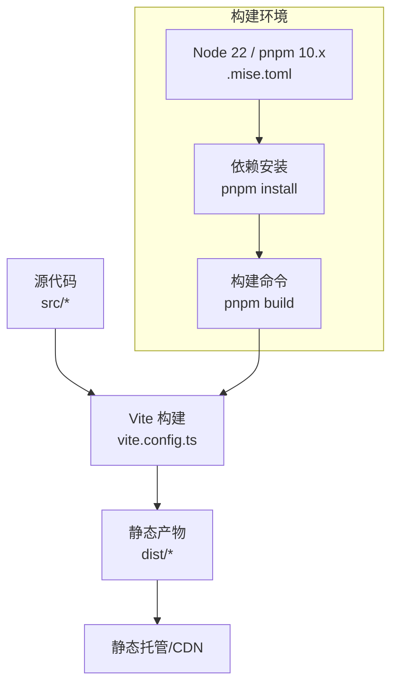
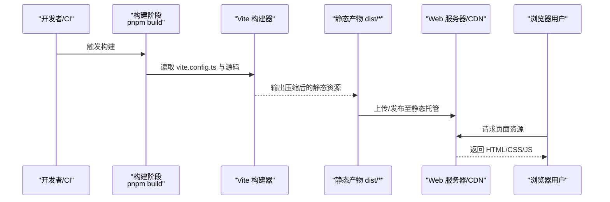
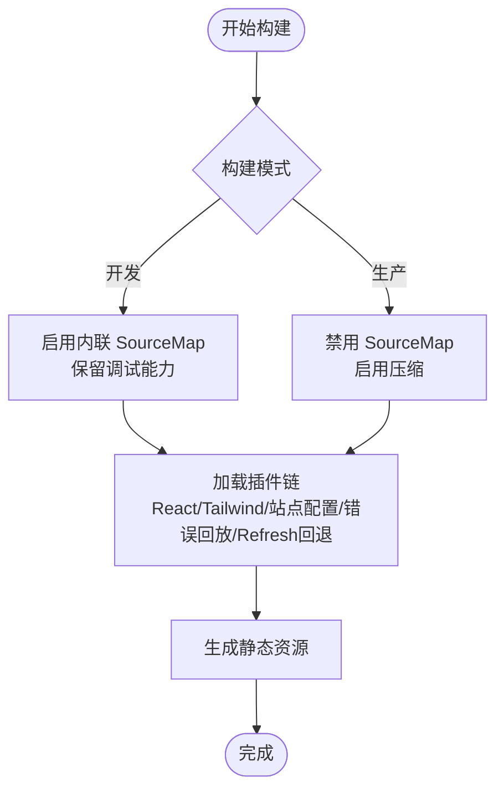
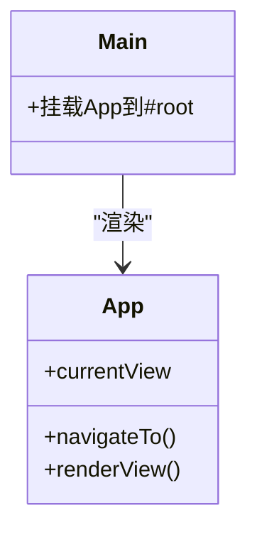
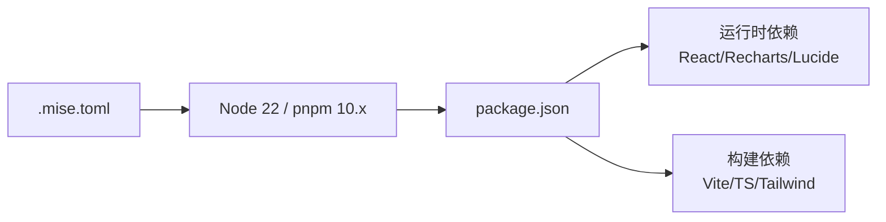

# 部署运维

<cite>
**本文引用的文件**
- [package.json](file://产品设计/UI-V1.0/package.json)
- [vite.config.ts](file://产品设计/UI-V1.0/vite.config.ts)
- [tsconfig.json](file://产品设计/UI-V1.0/tsconfig.json)
- [.figma/make/site.json](file://产品设计/UI-V1.0/.figma/make/site.json)
- [.mise.toml](file://产品设计/UI-V1.0/.mise.toml)
- [AGENTS.md](file://产品设计/UI-V1.0/AGENTS.md)
- [src/main.tsx](file://产品设计/UI-V1.0/src/main.tsx)
- [src/App.tsx](file://产品设计/UI-V1.0/src/App.tsx)
</cite>

## 目录
1. [简介](#简介)
2. [项目结构](#项目结构)
3. [核心组件](#核心组件)
4. [架构总览](#架构总览)
5. [详细组件分析](#详细组件分析)
6. [依赖分析](#依赖分析)
7. [性能考虑](#性能考虑)
8. [故障排除指南](#故障排除指南)
9. [结论](#结论)
10. [附录](#附录)

## 简介
本文件面向生产环境，提供 OverInsurData 平台（基于 React + Vite 的前端应用）的构建、部署与运维方案。内容涵盖：
- 生产环境构建配置与产物说明
- 容器化部署（Docker）与静态资源托管建议
- CI/CD 流水线设计与最佳实践
- 运行期监控、错误上报与日志管理策略
- 性能优化与容量规划建议
- 常见故障定位与排障流程

本项目为纯前端静态站点，通过 Vite 构建后由任意静态资源服务器或 CDN 提供服务。

## 项目结构
- 入口与运行时
  - src/main.tsx：React 应用挂载入口
  - src/App.tsx：主应用组件与视图路由逻辑
- 构建与工具链
  - package.json：脚本、依赖与开发/构建命令
  - vite.config.ts：Vite 构建、插件、别名、开发与预览服务配置
  - tsconfig.json：TypeScript 编译选项与模块解析
  - .figma/make/site.json：站点元信息（SEO、可访问性、robots 等）
  - .mise.toml：Node.js 与 pnpm 版本锁定
- 文档
  - AGENTS.md：开发服务器、项目结构与依赖说明

图表来源
- [vite.config.ts:9-43](file://产品设计/UI-V1.0/vite.config.ts#L9-L43)
- [.mise.toml:1-4](file://产品设计/UI-V1.0/.mise.toml#L1-L4)
- [package.json:6-10](file://产品设计/UI-V1.0/package.json#L6-L10)

章节来源
- [package.json:6-10](file://产品设计/UI-V1.0/package.json#L6-L10)
- [vite.config.ts:9-43](file://产品设计/UI-V1.0/vite.config.ts#L9-L43)
- [tsconfig.json:1-24](file://产品设计/UI-V1.0/tsconfig.json#L1-L24)
- [.figma/make/site.json:1-10](file://产品设计/UI-V1.0/.figma/make/site.json#L1-L10)
- [.mise.toml:1-4](file://产品设计/UI-V1.0/.mise.toml#L1-L4)
- [AGENTS.md:5-22](file://产品设计/UI-V1.0/AGENTS.md#L5-L22)

## 核心组件
- 构建与打包
  - Vite 作为构建工具，启用 React 与 Tailwind CSS v4 插件
  - 生产构建关闭 source map，开启压缩；开发模式内联 source map
  - 支持通过环境变量注入 base 路径与端口
- 应用入口
  - main.tsx 挂载 App 到 #root
  - App.tsx 负责视图切换与全局状态（侧边栏、顶部栏、模态框）
- 站点配置
  - site.json 控制 robots、可访问性等元信息
  - 构建时根据配置注入 SEO、Open Graph、Google Analytics 等标签

章节来源
- [vite.config.ts:9-43](file://产品设计/UI-V1.0/vite.config.ts#L9-L43)
- [vite.config.ts:72-213](file://产品设计/UI-V1.0/vite.config.ts#L72-L213)
- [src/main.tsx:1-11](file://产品设计/UI-V1.0/src/main.tsx#L1-L11)
- [src/App.tsx:25-82](file://产品设计/UI-V1.0/src/App.tsx#L25-L82)
- [.figma/make/site.json:1-10](file://产品设计/UI-V1.0/.figma/make/site.json#L1-L10)

## 架构总览
下图展示从源码到生产运行的整体流程：本地/CI 使用 Node 与 pnpm 安装依赖并执行构建，生成静态资源后由 Nginx/CDN 等静态服务器对外提供服务。

图表来源
- [package.json:6-10](file://产品设计/UI-V1.0/package.json#L6-L10)
- [vite.config.ts:9-43](file://产品设计/UI-V1.0/vite.config.ts#L9-L43)

## 详细组件分析

### 构建配置与产物
- 构建开关
  - 生产构建：关闭 source map，开启 minify
  - 开发构建：内联 source map，便于调试
- 基础路径与端口
  - base 可通过环境变量注入，适配子路径部署
  - 开发与预览默认监听 0.0.0.0:8443，严格端口模式
- 插件体系
  - React、Tailwind CSS v4
  - 站点配置注入（SEO、OG、robots、GA 等）
  - 错误覆盖层回放与 React Refresh 边界回退
  - Figma Make Kit（仅开发）

图表来源
- [vite.config.ts:9-43](file://产品设计/UI-V1.0/vite.config.ts#L9-L43)
- [vite.config.ts:72-213](file://产品设计/UI-V1.0/vite.config.ts#L72-L213)

章节来源
- [vite.config.ts:9-43](file://产品设计/UI-V1.0/vite.config.ts#L9-L43)
- [vite.config.ts:72-213](file://产品设计/UI-V1.0/vite.config.ts#L72-L213)

### 应用入口与视图组织
- main.tsx 将 App 挂载到 #root，并使用 StrictMode
- App.tsx 维护当前视图与参数，渲染侧边栏、顶部栏与主内容区，并根据视图 ID 动态加载对应页面组件

图表来源
- [src/main.tsx:1-11](file://产品设计/UI-V1.0/src/main.tsx#L1-L11)
- [src/App.tsx:25-82](file://产品设计/UI-V1.0/src/App.tsx#L25-L82)

章节来源
- [src/main.tsx:1-11](file://产品设计/UI-V1.0/src/main.tsx#L1-L11)
- [src/App.tsx:25-82](file://产品设计/UI-V1.0/src/App.tsx#L25-L82)

### 站点元信息与可访问性
- 通过 site.json 控制 robots、可访问性开关
- 构建时自动注入 meta、OG、Twitter Card、GA 脚本等
- 可生成 robots.txt 并在开发中间件响应

章节来源
- [.figma/make/site.json:1-10](file://产品设计/UI-V1.0/.figma/make/site.json#L1-L10)
- [vite.config.ts:72-213](file://产品设计/UI-V1.0/vite.config.ts#L72-L213)

## 依赖分析
- 运行时依赖
  - React 19、React DOM 19
  - 可视化库 recharts
  - 图标 lucide-react
- 构建与样式
  - Vite 8、@vitejs/plugin-react
  - Tailwind CSS v4 与 @tailwindcss/vite
  - TypeScript 5.7
- 工具链版本
  - Node.js 22、pnpm 10.34.3（通过 .mise.toml 锁定）

图表来源
- [package.json:12-28](file://产品设计/UI-V1.0/package.json#L12-L28)
- [.mise.toml:1-4](file://产品设计/UI-V1.0/.mise.toml#L1-L4)

章节来源
- [package.json:12-28](file://产品设计/UI-V1.0/package.json#L12-L28)
- [.mise.toml:1-4](file://产品设计/UI-V1.0/.mise.toml#L1-L4)

## 性能考虑
- 构建产物
  - 生产构建已启用压缩；如需更细粒度控制，可在构建后对静态资源进行 Brotli/Gzip 压缩
  - 按需引入第三方库，避免全量引入导致包体过大
- 缓存策略
  - 利用文件名哈希（Vite 默认）配合 CDN 长缓存
  - 对 index.html 设置短缓存或无缓存，确保更新及时生效
- 网络优化
  - 启用 HTTP/2 与 TLS 1.3
  - 合理设置 Cache-Control、ETag、Last-Modified
  - 使用 CDN 就近分发静态资源
- 客户端体验
  - 首屏资源拆分与懒加载（按路由/组件）
  - 图片与图表资源按需加载与尺寸优化
- 监控指标
  - 首屏时间、FCP/LCP、TTI、错误率、接口失败率（如后续接入后端）

[本节为通用性能建议，不直接分析具体代码文件]

## 故障排除指南
- 构建失败
  - 检查 Node/pnpm 版本是否与 .mise.toml 一致
  - 清理缓存后重试：删除 node_modules 与锁文件后重新安装
  - 查看构建日志中的 TS/Vite 错误提示
- 开发服务器异常
  - 端口占用：修改 PORT 环境变量或释放端口
  - HMR 不生效：确认浏览器控制台无阻塞错误，必要时刷新
- 生产访问问题
  - 确认 base 路径与环境变量是否正确
  - 检查静态资源是否完整上传且未被拦截
  - 验证 robots/meta/OG 等注入是否符合预期
- 错误观测
  - 在 site.json 中配置 Google Analytics ID，以便在构建时注入统计脚本
  - 结合浏览器开发者工具与 CDN/服务器访问日志定位问题

章节来源
- [vite.config.ts:9-43](file://产品设计/UI-V1.0/vite.config.ts#L9-L43)
- [vite.config.ts:72-213](file://产品设计/UI-V1.0/vite.config.ts#L72-L213)
- [.mise.toml:1-4](file://产品设计/UI-V1.0/.mise.toml#L1-L4)
- [AGENTS.md:5-22](file://产品设计/UI-V1.0/AGENTS.md#L5-L22)

## 结论
OverInsurData 前端采用 Vite + React + Tailwind 的现代技术栈，具备清晰的构建与部署模型。生产环境应遵循“固定工具链版本、标准化构建脚本、静态资源 CDN 化、完善监控与日志”的原则，以确保高可用与可维护性。

[本节为总结性内容，不直接分析具体代码文件]

## 附录

### 生产环境构建与部署流程（推荐）
- 环境与依赖
  - 使用 Node 22 与 pnpm 10.x（参考 .mise.toml）
  - 安装依赖：pnpm install
- 构建
  - 执行构建：pnpm build
  - 产物位于 dist 目录，包含压缩后的 HTML/CSS/JS
- 发布
  - 将 dist 目录部署至 Nginx、Apache、对象存储（S3/OSS）或任意静态托管服务
  - 若部署于子路径，设置 base 环境变量后再构建
- 回滚
  - 保留历史版本产物，快速切流回滚

章节来源
- [package.json:6-10](file://产品设计/UI-V1.0/package.json#L6-L10)
- [vite.config.ts:9-43](file://产品设计/UI-V1.0/vite.config.ts#L9-L43)
- [.mise.toml:1-4](file://产品设计/UI-V1.0/.mise.toml#L1-L4)

### Docker 容器化部署（推荐）
- 多阶段构建镜像
  - 构建阶段：安装 Node 与 pnpm，执行 pnpm install 与 pnpm build
  - 运行阶段：使用轻量级 Nginx 镜像，将 dist 复制到静态目录并暴露 80/443
- 环境变量
  - 可通过构建时注入 FIGMA_PUBLIC_URL 以设置 base
  - 生产镜像无需暴露 8443，仅暴露 Web 端口
- 健康检查与滚动升级
  - 增加健康检查探针（/ 或自定义健康页）
  - 结合编排平台实现蓝绿/金丝雀发布

[本节为容器化最佳实践建议，不直接分析具体代码文件]

### CI/CD 流水线（推荐）
- 触发条件
  - 推送至主干分支或创建合并请求时触发
- 步骤
  - 安装依赖：pnpm install
  - 类型检查与格式化：可选（依据团队规范）
  - 构建：pnpm build
  - 产物校验：检查 dist 非空与关键资源存在
  - 部署：上传至静态托管/CDN 或触发发布任务
- 缓存
  - 缓存 node_modules 与 pnpm store，加速构建
- 安全与合规
  - 扫描依赖漏洞
  - 限制敏感环境变量（如 GA ID、CDN 密钥）

[本节为流水线设计建议，不直接分析具体代码文件]

### 运行期监控与日志管理（推荐）
- 前端监控
  - 通过 site.json 注入 Google Analytics 或其他埋点 SDK
  - 采集页面错误、白屏、长任务与性能指标
- 服务端/CDN 日志
  - 收集访问日志、错误日志与带宽指标
  - 结合日志平台进行告警与趋势分析
- 可用性
  - 配置多区域 CDN 与健康检查
  - 设置错误页与降级策略

[本节为监控与日志建议，不直接分析具体代码文件]

### 环境管理与最佳实践
- 版本锁定
  - 使用 .mise.toml 锁定 Node/pnpm 版本，保证构建一致性
- 环境变量
  - 区分开发/测试/生产环境变量（如 base 路径、GA ID）
- 构建产物
  - 保留构建记录与产物快照，便于审计与回滚
- 安全
  - 最小权限原则访问托管服务
  - 定期更新依赖与镜像基础版本

[本节为环境管理建议，不直接分析具体代码文件]