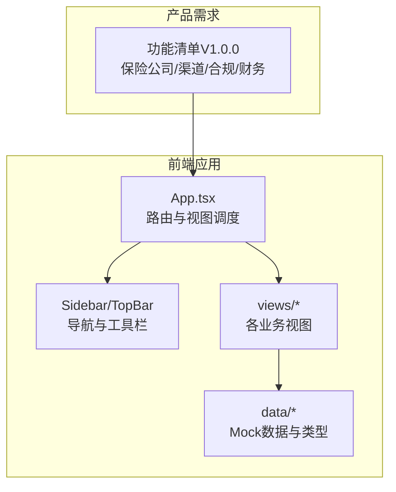
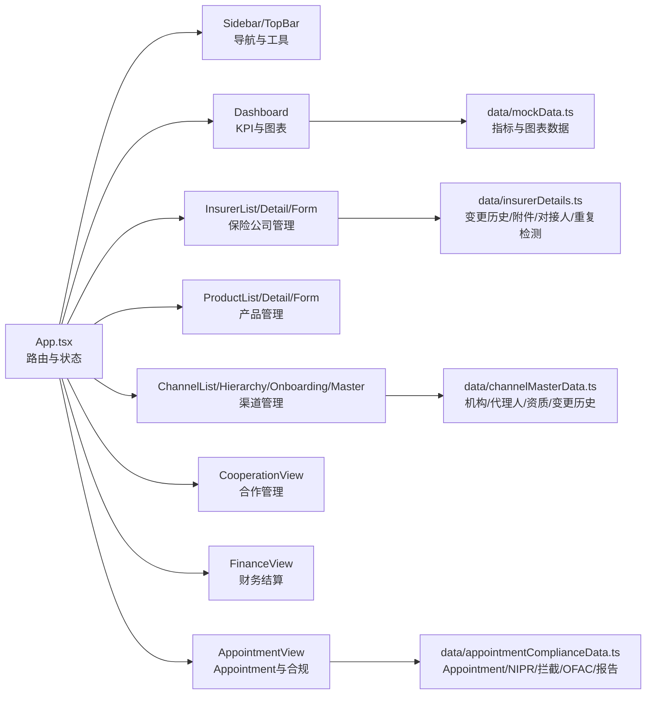
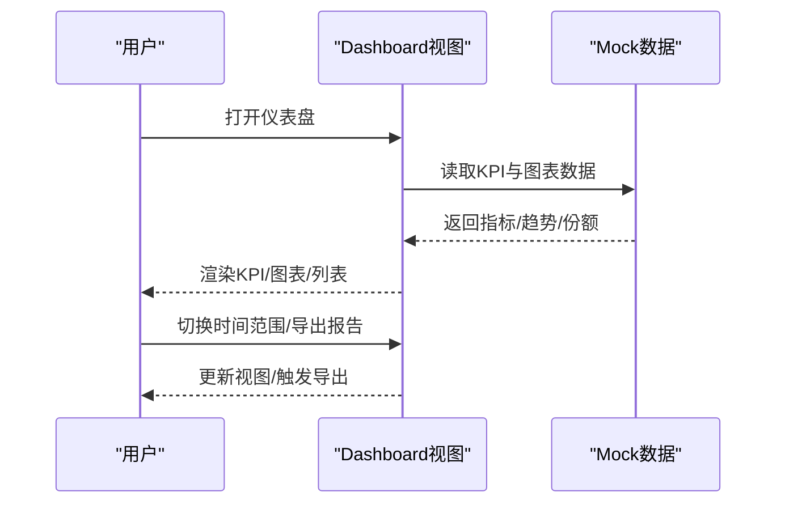
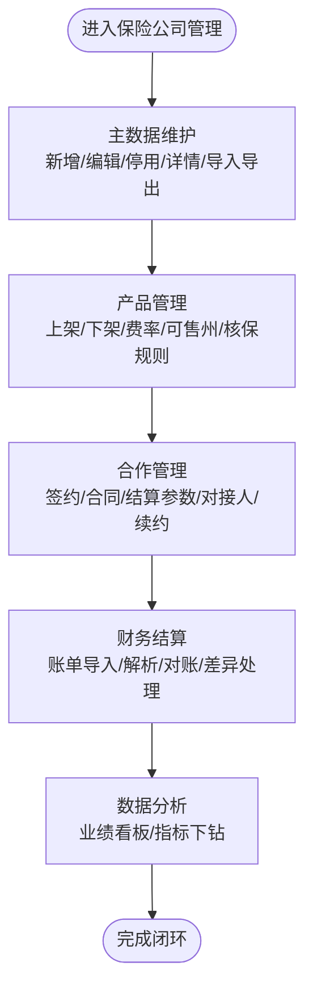
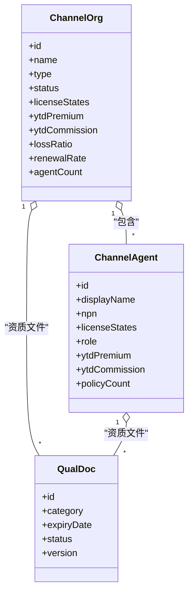
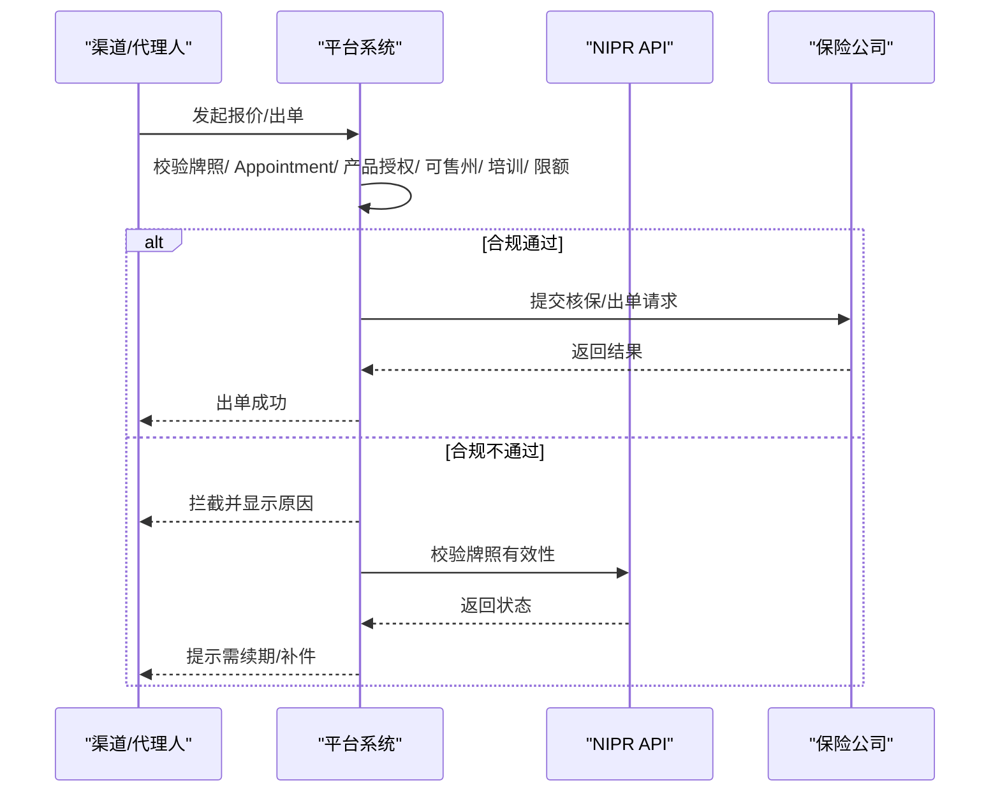
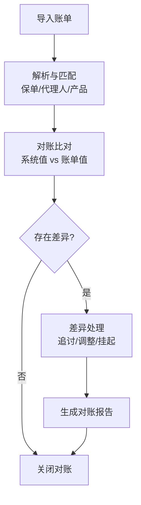
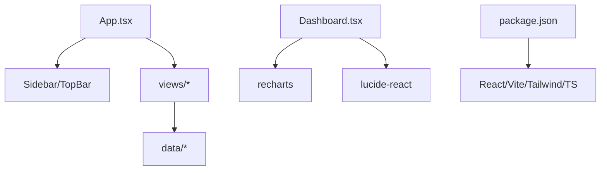

# 项目概述

<cite>
**本文引用的文件**
- [产品功能清单_V1.0.0.md](file://产品需求\产品功能清单_V1.0.0.md)
- [package.json](file://产品设计\UI-V1.0\package.json)
- [App.tsx](file://产品设计\UI-V1.0\src\App.tsx)
- [Dashboard.tsx](file://产品设计\UI-V1.0\src\views\Dashboard.tsx)
- [insurerDetails.ts](file://产品设计\UI-V1.0\src\data\insurerDetails.ts)
- [channelMasterData.ts](file://产品设计\UI-V1.0\src\data\channelMasterData.ts)
- [appointmentComplianceData.ts](file://产品设计\UI-V1.0\src\data\appointmentComplianceData.ts)
</cite>

## 目录
1. [引言](#引言)
2. [项目结构](#项目结构)
3. [核心组件](#核心组件)
4. [架构总览](#架构总览)
5. [详细组件分析](#详细组件分析)
6. [依赖关系分析](#依赖关系分析)
7. [性能与可扩展性](#性能与可扩展性)
8. [故障排查指南](#故障排查指南)
9. [结论](#结论)

## 引言
OverInsurData海外保险数字化管理平台面向美国市场，围绕“保险公司管理、渠道管理、合规管理、财务管理”等核心域，构建从上游保险公司资源接入到下游渠道出单的全链路数字化能力。平台以NAIC编码、Appointment流程、州级监管要求为核心约束，提供产品上下架、费率方案、核保规则、佣金结算、对账差异处理、NIPR牌照校验、OFAC制裁筛查、合规报告生成等关键能力，帮助保险中介/聚合平台实现合规、高效、可审计的海外保险业务运营。

本概述旨在为初学者建立清晰认知框架：理解平台目标、模块边界、数据流转与合规要点，并了解前端技术栈与页面组织方式，便于后续深入阅读代码或参与迭代。

## 项目结构
项目由“产品需求文档”和“UI原型（React + Vite）”两部分组成：
- 产品需求：定义操作级功能清单，覆盖保险公司主数据、产品管理、合作管理、Appointment与合规、财务结算、数据分析等。
- UI原型：基于React/Vite的前端应用，包含侧边导航、顶部栏、多视图页面与Mock数据，用于演示业务流程与交互。

图表来源
- [App.tsx:1-123](file://产品设计\UI-V1.0\src\App.tsx#L1-L123)
- [package.json:1-30](file://产品设计\UI-V1.0\package.json#L1-L30)

章节来源
- [产品功能清单_V1.0.0.md:1-800](file://产品需求\产品功能清单_V1.0.0.md#L1-L800)
- [package.json:1-30](file://产品设计\UI-V1.0\package.json#L1-L30)
- [App.tsx:1-123](file://产品设计\UI-V1.0\src\App.tsx#L1-L123)

## 核心组件
- 仪表盘（Dashboard）：展示KPI（保费、保单数、渠道数、佣金收入）、保费趋势、市场份额、待办事项、近期操作等，支撑管理层快速掌握业务健康度。
- 保险公司管理：主数据维护、产品管理、合作管理、Appointment与合规、财务结算、数据分析等完整生命周期。
- 渠道管理：渠道主数据、层级与组织架构、入驻与准入、授权与出单权限、佣金方案与结算、绩效考核、培训认证、门户、数据分析。
- 合规管理：Appointment申请/跟踪/续期/终止、NIPR牌照校验、出单合规拦截、合规报告、OFAC制裁筛查。
- 财务管理：佣金账单导入/解析、对账与差异处理、结算周期配置、保费对账。

章节来源
- [产品功能清单_V1.0.0.md:1-800](file://产品需求\产品功能清单_V1.0.0.md#L1-L800)

## 架构总览
平台采用“前端视图驱动+Mock数据”的原型架构，通过App集中路由到各业务视图；视图层调用统一的数据模型与Mock数据，模拟真实业务场景。未来可平滑替换为后端API服务，保持前后端解耦。

图表来源
- [App.tsx:1-123](file://产品设计\UI-V1.0\src\App.tsx#L1-L123)
- [Dashboard.tsx:1-348](file://产品设计\UI-V1.0\src\views\Dashboard.tsx#L1-L348)
- [insurerDetails.ts:1-140](file://产品设计\UI-V1.0\src\data\insurerDetails.ts#L1-L140)
- [channelMasterData.ts:1-449](file://产品设计\UI-V1.0\src\data\channelMasterData.ts#L1-L449)
- [appointmentComplianceData.ts:1-200](file://产品设计\UI-V1.0\src\data\appointmentComplianceData.ts#L1-L200)

## 详细组件分析

### 仪表盘（Dashboard）
- 功能要点：KPI卡片（本年总保费、有效保单数、合作渠道数、本年佣金收入）、保费趋势折线图、市场份额饼图、待办事项列表、保险公司业绩排名、近期操作日志。
- 数据来源：使用Mock数据计算汇总值与图表数据，支持时间范围切换与导出报告入口。
- 交互设计：点击表格行跳转至保险公司列表；图表支持Tooltip与图例切换。

图表来源
- [Dashboard.tsx:1-348](file://产品设计\UI-V1.0\src\views\Dashboard.tsx#L1-L348)

章节来源
- [Dashboard.tsx:1-348](file://产品设计\UI-V1.0\src\views\Dashboard.tsx#L1-L348)

### 保险公司管理
- 主数据管理：新增/编辑/停用启用/详情查看/列表查询/批量导入导出/变更历史/重复数据检测。
- 产品管理：新增/编辑/上下架/详情/列表/费率方案/可售州/核保规则/培训材料/业绩看板。
- 合作管理：合作关系建立/终止/合同协议/结算参数/对接人/续约管理。
- 财务结算：佣金账单导入/解析/对账/差异处理/结算周期配置/保费对账。
- 数据分析：保险公司维度业绩与指标下钻。

图表来源
- [产品功能清单_V1.0.0.md:1-800](file://产品需求\产品功能清单_V1.0.0.md#L1-L800)

章节来源
- [产品功能清单_V1.0.0.md:1-800](file://产品需求\产品功能清单_V1.0.0.md#L1-L800)
- [insurerDetails.ts:1-140](file://产品设计\UI-V1.0\src\data\insurerDetails.ts#L1-L140)

### 渠道管理
- 渠道主数据：机构/代理人信息、执照州、联系方式、绩效指标。
- 层级与组织架构：上级机构、分支、GA合作模式。
- 入驻与准入：背景调查、资质文件、审批流。
- 授权与出单权限：产品授权、出单限额、培训认证。
- 佣金方案与结算：佣金计算、结算周期、支付。
- 绩效考核：业绩、赔付率、续保率、活动活跃度。
- 培训认证：必修/选修课程、考试、有效期。
- 门户Portal：渠道自助服务。
- 数据分析：渠道维度业绩与风险指标。

图表来源
- [channelMasterData.ts:1-449](file://产品设计\UI-V1.0\src\data\channelMasterData.ts#L1-L449)

章节来源
- [channelMasterData.ts:1-449](file://产品设计\UI-V1.0\src\data\channelMasterData.ts#L1-L449)

### 合规管理（Appointment与州监管）
- Appointment申请/状态跟踪/续期/终止：按州、业务线、保险公司维度管理代理人的销售授权。
- NIPR牌照校验：实时校验代理人持牌状态、持牌州与业务线，异常自动标记与通知。
- 出单合规拦截：在报价/出单时校验牌照、Appointment、产品授权、可售州、培训认证、出单限额等，不满足则拦截并提示原因。
- 合规报告：按州监管要求自动生成Appointment、持牌、销售活动等报告，支持定时生成与提交记录。
- OFAC制裁筛查：入驻与出单环节自动筛查制裁名单，命中则拒绝或转人工复核。

图表来源
- [appointmentComplianceData.ts:1-200](file://产品设计\UI-V1.0\src\data\appointmentComplianceData.ts#L1-L200)

章节来源
- [appointmentComplianceData.ts:1-200](file://产品设计\UI-V1.0\src\data\appointmentComplianceData.ts#L1-L200)
- [产品功能清单_V1.0.0.md:1-800](file://产品需求\产品功能清单_V1.0.0.md#L1-L800)

### 财务管理
- 佣金账单导入/解析：支持CSV/Excel/EDI/API拉取，字段映射与错误报告。
- 对账与差异处理：逐笔比对系统计算值与账单金额，标记差异并分类，支持追讨/红字调整/挂起。
- 结算周期配置：按保险公司设置结算周期、截止日、对账期限、付款期限、支付方式与货币。
- 保费对账：导入保险公司保费收入明细，匹配系统保单并进行比对与差异处理。

图表来源
- [产品功能清单_V1.0.0.md:1-800](file://产品需求\产品功能清单_V1.0.0.md#L1-L800)

章节来源
- [产品功能清单_V1.0.0.md:1-800](file://产品需求\产品功能清单_V1.0.0.md#L1-L800)

## 依赖关系分析
- 前端路由依赖：App.tsx集中管理视图切换与参数传递，依赖Sidebar/TopBar进行导航与工具栏控制。
- 数据依赖：各视图依赖data目录中的Mock数据与类型定义，如insurerDetails.ts、channelMasterData.ts、appointmentComplianceData.ts。
- 可视化依赖：Dashboard使用Recharts进行图表渲染，lucide-react提供图标。
- 构建依赖：package.json声明了React、Vite、TailwindCSS、TypeScript等开发依赖。

图表来源
- [App.tsx:1-123](file://产品设计\UI-V1.0\src\App.tsx#L1-L123)
- [Dashboard.tsx:1-348](file://产品设计\UI-V1.0\src\views\Dashboard.tsx#L1-L348)
- [package.json:1-30](file://产品设计\UI-V1.0\package.json#L1-L30)

章节来源
- [App.tsx:1-123](file://产品设计\UI-V1.0\src\App.tsx#L1-L123)
- [package.json:1-30](file://产品设计\UI-V1.0\package.json#L1-L30)

## 性能与可扩展性
- 前端性能：Dashboard使用响应式图表与分页/筛选，建议在生产环境引入虚拟滚动与缓存策略，减少重渲染。
- 数据层扩展：当前为Mock数据，建议逐步替换为REST/GraphQL API，并提供接口契约与版本管理。
- 合规规则引擎：将合规拦截规则抽象为可配置的策略库，支持动态加载与优先级排序，便于州监管变化时的快速适配。
- 报表与导出：对大体积导出任务采用异步队列与分片下载，避免阻塞主线程。

[本节为通用指导，不直接分析具体文件]

## 故障排查指南
- 合规拦截问题：检查Appointment状态、牌照有效性、产品授权与可售州、培训认证与出单限额；查看拦截日志与原因描述，定位具体规则触发点。
- 牌照到期问题：关注NIPR校验结果与到期提醒，及时续期并更新系统状态。
- 对账差异：核对保单匹配、代理人匹配、产品匹配结果，确认系统计算逻辑与账单来源一致性，必要时生成调整单或发起追讨。
- 导入错误：根据错误报告定位行号与字段，修正模板或映射后重试。

章节来源
- [appointmentComplianceData.ts:1-200](file://产品设计\UI-V1.0\src\data\appointmentComplianceData.ts#L1-L200)
- [产品功能清单_V1.0.0.md:1-800](file://产品需求\产品功能清单_V1.0.0.md#L1-L800)

## 结论
OverInsurData平台以“合规先行、数据驱动、流程闭环”为设计理念，围绕NAIC编码、Appointment流程与州级监管要求，构建了覆盖保险公司管理、渠道管理、合规管理与财务管理的完整数字化体系。通过可视化的仪表盘、严谨的合规拦截与对账机制，平台能够有效支撑海外保险业务的规模化增长与风险控制。未来建议在数据层与服务层持续演进，强化规则引擎与API集成能力，进一步提升系统的可维护性与扩展性。