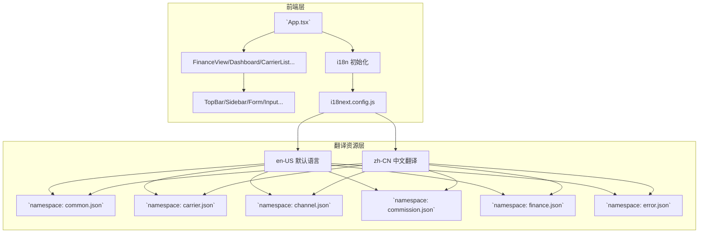

# 海外保险数字化平台 — 保险公司管理与渠道管理 产品需求文档（PRD）

| 项目 | 内容 |
|---|---|
| **文档版本** | V1.0.0 |
| **创建日期** | 2026-08-21 |
| **最后更新** | 2026-08-28 |
| **文档状态** | 正式版 |
| **目标市场** | 美国（United States） |
| **监管框架** | NAIC / 各州保险监管局 |
| **语言策略** | en-US（默认）+ zh-CN（可选） |

---

## 目录

- [第一章 文档概述](#第一章-文档概述)
  - [1.1 背景与问题](#11-背景与问题)
  - [1.2 产品目标](#12-产品目标)
  - [1.3 范围与非目标](#13-范围与非目标)
  - [1.4 目标读者](#14-目标读者)
  - [1.5 术语表](#15-术语表)
- [第二章 用户角色与权限](#第二章-用户角色与权限)
  - [2.1 角色定义](#21-角色定义)
  - [2.2 数据权限规则](#22-数据权限规则)
- [第三章 系统整体架构](#第三章-系统整体架构)
  - [3.1 架构设计原则](#31-架构设计原则)
- [第四章 国际化与多语言支持](#第四章-国际化与多语言支持)
  - [4.1 国际化框架选型](#41-国际化框架选型)
  - [4.2 技术架构概览](#42-技术架构概览)
  - [4.3 翻译 Key 命名规范](#43-翻译-key-命名规范)
  - [4.4 代码实践指南](#44-代码实践指南)
  - [4.5 配置文件](#45-配置文件)
  - [4.6 UI 设计规范](#46-ui-设计规范)
  - [4.7 保险专业术语库](#47-保险专业术语库)
  - [4.8 测试验证清单](#48-测试验证清单)
  - [4.9 翻译工作流程](#49-翻译工作流程)
  - [4.10 阶段性里程碑](#410-阶段性里程碑)
  - [4.11 扩展规划](#411-扩展规划)
- [第五章 核心业务场景](#第五章-核心业务场景)
  - [5.1 场景一：新渠道入驻全流程](#51-场景一新渠道入驻全流程)
  - [5.2 场景二：代理人报价出单与合规校验](#52-场景二代理人报价出单与合规校验)
  - [5.3 场景三：佣金计算与结算](#53-场景三佣金计算与结算)
- [第六章 功能需求详述](#第六章-功能需求详述)
  - [6.1 模块一：保险公司管理](#61-模块一保险公司管理)
  - [6.2 模块二：渠道管理](#62-模块二渠道管理)
- [第七章 佣金引擎详细设计](#第七章-佣金引擎详细设计)
  - [7.1 佣金计算全流程](#71-佣金计算全流程)
  - [7.2 规则维度与匹配优先级](#72-规则维度与匹配优先级)
  - [7.3 佣金类型体系](#73-佣金类型体系)
  - [7.4 退保追回（Chargeback）规则](#74-退保追回chargeback规则)
- [第八章 出单合规校验设计](#第八章-出单合规校验设计)
  - [8.1 8步校验链路](#81-8步校验链路)
- [第九章 数据模型设计](#第九章-数据模型设计)
  - [9.1 核心实体关系](#91-核心实体关系)
  - [9.2 核心主数据表](#92-核心主数据表)
  - [9.3 数据字典体系](#93-数据字典体系)
- [第十章 非功能需求](#第十章-非功能需求)
  - [10.1 安全与合规](#101-安全与合规)
  - [10.2 性能与可用性](#102-性能与可用性)
  - [10.3 集成需求](#103-集成需求)
- [第十一章 优先级与实施规划](#第十一章-优先级与实施规划)
  - [11.1 功能优先级](#111-功能优先级)
- [附录A 版本历史](#附录a-版本历史)

---

# 第一章 文档概述

## 1.1 背景与问题

海外保险数字化平台面向美国保险市场，需要同时管理上游保险公司（Carrier）和下游分销渠道（Agency / Broker / MGA / Agent）。当前行业存在以下核心痛点：

- **保险公司主数据分散：** 各保险公司的产品、费率、可售州、佣金方案信息散落在 Excel 和邮件中，缺乏统一管理，渠道无法实时获取准确的产品和佣金信息。
- **渠道层级复杂：** 美国保险分销体系包含 FMO→Agency→Branch→Agent 多级层级，以及 MGA、Wholesale Broker 等特殊角色，层级关系和佣金分润（Override）计算高度复杂，人工处理易错且效率低。
- **合规风险高：** 美国保险以州为单位监管，代理人必须在每个州持有牌照（License）并获得保险公司的 Appointment 才能出单，人工校验容易遗漏，导致违规出单。
- **佣金结算低效：** 佣金规则涉及首年/续年递减、阶梯佣金、Override、退保追回（Chargeback）等多种维度，与保险公司账单对账耗时长，差异处理缺乏系统化流程。
- **渠道入驻周期长：** 新渠道入驻涉及资质审核、NIPR 牌照校验、背景调查、合同签署、Appointment 申请、培训认证等多环节，缺乏线上化流程，平均入驻周期超过 2 周。
- **多语言协作困难：** 平台需同时服务美国本地用户和中国运营团队，双语文档和界面缺失影响协作效率。

## 1.2 产品目标

本平台旨在构建一套覆盖保险公司管理与渠道管理全链路的数字化系统，实现以下目标：

1. **主数据统一：** 建立保险公司、产品、渠道、代理人的统一主数据中心，支持多维度关联和实时查询。
2. **渠道全生命周期管理：** 从入驻申请、资质审核、合同签署、Appointment 授权到层级管理、绩效考核、退出，全流程线上化。
3. **佣金自动化：** 构建可配置的佣金规则引擎，实现佣金自动计算、对账、结算和支付，将人工干预降至最低。
4. **合规自动化：** 出单前自动校验牌照、Appointment、产品授权、培训认证，违规即拦截，确保 100% 合规出单。
5. **渠道自助服务：** 提供代理人门户，支持在线报价、出单、保单管理、佣金查询、培训学习，降低运营成本。
6. **国际化支持：** 全平台中英文双语切换，支持中美两地用户高效协作，默认英文符合目标市场。

## 1.3 范围与非目标

### 本期范围（In Scope）

| 模块 | 覆盖内容 |
|---|---|
| 保险公司管理 | 保险公司主数据、产品管理、产品费率方案、我司与保险公司合作管理、Appointment 与合规、保险公司财务对账、保险公司数据分析 |
| 渠道管理 | 渠道组织/代理人主数据、层级与组织架构、入驻与准入、渠道产品授权与出单权限管理、佣金方案配置、佣金计算与结算、绩效考核、培训认证、渠道门户 |
| 佣金引擎 | 多维规则配置、逐单计算、层级 Override 汇总、退保追回、阶梯佣金、对账引擎、结算支付 |
| 国际化支持 | react-i18next 框架集成、en-US 基础语言包、zh-CN 中文翻译（Phase 0-P0）、语言切换 UI 组件、LocalStorage 持久化、翻译进度跟踪 |

### 非目标（Out of Scope）

- **核心保单系统：** 本期不包含保单核心系统（承保、理赔、保全）的开发，仅通过 API 与外部核心保单系统集成。
- **费率引擎：** 产品定价和费率计算由保险公司核心系统或独立费率引擎负责，本平台仅存储费率方案引用和传递报价请求。
- **理赔管理：** 理赔报案、查勘、定损、赔付不在本期范围内。
- **客户 CRM：** 终端客户（投保人）的完整 CRM 功能不在本期，代理人门户仅包含基础客户信息管理。
- **财务总账：** 本平台生成佣金支付指令后，由外部财务系统完成总账记账和支付，本平台不替代财务系统。
- **再保险管理：** 再保险合约、分保、赔款分摊不在本期范围。
- **其他语言扩展：** 首期仅支持 en-US + zh-CN，西班牙语等未来扩展预留但不在本期开发。

## 1.4 目标读者

| 角色 | 关注点 | 使用方式 |
|---|---|---|
| 产品经理 | 需求范围、用户场景、验收标准 | 作为需求基线，指导后续设计和迭代 |
| 研发负责人 | 系统架构、数据模型、接口依赖、技术可行性 | 进行技术方案设计和工作量评估 |
| 测试负责人 | 功能点、异常路径、验收标准、测试范围 | 编写测试用例和测试计划 |
| 业务运营方 | 业务流程、操作功能、合规要求、效率提升 | 确认需求符合业务实际，准备运营 SOP |
| 合规/风控 | 合规校验逻辑、牌照管理、审计日志、数据安全 | 审核合规设计是否满足监管要求 |
| 国际化管理员 | 翻译进度、术语准确性、双语验收 | 维护翻译文件，审核专业术语，跟踪 i18n 进度 |

## 1.5 术语表

| 术语 | 定义 |
|---|---|
| Carrier | 保险公司，承担承保风险的主体 |
| Agent | 代理人，代表保险公司销售保单，分为 Captive（专属）和 Independent（独立） |
| Broker | 经纪人，代表客户利益，对比多家保险公司产品 |
| MGA | Managing General Agent，管理总代理，持有保险公司委托的核保和出单权限 |
| FMO/IMO/BGA | 顶层营销组织，Field/Independent Marketing Organization / Brokerage General Agency |
| Appointment | 保险公司在州监管层面对代理人的授权，代理人必须获得 Appointment 才能在该州销售该公司产品 |
| NPN | National Producer Number，全美代理人唯一编号，由 NIPR 管理 |
| NIPR | National Insurance Producer Registry，全美保险代理人注册中心，提供牌照查询 API |
| NAIC | National Association of Insurance Commissioners，全美保险监管官协会 |
| Override | 管理层级佣金，上级对下级业绩提取的管理津贴 |
| Chargeback | 退保追回，保单在一定期限内退保时，追回已支付的佣金 |
| E&O Insurance | Errors & Omissions，职业责任险，代理人/机构必须持有的责任险 |
| LOB | Line of Business，业务线，如 Auto、Home、Life、Health 等 |
| Surplus Lines / E&S | 非标准市场/剩余保险市场，由 Non-admitted 保险公司承保高风险业务 |
| i18n | Internationalization，国际化，指软件支持多语言的能力 |
| l10n | Localization，本地化，指针对特定语言和地区的适配 |

---

# 第二章 用户角色与权限

## 2.1 角色定义

| 角色 | 使用端 | 核心职责 | 关键权限 |
|---|---|---|---|
| 平台超级管理员 | 管理后台 | 平台全局配置、用户管理、系统参数 | 全部功能权限、角色权限配置、字典管理 |
| 保险公司运营 | 管理后台 | 保险公司档案、产品配置、合作管理 | 保险公司 CRUD、产品 CRUD、合作关系配置、费率方案管理 |
| 渠道运营 | 管理后台 | 渠道入驻审核、主数据维护、层级管理 | 渠道/代理人 CRUD、入驻审核、层级调整、Appointment 管理 |
| 佣金财务 | 管理后台 | 佣金方案配置、计算审核、结算支付 | 佣金方案 CRUD、计算触发、结算单审批、支付管理、对账 |
| 合规专员 | 管理后台 | 牌照监控、合规校验、审计、报告 | 牌照校验、合规规则配置、审计日志查询、合规报告生成 |
| 培训运营 | 管理后台 | 培训课程、考试、认证管理 | 课程 CRUD、题库管理、考试配置、认证管理 |
| 机构管理员 | 渠道门户 | 本机构代理人管理、业绩查看 | 查看本机构数据、管理本机构代理人、查看机构业绩 |
| 团队长 | 渠道门户 | 团队业绩管理、下属代理人管理 | 查看团队数据、管理下属代理人、查看团队业绩和佣金 |
| 代理人 | 渠道门户 | 报价出单、客户管理、佣金查询、培训学习 | 查看个人数据、报价出单、管理名下客户和保单、查看个人佣金 |
| 国际化管理员 | 管理后台 | 翻译进度跟踪、术语审核、双语验收 | 访问翻译管理界面、编辑 zh-CN 文件、验证 i18n 完成度 |

## 2.2 数据权限规则

- **代理人：** 仅可查看本人的客户、保单、佣金、业绩数据。
- **团队长：** 可查看本人及直接/间接下属代理人的数据汇总和明细。
- **机构管理员：** 可查看本机构（含所有下级机构和代理人）的全部数据。
- **平台运营角色：** 可查看全平台数据，按功能模块分配操作权限。
- **数据权限与功能权限独立：** 角色同时受功能权限（能做什么操作）和数据权限（能看哪些数据）的双重约束。

---

# 第三章 系统整体架构

平台采用分层架构，分为用户层、应用服务层、核心引擎层、数据层和外部集成层。

> 📊 **架构图**（飞书画板，详见原文档）

## 3.1 架构设计原则

1. **主数据集中：** 保险公司、产品、渠道、代理人四类核心主数据统一存储和管理，作为全平台唯一数据源。
2. **引擎可配置：** 佣金规则、核保规则、权限校验规则均通过规则引擎配置，不硬编码，支持业务人员自助配置。
3. **合规前置：** 出单权限校验作为独立引擎，在报价/出单请求进入核心流程前完成 8 步校验，违规即拦截。
4. **事件驱动：** 保单新单/续保/退保/批改等事件通过消息队列驱动佣金计算，支持异步处理和重试。
5. **审计可追溯：** 所有主数据变更、层级调整、佣金方案修改、状态变更均记录审计日志，支持全链路追溯。
6. **国际化就绪：** 前端基于 react-i18next 框架，所有 UI 文案外置为 JSON 翻译文件，支持运行时语言切换。

---

# 第四章 国际化与多语言支持

## 4.1 国际化框架选型

### 选型依据

基于项目实际需求和技术评估，选择 **react-i18next + i18next** 作为国际化框架：

| 维度 | React 生态需求 | react-i18next 适配性 |
|---|---|---|
| 组件级文本 | 需要在 JSX 中显示动态文本 | ✅ t() 函数直接在 JSX 中使用 |
| 命名空间隔离 | 不同模块文案独立管理 | ✅ 支持 namespace 分隔（如 carrier:, finance:） |
| 动态内容 | Key+ 参数拼接（姓名/州名等） | ✅ $name/$state 插值占位符 |
| 性能优化 | 懒加载减少初始包体积 | ✅ useTranslation + lazy loading |
| 热重载开发 | 翻译更新无需重启开发服 | ✅ 完全支持 |
| TypeScript 支持 | 强类型提示和编译检查 | ✅ @types/i18next+i18next-typescript |

## 4.2 技术架构概览



## 4.3 翻译 Key 命名规范

### 统一格式

```
命名空间：模块。字段。描述
```

- **命名空间：** carrier / channel / commission / finance / common / error
- **模块：** 对应页面目录结构
- **字段：** 对应具体 UI 元素或状态

### 完整 Key 清单（约373 keys）

| 命名空间 | 模块 | 示例 Key | 用途 |
|---|---|---|---|
| carrier | insurers.list | `carrier:insurers.list.title` | 页面标题 |
| carrier | insurers.list | `carrier:insurers.list.search.placeholder` | 搜索框占位符 |
| carrier | insurers.form | `carrier:insurers.form.addNew` | 按钮文字 |
| carrier | insurers.details | `carrier:insurers.details.companiesTitle` | 表格标题 |
| carrier | products.list | `carrier:products.list.productStatus.label` | 表单标签 |
| channel | hierarchy | `channel:hierarchy.levelDepth.label` | 层级深度标签 |
| commission | calculation | `commission:calculation.status.pendingParse` | 佣金状态 |
| finance | invoice | `finance:invoice.status.paid` | 发票状态 |
| common | actions | `common:actions.download` | 通用操作菜单 |
| common | status | `common:status.active` | 通用状态枚举 |

### Key 分类统计

| 命名空间 | Key 数估算 | 中文完成度 | 负责人 | 备注 |
|---|---|---|---|---|
| common | ~40 | ⚠️进行中（~50%） | Team A | 复用其他系统通用文本 |
| finance | 53 | ✅已完成（100%） | Team B | Finance 模块先行验证 |
| carrier | ~80 | ❌未开始 | Team C | 待启动 |
| channel | ~100 | ❌未开始 | Team D | 待启动 |
| commission | ~60 | ❌未开始 | Team E | 待启动 |
| error | ~40 | ❌未开始 | Team F | 错误信息暂用英文 |
| **总计** | **~373** | **~14%** | - | 当前仅 finance 模块完整 |

## 4.4 代码实践指南

### 正确用法示例

#### 组件级文本翻译

```typescript
import { useTranslation } from 'react-i18next';

function FinanceView() {
  const { t } = useTranslation('finance');

  return (
    <div>
      <h1>{t('list.title')}</h1>
      <Button>{t('actions.download')}</Button>
    </div>
  );
}
```

#### 动态文本插值

```typescript
const invoiceText = `${t('invoice.prefix')} ${invoice.invoice_number}`;
```

#### 带参数的动态内容

```typescript
<span>
  {t('detail', {
    agentName: transaction.agent_name,
    amount: formatCurrency(transaction.amount),
    date: formatDate(transaction.date)
  })}
</span>
```

#### JSON 对象数组翻译

```typescript
export const BILL_STATUS_OPTIONS = [
  { value: 'pending-parse', labelKey: 'pendingParse' },
  { value: 'parsed-successfully', labelKey: 'parsedSuccessfully' },
];

<Select options={BILL_STATUS_OPTIONS.map(opt => ({
  label: t(opt.labelKey),
  value: opt.value
}))} />
```

### 常见陷阱（反模式）

#### ❌ 数据存储存储 key

```typescript
// 错误：会显示 raw key！
export const BILL_STATUS_STYLE = {
  'pending-parse': { label: 'pendingParse' },
};
```

#### ✅ 正确做法

```typescript
export const BILL_STATUS_STYLE = {
  'pending-parse': { labelKey: 'pendingParse' },
};
// 使用时包装 t()
<button>{t(statusObj.labelKey)}</button>
```

#### ❌ 硬编码文本

```typescript
<div className="card">
  <h3>Invoice Details</h3>
  <p>Net Amount: ${amount}</p>
</div>
```

#### ✅ 翻译外置

```typescript
<div className="card">
  <h3>{t('detail.title')}</h3>
  <p>{t('summary.netAmount')}: ${amount}</p>
</div>
```

## 4.5 配置文件

### i18next.config.js

```javascript
import i18n from 'i18next';
import { initReactI18next } from 'react-i18next';
import LanguageDetector from 'i18next-browser-languagedetector';

i18n
  .use(LanguageDetector)
  .use(initReactI18next)
  .init({
    fallbackLng: 'en-US',
    debug: process.env.NODE_ENV === 'development',

    interpolation: {
      escapeValue: false,
    },

    resources: {
      'en-US': { translation: {} },
      'zh-CN': { translation: {} }
    },

    defaultNS: 'translation',
    ns: ['common', 'carrier', 'channel', 'commission', 'finance', 'error'],

    detector: {
      order: ['localStorage', 'navigator'],
      lookupLocalStorage: 'i18nextLng'
    }
  });

export default i18n;
```

### localStorage 持久化策略

```typescript
// 用户选择语言后保存
localStorage.setItem('i18nextLng', 'zh-CN');

// 页面刷新后自动恢复
const currentLang = localStorage.getItem('i18nextLng') || 'en-US';
i18n.changeLanguage(currentLang);

// 语言切换按钮事件
const handleLanguageSwitch = async (lang: 'en-US' | 'zh-CN') => {
  await i18n.changeLanguage(lang);
  localStorage.setItem('i18nextLng', lang);
};
```

## 4.6 UI 设计规范

### 语言切换按钮位置

**固定位置：** TopBar 右上角

**样式规范：**
- 背景色：`rgba(0, 88, 188, 0.1)`
- 边框：`1px solid rgba(0, 88, 188, 0.2)`
- 圆角：`4px`
- 文字大小：`14px`，加粗
- Hover 效果：背景色加深为 `rgba(0, 88, 188, 0.15)`

### 切换动画

- 即时切换：无淡入淡出效果，避免视觉抖动
- 无过渡动画：确保用户体验流畅

## 4.7 保险专业术语库

为确保翻译准确性，建立以下关键术语中英对照表：

| 英文 | 中文 | 备注 |
|---|---|---|
| Carrier | 保险公司 | **不可译为「承运商」** |
| Agent | 代理人 | **不可简单译为「代理」** |
| Broker | 经纪人 | 代表客户利益 |
| MGA | 管理总代理 | Managing General Agent |
| FMO | 顶层营销组织 | Field Marketing Organization |
| IMO | 独立营销组织 | Independent Marketing Organization |
| Appointment | 任命备案 | 州监管层面的授权 |
| NPN | 全美代理人编号 | National Producer Number |
| NIPR | 全美代理人注册中心 | National Insurance Producer Registry |
| NAIC | 全美保险监管官协会 | National Association of Insurance Commissioners |
| Override | 层级管理费津贴 | 上层对下级的提成 |
| Chargeback | 退保追回 | 负佣金 |
| E&O Insurance | 职业责任险 | Errors & Omissions Insurance |
| Admitted Carrier | 认可保险公司 | 持有州牌照的保险公司 |
| Non-Admitted Carrier | 非认可保险公司 | Surplus Lines Carrier |
| Premium | 保费 | 不可译为「红利」 |
| Commission | 佣金 | 不可译为「委员会」 |
| Underwriting | 核保 | 承保过程中的风险评估 |
| Binding Authority | 出单授权 | MGA 可自主出单的权限 |
| Claim / Loss | 理赔/损失 | 保险赔付事件 |
| Retention | 自留额 | 保险公司自保部分 |
| Reinsurance | 再保险 | 分保给其他保险公司 |
| Policy | 保单 | 保险合同 |
| Endorsement | 批改 | 保单内容变更 |
| Renewal | 续保 | 保单到期后续签 |
| Pro-rata | 按比例 | 退保时按未到期天数计算 |
| Contingent Commission | 或有佣金 | 基于赔付率的后付佣金 |
| Trail Commission | 服务佣金 | 长期保单年度服务费 |

## 4.8 测试验证清单

### 基础功能测试

- [ ] 访问首页，看到右上角有 "中文" / "English" 按钮
- [ ] 点击按钮，页面语言立即切换无延迟
- [ ] Dashboard 页面的标题、卡片、图表标签随语言变化
- [ ] Finance 页面完全支持中英文切换（53 keys 全译）
- [ ] 刷新页面后语言偏好保持
- [ ] 浏览器语言为中文时，首次访问自动显示中文

### 内容准确性测试

- [ ] Carrier 列表页所有表格列标题正确翻译
- [ ] 保险产品详情页术语准确（如"核保"而非"承保过程"）
- [ ] 渠道层级图中专业词汇一致
- [ ] 佣金计算页面公式说明清晰

### 边界情况测试

- [ ] 混合数字 + 文本："保单号：POL-2024-001"翻译正确
- [ ] 变量插值："欢迎回来，张三"中人名替换正常
- [ ] 长文本换行：中文无异常截断
- [ ] 特殊符号：百分比%、货币符号$保留正确

### 回归测试

- [ ] 不影响现有功能逻辑
- [ ] API 接口响应不受影响
- [ ] 性能无明显下降（<200ms 额外开销）
- [ ] 错误提示仍可正常显示

## 4.9 翻译工作流程

### 步骤 1：提取 Key

```bash
pnpm run i18n:scan
# 输出：extracted-keys-2026-08-27.json
```

### 步骤 2：创建翻译文件

```json
{
  "list": {
    "title": "财务管理",
    "search": {
      "placeholder": "搜索发票、交易..."
    },
    "actions": {
      "download": "下载",
      "export": "导出"
    }
  }
}
```

### 步骤 3：翻译审查

- 业务运营方审核专业术语准确性
- 研发检查语法和占位符完整性
- QA 进行双语界面测试

### 步骤 4：发布上线

- 合并翻译文件到主分支
- CI 构建验证翻译完整性
- 灰度发布到测试环境验收

## 4.10 阶段性里程碑

| 阶段 | 时间窗口 | 目标 | 交付物 |
|---|---|---|---|
| Phase 0-P0 | 第 1 周 | 框架搭建 + Finance 模块验证 | i18n 配置完成、Finance 100% 翻译完成 |
| Phase 1-P1 | 第 2-3 周 | Carrier + Channel 模块翻译 | carrier ~80 keys、channel ~100 keys |
| Phase 2-P2 | 第 4-5 周 | Commission 模块 + Error 处理 | commission ~60 keys、error ~40 keys |
| Phase 3-P3 | 第 6 周 | Common + 全局优化 | common ~40 keys、性能优化 |
| Phase 4-P4 | 持续迭代 | 补充完善 + 用户反馈 | 翻译完成率 100%、用户体验优化 |

## 4.11 扩展规划

| 方向 | 说明 | 预计时间 |
|---|---|---|
| 西班牙语支持 | es-ES / es-MX | V2.0（Q1 2027） |
| ARB 自适应布局 | 阿拉伯语从右向左 | V2.0 |
| 语音朗读 | 基于 Web Speech API | V2.5 |
| 机器翻译辅助 | 集成 Google Translate API（草稿） | V2.0 |

---

# 第五章 核心业务场景

## 5.1 场景一：新渠道入驻全流程

**Actor：** 渠道组织（代理机构/经纪公司/MGA）、平台渠道运营、合规专员

**触发：** 渠道组织通过门户提交入驻申请

### 正常流程

1. 渠道组织在门户填写基本信息、上传资质文件（营业执照、E&O 保险、机构牌照），提交入驻申请。
2. 系统自动触发 NIPR 校验（如含代理人信息）和 OFAC 制裁名单筛查。
3. 渠道运营审核资质文件，核验 EIN、牌照号等信息真实性。
4. 审核通过后，系统生成电子合同（代理协议、NDA、佣金协议附件），发送给渠道方电子签署。
5. 合同签署完成后，渠道运营为渠道配置合作保险公司、产品授权范围、可售区域。
6. 向保险公司提交渠道的州级 Appointment 申请。
7. 系统自动创建渠道组织账号和机构管理员账号。
8. 渠道方完成新人培训和合规考试，获得产品认证后，解锁出单权限。
9. 入驻完成，渠道可正常开展业务。

### 异常与边界

- **资质审核不通过：** 运营驳回申请，标明需补充的具体材料，渠道补充后重新提交。同一申请累计驳回超过 3 次需主管介入。
- **NIPR 校验失败：** NPN 不存在或牌照已过期，系统自动拦截，提示渠道核实 NPN 信息。
- **OFAC 命中：** 确认命中制裁名单的，拒绝入驻并记录合规事件；疑似命中的转合规专员人工复核。
- **Appointment 被拒：** 保险公司或州监管局拒绝 Appointment 的，该渠道在对应州不可销售该保险公司产品，系统自动限制产品授权。

## 5.2 场景二：代理人报价出单与合规校验

**Actor：** 代理人、系统合规引擎、保险公司核心系统

**触发：** 代理人在门户为客户发起报价

### 正常流程

1. 代理人选择产品和州，录入客户信息和风险信息，发起报价。
2. 系统合规引擎执行 8 步权限校验（详见第 8 章）。
3. 校验通过后，系统调用保险公司核心系统/费率引擎获取实时报价。
4. 代理人确认报价方案，完善客户信息，提交出单。
5. 系统再次执行出单权限校验（含出单限额校验）。
6. 符合自动核保规则的，直接调用核心系统出单，生成电子保单。
7. 需人工核保的，提交保险公司核保员处理，核保结果同步回平台。
8. 出单成功后，系统记录保单信息，触发佣金计算事件。

### 异常与边界

- **合规校验不通过：** 系统拦截并明确提示具体原因（如"未在加州持有 P&C 牌照"），代理人可查看解决建议。
- **出单超限：** 保费超过代理人出单限额的，自动转保险公司人工核保，或提示代理人联系上级提升限额。
- **核保加费：** 保险公司核保后要求加费的，系统通知代理人，代理人确认接受后继续出单，拒绝则取消。
- **核保拒保：** 保险公司拒保的，系统记录拒保原因，通知代理人，保单状态标记为"已拒保"。

## 5.3 场景三：佣金计算与结算

**Actor：** 系统佣金引擎、佣金财务、代理人

**触发：** 结算周期到达（月度/季度）

### 正常流程

1. 结算周期到达，系统自动触发佣金计算任务。
2. 数据采集层采集本周期保单事件（新单/续保/退保/批改）、保费实收数据、渠道层级快照、佣金方案配置。
3. 逐单计算层按多维规则匹配佣金方案，计算直接佣金。
4. 层级汇总层沿层级树向上遍历，逐级计算 Override 佣金。
5. 调整层处理退保追回（Chargeback）、阶梯回溯调整、人工调整、预支抵扣。
6. 按代理人/机构汇总当期净额，生成佣金结算单。
7. 佣金财务审核结算单，大额需总经理加签。
8. 审批通过后生成支付指令，通过 ACH/支票/电汇完成支付。
9. 支付结果回写，代理人可在门户查看佣金到账。

### 异常与边界

- **退保追回：** 保单在追回期限内退保的，系统自动计算应追回金额，从当期佣金中抵扣；当期不足的结转下期，超过结转期限转坏账。
- **对账差异：** 系统计算值与保险公司账单不一致的，标记差异，财务人工核查后调整或向保险公司追讨。
- **计算失败：** 佣金计算任务失败的，系统自动重试 3 次，仍失败的通知技术团队排查，支持手动触发增量/全量重算。
- **负佣金余额：** 追回金额大于当期佣金时，代理人佣金余额为负，系统展示待抵扣金额，不产生支付。

---

# 第六章 功能需求详述

## 6.1 模块一：保险公司管理

### 6.1.1 保险公司主数据管理

| 功能点 | 需求描述 | 关键操作 |
|---|---|---|
| 保险公司档案管理 | 维护保险公司的完整档案，包括基本信息（名称、NAIC 编码、成立年份、官网）、监管信息（公司类型 Admitted/Non-Admitted）、总部信息（城市/州/大区）、财务评级（AM Best/S&P/Moody's/Fitch）、结算信息（结算周期、账单格式）。支持新增、编辑、停用/启用、批量导入导出。 | 新增、编辑、停用、启用、批量导入、批量导出、变更历史、重复检测 |
| 保险产品管理 | 在保险公司下维护产品档案，包括产品名称、代码、业务线、子险种、产品类型（个人/团体/自愿）、核保模式（自动/人工/MGA 委托）、出单授权、出单限额、续保类型、可售州、生效/停售日期。支持产品上下架、版本管理。 | 新增、编辑、上架、下架、暂停、恢复、版本对比、回滚 |
| 产品费率方案管理 | 管理产品在各州的费率方案，关联规则引擎中的费率表，支持版本化和定时生效。费率方案变更需精算/产品审批。 | 新增、编辑、删除、定时切换、版本对比、费率预览、批量导入 |
| 产品可售州管理 | 维护产品获批销售的州列表，与监管审批状态联动。每个州可单独设置获批生效日期。 | 添加、移除、批量添加、批量移除、设置生效日期、查看审批状态 |
| 产品核保规则配置 | 配置产品的自动核保通过规则、人工核保触发条件、拒保规则、加费规则、MGA 核保权限范围。支持规则优先级排序和规则测试。 | 新增规则、编辑规则、删除规则、优先级排序、规则测试、版本管理 |
| 产品培训材料管理 | 管理产品相关的培训文档、视频、考试题库，支持标记为必修（未完成不可出单）。 | 上传文档、上传视频、创建题库、创建试卷、设置必修/选修、设置认证有效期 |
| 产品业绩看板 | 展示产品的核心业绩指标（保费、保单数、件均、赔付率、续保率），支持趋势分析、渠道分布、区域分布下钻。 | 切换时间范围、趋势图、渠道下钻、区域下钻、目标达成、导出 |

### 6.1.2 我司与保险公司合作管理

| 功能点 | 需求描述 | 关键操作 |
|---|---|---|
| 合作关系管理 | 建立我司（平台方）与保险公司之间的合作关系，配置合作类型（直接代理/MGA/批发经纪/推荐合作/聚合平台）、双方对接人、我司与保险公司结算方式（保险公司直付/平台聚合）、账期、合作产品范围、合作区域范围。支持合作关系建立、终止、影响范围预览、过渡期设置。 | 建立合作、终止合作、影响预览、在途业务处理、未结佣金处理、渠道授权批量收回、过渡期设置、终止审批 |
| 合作合同与协议管理 | 管理我司与保险公司签署的各类合同（主合作协议、产品补充协议、NDA、DPA、佣金补充协议、合规协议），支持版本管理、到期提醒、续签、关键条款摘录。 | 新增合同、选择类型、填写信息、上传文件、关键条款摘录、到期提醒、发起续签、续签上传、版本对比、合同检索、下载 |
| 我司与保险公司结算参数配置 | 配置我司与保险公司之间的佣金结算周期、账单截止日、对账期限、付款期限、保费归集方式（渠道代收→我司归集→转付/渠道直付）、结算货币、支付方式、对账方式（文件/API/EDI）、字段映射模板。区别于我司与渠道之间的佣金结算。 | 设置结算周期、截止日、对账期限、付款期限、保费归集方式、支付方式、对账方式、字段映射模板、争议处理规则、批量配置、变更审批 |
| 保险公司对接人与联络管理 | 管理保险公司方各职能对接人（客户经理、核保、理赔、结算财务、IT 技术、合规），支持联络记录（会议/电话/邮件）、跟进提醒、对接人变更记录。 | 新增对接人、选择角色、填写信息、设置主联系人、编辑、停用、添加联络记录、选择联络类型、填写内容、设置跟进提醒、联络历史、变更通知 |
| 合作状态与续约管理 | 跟踪我司与保险公司合作全生命周期状态（洽谈中→待签约→已签约→履行中→即将到期→已续约/已终止），支持续约评估、续约谈判、合作暂停/恢复、合作评级、定期评估报告。 | 状态查看、状态流转、合作详情、业绩概览、质量评估、即将到期列表、发起续约评估、续约决策、续约谈判、不续约处理、合作暂停/恢复、合作评级、合作报告 |
| 保险公司产品资源获取与接入 | 我司从合作保险公司获取可销售产品资源，完成产品在平台的接入配置（产品信息、费率方案、核保规则、可售州、出单模式、批改/续保/退保接口、理赔接口），支持产品接入测试、上架审核、产品信息同步、产品下架。这是中间授权链路的起点——产品接入后才可授权给下游渠道。 | 获取产品清单、选择接入产品、录入基本信息、配置可售州、配置费率方案、配置核保规则、配置出单模式、配置批改/续保/退保接口、配置理赔接口、配置产品文件、接入测试、上架审核、信息同步、产品下架 |

### 6.1.3 Appointment 与合规管理

| 功能点 | 需求描述 | 关键操作 |
|---|---|---|
| Appointment 申请 | 为渠道组织或代理人向保险公司提交州级 Appointment 申请，管理粒度为（主体×保险公司×州×业务线）四元组。支持批量申请、申请费用记录。 | 提交申请、批量申请、选择州/业务线、前置校验、费用记录 |
| Appointment 状态跟踪 | 实时跟踪 Appointment 申请的审批进度（待提交/审核中/已通过/被拒/已终止），展示审批时间线，支持催办、撤回、重新提交。 | 状态查看、进度时间线、催办、撤回、重新提交、驳回原因查看 |
| Appointment 续期 | Appointment 到期前自动提醒（60/30/7 天），支持批量续期、自动续期配置、续期费用管理。 | 到期列表、发起续期、批量续期、自动续期设置、提醒通知 |
| Appointment 终止 | 终止特定州的 Appointment 授权，支持批量终止、设置生效日期、影响范围预览。终止需合规审批。 | 发起终止、填写原因、影响预览、批量终止、生效日期设置 |
| NIPR 牌照校验 | 调用 NIPR API 实时校验代理人 NPN 的有效性、持牌州、持牌业务线、牌照状态。支持单条校验、批量校验、定时全量校验。牌照异常自动标记并通知。 | 实时校验、批量校验、定时校验、异常标记、异常通知、校验历史 |
| 牌照到期提醒 | 监控代理人牌照有效期，到期前自动提醒续期。逾期未续期的代理人自动暂停出单权限。 | 到期列表、提醒规则设置、逾期处理、续期标记 |
| 出单合规拦截 | 代理人发起报价/出单时，系统自动执行 8 步合规校验（详见第 8 章），不通过即拦截并明确提示原因。所有拦截事件记录日志。 | 自动拦截、原因展示、解决建议、豁免申请、拦截日志、拦截统计 |
| 合规报告生成 | 按州监管要求自动生成 Appointment 报告、持牌报告、销售活动报告、投诉报告。支持定时自动生成和报告提交记录。 | 选择报告类型/州/周期、生成报告、预览、下载、定时生成、提交记录 |
| OFAC 制裁筛查 | 渠道入驻和代理人新增时自动筛查 OFAC 制裁名单。疑似命中转人工复核，确认命中拒绝入驻或暂停合作。 | 自动筛查、手动筛查、批量筛查、疑似复核、命中处理、筛查记录 |

### 6.1.4 保险公司财务与结算

| 功能点 | 需求描述 | 关键操作 |
|---|---|---|
| 佣金账单导入 | 导入保险公司提供的佣金账单，支持 CSV/Excel/EDI 835/API 拉取多种格式。支持字段映射配置和模板保存。 | 选择格式、上传文件、API 拉取、字段映射、保存模板、预览、错误报告 |
| 佣金账单解析 | 自动解析账单，按保单号 + 代理人匹配系统记录。支持模糊匹配人工确认、未匹配处理。 | 自动匹配、模糊匹配确认、手动匹配、未匹配标记、解析日志 |
| 佣金对账 | 将系统计算的应付佣金与保险公司账单逐笔比对，标记差异并自动分类（费率差异/保费差异/代理人不匹配/保单不存在）。支持差异处理工作台和对账报告。 | 发起对账、差异标记、差异分类、差异详情、批量确认、对账报告、导出 |
| 差异处理 | 对对账差异进行人工核查、系统调整、保险公司追讨。支持追讨单生成和跟踪、红字调整、差异关闭/挂起。 | 核查、调整系统、追讨单、红字调整、关闭、挂起、备注、统计 |
| 结算周期配置 | 配置各保险公司的佣金结算周期（月/季/半年/年）、账单截止日、对账期限、付款期限、支付方式。 | 设置周期、截止日、对账期限、付款期限、支付方式、批量配置 |
| 保费对账 | 将保险公司保费收入数据与系统保单保费数据进行对账，处理批改/退保未同步等差异。 | 导入保费数据、自动匹配、差异标记、差异处理、对账报告 |

---

## 6.2 模块二：渠道管理

### 6.2.1 渠道主数据管理

| 功能点 | 需求描述 | 关键操作 |
|---|---|---|
| 渠道组织管理 | 维护渠道组织档案（代理机构/经纪公司/MGA/FMO/银保合作方/聚合平台等），包括基本信息、法律实体信息（EIN、实体类型）、总部信息、业务信息（主营线、规模）、资质文件。支持新增、编辑、停用/启用、批量导入。 | 新增、编辑、停用、启用、批量导入、批量导出、变更历史 |
| 代理人管理 | 维护代理人个人档案，包括个人信息、NPN、持牌州/业务线、所属组织、层级关系、佣金方案、入职日期、状态。支持新增、编辑、状态管理（有效/暂停/终止/休假）、批量导入。 | 新增、编辑、状态变更、批量导入、NIPR 预校验、变更历史 |
| 资质文件管理 | 集中管理渠道组织和代理人的各类资质文件（营业执照、机构牌照、个人牌照、E&O 保险、W-9、身份证明），支持文件类型分类、有效期设置、到期提醒、审核确认。 | 上传、预览、下载、替换、删除、设置有效期、到期提醒、审核、批量上传 |
| White-label 品牌配置 | 为子机构配置独立品牌形象，包括门户名称、Logo、主题配色、自定义域名、登录页、邮件模板、文档模板。支持预览效果和配置复制。 | 品牌名称、Logo 上传、主题配色、域名配置、登录页、邮件模板、预览、复制 |

### 6.2.2 层级与组织架构管理

| 功能点 | 需求描述 | 关键操作 |
|---|---|---|
| 组织架构树 | 以可视化树形结构展示渠道层级（FMO→Agency→Branch→Agent），支持展开/收起、搜索定位、节点信息悬浮、点击下钻、导出架构图。 | 展开/收起、全部展开/收起、搜索定位、节点悬浮、点击下钻、切换视图、导出 |
| 层级关系管理 | 建立、调整、终止渠道组织和代理人之间的上下级隶属关系。支持多上级配置（按保险公司/业务线归属不同上级）、层级深度限制（最多 5 级）、循环引用检测。 | 新增关系、调整关系、终止关系、多上级配置、Override 率配置、生效日期、冲突检测 |
| 层级变更审批 | 层级关系的新增、调整、终止需经过审批流程。支持审批通过/驳回、加签/转审、批量审批、审批进度跟踪、超时提醒。 | 待审批列表、通过、驳回、加签、转审、批量审批、进度跟踪、超时提醒 |
| 团队业绩汇总 | 按团队/机构层级自动汇总业绩数据（保费、保单数、人数、人均产能），支持逐级下钻、成员排名、目标达成、增长率、业务质量指标。 | 总业绩、逐级下钻、成员排名、人均产能、目标达成、增长率、业务质量、导出 |

### 6.2.3 入驻与准入管理

| 功能点 | 需求描述 | 关键操作 |
|---|---|---|
| 在线入驻申请 | 渠道组织/代理人通过自助门户提交入驻申请，填写基本信息、上传资质文件、选择意向保险公司/产品、填写推荐人、在线签署协议。支持草稿保存和申请进度查询。 | 填写信息、上传文件、NPN 校验、选择意向、推荐人、签署协议、保存草稿、提交、进度查询、撤回 |
| 入驻资料审核 | 渠道运营对入驻申请进行人工审核，预览资质文件、核验信息真实性。支持审核通过/驳回/要求补充资料、风险标记、批量审核、审核备注。 | 查看详情、预览文件、核验、通过、驳回、要求补充、风险标记、批量审核、备注 |
| 背景调查 | 对代理人发起第三方背景调查（犯罪记录、信用、监管处罚），需代理人授权。支持调查类型选择、状态跟踪、报告查看、风险评级、人工复核、结果处理。 | 发起调查、选择类型、上传授权书、状态跟踪、查看报告、风险评级、人工复核、结果处理 |
| E&O 保险验证 | 验证渠道组织和代理人的职业责任险有效性，包括保单上传、信息录入、有效性审核、到期提醒、保额校验（满足保险公司最低要求）。 | 上传保单、录入信息、审核、到期提醒、保额校验、替换保单、导出清单 |
| 电子合同签署 | 在线签署入驻相关合同（代理协议、NDA、佣金协议附件等），集成电子签名服务。支持合同模板选择、变量填充、预览、发送邀请、催签、状态跟踪、下载归档。 | 选择模板、填充变量、预览、发送邀请、催签、撤销、查看状态、下载、归档、批量发送 |
| 系统账号开通 | 入驻审核通过后自动创建门户账号，按角色分配权限，发送激活邮件。支持 MFA 绑定、账号停用/重置、登录日志查看。 | 自动创建、发送激活、角色权限、MFA 绑定、手动开通、停用、重置密码、登录日志 |
| 培训认证 | 新人入驻后需完成必修培训课程和合规考试，通过后获得产品认证，解锁出单权限。支持课程分配、在线学习、考试、补考、自动颁发认证、认证生效联动。 | 分配课程、在线学习、进度记录、在线考试、自动评分、补考、颁发认证、权限解锁、催学 |
| 入驻进度追踪 | 实时展示入驻申请在各阶段的处理进度（资料审核→NIPR 校验→背景调查→合同签署→Appointment→账号开通→培训认证），包括阶段状态、待办事项、时间线、预计完成时间。 | 阶段进度条、各阶段状态、待办事项、时间线、预计完成、催办、联系运营、导出报告 |
| 入驻驳回与补充 | 审核不通过时驳回申请，标明需补充的具体字段/文件，允许申请人补充后重新提交。支持补充历史查看、多次驳回限制。 | 驳回、填写原因、标记补充项、发送通知、补充资料、重新提交、补充历史、驳回统计 |

### 6.2.4 渠道产品授权与出单权限管理

| 功能点 | 需求描述 | 关键操作 |
|---|---|---|
| 产品资源对渠道授权配置 | 我司将已接入的保险公司产品，授权给下游渠道合作商销售。支持按渠道组织/代理人、按产品、按业务线、按州等多维度配置授权范围。授权前自动校验产品可售州、代理人持牌州、Appointment 状态。支持批量授权/收回、授权到期提醒、授权续期、授权历史记录。这是我司作为中间平台的核心价值环节——从保险公司获取产品资源，再精细化授权给渠道使用。 | 选择授权对象、选择保险公司、选择授权范围（全部/业务线/产品）、按州配置、设置生效/失效日期、设置授权类型、批量授权/收回、导入导出、查看渠道已授权产品、查看产品已授权渠道、冲突检测、前置校验、变更审批、到期提醒、续期、历史记录 |
| 渠道出单权限与限额配置 | 在产品授权基础上，精细化配置渠道/代理人在产品上的操作权限（报价、出单、批改、续保、退保、理赔报案）和出单保费限额（单笔/月度累计/季度累计）。支持按产品、按州、按渠道层级单独配置，支持权限继承设置、权限矩阵视图、限额使用率监控、超限预警。超限后自动转人工核保或拦截。 | 选择配置对象/产品/州、配置报价/出单/批改/续保/退保/理赔权限、设置单笔/月度/季度限额、按层级设置限额、超限处理规则、批量配置权限/限额、权限继承设置、权限矩阵视图、限额使用率查看、限额预警、变更审批、历史记录 |

### 6.2.5 佣金方案配置与管理

| 功能点 | 需求描述 | 关键操作 |
|---|---|---|
| 佣金方案管理 | 创建和管理佣金方案，配置适用范围（渠道类型/保险公司/业务线/产品/州）、首年佣金率、续年佣金率（支持按年度递减）、缴费方式系数、佣金上下限、生效/失效日期。支持版本管理。 | 新增、编辑、配置费率、配置适用范围、设置上下限、保存草稿、提交审批、版本历史、版本对比、回滚 |
| 阶梯佣金配置 | 配置基于业绩量的阶梯佣金规则，支持全额累进和超额累进两种模式，设置考核周期、各档位保费区间和费率倍数、是否回溯调整。 | 选择模式、设置周期、配置档位、新增/编辑/删除档位、档位排序、设置回溯、阶梯预览 |
| Override 配置 | 配置各层级上级对下级业绩的管理津贴，设置计算基数、各层级 Override 率、层级角色、触发条件（最小团队人数/最小团队保费）、是否可叠加、总 Override 上限。 | 设置计算基数、配置各层级率、设置角色、设置条件、设置叠加、设置上限、Override 预览 |
| 奖金规则配置 | 配置基于业绩目标达成的额外奖金激励，支持季度达标奖金、年度分红、增员奖励、竞赛奖励、续保率奖金等类型。设置考核周期、目标指标、目标值、计算方式、适用范围、发放时间。 | 选择类型、设置周期、设置目标、设置计算方式、设置适用范围、设置发放时间、奖金模拟 |
| 退保追回配置 | 配置保单退保时的佣金追回规则，按业务线设置追回期限、追回方式（区间固定比例/按天比例）、区间比例表、追回上限、追回方式（未来佣金抵扣/直接开票）、结转期限、豁免条件。 | 启用/停用、按业务线配置、设置追回期、选择追回方式、配置比例表、设置上限、设置结转、配置豁免、追回模拟 |
| 方案影响分析 | 佣金方案修改或替换前，模拟计算对历史和未来佣金的影响金额，按渠道/产品拆分差异，支持导出分析报告。 | 选择原方案/新方案、选择分析范围、选择时间范围、执行模拟、差异汇总、按渠道/产品拆分、明细下钻、导出报告 |
| 方案审批 | 佣金方案的新建、修改、绑定均需审批流程。支持查看方案详情、变更对比、影响分析、审批通过/驳回、加签/转审、批量审批。 | 待审批列表、查看详情、变更对比、影响分析、通过、驳回、加签、转审、批量审批、进度跟踪 |

---

### 6.2.6 佣金计算与结算

| 功能点 | 需求描述 | 关键操作 |
|---|---|---|
| 佣金自动计算 | 系统按结算周期自动运行佣金计算引擎，完成数据采集、逐单计算、层级汇总、调整处理全流程。支持手动触发、增量计算、全量重算、计算进度查看、失败重试。 | 配置周期、手动触发、增量计算、全量重算、进度查看、日志查看、失败重试、任务终止、结果确认、结果作废 |
| 佣金明细查询 | 按多维度（代理人/机构/保险公司/产品/保单/州/佣金类型/周期/状态）查询佣金明细，支持明细下钻查看计算过程（费率、基数、方案版本）。 | 多维度筛选、排序、分页、自定义列、明细下钻、导出 |
| 佣金结算单生成 | 按代理人/机构汇总当期佣金，生成正式结算单，包含明细汇总和调整项。支持结算单预览、调整、确认、批量生成、重新生成、PDF 导出、发送。 | 选择周期/对象、自动汇总、生成结算单、预览、人工调整、确认、批量生成、重新生成、PDF 导出、发送 |
| 佣金结算审批 | 佣金结算单需经过多级审批（主管→财务→总经理），大额结算单需加签。支持审批通过/驳回、加签/转审、批量审批、进度跟踪、超时提醒、大额预警。 | 待审批列表、查看详情、查看调整项、通过、驳回、加签、转审、批量审批、进度跟踪、超时提醒、大额预警 |
| 佣金支付 | 审批通过后生成支付指令，支持 ACH 自动转账、支票、电汇、平台聚合支付等方式。支持批量支付、支付文件生成、银行提交、支付结果回写、支付失败处理、支付凭证上传、支付对账、收款人账户管理。 | 生成指令、选择方式、批量支付、生成支付文件、提交银行、结果回写、失败处理、上传凭证、支付对账、账户管理 |
| 退保追回处理 | 保单退保时自动计算应追回佣金，生成负佣金明细，从未来佣金中自动抵扣。支持追回预览、自动抵扣、抵扣不足结转、手动追回、追回豁免（需审批）、结转余额管理、坏账处理。 | 自动计算、追回预览、生成明细、自动抵扣、结转、手动追回、豁免申请、余额管理、坏账处理、统计报表 |
| 佣金调整 | 对佣金明细进行人工加减调整，需选择调整原因、填写详细说明、上传附件、关联保单。调整需审批，审批通过后计入当期结算。支持批量导入调整。 | 新增调整单、选择类型、填写金额/原因/说明、上传附件、关联保单、提交审批、审批通过/驳回、查询、批量导入 |
| 佣金预支 | 代理人可申请佣金预支，系统根据历史佣金和在途保单计算可预支上限。预支需审批，审批后支付，后续从佣金中自动抵扣。支持预支申请、可预支额度计算、审批、支付、自动抵扣、余额查询、预支黑名单。 | 提交申请、额度计算、审批、支付、自动抵扣、余额查询、记录查询、利息配置、黑名单 |
| 代理人佣金门户 | 代理人在自助门户查看佣金概览、明细、结算单、趋势、构成、预计佣金、追回记录、预支记录，支持申请预支、异议申诉、下载对账单、导出明细、管理收款账户。 | 概览、明细查询、结算单查看、趋势图、构成分析、预计佣金、追回记录、预支记录、申请预支、异议申诉、下载对账单、导出明细、账户管理 |

### 6.2.7 渠道绩效考核

| 功能点 | 需求描述 | 关键操作 |
|---|---|---|
| KPI 数据自动汇总 | 系统自动从保单、理赔、财务等系统采集数据，按周期（日/周/月/季）汇总各维度 KPI 指标（保费、保单数、件均、续保率、赔付率、投诉率、增长率等）。支持手动触发、数据校验、异常标记、数据修正、数据冻结。 | 配置周期、手动触发、进度查看、计算日志、数据校验、异常标记、数据修正、重算、历史查询、数据冻结 |
| 个人业绩看板 | 展示代理人个人的实时业绩数据，包括核心指标、目标完成率、业绩趋势、业务质量、排名、佣金收入。支持切换时间范围、按业务线/保险公司/产品拆分。 | 核心指标、目标完成率、趋势图、业务质量、排名、佣金、切换时间、业务线拆分、保险公司拆分、产品拆分、客户列表、待续保提醒、业绩预测 |
| 团队业绩看板 | 展示团队/机构的整体业绩、成员排名、目标完成、人均产能、业绩趋势、业务质量、增员情况。支持逐级下钻、成员对比、导出。 | 总业绩、目标完成、成员排名、人均产能、趋势、业务质量、逐级下钻、成员对比、业务线拆分、区域拆分、增员情况、导出 |
| 考核方案配置 | 配置绩效考核方案，选择考核对象（代理人/团队长/机构管理员）、考核周期、考核指标、指标权重、目标值、评分规则、指标方向（越高越好/越低越好）、适用范围、生效日期。支持方案复制和版本管理。 | 新建方案、选择对象/周期、选择指标、配置权重、设置目标值、配置评分规则、设置方向、设置适用范围、设置生效、保存草稿、提交审批、复制、版本管理 |
| 考核结果计算 | 考核周期结束后，系统自动按考核方案采集 KPI 数据并计算得分和等级。支持结果预览、单对象得分明细、异常标记、人工调整（需审批）、结果确认/作废、结果发布、结果通知。 | 选择方案/周期、执行计算、进度查看、结果预览、得分明细、异常标记、人工调整、结果确认、结果作废、正式发布、结果通知 |
| 排名与龙虎榜 | 按多维度（保费/保单数/增长率/续保率/佣金收入）对渠道/代理人排名，展示 TOP 榜单。支持排名范围（全平台/大区/机构/团队）、时间范围、业务线/保险公司维度、新人榜、进步榜、个人排名查看、排名趋势、榜单导出和分享。 | 选择维度/范围/时间、TOP 榜单、个人排名、排名变化、新人榜、进步榜、按业务线/保险公司、趋势图、导出、分享 |
| 目标管理 | 为渠道/代理人设置月度/季度/年度业绩目标，支持目标分解（年度→季度→月度）、批量设置、目标模板、目标调整（需审批）、目标完成进度实时展示、目标预测、达成提醒、未达成预警、达成统计、历史查询、导出。 | 设置个人/团队目标、目标分解、批量设置、目标模板、目标调整、进度展示、目标预测、达成提醒、未达成预警、达成统计、历史查询、导出 |
| 激励方案管理 | 配置和管理各类激励方案（阶梯佣金、达标奖金、销售竞赛、增员奖励、晋升激励），设置活动周期、参与范围、激励规则、奖励内容、活动物料。支持方案上线、实时进度追踪、奖励计算和发放、活动效果分析、方案复制。 | 新建方案、选择类型、设置周期/范围、配置规则、设置奖励、上传物料、保存草稿、提交审批、上线、进度追踪、奖励计算、奖励发放、效果分析、复制 |
| 代理人画像 | 综合展示代理人的业绩、质量、合规、成长性等多维度画像，包括基本信息、业绩标签、业绩雷达图、业务质量评分、合规评分、成长评分、综合评级、标签体系、业绩趋势、客户特征、画像对比、导出报告。 | 基本信息、业绩标签、雷达图、各维度评分、综合评级、标签查看/添加、业绩趋势、客户特征、画像对比、导出报告 |
| 流失预警 | 基于代理人的业绩下滑、活跃度降低、投诉增加、牌照过期等信号，预测流失风险并预警。支持高风险列表、风险评分、风险因素、风险趋势、预警通知、干预记录、已干预标记、流失确认、流失原因记录、流失率统计、流失分析、预警模型配置、导出名单。 | 高风险列表、风险评分、风险因素、风险趋势、预警通知、干预记录、已干预标记、流失确认、流失原因、流失率统计、流失分析、模型配置、导出名单 |

### 6.2.8 培训认证管理

| 功能点 | 需求描述 | 关键操作 |
|---|---|---|
| 培训课程管理 | 创建和管理培训课程（产品培训/合规培训/销售技能/新人入职/继续教育），配置课程信息、关联产品、必修/选修、学分、有效期、前置课程、适用范围。支持课程发布/下架、复制、排序。 | 新建课程、填写信息、选择类型、关联产品、设置必修/选修、学分、有效期、前置课程、适用范围、保存草稿、发布、下架、复制、排序 |
| 培训材料上传 | 为课程上传各类学习材料（文档/视频/图片），填写材料信息、学习时长、必修材料标记、材料排序。支持预览、替换、删除、批量上传、视频转码、材料下载（可选）。 | 选择课程、上传文档/视频/图片、填写信息、设置时长、标记必修、排序、预览、替换、删除、批量上传、视频转码、下载设置 |
| 在线考试 | 创建题库（单选/多选/判断/填空）和试卷，支持手动选题和随机组卷。配置考试参数（及格分、时长、题目/选项随机、考试次数、补考次数、防作弊）。支持在线答题、自动评分、答案解析、考试记录。 | 新建题库、录入题目、填写题干/选项/答案/解析、设置难度/分类、批量导入、导出题库、新建试卷、手动选题/随机组卷、设置参数、发布考试、在线答题、自动评分、查看解析、考试记录 |
| 认证管理 | 管理产品认证和合规认证，配置认证类型、关联培训课程/考试、通过条件、有效期。支持自动颁发认证、认证生效联动（解锁出单权限）、认证到期提醒、续期、过期处理（暂停权限）、手动颁发（需审批）、撤销认证、认证统计。 | 创建认证类型、关联课程/考试、设置通过条件/有效期、自动颁发、认证生效、到期提醒、发起续期、续期培训/考试、自动续期、人工续期、过期处理、手动颁发、撤销、统计报表 |
| 学习进度追踪 | 追踪代理人的培训学习进度和完成情况，支持个人/团队学习进度查看、课程完成率、学习时长统计、未完成提醒、催学、学习记录、视频观看进度、文档阅读记录、按课程/团队筛选、学习排行榜、导出报告。 | 个人进度、团队进度、课程完成率、学习时长、未完成提醒、催学、学习记录、视频进度、文档阅读、按课程/团队筛选、排行榜、导出报告 |
| 产品授权联动 | 培训认证状态与产品出单权限自动联动，未完成 required 培训的产品不可出单。支持配置 required 培训、出单前校验、未认证拦截、认证通过自动解锁、认证过期自动锁定、查看认证要求、查看认证缺口、批量配置、临时豁免（需审批/有期限）、豁免到期自动恢复、认证合规报表。 | 配置 required 培训、出单校验、未认证拦截、自动解锁、自动锁定、查看要求、查看缺口、批量配置、临时豁免、豁免到期恢复、合规报表 |

### 6.2.9 渠道门户（Portal）

| 功能点 | 需求描述 | 关键操作 |
|---|---|---|
| 工作台首页 | 代理人登录后的首页，集中展示待办事项（待处理报价/待续保保单/待签合同/待完成培训）、业绩概览（本月保费/保单/目标完成率/排名）、佣金概览、通知公告、快捷操作入口、即将到期提醒、活动信息。支持自定义布局。 | 待办查看、业绩概览、佣金概览、通知查看、快捷入口、到期提醒、活动查看、自定义布局、标记已读、全部已读、点击跳转 |
| 在线报价 | 代理人为客户录入信息获取产品实时报价。支持选择产品/州、录入客户信息/风险信息、选择保障方案/缴费方式、获取实时报价、多产品对比、查看报价明细、保存报价、报价单列表、报价单导出 PDF、报价转出单、报价有效期展示、报价备注。 | 选择产品/州、录入信息、选择保障/缴费、获取报价、多产品对比、查看明细、保存报价、报价列表、导出 PDF、转出单、有效期、备注 |
| 在线出单 | 报价确认后提交核保/出单。支持从报价转出单、新建出单、完善客户信息、上传核保资料、选择受益人、确认保障方案/保费、合规告知确认、电子签名、提交核保、自动核保通过/人工核保、核保结果通知、加费确认、查看出单状态、电子保单下载、保单发送、出单失败处理。 | 报价转出单、新建出单、完善信息、上传资料、选择受益人、确认方案/保费、合规确认、电子签名、提交核保、自动通过、人工核保、结果通知、加费确认、状态查看、下载保单、发送保单、失败处理 |
| 保单管理 | 管理代理人名下所有保单。支持保单列表/搜索/多维度筛选、保单详情查看、电子保单下载、发起批改（地址/保额/受益人变更等）、批改进度跟踪、发起续保、续保报价、续保确认、发起退保、退保计算（可退金额 + 佣金追回）、退保确认、保单备注、批量续保提醒、导出保单列表。 | 保单列表、搜索、筛选、详情查看、下载保单、发起批改、批改跟踪、发起续保、续保报价、续保确认、发起退保、退保计算、退保确认、保单备注、批量续保提醒、导出 |
| 客户管理 | 管理代理人的客户信息、联系记录和投保历史。支持新增/编辑客户、客户列表/搜索、客户详情查看、客户保单查看、添加联系记录、联系记录列表、设置跟进提醒、客户标签、客户分级（A/B/C/D）、客户导入/导出、客户生日提醒、保单到期提醒、客户合并、删除客户。 | 新增/编辑、列表/搜索、详情、保单查看、添加联系记录、联系记录列表、跟进提醒、客户标签、客户分级、导入/导出、生日提醒、到期提醒、客户合并、删除 |
| 文档中心 | 集中管理和下载产品手册、费率表、合同模板、合规文件、培训材料、营销物料。支持按分类浏览、搜索、按产品/保险公司筛选、文档预览、下载、查看版本/更新日期、新文档标记、收藏、我的收藏、文档分享、批量下载。 | 分类浏览、搜索、按产品/保险公司筛选、预览、下载、版本/更新日期、新文档标记、收藏、我的收藏、分享、批量下载 |
| 消息通知 | 展示和管理各类系统通知和消息。支持通知列表、按类型筛选（系统/业务/合规/活动/佣金）、未读通知、标记已读、全部已读、通知详情、通知跳转、删除、批量删除、通知设置（推送渠道/免打扰）、历史归档。 | 通知列表、按类型筛选、未读、标记已读、全部已读、详情、跳转、删除、批量删除、通知设置、免打扰、历史归档 |
| 个人信息维护 | 代理人在门户维护个人信息、联系方式和银行账户。支持查看个人信息、修改联系方式、修改头像、修改登录密码、绑定/修改 MFA、管理银行账户（查看/添加/修改/删除）、设置默认银行账户。 | 查看信息、修改联系方式、修改头像、修改密码、MFA 管理、银行账户管理、设置默认账户、删除账户 |

---

# 第七章 佣金引擎详细设计

## 7.1 佣金计算全流程

佣金计算引擎按以下五个阶段执行，每个阶段可独立监控和重试：

| 阶段 | 名称 | 核心动作 | 输入 | 输出 |
|---|---|---|---|---|
| 1 | 数据采集 | 采集本周期保单事件、保费实收数据、渠道层级快照、佣金方案配置 | 结算周期参数 | 标准化数据集 |
| 2 | 逐单计算 | 按多维规则匹配佣金方案，计算每笔保单的直接佣金 | 标准化数据集 | 逐单佣金明细 |
| 3 | 层级汇总 | 沿层级树向上遍历，逐级计算 Override 佣金 | 逐单佣金明细 + 层级树 | 各级 Override 明细 |
| 4 | 调整处理 | 处理退保追回（Chargeback）、阶梯回溯调整、人工调整、预支抵扣 | 佣金明细 + 调整单 | 调整后净额 |
| 5 | 汇总生成 | 按代理人/机构汇总当期净额，生成佣金结算单 | 调整后净额 | 正式结算单 |

**关键设计要点：**
- **事件驱动：** 保单新单/续保/退保/批改事件通过消息队列触发佣金计算，支持异步处理和重试。
- **快照机制：** 计算时冻结渠道层级快照和佣金方案版本，确保计算结果可追溯、可复算。
- **增量计算：** 支持仅计算本周期新增/变更的保单，提升效率；全量重算用于方案调整后的追溯。
- **断点续算：** 计算任务失败后可从断点继续，无需从头开始。

## 7.2 规则维度与匹配优先级

佣金规则采用多维矩阵配置，一条规则由以下维度共同确定：

| 维度 | 字段 | 说明 | 是否必填 | 匹配优先级权重 |
|---|---|---|---|---|
| 保险公司 | carrier_id | 规则适用的保险公司，空=全部 | 否 | 100 |
| 渠道类型 | channel_type | 规则适用的渠道类型 | 是 | — |
| 渠道层级 | hierarchy_level | 规则适用的层级（用于 Override） | 是 | — |
| 业务线 | line_of_business | 规则适用的业务线，空=全部 | 否 | 20 |
| 产品 | product_id | 规则适用的具体产品，空=全部 | 否 | 50 |
| 州 | state_code | 规则适用的州，空=全部 | 否 | 30 |
| 保单年度 | policy_year | 首年/续年（第 N 年） | 是 | — |
| 缴费方式 | payment_mode | 年缴/半年缴/季缴/月缴 | 否 | 10 |
| 业绩档位 | tier_level | 阶梯佣金的档位 | 否 | 5 |
| 佣金类型 | commission_type | DIRECT/OVERRIDE/RENEWAL/BONUS | 是 | — |

**匹配规则：** 当多条规则同时匹配时，按"最具体优先"原则，取优先级评分（各维度权重之和）最高的规则；评分相同则取最近更新的规则。

## 7.3 佣金类型体系

| 佣金类型 | 英文 | 说明 | 计算基础 |
|---|---|---|---|
| 直接佣金 | Direct Commission | 代理人销售保单的直接提成 | 保费 × 佣金率 |
| Override 佣金 | Override Commission | 上级对下级业绩的管理津贴 | 下级团队保费 × override 率 |
| 续期佣金 | Renewal Commission | 保单续年的佣金（通常递减） | 续期保费 × 续期佣金率 |
| 服务佣金 | Trail / Service Commission | 长期保单的年度服务佣金 | 有效保费 × 服务费率 |
| 奖金/激励 | Bonus / Incentive | 达到业绩目标的额外奖励 | 按方案计算 |
| MGA 管理费 | MGA / Program Fee | MGA 收取的核保/管理费 | 保费 × 费率 或 固定金额 |
| 或有佣金 | Contingent Commission | 基于赔付率/利润的事后分成 | 按年度利润计算 |
| 退保追回 | Chargeback / Clawback | 退保时追回已付佣金（负佣金） | 已付佣金 × 追回比例 |

## 7.4 退保追回（Chargeback）规则

| 参数 | 说明 |
|---|---|
| 追回期限 | 保单生效后多少个月内退保可追回佣金（如车险 12 个月，寿险 24 个月） |
| 追回方式 | 区间固定比例（如 0-3 月 100%、4-6 月 75%、7-9 月 50%、10-12 月 25%）或按未到期天数比例（Pro-rata） |
| 追回上限 | 单笔最大追回金额 |
| 追回方式 | 从未来佣金抵扣（FUTURE_COMMISSION_OFFSET）或直接开票追回（DIRECT_INVOICE） |
| 结转期限 | 负佣金余额最多结转月数，超期转坏账 |
| 豁免条件 | 免追回的特殊情况（保险公司过错退保、客户搬迁、车辆全损等） |

---

# 第八章 出单合规校验设计

## 8.1 8步校验链路

代理人发起报价/出单时，系统按以下顺序执行合规校验，任一不通过即拦截：

> 📊 **架构图**（飞书画板，详见原文档）

| 步骤 | 校验项 | 校验逻辑 | 不通过处理 |
|---|---|---|---|
| 1 | 代理人持牌 | 代理人是否在该州持有该业务线的有效牌照（通过 NIPR 数据校验） | 拦截，提示未持牌 |
| 2 | 代理人 Appointment | 代理人是否获得该保险公司在该州该业务线的 Appointment（状态=ACTIVE） | 拦截，提示未获 Appointment |
| 3 | 机构 Appointment | 所属机构是否获得该保险公司在该州该业务线的 Appointment | 拦截，提示机构未获 Appointment |
| 4 | 产品可售州 | 该产品是否在该州获批销售（product.available_states 包含该州） | 拦截，提示产品未在该州获批 |
| 5 | 机构产品授权 | 所属机构是否获得该产品的销售授权（可报价/可出单） | 拦截，提示机构未获产品授权 |
| 6 | 代理人产品授权 | 代理人个人是否获得该产品的销售授权（如有个人级限制） | 拦截，提示代理人未获产品授权 |
| 7 | 培训认证 | 代理人是否完成该产品 required 的培训课程和认证（认证在有效期内） | 拦截，提示未完成必修培训 |
| 8 | 出单限额 | 保单保费是否超过代理人出单限额（取机构限额、个人限额、产品限额三者最小值） | 转人工核保或拦截 |

> **合规拦截记录：** 所有合规拦截事件均记录审计日志（代理人、时间、产品、州、拦截原因、保单信息），支持合规专员查询和统计分析。拦截日志不可删除，保留期不少于 5 年。

---

# 第九章 数据模型设计

## 9.1 核心实体关系

平台核心数据模型包含以下实体和关联关系：

| 关联关系 | 关系类型 | 中间表 | 业务含义 |
|---|---|---|---|
| 产品 → 费率方案 | 一对多 | product_rate_plan | 一个产品在不同州有不同费率 |
| 我司 ↔ 保险公司 | 多对多 | carrier_partnership | 我司（平台）与保险公司的合作签约关系 |
| 渠道 ↔ 产品 | 多对多 | channel_product_auth | 我司将保险公司产品授权给渠道销售，含可售州、出单权限、限额 |
| 代理人 ↔ 保险公司 | 多对多 | producer_carrier_appt | 代理人个人与保险公司的州级 Appointment 备案关系 |

## 9.2 核心主数据表

### 保险公司表（insurance_carrier）

| 字段名 | 类型 | 说明 |
|---|---|---|
| carrier_id | VARCHAR(32) | 主键，公司编码 |
| carrier_name | VARCHAR(128) | 公司全称 |
| carrier_name_short | VARCHAR(64) | 简称 |
| naic_code | VARCHAR(8) | NAIC 监管编码（全美唯一） |
| carrier_type | VARCHAR(16) | 公司类型：ADMITTED/NON_ADMITTED |
| hq_state | VARCHAR(2) | 总部所在州 |
| region_code | VARCHAR(8) | 所属大区 |
| financial_rating | VARCHAR(8) | AM Best 评级 |
| settlement_cycle | VARCHAR(16) | 佣金结算周期：MONTHLY/QUARTERLY |
| statement_format | VARCHAR(16) | 账单格式：CSV/EXCEL/EDI_835/API |
| status | TINYINT | 状态：1=合作中 0=停用 |
| created_at / updated_at | DATETIME | 审计字段 |

### 保险产品表（insurance_product）

| 字段名 | 类型 | 说明 |
|---|---|---|
| product_id | VARCHAR(32) | 主键，产品编码 |
| carrier_id | VARCHAR(32) | 所属保险公司（外键） |
| product_name | VARCHAR(128) | 产品全称 |
| product_code | VARCHAR(32) | 保险公司内部产品代码 |
| line_of_business | VARCHAR(16) | 业务线（AUTO/HOME/LIFE/HEALTH 等） |
| sub_line | VARCHAR(32) | 子险种 |
| underwriting_mode | VARCHAR(16) | 核保模式：AUTO/MANUAL/MGA_DELEGATED |
| binding_authority | VARCHAR(16) | 出单授权：CARRIER_ONLY/MGA/AGENT |
| max_bind_limit | DECIMAL(12,2) | 代理人最大出单限额 |
| available_states | VARCHAR(256) | 可售州列表（逗号分隔） |
| renewal_type | VARCHAR(16) | 续保类型：GUARANTEED/CONDITIONAL/TERM |
| status | VARCHAR(16) | ACTIVE/WITHDRAWN/SUSPENDED |
| default_commission_schedule_id | VARCHAR(32) | 默认佣金方案 ID |
| created_at / updated_at | DATETIME | 审计字段 |

### 渠道组织表（channel_org）

| 字段名 | 类型 | 说明 |
|---|---|---|
| org_id | VARCHAR(32) | 主键，渠道组织 ID |
| org_name | VARCHAR(128) | 组织全称 |
| org_name_short | VARCHAR(64) | 简称/品牌名 |
| org_type | VARCHAR(16) | 组织类型（关联字典） |
| legal_entity_type | VARCHAR(16) | 法律实体类型（LLC/Corp 等） |
| tax_id | VARCHAR(16) | EIN 税号 |
| hq_state | VARCHAR(2) | 总部州 |
| region_code | VARCHAR(8) | 所属大区 |
| parent_org_id | VARCHAR(32) | 上级组织 ID（支持多级） |
| hierarchy_level | INT | 层级深度 |
| license_number | VARCHAR(32) | 机构牌照号 |
| license_states | VARCHAR(256) | 持牌州列表 |
| status | TINYINT | 1=合作中 0=停用 2=待审核 |
| onboarding_date | DATE | 入驻日期 |
| created_at / updated_at | DATETIME | 审计字段 |

### 代理人表（channel_producer）

| 字段名 | 类型 | 说明 |
|---|---|---|
| producer_id | VARCHAR(32) | 主键，代理人 ID |
| org_id | VARCHAR(32) | 所属机构 ID（外键） |
| producer_name | VARCHAR(64) | 姓名 |
| producer_type | VARCHAR(16) | 类型：AGENT/BROKER/MGA_UNDERWRITER |
| npn_number | VARCHAR(16) | NPN（全美唯一） |
| license_states | VARCHAR(256) | 持牌州列表 |
| license_lines | VARCHAR(128) | 持牌业务线 |
| nipr_verified | TINYINT | NIPR 验证状态 |
| nipr_last_check | DATETIME | NIPR 最近校验时间 |
| hierarchy_upline_id | VARCHAR(32) | 直接上级（推荐人/团队长） |
| commission_schedule_id | VARCHAR(32) | 个人级佣金方案 ID |
| status | VARCHAR(16) | ACTIVE/SUSPENDED/TERMINATED/ON_LEAVE |
| onboarding_date | DATE | 入职/签约日期 |
| created_at / updated_at | DATETIME | 审计字段 |

## 9.3 数据字典体系

平台包含以下固定字典，所有字典表统一结构（dict_code / dict_name / parent_code / sort_order / status / remark）：

| 字典表 | 记录数 | 说明 |
|---|---|---|
| dict_region（区域字典） | 4 | 美国 4 大区域：Northeast/Midwest/South/West |
| dict_division（分区字典） | 9 | 美国 9 个 Census 分区：New England/Middle Atlantic/ENC/WNC/SA/ESC/WSC/Mountain/Pacific |
| dict_state（州字典） | 51 | 50 州 +DC，含 FIPS 编码、所属大区/分区 |
| dict_company_type（公司类型字典） | 7 | P&C/Life/Health/Specialty/Reinsurance/Multi-line/Captive |
| dict_ownership_type（所有制字典） | 7 | Stock/Mutual/Fraternal/Reciprocal/Non-profit/Hybrid/Government |
| dict_line_of_business（险种字典） | 30+ | Auto/Home/Renters/Life/Health/Cyber/D&O 等 |
| dict_channel_type（渠道类型字典） | 12 | Captive/Independent Agency/Brokerage/MGA/Wholesale/FMO/Bancassurance/Aggregator/Embedded 等 |
| dict_commission_type（佣金类型字典） | 9 | Direct/Override/Renewal/Trail/Bonus/Contingent/MGA Fee/Chargeback/Advance |
| dict_producer_status（代理人状态字典） | 6 | Pending/Active/Suspended/Terminated/On Leave/Non-producing |
| dict_appointment_status（Appointment 状态字典） | 6 | Pending/Active/Suspended/Terminated/Expired/Denied |
| dict_contract_type（合同类型字典） | 9 | Agency/Broker/MGA Agreement/Commission Schedule/E&O/NDA/DPA/Marketing/Referral |
| dict_kpi（考核指标字典） | 12+ | Premium Written/Policy Count/Retention Rate/Loss Ratio/Persistency/Conversion 等 |
| dict_rating_agency（评级机构字典） | 6 | AM Best/S&P/Moody's/Fitch/KBRA/Comdex |
| dict_distribution_channel（销售渠道字典） | 8 | Exclusive Agent/Independent Agent/Direct/Bancassurance/Group/Worksite/Online/Affinity |

---

# 第十章 非功能需求

## 10.1 安全与合规

| 需求项 | 验收标准 |
|---|---|
| 数据加密 | 敏感数据（SSN、EIN、银行账户）存储加密（AES-256），传输加密（TLS 1.2+） |
| 访问控制 | 基于角色的访问控制（RBAC）+数据权限控制，支持功能权限和数据权限独立配置 |
| 审计日志 | 所有主数据变更、层级调整、佣金方案修改、状态变更、合规拦截均记录审计日志（操作人、时间、前后值、IP），日志不可删除，保留期不少于 5 年 |
| 多因素认证 | 管理后台和渠道门户均支持 MFA（手机验证码/邮箱验证码/认证器 APP），管理后台强制启用 |
| 会话管理 | 支持会话超时自动登出（管理后台 30 分钟，门户 2 小时），支持单点登出，异常登录检测和提醒 |
| 合规出单 | 出单前 100% 执行 8 步合规校验，未通过即拦截，拦截率 100%（不可绕过） |
| 数据隐私 | 符合美国保险数据隐私法规（如 GLBA、CCPA），支持数据主体访问请求、删除请求 |
| OFAC 合规 | 入驻和代理人新增时自动筛查 OFAC 制裁名单，疑似命中人工复核，确认命中拒绝入驻 |

## 10.2 性能与可用性

| 需求项 | 验收标准 |
|---|---|
| 页面响应 | 常规列表/详情页面加载时间 ≤ 2 秒（P95），复杂报表页面 ≤ 5 秒（P95） |
| 合规校验 | 出单前 8 步合规校验总耗时 ≤ 500ms（P95），不影响用户体验 |
| 佣金计算 | 月度佣金计算（10 万代理人、100 万保单）完成时间 ≤ 4 小时；支持增量计算和断点续算 |
| 并发能力 | 支持 5000 并发用户同时在线，报价/出单接口支持 100 TPS |
| 系统可用性 | 平台整体可用性 ≥ 99.9%（月度），计划内维护提前 48 小时通知 |
| 数据备份 | 数据库每日全量备份 + 实时增量备份，备份保留 30 天，支持按时间点恢复（RPO ≤ 1 小时，RTO ≤ 4 小时） |
| 批量操作 | 批量导入（1 万条）处理时间 ≤ 5 分钟，支持异步处理和进度查询 |

## 10.3 集成需求

| 集成系统 | 集成方式 | 说明 |
|---|---|---|
| NIPR API | REST API | 代理人牌照实时校验，支持单条和批量查询 |
| 核心保单系统 | API + 消息队列 | 报价/出单/批改/续保/退保接口，保单事件异步通知 |
| 财务/支付系统 | API + 文件 | 佣金支付指令（ACH）、保费实收数据同步、财务总账接口 |
| 电子签名 | REST API | DocuSign/Adobe Sign，合同发送、签署状态回调、文档下载 |
| OFAC 制裁名单 | API / 定期文件 | 入驻和代理人新增时的制裁名单筛查 |
| 背景调查服务 | REST API | 第三方背景调查（Checkr/Sterling），调查状态回调 |
| BI/数据仓库 | 数据同步 | 主数据、业绩、佣金数据同步到数据仓库，支持 BI 分析 |
| 邮件/短信服务 | API | 系统通知、审批提醒、到期提醒、佣金到账通知 |

---

# 第十一章 优先级与实施规划

## 11.1 功能优先级

| 优先级 | 模块 | 核心功能 | 建议阶段 |
|---|---|---|---|
| P0（必须） | 主数据管理 | 保险公司/产品/渠道组织/代理人主数据 CRUD、区域/险种/渠道类型等字典、资质文件管理 | Phase 1 |
| P0（必须） | 层级管理 | 组织架构树、层级关系管理、层级变更审批 | Phase 1 |
| P0（必须） | 合规校验 | NIPR 牌照校验、Appointment 管理、出单 8 步合规校验、OFAC 筛查 | Phase 1 |
| P0（必须） | 合作与授权管理 | 我司与保险公司合作管理（签约/合同/结算参数/对接人/续约/产品资源接入）、渠道产品授权与出单权限/限额配置 | Phase 1 |
| P0（必须） | 国际化支持 | react-i18next 框架集成、en-US 基础语言包、zh-CN 中文翻译（Phase 0-P0）、语言切换 UI 组件、LocalStorage 持久化 | Phase 0 |
| P0（必须） | 佣金引擎 | 佣金方案配置（基础/续期/Override）、佣金自动计算、佣金明细查询、结算单生成与审批、支付 | Phase 2 |
| P1（重要） | 入驻流程 | 在线入驻申请、资料审核、电子合同签署、账号开通、入驻进度追踪 | Phase 2 |
| P1（重要） | 佣金对账 | 保险公司账单导入/解析、佣金对账、差异处理、保费对账 | Phase 2 |
| P1（重要） | 退保追回 | Chargeback 规则配置、自动计算、抵扣、结转、豁免 | Phase 2 |
| P1（重要） | 渠道门户 | 工作台、在线报价/出单、保单管理、客户管理、佣金查询、文档中心、消息通知 | Phase 3 |
| P2（增强） | 绩效考核 | KPI 自动汇总、个人/团队业绩看板、考核方案、考核结果、排名龙虎榜、目标管理 | Phase 3 |
| P2（增强） | 培训认证 | 课程管理、在线考试、认证管理、学习进度追踪、产品授权联动 | Phase 3 |
| P2（增强） | 阶梯佣金/奖金 | 阶梯佣金配置、奖金规则配置、激励方案管理、佣金预支 | Phase 3 |
| P3（优化） | 代理人画像 | 多维度画像、综合评级、标签体系 | Phase 4 |
| P3（优化） | 流失预警 | 流失风险预测、预警通知、干预管理 | Phase 4 |
| P3（优化） | White-label | 子机构独立品牌配置（门户名称/Logo/配色/域名/邮件模板） | Phase 4 |
| P3（优化） | 数据分析 | 保险公司/渠道/产品多维度 BI 分析报表、数据下钻 | Phase 4 |

---

# 附录A 版本历史

| 版本 | 日期 | 修订人 | 修订内容 |
|---|---|---|---|
| V0.1 | 2026-08-21 | 产品经理 | 初始版本，完成文档框架和核心功能需求初稿 |
| V0.5 | 2026-08-22 | 产品经理 | 补充佣金引擎详细设计、出单合规校验设计、数据模型设计 |
| V0.8 | 2026-08-23 | 产品经理 | 补充非功能需求、优先级与实施规划、术语表 |
| V1.0 RC | 2026-08-25 | 评审组 | 内部评审版，提交业务、技术、合规多方评审 |
| V1.1 | 2026-08-26 | 产品经理 | 评审修订：明确我司作为中间平台的三方关系定位，将"保险公司-渠道合作管理"修正为"我司与保险公司合作管理"，新增"渠道产品授权与出单权限管理"子模块 |
| V1.2 | 2026-08-27 | 产品经理 | 评审修订：同步更新模块覆盖表、数据模型关联关系、优先级规划表中的概念表述 |
| V1.3 | 2026-08-27 | 产品经理 | 新增第四章"国际化与多语言支持"，包含框架选型、技术架构、Key命名规范、代码实践、配置文件、UI规范、专业术语库、测试清单、工作流程、里程碑、扩展规划 |
| **V1.0.0** | **2026-08-28** | **产品经理** | **正式发布版：统一章节编号体系（第一章~第十一章+附录），国际化章节前置为第四章，补充佣金计算全流程内容，统一格式规范，添加完整目录和版本历史** |

---

*— 本文档为产品需求基线，后续迭代需通过变更管理流程更新版本。—*


